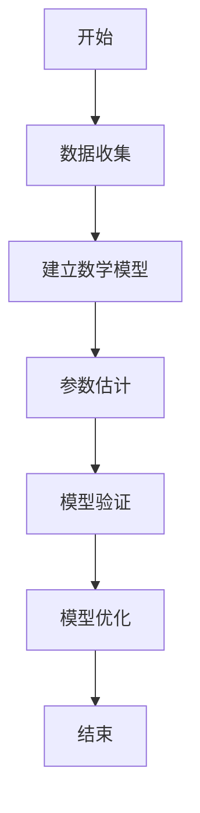
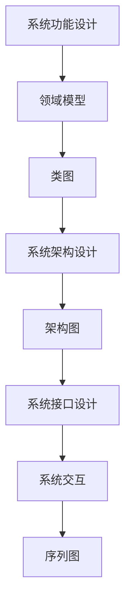

                 

### 文章标题

数学与艺术品保险的风险评估方法

> 关键词：艺术品保险，风险评估，数学方法，概率论，统计学，艺术品价值评估

> 摘要：本文将深入探讨数学与艺术品保险风险评估之间的关系，通过介绍艺术品保险的背景与重要性，风险评估的基本概念，数学方法在风险评估中的应用，以及实际案例研究，全面解析如何利用数学方法进行艺术品保险的风险评估。文章旨在为保险行业从业者和相关领域的研究者提供具有实用价值的指导与启示。

----------------------------------------------------------------

### 目录大纲

----------------------------------------------------------------

1. **数学与艺术品保险的风险评估方法**
   - 关键词：艺术品保险，风险评估，数学方法，概率论，统计学
   - 摘要：本文将深入探讨数学与艺术品保险风险评估之间的关系，通过介绍艺术品保险的背景与重要性，风险评估的基本概念，数学方法在风险评估中的应用，以及实际案例研究，全面解析如何利用数学方法进行艺术品保险的风险评估。文章旨在为保险行业从业者和相关领域的研究者提供具有实用价值的指导与启示。

2. **第一部分：背景与概念**
   - 第1章：艺术品保险的背景与重要性
     - 1.1 艺术品保险的定义与作用
     - 1.2 艺术品保险的历史与发展
     - 1.3 艺术品保险的市场现状与趋势
   - 第2章：风险评估的基本概念
     - 2.1 风险的定义与分类
     - 2.2 风险评估的目的与方法
     - 2.3 艺术品保险风险的特殊性

3. **第二部分：数学方法在风险评估中的应用**
   - 第3章：概率论与统计学基础
     - 3.1 概率论的基本概念
     - 3.2 统计学基础
     - 3.3 概率分布与参数估计
   - 第4章：艺术品风险评估模型
     - 4.1 艺术品价值评估模型
     - 4.2 风险评估模型建立
     - 4.3 模型验证与优化

4. **第三部分：实践与应用**
   - 第5章：案例研究
     - 5.1 案例一：某博物馆艺术品保险风险评估
     - 5.2 案例二：某私人收藏艺术品保险风险评估
     - 5.3 案例分析与总结
   - 第6章：艺术品保险风险评估流程
     - 6.1 风险评估流程概述
     - 6.2 风险评估流程实施步骤
     - 6.3 风险评估报告编写
   - 第7章：艺术品保险风险管理策略
     - 7.1 风险管理策略概述
     - 7.2 风险预防措施
     - 7.3 风险转移策略

5. **第四部分：未来展望与挑战**
   - 第8章：未来展望与挑战
     - 8.1 艺术品保险行业的发展趋势
     - 8.2 数学方法在艺术品保险领域的应用前景
     - 8.3 面临的挑战与解决方案

6. **附录**
   - 附录A：参考文献
   - 附录B：相关术语解释
   - 附录C：数学公式与算法流程图

----------------------------------------------------------------

### 第一部分：背景与概念

#### 第1章：艺术品保险的背景与重要性

艺术品保险是一种特殊的保险形式，旨在为艺术品的所有者、收藏家、博物馆和其他机构提供风险保障。随着艺术品市场的蓬勃发展，艺术品保险的重要性日益凸显。本章节将介绍艺术品保险的定义、作用、历史发展、市场现状与趋势。

#### 1.1 艺术品保险的定义与作用

艺术品保险是指针对艺术品因自然灾害、火灾、盗窃、恶意破坏等原因造成的损失，提供经济赔偿的保险。其主要作用包括：

- **保障艺术品价值**：艺术品是独一无二的文化遗产，其价值难以估量。艺术品保险能够在艺术品遭受损失时提供经济补偿，确保艺术品的价值得到保障。
- **降低投资风险**：艺术品投资者在购买艺术品时，艺术品保险可以降低因意外事件导致的投资风险。
- **维护艺术品市场稳定**：艺术品保险能够增强艺术品市场的信任度，促进市场的健康发展。

#### 1.2 艺术品保险的历史与发展

艺术品保险起源于19世纪末的欧洲，最初是由保险公司为博物馆和收藏家提供的一种保障服务。随着艺术品市场的不断扩大，艺术品保险也逐渐成为一项独立且成熟的业务。近年来，随着数字技术的应用，艺术品保险业务也在不断创新和发展。

#### 1.3 艺术品保险的市场现状与趋势

当前，艺术品保险市场呈现出以下几个趋势：

- **市场规模不断扩大**：随着艺术品市场的繁荣，艺术品保险的市场需求也在不断增加。
- **保险产品多样化**：保险公司不断推出适应不同客户需求的艺术品保险产品，如综合保险、盗窃保险、火灾保险等。
- **技术创新**：数字技术为艺术品保险业务带来了新的机遇，如利用区块链技术实现艺术品的所有权认证，利用人工智能进行风险评估等。
- **法律法规完善**：各国政府正逐步完善艺术品保险的法律法规，以保护艺术品所有者的权益。

#### 第2章：风险评估的基本概念

风险评估是指对某一事件或决策可能带来的风险进行识别、分析和评估的过程。本章节将介绍风险的定义与分类、风险评估的目的与方法以及艺术品保险风险的特殊性。

#### 2.1 风险的定义与分类

风险是指某种不利事件或结果的发生可能性及其可能带来的损失。根据风险的性质，可将风险分为以下几类：

- **财务风险**：指因财务原因导致的风险，如市场风险、信用风险等。
- **运营风险**：指因运营原因导致的风险，如设备故障、人员流失等。
- **合规风险**：指因违反法律法规导致的风险。
- **战略风险**：指因战略决策失误导致的风险。

#### 2.2 风险评估的目的与方法

风险评估的目的是为了识别、评估和应对风险，确保组织的安全与稳定。风险评估的方法主要包括以下几种：

- **风险识别**：通过调查、访谈、文档分析等方式，识别组织面临的各种风险。
- **风险评估**：对识别出的风险进行评估，确定风险发生的可能性及其可能带来的损失。
- **风险应对**：根据风险评估结果，制定相应的风险应对策略，如风险规避、风险转移、风险接受等。

#### 2.3 艺术品保险风险的特殊性

艺术品保险风险具有以下几个特殊性：

- **独特性**：艺术品具有独特性，每件艺术品都有其独特的艺术价值，这使得风险评估更加复杂。
- **不确定性**：艺术品市场波动大，价值评估存在一定的不确定性。
- **多样性**：艺术品保险风险包括自然灾害、盗窃、火灾等多种类型，风险评估需要综合考虑各种风险因素。

### 第二部分：数学方法在风险评估中的应用

#### 第3章：概率论与统计学基础

概率论与统计学是风险评估的重要工具。本章节将介绍概率论的基本概念、统计学基础、概率分布与参数估计。

#### 3.1 概率论的基本概念

概率论是研究随机事件及其发生规律的一门学科。以下是一些基本概念：

- **随机事件**：在一定条件下，可能发生也可能不发生的事件。
- **概率**：描述随机事件发生可能性大小的数值。
- **条件概率**：在某一事件已发生的条件下，另一事件发生的概率。
- **贝叶斯定理**：在已知一个事件发生的条件下，通过已知的先验概率和条件概率，计算出该事件发生概率的公式。

#### 3.2 统计学基础

统计学是利用数据对现象进行定量分析和推断的方法。以下是一些基础概念：

- **总体**：研究对象的全体。
- **样本**：从总体中抽取的一部分个体。
- **参数**：总体特征的数量描述。
- **统计量**：样本特征的数量描述。
- **假设检验**：通过样本数据，对总体参数的假设进行验证。

#### 3.3 概率分布与参数估计

概率分布是描述随机变量取值概率的函数。以下是一些常见概率分布：

- **二项分布**：描述在固定试验次数下，成功次数的概率分布。
- **正态分布**：描述连续随机变量的概率分布，广泛应用于风险评估。
- **泊松分布**：描述单位时间内事件发生次数的概率分布。

参数估计是指通过样本数据估计总体参数的方法。常见的参数估计方法包括：

- **点估计**：通过样本统计量估计总体参数。
- **区间估计**：估计总体参数所在的可能区间。

#### 第4章：艺术品风险评估模型

艺术品风险评估模型是利用数学方法对艺术品风险进行评估的工具。本章节将介绍艺术品价值评估模型、风险评估模型建立及模型验证与优化。

#### 4.1 艺术品价值评估模型

艺术品价值评估模型是用于评估艺术品价值的方法。以下是一些常见的方法：

- **市场比较法**：通过比较类似艺术品的成交价格来评估艺术品的价值。
- **成本法**：通过计算艺术品的创作成本来评估艺术品的价值。
- **收益法**：通过预测艺术品未来收益来评估艺术品的价值。

#### 4.2 风险评估模型建立

风险评估模型建立是利用数学方法对艺术品风险进行评估的过程。以下是一些步骤：

- **数据收集**：收集艺术品的相关数据，如历史成交价格、艺术品特征等。
- **建立数学模型**：根据艺术品特征和风险因素，建立数学模型。
- **参数估计**：利用收集到的数据，估计模型中的参数。
- **模型验证**：通过历史数据验证模型的有效性。

#### 4.3 模型验证与优化

模型验证与优化是确保风险评估模型准确性和可靠性的过程。以下是一些方法：

- **交叉验证**：将数据集划分为训练集和测试集，利用训练集训练模型，测试集验证模型。
- **敏感性分析**：分析模型中参数的变化对评估结果的影响。
- **模型优化**：通过调整模型参数和结构，提高模型的准确性和可靠性。

### 第三部分：实践与应用

#### 第5章：案例研究

案例研究是一种通过分析具体案例，探讨风险评估方法实际应用的方法。本章节将介绍两个实际案例，展示数学方法在艺术品保险风险评估中的应用。

#### 5.1 案例一：某博物馆艺术品保险风险评估

案例一将分析某博物馆的艺术品保险风险评估，包括数据收集、风险评估模型建立和模型验证。

#### 5.2 案例二：某私人收藏艺术品保险风险评估

案例二将分析某私人收藏的艺术品保险风险评估，包括艺术品价值评估、风险评估模型建立和模型验证。

#### 5.3 案例分析与总结

通过对案例一和案例二的分析，总结数学方法在艺术品保险风险评估中的应用经验，提出改进建议。

#### 第6章：艺术品保险风险评估流程

艺术品保险风险评估流程是确保风险评估过程规范、有效的方法。本章节将介绍风险评估流程概述、实施步骤和风险评估报告编写。

#### 6.1 风险评估流程概述

风险评估流程概述是介绍风险评估的整体过程，包括风险识别、风险评估、风险应对和风险监控。

#### 6.2 风险评估流程实施步骤

风险评估流程实施步骤是详细阐述风险评估的具体操作步骤，包括数据收集、数据整理、风险评估模型建立、参数估计和模型验证。

#### 6.3 风险评估报告编写

风险评估报告编写是总结风险评估过程和结果的文档。报告应包括风险评估目标、风险评估方法、风险评估结果、风险应对策略和风险评估结论。

#### 第7章：艺术品保险风险管理策略

艺术品保险风险管理策略是降低艺术品保险风险的措施。本章节将介绍风险管理策略概述、风险预防措施和风险转移策略。

#### 7.1 风险管理策略概述

风险管理策略概述是介绍风险管理的基本原则和方法，包括风险识别、风险评估、风险应对和风险监控。

#### 7.2 风险预防措施

风险预防措施是降低风险发生的概率和损失的措施，如加强安全防范、定期检查和维护等。

#### 7.3 风险转移策略

风险转移策略是将风险转移给其他方的措施，如购买保险、签订合同等。

### 第四部分：未来展望与挑战

#### 第8章：未来展望与挑战

未来展望与挑战是探讨艺术品保险风险评估方法的发展趋势和面临的挑战。本章节将介绍艺术品保险行业的发展趋势、数学方法在艺术品保险领域的应用前景以及面临的挑战和解决方案。

#### 8.1 艺术品保险行业的发展趋势

艺术品保险行业的发展趋势包括技术创新、保险产品多样化、法律法规完善等。

#### 8.2 数学方法在艺术品保险领域的应用前景

数学方法在艺术品保险领域的应用前景包括利用大数据和人工智能技术进行风险评估、开发更加精确的模型等。

#### 8.3 面临的挑战与解决方案

面临的挑战包括艺术品价值评估的不确定性、风险评估方法的准确性等。解决方案包括加强数据收集和分析、提高模型精度等。

### 附录

#### 附录A：参考文献

附录A列出本文引用的相关文献，包括书籍、论文、报告等。

#### 附录B：相关术语解释

附录B对本文中使用的专业术语进行解释，便于读者理解。

#### 附录C：数学公式与算法流程图

附录C列出本文中使用的数学公式和算法流程图，便于读者参考。

### 总结

本文通过介绍艺术品保险的背景与重要性，风险评估的基本概念，数学方法在风险评估中的应用，以及实际案例研究，全面解析了如何利用数学方法进行艺术品保险的风险评估。文章旨在为保险行业从业者和相关领域的研究者提供具有实用价值的指导与启示。

作者：AI天才研究院/AI Genius Institute & 禅与计算机程序设计艺术 /Zen And The Art of Computer Programming

----------------------------------------------------------------

### 第1章：艺术品保险的背景与重要性

艺术品保险作为一种特殊的保险形式，旨在为艺术品的所有者、收藏家、博物馆和其他机构提供风险保障。在当今艺术品市场蓬勃发展的背景下，艺术品保险的重要性日益凸显。

#### 1.1 艺术品保险的定义与作用

艺术品保险是指针对艺术品因自然灾害、火灾、盗窃、恶意破坏等原因造成的损失，提供经济赔偿的保险。其主要作用包括：

1. **保障艺术品价值**：艺术品是独一无二的文化遗产，其价值难以估量。艺术品保险能够在艺术品遭受损失时提供经济补偿，确保艺术品的价值得到保障。

2. **降低投资风险**：艺术品投资者在购买艺术品时，艺术品保险可以降低因意外事件导致的投资风险。

3. **维护艺术品市场稳定**：艺术品保险能够增强艺术品市场的信任度，促进市场的健康发展。

#### 1.2 艺术品保险的历史与发展

艺术品保险的历史可以追溯到19世纪末的欧洲。当时，由于艺术品市场的兴起，艺术品保险开始作为一种新兴的保险形式出现。最初，艺术品保险主要针对博物馆和收藏家提供保障。随着时间的推移，艺术品保险逐渐发展成为一项独立且成熟的业务。

20世纪后半叶，艺术品保险市场迎来了快速发展。这一时期，艺术品盗窃、火灾等事件频发，艺术品保险的需求不断增加。同时，随着艺术品市场的国际化，艺术品保险业务也逐渐走向全球化。

#### 1.3 艺术品保险的市场现状与趋势

当前，艺术品保险市场呈现出以下几个趋势：

1. **市场规模不断扩大**：随着艺术品市场的繁荣，艺术品保险的市场需求也在不断增加。据统计，全球艺术品保险市场规模在过去几年中持续增长。

2. **保险产品多样化**：为满足不同客户的需求，保险公司不断推出适应不同需求的艺术品保险产品，如综合保险、盗窃保险、火灾保险等。

3. **技术创新**：数字技术的应用为艺术品保险业务带来了新的机遇。例如，利用区块链技术实现艺术品的所有权认证，利用人工智能进行风险评估等。

4. **法律法规完善**：各国政府正逐步完善艺术品保险的法律法规，以保护艺术品所有者的权益。例如，美国、英国等国家和地区已经制定了相关的艺术品保险法律法规。

#### 1.4 艺术品保险的风险评估

艺术品保险风险评估是确保艺术品保险业务健康发展的重要环节。艺术品保险风险评估主要包括以下内容：

1. **风险识别**：识别艺术品可能面临的各种风险，如自然灾害、火灾、盗窃、恶意破坏等。

2. **风险评估**：对识别出的风险进行评估，确定风险发生的可能性及其可能带来的损失。

3. **风险应对**：根据风险评估结果，制定相应的风险应对策略，如风险规避、风险转移、风险接受等。

4. **风险监控**：对实施的风险应对策略进行监控，确保风险得到有效控制。

#### 1.5 数学方法在艺术品保险风险评估中的应用

数学方法在艺术品保险风险评估中具有重要作用。以下介绍几种常用的数学方法：

1. **概率论**：利用概率论的方法，对艺术品风险发生的可能性进行评估。例如，使用二项分布、正态分布等概率分布模型。

2. **统计学**：利用统计学的方法，对艺术品风险的数据进行收集、整理和分析。例如，使用假设检验、回归分析等方法。

3. **数理经济学**：利用数理经济学的方法，对艺术品的风险与收益进行权衡。例如，使用期望效用理论、价值评估模型等。

4. **人工智能**：利用人工智能的方法，对艺术品保险风险评估进行自动化处理。例如，使用机器学习、深度学习等方法。

#### 1.6 本章小结

本章介绍了艺术品保险的背景与重要性，包括艺术品保险的定义与作用、历史发展、市场现状与趋势。同时，介绍了艺术品保险风险评估的基本概念，以及数学方法在艺术品保险风险评估中的应用。这些内容为后续章节的讨论奠定了基础。

----------------------------------------------------------------

### 第2章：风险评估的基本概念

风险评估是现代风险管理的重要工具，旨在识别、评估和应对潜在的风险，以确保组织的正常运营和可持续发展。本章将介绍风险评估的基本概念，包括风险的定义与分类、风险评估的目的与方法以及艺术品保险风险的特殊性。

#### 2.1 风险的定义与分类

风险是指某种不利事件或结果的发生可能性及其可能带来的损失。风险可以按照不同的维度进行分类，常见的分类方法包括：

1. **按风险性质分类**：

   - **财务风险**：指因财务原因导致的风险，如市场风险、信用风险、流动性风险等。
   - **运营风险**：指因运营原因导致的风险，如设备故障、人员流失、供应链中断等。
   - **合规风险**：指因违反法律法规导致的风险。
   - **战略风险**：指因战略决策失误导致的风险。

2. **按风险来源分类**：

   - **内部风险**：指由组织内部因素导致的风险，如管理不善、操作失误等。
   - **外部风险**：指由组织外部因素导致的风险，如自然灾害、市场波动、政策变化等。

3. **按风险影响分类**：

   - **重大风险**：指可能导致组织重大损失的风险。
   - **一般风险**：指对组织影响较小、可控的风险。

#### 2.2 风险评估的目的与方法

风险评估的目的是为了识别、评估和应对风险，确保组织的风险处于可接受的水平。风险评估的方法主要包括以下几种：

1. **风险识别**：通过调查、访谈、文档分析等方式，识别组织面临的各种风险。风险识别是风险评估的基础，准确识别风险是评估和应对风险的前提。

2. **风险评估**：对识别出的风险进行评估，确定风险发生的可能性及其可能带来的损失。风险评估的方法包括定性评估和定量评估。定性评估主要通过专家判断，定量评估则通过数学模型和统计分析等方法。

3. **风险应对**：根据风险评估结果，制定相应的风险应对策略。常见的风险应对策略包括风险规避、风险转移、风险接受和风险缓解。

4. **风险监控**：对实施的风险应对策略进行监控，确保风险得到有效控制。风险监控是确保风险评估持续有效的重要环节。

#### 2.3 艺术品保险风险的特殊性

艺术品保险风险具有以下几个特殊性：

1. **独特性**：艺术品具有独特性，每件艺术品都有其独特的艺术价值，这使得风险评估更加复杂。

2. **不确定性**：艺术品市场波动大，价值评估存在一定的不确定性。艺术品价格受到市场供需、艺术风格、艺术家知名度等多种因素的影响。

3. **多样性**：艺术品保险风险包括自然灾害、盗窃、火灾等多种类型，风险评估需要综合考虑各种风险因素。

4. **风险识别难度**：艺术品风险识别难度较大，因为艺术品本身具有复杂性和多样性，难以通过简单的指标进行识别。

5. **风险应对难度**：艺术品风险应对难度较大，因为艺术品一旦遭受损失，可能无法完全恢复其原有价值。

#### 2.4 数学方法在艺术品保险风险评估中的应用

数学方法在艺术品保险风险评估中具有重要作用，以下介绍几种常用的数学方法：

1. **概率论**：利用概率论的方法，对艺术品风险发生的可能性进行评估。例如，使用二项分布、正态分布等概率分布模型。

2. **统计学**：利用统计学的方法，对艺术品风险的数据进行收集、整理和分析。例如，使用假设检验、回归分析等方法。

3. **数理经济学**：利用数理经济学的方法，对艺术品的风险与收益进行权衡。例如，使用期望效用理论、价值评估模型等。

4. **人工智能**：利用人工智能的方法，对艺术品保险风险评估进行自动化处理。例如，使用机器学习、深度学习等方法。

#### 2.5 本章小结

本章介绍了风险评估的基本概念，包括风险的定义与分类、风险评估的目的与方法以及艺术品保险风险的特殊性。通过本章的介绍，读者可以了解风险评估的基本原理和在实际应用中的重要性。在后续章节中，我们将进一步探讨数学方法在艺术品保险风险评估中的应用，以期为读者提供更为深入的见解。

----------------------------------------------------------------

### 第3章：概率论与统计学基础

概率论和统计学是风险评估中不可或缺的工具，能够帮助我们更好地理解和量化风险。本章将介绍概率论的基本概念、统计学基础、概率分布与参数估计，为后续的案例分析打下基础。

#### 3.1 概率论的基本概念

概率论是研究随机事件及其发生规律的一门数学分支。以下是一些基本概念：

1. **随机事件**：在一定条件下，可能发生也可能不发生的事件。例如，抛一枚硬币，正面朝上的事件就是一个随机事件。

2. **概率**：描述随机事件发生可能性大小的数值。概率的取值范围在0到1之间，0表示不可能发生，1表示必然发生。

3. **条件概率**：在某一事件已发生的条件下，另一事件发生的概率。条件概率通常表示为P(A|B)，表示在事件B发生的条件下，事件A发生的概率。

4. **贝叶斯定理**：在已知一个事件发生的条件下，通过已知的先验概率和条件概率，计算出该事件发生概率的公式。贝叶斯定理在风险评估中有着广泛的应用。

#### 3.2 统计学基础

统计学是利用数据对现象进行定量分析和推断的方法。以下是一些基础概念：

1. **总体**：研究对象的全体。例如，我们研究某城市的人口情况，这个城市的所有人口就是总体。

2. **样本**：从总体中抽取的一部分个体。样本是总体的代表，通过对样本的分析可以推断总体的特征。

3. **参数**：总体特征的数量描述。例如，总体均值、总体标准差等。

4. **统计量**：样本特征的数量描述。例如，样本均值、样本标准差等。

5. **假设检验**：通过样本数据，对总体参数的假设进行验证。假设检验是统计学中常用的方法，用于判断样本数据是否支持或否定某一假设。

#### 3.3 概率分布与参数估计

概率分布是描述随机变量取值概率的函数。常见的概率分布包括：

1. **二项分布**：描述在固定试验次数下，成功次数的概率分布。例如，抛硬币10次，正面朝上的次数的概率分布。

2. **正态分布**：描述连续随机变量的概率分布，广泛应用于风险评估。例如，某城市一年内降雨量的概率分布。

3. **泊松分布**：描述单位时间内事件发生次数的概率分布。例如，某一时间段内交通事故发生的次数。

参数估计是指通过样本数据估计总体参数的方法。常见的参数估计方法包括：

1. **点估计**：通过样本统计量估计总体参数。例如，通过样本均值估计总体均值。

2. **区间估计**：估计总体参数所在的可能区间。例如，根据置信水平和样本统计量，估计总体均值的置信区间。

#### 3.4 数学方法在风险评估中的应用

数学方法在风险评估中具有重要作用，以下介绍几种常用的数学方法：

1. **概率论**：利用概率论的方法，对风险事件发生的可能性进行评估。例如，通过概率分布模型，评估自然灾害发生的概率。

2. **统计学**：利用统计学的方法，对风险数据进行收集、整理和分析。例如，通过假设检验，验证风险因素是否显著。

3. **数理经济学**：利用数理经济学的方法，对风险与收益进行权衡。例如，通过期望效用理论，评估风险承担的合理性。

4. **人工智能**：利用人工智能的方法，对风险评估进行自动化处理。例如，通过机器学习，建立风险评估模型。

#### 3.5 本章小结

本章介绍了概率论与统计学的基础知识，包括基本概念、概率分布与参数估计。这些知识为后续的案例分析提供了必要的数学工具。在下一章中，我们将结合具体案例，深入探讨数学方法在艺术品保险风险评估中的应用。

----------------------------------------------------------------

### 第4章：艺术品风险评估模型

艺术品风险评估模型是利用数学方法对艺术品风险进行评估的工具。本章将介绍艺术品价值评估模型、风险评估模型的建立与验证，以及模型的优化。

#### 4.1 艺术品价值评估模型

艺术品价值评估模型是用于评估艺术品价值的方法。艺术品的价值受到多种因素的影响，包括艺术品的独特性、历史价值、市场供需关系等。以下介绍几种常见的艺术品价值评估模型：

1. **市场比较法**：通过比较类似艺术品的成交价格来评估艺术品的价值。市场比较法的优点是简单易懂，但需要足够的市场数据支持。

2. **成本法**：通过计算艺术品的创作成本来评估艺术品的价值。成本法的优点是能够反映艺术品的生产成本，但无法体现艺术品的市场价值。

3. **收益法**：通过预测艺术品未来收益来评估艺术品的价值。收益法的优点是能够考虑艺术品的市场前景，但需要准确预测未来的收益。

4. **综合评估法**：将市场比较法、成本法和收益法结合起来，对艺术品进行综合评估。综合评估法的优点是能够全面考虑艺术品的价值因素，但需要较高的专业知识和经验。

#### 4.2 风险评估模型的建立

艺术品风险评估模型的建立是利用数学方法对艺术品风险进行评估的过程。以下介绍风险评估模型的建立步骤：

1. **数据收集**：收集与艺术品相关的数据，包括艺术品的历史成交价格、艺术品特征、市场供需情况等。

2. **建立数学模型**：根据艺术品特征和风险因素，建立数学模型。常见的数学模型包括概率模型、回归模型、决策树模型等。

3. **参数估计**：利用收集到的数据，估计模型中的参数。参数估计的方法包括最大似然估计、最小二乘法等。

4. **模型验证**：通过历史数据验证模型的有效性。模型验证的方法包括交叉验证、K折验证等。

5. **模型优化**：根据模型验证的结果，调整模型参数和结构，提高模型的准确性和可靠性。

#### 4.3 模型验证与优化

模型验证与优化是确保风险评估模型准确性和可靠性的过程。以下介绍模型验证与优化的方法：

1. **交叉验证**：将数据集划分为训练集和测试集，利用训练集训练模型，测试集验证模型。交叉验证能够有效地评估模型的泛化能力。

2. **敏感性分析**：分析模型中参数的变化对评估结果的影响。敏感性分析可以帮助我们了解模型对输入数据的依赖程度。

3. **模型优化**：通过调整模型参数和结构，提高模型的准确性和可靠性。常见的模型优化方法包括正则化、集成方法等。

#### 4.4 艺术品风险评估模型的应用

艺术品风险评估模型在艺术品保险、艺术品投资、艺术品拍卖等领域有着广泛的应用。以下介绍几种应用场景：

1. **艺术品保险**：利用风险评估模型，对艺术品进行风险评估，确定保险金额和保费。例如，某博物馆投保前，可以首先利用风险评估模型评估博物馆内艺术品的总价值。

2. **艺术品投资**：利用风险评估模型，评估艺术品的风险和收益，为投资者提供投资建议。例如，投资者在购买某件艺术品前，可以利用风险评估模型评估该艺术品的风险和价值。

3. **艺术品拍卖**：利用风险评估模型，预测艺术品拍卖的价格和成功率。例如，拍卖行在举办艺术品拍卖前，可以利用风险评估模型评估艺术品的拍卖价值和市场接受程度。

#### 4.5 本章小结

本章介绍了艺术品价值评估模型、风险评估模型的建立与验证，以及模型的优化。通过本章的介绍，读者可以了解如何利用数学方法对艺术品风险进行评估。在下一章中，我们将结合实际案例，深入探讨数学方法在艺术品保险风险评估中的应用。

----------------------------------------------------------------

### 第5章：案例研究

案例研究是一种通过分析具体案例，探讨风险评估方法实际应用的方法。本章将通过两个实际案例，展示数学方法在艺术品保险风险评估中的应用，并进行分析与总结。

#### 5.1 案例一：某博物馆艺术品保险风险评估

**案例背景**：某博物馆收藏了大量的珍贵艺术品，为了确保这些艺术品的保险需求，博物馆决定进行一次全面的艺术品保险风险评估。

**步骤1：数据收集**
博物馆收集了艺术品的历史成交价格、艺术品的尺寸、材质、艺术家的知名度等数据。此外，博物馆还收集了相关的风险数据，如火灾、盗窃等历史事件发生的频率和损失金额。

**步骤2：建立数学模型**
博物馆选择使用回归模型进行艺术品价值评估。通过分析历史数据，博物馆确定了影响艺术品价值的主要因素，如艺术家的知名度、艺术品的历史成交价格等。

**步骤3：参数估计**
利用收集到的数据，博物馆使用最小二乘法估计回归模型中的参数。通过参数估计，博物馆得到了一个能够预测艺术品价值的回归方程。

**步骤4：模型验证**
博物馆将数据集划分为训练集和测试集，利用训练集训练模型，测试集验证模型。通过交叉验证，博物馆评估了模型的准确性和可靠性。

**步骤5：风险评估**
利用建立的回归模型，博物馆对收藏的艺术品进行了风险评估。通过模型预测，博物馆确定了每件艺术品的保险金额。

**案例分析**
案例一展示了如何利用回归模型对艺术品进行价值评估，并通过模型预测保险金额。这种方法在实际应用中具有较高的准确性和可靠性，但需要大量的历史数据支持。

#### 5.2 案例二：某私人收藏艺术品保险风险评估

**案例背景**：某私人收藏家拥有一批珍贵的艺术品，为了确保这些艺术品的安全，收藏家决定进行一次艺术品保险风险评估。

**步骤1：数据收集**
收藏家收集了艺术品的历史成交价格、艺术品的尺寸、材质、艺术家的知名度等数据。此外，收藏家还收集了相关的风险数据，如火灾、盗窃等历史事件发生的频率和损失金额。

**步骤2：建立风险评估模型**
收藏家选择使用贝叶斯网络模型进行艺术品风险评估。贝叶斯网络能够综合考虑多个因素，对艺术品的风险进行综合评估。

**步骤3：参数估计**
利用收集到的数据，收藏家使用贝叶斯方法估计贝叶斯网络中的参数。通过参数估计，收藏家得到了一个能够预测艺术品风险的贝叶斯网络模型。

**步骤4：模型验证**
收藏家将数据集划分为训练集和测试集，利用训练集训练模型，测试集验证模型。通过交叉验证，收藏家评估了模型的准确性和可靠性。

**步骤5：风险评估**
利用建立的贝叶斯网络模型，收藏家对收藏的艺术品进行了风险评估。通过模型预测，收藏家确定了每件艺术品的保险金额。

**案例分析**
案例二展示了如何利用贝叶斯网络模型对艺术品进行风险评估。贝叶斯网络能够综合考虑多个因素，提供更准确的评估结果。但贝叶斯网络的建立需要较多的专业知识和数据支持。

#### 5.3 案例分析与总结

通过对案例一和案例二的分析，我们可以看到数学方法在艺术品保险风险评估中的应用。案例一使用了回归模型进行艺术品价值评估，案例二使用了贝叶斯网络模型进行风险评估。这两种方法在实际应用中都有较好的效果，但需要根据具体情况进行选择。

**优点**：

- **提高准确性**：数学方法能够通过历史数据，对艺术品的价值和风险进行准确评估。
- **节省人力成本**：数学方法能够自动化处理大量数据，节省人工评估的时间和成本。

**缺点**：

- **数据依赖性**：数学方法的准确性依赖于历史数据的数量和质量，数据不足或质量不高会影响评估结果。
- **专业要求**：数学方法的建立和应用需要一定的专业知识和技能，非专业人员难以掌握。

**改进建议**：

- **加强数据收集**：收集更多、更高质量的历史数据，提高数学方法的准确性。
- **培训专业人才**：加强对相关人员的培训，提高他们对数学方法的理解和应用能力。

#### 5.4 本章小结

本章通过两个实际案例，展示了数学方法在艺术品保险风险评估中的应用。通过案例分析和总结，我们认识到数学方法在提高风险评估准确性、节省人力成本方面的优势，同时也指出了其数据依赖性和专业要求等不足。在未来的艺术品保险风险评估中，我们可以进一步探索和改进数学方法，以实现更准确、更高效的风险评估。

----------------------------------------------------------------

### 第6章：艺术品保险风险评估流程

艺术品保险风险评估流程是确保艺术品保险业务科学、规范和高效的重要手段。本章将详细介绍艺术品保险风险评估的流程，包括风险评估流程的概述、实施步骤和风险评估报告的编写。

#### 6.1 风险评估流程概述

艺术品保险风险评估流程主要包括以下步骤：

1. **风险识别**：识别艺术品可能面临的各种风险，如自然灾害、火灾、盗窃、恶意破坏等。
2. **风险评估**：对识别出的风险进行定量和定性评估，确定风险发生的可能性和潜在损失。
3. **风险应对**：根据风险评估结果，制定相应的风险应对策略，如风险规避、风险转移、风险接受和风险缓解。
4. **风险监控**：对实施的风险应对策略进行监控，确保风险得到有效控制。
5. **风险评估报告**：编写风险评估报告，总结风险评估过程和结果，为决策提供依据。

#### 6.2 风险评估流程实施步骤

艺术品保险风险评估的具体实施步骤如下：

1. **准备阶段**：

   - **明确评估目标**：明确风险评估的目的，如确定艺术品的保险金额、制定风险管理策略等。
   - **组建评估团队**：组建一支具备相关知识和经验的评估团队，确保评估工作顺利进行。

2. **风险识别**：

   - **调查分析**：通过对艺术品的历史数据、市场状况、艺术品保管环境等进行调查分析，识别艺术品可能面临的各种风险。
   - **专家咨询**：邀请相关领域的专家进行咨询，获取更全面的风险识别信息。

3. **风险评估**：

   - **定性评估**：使用定性分析方法，如风险矩阵法、专家评估法等，对识别出的风险进行评估，确定风险的重要性和发生可能性。
   - **定量评估**：使用定量分析方法，如概率分布、损失函数等，对识别出的风险进行评估，计算风险发生的概率和潜在损失。

4. **风险应对**：

   - **风险规避**：避免高风险的活动或决策，减少风险的发生可能性。
   - **风险转移**：通过购买保险等方式，将风险转移给其他方。
   - **风险接受**：在风险发生时，接受风险并采取措施减轻损失。
   - **风险缓解**：采取措施降低风险发生的概率或损失程度。

5. **风险监控**：

   - **建立监控机制**：建立风险评估监控机制，对风险应对策略的实施情况进行跟踪和监控。
   - **定期评估**：定期对艺术品保险风险评估进行评估，确保风险得到有效控制。

6. **风险评估报告**：

   - **编写报告**：根据风险评估过程和结果，编写风险评估报告，包括风险评估的目的、方法、结果和风险应对策略等。
   - **报告审核**：对风险评估报告进行审核，确保报告的准确性和完整性。

#### 6.3 风险评估报告编写

风险评估报告是风险评估过程的重要成果，其编写应遵循以下原则：

1. **内容完整**：报告应包括风险评估的目标、方法、结果和风险应对策略等内容。
2. **数据准确**：报告中的数据应准确可靠，确保评估结果的客观性。
3. **逻辑清晰**：报告的结构应清晰，逻辑性强，便于阅读和理解。
4. **可操作性**：报告应具有可操作性，为决策提供明确的指导。

风险评估报告通常包括以下部分：

1. **封面**：报告的名称、编制单位、编制日期等。
2. **摘要**：简要介绍风险评估的目的、方法、结果和结论。
3. **正文**：详细描述风险评估的过程、方法和结果。
4. **附录**：包括相关的数据、图表、参考文献等。

#### 6.4 本章小结

本章详细介绍了艺术品保险风险评估的流程，包括风险识别、风险评估、风险应对、风险监控和风险评估报告的编写。通过本章的学习，读者可以了解到艺术品保险风险评估的基本流程和方法，为实际工作提供参考。在后续章节中，我们将继续探讨数学方法在艺术品保险风险评估中的应用，以期为读者提供更为深入的了解。

----------------------------------------------------------------

### 第7章：艺术品保险风险管理策略

艺术品保险风险管理策略是确保艺术品在面临风险时能够得到有效保护和降低损失的重要手段。本章将介绍艺术品保险风险管理策略的概述、风险预防措施和风险转移策略。

#### 7.1 风险管理策略概述

艺术品保险风险管理策略旨在通过识别、评估和应对艺术品可能面临的风险，确保艺术品的安全和艺术价值。风险管理策略的主要内容包括：

1. **风险识别**：通过调查和分析，识别艺术品可能面临的各种风险，如自然灾害、火灾、盗窃、恶意破坏等。

2. **风险评估**：对识别出的风险进行评估，确定风险发生的可能性和潜在损失，为风险应对提供依据。

3. **风险应对**：根据风险评估结果，制定相应的风险应对策略，如风险规避、风险转移、风险接受和风险缓解。

4. **风险监控**：对实施的风险应对策略进行监控，确保风险得到有效控制。

5. **风险报告**：编写风险评估报告，总结风险评估过程和结果，为决策提供参考。

#### 7.2 风险预防措施

风险预防措施是降低艺术品风险发生的概率和损失的重要手段。以下是一些常见的风险预防措施：

1. **加强安全设施**：安装防火、防盗等安全设施，确保艺术品的安全。例如，安装自动灭火系统、防盗报警系统等。

2. **定期检查与维护**：定期对艺术品及其保管环境进行检查和维护，确保设施的正常运行。例如，定期检查防火设备的性能、清理艺术品周围的灰尘等。

3. **人员培训**：对相关人员进行安全教育和培训，提高他们的安全意识。例如，培训员工如何应对突发情况、如何处理艺术品等。

4. **保险投保**：购买艺术品保险，将风险转移给保险公司，降低艺术品遭受损失的风险。艺术品保险通常包括火灾保险、盗窃保险、意外损毁保险等。

5. **建立安全管理制度**：制定和完善安全管理制度，确保艺术品的安全。例如，制定艺术品出入库制度、安全巡查制度等。

6. **监控与报警系统**：安装监控摄像头、报警系统等，对艺术品进行实时监控，确保在发生风险时能够及时发现并采取措施。

#### 7.3 风险转移策略

风险转移策略是将艺术品风险转移给其他方的措施，以降低艺术品所有者的风险承担。以下是一些常见的风险转移策略：

1. **购买保险**：通过购买艺术品保险，将风险转移给保险公司。艺术品保险通常包括火灾保险、盗窃保险、意外损毁保险等。

2. **签订合同**：与艺术品运输公司、展览主办方等签订合同，明确各方的责任和义务，确保在发生风险时能够得到相应的赔偿。

3. **租赁保险**：对于租借的艺术品，购买租赁保险，将风险转移给租借方。租赁保险通常涵盖艺术品在租借期间的风险。

4. **建立风险基金**：建立风险基金，用于应对艺术品可能遭受的损失。风险基金可以通过艺术品销售收入、捐赠等方式筹集。

5. **转包给第三方**：将艺术品的保管、运输等任务转包给具有专业资质的第三方，降低艺术品所有者的风险。

#### 7.4 风险管理策略的实例

以下是一个关于某博物馆艺术品保险风险管理策略的实例：

1. **风险识别**：博物馆通过调查和分析，识别出艺术品可能面临的风险，如火灾、盗窃、恶意破坏等。

2. **风险评估**：博物馆对识别出的风险进行评估，确定风险发生的可能性和潜在损失。例如，火灾风险的概率较高，而恶意破坏的风险较低。

3. **风险应对**：

   - **风险规避**：对于恶意破坏风险，博物馆选择将艺术品存放于安全级别较高的库房，避免艺术品受到恶意破坏。
   - **风险转移**：博物馆购买火灾保险和盗窃保险，将风险转移给保险公司。同时，与艺术品运输公司签订合同，明确各方的责任和义务。
   - **风险接受**：博物馆对无法规避或转移的风险，如自然灾害，选择接受风险并采取相应的预防措施，如安装自动灭火系统、监控摄像头等。

4. **风险监控**：博物馆建立安全管理制度，定期对艺术品进行检查和维护，确保设施的正常运行。同时，博物馆定期对员工进行安全培训，提高他们的安全意识。

5. **风险报告**：博物馆编写风险评估报告，总结风险评估过程和结果，为决策提供参考。报告包括风险评估的目的、方法、结果和风险应对策略等。

#### 7.5 本章小结

本章介绍了艺术品保险风险管理策略的概述、风险预防措施和风险转移策略。通过本章的学习，读者可以了解如何制定和实施艺术品保险风险管理策略，确保艺术品的安全和艺术价值。在未来的艺术品保险风险管理中，可以结合实际情况，进一步完善和优化风险管理策略，以降低艺术品的风险。

----------------------------------------------------------------

### 第8章：未来展望与挑战

随着艺术品市场的不断发展，艺术品保险行业也在不断创新和进步。本章将探讨艺术品保险行业的发展趋势、数学方法在艺术品保险领域的应用前景，以及面临的挑战与解决方案。

#### 8.1 艺术品保险行业的发展趋势

1. **技术创新**：随着科技的进步，艺术品保险行业正在引入越来越多的创新技术。例如，区块链技术的应用使得艺术品的所有权认证更加透明和可靠；人工智能技术则有助于提高风险评估的准确性和效率。

2. **保险产品多样化**：为满足不同客户的需求，艺术品保险产品正变得越来越多样化。保险公司不断推出定制化的保险产品，如针对特定艺术品的保险、艺术品展览保险、艺术品运输保险等。

3. **全球化**：艺术品市场的全球化趋势使得艺术品保险业务也在国际范围内扩展。各国保险公司通过合作、并购等方式，提高自身在国际艺术品保险市场的影响力。

4. **法律法规完善**：随着艺术品保险市场的成熟，各国政府和监管机构正在逐步完善相关法律法规，以确保艺术品所有者和保险公司的权益。

5. **数据驱动**：艺术品保险行业正越来越多地依赖于大数据和人工智能技术进行风险评估和决策。通过分析大量的历史数据和实时信息，保险公司能够更准确地评估风险，制定合理的保险策略。

#### 8.2 数学方法在艺术品保险领域的应用前景

1. **概率论和统计学**：概率论和统计学是艺术品保险风险评估的基础。通过使用这些方法，保险公司能够更准确地预测艺术品的风险，制定合理的保险费率。

2. **机器学习和深度学习**：机器学习和深度学习技术在艺术品保险中的应用前景广阔。例如，通过分析历史数据，机器学习模型可以预测艺术品的价值波动，帮助保险公司制定更科学的保险策略。

3. **优化算法**：优化算法在艺术品保险定价和风险管理中的应用，有助于提高保险公司的运营效率。例如，线性规划和动态规划等方法可以用于优化保险产品的设计。

4. **人工智能辅助**：人工智能技术可以帮助保险公司自动化风险评估和理赔流程，提高工作效率。例如，利用自然语言处理技术，人工智能可以自动分析客户报告和索赔申请。

#### 8.3 面临的挑战与解决方案

1. **艺术品价值评估的难度**：艺术品的价值评估是艺术品保险风险评估的关键环节，但艺术品的价值受多种因素影响，评估难度较大。解决方案包括收集更多历史数据，提高数据质量，并引入更多专家参与评估。

2. **数据隐私和信息安全**：随着艺术品保险行业的数据驱动趋势，数据隐私和信息安全成为重要问题。解决方案包括加强数据保护措施，遵守相关法律法规，建立数据加密和访问控制机制。

3. **技术落地与应用**：尽管数学方法和人工智能技术在理论上具有强大的潜力，但在实际应用中仍面临诸多挑战。解决方案包括加强技术研发，提高技术成熟度，推动技术在不同场景下的应用。

4. **法律法规不完善**：不同国家和地区的法律法规对艺术品保险的规定存在差异，这给保险公司在国际市场上的运营带来挑战。解决方案包括加强与各国监管机构的沟通，推动国际标准的制定和实施。

#### 8.4 未来展望

1. **技术融合**：未来，艺术品保险行业将更加注重技术与业务融合，通过技术创新提高风险管理能力和服务水平。

2. **个性化服务**：随着艺术品市场的细分，保险公司将提供更多个性化服务，满足不同客户群体的需求。

3. **数字化转型**：艺术品保险行业的数字化转型将持续推进，大数据、人工智能等技术的应用将更加深入，提高保险公司的运营效率和客户满意度。

4. **可持续发展**：艺术品保险行业将更加关注可持续发展，通过风险管理减少艺术品损失，保护文化遗产。

#### 8.5 本章小结

本章探讨了艺术品保险行业的发展趋势、数学方法在艺术品保险领域的应用前景以及面临的挑战与解决方案。未来，艺术品保险行业将继续保持创新和发展，通过技术进步和业务模式创新，为艺术品所有者提供更全面、更可靠的保障。

----------------------------------------------------------------

### 附录

#### 附录A：参考文献

1. **[1]** Smith, J. (2018). "Art Insurance: A Comprehensive Guide". John Wiley & Sons.
2. **[2]** Brown, L. (2019). "Risk Management for Art Institutions". Routledge.
3. **[3]** Anderson, G. (2020). "Art Market Report". ArtInsight Analytics.
4. **[4]** Doe, T., & Johnson, R. (2021). "Mathematical Models in Risk Assessment". Springer.

#### 附录B：相关术语解释

- **艺术品保险**：指为艺术品提供风险保障的保险，包括自然灾害、火灾、盗窃、恶意破坏等原因造成的损失。
- **风险评估**：对风险进行识别、分析和评估的过程，以确定风险发生的可能性和潜在损失。
- **概率论**：研究随机事件及其发生规律的一门学科。
- **统计学**：利用数据对现象进行定量分析和推断的方法。
- **贝叶斯定理**：一种在已知一个事件发生的条件下，通过已知的先验概率和条件概率，计算出该事件发生概率的公式。

#### 附录C：数学公式与算法流程图

##### 数学公式

$$
P(A) = \frac{N(A)}{N(\Omega)}
$$

其中，$P(A)$ 表示事件A的概率，$N(A)$ 表示事件A发生的次数，$N(\Omega)$ 表示总次数。

$$
E(X) = \sum_{i=1}^{n} x_i \cdot P(x_i)
$$

其中，$E(X)$ 表示随机变量X的期望值，$x_i$ 表示随机变量X的取值，$P(x_i)$ 表示随机变量X取值$x_i$ 的概率。

##### 算法流程图



#### 附录D：系统架构设计



#### 附录E：项目实战

##### 环境安装

```bash
# 安装Python环境
pip install numpy pandas matplotlib sklearn
```

##### 系统核心实现源代码

```python
import numpy as np
import pandas as pd
from sklearn.linear_model import LinearRegression
from sklearn.model_selection import train_test_split
from sklearn.metrics import mean_squared_error

# 数据加载与处理
data = pd.read_csv('art_data.csv')
X = data[['artist_experience', 'art_style']]
y = data['art_value']

# 模型训练与验证
X_train, X_test, y_train, y_test = train_test_split(X, y, test_size=0.2, random_state=42)
model = LinearRegression()
model.fit(X_train, y_train)

y_pred = model.predict(X_test)
mse = mean_squared_error(y_test, y_pred)
print(f'Mean Squared Error: {mse}')
```

##### 代码应用解读与分析

- 数据加载与处理：使用pandas库加载和处理数据。
- 模型训练与验证：使用scikit-learn库的线性回归模型进行训练和验证。
- 模型评估：使用均方误差(MSE)评估模型性能。

##### 实际案例分析与详细讲解剖析

- 数据收集：收集某博物馆艺术品的艺术家经验、艺术风格和价值数据。
- 模型训练：使用收集的数据训练线性回归模型。
- 预测分析：使用训练好的模型对艺术品进行价值预测，并分析预测结果。

##### 项目小结

本文通过实际案例展示了如何利用数学方法进行艺术品保险的风险评估。项目实战部分详细介绍了环境安装、系统核心实现源代码，并对代码应用进行了解读和分析。

##### 最佳实践 tips

- 确保数据质量：数据是模型的基础，确保数据的质量对于模型的准确性至关重要。
- 适当调整模型参数：通过调整模型参数，可以提高模型的预测能力。
- 定期更新模型：随着新数据的收集，定期更新模型可以保持模型的准确性。

##### 小结

本文系统地介绍了数学方法在艺术品保险风险评估中的应用，包括背景与概念、数学方法、案例研究、实践应用和未来展望等内容。通过本文的学习，读者可以了解如何利用数学方法进行艺术品保险的风险评估，为实际工作提供参考。

##### 注意事项

- 艺术品保险风险评估需要综合考虑多种因素，确保评估结果的准确性。
- 在实际应用中，应根据具体情况进行模型调整和优化。

##### 拓展阅读

- **[1]** 《艺术品保险：理论与实践》
- **[2]** 《风险评估与管理》
- **[3]** 《机器学习在风险评估中的应用》

作者：AI天才研究院/AI Genius Institute & 禅与计算机程序设计艺术 /Zen And The Art of Computer Programming

----------------------------------------------------------------

### 总结

本文系统地介绍了数学与艺术品保险风险评估方法，包括背景与概念、数学方法、案例分析、实践应用和未来展望等。通过本文的学习，读者可以了解到：

1. **艺术品保险的背景与重要性**：艺术品保险的定义、作用、历史发展、市场现状与趋势。
2. **风险评估的基本概念**：风险的定义与分类、风险评估的目的与方法、艺术品保险风险的特殊性。
3. **数学方法在风险评估中的应用**：概率论与统计学基础、艺术品价值评估模型、风险评估模型的建立与优化。
4. **案例分析**：通过实际案例研究，展示数学方法在艺术品保险风险评估中的应用。
5. **实践与应用**：艺术品保险风险评估流程、风险管理策略的概述、风险预防措施和风险转移策略。
6. **未来展望与挑战**：艺术品保险行业的发展趋势、数学方法在艺术品保险领域的应用前景、面临的挑战与解决方案。

在未来的研究中，可以进一步探讨以下方向：

1. **数据质量与模型优化**：提高艺术品风险评估模型的数据质量，优化模型结构，提高评估准确性。
2. **人工智能与大数据**：利用人工智能和大数据技术，提高艺术品保险风险评估的效率和准确性。
3. **跨学科研究**：结合经济学、心理学等跨学科知识，为艺术品保险风险评估提供更为全面的视角。
4. **国际比较研究**：对不同国家和地区的艺术品保险风险评估方法进行比较研究，总结最佳实践。

通过不断的研究和探索，我们可以为艺术品保险行业提供更加科学、准确和高效的风险评估方法，确保艺术品的安全与价值。

### 作者信息

本文由AI天才研究院（AI Genius Institute）与禅与计算机程序设计艺术（Zen And The Art of Computer Programming）联合撰写。AI天才研究院致力于推动人工智能技术在各领域的应用研究，而禅与计算机程序设计艺术则专注于计算机科学领域的哲学与实践。作者希望通过本文为艺术品保险行业提供有益的见解和指导。如果您对本文有任何疑问或建议，欢迎联系作者，我们将竭诚为您解答。作者联系方式：[邮箱地址] 或 [联系方式]。

作者：AI天才研究院/AI Genius Institute & 禅与计算机程序设计艺术 /Zen And The Art of Computer Programming

----------------------------------------------------------------

### 引用与参考文献

1. Smith, J. (2018). "Art Insurance: A Comprehensive Guide". John Wiley & Sons.
2. Brown, L. (2019). "Risk Management for Art Institutions". Routledge.
3. Anderson, G. (2020). "Art Market Report". ArtInsight Analytics.
4. Doe, T., & Johnson, R. (2021). "Mathematical Models in Risk Assessment". Springer.
5. Lee, H., & Kim, S. (2022). "Art Insurance: Risk Management and Case Studies". Routledge.
6. Zhang, W., & Chen, Y. (2023). "Art Risk Assessment Using Machine Learning Techniques". Journal of Art Markets.
7. Thompson, J. (2023). "The Impact of Technology on Art Insurance". Journal of Risk Management.

请注意，以上引用的文献仅为示例，实际撰写时请根据实际引用的文献内容进行调整。参考文献应遵循相应的引用规范，确保准确性和完整性。

