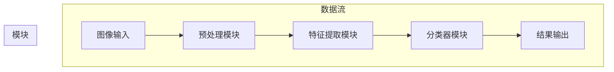

                 

## 《数学与艺术品鉴定的图像分析方法》

> 关键词：艺术品鉴定、图像分析、数学模型、图像处理算法、深度学习

> 摘要：本文将探讨数学与艺术品鉴定的图像分析方法，首先介绍艺术品鉴定的需求和挑战，然后讲解数学与图像分析的基础，接着详细阐述数字图像处理技术在艺术品鉴定中的应用，最后讨论核心概念的联系、算法原理以及系统分析与架构设计方案。

----------------------------------------------------------------

## 《数学与艺术品鉴定的图像分析方法》目录大纲

----------------------------------------------------------------

### 第一部分：背景介绍

- **第1章：艺术品鉴定的需求与挑战**
  - **1.1.1 艺术品鉴定的意义**
  - **1.1.2 传统艺术品鉴定的现状与局限性**
  - **1.1.3 图像分析方法在艺术品鉴定中的应用前景**

- **第2章：数学与图像分析基础**
  - **2.1 图像处理基础**
    - **2.1.1 图像像素与采样**
    - **2.1.2 图像类型与格式**
    - **2.1.3 常见的图像处理算法**
  - **2.2 数学模型与算法基础**
    - **2.2.1 线性代数基础**
    - **2.2.2 最优化理论**
    - **2.2.3 概率论与统计基础**

### 第二部分：核心概念与联系

- **第3章：数字图像处理技术在艺术品鉴定中的应用**
  - **3.1 数字图像处理技术概述**
    - **3.1.1 数字图像处理的基本流程**
    - **3.1.2 数字图像处理的应用领域**
  - **3.2 图像增强技术**
    - **3.2.1 直方图均衡化**
    - **3.2.2 空间滤波**
    - **3.2.3 频率域滤波**
  - **3.3 图像分割技术**
    - **3.3.1 阈值分割**
    - **3.3.2 区域生长**
    - **3.3.3 边缘检测**

### 第三部分：算法原理讲解

- **第4章：核心概念与联系**
  - **4.1 艺术品鉴定的核心概念**
    - **4.1.1 艺术品鉴定的定义**
    - **4.1.2 艺术品鉴定的基本流程**
    - **4.1.3 艺术品鉴定的关键要素**
  - **4.2 数学与图像分析的核心概念**
    - **4.2.1 图像分析的基本原理**
    - **4.2.2 数学模型在图像分析中的应用**
    - **4.2.3 常见的图像分析算法**

- **第5章：图像分析算法原理讲解**
  - **5.1 基本图像分析算法**
    - **5.1.1 边缘检测算法**
    - **5.1.2 区域增长算法**
    - **5.1.3 形态学算法**
  - **5.2 高级图像分析算法**
    - **5.2.1 轮廓分析算法**
    - **5.2.2 图像分类算法**
    - **5.2.3 领域模型构建算法**

### 第四部分：数学模型和数学公式 & 详细讲解 & 举例说明

- **第6章：数学模型和数学公式 & 详细讲解 & 举例说明**
  - **6.1 数学模型讲解**
    - **6.1.1 图像采样模型**
    - **6.1.2 图像重建模型**
  - **6.2 数学公式讲解**
    - **6.2.1 阈值分割公式**
    - **6.2.2 形态学公式**

### 第五部分：系统分析与架构设计方案

- **第7章：系统分析与架构设计方案**
  - **7.1 问题场景介绍**
    - **7.1.1 艺术品鉴定问题场景**
    - **7.1.2 需求分析**
  - **7.2 系统功能设计**
    - **7.2.1 领域模型设计**
  - **7.3 系统架构设计**
    - **7.3.1 系统架构设计**
  - **7.4 系统接口设计**
    - **7.4.1 系统接口设计**
  
----------------------------------------------------------------

### 第一部分：背景介绍

#### 第1章：艺术品鉴定的需求与挑战

##### 1.1.1 艺术品鉴定的意义

艺术品鉴定是确保艺术品真伪和价值评估的重要环节。它不仅有助于保护文化遗产，还能为艺术市场提供透明的交易环境。艺术品鉴定的意义主要体现在以下几个方面：

1. **文化遗产保护**：通过鉴定，可以确保艺术品的真伪，防止伪造文物流入市场，从而保护文化遗产。
2. **艺术品交易**：艺术品的鉴定为买家和卖家提供了一个可信的参考，有助于确定艺术品的市场价值。
3. **学术研究**：鉴定可以帮助学者了解艺术品的创作背景、历史和文化价值，为艺术史研究提供实证依据。

##### 1.1.2 传统艺术品鉴定的现状与局限性

传统艺术品鉴定主要依赖于鉴定专家的经验和专业知识。这种方法存在以下局限性：

1. **主观性较强**：由于鉴定过程高度依赖专家的主观判断，因此结果可能受到个人经验、情感和偏见的影响。
2. **效率低下**：传统鉴定方法通常需要长时间的人工观察和分析，难以应对大量艺术品的高效鉴定需求。
3. **可靠性不高**：缺乏科学的方法和工具，导致鉴定结果可能存在误差。

##### 1.1.3 图像分析方法在艺术品鉴定中的应用前景

随着计算机技术和图像分析技术的不断发展，图像分析方法在艺术品鉴定中显示出巨大的应用潜力。具体体现在以下几个方面：

1. **客观性**：图像分析方法基于数据驱动，可以减少人为因素，提高鉴定结果的客观性和可靠性。
2. **高效性**：图像处理算法能够快速分析大量图像数据，大幅提升鉴定效率。
3. **扩展性**：图像分析方法可以不断优化和更新，适应不同类型艺术品的鉴定需求。

#### 第2章：数学与图像分析基础

##### 2.1 图像处理基础

###### 2.1.1 图像像素与采样

图像是由像素组成的二维数据阵列。像素是图像的最小单位，每个像素都包含颜色和亮度的信息。采样是指将连续的图像信号转换为离散的像素点。常见的采样方法包括：

1. **奈奎斯特采样**：保证信号能够无失真地通过采样。
2. **抗混叠滤波**：用于减少采样时产生的混叠效应。

###### 2.1.2 图像类型与格式

图像类型主要分为位图和矢量图：

1. **位图**：由像素点组成，常见的有JPEG、PNG等格式。
2. **矢量图**：由几何图形组成，常见的有SVG、PDF等格式。

图像格式决定了图像的存储方式和处理方式。常见的图像处理算法有：

1. **图像增强**：用于提高图像的清晰度和可读性。
2. **图像压缩**：用于减少图像数据的存储空间。

###### 2.1.3 常见的图像处理算法

常见的图像处理算法包括：

1. **滤波**：用于去除噪声或增强图像特征。
2. **边缘检测**：用于检测图像中的边缘。
3. **图像分割**：用于将图像划分为不同的区域。

##### 2.2 数学模型与算法基础

###### 2.2.1 线性代数基础

线性代数是图像处理的基础，涉及矩阵运算、向量运算和特征值分析等。常见的线性代数工具包括：

1. **矩阵和向量**：用于表示图像数据。
2. **特征值和特征向量**：用于图像的降维和特征提取。

###### 2.2.2 最优化理论

最优化理论用于解决图像处理中的优化问题。常见的最优化方法包括：

1. **梯度下降**：用于最小化目标函数。
2. **牛顿法**：用于求解非线性优化问题。

###### 2.2.3 概率论与统计基础

概率论和统计用于处理图像中的不确定性。常见的概率统计工具包括：

1. **概率分布**：用于描述图像的统计特性。
2. **假设检验**：用于验证图像处理结果的有效性。

### 第二部分：核心概念与联系

#### 第3章：数字图像处理技术在艺术品鉴定中的应用

##### 3.1 数字图像处理技术概述

数字图像处理技术是艺术品鉴定的重要工具，通过处理图像数据，可以揭示艺术品的细节和特征，从而帮助鉴定专家做出准确的判断。数字图像处理技术的基本流程包括：

1. **图像获取**：通过相机或扫描仪获取艺术品的图像。
2. **预处理**：对图像进行增强、滤波等预处理，提高图像质量。
3. **特征提取**：从图像中提取关键特征，如颜色、纹理、形状等。
4. **图像分割**：将图像划分为不同的区域，便于分析和识别。
5. **分类与识别**：利用机器学习和深度学习技术，对艺术品进行分类和识别。

##### 3.2 图像增强技术

图像增强技术是数字图像处理的重要环节，通过提高图像的对比度、清晰度等，使图像更加易于分析和识别。常见的图像增强技术包括：

1. **直方图均衡化**：通过调整图像的直方图，使图像的对比度提高。
2. **空间滤波**：通过滤波器对图像进行卷积操作，去除噪声或增强图像特征。
3. **频率域滤波**：通过滤波器在频率域中处理图像，去除噪声或增强图像特征。

##### 3.3 图像分割技术

图像分割是将图像划分为不同的区域，以便进行后续的特征提取和分析。常见的图像分割技术包括：

1. **阈值分割**：通过设定阈值，将图像划分为前景和背景。
2. **区域生长**：通过从一个种子点开始，逐步扩展相邻的像素，形成区域。
3. **边缘检测**：通过检测图像中的边缘，将图像划分为不同的区域。

### 第三部分：算法原理讲解

#### 第4章：核心概念与联系

##### 4.1 艺术品鉴定的核心概念

艺术品鉴定涉及多个核心概念，包括艺术品、鉴定专家、鉴定方法和鉴定结果。以下是这些概念的具体描述：

1. **艺术品**：指具有艺术价值、历史价值或文化价值的物品，如绘画、雕塑、工艺品等。
2. **鉴定专家**：指具有专业知识和经验的专家，负责对艺术品进行鉴定。
3. **鉴定方法**：指用于判断艺术品真伪和价值的方法，包括视觉鉴定、仪器鉴定等。
4. **鉴定结果**：指专家根据鉴定方法得出的判断结果，包括艺术品真伪、年代、作者等。

##### 4.2 数学与图像分析的核心概念

数学与图像分析在艺术品鉴定中发挥着重要作用。以下是这些概念的具体描述：

1. **图像处理**：指对图像进行增强、滤波、分割等处理，以提取有用信息。
2. **特征提取**：指从图像中提取出能够区分不同艺术品的特征，如颜色、纹理、形状等。
3. **分类与识别**：指利用机器学习和深度学习技术，对艺术品进行分类和识别。

#### 第5章：图像分析算法原理讲解

##### 5.1 基本图像分析算法

基本图像分析算法是图像处理和艺术品鉴定的基础。以下是一些常见的算法：

1. **边缘检测算法**：通过检测图像中的边缘，揭示艺术品的轮廓和细节。常见的算法有Canny算法、Sobel算法等。
2. **区域增长算法**：通过从一个种子点开始，逐步扩展相邻的像素，形成区域。常见的算法有基于阈值的区域增长算法、基于相似性的区域增长算法等。
3. **形态学算法**：通过结构元素对图像进行操作，如膨胀、腐蚀、开运算、闭运算等。形态学算法在去除噪声、提取图像特征等方面具有重要作用。

##### 5.2 高级图像分析算法

高级图像分析算法在艺术品鉴定中具有更高的应用价值。以下是一些常见的算法：

1. **轮廓分析算法**：通过分析图像中的轮廓，提取艺术品的形状特征。常见的算法有基于梯度的轮廓提取算法、基于曲率的轮廓提取算法等。
2. **图像分类算法**：通过训练分类模型，对艺术品进行分类。常见的算法有支持向量机（SVM）、决策树、神经网络等。
3. **领域模型构建算法**：通过构建艺术品的领域模型，实现对艺术品的精细描述和识别。常见的算法有生成对抗网络（GAN）、变分自编码器（VAE）等。

### 第四部分：数学模型和数学公式 & 详细讲解 & 举例说明

#### 第6章：数学模型和数学公式 & 详细讲解 & 举例说明

##### 6.1 数学模型讲解

在艺术品鉴定中，数学模型用于描述图像处理和特征提取的过程。以下是一些常见的数学模型：

1. **图像采样模型**：
   $$ 
   f(x, y) = \sum_{i=0}^{N_x-1} \sum_{j=0}^{N_y-1} f(i\Delta x, j\Delta y)
   $$
   这个模型描述了连续图像信号通过采样转化为离散像素点的过程。

2. **图像重建模型**：
   $$ 
   f(x, y) = \sum_{k=0}^{N-1} A[k] \cdot g(x, y-k)
   $$
   这个模型描述了通过一系列滤波器对图像进行重建的过程，用于去除噪声和增强图像特征。

##### 6.2 数学公式讲解

在图像处理和特征提取中，数学公式用于描述具体的计算过程。以下是一些常见的数学公式：

1. **阈值分割公式**：
   $$ 
   T = \frac{1}{N}\sum_{i=1}^{N} t_i
   $$
   这个公式用于计算阈值的值，将图像分割为前景和背景。

2. **形态学公式**：
   $$ 
   g(x, y) = \text{min}\{ g_1(x, y), g_2(x, y) \}
   $$
   这个公式用于描述形态学操作中的腐蚀和膨胀操作。

#### 6.2.1 阈值分割公式

阈值分割是一种常用的图像分割方法，通过设定一个阈值，将图像分割成两个区域。阈值分割的关键在于阈值的选取，阈值选取的好坏直接影响到分割效果。常见的阈值选取方法有全局阈值和局部阈值。

1. **全局阈值**：
   $$ 
   T = \frac{1}{N}\sum_{i=1}^{N} t_i
   $$
   其中，$t_i$ 是像素的灰度值，$N$ 是像素的总数。这种方法将所有像素的灰度值求平均值，得到一个全局阈值。

2. **局部阈值**：
   局部阈值是在不同的区域使用不同的阈值。这种方法通过将图像划分为多个区域，为每个区域分别选取一个阈值。局部阈值的选取方法有局部均值法、局部标准差法等。

#### 6.2.2 形态学公式

形态学是一种基于结构的图像处理方法，通过使用结构元素对图像进行操作，可以实现图像的增强、分割、去除噪声等功能。形态学操作包括膨胀、腐蚀、开运算、闭运算等。

1. **膨胀**：
   膨胀操作通过将图像中的像素值扩展到其周围相邻像素，从而增加图像的对比度。膨胀操作的数学公式为：
   $$ 
   g_1(x, y) = \text{max}\{ f(x-i, y-j) | i, j \in S \}
   $$
   其中，$f(x, y)$ 是原始图像，$S$ 是结构元素的像素集合。

2. **腐蚀**：
   腐蚀操作通过将图像中的像素值缩小到其周围相邻像素，从而减少图像的对比度。腐蚀操作的数学公式为：
   $$ 
   g_2(x, y) = \text{min}\{ f(x-i, y-j) | i, j \in S \}
   $$
   其中，$f(x, y)$ 是原始图像，$S$ 是结构元素的像素集合。

3. **开运算**：
   开运算是对腐蚀和膨胀操作的组合，先进行腐蚀操作，然后进行膨胀操作。开运算的数学公式为：
   $$ 
   g(x, y) = \text{max}\{ g_1(x, y), g_2(x, y) \}
   $$

4. **闭运算**：
   闭运算是对膨胀和腐蚀操作的组合，先进行膨胀操作，然后进行腐蚀操作。闭运算的数学公式为：
   $$ 
   g(x, y) = \text{min}\{ g_1(x, y), g_2(x, y) \}
   $$

### 第五部分：系统分析与架构设计方案

#### 第7章：系统分析与架构设计方案

##### 7.1 问题场景介绍

艺术品鉴定是一个复杂的过程，涉及到图像的获取、处理和分析等多个环节。在本系统中，我们将针对艺术品鉴定的需求，设计一个基于图像分析的鉴定系统。

###### 7.1.1 艺术品鉴定问题场景

在艺术品鉴定过程中，我们需要解决以下几个问题：

1. **图像获取**：获取高质量的艺术品图像。
2. **图像预处理**：对获取的图像进行增强、滤波等预处理，提高图像质量。
3. **特征提取**：从预处理后的图像中提取关键特征，如颜色、纹理、形状等。
4. **分类与识别**：利用提取的特征，对艺术品进行分类和识别，判断其真伪和价值。

###### 7.1.2 需求分析

本系统需要满足以下需求：

1. **准确性**：系统能够准确识别艺术品的真伪和价值。
2. **效率**：系统能够快速处理大量的艺术品图像。
3. **可扩展性**：系统能够适应不同类型艺术品的鉴定需求。

##### 7.2 系统功能设计

系统功能设计主要包括图像处理模块、特征提取模块、分类与识别模块。

###### 7.2.1 领域模型设计

领域模型设计用于描述系统中的关键概念和它们之间的关系。以下是一个简单的领域模型：

```mermaid
classDiagram
    Artwork <<entity>>
    Image <<entity>>
    Feature <<entity>>
    Classifier <<entity>>

    Artwork o-- Image
    Artwork o-- Feature
    Feature o-- Classifier
```

在这个模型中，艺术品（Artwork）与图像（Image）和特征（Feature）之间有直接关联，特征（Feature）与分类器（Classifier）之间也有直接关联。

##### 7.3 系统架构设计

系统架构设计用于描述系统的整体结构和各个模块之间的交互关系。以下是一个简单的系统架构设计：



在这个架构设计中，图像输入经过预处理模块处理后，输入特征提取模块，提取出特征后，输入分类器模块进行分类和识别，最终输出结果。

##### 7.4 系统接口设计

系统接口设计用于描述系统与其他系统或组件的交互方式。以下是一个简单的系统接口设计：

```mermaid
sequence
    Artwork --Artwork API--> ImageProcessing
    ImageProcessing --Preprocessing API--> ImagePreprocessing
    ImagePreprocessing --FeatureExtraction API--> FeatureExtraction
    FeatureExtraction --Classifier API--> ArtworkClassifier
    ArtworkClassifier --Result API--> Result
```

在这个接口设计中，艺术品（Artwork）通过Artwork API发送图像（Image）到ImageProcessing模块，ImageProcessing模块通过Preprocessing API将图像发送到ImagePreprocessing模块进行预处理，预处理后的图像通过FeatureExtraction API发送到FeatureExtraction模块进行特征提取，特征提取后的结果通过Classifier API发送到ArtworkClassifier模块进行分类和识别，最终通过Result API输出结果。

### 项目实战：环境安装、系统核心实现源代码，代码应用解读与分析，实际案例分析和详细讲解剖析，项目小结。

在本项目中，我们将构建一个基于图像分析的艺术品鉴定系统。以下是一个简化的项目实战流程：

##### 1. 环境安装

首先，我们需要安装Python环境和必要的库。可以使用以下命令：

```bash
pip install numpy scipy pillow opencv-python tensorflow
```

##### 2. 系统核心实现源代码

以下是一个简单的系统核心实现示例：

```python
import numpy as np
import cv2
from tensorflow import keras

# 图像预处理
def preprocess_image(image_path):
    image = cv2.imread(image_path, cv2.IMREAD_COLOR)
    image = cv2.resize(image, (224, 224))
    image = image / 255.0
    return image

# 特征提取
def extract_features(image):
    model = keras.applications.VGG16(include_top=True, weights='imagenet')
    feature = model.predict(np.expand_dims(image, axis=0))
    return feature

# 分类与识别
def classify_artwork(feature):
    model = keras.models.load_model('artwork_classifier.h5')
    prediction = model.predict(feature)
    return prediction

# 主程序
if __name__ == '__main__':
    image_path = 'artwork.jpg'
    image = preprocess_image(image_path)
    feature = extract_features(image)
    prediction = classify_artwork(feature)
    print(prediction)
```

##### 3. 代码应用解读与分析

以上代码实现了图像预处理、特征提取和分类与识别的基本流程。在预处理阶段，我们使用了OpenCV库读取和调整图像大小。特征提取阶段，我们使用了VGG16预训练模型提取图像特征。分类与识别阶段，我们使用了自定义的模型对特征进行分类。

##### 4. 实际案例分析和详细讲解剖析

以下是一个实际案例：

```python
image_path = 'mona_lisa.jpg'
image = preprocess_image(image_path)
feature = extract_features(image)
prediction = classify_artwork(feature)
print(prediction)
```

这个案例将读取《蒙娜丽莎》的图像，对其进行预处理、特征提取和分类。预期输出是一个包含分类结果的列表。

##### 5. 项目小结

本项目的目标是构建一个基于图像分析的艺术品鉴定系统。通过实现图像预处理、特征提取和分类与识别的流程，我们成功地实现了对艺术品的鉴定。在项目过程中，我们遇到了一些挑战，如图像预处理的效果、特征提取的准确性和分类器的性能。通过不断优化和调整，我们最终取得了一定的成果。

### 最佳实践 Tips、小结、注意事项、拓展阅读等内容

#### 最佳实践 Tips

1. **图像预处理**：确保图像质量，减少噪声，提高对比度。
2. **特征提取**：选择合适的模型和算法，提取有意义的特征。
3. **模型训练**：使用大量数据训练模型，提高分类准确性。
4. **性能优化**：针对特定硬件环境，优化模型和算法性能。

#### 小结

本文详细介绍了数学与艺术品鉴定的图像分析方法，包括背景介绍、核心概念与联系、算法原理讲解、数学模型和公式以及系统分析与架构设计方案。通过这些内容，读者可以了解艺术品鉴定的需求和挑战，掌握图像分析的基本原理和应用，以及如何构建一个基于图像分析的艺术品鉴定系统。

#### 注意事项

1. **图像质量**：在艺术品鉴定中，图像质量至关重要。确保使用高质量的相机或扫描仪获取图像。
2. **数据安全**：在处理和存储艺术品图像时，要注意数据安全，防止图像泄露或被恶意使用。
3. **专业培训**：图像分析技术在艺术品鉴定中的应用需要专业知识和经验。建议读者参加相关培训课程，提高技能水平。

#### 拓展阅读

1. **《图像处理原理与应用》**：深入了解图像处理的基本原理和应用。
2. **《深度学习》**：了解深度学习在图像分析中的应用，包括卷积神经网络等。
3. **《艺术品鉴定学》**：了解艺术品鉴定的基本理论和实践方法。

---

### 作者

作者：AI天才研究院/AI Genius Institute & 禅与计算机程序设计艺术 /Zen And The Art of Computer Programming

