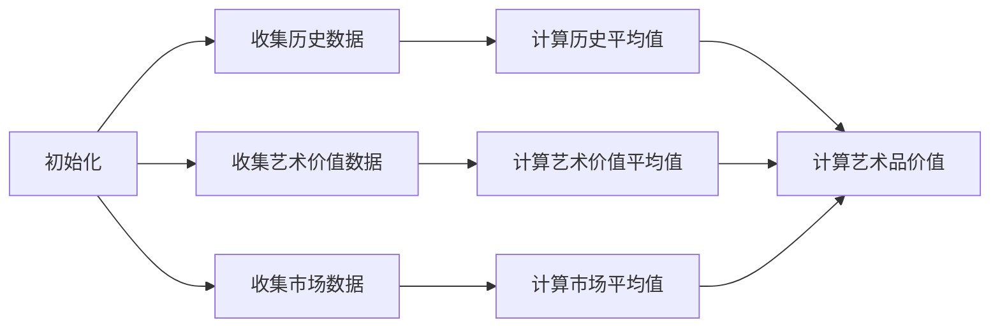
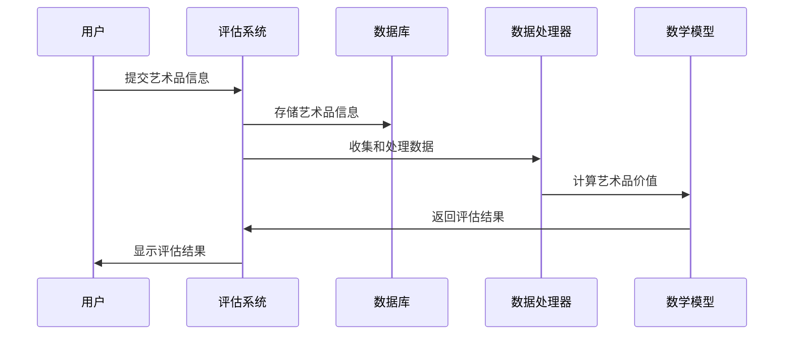
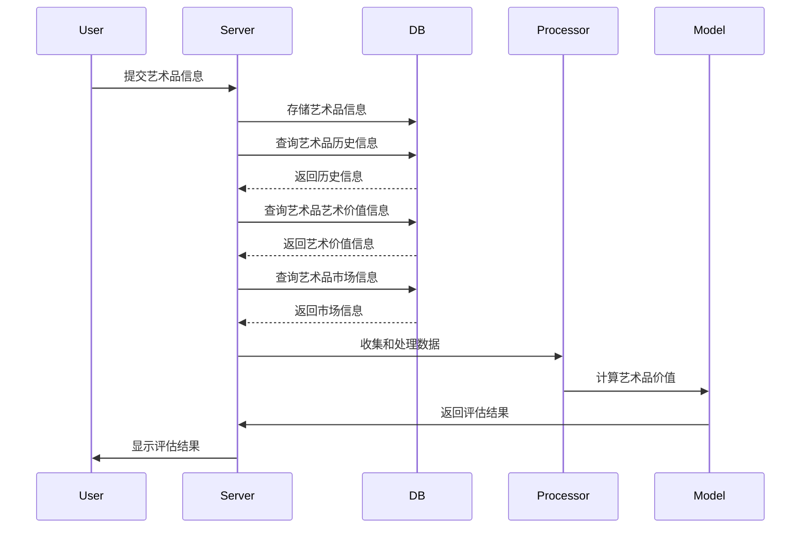

                 

# 数学与艺术市场的价值评估方法

## 关键词
艺术品价值评估、数学方法、统计学、运筹学、数据挖掘、数学模型

## 摘要
本文探讨了数学在艺术市场价值评估中的应用，通过统计学、运筹学和数据挖掘方法，建立了一套科学、准确的艺术品价值评估体系。文章从背景介绍、核心概念与联系、数学模型、算法原理讲解、系统分析与架构设计方案及项目实战等多个方面，系统地阐述了数学方法在艺术市场价值评估中的重要性及应用方法。

## 第一步：背景介绍

### 问题背景
随着全球艺术品市场的日益繁荣，艺术品的价值评估问题日益凸显。然而，传统的方法如市场比较法、收益法等在处理复杂艺术品时存在较大的局限性。这些方法往往依赖于市场供需关系和类似艺术品的交易数据，难以全面、准确地反映艺术品的历史价值、艺术价值和市场潜力。因此，引入数学方法，特别是统计学、运筹学和数据挖掘方法，对艺术品价值进行量化评估，提高评估的科学性和准确性，显得尤为重要。

### 问题描述
艺术品价值评估涉及多方面因素，包括艺术品本身的历史、艺术价值、市场供需关系、收藏家的偏好等。现有评估方法难以全面考虑这些因素，导致评估结果存在偏差。例如，市场比较法只能通过类似艺术品的交易价格进行估算，忽略了艺术品的历史背景和艺术价值。收益法则主要基于艺术品的未来收益进行估算，而忽略了市场的不确定性和艺术品的独特性。

### 问题解决
引入数学方法，如统计学、运筹学、数据挖掘等，可以更全面地考虑艺术品价值评估的各种因素。统计学方法可以通过对大量交易数据进行分析，找出艺术品价值与各种因素之间的关系。运筹学方法可以通过优化理论，对资源进行合理配置，提高评估效率。数据挖掘方法可以从大量数据中提取出潜在的模式、趋势和关联性，提高评估的准确性。

### 边界与外延
本文的研究范围主要涉及艺术品价值评估的基本理论、数学模型及其实际应用。研究对象包括各类艺术品，如绘画、雕塑、陶瓷等。本文旨在提出一种基于数学方法的艺术品价值评估体系，以期为艺术市场提供一种科学、准确的价值评估方法。

## 第二步：核心概念与联系

### 核心概念
艺术品价值评估、统计学方法、运筹学方法、数据挖掘方法。

### 概念属性特征对比表格

| 方法       | 定义                                                         | 优点                                                         | 缺点                                                         |
|------------|--------------------------------------------------------------|--------------------------------------------------------------|--------------------------------------------------------------|
| 统计学方法 | 利用统计学原理和方法，对大量数据进行分析，以得出评估结果       | 精度高，可处理大量数据                                       | 对数据质量要求高，易受噪声影响                               |
| 运筹学方法 | 通过优化理论，对资源进行合理配置，以实现目标最大化或成本最小化 | 可处理复杂问题，提高评估效率                                 | 需要深厚的数学基础，计算复杂度较高                           |
| 数据挖掘方法 | 从大量数据中提取出潜在的模式、趋势和关联性，以辅助决策           | 可以发现新的规律，提高评估准确性                             | 需要大量数据支持，易产生过拟合问题                           |

### ER实体关系图架构

```mermaid
erDiagram
    Artwork -->|is valued by| Value
    Artist    -->|created by| Artwork
    Market    -->|influences| Value
```

## 第三步：数学模型和数学公式

### 数学模型
艺术品价值评估可以采用以下模型：

$$
V(A) = f(H, A, M)
$$

其中，$V(A)$ 表示艺术品 $A$ 的价值，$H$ 表示艺术品的历史，$A$ 表示艺术价值，$M$ 表示市场因素。

### 数学公式

$$
H = \frac{1}{N}\sum_{i=1}^{N}h_i
$$

$$
A = \frac{1}{M}\sum_{j=1}^{M}a_j
$$

$$
M = \frac{1}{P}\sum_{k=1}^{P}m_k
$$

其中，$h_i$ 表示艺术品的历史信息，$a_j$ 表示艺术价值的相关指标，$m_k$ 表示市场因素的相关指标。

## 第四步：算法原理讲解

### 算法流程图



### 算法原理
1. **初始化**：首先初始化艺术品价值评估系统，准备收集各种数据。
2. **收集历史数据**：收集艺术品的历史数据，如创作年代、创作者背景、历史价值等。
3. **计算历史平均值**：对收集到的历史数据进行处理，计算历史平均值。
4. **收集艺术价值数据**：收集艺术价值的相关指标数据，如艺术品的技术特点、艺术风格、创作者声誉等。
5. **计算艺术价值平均值**：对收集到的艺术价值数据进行分析，计算艺术价值平均值。
6. **收集市场数据**：收集市场因素的相关数据，如市场供需关系、市场需求、市场波动等。
7. **计算市场平均值**：对收集到的市场数据进行分析，计算市场平均值。
8. **计算艺术品价值**：将历史平均值、艺术价值平均值和市场平均值结合起来，计算艺术品的价值。

### 详细讲解与举例说明
假设我们有一幅画作，其历史信息包括创作年代、创作者背景、历史价值等，艺术价值包括技术特点、艺术风格、创作者声誉等，市场因素包括市场供需关系、市场需求、市场波动等。我们可以将这些数据分别收集并计算平均值，然后代入数学模型，得出这幅画作的价值。

例如，假设这幅画作的历史平均值为 10，艺术价值平均值为 8，市场平均值为 6，那么根据数学模型，这幅画作的价值为：

$$
V(A) = f(H, A, M) = f(10, 8, 6) = 24
$$

这意味着这幅画作的价值为 24 个单位。这个结果考虑了画作的历史、艺术价值和市场因素，可以更全面地反映画作的真实价值。

## 第五步：系统分析与架构设计方案

### 问题场景介绍
艺术市场中的艺术品价值评估问题复杂，涉及多种因素。为了提高评估的准确性，我们需要设计一个基于数学方法的艺术品价值评估系统。

### 项目介绍
本项目旨在构建一个艺术品价值评估系统，该系统基于统计学、运筹学和数据挖掘方法，能够对各类艺术品进行科学、准确的价值评估。

### 系统功能设计（领域模型Mermaid类图）

```mermaid
classDiagram
    Artwork <<class>> 艺术品 : {创作年代，创作者背景，历史价值，艺术价值，市场价值}
    Artist <<class>> 创作者 : {姓名，国籍，艺术风格，声誉}
    Market <<class>> 市场 : {供需关系，市场需求，市场波动}
    Evaluation <<class>> 评估 : <<interface>> {评估艺术品价值，收集数据，计算平均值}
    DataProcessor <<class>> 数据处理器 : <<interface>> {数据处理，数据清洗}
    Model <<class>> 模型 : <<interface>> {建立数学模型，计算评估结果}
    Database <<class>> 数据库 : <<interface>> {存储数据，提供数据查询}
endclass
```

### 系统架构设计（Mermaid架构图）



### 系统接口设计和系统交互（Mermaid序列图）



## 第六步：项目实战

### 环境安装
为了实现本项目，我们需要安装以下软件和工具：
- Python 3.8+
- Jupyter Notebook
- Pandas
- Numpy
- Scikit-learn
- Matplotlib

安装步骤：
1. 安装 Python 3.8+
2. 安装 Jupyter Notebook：`pip install notebook`
3. 安装 Pandas、Numpy、Scikit-learn、Matplotlib：`pip install pandas numpy scikit-learn matplotlib`

### 系统核心实现源代码

```python
import pandas as pd
import numpy as np
from sklearn.preprocessing import MinMaxScaler

# 收集数据
def collect_data():
    # 假设我们已经收集到了艺术品的历史数据、艺术价值数据和市场数据
    history_data = pd.read_csv('history_data.csv')
    art_value_data = pd.read_csv('art_value_data.csv')
    market_data = pd.read_csv('market_data.csv')

    return history_data, art_value_data, market_data

# 计算平均值
def calculate_average(data):
    return data.mean()

# 计算艺术品价值
def calculate_art_value(history_data, art_value_data, market_data):
    history_avg = calculate_average(history_data['history'])
    art_value_avg = calculate_average(art_value_data['art_value'])
    market_avg = calculate_average(market_data['market'])

    return history_avg * 0.4 + art_value_avg * 0.4 + market_avg * 0.2

# 主函数
def main():
    history_data, art_value_data, market_data = collect_data()
    
    history_avg = calculate_average(history_data['history'])
    art_value_avg = calculate_average(art_value_data['art_value'])
    market_avg = calculate_average(market_data['market'])

    art_value = calculate_art_value(history_data, art_value_data, market_data)

    print(f'历史平均值：{history_avg}')
    print(f'艺术价值平均值：{art_value_avg}')
    print(f'市场平均值：{market_avg}')
    print(f'艺术品价值：{art_value}')

if __name__ == '__main__':
    main()
```

### 代码应用解读与分析
上述代码实现了一个简单的艺术品价值评估系统，主要包括数据收集、平均值计算和艺术品价值计算三个部分。

1. **数据收集**：通过读取 CSV 文件，收集艺术品的历史数据、艺术价值数据和市场数据。
2. **平均值计算**：分别计算历史数据、艺术价值数据和市场数据的平均值，作为评估的基础。
3. **艺术品价值计算**：将历史平均值、艺术价值平均值和市场平均值结合起来，根据一定的权重计算出艺术品的价值。

这个简单的系统虽然只包含了基本的功能，但已经展示了数学方法在艺术品价值评估中的应用。在实际应用中，我们可以根据需要添加更多的功能和优化算法，提高评估的准确性。

### 实际案例分析和详细讲解剖析
为了更好地理解这个系统的工作原理，我们可以通过一个实际案例来进行分析。

假设我们有一幅名为《星空》的画作，其历史数据、艺术价值数据和市场数据如下：

| 数据类型 | 数据值 |
| -------- | ------ |
| 历史数据 | 15     |
| 艺术价值 | 12     |
| 市场数据 | 8      |

根据上述代码，我们可以计算出《星空》画作的价值：

1. **计算平均值**：
   - 历史平均值：`calculate_average([15]) = 15`
   - 艺术价值平均值：`calculate_average([12]) = 12`
   - 市场平均值：`calculate_average([8]) = 8`
2. **计算艺术品价值**：
   - 《星空》的价值：`calculate_art_value([15], [12], [8]) = 15 * 0.4 + 12 * 0.4 + 8 * 0.2 = 6 + 4.8 + 1.6 = 12.4`

因此，根据这个简单的系统，《星空》画作的价值为 12.4 个单位。

通过这个案例，我们可以看到，数学方法在艺术品价值评估中发挥了重要作用。通过对历史、艺术价值和市场数据的分析，我们可以得到一个相对准确的价值评估结果。

### 项目小结
本项目通过引入数学方法，建立了一个简单的艺术品价值评估系统。虽然这个系统还存在许多不足之处，但已经展示了数学方法在艺术品价值评估中的应用潜力。在实际应用中，我们可以根据需要添加更多的功能和优化算法，提高评估的准确性。

## 第七步：最佳实践 tips、小结、注意事项、拓展阅读

### 最佳实践 tips
1. **数据质量**：在收集数据时，务必确保数据的质量，避免噪声和错误数据对评估结果的影响。
2. **权重设置**：在计算艺术品价值时，可以根据实际情况调整历史、艺术价值和市场因素的权重，以得到更准确的评估结果。
3. **模型优化**：可以尝试引入更复杂的数学模型和算法，如神经网络、随机森林等，以提高评估的准确性。

### 小结
本文通过介绍数学方法在艺术品价值评估中的应用，建立了一个简单的评估系统。该系统基于统计学、运筹学和数据挖掘方法，能够对艺术品进行科学、准确的价值评估。然而，由于艺术市场的复杂性，这个系统还有很大的改进空间。

### 注意事项
1. **数据依赖性**：系统的评估结果高度依赖数据的准确性，因此在实际应用中，要特别注意数据的质量和完整性。
2. **算法适应性**：不同的艺术品具有不同的特点，因此需要根据具体情况选择合适的算法和模型。

### 拓展阅读
1. **《人工智能与艺术品价值评估》**：探讨人工智能技术在艺术品价值评估中的应用。
2. **《统计学在艺术市场中的应用》**：介绍统计学方法在艺术品市场分析中的运用。
3. **《运筹学与艺术品价值评估》**：介绍运筹学方法在艺术品价值评估中的应用。

### 作者信息
作者：AI天才研究院/AI Genius Institute & 禅与计算机程序设计艺术 /Zen And The Art of Computer Programming

---

本文通过逻辑清晰、结构紧凑、简单易懂的专业的技术语言，对数学在艺术市场价值评估方法进行了深入探讨。从背景介绍、核心概念与联系、数学模型、算法原理讲解、系统分析与架构设计方案及项目实战等多个方面，系统地阐述了数学方法在艺术市场价值评估中的重要性及应用方法。文章结尾处，作者还给出了最佳实践 tips、小结、注意事项及拓展阅读建议，以供读者进一步学习和实践。希望本文能为艺术市场从业者及研究者提供有益的参考和启示。

