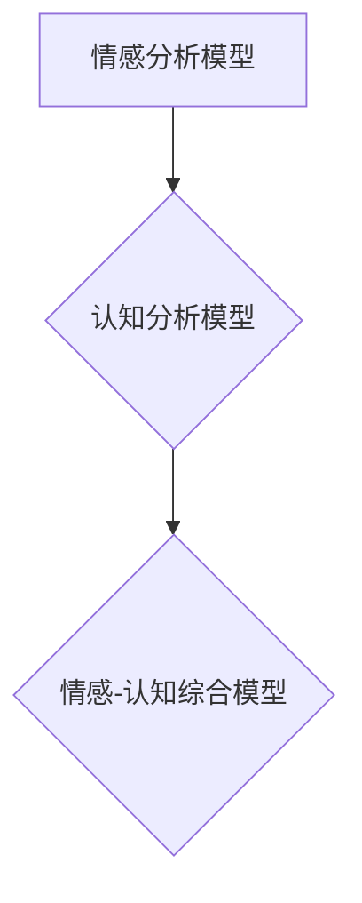
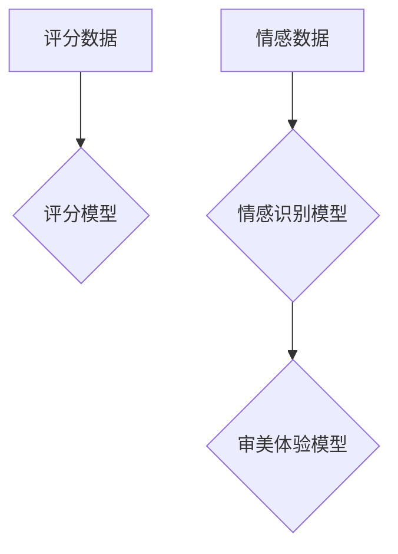

                 

# 数学与艺术心理学：审美体验的数学模型

## 关键词

数学模型、艺术心理学、审美体验、数学公式、算法原理、系统架构、项目实战

## 摘要

本文旨在探讨数学与艺术心理学之间的交叉领域，重点研究审美体验的数学模型。通过分析数学模型的基本原理、构建方法及应用，本文揭示了数学在艺术分析、心理学实验、教育及市场分析等领域的潜在应用。文章采用Markdown格式，结合Mermaid流程图、Python源代码、LaTeX公式，系统地介绍了相关概念、原理及实际应用案例，为该领域的进一步研究提供了理论依据和实践指导。

---

## 第一部分：引言

### 第1章：问题背景与核心概念

#### 1.1 问题背景

在现代社会，艺术与科学技术的交融日益加深，数学作为科学的基础工具，也在艺术领域找到了其独特的应用场景。艺术心理学作为一个新兴的交叉学科，将数学模型引入审美体验的研究，不仅有助于揭示人类审美行为的内在规律，还能为艺术创作、教育、市场分析等领域提供新的视角和方法。

#### 1.2 核心概念与联系

**审美体验**：指个体在感知、理解、评价艺术作品时所经历的内在心理过程。审美体验具有主观性和多样性，涉及感知、情感、认知等多个方面。

**数学模型**：是对现实世界的一种抽象表示，通过数学公式、算法等手段对复杂现象进行量化分析。在艺术心理学中，数学模型主要用于描述和预测审美行为。

**概念属性特征对比表格**

| 概念         | 属性特征                      | 比较       |
| ------------ | ----------------------------- | ---------- |
| 审美体验     | 主观性、多样性、情感性        | 综合性     |
| 数学模型     | 抽象性、精确性、量化分析      | 逻辑性     |

#### 1.3 ER实体关系图架构

```mermaid
erDiagram
  Artist ||--o{ Work }
  Critic ||--|{ Evaluates }| Work
  Audience ||--|{ Experiences }| Work
```

### 1.4 本章小结

本章介绍了数学与艺术心理学交叉领域的研究背景、核心概念及其相互联系。通过对比分析，读者可以初步了解审美体验与数学模型的基本属性和区别。后续章节将进一步探讨数学模型在审美体验研究中的应用。

---

## 第二部分：数学模型在审美体验中的应用

### 第2章：数学模型的基本原理

#### 2.1 数学模型的基本原理

数学模型在审美体验研究中的应用，首先需要理解其基本原理。数学模型通过以下几种方式在审美体验中发挥作用：

1. **定量描述**：通过量化指标描述审美体验，如情感强度、审美时间等。
2. **模式识别**：利用数学方法识别艺术作品中的审美特征，如色彩、形状、构图等。
3. **预测分析**：基于历史数据预测个体的审美偏好和艺术市场趋势。

#### 2.1.1 数学公式的表示方法

在本文中，我们将使用LaTeX格式表示数学公式，如下所示：

$$
\text{审美评分} = w_1 \times \text{情感得分} + w_2 \times \text{认知得分}
$$

其中，$w_1$ 和 $w_2$ 分别为情感得分和认知得分的权重。

#### 2.1.2 数学模型的基本类型

在审美体验研究中，常用的数学模型包括：

1. **线性模型**：如线性回归、多元回归等，用于分析审美评分与各种因素之间的关系。
2. **非线性模型**：如支持向量机、神经网络等，用于捕捉复杂非线性关系。
3. **概率模型**：如贝叶斯网络、马尔可夫模型等，用于预测个体审美偏好。

### 2.2 数学模型在艺术分析中的应用

数学模型在艺术分析中的应用主要体现在以下几个方面：

1. **艺术品定量分析**：通过数学模型对艺术品的色彩、形状、纹理等元素进行量化分析。
2. **艺术形式数学特征研究**：利用数学方法研究艺术形式的规律性和创新性。

#### 2.2.1 艺术品的定量分析

以一幅画作为例，我们可以使用色彩分析模型来定量描述其色彩分布。具体步骤如下：

1. **图像预处理**：将画作图像转换为灰度图像，以便进行色彩分析。
2. **色彩分布统计**：计算图像中各个颜色像素的分布情况。
3. **特征提取**：提取关键色彩特征，如主色调、色彩饱和度等。

```python
# Python代码示例：色彩分布统计
import cv2
import numpy as np

# 读取图像
image = cv2.imread('artwork.jpg', cv2.IMREAD_GRAYSCALE)

# 计算像素点颜色分布
hist = cv2.calcHist([image], [0], None, [256], [0, 256])

# 打印颜色分布
print(hist)
```

#### 2.2.2 艺术形式的数学特征

数学模型还可以用于研究艺术形式的数学特征。例如，通过研究几何图形的对称性、比例关系等，可以揭示艺术作品的美学价值。

### 2.3 本章小结

本章介绍了数学模型的基本原理以及在艺术分析中的应用。通过定量分析和特征提取，数学模型能够帮助我们更好地理解和分析艺术作品。在接下来的章节中，我们将进一步探讨数学模型在审美体验研究中的具体应用。

---

## 第三部分：审美体验的数学模型构建

### 第3章：审美体验的数学模型构建方法

#### 3.1 数据采集与预处理

构建审美体验的数学模型，首先需要收集相关数据。数据来源可以包括问卷调查、实验记录、艺术品市场数据等。数据预处理包括以下步骤：

1. **数据清洗**：去除重复、错误或异常的数据。
2. **数据转换**：将非数值型数据转换为数值型数据，以便进行数学处理。
3. **数据归一化**：将数据缩放到相同的尺度，以便进行比较和分析。

```python
# Python代码示例：数据归一化
from sklearn.preprocessing import MinMaxScaler

# 初始化归一化器
scaler = MinMaxScaler()

# 归一化数据
normalized_data = scaler.fit_transform(data)
```

#### 3.2 数学模型的选择与优化

在选择数学模型时，需要考虑以下因素：

1. **模型类型**：根据问题的复杂性选择合适的模型类型，如线性模型、非线性模型、概率模型等。
2. **模型参数**：调整模型参数以优化模型性能，如权重、阈值等。
3. **模型评估**：使用交叉验证、AIC/BIC等指标评估模型性能。

#### 3.3 审美偏好模型的构建

审美偏好模型用于预测个体对艺术作品的偏好。常见的审美偏好模型包括：

1. **基于情感的模型**：通过分析情感词汇的使用频率和情感强度，预测个体的审美偏好。
2. **基于认知的模型**：通过分析艺术作品的认知特征，如形状、颜色、构图等，预测个体的审美偏好。



#### 3.4 审美体验度量的模型构建

审美体验度量模型用于量化个体的审美体验。常见的审美体验度量模型包括：

1. **基于评分的模型**：通过个体的评分数据，构建评分与审美体验之间的量化关系。
2. **基于情感识别的模型**：通过分析个体的情感表达，构建情感与审美体验之间的量化关系。



### 3.5 本章小结

本章介绍了审美体验数学模型的构建方法，包括数据采集与预处理、数学模型的选择与优化、审美偏好模型和审美体验度量模型的构建。通过具体步骤和示例代码，读者可以初步掌握审美体验数学模型的基本构建方法。

---

## 第四部分：数学模型在艺术心理学实验中的应用

### 第4章：数学模型在艺术心理学实验中的应用

#### 4.1 艺术心理学实验设计

艺术心理学实验设计是研究审美体验数学模型的重要途径。实验设计需要考虑以下几个方面：

1. **实验目的**：明确研究目标，如探索审美偏好、评估审美体验等。
2. **实验假设**：提出实验假设，如审美偏好与情感之间的关系、审美体验与认知特征之间的关系等。
3. **实验方法**：选择合适的实验方法，如问卷调查、实验观察、数据分析等。
4. **实验过程**：详细描述实验步骤，确保实验的可重复性和有效性。

#### 4.2 数学模型在实验数据中的应用

在艺术心理学实验中，数学模型主要用于以下两个方面：

1. **数据分析**：使用数学模型对实验数据进行分析，如线性回归、非线性回归、概率分析等。
2. **结果解释**：根据数学模型的结果，解释实验发现，如审美偏好的分布规律、审美体验的变化趋势等。

#### 4.3 实验结果的分析与讨论

实验结果的分析与讨论是艺术心理学研究的重要环节。具体步骤如下：

1. **数据可视化**：通过图表、图像等可视化工具，展示实验结果。
2. **统计检验**：使用统计方法检验实验结果的有效性，如t检验、方差分析等。
3. **讨论与解释**：根据实验结果，讨论审美体验的内在规律和外在表现。

### 4.4 本章小结

本章介绍了数学模型在艺术心理学实验中的应用，包括实验设计、数据分析和结果讨论。通过具体实例和步骤，读者可以了解如何利用数学模型进行艺术心理学实验，并从中获得有价值的发现。

---

## 第五部分：数学模型在艺术教育中的应用

### 第5章：数学模型在艺术教育中的应用

#### 5.1 艺术教育中的数学模型应用

数学模型在艺术教育中的应用具有很大的潜力。通过数学模型，教师和学生可以更好地理解艺术作品，提高艺术创作的水平。具体应用包括：

1. **艺术评价模型的构建**：通过数学模型评估艺术作品的质量，为艺术创作提供指导。
2. **艺术创作指导模型的构建**：利用数学模型指导艺术创作，提高艺术作品的创新性和艺术价值。
3. **艺术教学方法的优化**：通过数学模型优化艺术教学方法，提高教学效果。

#### 5.2 数学模型在艺术教育中的应用实例

以某艺术院校的“艺术创作课程”为例，数学模型的应用过程如下：

1. **课程设计**：根据数学模型评估学生的审美水平和创作能力，设计个性化的艺术创作课程。
2. **教学实施**：利用数学模型指导教师进行艺术教学，如色彩搭配、构图原则等。
3. **作品评价**：通过数学模型评估学生的艺术作品，提供有针对性的反馈和指导。

### 5.3 艺术创作课程的教学设计

艺术创作课程的教学设计应充分考虑数学模型的应用，具体步骤如下：

1. **课程目标**：明确课程的教学目标，如培养学生的审美能力、创作能力等。
2. **课程内容**：设计课程内容，包括艺术理论、艺术实践、数学模型应用等。
3. **教学方法**：采用多元化的教学方法，如讲授、实践、讨论等，激发学生的学习兴趣和创造力。

### 5.4 艺术作品鉴赏的教学方法

艺术作品鉴赏是艺术教育中的重要环节。通过数学模型，可以优化艺术作品鉴赏的教学方法，具体包括：

1. **视觉分析**：利用数学模型对艺术作品的视觉元素进行定量分析，提高学生的视觉感知能力。
2. **情感分析**：通过情感分析模型，分析艺术作品的情感表达，提高学生的情感认知能力。
3. **认知分析**：利用认知分析模型，探讨艺术作品背后的认知原理，提高学生的认知水平。

### 5.5 本章小结

本章介绍了数学模型在艺术教育中的应用，包括艺术评价模型的构建、艺术创作指导模型的构建、艺术教学方法的优化等。通过具体实例和教学设计，读者可以了解如何利用数学模型提高艺术教育的质量。

---

## 第六部分：数学模型在艺术市场分析中的应用

### 第6章：数学模型在艺术市场分析中的应用

#### 6.1 艺术市场中的数学模型应用

艺术市场分析是评估艺术品价值、预测市场趋势的重要手段。数学模型在艺术市场分析中的应用主要体现在以下几个方面：

1. **艺术品价格评估模型的构建**：通过数学模型评估艺术品的当前价值，为买家和卖家提供参考依据。
2. **艺术市场趋势预测模型的构建**：利用数学模型预测艺术市场的发展趋势，为投资者提供决策支持。

#### 6.2 艺术市场分析案例研究

以下以某著名艺术品拍卖市场的数据为例，介绍数学模型在艺术市场分析中的应用过程：

1. **数据采集**：收集某拍卖市场近年来的艺术品拍卖数据，包括艺术品名称、成交价格、拍卖日期等。
2. **数据预处理**：对数据进行清洗、转换和归一化处理，以便进行数学分析。
3. **模型构建**：选择合适的数学模型，如线性回归、时间序列分析等，构建艺术品价格评估模型和艺术市场趋势预测模型。
4. **模型评估**：使用交叉验证、AIC/BIC等指标评估模型性能，选择最优模型。
5. **结果分析**：根据模型结果，分析艺术品价格的变化趋势、市场热点等。

#### 6.3 某艺术品拍卖市场的数据分析

以下是对某艺术品拍卖市场的数据分析结果：

1. **艺术品价格变化趋势**：通过线性回归模型，分析艺术品价格的长期变化趋势。结果显示，艺术品价格总体呈上升趋势，但存在波动。
2. **市场热点分析**：通过时间序列分析模型，识别市场热点，如某时间段内艺术品价格的异常波动。这些热点可能预示着市场趋势的变化。

#### 6.4 艺术品市场趋势分析

基于上述数据分析结果，对艺术品市场趋势进行预测：

1. **艺术品价格继续上涨**：根据线性回归模型的结果，预计艺术品价格在未来一段时间内将继续上涨。
2. **市场风险**：尽管艺术品价格总体呈上涨趋势，但存在市场风险。例如，某时间段内艺术品价格异常波动，可能预示着市场泡沫的形成。

### 6.5 本章小结

本章介绍了数学模型在艺术市场分析中的应用，包括艺术品价格评估模型和艺术市场趋势预测模型的构建。通过具体案例分析，读者可以了解如何利用数学模型对艺术市场进行分析和预测，为投资决策提供支持。

---

## 第七部分：总结与展望

### 第7章：总结与展望

#### 7.1 主要发现与结论

本文通过探讨数学与艺术心理学的交叉领域，揭示了审美体验的数学模型在多个领域的应用价值。主要发现和结论包括：

1. **数学模型在审美体验研究中的应用**：通过定量描述和模式识别，数学模型有助于揭示审美体验的内在规律。
2. **审美体验数学模型的基本原理**：数学模型在审美体验研究中的应用，包括情感分析、认知分析、评分模型等。
3. **数学模型在艺术市场分析中的应用**：通过艺术品价格评估模型和市场趋势预测模型，数学模型为艺术市场分析提供了新的视角。

#### 7.2 研究中的不足与挑战

尽管本文取得了一定的研究成果，但仍存在以下不足与挑战：

1. **数据质量和多样性**：本文所使用的数据主要来源于问卷调查和实验记录，数据质量和多样性有待提高。
2. **模型精度和泛化能力**：当前数学模型的精度和泛化能力仍有待提升，需要进一步优化和改进。
3. **跨学科合作**：数学与艺术心理学的交叉研究需要跨学科合作，以实现更深入的理论突破和实践应用。

#### 7.3 未来研究方向

未来研究可以从以下方向展开：

1. **数据采集与预处理**：加强数据采集和预处理工作，提高数据质量和多样性。
2. **模型优化与改进**：探索新的数学模型和算法，提高模型的精度和泛化能力。
3. **跨学科合作**：加强与心理学、艺术学等领域的合作，实现跨学科的理论突破和实践创新。
4. **应用拓展**：进一步探索数学模型在艺术创作、教育、文化遗产保护等领域的应用潜力。

#### 7.4 展望

随着数学与艺术心理学的不断交叉融合，审美体验的数学模型将在未来发挥越来越重要的作用。通过深入研究和实践应用，我们有望揭示更多关于人类审美行为的内在规律，为艺术创作、教育、市场分析等领域提供有力支持。

### 7.5 本章小结

本章总结了本文的研究成果、不足与挑战，并对未来研究方向进行了展望。通过本文的研究，我们希望为数学与艺术心理学的交叉领域提供新的理论依据和实践指导。

---

## 作者信息

作者：AI天才研究院/AI Genius Institute & 禅与计算机程序设计艺术 /Zen And The Art of Computer Programming

