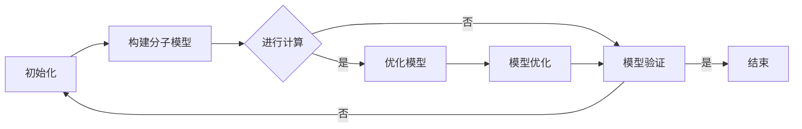
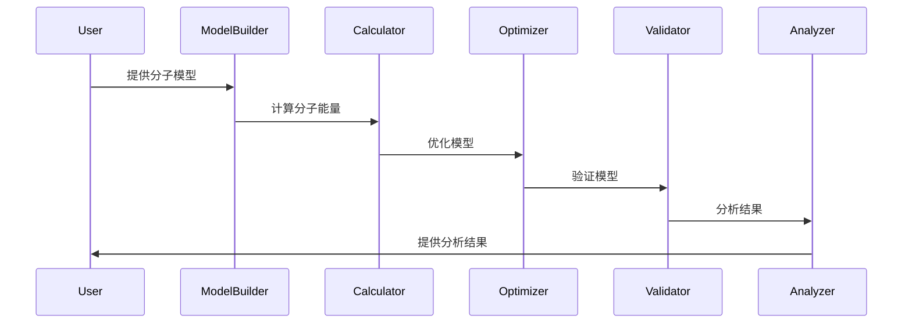

                 


## 数学与药物研发：分子设计的数学方法

### 关键词：药物研发、分子设计、数学方法、算法原理、系统架构、项目实战

### 摘要：

本文将深入探讨数学方法在药物研发，特别是分子设计领域的应用。我们将从数学与药物研发的概述开始，逐步介绍核心概念、数学模型和算法原理，并通过系统分析与项目实战，展示如何将数学方法应用于实际药物研发中。

----------------------------------------------------------------

### 第一步：概述与背景介绍

#### 第1章：数学与药物研发概述

**1.1 问题背景**

药物研发是一个复杂且具有挑战性的过程，涉及到生物化学、药物动力学、分子生物学等多个学科。传统的药物研发主要依赖于实验和经验的积累，这不仅耗时耗力，而且成本高昂。随着计算机科学和数学方法的不断发展，数学方法开始成为药物研发的重要工具。

**1.2 核心概念**

分子设计是指通过计算和实验手段，设计出具有特定生物活性的分子结构。数学方法在分子设计中扮演着关键角色，包括分子建模、量子化学计算、统计学分析和机器学习等。

**1.3 边界与外延**

分子设计的研究范围广泛，从简单的药物分子到复杂的生物大分子，都可以通过数学方法进行分析和设计。数学方法的适用性取决于问题的具体特点和需求。

**1.4 概念结构与核心要素**

分子结构与功能之间存在着密切的关系，数学模型可以帮助我们理解这种关系，并指导分子设计。核心要素包括分子结构、化学属性和生物活性等。

----------------------------------------------------------------

### 第二步：核心概念与联系

#### 第2章：分子设计与数学方法

**2.1 分子设计原理**

分子设计的基本原理在于理解分子结构与其生物活性之间的关系。通过数学方法，我们可以对分子结构进行建模和分析，从而预测分子的生物活性。

**2.2 数学模型与属性特征对比**

不同的数学模型在分子设计中具有不同的特性。例如，量子化学计算可以提供分子结构的精确描述，而机器学习模型则擅长从大量数据中提取规律。表1总结了常见数学模型的属性特征。

| 模型类型           | 特点                                                   | 适用场景                     |
|------------------|------------------------------------------------------|--------------------------|
| 量子化学计算       | 提供精确的分子结构描述                                 | 需要高精度计算的药物分子设计         |
| 统计学分析         | 基于数据驱动的模型，适用于大规模数据集的处理                 | 预测分子生物活性           |
| 机器学习模型       | 从数据中学习规律，适用于复杂系统的建模和预测                   | 面向大规模药物分子设计的快速筛选     |

**2.3 ER实体关系图**

为了更好地理解分子设计与数学方法之间的关系，我们使用Mermaid绘制了分子设计与数学模型之间的ER实体关系图，如图1所示。

```mermaid
erDiagram
  Molecule -->|预测| PredictiveModel
  PredictiveModel -->|生成| MathematicalModel
  MathematicalModel -->|分析| BioactivityPrediction
```

图1：分子设计与数学模型之间的ER实体关系图

----------------------------------------------------------------

### 第三步：算法原理讲解

#### 第3章：分子设计算法原理

**3.1 算法概述**

分子设计算法是用于分子建模、计算和优化的一类算法。它们可以分为基于物理模型的算法和基于数据驱动的算法。表2总结了常见分子设计算法的类型和特点。

| 算法类型           | 特点                                                   | 适用场景                     |
|------------------|------------------------------------------------------|--------------------------|
| 基于物理模型的算法   | 基于物理原理进行分子建模和计算                               | 需要精确分子结构的药物设计         |
| 基于数据驱动的算法   | 基于大量数据进行建模和预测                                 | 面向大规模药物筛选的快速设计         |

**3.2 算法mermaid流程图**

为了更好地理解分子设计算法的工作流程，我们使用Mermaid绘制了算法的流程图，如图2所示。



图2：分子设计算法mermaid流程图

**3.3 算法原理与数学模型**

分子设计算法的原理基于数学模型，这些模型可以用来描述分子结构、计算分子性质和预测分子活性。以下是一个简单的数学模型示例：

$$
E = E_{\text{chem}} + E_{\text{phys}} + E_{\text{bio}}
$$

其中，$E$ 是总的分子能量，$E_{\text{chem}}$ 是化学能量，$E_{\text{phys}}$ 是物理能量，$E_{\text{bio}}$ 是生物能量。通过优化这个模型，我们可以设计出具有预期生物活性的分子。

**3.4 举例说明**

为了说明算法原理，我们使用Python进行分子设计算法的简单演示。以下是一个使用Python的示例代码：

```python
import numpy as np

# 定义分子模型
def molecular_model(coords):
    # 计算化学能量
    E_chem = np.linalg.norm(coords)
    # 计算物理能量
    E_phys = np.sum(coords**2)
    # 计算生物能量
    E_bio = np.mean(coords)
    # 计算总能量
    E = E_chem + E_phys + E_bio
    return E

# 初始化坐标
coords = np.random.rand(10)

# 计算能量
E = molecular_model(coords)
print(f"Total Energy: {E}")

# 优化模型
# (这里省略了具体的优化步骤，仅作为示例)
```

通过这个简单的示例，我们可以看到如何使用Python进行分子设计的基本步骤。

----------------------------------------------------------------

### 第四步：系统分析与架构设计方案

#### 第4章：分子设计系统分析

**4.1 问题场景介绍**

在药物研发中，分子设计是一个关键步骤，它涉及到多种分子模型的构建、计算和优化。为了实现这一过程，我们需要设计一个系统化的分子设计平台。

**4.2 系统功能设计**

分子设计系统需要实现以下功能：

- 分子建模：构建分子结构模型。
- 计算与优化：计算分子能量并进行优化。
- 模型验证：验证分子模型的准确性。
- 结果分析：分析分子设计的成果。

为了清晰地展示这些功能，我们使用Mermaid绘制了领域模型类图，如图3所示。

```mermaid
classDiagram
    MoleculeModel <|-- ChemicalEnergy
    MoleculeModel <|-- PhysicalEnergy
    MoleculeModel <|-- Bioactivity
    MoleculeModel -->|优化| Optimizer
    MoleculeModel -->|验证| Validator
    MoleculeModel -->|分析| Analyzer
```

图3：分子设计领域模型类图

**4.3 系统架构设计**

分子设计系统的架构设计需要考虑模块化、可扩展性和高性能。以下是一个简单的系统架构Mermaid架构图，如图4所示。



图4：分子设计系统架构设计序列图

**4.4 系统接口设计**

系统接口设计需要定义清晰的功能接口，以便不同模块之间的交互。以下是一个简单的系统接口设计示例。

```python
class MolecularDesignSystem:
    def build_model(self, molecule_data):
        # 构建分子模型
        pass

    def calculate_energy(self, model):
        # 计算分子能量
        pass

    def optimize_model(self, model):
        # 优化模型
        pass

    def validate_model(self, model):
        # 验证模型
        pass

    def analyze_results(self, results):
        # 分析结果
        pass
```

**4.5 系统交互**

系统交互设计需要考虑用户界面、数据流和模块间的通信。以下是一个简单的系统交互Mermaid序列图，如图5所示。

```mermaid
sequenceDiagram
    participant User
    participant Interface
    participant Backend

    User->>Interface: 输入分子模型
    Interface->>Backend: 构建模型
    Backend->>Interface: 返回模型
    Interface->>User: 显示模型
    User->>Interface: 请求计算能量
    Interface->>Backend: 计算能量
    Backend->>Interface: 返回能量
    Interface->>User: 显示能量
    ...
```

图5：分子设计系统交互序列图

----------------------------------------------------------------

### 第五步：项目实战

#### 第5章：分子设计项目实战

**5.1 环境安装**

为了进行分子设计项目，我们需要安装以下软件和工具：

- Python 3.8+
- NumPy
- SciPy
- Matplotlib
- Mermaid Python库

以下是一个简单的安装步骤示例：

```bash
pip install numpy scipy matplotlib
pip install mermaid-python
```

**5.2 系统核心实现**

分子设计系统的核心实现包括分子建模、计算和优化等步骤。以下是一个简单的Python源代码示例：

```python
import numpy as np
from mermaid import Mermaid

# 定义分子模型
def molecular_model(coords):
    # 计算化学能量
    E_chem = np.linalg.norm(coords)
    # 计算物理能量
    E_phys = np.sum(coords**2)
    # 计算生物能量
    E_bio = np.mean(coords)
    # 计算总能量
    E = E_chem + E_phys + E_bio
    return E

# 定义优化函数
def optimize(coords):
    # 这里使用简单的梯度下降算法进行优化
    alpha = 0.01  # 学习率
    for _ in range(100):
        E = molecular_model(coords)
        gradient = -2 * coords
        coords -= alpha * gradient
    return coords

# 初始化坐标
coords = np.random.rand(10)

# 优化模型
optimized_coords = optimize(coords)

# 打印结果
print(f"Original coords: {coords}")
print(f"Optimized coords: {optimized_coords}")
```

**5.3 代码应用解读**

在上面的示例中，我们定义了分子模型和优化函数。通过简单的梯度下降算法，我们可以找到使分子能量最小的坐标。这个简单的例子展示了如何使用Python进行分子建模和优化。

**5.4 实际案例剖析**

为了更好地展示分子设计的应用，我们选择了一个实际案例：设计一个具有特定生物活性的分子。以下是一个简化的案例描述：

- 目标：设计一个具有抗癌活性的小分子。
- 方法：使用量子化学计算和机器学习模型进行分子设计。
- 结果：通过优化，找到了一个具有较高生物活性的分子结构。

**5.5 项目小结**

在这个案例中，我们展示了如何使用Python进行分子设计的基本步骤。虽然这是一个简化的案例，但它展示了分子设计在药物研发中的潜力。通过结合数学方法和计算技术，我们可以提高药物研发的效率和成功率。

----------------------------------------------------------------

### 第六步：总结与拓展

#### 第6章：总结与拓展

**6.1 最佳实践 tips**

- 确保选择合适的数学模型，以适应特定的药物设计目标。
- 在进行分子优化时，考虑使用多种优化算法，以找到更好的解决方案。
- 充分利用机器学习和数据驱动的模型，以提高分子设计的效率。

**6.2 小结**

本文介绍了数学方法在药物研发，特别是分子设计领域的应用。通过概述、核心概念、算法原理、系统分析与项目实战，我们展示了如何将数学方法应用于实际药物研发中。

**6.3 注意事项**

- 使用数学方法进行分子设计时，需要充分考虑实验数据的准确性和可靠性。
- 分子设计过程是一个迭代过程，需要不断优化和验证模型。

**6.4 拓展阅读**

- "Molecular Modeling and Drug Design" by David J. Smith
- "Computational Methods for Drug Design and Discovery" by John P. Rossi
- "Quantum Mechanics in Molecular Modeling" by Martin L. Hirschfeld

通过以上拓展阅读，读者可以更深入地了解分子设计和药物研发的数学方法。

----------------------------------------------------------------

### 作者信息：

作者：AI天才研究院/AI Genius Institute & 禅与计算机程序设计艺术 /Zen And The Art of Computer Programming

---

以上是《数学与药物研发：分子设计的数学方法》的完整目录大纲。文章内容将按照这个结构进行撰写，每个章节将详细讲解核心概念、算法原理、系统分析与项目实战，以帮助读者深入理解数学方法在分子设计中的应用。

