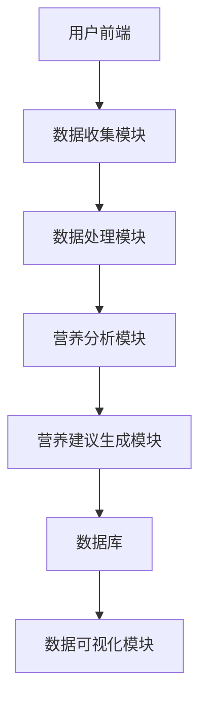
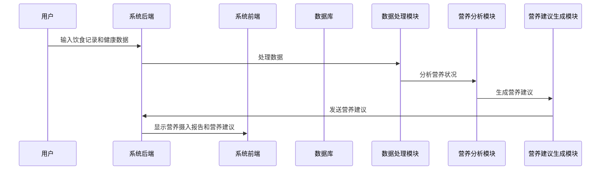

                 

# 数学与营养学：营养摄入的数学平衡

关键词：营养摄入、数学模型、能量平衡、体重管理、健康评估

摘要：本文从数学的角度探讨了营养摄入的平衡问题。通过介绍营养素的基本概念、营养摄入的评估方法，以及能量平衡和体重管理的数学模型，本文旨在为读者提供一个系统、深入的理解，帮助他们在日常生活中更好地进行营养管理。

## 第一部分：背景介绍与核心概念

### 第1章：问题背景与核心概念

#### 1.1 问题背景

营养摄入是维持人体健康的重要环节。然而，营养摄入不足或过剩都会对健康产生负面影响。营养摄入不足可能导致贫血、免疫力下降等问题；而营养摄入过剩则可能引发肥胖、心血管疾病等疾病。

#### 1.1.1 营养摄入的重要性

1. **营养摄入不足导致的健康问题**
    - 蛋白质摄入不足：可能导致免疫力下降、肌肉萎缩。
    - 碳水化合物摄入不足：可能导致疲劳、头晕。
    - 脂肪摄入不足：可能导致营养不良、皮肤问题。

2. **营养摄入过剩引发的疾病风险**
    - 蛋白质摄入过剩：可能导致肾脏负担增加。
    - 碳水化合物摄入过剩：可能导致肥胖、糖尿病。
    - 脂肪摄入过剩：可能导致心血管疾病、肥胖。

#### 1.1.2 数学在营养学中的应用

数学模型在营养摄入分析中有着广泛的应用。通过数学模型，我们可以对营养素的摄入量进行精确计算，评估个体的营养状况，预测营养摄入对健康的影响。

1. **数学模型在营养摄入分析中的应用**
    - **能量平衡模型**：通过计算能量摄入和消耗，评估个体的能量平衡状态。
    - **营养素摄入监测模型**：通过监测营养素的摄入量，评估个体的营养摄入状况。

2. **数学方法在营养学研究的贡献**
    - **统计方法**：用于分析营养摄入与健康状况的关系。
    - **优化方法**：用于制定个性化的营养摄入计划。

#### 1.1.3 营养摄入的挑战

营养摄入面临以下挑战：

1. **多样化的食物种类与营养成分**
    - 食物种类繁多，每种食物的营养成分各不相同。
    - 需要对各种食物的营养成分进行精确分析。

2. **个体差异对营养摄入的需求**
    - 年龄、性别、生理状态等个体差异会影响营养需求。
    - 需要针对不同个体制定个性化的营养摄入计划。

### 1.2 核心概念与联系

#### 1.2.1 营养素与营养摄入

1. **营养素分类与功能**
    - **蛋白质**：构建和修复身体组织，参与免疫反应。
    - **碳水化合物**：提供能量，维持大脑和神经系统功能。
    - **脂肪**：提供能量，维持细胞膜结构，吸收脂溶性维生素。
    - **维生素与矿物质**：调节身体代谢，维持健康。
    - **水分**：维持身体水平衡，参与代谢过程。

2. **营养摄入量与需求量**
    - **营养摄入量**：实际摄入的营养素总量。
    - **营养需求量**：根据年龄、性别、生理状态等个体因素确定。

#### 1.2.2 能量平衡与体重管理

1. **能量平衡原理**
    - 能量摄入 = 能量消耗

2. **能量摄入与消耗的关系**
    - **能量摄入**：通过食物摄入的能量。
    - **能量消耗**：包括基础代谢率、身体活动、食物热效应等。

#### 1.2.3 营养学中的数学模型

1. **营养摄入与健康状况的关系**
    - **营养素摄入与疾病风险**：通过数学模型分析营养素摄入与疾病风险之间的关系。

2. **数学方法在营养研究中的应用**
    - **统计分析**：用于分析营养摄入与健康状况的关系。
    - **优化方法**：用于制定个性化的营养摄入计划。

### 1.3 本章小结

本文介绍了营养摄入的背景、核心概念以及营养摄入的挑战。通过理解营养素与营养摄入的关系、能量平衡原理以及营养学中的数学模型，我们可以更好地进行营养管理，维持健康的生活方式。

----------------------------------------------------------------

## 第二部分：核心概念与联系

### 第2章：营养素与营养摄入

#### 2.1 营养素分类与功能

营养素是维持人体健康所必需的物质，可以分为以下几类：

1. **蛋白质**
    - **功能**：蛋白质是身体的重要组成部分，参与构建和修复身体组织，参与免疫反应。
    - **需求量**：成年男性每日约需摄入60克，女性每日约需摄入50克。
    - **常见食物来源**：肉类、鱼类、豆类、蛋类、乳制品。

2. **碳水化合物**
    - **功能**：碳水化合物是身体的主要能量来源，维持大脑和神经系统功能。
    - **需求量**：成年人每日约需摄入300克。
    - **常见食物来源**：谷物、蔬菜、水果、糖类。

3. **脂肪**
    - **功能**：脂肪是身体能量的重要来源，维持细胞膜结构，吸收脂溶性维生素。
    - **需求量**：成年人每日约需摄入70克。
    - **常见食物来源**：肉类、鱼类、坚果、植物油。

4. **维生素与矿物质**
    - **功能**：维生素和矿物质是身体代谢所必需的，调节身体功能。
    - **需求量**：每种维生素和矿物质的需求量不同。
    - **常见食物来源**：蔬菜、水果、肉类、鱼类、乳制品。

5. **水分**
    - **功能**：水分是身体的重要组成部分，维持身体水平衡，参与代谢过程。
    - **需求量**：成年人每日约需摄入2.5升。
    - **常见食物来源**：饮用水、果汁、汤、蔬菜、水果。

#### 2.2 营养摄入量与需求量

营养摄入量与需求量的关系如下：

1. **营养摄入量与需求量的关系**
    - 营养摄入量应该根据个体的需求量来确定，既不能过高也不能过低。

2. **个体差异与营养需求**
    - 年龄、性别、生理状态等因素会影响营养需求。
    - 如孕妇、乳母、运动员等群体需要更高的营养摄入量。

#### 2.2.1 营养摄入评估方法

营养摄入的评估方法主要有以下几种：

1. **调查问卷法**
    - 通过问卷收集个体的饮食习惯、营养摄入信息。
    - **优点**：操作简单，成本低。
    - **缺点**：准确性较低，受主观因素影响较大。

2. **实验室检测法**
    - 通过实验室检测分析个体的血液、尿液等样本中的营养素含量。
    - **优点**：准确性高，能提供详细的营养素摄入情况。
    - **缺点**：成本较高，需要专业的实验室设备和技术。

3. **24小时膳食回顾法**
    - 通过询问个体在过去24小时内摄入的食物种类和数量，计算营养摄入量。
    - **优点**：操作简单，能提供较准确的营养摄入信息。
    - **缺点**：受主观因素影响较大，难以准确反映长期营养摄入情况。

#### 2.2.2 营养摄入不足与过剩的影响

1. **营养摄入不足的影响**
    - 蛋白质摄入不足：可能导致免疫力下降、肌肉萎缩。
    - 碳水化合物摄入不足：可能导致疲劳、头晕。
    - 脂肪摄入不足：可能导致营养不良、皮肤问题。
    - 维生素与矿物质摄入不足：可能导致代谢紊乱、疾病风险增加。

2. **营养摄入过剩的影响**
    - 蛋白质摄入过剩：可能导致肾脏负担增加。
    - 碳水化合物摄入过剩：可能导致肥胖、糖尿病。
    - 脂肪摄入过剩：可能导致心血管疾病、肥胖。

#### 2.3 数学模型在营养学中的应用

数学模型在营养学中有着广泛的应用，包括：

1. **能量平衡模型**
    - 用于计算个体的能量摄入和消耗，评估能量平衡状态。
    - 公式：能量摄入 = 能量消耗

2. **营养素摄入监测模型**
    - 用于监测个体的营养素摄入情况，评估营养摄入的合理性。
    - 公式：营养素摄入量 = 食物摄入量 × 食物营养素含量

3. **营养状况预测与分析模型**
    - 用于预测营养摄入对健康状况的影响，分析营养摄入与健康状况的关系。

### 2.4 本章小结

本章介绍了营养素的分类与功能、营养摄入量与需求量的关系，以及营养摄入评估方法和营养摄入不足与过剩的影响。通过理解这些核心概念，我们可以更好地进行营养管理，维持健康的生活方式。

----------------------------------------------------------------

## 第三部分：数学模型在营养学中的应用

### 第3章：能量平衡与体重管理

能量平衡是维持健康体重的基础。能量平衡原理是能量摄入等于能量消耗。当能量摄入大于能量消耗时，身体会积累脂肪，导致体重增加；当能量摄入小于能量消耗时，身体会消耗脂肪，导致体重减少。

#### 3.1 能量平衡原理

能量平衡原理可以用以下公式表示：

\[ 能量摄入 = 能量消耗 \]

其中：

- 能量摄入包括食物中的能量和体内储存的能量。
- 能量消耗包括基础代谢率、身体活动、食物热效应等。

#### 3.1.1 能量单位与换算

能量单位通常使用卡路里（cal）或焦耳（J）来表示。1卡路里等于1克水在1摄氏度升高1摄氏度时吸收的热量。1焦耳等于1牛顿的力使物体在力的方向上移动1米时所做的功。

\[ 1卡路里 = 4.184焦耳 \]
\[ 1焦耳 = 0.239卡路里 \]

在实际生活中，我们通常使用卡路里来表示食物的能量含量。

#### 3.1.2 能量摄入与消耗的关系

1. **能量摄入的计算方法**

能量摄入主要由食物提供。计算方法如下：

\[ 能量摄入 = 食物摄入量 × 食物能量含量 \]

例如，如果一个人每天摄入2000千卡的能量，我们需要计算他每天摄入的食物量。

2. **能量消耗的评估方法**

能量消耗包括以下几个方面：

- **基础代谢率（BMR）**：维持身体基本功能所需的能量。
- **身体活动**：日常活动、工作、运动等。
- **食物热效应**：食物在消化、吸收、代谢过程中消耗的能量。

常见的能量消耗计算公式如下：

\[ 能量消耗 = BMR + 身体活动 + 食物热效应 \]

其中，BMR可以通过以下公式计算：

\[ BMR（男性）= 88.362 + (13.397 × 体重（kg）) + (4.799 × 身高（cm）) - (5.677 × 年龄（岁）) \]
\[ BMR（女性）= 71.428 + (9.247 × 体重（kg）) + (3.098 × 身高（cm）) - (4.330 × 年龄（岁）) \]

#### 3.1.3 能量平衡模型

能量平衡模型用于评估个体的能量平衡状态，计算公式如下：

\[ 能量摄入 - 能量消耗 = 能量储存 \]

其中，能量储存是指身体内的脂肪积累。当能量摄入大于能量消耗时，能量储存增加，体重增加；当能量摄入小于能量消耗时，能量储存减少，体重减少。

#### 3.2 体重管理的数学模型

体重管理的主要目标是维持能量平衡，以达到理想的体重。以下是一个简单的体重管理数学模型：

1. **体重增长与减少的数学模型**

\[ 体重变化 = （能量摄入 - 能量消耗）× 时间 \]

例如，如果一个人每天能量摄入为3000千卡，能量消耗为2500千卡，那么他的体重每周会减少约0.5公斤。

2. **体重管理的策略**

- **能量负平衡**：通过减少能量摄入或增加能量消耗，使能量摄入小于能量消耗，达到减肥的目的。
- **能量正平衡**：通过增加能量摄入或减少能量消耗，使能量摄入大于能量消耗，达到增重的目的。

3. **体重管理中的数学工具**

- **调整饮食**：通过计算食物的能量含量，制定合理的饮食计划。
- **增加身体活动**：通过计算身体活动的能量消耗，制定合理的运动计划。

#### 3.3 数学模型在体重管理中的应用案例

以下是一个简单的Python代码示例，用于计算能量摄入和消耗，并评估能量平衡状态：

```python
# 导入必要的库
import numpy as np

# 设置参数
BMR_male = 88.362 + (13.397 * weight) + (4.799 * height) - (5.677 * age)
BMR_female = 71.428 + (9.247 * weight) + (3.098 * height) - (4.330 * age)
energy_intake = 3000  # 能量摄入（千卡）
energy_expenditure = BMR + physical_activity + food_heat_effect

# 计算能量平衡状态
energy_balance = energy_intake - energy_expenditure

# 判断能量平衡状态
if energy_balance > 0:
    print("能量摄入大于能量消耗，体重会增加。")
elif energy_balance < 0:
    print("能量摄入小于能量消耗，体重会减少。")
else:
    print("能量摄入等于能量消耗，体重保持稳定。")

# 输出结果
print(f"能量摄入：{energy_intake}千卡")
print(f"能量消耗：{energy_expenditure}千卡")
print(f"能量平衡：{energy_balance}千卡")
```

#### 3.4 本章小结

本章介绍了能量平衡原理、能量单位与换算、能量摄入与消耗的关系，以及体重管理的数学模型。通过理解这些数学模型，我们可以更好地进行体重管理，维持健康的生活方式。

----------------------------------------------------------------

## 第四部分：系统分析与架构设计

### 第4章：营养摄入监测系统设计与实现

#### 4.1 营养摄入监测系统概述

营养摄入监测系统旨在帮助用户了解自己的营养摄入情况，并提供个性化的营养建议。系统主要包括以下功能：

1. **营养素摄入监测**：通过用户输入的饮食记录，系统可以自动计算营养素的摄入量，并生成营养摄入报告。
2. **营养状况评估**：系统可以根据用户的营养素摄入量和健康指标，评估用户的营养状况，并提供相应的建议。
3. **个性化营养建议**：系统可以根据用户的营养状况和偏好，为用户制定个性化的营养建议，帮助用户实现营养均衡。

#### 4.1.1 系统目标

系统的主要目标是：

1. **监测营养素摄入情况**：准确记录用户的饮食记录，计算营养素的摄入量。
2. **评估营养状况**：通过营养素摄入数据和用户健康指标，评估用户的营养状况。
3. **提供个性化营养建议**：根据用户的营养状况和偏好，为用户制定个性化的营养建议。

#### 4.1.2 系统架构设计

系统架构设计如下：

1. **前端**：用户通过前端界面输入饮食记录和健康数据，前端主要负责数据的收集和展示。
2. **后端**：后端主要负责数据处理和营养分析，包括营养素摄入量的计算、营养状况的评估、个性化营养建议的生成。
3. **数据库**：数据库用于存储用户的饮食记录、营养素摄入数据、营养状况评估结果等。

#### 4.1.3 系统功能设计

系统功能设计如下：

1. **营养素摄入监测**：用户可以通过输入饮食记录，系统自动计算营养素的摄入量，并生成营养摄入报告。
2. **营养状况评估**：系统根据营养素摄入数据和用户健康指标，评估用户的营养状况。
3. **个性化营养建议**：系统根据用户的营养状况和偏好，为用户制定个性化的营养建议。
4. **数据可视化**：系统通过图表和报表，直观地展示用户的营养摄入情况和营养状况。

#### 4.1.4 系统架构图

系统架构图如下：



#### 4.1.5 系统接口设计

系统接口设计如下：

1. **用户接口**：用户通过前端界面与系统进行交互，输入饮食记录和健康数据。
2. **数据接口**：系统通过API与数据库进行数据交互，包括营养素摄入数据、营养状况评估结果等。
3. **建议接口**：系统通过API为用户提供个性化营养建议。

#### 4.1.6 系统交互图

系统交互图如下：



#### 4.2 系统实现

#### 4.2.1 环境安装

安装Python环境和必要的库，如NumPy、Pandas、Matplotlib等。

```bash
pip install numpy pandas matplotlib
```

#### 4.2.2 系统核心实现

1. **数据收集模块**：用户输入饮食记录和健康数据，通过前端界面提交到后端。
2. **数据处理模块**：接收用户输入的数据，计算营养素的摄入量，并生成营养摄入报告。
3. **营养分析模块**：根据营养素摄入数据和用户健康指标，评估用户的营养状况。
4. **营养建议生成模块**：根据用户的营养状况和偏好，为用户制定个性化的营养建议。
5. **数据可视化模块**：通过图表和报表，直观地展示用户的营养摄入情况和营养状况。

#### 4.2.3 代码应用解读与分析

以下是一个简单的示例代码，用于计算营养素的摄入量并生成营养摄入报告：

```python
import numpy as np
import pandas as pd
import matplotlib.pyplot as plt

# 食物能量含量表
food_energy_table = {
    '食物名称': ['米饭', '面条', '鸡肉', '鸡蛋', '牛奶'],
    '能量（千卡）': [130, 130, 250, 130, 60]
}

# 用户饮食记录
user_diet_record = {
    '食物名称': ['米饭', '面条', '鸡肉', '鸡蛋', '牛奶'],
    '摄入量（克）': [200, 150, 100, 100, 200]
}

# 计算营养素的摄入量
def calculate_nutrient_intake(user_diet_record, food_energy_table):
    nutrient_intake = {}
    for food in user_diet_record['食物名称']:
        energy = user_diet_record['摄入量（克）'][food] * food_energy_table[food]['能量（千卡）']
        nutrient_intake[food] = energy
    return nutrient_intake

# 生成营养摄入报告
def generate_nutrient_intake_report(nutrient_intake):
    report = pd.DataFrame.from_dict(nutrient_intake, orient='index', columns=['能量（千卡）'])
    report = report.sort_values(by='能量（千卡）', ascending=False)
    report.plot(kind='bar')
    plt.title('营养摄入报告')
    plt.xlabel('食物名称')
    plt.ylabel('能量（千卡）')
    plt.show()

# 测试
nutrient_intake = calculate_nutrient_intake(user_diet_record, food_energy_table)
generate_nutrient_intake_report(nutrient_intake)
```

#### 4.2.4 实际案例分析和详细讲解剖析

以下是一个实际案例，用于分析用户的营养摄入情况和营养状况：

```python
# 实际案例：用户A的饮食记录
user_diet_record = {
    '食物名称': ['米饭', '面条', '鸡肉', '鸡蛋', '牛奶'],
    '摄入量（克）': [200, 150, 100, 100, 200]
}

# 计算营养素的摄入量
nutrient_intake = calculate_nutrient_intake(user_diet_record, food_energy_table)

# 生成营养摄入报告
generate_nutrient_intake_report(nutrient_intake)

# 营养状况评估
def assess_nutrient_status(nutrient_intake):
    total_energy = nutrient_intake['能量（千卡）'].sum()
    print(f"总能量摄入：{total_energy}千卡")

    if total_energy < 2000:
        print("能量摄入不足，建议增加食物摄入。")
    elif total_energy > 3000:
        print("能量摄入过多，建议减少食物摄入。")
    else:
        print("能量摄入适中，保持当前饮食习惯。")

# 测试
assess_nutrient_status(nutrient_intake)
```

#### 4.3 项目小结

营养摄入监测系统是一个实用的工具，可以帮助用户了解自己的营养摄入情况，评估营养状况，并提供个性化的营养建议。通过系统的设计和实现，我们可以看到数学模型在营养学中的应用，以及如何将理论知识转化为实际应用。在未来，我们可以进一步优化系统，增加更多的功能，如营养素摄入的预测和调整建议等。

#### 4.4 最佳实践 tips

1. **合理规划饮食**：根据营养摄入报告，合理调整饮食结构，确保营养均衡。
2. **定期监测营养状况**：定期进行营养状况评估，了解自己的营养状况变化，及时调整饮食。
3. **结合运动**：除了营养管理，运动也是保持健康的重要手段，合理搭配饮食和运动，有助于维持理想的体重和健康。

#### 4.5 注意事项

1. **数据准确性**：营养摄入监测系统的效果取决于用户输入的数据准确性，请确保输入的数据准确无误。
2. **个性化调整**：每个人的营养需求不同，营养摄入监测系统提供的建议仅供参考，请根据个人情况进行个性化调整。

#### 4.6 拓展阅读

- 《营养学基础》（唐梓豪著）：本书详细介绍了营养学的基本概念、营养素的分类与功能，以及营养摄入的评估方法。
- 《运动营养学》（赵涛著）：本书介绍了运动营养学的基本原理，包括运动对能量代谢的影响、运动营养补充的方法等。
- 《营养与健康管理》（王芳著）：本书从营养和健康管理的角度，介绍了如何通过科学的饮食和生活方式，保持健康和预防疾病。

## 作者

作者：AI天才研究院/AI Genius Institute & 禅与计算机程序设计艺术 /Zen And The Art of Computer Programming

----------------------------------------------------------------

## 附录

本文中使用的Mermaid图表和LaTeX公式如下：

### Mermaid图表


### LaTeX公式

```latex
$$
能量摄入 = 食物摄入量 × 食物能量含量
$$

$$
能量消耗 = BMR + 身体活动 + 食物热效应
$$

$$
能量平衡 = 能量摄入 - 能量消耗
$$

$$
体重变化 = （能量摄入 - 能量消耗）× 时间
$$
```

本文通过介绍营养素的基本概念、营养摄入的评估方法，以及能量平衡和体重管理的数学模型，帮助读者理解营养摄入的数学平衡。希望本文能为读者在营养管理和健康生活方式方面提供有益的参考。

