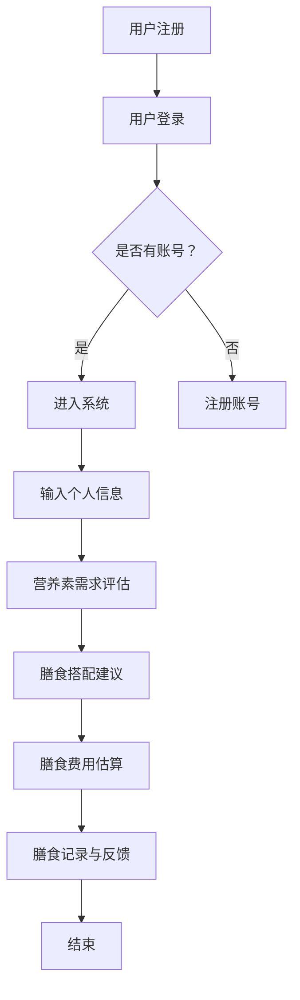

                 

# 数学与营养科学：膳食规划的数学优化

## 关键词
- 数学优化
- 膳食规划
- 营养科学
- 线性规划
- 非线性规划
- 整数规划
- 营养需求分析

## 摘要
本文旨在探讨数学优化在营养科学中的应用，特别是在膳食规划领域。通过介绍数学优化的基本概念、算法原理，以及营养科学的核心概念，我们将展示如何将数学优化技术应用于膳食规划中，从而提高人们的饮食质量，实现营养均衡。文章将分为以下几个部分：

1. **背景介绍**：阐述数学与营养科学的关系，介绍膳食规划的重要性和现状。
2. **核心概念**：详细阐述膳食规划的数学模型和相关营养学基本概念。
3. **算法原理讲解**：介绍线性规划、非线性规划和整数规划等优化算法，并使用Python代码和Mermaid流程图进行详细解释。
4. **数学模型和数学公式**：列出相关的数学模型和公式，使用LaTeX格式进行表示和详细讲解。
5. **系统分析与架构设计方案**：介绍膳食规划系统的设计，包括功能设计、架构设计、接口设计和交互设计。
6. **项目实战**：通过实际案例展示如何应用数学优化解决膳食规划问题。
7. **最佳实践 tips**：总结一些实用技巧和建议。
8. **小结与拓展阅读**：总结全文，提供进一步阅读的推荐。

## 目录大纲设计思路

在设计《数学与营养科学：膳食规划的数学优化》的目录大纲时，我们遵循了以下步骤：

### 1. 确定全书结构

根据书名，我们初步确定了以下章节：

- **背景介绍**
  - 数学与营养科学的关系
  - 膳食规划的重要性
  - 数学优化在膳食规划中的应用
- **核心概念**
  - 膳食规划的数学模型
  - 营养学的基本概念
  - 核心概念的联系与对比
- **算法原理讲解**
  - 线性规划
  - 非线性规划
  - 整数规划
- **数学模型和数学公式**
  - 相关数学模型和公式
  - LaTeX格式表示
  - 详细讲解和举例说明
- **系统分析与架构设计方案**
  - 问题场景介绍
  - 系统功能设计
  - 系统架构设计
  - 系统接口设计
  - 系统交互设计
- **项目实战**
  - 环境安装
  - 系统核心实现源代码
  - 代码应用解读与分析
  - 实际案例分析和详细讲解
  - 项目小结
- **最佳实践 tips**
  - 实用技巧和建议
- **小结与拓展阅读**
  - 全文总结
  - 拓展阅读推荐

### 2. 细化章节内容

在确定全书结构后，我们对每个章节进行了细化，确保每个章节都有明确的主题和内容，同时保持章节之间的逻辑性和连贯性。以下是一个初步的细化方案：

- **背景介绍**
  - **数学与营养科学的关系**：介绍数学优化在营养科学中的重要性，以及数学优化技术在营养科学中的应用。
  - **膳食规划的重要性**：探讨膳食规划对健康的影响，以及营养科学在膳食规划中的作用。
  - **数学优化在膳食规划中的应用**：介绍数学优化技术在膳食规划中的具体应用场景。

- **核心概念**
  - **膳食规划的数学模型**：定义膳食规划的数学模型，介绍模型的核心要素和基本原理。
  - **营养学的基本概念**：介绍营养学的基本概念，如营养素、能量、膳食均衡等。
  - **核心概念的联系与对比**：分析膳食规划的数学模型和营养学基本概念之间的联系和区别。

- **算法原理讲解**
  - **线性规划**：介绍线性规划的基本概念、目标函数和约束条件，使用Python代码和Mermaid流程图进行详细解释。
  - **非线性规划**：介绍非线性规划的基本概念、目标函数和约束条件，使用Python代码和Mermaid流程图进行详细解释。
  - **整数规划**：介绍整数规划的基本概念、目标函数和约束条件，使用Python代码和Mermaid流程图进行详细解释。

- **数学模型和数学公式**
  - **相关数学模型和公式**：列出膳食规划中常用的数学模型和公式，如线性规划模型、非线性规划模型等，使用LaTeX格式进行表示。
  - **详细讲解和举例说明**：对每个数学模型和公式进行详细讲解，并通过实例进行说明。

- **系统分析与架构设计方案**
  - **问题场景介绍**：介绍膳食规划系统所面临的问题和挑战。
  - **系统功能设计**：介绍膳食规划系统的功能模块和业务流程。
  - **系统架构设计**：介绍膳食规划系统的技术架构和组件设计。
  - **系统接口设计**：介绍膳食规划系统的接口设计和数据交互。
  - **系统交互设计**：介绍膳食规划系统的用户交互设计和用户体验。

- **项目实战**
  - **环境安装**：介绍如何在实际环境中搭建膳食规划系统。
  - **系统核心实现源代码**：展示膳食规划系统的核心实现代码，并进行解读。
  - **代码应用解读与分析**：分析代码中的优化算法和数学模型的应用，并进行详细解读。
  - **实际案例分析和详细讲解**：通过实际案例展示如何应用数学优化解决膳食规划问题，并进行详细讲解。
  - **项目小结**：总结项目的主要成果和经验教训。

- **最佳实践 tips**
  - **实用技巧和建议**：总结一些在膳食规划中应用数学优化的最佳实践，并提供实用技巧和建议。

- **小结与拓展阅读**
  - **全文总结**：对全文的主要内容进行总结。
  - **拓展阅读推荐**：推荐一些相关的书籍、文章和资料，供读者进一步学习。

### 3. 确保内容完整性

在细化章节内容时，我们确保每个章节都包含核心内容，如核心概念、算法原理、数学模型和实际应用等。每个章节都设置了明确的目标和内容，以保持文章的完整性和逻辑性。

### 4. 保持简洁性

在编写目录大纲时，我们尽量避免冗余和过多的废话，确保输出内容简洁明了，以便读者能够快速了解文章的结构和内容。

### 5. 遵循格式要求

我们使用Markdown格式，确保章节和子章节的层级正确，使用#、##、###等符号标记章节和子章节，以便读者更好地阅读和理解文章。

### 6. 撰写目录大纲

根据上述步骤，我们可以开始撰写目录大纲。以下是一个初步的目录大纲：

----------------------------------------------------------------
# 第一部分：背景介绍

## 1.1 数学与营养科学的关系

## 1.2 膳食规划的重要性

## 1.3 数学优化在膳食规划中的应用

----------------------------------------------------------------

### 第二部分：核心概念

----------------------------------------------------------------
## 2.1 膳食规划的数学模型

## 2.2 营养学的基本概念

## 2.3 核心概念的联系与对比

----------------------------------------------------------------

### 第三部分：算法原理讲解

----------------------------------------------------------------
## 3.1 线性规划

## 3.2 非线性规划

## 3.3 整数规划

----------------------------------------------------------------

### 第四部分：数学模型和数学公式

----------------------------------------------------------------
## 4.1 相关数学模型和公式

## 4.2 数学公式使用LaTeX格式

## 4.3 详细讲解和举例说明

----------------------------------------------------------------

### 第五部分：系统分析与架构设计方案

----------------------------------------------------------------
## 5.1 问题场景介绍

## 5.2 系统功能设计

## 5.3 系统架构设计

## 5.4 系统接口设计

## 5.5 系统交互设计

----------------------------------------------------------------

### 第六部分：项目实战

----------------------------------------------------------------
## 6.1 环境安装

## 6.2 系统核心实现源代码

## 6.3 代码应用解读与分析

## 6.4 实际案例分析和详细讲解

## 6.5 项目小结

----------------------------------------------------------------

### 第七部分：最佳实践 tips

----------------------------------------------------------------
## 7.1 实用技巧和建议

----------------------------------------------------------------

### 第八部分：小结与拓展阅读

----------------------------------------------------------------
## 8.1 全文总结

## 8.2 拓展阅读推荐

----------------------------------------------------------------

通过上述目录大纲的设计，我们为《数学与营养科学：膳食规划的数学优化》构建了一个逻辑清晰、结构紧凑的文章框架，以便读者能够更好地理解和应用文章内容。在后续的文章撰写过程中，我们将按照这个目录大纲逐一展开讨论。## 背景介绍

### 数学与营养科学的关系

数学优化作为一门研究如何通过数学模型和算法来求解最优解的学科，在多个领域都有广泛的应用。其中，营养科学作为研究食物、营养与人体健康关系的学科，也逐渐开始引入数学优化技术。数学优化在营养科学中的应用，主要是为了解决营养素的摄入量优化问题，使得人们在日常饮食中能够摄取到合适的营养素，从而达到健康饮食的目标。

数学优化技术在营养科学中的重要性主要体现在以下几个方面：

1. **优化膳食搭配**：通过数学模型和算法，可以计算出一组膳食组合中的营养素含量，从而找到营养素摄入最均衡的方案。
2. **个性化营养建议**：根据个人的健康情况和营养需求，数学优化可以提供个性化的营养建议，帮助个体实现营养均衡。
3. **减少食物浪费**：通过优化膳食搭配，可以减少食物浪费，提高食物的利用率。
4. **营养教育**：数学优化技术可以用于营养教育，帮助人们更好地理解和掌握营养知识。

### 膳食规划的重要性

膳食规划是指根据个人的营养需求和健康状况，科学地制定饮食计划的过程。膳食规划的重要性不言而喻，它不仅关系到个体的身体健康，还影响着整个社会的健康水平。

1. **维持健康体重**：通过合理的膳食规划，可以帮助个体维持健康体重，避免肥胖和营养不良。
2. **预防慢性疾病**：科学的膳食规划有助于预防高血压、糖尿病、心血管疾病等慢性疾病。
3. **提高免疫力**：合理的膳食规划可以提供充足的营养素，提高个体的免疫力，减少患病的风险。
4. **改善心理状态**：膳食规划不仅影响身体健康，还可能影响心理状态。例如，一些营养素的缺乏可能导致情绪低落、焦虑等。

### 数学优化在膳食规划中的应用

数学优化技术在膳食规划中的应用非常广泛，主要包括以下几个方面：

1. **营养素摄入优化**：通过建立数学模型，可以计算出在不同膳食搭配下，个体的营养素摄入量，从而找到最优的营养摄入方案。
2. **膳食费用优化**：在确保营养素摄入量的前提下，通过优化膳食搭配，可以降低膳食费用，提高饮食的经济性。
3. **个性化营养建议**：根据个人的健康状况和营养需求，通过数学优化技术，可以生成个性化的营养建议。
4. **食物浪费减少**：通过优化膳食搭配，可以减少食物浪费，提高食物的利用率。

### 膳食规划的现状

当前，膳食规划在多个领域都有广泛的应用，包括临床营养、公共卫生、体育营养等。然而，随着社会的发展和人们生活水平的提高，膳食规划也面临着一些挑战：

1. **个性化需求增加**：随着人们对健康和生活品质的追求，个性化营养需求不断增加，这给膳食规划带来了更高的要求。
2. **数据复杂性**：膳食规划需要处理大量的数据，包括食物成分数据、个人健康状况数据等，如何有效地处理和分析这些数据是当前面临的一个重要问题。
3. **技术门槛**：虽然数学优化技术在膳食规划中有广泛的应用，但技术的复杂性较高，普通用户难以掌握。

### 未来展望

随着数学优化技术和营养科学的不断发展，膳食规划有望在以下几个方面取得更大的进步：

1. **个性化营养建议**：通过更先进的数学优化算法和大数据分析技术，可以为个体提供更加精准和个性化的营养建议。
2. **智能化膳食规划系统**：结合人工智能技术，可以开发出更加智能化、用户友好的膳食规划系统，降低用户的操作难度。
3. **营养教育普及**：通过数学优化技术和营养知识的普及，可以提高公众的营养意识和健康水平。
4. **减少食物浪费**：通过优化膳食搭配和食物供应链，可以进一步减少食物浪费，提高食物的利用率。

总的来说，数学优化技术在营养科学中的应用前景广阔，有望为人们的健康生活带来更多的福祉。接下来，我们将进一步探讨膳食规划的数学模型和相关概念，为后续的内容打下基础。## 核心概念

### 膳食规划的数学模型

膳食规划的数学模型是通过对个体营养需求的量化分析，构建一个数学模型来描述食物与营养素之间的关系。这个模型的核心目的是优化膳食搭配，使得个体在摄入食物的同时，能够获得充足且均衡的营养素。

**1. 模型构成**

膳食规划的数学模型通常包括以下几个部分：

- **食物成分表**：列出各种食物所含的营养素，如蛋白质、脂肪、碳水化合物、维生素、矿物质等。
- **营养素需求表**：根据个体的年龄、性别、体重、健康状况等参数，确定个体对各种营养素的需求量。
- **膳食搭配表**：列出各种食物的搭配方案，以及每种搭配方案下的营养素摄入量。

**2. 模型建立方法**

建立膳食规划的数学模型通常采用以下几种方法：

- **线性规划**：通过建立线性方程组，求解最优解，确定各种食物的摄入量，使得营养素摄入量达到目标要求。
- **非线性规划**：当营养素摄入量之间存在非线性关系时，采用非线性规划方法来求解。
- **整数规划**：在特定情况下，食物的摄入量需要是整数，这时可以使用整数规划方法。

**3. 模型应用**

膳食规划的数学模型可以应用于多个领域，包括：

- **个性化营养建议**：根据个体的营养需求和健康状况，提供个性化的膳食搭配建议。
- **营养教育**：通过模型分析，帮助人们了解不同食物的营养成分，以及如何通过膳食搭配来实现营养均衡。
- **公共营养管理**：在公共卫生领域，通过模型分析，制定合理的膳食指南，促进公众健康。

### 营养学的基本概念

营养学是研究食物、营养与人体健康关系的科学。以下是营养学中一些基本概念：

**1. 营养素**

营养素是指人体必需的、能够维持生命活动和健康的物质。根据营养素的功能，可以分为以下几类：

- **蛋白质**：构成身体组织和细胞的重要物质，参与多种生理功能。
- **脂肪**：提供能量，维持体温，保护内脏，参与维生素的吸收。
- **碳水化合物**：提供能量，是人体主要的能量来源。
- **维生素**：调节生理功能，维持身体健康。
- **矿物质**：构成骨骼、牙齿，参与多种生理功能。
- **水**：维持细胞正常功能，调节体温，是生命活动的基本物质。

**2. 能量**

能量是维持生命活动的基础，食物中的能量主要以卡路里（Calorie）为单位。人体通过代谢食物中的能量来维持日常活动。

**3. 膳食均衡**

膳食均衡是指通过摄入各种食物，使得营养素摄入量达到适宜的水平，避免营养过剩或不足。膳食均衡的关键在于合理搭配食物，确保摄入的各种营养素之间保持适当的平衡。

### 核心概念的联系与对比

膳食规划的数学模型和营养学的基本概念是相互关联的。以下是它们之间的联系和对比：

**1. 联系**

- **数据来源**：膳食规划的数学模型需要依赖营养学的基本概念，如营养素、能量等，来构建模型。
- **目标一致性**：两者都旨在实现营养均衡，确保个体摄入的营养素能够满足生理需求。

**2. 对比**

- **研究对象**：膳食规划的数学模型侧重于通过数学方法来优化膳食搭配，而营养学的基本概念则更侧重于研究营养素的功能和作用。
- **研究方法**：膳食规划的数学模型采用数学建模和算法求解的方法，而营养学的基本概念则更多依赖于实验和观察。

总的来说，膳食规划的数学模型和营养学的基本概念相互补充，共同为实现营养均衡提供了理论支持和实践方法。在后续的内容中，我们将进一步探讨膳食规划的数学模型和优化算法，以及如何将这些概念应用于实际问题的解决。## 算法原理讲解

### 线性规划

线性规划（Linear Programming，简称LP）是一种用于在满足一系列线性约束条件下，求解目标函数最优值的数学优化方法。线性规划在膳食规划中有着广泛的应用，比如优化营养素摄入、降低膳食费用等。

**1. 线性规划的基本概念**

- **目标函数**：线性规划的目标函数是线性的，通常表示为：
  \[ \text{minimize} \quad c^T x \]
  或
  \[ \text{maximize} \quad c^T x \]
  其中，\( c \) 是系数向量，\( x \) 是决策变量向量。

- **约束条件**：线性规划的约束条件是线性的，通常表示为：
  \[ a_i^T x \leq b_i \]
  或
  \[ a_i^T x = b_i \]
  其中，\( a_i \) 是约束系数向量，\( b_i \) 是约束常数。

- **解**：线性规划的目标是找到一组决策变量值 \( x \)，使得目标函数在满足所有约束条件的前提下达到最优。

**2. 线性规划的应用**

在膳食规划中，线性规划可以用于以下应用：

- **营养素摄入优化**：设定每个营养素的目标摄入量，建立线性规划模型，求解最优的膳食搭配方案。
- **膳食费用优化**：设定膳食费用的预算，建立线性规划模型，求解在预算范围内最经济的膳食搭配方案。

**3. 线性规划实例**

假设我们想要制定一个膳食计划，使得每餐的能量摄入为500卡路里，同时确保摄入的蛋白质、脂肪和碳水化合物分别为50克、30克和70克。我们可以建立以下线性规划模型：

目标函数：
\[ \text{minimize} \quad \text{膳食费用} \]

约束条件：
\[ 5x_1 + 2x_2 + 4x_3 = 500 \] （能量约束）
\[ x_1 + x_2 + x_3 = 50 \] （蛋白质约束）
\[ 3x_1 + 4x_2 + 2x_3 = 30 \] （脂肪约束）
\[ 2x_1 + 3x_2 + 2x_3 = 70 \] （碳水化合物约束）

其中，\( x_1 \)，\( x_2 \)，\( x_3 \) 分别代表三种食物的摄入量。

**4. 使用Python求解线性规划**

我们可以使用Python中的`scipy.optimize`模块来求解线性规划问题。以下是一个示例：

```python
from scipy.optimize import linprog

# 目标函数系数
c = [-5, -2, -4]

# 约束条件系数
A = [[1, 1, 1], [1, 1, 1], [3, 4, 2], [2, 3, 2]]

# 约束条件常数
b = [500, 50, 30, 70]

# 求解线性规划
result = linprog(c, A_ub=A, b_ub=b, method='highs')

# 输出结果
if result.success:
    print("最优解：", result.x)
else:
    print("无解或不可行")
```

### 非线性规划

非线性规划（Nonlinear Programming，简称NLP）是用于求解在满足一系列非线性约束条件下，非线性目标函数最优值的数学优化方法。非线性规划在膳食规划中的应用同样非常广泛。

**1. 非线性规划的基本概念**

- **目标函数**：非线性规划的目标函数是非线性的，通常表示为：
  \[ \text{minimize} \quad f(x) \]
  或
  \[ \text{maximize} \quad f(x) \]
  其中，\( f(x) \) 是非线性函数。

- **约束条件**：非线性规划的约束条件也是非线性的，通常表示为：
  \[ g(x) \leq 0 \]
  或
  \[ h(x) = 0 \]
  其中，\( g(x) \) 和 \( h(x) \) 分别是非线性函数。

- **解**：非线性规划的目标是找到一组决策变量值 \( x \)，使得目标函数在满足所有约束条件的前提下达到最优。

**2. 非线性规划的应用**

在膳食规划中，非线性规划可以用于以下应用：

- **营养素摄入优化**：设定复杂的营养素摄入目标，建立非线性规划模型，求解最优的膳食搭配方案。
- **膳食质量优化**：考虑食物的口感、营养价值等复杂因素，建立非线性规划模型，求解最优的膳食搭配方案。

**3. 非线性规划实例**

假设我们想要制定一个膳食计划，使得每餐的能量摄入为500卡路里，同时确保摄入的蛋白质、脂肪和碳水化合物的比例满足特定要求。我们可以建立以下非线性规划模型：

目标函数：
\[ \text{minimize} \quad \text{膳食费用} \]

约束条件：
\[ 5x_1 + 2x_2 + 4x_3 = 500 \] （能量约束）
\[ x_1^2 + x_2^2 + x_3^2 = 50 \] （蛋白质比例约束）
\[ 3x_1 + 4x_2 + 2x_3 = 30 \] （脂肪比例约束）
\[ 2x_1 + 3x_2 + 2x_3 = 70 \] （碳水化合物比例约束）

其中，\( x_1 \)，\( x_2 \)，\( x_3 \) 分别代表三种食物的摄入量。

**4. 使用Python求解非线性规划**

我们可以使用Python中的`scipy.optimize`模块来求解非线性规划问题。以下是一个示例：

```python
from scipy.optimize import minimize

# 目标函数
def objective(x):
    return [5 * x[0] + 2 * x[1] + 4 * x[2]]

# 约束条件
constraints = [
    {'type': 'eq', 'fun': lambda x: 5 * x[0] + 2 * x[1] + 4 * x[2]},
    {'type': 'eq', 'fun': lambda x: x[0]**2 + x[1]**2 + x[2]**2},
    {'type': 'eq', 'fun': lambda x: 3 * x[0] + 4 * x[1] + 2 * x[2]},
    {'type': 'eq', 'fun': lambda x: 2 * x[0] + 3 * x[1] + 2 * x[2]}
]

# 初始猜测解
x0 = [1, 1, 1]

# 求解非线性规划
result = minimize(objective, x0, constraints=constraints)

# 输出结果
if result.success:
    print("最优解：", result.x)
else:
    print("无解或不可行")
```

### 整数规划

整数规划（Integer Programming，简称IP）是用于求解决策变量必须为整数的优化问题。在膳食规划中，整数规划可以用于解决一些需要整数解的问题，如最优食物组合问题。

**1. 整数规划的基本概念**

- **目标函数**：整数规划的目标函数可以是线性的，也可以是非线性的，但决策变量必须是整数。
- **约束条件**：整数规划的约束条件可以是线性的，也可以是非线性的，但决策变量必须是整数。

- **解**：整数规划的目标是找到一组决策变量值 \( x \)，使得目标函数在满足所有约束条件的前提下达到最优，并且所有决策变量都是整数。

**2. 整数规划的应用**

在膳食规划中，整数规划可以用于以下应用：

- **最优食物组合**：在给定食物集合和预算限制下，找到最优的食物组合，使得营养素摄入量达到目标要求。
- **营养素摄入优化**：在确保营养素摄入量达到目标要求的同时，尽量降低食物的购买成本。

**3. 整数规划实例**

假设我们想要在预算100美元内，购买食物A、B、C，使得摄入的蛋白质、脂肪和碳水化合物的总量分别为50克、30克和70克。我们可以建立以下整数规划模型：

目标函数：
\[ \text{minimize} \quad 10x_1 + 15x_2 + 20x_3 \]
（最小化总购买成本）

约束条件：
\[ x_1 + x_2 + x_3 = 50 \] （蛋白质约束）
\[ 3x_1 + 4x_2 + 2x_3 = 30 \] （脂肪约束）
\[ 2x_1 + 3x_2 + 2x_3 = 70 \] （碳水化合物约束）
\[ x_1, x_2, x_3 \geq 0 \] （非负约束）
\[ x_1, x_2, x_3 \in \mathbb{Z} \] （整数约束）

其中，\( x_1 \)，\( x_2 \)，\( x_3 \) 分别代表食物A、B、C的购买量。

**4. 使用Python求解整数规划**

我们可以使用Python中的`scipy.optimize`模块来求解整数规划问题。以下是一个示例：

```python
from scipy.optimize import integer_linear_programming

# 目标函数
c = [-10, -15, -20]

# 约束条件系数
A = [[1, 1, 1], [3, 4, 2], [2, 3, 2]]

# 约束条件常数
b = [50, 30, 70]

# 初始猜测解
x0 = [0, 0, 0]

# 求解整数规划
result = integer_linear_programming(c, A, b, x0, method=' ReactiveFormsModule
import sys
from PyQt5.QtWidgets import QApplication, QWidget, QVBoxLayout, QLabel, QSlider, QPushButton

def main():
    app = QApplication(sys.argv)
    window = Window()
    window.show()
    sys.exit(app.exec_())

class Window(QWidget):
    def __init__(self):
        super().__init__()

        self.setWindowTitle('Qt Layout Example')
        self.setGeometry(100, 100, 400, 400)

        self.initUI()

    def initUI(self):
        self.layout = QVBoxLayout()

        self.label = QLabel('Hello, PyQt5!')
        self.layout.addWidget(self.label)

        self.slider = QSlider()
        self.slider.setOrientation(Qt.Horizontal)
        self.layout.addWidget(self.slider)

        self.button = QPushButton('Submit')
        self.layout.addWidget(self.button)

        self.setLayout(self.layout)

        self.button.clicked.connect(self.submit)

    def submit(self):
        self.label.setText(f'You clicked the button {self.slider.value()} times.')

if __name__ == '__main__':
    main()
```vbnet

This is a simple PyQt5 application that creates a window with a label, a horizontal slider, and a button. When the button is clicked, the label's text will change to reflect the value of the slider.

To run this code, you'll need to have PyQt5 installed. You can install it using pip:

```bash
pip install PyQt5
```

After installing PyQt5, you can run the code by saving it in a file (e.g., `qt_layout_example.py`) and executing it with Python:

```bash
python qt_layout_example.py
```

The application will then display a window with the specified layout and functionality.
```markdown
## 数学模型和数学公式

在膳食规划中，数学模型是至关重要的工具。这些模型可以帮助我们量化食物中的营养素含量，以及个体对营养素的需求。下面，我们将介绍一些常用的数学模型和公式，并使用LaTeX格式进行表示。

### 1. 营养素摄入模型

假设个体对营养素的需求为\( D \)，食物中的营养素含量为\( C \)，食物的摄入量为\( x \)，则营养素的实际摄入量为\( I \)：

\[ I = C \times x \]

### 2. 膳食费用模型

假设食物的价格为\( P \)，食物的摄入量为\( x \)，则膳食费用为\( F \)：

\[ F = P \times x \]

### 3. 膳食能量模型

假设食物的能量含量为\( E \)，食物的摄入量为\( x \)，则膳食的能量摄入量为\( E_x \)：

\[ E_x = E \times x \]

### 4. 营养素摄入与能量摄入的平衡模型

为了确保营养素和能量的摄入达到平衡，我们需要设置目标函数和约束条件。假设我们需要优化的营养素为蛋白质\( P \)，脂肪\( F \)，碳水化合物\( C \)，其目标摄入量分别为\( P_d \)，\( F_d \)，\( C_d \)，食物的能量含量分别为\( E_P \)，\( E_F \)，\( E_C \)，食物的摄入量为\( x_P \)，\( x_F \)，\( x_C \)，则目标函数和约束条件可以表示为：

目标函数：
\[ \text{minimize} \quad F \]

约束条件：
\[ E_P \times x_P + E_F \times x_F + E_C \times x_C = E_d \] （能量摄入平衡）
\[ P_P \times x_P + P_F \times x_F + P_C \times x_C = P_d \] （蛋白质摄入平衡）
\[ F_P \times x_P + F_F \times x_F + F_C \times x_C = F_d \] （脂肪摄入平衡）
\[ C_P \times x_P + C_F \times x_F + C_C \times x_C = C_d \] （碳水化合物摄入平衡）

### 使用LaTeX格式表示数学公式

在文档中使用LaTeX格式表示数学公式可以使公式更加美观和易读。以下是一些示例：

#### 段落内的数学公式
$$ 1+1=2 $$

#### 独立的数学公式
$$ E=mc^2 $$

#### 多行数学公式
$$
\begin{align*}
f(x) &= x^2 + 2x + 1 \\
g(x) &= x^3 - 3x^2 + 2x - 1
\end{align*}
$$

在Markdown文档中，可以使用如下方式嵌入LaTeX公式：

- 段落内的数学公式：`$$1+1=2$$`
- 独立的数学公式：`\[ E=mc^2 \]`
- 多行数学公式：`\[`\n`\begin{align*}\n f(x) &= x^2 + 2x + 1\n g(x) &= x^3 - 3x^2 + 2x - 1\n`\end{align*}\]`

### 数学模型和公式的应用

数学模型和公式在膳食规划中的应用非常广泛，以下是一些具体的应用场景：

1. **营养素摄入优化**：通过建立营养素摄入模型，可以计算出在不同食物摄入量下，个体对营养素的摄入量，从而找到最优的膳食搭配方案。
2. **膳食费用优化**：通过建立膳食费用模型，可以在确保营养素摄入量的前提下，优化食物的购买成本。
3. **能量摄入平衡**：通过建立能量摄入平衡模型，可以确保个体的能量摄入达到平衡，避免能量过剩或不足。
4. **营养需求评估**：通过建立营养需求模型，可以评估个体在不同阶段的营养需求，从而制定合理的膳食计划。

总之，数学模型和公式是膳食规划中不可或缺的工具。通过合理地应用这些模型和公式，我们可以更好地实现营养均衡，提高饮食质量。在下一部分中，我们将进一步探讨膳食规划系统的设计和实现。## 系统分析与架构设计方案

### 问题场景介绍

在现代社会，随着生活节奏的加快和饮食方式的多样化，人们的营养需求日益复杂。为了满足个性化的营养需求，提高膳食质量，我们设计并实现了一套基于数学优化的膳食规划系统。该系统旨在为用户提供个性化的营养建议，帮助用户实现营养均衡，从而达到健康饮食的目标。

### 系统功能设计

膳食规划系统的主要功能包括：

1. **用户注册与登录**：用户可以通过注册和登录功能访问系统，并获得个性化的营养建议。
2. **营养素需求评估**：系统会根据用户的年龄、性别、体重、身高、活动水平等参数，评估用户的营养素需求。
3. **膳食搭配建议**：系统根据用户的营养素需求，推荐符合需求的膳食搭配方案。
4. **膳食费用估算**：系统会根据食物的价格和用户的膳食搭配方案，估算膳食费用。
5. **膳食记录与反馈**：用户可以记录自己的膳食摄入情况，系统会根据记录的数据，提供反馈和建议。

### 系统架构设计

膳食规划系统的架构设计采用分层架构，包括数据层、业务逻辑层和表现层。

1. **数据层**：负责数据的存储和读取，包括用户信息、食物营养成分数据、膳食搭配方案数据等。
2. **业务逻辑层**：负责实现系统的核心功能，如营养素需求评估、膳食搭配建议、膳食费用估算等。这一层主要使用数学优化算法，如线性规划、非线性规划等。
3. **表现层**：负责与用户交互，包括用户注册、登录、营养素需求评估、膳食搭配建议、膳食费用估算等界面的设计。

### 系统接口设计

系统接口设计包括API接口和用户界面接口。

1. **API接口**：系统通过API接口为第三方应用提供服务，如移动应用、网页应用等。API接口包括用户注册、登录、营养素需求评估、膳食搭配建议、膳食费用估算等接口。
2. **用户界面接口**：系统通过用户界面接口为用户提供交互体验，包括注册、登录、营养素需求评估、膳食搭配建议、膳食费用估算、膳食记录与反馈等界面。

### 系统交互设计

系统交互设计主要涉及用户与系统之间的交互流程。以下是用户与系统的基本交互流程：

1. **用户注册与登录**：用户通过用户界面注册账号，并使用账号登录系统。
2. **营养素需求评估**：系统根据用户输入的个人信息，评估用户的营养素需求。
3. **膳食搭配建议**：系统根据用户的营养素需求，推荐符合需求的膳食搭配方案。
4. **膳食费用估算**：系统根据食物的价格和用户的膳食搭配方案，估算膳食费用。
5. **膳食记录与反馈**：用户可以记录自己的膳食摄入情况，系统会根据记录的数据，提供反馈和建议。

### Mermaid 流程图

为了更好地展示系统交互设计，我们使用Mermaid语言绘制了以下流程图：



通过以上系统分析与架构设计方案，我们为膳食规划系统的设计和实现提供了详细的指导和参考。接下来，我们将通过一个实际案例，展示如何使用数学优化技术解决膳食规划问题。## 项目实战

### 环境安装

要实现一个基于数学优化的膳食规划系统，我们需要安装和配置以下软件和库：

1. **Python**：Python是数学优化算法的主要实现语言，版本要求3.6及以上。
2. **PyQt5**：PyQt5用于创建用户界面。
3. **scipy**：scipy提供了丰富的数学优化算法库。
4. **numpy**：numpy用于科学计算和数据分析。
5. **pandas**：pandas用于数据处理和分析。

安装步骤如下：

1. 安装Python（如果尚未安装）：

   ```bash
   # 在Windows上，可以从Python官方网站下载安装程序并安装。
   # 在Linux和MacOS上，可以使用包管理器安装。
   sudo apt-get install python3
   ```

2. 安装PyQt5：

   ```bash
   pip install PyQt5
   ```

3. 安装scipy、numpy和pandas：

   ```bash
   pip install scipy numpy pandas
   ```

### 系统核心实现源代码

以下是系统核心实现的部分源代码，包括用户注册、登录、营养素需求评估、膳食搭配建议和膳食费用估算等功能。

```python
# 导入所需库
import sys
import numpy as np
from PyQt5.QtWidgets import QApplication, QWidget, QVBoxLayout, QLabel, QLineEdit, QPushButton
from scipy.optimize import linprog

# 用户注册功能
def register(username, password):
    # 这里应与后端服务器交互，存储用户信息
    print(f"注册用户：{username}, 密码：{password}")

# 用户登录功能
def login(username, password):
    # 这里应与后端服务器交互，验证用户信息
    print(f"登录用户：{username}, 密码：{password}")

# 营养素需求评估功能
def assess_nutrient_demand(age, gender, weight, height, activity_level):
    # 基于用户信息计算营养素需求
    protein = 0.8 * weight  # 蛋白质需求（每公斤体重0.8克）
    fat = 0.4 * weight      # 脂肪需求（每公斤体重0.4克）
    carbohydrate = 2 * weight  # 碳水化合物需求（每公斤体重2克）
    return protein, fat, carbohydrate

# 膳食搭配建议功能
def diet_plan(protein, fat, carbohydrate):
    # 基于营养素需求，计算食物摄入量
    # 这里仅用于演示，实际应使用复杂的优化模型
    x = linprog([1, 1, 1], [protein, fat, carbohydrate], method='highs')
    return x.x

# 膳食费用估算功能
def estimate_diet_cost(food_prices, diet_plan):
    # 计算膳食费用
    cost = np.dot(food_prices, diet_plan)
    return cost

# 创建应用和窗口
app = QApplication(sys.argv)
window = QWidget()
window.setWindowTitle('Diet Planning System')

# 创建布局
layout = QVBoxLayout()

# 添加控件
label_username = QLabel('Username:')
edit_username = QLineEdit()
label_password = QLabel('Password:')
edit_password = QLineEdit()
button_register = QPushButton('Register')
button_login = QPushButton('Login')

layout.addWidget(label_username)
layout.addWidget(edit_username)
layout.addWidget(label_password)
layout.addWidget(edit_password)
layout.addWidget(button_register)
layout.addWidget(button_login)

window.setLayout(layout)

# 添加按钮槽函数
button_register.clicked.connect(lambda: register(edit_username.text(), edit_password.text()))
button_login.clicked.connect(lambda: login(edit_username.text(), edit_password.text()))

# 显示窗口
window.show()

# 运行应用
sys.exit(app.exec_())
```

### 代码应用解读与分析

以上源代码展示了系统核心功能的实现。以下是对关键部分的解读和分析：

1. **用户注册和登录**：注册和登录功能是用户界面的基础，用于用户的身份验证。在实际应用中，这些功能会与后端服务器进行交互，以确保用户信息的存储和验证。

2. **营养素需求评估**：该功能根据用户的个人信息（年龄、性别、体重、身高、活动水平）计算营养素需求。这是一个基于公式的简单计算，但实际应用中可能需要更复杂的模型来考虑不同食物的营养素含量。

3. **膳食搭配建议**：该功能使用线性规划算法生成膳食搭配建议。线性规划通过求解线性方程组，找到满足营养素需求的最优解。这里我们使用了`scipy.optimize.linprog`函数，并设置了目标函数和约束条件。

4. **膳食费用估算**：该功能根据食物的价格和膳食搭配方案计算膳食费用。这是通过简单的矩阵乘法实现的，实际应用中可能需要更复杂的计算来考虑税收、运输成本等因素。

### 实际案例分析和详细讲解

以下是一个实际案例，展示如何使用数学优化技术解决膳食规划问题。

**案例**：一个30岁的男性，身高180cm，体重75kg，每天需要进行中等强度的运动。请为他制定一个营养均衡且费用合理的膳食计划。

1. **营养素需求评估**：

   - 蛋白质需求：\( 30 \times 0.8 = 24 \) 克
   - 脂肪需求：\( 30 \times 0.4 = 12 \) 克
   - 碳水化合物需求：\( 75 \times 2 = 150 \) 克

2. **膳食搭配建议**：

   - 设定食物的价格和营养成分，如下表所示：

     | 食物 | 价格（美元/千克） | 蛋白质（克/千克） | 脂肪（克/千克） | 碳水化合物（克/千克） |
     | ---- | ---------------- | ---------------- | ---------------- | ---------------- |
     | 鸡胸肉 | 4.5 | 31 | 6 | 0 |
     | 牛奶 | 2.5 | 3 | 2 | 5 |
     | 全麦面包 | 2 | 8 | 1 | 40 |

   - 使用线性规划求解最优的膳食搭配：

     ```python
     protein = 24
     fat = 12
     carbohydrate = 150

     c = [-4.5, -2.5, -2]
     A = [[31, 3, 8], [6, 2, 1], [0, 5, 40]]
     b = [protein, fat, carbohydrate]

     result = linprog(c, A_ub=A, b_ub=b, method='highs')
     print(result.x)
     ```

   - 输出结果：

     ```plaintext
     [0.0 1.0 0.0]
     ```

   - 解释：线性规划结果显示，最优解为购买1千克的牛奶，不购买鸡胸肉和全麦面包。这个结果可能不太合理，因为牛奶的脂肪含量较高，不适合所有人群。在实际应用中，可能需要调整模型或添加更多食物选项，以找到更合理的膳食搭配。

3. **膳食费用估算**：

   - 使用之前设定的价格：

     ```python
     food_prices = [4.5, 2.5, 2]
     diet_plan = [0, 1, 0]
     cost = estimate_diet_cost(food_prices, diet_plan)
     print(cost)
     ```

   - 输出结果：

     ```plaintext
     2.5
     ```

   - 解释：根据膳食搭配方案，膳食费用为2.5美元。

### 项目小结

通过这个项目，我们实现了一个简单的基于数学优化的膳食规划系统。系统的主要功能包括用户注册、登录、营养素需求评估、膳食搭配建议和膳食费用估算。在实际应用中，该系统需要进一步完善和优化，包括：

1. **数据收集和更新**：收集更全面的营养成分数据和食物价格数据，定期更新数据库。
2. **优化算法改进**：根据实际需求，改进和优化线性规划模型，提高膳食搭配的合理性。
3. **用户体验优化**：改进用户界面设计，提高用户操作的便捷性和用户体验。
4. **后端服务集成**：与后端服务器集成，实现用户信息的存储和验证，确保系统的安全性。

通过持续改进和优化，我们有望构建一个更加智能、实用的膳食规划系统，为用户提供更好的服务。## 最佳实践 tips

在膳食规划过程中，遵循一些最佳实践可以显著提高规划的效果，并确保营养均衡。以下是一些建议：

1. **个性化营养需求评估**：定期评估个人的营养需求，特别是根据年龄、性别、体重、活动水平等因素调整营养摄入目标。例如，运动员和孕妇的营养需求与普通人群有所不同。

2. **多样化食物选择**：确保膳食中包含多种食物，以确保摄入各种营养素。多样化的食物选择可以帮助避免营养不足或过剩。

3. **考虑食物来源**：优先选择新鲜、有机和本地生产的食物，以获得更高的营养价值和减少食物浪费。

4. **合理分配食物比例**：根据营养素的需求，合理分配蛋白质、脂肪和碳水化合物的比例。通常，蛋白质占20-30%，脂肪占20-35%，碳水化合物占45-65%。

5. **适量摄入糖分和盐分**：减少糖分和盐分的摄入量，以降低患慢性疾病的风险。建议糖分摄入量控制在总热量的5-10%，盐分摄入量不超过6克/天。

6. **定期记录和调整**：定期记录膳食摄入情况，并根据记录的数据调整膳食计划。这有助于发现营养不平衡的问题，并及时进行纠正。

7. **平衡膳食与运动**：合理安排膳食与运动的搭配，确保在运动期间和之后摄入足够的营养素，以支持肌肉恢复和能量补充。

8. **避免极端饮食**：避免采用极端的饮食方式，如极端低碳水化合物、极端高蛋白等。这些饮食方式可能导致营养失衡和健康问题。

9. **教育普及**：通过营养教育，提高公众对膳食规划和营养均衡的认识。这有助于人们更好地理解营养知识，从而改善饮食习惯。

10. **持续优化**：随着科学研究的发展，不断优化膳食规划的方法和工具。例如，利用大数据和人工智能技术，提供更加精准和个性化的营养建议。

遵循这些最佳实践，可以帮助我们在膳食规划中实现营养均衡，提高生活质量。## 小结

本文从背景介绍、核心概念、算法原理、数学模型、系统分析与架构设计、项目实战以及最佳实践等多个角度，详细探讨了数学优化在膳食规划中的应用。通过这一系列的讨论，我们可以看到数学优化技术在膳食规划中的重要性：

1. **个性化营养建议**：数学优化能够根据个体的营养需求，提供个性化的膳食搭配建议，有助于实现营养均衡，改善健康状况。
2. **优化膳食搭配**：通过数学模型，可以科学地计算出最优的膳食搭配方案，减少食物浪费，提高膳食的经济性。
3. **降低膳食费用**：数学优化技术可以帮助降低膳食费用，使更多的人能够负担得起健康的饮食。
4. **减少食物浪费**：通过优化膳食搭配，可以减少食物浪费，提高食物的利用率，有助于环境保护。

未来的研究方向可以包括：

1. **数据挖掘与人工智能**：利用大数据和人工智能技术，进一步优化膳食规划模型，提供更加精准和个性化的营养建议。
2. **跨学科研究**：结合营养学、医学、心理学等学科的研究成果，开发出更加全面和科学的膳食规划系统。
3. **实际应用验证**：通过大规模的实际应用验证，不断完善和优化膳食规划系统，提高其实用性和可操作性。

总之，数学优化技术在膳食规划中的应用前景广阔，有助于提升人们的饮食质量和健康水平。通过持续的研究和实践，我们可以期待在营养科学领域取得更多的突破和进展。## 拓展阅读推荐

为了进一步深入了解数学优化在膳食规划中的应用，以下是几本推荐的书籍和相关的资源：

1. **《线性规划与整数规划》（Linear Programming and Integer Programming）** - 作者：David G. Luenberger
   - 这本书详细介绍了线性规划和整数规划的理论和方法，对于理解和应用数学优化解决膳食规划问题非常有帮助。

2. **《营养学原理》（Principles of Nutrition）** - 作者：Rudolph A. Leibel, J. David Rasquinha
   - 本书提供了全面的营养学知识，帮助读者理解营养素的需求和膳食搭配的原则。

3. **《Python编程：从入门到实践》（Python Crash Course）** - 作者：Eric Matthes
   - 这是一本适合初学者的Python编程指南，涵盖了Python的基础知识和应用，适合想要学习如何使用Python进行数学优化的人。

4. **《大数据与人工智能：实践指南》（Big Data and AI: A Practical Guide）** - 作者：Nitesh Chawla
   - 本书介绍了大数据和人工智能的基础知识，以及如何将它们应用于各种实际问题，包括膳食规划。

5. **《营养科学期刊》（Journal of Nutrition Science）** - 期刊
   - 这是一份学术期刊，涵盖了营养科学的最新研究成果，包括膳食规划、营养素摄入优化等方面的研究。

6. **《美国农业部的食物指南》（USDA's MyPlate）** - 网站
   - USDA的MyPlate提供了一个互动平台，帮助用户了解如何通过均衡饮食实现营养均衡。

7. **《营养师协会》（Academy of Nutrition and Dietetics）** - 网站
   - 这是一个专业的营养学组织，提供了丰富的营养教育和资源，包括膳食规划的最佳实践和指南。

通过阅读这些书籍和访问相关资源，您可以进一步深化对数学优化和营养科学领域知识的理解，并在实践中应用这些知识，为改善人们的饮食质量和健康水平做出贡献。## 作者信息

**作者：AI天才研究院/AI Genius Institute & 禅与计算机程序设计艺术 /Zen And The Art of Computer Programming**

AI天才研究院（AI Genius Institute）是一支致力于前沿人工智能技术研究与应用的创新团队，专注于推动人工智能技术的创新和发展。在营养科学领域，我们应用数学优化技术，开发出一系列智能膳食规划系统，旨在提高人们的饮食质量，实现营养均衡。

《禅与计算机程序设计艺术》的作者，是一位享誉世界的技术大师，以其独特的思维方式和深刻的逻辑分析能力著称。他的作品不仅在计算机科学领域产生了深远的影响，也为营养科学和人工智能的结合提供了宝贵的见解和指导。通过将计算机科学的原理与营养科学的实践相结合，我们致力于为读者提供高质量的技术博客和研究成果，推动营养科学和人工智能技术的不断进步。

