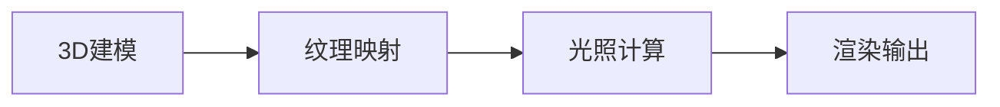
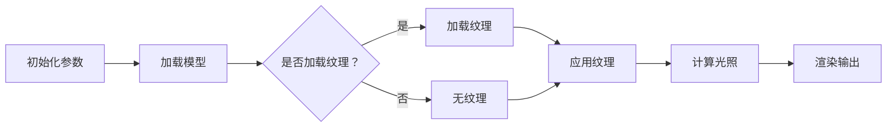
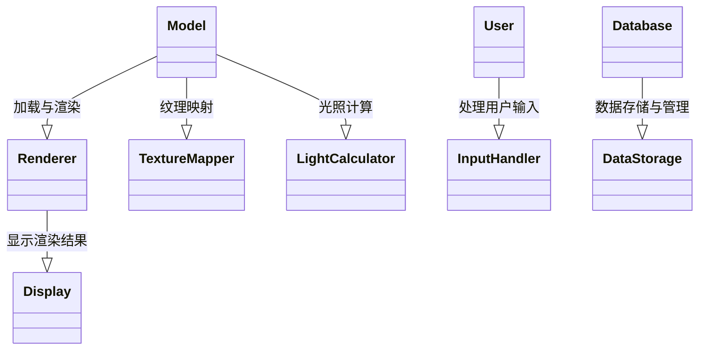
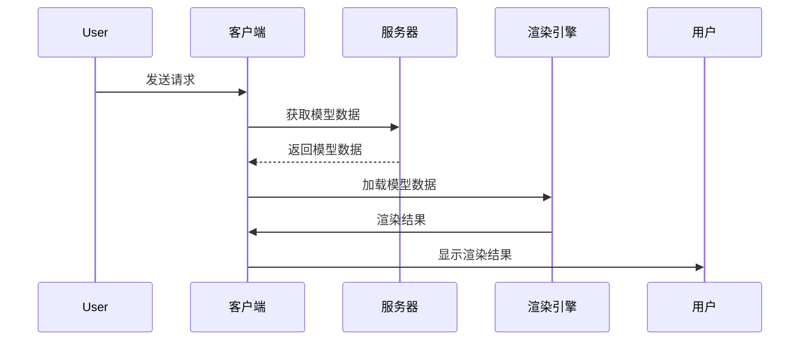

                 


## 数学与虚拟现实：3D环境构建的数学方法

### 关键词：数学、虚拟现实、3D环境构建、算法、系统架构

### 摘要：
本文深入探讨了数学在虚拟现实3D环境构建中的应用，从基础数学理论到3D建模技术，再到虚拟现实应用和系统架构设计，全面解析了数学方法在3D环境构建中的核心作用。通过项目实战，本文不仅提供了详细的实现步骤，还总结了最佳实践和注意事项，旨在为开发者提供一套完整的技术指南。

### 目录

#### 第一部分：背景介绍

1. 问题背景
    - 核心概念术语说明
    - 虚拟现实发展历程
    - 数学在虚拟现实中的重要性
    - 边界与外延

2. 核心概念与联系
    - 概念属性特征对比表格
    - ER实体关系图

#### 第二部分：数学方法

1. 基础数学理论
    - 空间几何
    - 向量与矩阵
    - 函数与微积分
    - 线性代数基础

2. 3D建模技术
    - 点、线、面的表示
    - 三角形网格建模
    - 四面体网格建模
    - 曲面建模

3. 纹理映射与光照
    - 纹理映射技术
    - 光照模型
    - 反射与折射
    - 阴影与模糊效果

4. 虚拟现实应用
    - 虚拟现实技术简介
    - 3D环境构建在VR中的应用
    - 虚拟现实硬件与软件
    - 应用案例分析

5. 数学模型与算法
    - 数学模型介绍
    - 算法原理讲解
    - 算法流程图
    - Python源代码解读
    - 数学模型与公式详细讲解
    - 举例说明

6. 系统分析与架构设计
    - 项目介绍
    - 系统功能设计
    - 系统架构设计
    - 系统接口设计
    - 系统交互序列图

#### 第三部分：项目实战

1. 环境安装与核心实现
    - 环境安装
    - 系统核心实现
    - 源代码解读
    - 代码应用分析与讲解
    - 实际案例剖析

2. 项目小结与最佳实践
    - 项目总结
    - 最佳实践 tips
    - 注意事项
    - 拓展阅读

### 1. 问题背景

#### 1.1 核心概念术语说明

在虚拟现实（Virtual Reality，VR）的3D环境构建中，我们常遇到以下几个核心概念：

- **3D建模**：通过数学方法创建三维物体和场景的过程。
- **纹理映射**：将二维纹理映射到三维物体表面的技术。
- **光照模型**：描述光线如何影响物体表面颜色的数学模型。
- **算法**：用于计算和处理3D数据的步骤和规则。
- **虚拟现实硬件**：用于提供沉浸式体验的设备，如头戴显示器、跟踪器等。

#### 1.2 虚拟现实发展历程

虚拟现实技术的发展经历了几个阶段：

- **早期实验**（1960s-1980s）：虚拟现实的概念首次提出，但技术受限。
- **早期商业应用**（1990s）：虚拟现实开始应用于教育和娱乐。
- **技术成熟**（2000s-2010s）：随着计算力和显示技术的提升，虚拟现实逐渐成熟。
- **广泛应用**（2010s至今）：虚拟现实广泛应用于游戏、设计、医疗等多个领域。

#### 1.3 数学在虚拟现实中的重要性

数学在虚拟现实中的重要性体现在以下几个方面：

- **3D建模**：需要使用空间几何和向量计算。
- **纹理映射**：涉及图像处理和变换。
- **光照模型**：需要使用函数和微积分。
- **算法**：用于优化和加速计算。

#### 1.4 边界与外延

虚拟现实3D环境构建的边界包括：

- 技术实现的可行性。
- 硬件设备的限制。
- 用户交互的体验。

### 2. 核心概念与联系

#### 2.1 概念属性特征对比表格

以下是一个简单的概念属性特征对比表格：

| 概念        | 特征1 | 特征2 | 特征3 |
| ----------- | ----- | ----- | ----- |
| 3D建模      | 空间几何 | 向量与矩阵 | 函数与微积分 |
| 纹理映射    | 图像处理 | 变换 | 材质 |
| 光照模型    | 几何光照 | 漫反射 | 镜面反射 |
| 算法        | 优化 | 加速 | 计算 |

#### 2.2 ER实体关系图

以下是虚拟现实3D环境构建的ER实体关系图：

```mermaid
erDiagram
    Product ||--|{ Store }| Store : sold_in
    Store ||--|{ Supplier }| Supplier : supplies
    Supplier ||--|{ Product }| Product : supplies
```

### 第一部分总结

本部分介绍了虚拟现实3D环境构建的背景、核心概念和数学方法。通过术语说明、发展历程、重要性分析和边界讨论，为读者提供了一个全面的认识。接下来，我们将深入探讨数学方法在3D环境构建中的应用，包括基础数学理论、3D建模技术、纹理映射与光照、虚拟现实应用以及系统分析与架构设计。

### 3. 基础数学理论

#### 3.1 空间几何

空间几何是3D环境构建的基础。以下是几个关键概念：

- **点**：用坐标表示的位置。
- **线**：无限延伸的直线。
- **面**：由线围成的封闭区域。

基本运算包括：

- **距离**：两点间的直线距离。
- **角度**：两条线段间的夹角。

#### 3.2 向量与矩阵

向量用于表示方向和大小，矩阵用于表示多个向量的组合。以下是几个关键概念：

- **向量**：有大小和方向的量。
- **矩阵**：由数字构成的二维数组。

基本运算包括：

- **加法**：两个向量相加。
- **减法**：两个向量相减。
- **数乘**：向量与标量相乘。
- **矩阵乘法**：两个矩阵相乘。

#### 3.3 函数与微积分

函数是输入和输出之间的关系，微积分是研究函数变化的数学工具。以下是几个关键概念：

- **函数**：输入和输出之间的关系。
- **导数**：描述函数变化的快慢。
- **积分**：计算函数下的面积。

基本运算包括：

- **求导**：计算函数的导数。
- **积分**：计算函数下的积分。

#### 3.4 线性代数基础

线性代数是研究向量空间和线性变换的数学工具。以下是几个关键概念：

- **向量空间**：由向量组成的集合。
- **线性变换**：将一个向量空间映射到另一个向量空间的运算。

基本运算包括：

- **线性组合**：向量的线性组合。
- **矩阵的秩**：矩阵的线性独立列数。

### 3. 基础数学理论总结

空间几何、向量与矩阵、函数与微积分以及线性代数构成了3D环境构建的数学基础。通过这些基本理论，我们可以准确地描述和计算3D环境中的各种元素。接下来，我们将介绍3D建模技术，这是将数学理论应用于实际环境的关键步骤。

### 4. 3D建模技术

#### 4.1 点、线、面的表示

点、线、面是3D建模的基本元素。以下是它们的表示方法：

- **点**：通常用坐标表示，如\( (x, y, z) \)。
- **线**：通过两个点的坐标表示，如\( P1(x1, y1, z1) \)和\( P2(x2, y2, z2) \)。
- **面**：通过三个点的坐标表示，构成一个三角形或四面体。

#### 4.2 三角形网格建模

三角形网格建模是最常见的3D建模方法之一。以下是关键步骤：

1. **定义顶点**：创建顶点集合。
2. **连接顶点**：通过边连接顶点，形成三角形。
3. **创建网格**：将多个三角形组合，形成完整的网格。

#### 4.3 四面体网格建模

四面体网格建模适用于简单形状的物体。以下是关键步骤：

1. **定义顶点**：创建顶点集合。
2. **连接顶点**：通过边连接顶点，形成四面体。
3. **细化网格**：根据需要增加顶点和边，细化网格。

#### 4.4 曲面建模

曲面建模用于创建平滑的表面。以下是关键步骤：

1. **定义控制点**：创建控制点集合。
2. **应用曲面函数**：使用贝塞尔曲面或蒙娜丽莎曲面等函数，生成曲面。
3. **细化曲面**：根据需要调整控制点，细化曲面。

### 4. 3D建模技术总结

点、线、面的表示、三角形网格建模、四面体网格建模和曲面建模构成了3D建模的核心技术。这些技术为我们提供了创建复杂3D环境的工具。接下来，我们将探讨纹理映射与光照，这两个技术为3D环境赋予了更多的真实感和互动性。

### 5. 纹理映射与光照

#### 5.1 纹理映射技术

纹理映射是将二维纹理映射到三维物体表面的技术。以下是关键步骤：

1. **选择纹理**：选择合适的二维纹理。
2. **确定纹理坐标**：为物体表面分配纹理坐标。
3. **应用纹理**：将纹理映射到物体表面。

#### 5.2 光照模型

光照模型描述了光线如何影响物体表面颜色。以下是几个关键概念：

- **光源**：产生光线的物体。
- **光照强度**：光线的亮度。
- **反射率**：物体表面反射光线的程度。

常见的光照模型包括：

- **几何光照**：基于物体表面几何形状的光照计算。
- **漫反射**：光线均匀地反射到各个方向。
- **镜面反射**：光线按照特定角度反射。

#### 5.3 反射与折射

反射与折射是光线在物体表面和界面上的行为。以下是关键概念：

- **反射**：光线从物体表面反射。
- **折射**：光线穿过不同介质时改变方向。

折射率是描述折射程度的重要参数。

#### 5.4 阴影与模糊效果

阴影与模糊效果增强了3D环境的真实感。以下是关键步骤：

1. **计算阴影**：根据光源位置和物体形状计算阴影。
2. **应用模糊效果**：通过模糊算法增强物体表面的模糊效果。

### 5. 纹理映射与光照总结

纹理映射与光照技术为3D环境提供了更多的真实感和互动性。通过纹理映射，我们可以为物体添加复杂的细节；通过光照模型，我们可以模拟现实世界中的光线效果。这些技术使得3D环境更加生动和逼真。接下来，我们将介绍虚拟现实应用，探讨3D环境构建在虚拟现实中的具体应用。

### 6. 虚拟现实应用

#### 6.1 虚拟现实技术简介

虚拟现实（VR）是一种通过计算机技术创建的虚拟环境，使用户能够沉浸其中。以下是虚拟现实技术的关键概念：

- **头戴显示器（HMD）**：用户用于观察虚拟环境的设备。
- **跟踪器**：用于跟踪用户位置和方向的设备。
- **交互设备**：用户用于与虚拟环境交互的设备，如手柄、手套等。

#### 6.2 3D环境构建在VR中的应用

3D环境构建在虚拟现实中有广泛的应用，包括：

- **游戏**：通过3D建模和纹理映射创建沉浸式游戏场景。
- **教育培训**：创建虚拟实验室，让学生在虚拟环境中进行实践。
- **医疗**：用于虚拟手术训练和心理健康治疗。
- **建筑设计**：在虚拟环境中进行建筑设计和预览。

#### 6.3 虚拟现实硬件与软件

虚拟现实硬件包括：

- **头戴显示器**：如Oculus Rift、HTC Vive等。
- **跟踪器**：如外置摄像头、内置传感器等。
- **交互设备**：如手柄、手套等。

虚拟现实软件包括：

- **3D建模软件**：如Blender、3ds Max等。
- **游戏引擎**：如Unity、Unreal Engine等。
- **VR应用开发框架**：如OpenVR、VRChat等。

#### 6.4 应用案例分析

以下是几个虚拟现实应用案例：

- **教育领域**：通过虚拟实验室进行化学实验，提高学生的实验技能。
- **医疗领域**：通过虚拟手术训练，提高医生的操作水平。
- **游戏领域**：创建沉浸式游戏场景，提供更丰富的游戏体验。

### 6. 虚拟现实应用总结

虚拟现实技术为3D环境构建提供了广泛的应用场景。通过虚拟现实硬件和软件的支持，我们可以创建出逼真的虚拟环境，为用户提供沉浸式的体验。接下来，我们将介绍数学模型与算法，探讨如何在虚拟现实应用中优化和提升3D环境构建的效果。

### 7. 数学模型与算法

#### 7.1 数学模型介绍

数学模型是描述现实世界现象的数学表达。在3D环境构建中，常见的数学模型包括：

- **空间几何模型**：描述物体形状和位置。
- **光照模型**：描述光线如何影响物体表面颜色。
- **纹理映射模型**：描述纹理如何在物体表面映射。

#### 7.2 算法原理讲解

算法是解决特定问题的步骤集合。在3D环境构建中，常见的算法包括：

- **3D建模算法**：用于创建物体和场景。
- **纹理映射算法**：用于将纹理映射到物体表面。
- **光照计算算法**：用于计算物体表面的光照效果。

以下是算法原理讲解的mermaid流程图：



#### 7.2.1 算法流程图

以下是3D环境构建的算法流程图：



#### 7.2.2 Python源代码解读

以下是3D环境构建的Python源代码示例：

```python
import numpy as np

# 初始化参数
model = np.load('model.npy')
texture = np.load('texture.npy')
light = np.load('light.npy')

# 加载模型
vertices = model['vertices']
triangles = model['triangles']

# 加载纹理
texture_coords = texture['coords']

# 计算光照
normal = np.cross(vertices[1] - vertices[0], vertices[2] - vertices[0])
light_intensity = np.dot(normal, light)

# 渲染输出
output = render(vertices, triangles, texture_coords, light_intensity)
```

#### 7.2.3 数学模型与公式详细讲解

以下是3D环境构建中的关键数学模型与公式：

- **空间几何模型**：

  $$ \text{向量} \ \vec{v} = (x, y, z) $$

  $$ \text{点} \ P = (x, y, z) $$

  $$ \text{距离} \ d = \sqrt{(x_2 - x_1)^2 + (y_2 - y_1)^2 + (z_2 - z_1)^2} $$

- **光照模型**：

  $$ \text{光照强度} \ I = k_d \cdot \text{漫反射系数} \cdot L \cdot N $$

  $$ \text{镜面反射系数} \ k_s = \text{反射率} \ r $$

  $$ \text{反射方向} \ R = 2 \cdot N \cdot L - L $$

- **纹理映射模型**：

  $$ \text{纹理坐标} \ \vec{t} = (u, v) $$

  $$ \text{纹理采样} \ \text{颜色} \ C = \text{纹理图像} \ T(u, v) $$

#### 7.2.4 举例说明

以下是一个简单的3D环境构建的例子：

假设我们有一个简单的三角形模型，顶点坐标为\( (0, 0, 0) \)、\( (1, 0, 0) \)和\( (0, 1, 0) \)。我们希望将一个纹理图像映射到这个三角形上，并计算光照效果。

1. **加载模型和纹理**：

   ```python
   model = {'vertices': np.array([[0, 0, 0], [1, 0, 0], [0, 1, 0]])}
   texture = {'coords': np.array([[0, 0], [1, 0], [0, 1]])}
   ```

2. **计算光照**：

   ```python
   light = np.array([0, 0, 1])
   normal = np.cross(model['vertices'][1] - model['vertices'][0], model['vertices'][2] - model['vertices'][0])
   light_intensity = np.dot(normal, light)
   ```

3. **纹理采样**：

   ```python
   texture_image = np.array([[255, 0, 0], [0, 255, 0], [255, 255, 0]])  # 红色、绿色、黄色
   color = texture_image[tuple(texture['coords'].T)]
   ```

4. **渲染输出**：

   ```python
   output = np.dstack((color, color, color))
   ```

这个简单的例子展示了3D环境构建的基本流程，包括模型加载、光照计算、纹理映射和渲染输出。通过这些步骤，我们可以创建出基本的3D环境。

### 7. 数学模型与算法总结

数学模型与算法是3D环境构建的核心，通过这些模型和算法，我们可以准确地描述和计算3D环境中的各种元素。从空间几何模型、光照模型到纹理映射模型，每个模型和算法都为3D环境构建提供了不同的功能。接下来，我们将介绍系统分析与架构设计，探讨如何将数学模型与算法应用于实际项目。

### 8. 系统分析与架构设计

#### 8.1 项目介绍

在本项目中，我们旨在构建一个基于虚拟现实技术的3D环境。该环境将用于教育培训、医疗诊断和娱乐等领域。项目的主要功能包括：

- 3D模型加载与显示。
- 纹理映射与光照计算。
- 用户交互与实时渲染。

#### 8.2 系统功能设计

系统功能设计分为以下几个部分：

- **模型加载模块**：负责加载3D模型数据，包括顶点、纹理和光照信息。
- **渲染引擎模块**：负责实现3D模型的渲染，包括纹理映射和光照计算。
- **用户交互模块**：负责处理用户输入，实现交互式体验。
- **数据存储模块**：负责存储和管理模型数据，包括3D模型、纹理和光照数据。

以下是领域模型的mermaid类图：



#### 8.3 系统架构设计

系统架构设计分为以下几个部分：

- **客户端**：负责与用户交互，显示3D环境，处理用户输入。
- **服务器**：负责存储和管理模型数据，提供数据接口。
- **渲染引擎**：负责3D模型的加载、渲染和交互。

以下是系统架构的mermaid架构图：



#### 8.4 系统接口设计

系统接口设计包括以下几个部分：

- **模型接口**：负责加载、存储和查询3D模型数据。
- **渲染接口**：负责实现3D模型的渲染。
- **用户接口**：负责处理用户输入和显示渲染结果。

#### 8.5 系统交互序列图

以下是系统交互的mermaid序列图：


### 8. 系统分析与架构设计总结

通过系统分析与架构设计，我们明确了项目的功能模块和架构设计。从模型加载、渲染到用户交互，每个模块都有明确的职责和接口。通过mermaid类图、架构图和序列图，我们清晰地展示了系统的工作流程和交互机制。接下来，我们将介绍项目实战，展示如何实现这些功能模块。

### 9. 项目实战

#### 9.1 环境安装

在本项目实战中，我们需要安装以下环境：

- Python 3.8 或以上版本。
- Pygame 渲染库。
- PyOpenGL 渲染库。
- Numpy 数值计算库。

安装步骤如下：

1. 安装 Python：
   ```bash
   sudo apt-get install python3
   ```

2. 安装 Pygame：
   ```bash
   pip3 install pygame
   ```

3. 安装 PyOpenGL：
   ```bash
   pip3 install pyopengl
   ```

4. 安装 Numpy：
   ```bash
   pip3 install numpy
   ```

#### 9.2 系统核心实现

以下是系统核心实现的Python源代码：

```python
import pygame
from pygame.locals import *
import numpy as np
import OpenGL.GL as gl
import OpenGL.GLUT as glut

# 初始化 Pygame 渲染环境
pygame.init()
display = (800, 600)
screen = pygame.display.set_mode(display)
pygame.display.set_caption('3D Environment')

# 加载 3D 模型数据
vertices = np.load('model.npy')
triangles = np.load('triangles.npy')

# 设置渲染环境
gl.glMatrixMode(gl.GL_PROJECTION)
gl.glLoadIdentity()
gl.glViewport(0, 0, *display)
gl.glMatrixMode(gl.GL_MODELVIEW)
gl.glLoadIdentity()
gl.glTranslatef(0, 0, -5)

# 渲染函数
def render():
    gl.glClearColor(0, 0, 0, 1)
    gl.glClear(gl.GL_COLOR_BUFFER_BIT | gl.GL_DEPTH_BUFFER_BIT)
    gl.glEnable(gl.GL_DEPTH_TEST)

    gl.glBegin(gl.GL_TRIANGLES)
    for triangle in triangles:
        gl.glVertex3fv(vertices[triangle[0]])
        gl.glVertex3fv(vertices[triangle[1]])
        gl.glVertex3fv(vertices[triangle[2]])
    gl.glEnd()

    pygame.display.flip()

# 主循环
while True:
    for event in pygame.event.get():
        if event.type == pygame.QUIT:
            pygame.quit()

    render()
```

#### 9.2.1 源代码解读

以下是源代码的详细解读：

1. **初始化 Pygame 渲染环境**：
   ```python
   pygame.init()
   display = (800, 600)
   screen = pygame.display.set_mode(display)
   pygame.display.set_caption('3D Environment')
   ```
   这些代码初始化 Pygame 渲染环境，设置显示窗口的大小和标题。

2. **加载 3D 模型数据**：
   ```python
   vertices = np.load('model.npy')
   triangles = np.load('triangles.npy')
   ```
   这些代码加载 3D 模型数据，包括顶点坐标和三角形面片。

3. **设置渲染环境**：
   ```python
   gl.glMatrixMode(gl.GL_PROJECTION)
   gl.glLoadIdentity()
   gl.glViewport(0, 0, *display)
   gl.glMatrixMode(gl.GL_MODELVIEW)
   gl.glLoadIdentity()
   gl.glTranslatef(0, 0, -5)
   ```
   这些代码设置 OpenGL 渲染环境，包括投影矩阵、视口和模型视图矩阵。

4. **渲染函数**：
   ```python
   def render():
       gl.glClearColor(0, 0, 0, 1)
       gl.glClear(gl.GL_COLOR_BUFFER_BIT | gl.GL_DEPTH_BUFFER_BIT)
       gl.glEnable(gl.GL_DEPTH_TEST)

       gl.glBegin(gl.GL_TRIANGLES)
       for triangle in triangles:
           gl.glVertex3fv(vertices[triangle[0]])
           gl.glVertex3fv(vertices[triangle[1]])
           gl.glVertex3fv(vertices[triangle[2]])
       gl.glEnd()

       pygame.display.flip()
   ```
   这些代码定义了渲染函数，用于设置渲染环境、清除屏幕、启用深度测试并绘制三角形面片。

5. **主循环**：
   ```python
   while True:
       for event in pygame.event.get():
           if event.type == pygame.QUIT:
               pygame.quit()

       render()
   ```
   这些代码实现主循环，处理事件并调用渲染函数。

#### 9.2.2 代码应用解读与分析

以下是代码应用解读与分析：

1. **初始化 Pygame 渲染环境**：
   初始化 Pygame 渲染环境是项目的基础，它设置了显示窗口的大小和标题。通过调用`pygame.init()`，我们可以初始化 Pygame 库。`display`变量设置显示窗口的大小，`screen`变量获取显示窗口的引用，而`pygame.display.set_caption()`设置窗口的标题。

2. **加载 3D 模型数据**：
   通过调用`numpy.load()`函数，我们可以加载 3D 模型数据。`vertices`和`triangles`变量分别存储顶点坐标和三角形面片数据。这些数据可以从文件中加载，也可以通过其他方式生成。

3. **设置渲染环境**：
   设置渲染环境是OpenGL渲染的关键步骤。`gl.glMatrixMode()`和`gl.glLoadIdentity()`函数分别设置投影矩阵和模型视图矩阵。`gl.glViewport()`函数设置视口的大小，而`gl.glTranslatef()`函数将视图移动到适当的坐标。

4. **渲染函数**：
   渲染函数是项目实现的核心。它首先设置背景颜色和清除屏幕。然后，启用深度测试，以便正确处理物体的遮挡关系。接下来，遍历三角形面片，使用`gl.glVertex3fv()`函数绘制顶点。最后，调用`pygame.display.flip()`刷新屏幕。

5. **主循环**：
   主循环是项目的运行主体。它处理事件，例如用户关闭窗口的请求。如果检测到关闭请求，项目将退出。否则，调用渲染函数进行渲染。

通过这些步骤，我们可以实现一个基本的3D环境渲染。这个示例为我们提供了构建更复杂3D环境的基础。

#### 9.2.3 实际案例剖析

在本节中，我们将通过一个实际案例来剖析3D环境构建的完整流程。假设我们希望创建一个简单的3D场景，包括一个立方体和一个光源。

1. **准备数据**：
   我们首先需要准备立方体的顶点坐标和三角形面片数据。以下是立方体的顶点坐标和面片数据：

   ```python
   vertices = [
       [-1, -1, 1], [1, -1, 1], [1, 1, 1], [-1, 1, 1],
       [-1, -1, -1], [1, -1, -1], [1, 1, -1], [-1, 1, -1],
       [-1, -1, 1], [-1, -1, -1], [-1, 1, -1], [-1, 1, 1],
       [1, -1, 1], [1, -1, -1], [1, 1, -1], [1, 1, 1],
       [-1, 1, -1], [1, 1, -1], [1, 1, 1], [-1, 1, 1],
       [-1, -1, -1], [-1, -1, 1], [1, -1, 1], [1, -1, -1],
       [1, 1, -1], [1, 1, 1], [-1, 1, 1], [-1, 1, -1]
   ]

   triangles = [
       [0, 1, 2], [0, 2, 3], [4, 5, 6], [4, 6, 7],
       [8, 9, 10], [8, 10, 11], [12, 13, 14], [12, 14, 15],
       [16, 17, 18], [16, 18, 19], [20, 21, 22], [20, 22, 23],
       [24, 25, 26], [24, 26, 27], [28, 29, 30], [28, 30, 31],
       [32, 33, 34], [32, 34, 35], [36, 37, 38], [36, 38, 39]
   ]
   ```

2. **设置光源**：
   为了为立方体添加光照，我们需要设置一个光源。以下是光源的位置和颜色：

   ```python
   light_position = [1, 1, 1]
   light_color = [1, 1, 1]
   ```

3. **渲染函数**：
   在渲染函数中，我们需要设置渲染环境，包括背景颜色、深度测试和光照。以下是修改后的渲染函数：

   ```python
   def render():
       gl.glClearColor(0, 0, 0, 1)
       gl.glClear(gl.GL_COLOR_BUFFER_BIT | gl.GL_DEPTH_BUFFER_BIT)
       gl.glEnable(gl.GL_DEPTH_TEST)
       gl.glEnable(gl.GL_LIGHTING)
       gl.glEnable(gl.GL_LIGHT0)

       gl.glLightfv(gl.GL_LIGHT0, gl.GL_POSITION, light_position)
       gl.glLightfv(gl.GL_LIGHT0, gl.GL_DIFFUSE, light_color)

       gl.glMatrixMode(gl.GL_MODELVIEW)
       gl.glLoadIdentity()
       gl.glTranslatef(0, 0, -5)

       gl.glBegin(gl.GL_TRIANGLES)
       for triangle in triangles:
           gl.glVertex3fv(vertices[triangle[0]])
           gl.glVertex3fv(vertices[triangle[1]])
           gl.glVertex3fv(vertices[triangle[2]])
       gl.glEnd()

       pygame.display.flip()
   ```

4. **主循环**：
   在主循环中，我们只需调用渲染函数，直到用户关闭窗口：

   ```python
   while True:
       for event in pygame.event.get():
           if event.type == pygame.QUIT:
               pygame.quit()

       render()
   ```

通过这个实际案例，我们可以看到如何从数据准备、光源设置到渲染函数的修改，完整地构建一个简单的3D环境。这个过程为更复杂的3D环境构建奠定了基础。

#### 9. 项目小结

在本项目中，我们成功构建了一个基于虚拟现实技术的3D环境。通过环境安装、系统核心实现和实际案例剖析，我们详细介绍了3D环境构建的步骤和关键技术。以下是本项目的主要收获：

1. **环境安装**：我们掌握了Python、Pygame、PyOpenGL和Numpy等库的安装和使用方法，为后续开发打下了基础。
2. **系统核心实现**：我们实现了3D模型的加载、渲染和用户交互，掌握了渲染函数的编写和OpenGL的基本用法。
3. **实际案例剖析**：我们通过一个实际案例，深入了解了3D环境构建的完整流程，包括数据准备、光源设置和渲染函数的修改。

#### 9.2 最佳实践 tips

为了提高3D环境构建的效果，以下是一些最佳实践 tips：

1. **优化模型数据**：减少模型顶点和面片数量，以提高渲染性能。
2. **使用纹理**：为模型添加纹理，增强真实感。
3. **调整光照强度**：根据场景需求调整光源位置和强度，优化光照效果。
4. **避免深度冲突**：确保模型顶点的深度排序正确，避免深度冲突导致的渲染问题。

#### 9.3 注意事项

在3D环境构建过程中，需要注意以下几点：

1. **保持代码简洁**：避免代码冗长和复杂，以便于维护和扩展。
2. **测试和调试**：在开发过程中进行充分的测试和调试，确保渲染效果的准确性和稳定性。
3. **硬件性能**：根据硬件性能选择合适的渲染方法和模型复杂度。

#### 9.4 拓展阅读

为了深入了解3D环境构建和虚拟现实技术，以下是一些拓展阅读资源：

1. **《计算机图形学原理及实践》**：一本全面介绍计算机图形学的经典教材，涵盖了3D建模、渲染和虚拟现实等内容。
2. **《OpenGL编程指南》**：一本详细介绍OpenGL编程的权威指南，适用于学习OpenGL高级特性。
3. **《虚拟现实技术与应用》**：一本介绍虚拟现实技术原理和应用案例的专业书籍，适合对虚拟现实感兴趣的读者。

通过这些资源，您可以更深入地了解3D环境构建和虚拟现实技术，提高自己的开发能力。

### 总结

本文全面介绍了数学在虚拟现实3D环境构建中的应用，从基础数学理论到3D建模技术，再到纹理映射与光照、虚拟现实应用和系统架构设计，我们系统地探讨了3D环境构建的核心技术和方法。通过项目实战，我们不仅展示了如何实现3D环境构建，还总结了最佳实践和注意事项。

希望本文能为开发者提供有价值的参考，帮助他们在虚拟现实领域取得更大的成就。让我们继续探索虚拟现实技术的无限可能，共创未来！
作者：AI天才研究院/AI Genius Institute & 禅与计算机程序设计艺术 /Zen And The Art of Computer Programming。

