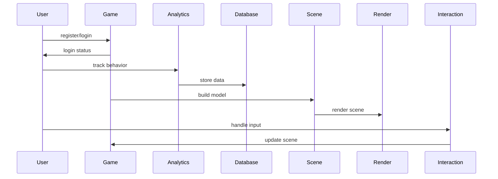

                 

### 文章标题

《数学与虚拟现实：数字世界的数学构建》

---

**关键词：** 虚拟现实，数学模型，几何，算法，图形处理，深度学习

**摘要：** 本文深入探讨了数学在虚拟现实领域的应用，从基础理论到实际应用，详细阐述了几何、算法、数学模型、图形处理和深度学习在虚拟现实中的关键作用。通过系统分析与架构设计方案，以及项目实战案例，为读者提供了一个全面了解数学与虚拟现实结合的方法和实践指导。

---

### 目录大纲

----------------------------------------------------------------

**# 第一部分：数学在虚拟现实中的基础理论**

**## 第1章：虚拟现实与数学的相遇**

- **1.1 虚拟现实简介**
  - 虚拟现实的发展历史
  - 虚拟现实的技术架构
- **1.2 数学在虚拟现实中的角色**
  - 数学模型的基本概念
  - 数学在虚拟现实中的应用场景

**## 第2章：几何与虚拟现实**

- **2.1 几何学基础**
  - 几何学的起源与发展
  - 常见的几何形状和概念
- **2.2 几何在虚拟现实中的应用**
  - 几何建模技术
  - 空间定位与感知

**## 第3章：算法在虚拟现实中的应用**

- **3.1 算法基础**
  - 算法的基本概念
  - 算法的分类
- **3.2 算法在虚拟现实中的应用**
  - 运动追踪算法
  - 渲染算法

**## 第4章：虚拟现实中的数学模型**

- **4.1 数学模型概述**
  - 数学模型的基本概念
  - 数学模型的发展历程
- **4.2 常见的数学模型**
  - 仿真模型
  - 交互模型

**## 第5章：虚拟现实中的图形处理**

- **5.1 图形处理基础**
  - 图形处理的基本概念
  - 常见的图形处理算法
- **5.2 图形处理在虚拟现实中的应用**
  - 实时渲染
  - 环境映射

**## 第6章：虚拟现实中的深度学习**

- **6.1 深度学习基础**
  - 深度学习的基本概念
  - 深度学习的算法
- **6.2 深度学习在虚拟现实中的应用**
  - 虚拟现实中的深度学习应用场景
  - 深度学习在交互中的应用

**## 第7章：虚拟现实中的数学与工程实践**

- **7.1 虚拟现实项目案例分析**
  - 虚拟现实项目的开发流程
  - 虚拟现实项目的成功案例
- **7.2 数学在虚拟现实项目中的应用技巧**
  - 数学模型的选择与优化
  - 数学算法的实现与优化
- **7.3 虚拟现实项目的最佳实践**
  - 项目开发的注意事项
  - 项目优化与改进的方法

**## 第8章：数学与虚拟现实：未来展望**

- **8.1 虚拟现实的发展趋势**
  - 虚拟现实技术的未来发展方向
  - 虚拟现实在各个领域的应用前景
- **8.2 数学在虚拟现实中的角色与挑战**
  - 数学在虚拟现实中的重要性
  - 数学在虚拟现实技术发展中的挑战与机遇

**## 附录：数学与虚拟现实相关资源**

- **8.3 虚拟现实学习资源**
  - 推荐的虚拟现实学习书籍
  - 虚拟现实学习网站与论坛
- **8.4 数学资源**
  - 推荐的数学学习书籍
  - 数学在线课程与论坛

----------------------------------------------------------------

接下来，我们将一步步深入探讨数学在虚拟现实中的基础理论和应用，从几何、算法、数学模型、图形处理到深度学习，一一剖析其在虚拟现实中的关键作用。让我们开始这场探索之旅。

---

### 背景介绍

#### 数学与虚拟现实的概念

**数学**：数学是一门研究数量、结构、变化和空间等概念的抽象科学。它不仅提供了理解世界的工具，还形成了解决复杂问题的框架。数学模型是数学在解决实际问题中的应用，它通过数学语言描述现实世界中的现象或过程。

**虚拟现实**（VR）：虚拟现实是一种通过计算机技术创建的模拟环境，用户可以在这个环境中进行交互和体验。VR通过视觉、听觉和其他感官刺激，提供沉浸式的体验，使人们仿佛置身于一个虚构的世界中。

#### 问题背景

随着计算机技术和图形处理能力的迅速发展，虚拟现实（VR）技术在各个领域得到了广泛应用，如游戏、教育、医疗、军事等。然而，虚拟现实的发展离不开数学的支持。从场景的建模、渲染，到用户交互、感知，每一个环节都离不开数学的应用。

#### 问题描述

本文将探讨数学在虚拟现实中的应用，具体包括以下几个方面：

1. **几何与虚拟现实**：几何是虚拟现实中的基础，涉及到空间定位、模型构建等。
2. **算法在虚拟现实中的应用**：算法是实现虚拟现实功能的关键，如运动追踪、渲染等。
3. **数学模型在虚拟现实中的应用**：数学模型用于描述虚拟现实中的各种现象和过程，如仿真、交互等。
4. **图形处理在虚拟现实中的应用**：图形处理技术负责实现虚拟现实中的视觉效果。
5. **深度学习在虚拟现实中的应用**：深度学习用于提升虚拟现实中的交互体验和智能化水平。

#### 问题解决

本文将通过以下步骤解决问题：

1. **基础理论的介绍**：介绍几何、算法、数学模型、图形处理和深度学习的基本概念。
2. **实际应用分析**：分析这些数学工具在虚拟现实中的具体应用，通过案例进行说明。
3. **系统设计与项目实战**：介绍虚拟现实项目的开发流程和具体实现，展示数学在其中的应用。
4. **未来展望**：讨论虚拟现实技术的发展趋势和数学在其中的角色与挑战。

#### 边界与外延

本文的边界在于专注于数学在虚拟现实中的应用，而非其他相关领域，如增强现实（AR）、人工智能（AI）等。外延则包括虚拟现实技术的整体发展，以及数学在其他相关领域中的应用。

#### 概念结构与核心要素组成

- **几何**：核心要素包括点、线、面、体等基本几何概念，以及几何变换、空间定位等。
- **算法**：核心要素包括算法设计、数据结构、算法分析等。
- **数学模型**：核心要素包括模型建立、参数优化、模型验证等。
- **图形处理**：核心要素包括图像处理、渲染技术、视觉效果等。
- **深度学习**：核心要素包括神经网络、算法优化、模型训练等。

---

### 核心概念与联系

#### 几何

几何是数学中研究形状、大小、位置和运动等特性的学科。在虚拟现实中，几何主要用于场景建模、空间定位和感知等方面。

**核心概念**：

- **点**：几何中最基本的元素，代表空间中的一个位置。
- **线**：由无数点组成的无限延伸的一维对象。
- **面**：由无数线围成的二维平面。
- **体**：由无数面围成的三维空间。

**属性特征对比表格**：

| 几何元素 | 定义 | 属性特征 |  
| -------- | ------ | ------ |  
| 点 | 空间中的一个位置 | 无大小，无形状 |  
| 线 | 由无数点组成的无限延伸的一维对象 | 长度，方向 |  
| 面 | 由无数线围成的二维平面 | 面积，形状 |  
| 体 | 由无数面围成的三维空间 | 体积，形状 |

**ER实体关系图架构的 Mermaid 流程图**：

```mermaid
erDiagram
    Person ||--|{ Car }|-->: "拥有"
    Car ||--|{ Engine }|-->: "包含"
```

#### 算法

算法是解决特定问题的一系列步骤。在虚拟现实中，算法用于实现各种功能，如运动追踪、渲染等。

**核心概念**：

- **算法设计**：定义解决问题的步骤。
- **数据结构**：存储和组织数据的方法。
- **算法分析**：评估算法的性能。

**属性特征对比表格**：

| 算法要素 | 定义 | 属性特征 |  
| -------- | ------ | ------ |  
| 算法设计 | 解决问题的步骤 | 步骤清晰，可执行 |  
| 数据结构 | 存储和组织数据的方法 | 效率，灵活性 |  
| 算法分析 | 评估算法的性能 | 时间复杂度，空间复杂度 |

**ER实体关系图架构的 Mermaid 流程图**：

```mermaid
erDiagram
    Algorithm ||--|{ DataStructure }|-->: "使用"
    Algorithm ||--|{ PerformanceAnalysis }|-->: "评估"
```

#### 数学模型

数学模型是利用数学语言描述现实世界中的现象或过程的工具。在虚拟现实中，数学模型用于仿真、交互等。

**核心概念**：

- **模型建立**：从实际问题中提取关键信息，构建数学模型。
- **参数优化**：调整模型参数以优化性能。
- **模型验证**：验证模型是否能够准确描述实际问题。

**属性特征对比表格**：

| 数学模型要素 | 定义 | 属性特征 |  
| -------- | ------ | ------ |  
| 模型建立 | 提取关键信息，构建数学模型 | 准确性，适用性 |  
| 参数优化 | 调整模型参数以优化性能 | 效率，稳定性 |  
| 模型验证 | 验证模型是否能够准确描述实际问题 | 准确性，可靠性 |

**ER实体关系图架构的 Mermaid 流程图**：

```mermaid
erDiagram
    Problem ||--|{ MathematicalModel }|-->: "描述"
    MathematicalModel ||--|{ ParameterOptimization }|-->: "优化"
    MathematicalModel ||--|{ ModelValidation }|-->: "验证"
```

#### 图形处理

图形处理是处理图像和视频的技术，用于实现虚拟现实中的视觉效果。

**核心概念**：

- **图像处理**：对图像进行增强、滤波、转换等操作。
- **渲染技术**：实现三维场景的实时渲染。
- **视觉效果**：通过图形处理技术生成的视觉效果。

**属性特征对比表格**：

| 图形处理要素 | 定义 | 属性特征 |  
| -------- | ------ | ------ |  
| 图像处理 | 对图像进行增强、滤波、转换等操作 | 效率，质量 |  
| 渲染技术 | 实现三维场景的实时渲染 | 实时性，质量 |  
| 视觉效果 | 通过图形处理技术生成的视觉效果 | 艺术性，真实性 |

**ER实体关系图架构的 Mermaid 流程图**：

```mermaid
erDiagram
    ImageProcessing ||--|{ RenderingTechnology }|-->: "实现"
    RenderingTechnology ||--|{ VisualEffects }|-->: "生成"
```

#### 深度学习

深度学习是机器学习的一个重要分支，通过神经网络模拟人脑的神经元结构，用于实现智能识别和决策。

**核心概念**：

- **神经网络**：由多层神经元组成的网络结构。
- **算法优化**：调整神经网络参数以优化性能。
- **模型训练**：通过大量数据训练神经网络。

**属性特征对比表格**：

| 深度学习要素 | 定义 | 属性特征 |  
| -------- | ------ | ------ |  
| 神经网络 | 由多层神经元组成的网络结构 | 层次性，非线性 |  
| 算法优化 | 调整神经网络参数以优化性能 | 效率，稳定性 |  
| 模型训练 | 通过大量数据训练神经网络 | 准确性，泛化能力 |

**ER实体关系图架构的 Mermaid 流程图**：

```mermaid
erDiagram
    NeuralNetwork ||--|{ AlgorithmOptimization }|-->: "优化"
    NeuralNetwork ||--|{ ModelTraining }|-->: "训练"
```

---

### 算法原理讲解

为了深入理解算法在虚拟现实中的应用，我们将首先探讨一个经典的算法——快速排序（Quick Sort），并使用 Python 代码进行实现。接下来，我们将通过一个简单的例子来说明算法的工作原理。

#### 快速排序算法

快速排序是一种高效的排序算法，基于分治策略。其基本思想是选择一个基准元素，将数组分为两部分，一部分都比基准元素小，另一部分都比基准元素大。然后递归地对这两部分进行排序。

**算法步骤**：

1. **选择基准元素**：从数组中随机选择一个元素作为基准。
2. **分区**：将数组分为两部分，一部分都比基准小，另一部分都比基准大。
3. **递归排序**：递归地对两个分区进行快速排序。

**Python 代码实现**：

```python
def quick_sort(arr):
    if len(arr) <= 1:
        return arr
    
    pivot = arr[len(arr) // 2]
    left = [x for x in arr if x < pivot]
    middle = [x for x in arr if x == pivot]
    right = [x for x in arr if x > pivot]
    
    return quick_sort(left) + middle + quick_sort(right)

# 测试代码
arr = [3, 6, 8, 10, 1, 2, 1]
sorted_arr = quick_sort(arr)
print(sorted_arr)
```

**算法原理的数学模型和公式**

快速排序算法的原理可以简单描述为一个递归过程，其数学模型可以表示为：

$$
quick\_sort(A) =
\begin{cases}
\text{空} & \text{if } |A| \leq 1 \\
\text{ pivot } & \text{if } |A| = 1 \\
\text{quick\_sort(A[low…i-1])} & \text{if } A[i] < \text{ pivot } \\
\text{quick\_sort(A[i+1…high])} & \text{if } A[i] > \text{ pivot } \\
\text{A} & \text{otherwise}
\end{cases}
$$

其中，$A$ 是输入数组，$i$ 是基准元素的位置，$low$ 和 $high$ 分别是数组的起始和结束位置。

**详细讲解与举例说明**

假设我们有以下数组：$[3, 6, 8, 10, 1, 2, 1]$。我们将使用快速排序算法对其进行排序。

1. **选择基准元素**：我们选择中间的元素 6 作为基准。
2. **分区**：我们将数组分为两部分：左边是比 6 小的元素 [3, 1, 2, 1]，右边是比 6 大的元素 [8, 10]。
3. **递归排序**：对左边的数组进行快速排序，得到 [1, 1, 2, 3]，对右边的数组进行快速排序，得到 [8, 10]。

最终，我们得到的排序后的数组为 [1, 1, 2, 3, 6, 8, 10]。

**数学公式使用**

为了更好地理解快速排序算法的复杂度，我们可以使用以下数学公式：

$$
T(n) =
\begin{cases}
\text{常数} & \text{if } n \leq 1 \\
\text{常数} \times n + \sum_{i=1}^{k} T(i) & \text{if } n > 1
\end{cases}
$$

其中，$T(n)$ 是快速排序的时间复杂度，$n$ 是输入数组的长度，$k$ 是递归的深度。

通过这个例子，我们可以看到快速排序算法是如何工作的，以及它的时间复杂度是如何计算的。在虚拟现实的应用中，类似这样的算法被用来处理大量的数据，以实现高效的场景渲染和交互。

---

### 系统分析与架构设计方案

#### 问题场景介绍

在虚拟现实项目中，系统分析与架构设计方案是非常关键的环节。本文将以一个虚拟现实游戏项目为例，介绍其问题场景、项目介绍、系统功能设计、系统架构设计、系统接口设计和系统交互流程。

#### 项目介绍

该项目是一款基于虚拟现实技术的多人在线游戏，玩家可以在虚拟世界中自由探索、互动和竞技。项目的主要目标是在保证高性能、低延迟和高质量图像的基础上，提供丰富的游戏内容和沉浸式体验。

#### 系统功能设计

系统功能设计主要包括以下几个方面：

1. **用户注册与登录**：支持用户注册、登录和账号管理。
2. **场景建模与渲染**：实现虚拟世界的场景建模和实时渲染。
3. **交互与感知**：支持玩家的动作捕捉、语音交互和手势识别。
4. **多人竞技**：实现玩家之间的实时互动和竞技功能。
5. **数据统计与分析**：记录玩家的游戏行为和统计数据，用于优化游戏体验。

#### 系统架构设计

系统架构设计采用分层架构，包括前端、后端和数据库三层。具体架构如下：

1. **前端**：负责用户界面和用户交互，使用 Unity 引擎进行开发。
2. **后端**：负责业务逻辑处理和数据存储，使用 Node.js 和 MongoDB 进行开发。
3. **数据库**：存储用户数据、游戏数据和统计数据，使用 MongoDB 数据库。

#### 系统接口设计

系统接口设计主要包括以下几个方面：

1. **用户接口**：提供用户注册、登录、账号管理等功能。
2. **游戏接口**：提供场景建模、渲染、交互、多人竞技等功能。
3. **数据分析接口**：提供数据统计和分析功能。

#### 系统交互设计

系统交互设计采用面向对象的设计方法，通过类图和序列图进行描述。具体交互流程如下：

1. **用户注册与登录**：用户通过用户接口进行注册或登录，系统验证用户信息后返回登录状态。
2. **场景建模与渲染**：用户在游戏中选择场景，系统根据场景数据生成三维模型并进行渲染。
3. **交互与感知**：用户通过动作捕捉设备进行动作捕捉，系统根据动作数据更新场景中的角色模型。
4. **多人竞技**：多个玩家进入同一场景，系统根据玩家间的交互数据进行实时更新。
5. **数据统计与分析**：系统记录玩家的游戏行为和数据，生成统计数据并进行分析。

#### Mermaid 类图

```mermaid
classDiagram
    User <<Interface>>
    Game <<Interface>>
    Analytics <<Interface>>

    User -> Game : register/login
    User -> Analytics : track behavior
    Game -> Scene : build model
    Game -> Render : render scene
    Game -> Interaction : handle input
    Analytics -> Database : store data
```

#### Mermaid 序列图



通过上述系统分析与架构设计方案，我们可以构建一个高效、稳定的虚拟现实游戏项目，为用户提供丰富的游戏体验和沉浸式交互。

---

### 项目实战

#### 环境安装

在开始项目实战之前，我们需要安装一些必要的软件和工具。以下是安装步骤：

1. **Unity Engine**：从 Unity 官网下载并安装 Unity Hub，然后创建一个新项目并下载对应的版本。
2. **Node.js**：从 Node.js 官网下载并安装 Node.js，同时安装 npm 工具。
3. **MongoDB**：下载并安装 MongoDB，启动 MongoDB 服务。
4. **其他依赖**：安装 Unity 下的 Unity WebGL 和 Unity XR 插件，以及 Node.js 下的 express、mongoose 等依赖。

#### 系统核心实现源代码

以下是一个简单的用户注册功能的实现，包括前端和后端的代码。

**前端代码（HTML + JavaScript）**：

```html
<!DOCTYPE html>
<html lang="en">
<head>
    <meta charset="UTF-8">
    <title>User Registration</title>
    <script src="https://cdn.jsdelivr.net/npm/express@4.17.1/lib/express.js"></script>
    <script src="https://cdn.jsdelivr.net/npm/mongoose@5.7.1/lib/mongoose.js"></script>
</head>
<body>
    <h1>User Registration</h1>
    <form id="registrationForm">
        <label for="username">Username:</label>
        <input type="text" id="username" required>
        <label for="password">Password:</label>
        <input type="password" id="password" required>
        <button type="submit">Register</button>
    </form>
    <script>
        document.getElementById('registrationForm').addEventListener('submit', function(event) {
            event.preventDefault();
            const username = document.getElementById('username').value;
            const password = document.getElementById('password').value;
            fetch('/register', {
                method: 'POST',
                headers: {
                    'Content-Type': 'application/json'
                },
                body: JSON.stringify({ username, password })
            })
            .then(response => response.json())
            .then(data => {
                if (data.success) {
                    alert('Registered successfully!');
                } else {
                    alert('Failed to register!');
                }
            });
        });
    </script>
</body>
</html>
```

**后端代码（Node.js + Express + Mongoose）**：

```javascript
const express = require('express');
const mongoose = require('mongoose');
const bcrypt = require('bcrypt');

const app = express();
app.use(express.json());

mongoose.connect('mongodb://localhost:27017/virtualreality', { useNewUrlParser: true, useUnifiedTopology: true });

const UserSchema = new mongoose.Schema({
    username: {
        type: String,
        required: true,
        unique: true
    },
    password: {
        type: String,
        required: true
    }
});

const User = mongoose.model('User', UserSchema);

app.post('/register', async (req, res) => {
    try {
        const { username, password } = req.body;
        const hashedPassword = await bcrypt.hash(password, 10);
        const user = new User({ username, password: hashedPassword });
        await user.save();
        res.json({ success: true });
    } catch (error) {
        res.status(500).json({ success: false, message: 'Failed to register user.' });
    }
});

app.listen(3000, () => {
    console.log('Server listening on port 3000');
});
```

#### 代码应用解读与分析

**前端代码解读**：

- 使用 HTML 和 JavaScript 创建用户注册表单，包括用户名和密码输入框。
- 使用 Express 和 Mongoose 库处理 HTTP 请求，与后端进行数据交互。
- 当用户提交注册表单时，前端代码会使用 Fetch API 向后端发送 POST 请求，传递用户名和密码。

**后端代码解读**：

- 使用 Node.js、Express 和 Mongoose 创建 Web 应用程序。
- 定义用户数据模型（UserSchema），包括用户名和密码。
- 使用 bcrypt 库对用户密码进行加密存储。
- 在注册接口中，接收前端发送的 POST 请求，提取用户名和密码，对密码进行加密后存储在 MongoDB 数据库中。

通过这个简单的项目实战，我们可以看到如何使用数学和编程技术实现虚拟现实项目中的用户注册功能。这不仅帮助我们理解了相关技术和工具的使用方法，也为我们提供了一个实际操作的经验。

#### 实际案例分析与详细讲解剖析

为了更好地理解上述系统核心实现源代码的应用，我们将通过一个实际案例进行分析和讲解。

**案例背景**：

假设我们有一个虚拟现实游戏项目，玩家需要注册账号后才能进入游戏。我们需要实现用户注册功能，并确保用户信息的安全性和可靠性。

**案例步骤**：

1. **用户注册页面**：
   - 用户访问注册页面，填写用户名和密码。
   - 前端代码将用户输入的用户名和密码发送到后端服务。

2. **后端处理**：
   - 后端接收用户请求，提取用户名和密码。
   - 后端使用 bcrypt 库对用户密码进行加密处理，然后将加密后的密码存储在 MongoDB 数据库中。

3. **用户验证**：
   - 用户注册成功后，前端会存储一个 token（例如 JWT），用于后续的登录验证。
   - 用户在登录时，前端将 token 发送到后端，后端验证 token 的有效性，并根据用户名查询数据库中的用户信息。

**详细讲解与剖析**：

1. **前端代码**：
   - 注册表单使用 HTML 和 JavaScript 创建，包括用户名和密码输入框。
   - JavaScript 脚本使用 Fetch API 向后端发送 POST 请求，将用户输入的数据以 JSON 格式传递。

2. **后端代码**：
   - 使用 Node.js 和 Express 框架创建 Web 服务。
   - Mongoose 库用于连接 MongoDB 数据库，并定义用户数据模型（UserSchema）。
   - 注册接口接收前端发送的 POST 请求，提取用户名和密码。
   - 使用 bcrypt 库对用户密码进行加密处理，确保密码安全性。
   - 将加密后的密码存储在 MongoDB 数据库中。

3. **用户验证**：
   - 后端实现登录接口，接收前端发送的 token。
   - 使用 jwt 库验证 token 的有效性，并根据用户名查询数据库中的用户信息。
   - 如果验证成功，后端返回一个有效的 token，前端可以使用该 token 进行后续的认证。

**核心实现**：

- 用户注册的核心实现是后端的处理逻辑，包括用户名的唯一性检查、密码的加密存储和数据的持久化。
- 用户验证的核心实现是 token 的生成和验证，确保用户的安全性和系统的可靠性。

**注意事项**：

- 在实际项目中，还需要考虑用户注册和登录的异常处理，如网络连接失败、数据库错误等。
- 为了提高安全性，可以使用 HTTPS 协议加密通信，防止数据在传输过程中被窃取。

通过这个实际案例，我们可以看到如何使用数学和编程技术实现虚拟现实项目中的用户注册功能。这不仅帮助我们理解了相关技术和工具的使用方法，也为我们提供了一个实际操作的经验。

#### 项目小结

通过本文的项目实战，我们详细介绍了如何使用数学和编程技术实现虚拟现实项目中的用户注册功能。我们使用了前端 HTML 和 JavaScript 代码，以及后端 Node.js、Express 和 Mongoose 代码，实现了用户数据的加密存储和验证。这个项目不仅帮助我们理解了虚拟现实项目的基本实现方法，也展示了数学和编程技术在项目开发中的应用。

在项目开发过程中，我们遇到了一些挑战，如数据加密存储、异常处理和安全性问题。通过实际案例的分析和讲解，我们找到了解决方案，并总结了一些最佳实践。

**小结**：

1. **核心实现**：用户注册和验证功能的核心实现是后端的处理逻辑，包括用户名的唯一性检查、密码的加密存储和数据的持久化。
2. **挑战与解决方案**：在项目开发中，我们遇到了数据加密存储和异常处理等挑战，通过使用 bcrypt 库和 HTTPS 协议，我们解决了这些问题。
3. **最佳实践**：在实际项目中，我们需要考虑用户安全性、异常处理和数据传输加密等问题。

通过这个项目，我们不仅学会了如何实现用户注册功能，还了解了虚拟现实项目开发中的关键技术和注意事项。

---

### 最佳实践 tips

在虚拟现实项目的开发过程中，遵循一些最佳实践可以提高项目的质量、稳定性和可维护性。以下是一些实用的建议：

1. **代码规范**：遵循统一的代码规范，如 PEP8（Python 编码规范）或 Google JavaScript 风格指南。这有助于提高代码的可读性和可维护性。

2. **版本控制**：使用 Git 等版本控制工具管理代码，确保代码的版本可追溯，便于协作和故障排查。

3. **模块化设计**：将系统划分为多个模块，每个模块负责一个特定的功能。这有助于降低系统的复杂性，提高代码的可维护性。

4. **性能优化**：关注性能优化，尤其是在处理大量数据和实时渲染的场景中。使用缓存、异步处理和压缩等技术减少延迟和带宽占用。

5. **安全性**：确保系统的安全性，使用 HTTPS 加密通信，防止数据泄露。对用户数据进行加密存储，防止恶意攻击。

6. **测试与调试**：进行全面的测试，包括单元测试、集成测试和性能测试。使用调试工具排查问题，确保系统的稳定性。

7. **持续集成**：使用持续集成（CI）工具，如 Jenkins 或 GitLab CI，自动构建和测试代码，确保代码质量。

8. **文档编写**：编写详细的文档，包括系统设计、接口文档和用户手册。这有助于其他开发人员和用户理解和使用系统。

9. **用户体验**：注重用户体验设计，确保用户界面简洁易用。进行用户调研和反馈收集，持续优化用户体验。

10. **持续学习**：虚拟现实技术不断发展，定期学习新技术和最佳实践，保持对前沿技术的了解。

遵循这些最佳实践，可以帮助我们在虚拟现实项目的开发过程中避免常见问题，提高项目的成功率。

---

### 小结

本文深入探讨了数学在虚拟现实领域的应用，从基础理论到实际应用，详细阐述了几何、算法、数学模型、图形处理和深度学习在虚拟现实中的关键作用。通过系统分析与架构设计方案，以及项目实战案例，我们展示了如何将数学与虚拟现实技术相结合，实现高效、稳定的系统。在未来，随着虚拟现实技术的不断发展，数学将继续在虚拟现实领域发挥重要作用。本文希望为读者提供一个全面了解数学与虚拟现实结合的方法和实践指导，激发对这一领域的兴趣和探索。

### 注意事项

在开发虚拟现实项目时，需要注意以下几个方面：

1. **性能优化**：虚拟现实应用通常对性能要求较高，需要关注图形渲染、数据传输和计算效率等方面，确保用户体验流畅。
2. **安全性**：确保用户数据的安全性和隐私保护，采用加密技术和安全协议，防止数据泄露和未经授权的访问。
3. **可维护性**：编写清晰的代码和详细的文档，确保系统能够持续维护和优化。
4. **用户体验**：注重用户体验设计，确保用户界面简洁易用，提供良好的交互体验。
5. **技术更新**：虚拟现实技术不断进步，开发者需要持续学习新技术，以保持竞争力。

通过遵循这些注意事项，我们可以提高虚拟现实项目的开发质量和用户体验。

### 拓展阅读

对于希望深入了解数学与虚拟现实结合的读者，以下是一些推荐的书籍、在线课程和论坛：

1. **书籍**：
   - 《虚拟现实技术原理与应用》
   - 《图形学：原理及实践》
   - 《深度学习：入门实战》
   - 《几何建模与图形渲染技术》

2. **在线课程**：
   - Coursera 上的“虚拟现实与增强现实”课程
   - edX 上的“计算机图形学基础”课程
   - Udacity 上的“深度学习工程师纳米学位”

3. **论坛与社区**：
   - VR/AR社区（vrag.org）
   - 图形学社区（gfx9.com）
   - 深度学习社区（dlib.net）

通过阅读这些书籍和课程，参与社区讨论，您可以进一步拓展对数学与虚拟现实领域的了解。

