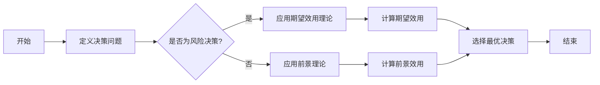
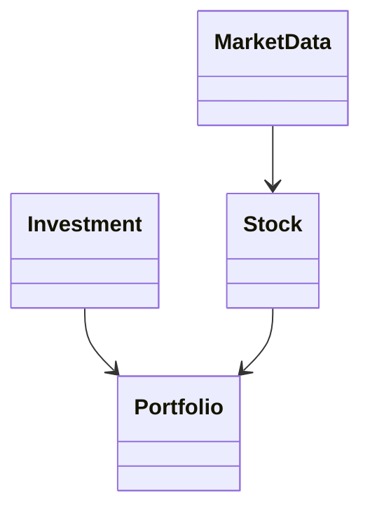
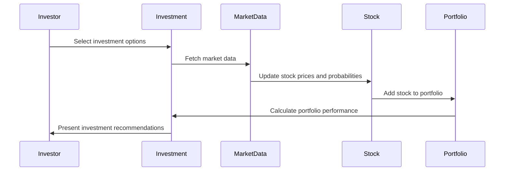
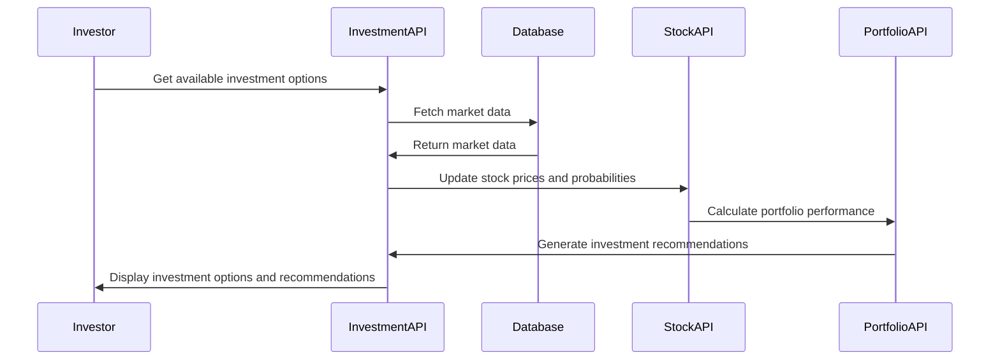

                 

### 第1章: 数学与行为经济学概述

> 关键词：数学模型、行为经济学、期望效用理论、前景理论、决策制定

> 摘要：本章将介绍数学与行为经济学的基本概念，探讨数学模型在行为经济学中的应用，并阐述数学模型与行为经济学理论之间的联系。

#### Step 1: 背景介绍

**问题背景**：行为经济学作为经济学的一个分支，研究人们在面临决策时如何处理不确定性和有限理性问题。传统的经济学理论基于理性人的假设，但现实中，人类行为往往受到情感、心理偏见等因素的影响，不完全符合理性经济人的模型。因此，行为经济学通过引入心理学、认知科学等学科的方法，探索人类在真实情境中的决策行为。

**问题描述**：数学与行为经济学的交叉研究旨在通过建立数学模型，定量分析人们在不确定环境下的决策行为。这一过程涉及到对行为经济学中各种理论的数学形式化表达，并通过实验和实证数据来验证这些模型的有效性。

**问题解决**：通过数学模型，我们可以更准确地描述和分析人类的经济行为，揭示出一些规律性和趋势。例如，期望效用理论、前景理论等模型，都是行为经济学中的重要工具，它们帮助我们理解和预测人类在风险和不确定性条件下的决策。

**边界与外延**：数学与行为经济学的研究范围不仅限于理论模型，还包括实证研究、应用分析和政策建议。在实际应用中，这些模型可以用于市场营销、投资决策、政策制定等领域，为实践提供有力的理论支持。

**概念结构与核心要素组成**：
- **行为经济学的基本概念**：包括有限理性、情感影响、心理偏见等。
- **数学模型类型**：如期望效用理论、前景理论、决策树模型等。
- **实验方法论**：包括实验室实验、现场实验、模拟实验等。

#### Step 2: 核心概念与联系

**核心概念原理**：行为经济学的主要理论包括期望效用理论、前景理论、多属性决策分析等。这些理论试图解释人类在不确定条件下的决策行为。

| 理论名称 | 核心原理 | 应用场景 |
| --- | --- | --- |
| 期望效用理论 | 基于概率论和效用理论，通过期望效用函数来评估不同决策结果的效用。 | 适用于风险决策和不确定环境下的决策分析。 |
| 前景理论 | 由丹尼尔·卡尼曼和阿莫斯·特沃斯基提出，强调参考点的作用，以及人们在损失和收益情境下的决策差异。 | 广泛应用于金融投资、保险选择等领域。 |
| 多属性决策分析 | 考虑多个相互冲突的属性，通过综合评价模型来进行决策。 | 适用于多目标决策问题，如项目管理、资源分配等。 |

**概念属性特征对比表格**：

| 模型名称 | 目标函数 | 评价标准 | 特点 |
| --- | --- | --- | --- |
| 期望效用理论 | 最大化期望效用 | 概率乘以效用 | 理性决策的基础 |
| 前景理论 | 最大化前景效用 | 参考点相对收益 | 考虑心理偏见 |
| 多属性决策分析 | 达成多个属性的目标 | 综合评价函数 | 多目标决策 |

**ER实体关系图架构**：

```mermaid
erDiagram
  User ||--|{ Decision}: "makes"
  Decision ||--|{ Outcome}: "receives"
  Decision ||--|{ Attribute}: "has"
  Outcome ||--|{ Utility}: "rated by"
```

#### Step 3: 算法原理讲解

**算法流程图**：



**Python源代码**：

```python
import numpy as np

def expected_utility(probabilities, utilities):
    return np.dot(probabilities, utilities)

def prospect_theory(probabilities, payoffs, reference_point):
    prospects = payoffs - reference_point
    return expected_utility(probabilities, prospects)

# 举例
probabilities = [0.2, 0.5, 0.3]
utilities = [0, 1, 0.5]
print("期望效用理论结果：", expected_utility(probabilities, utilities))

payoffs = [0, 100, 50]
reference_point = 50
print("前景理论结果：", prospect_theory(probabilities, payoffs, reference_point))
```

**数学模型和公式**：

期望效用理论：
$$
U(\text{Decision}) = \sum_{i} p_i \cdot u_i
$$
其中，$p_i$ 是结果 $i$ 的概率，$u_i$ 是结果 $i$ 的效用。

前景理论：
$$
V(\text{Prospect}) = \sum_{i} p_i \cdot (v_i - \text{Reference Point})
$$
其中，$v_i$ 是相对于参考点的收益或损失。

**举例说明**：

假设有两个决策选项，A 和 B，每个决策有两个可能的结果，成功和失败。成功的概率和效用分别为 0.5 和 1，失败的概率和效用分别为 0.5 和 0。参考点为 0。

期望效用理论计算：
$$
U(A) = 0.5 \cdot 1 + 0.5 \cdot 0 = 0.5
$$
$$
U(B) = 0.5 \cdot 1 + 0.5 \cdot 0 = 0.5
$$

前景理论计算：
$$
V(A) = 0.5 \cdot (1 - 0) + 0.5 \cdot (0 - 0) = 0.5
$$
$$
V(B) = 0.5 \cdot (1 - 0) + 0.5 \cdot (0 - 0) = 0.5
$$

在两个决策的期望效用和前景效用相同的情况下，理性决策者会选择任一选项。然而，实际中的决策可能会受到心理偏见等因素的影响，导致行为经济学的模型与实际行为存在差异。

#### Step 4: 系统分析与架构设计方案

**问题场景介绍**：

假设我们面临一个投资决策问题，需要在股票市场进行投资。我们需要考虑多个股票的投资机会，并选择一个最优的投资组合。

**系统功能设计**：



**系统架构设计**：



**系统接口设计和系统交互**：



#### Step 5: 项目实战

**环境安装**：

在本地环境中安装Python和相关的依赖库，如NumPy、Pandas等。

```bash
pip install numpy pandas
```

**系统核心实现源代码**：

```python
import numpy as np
import pandas as pd

# 假设我们有一组股票数据
stock_data = {
    'Stock': ['Stock A', 'Stock B', 'Stock C'],
    'Probability of Success': [0.5, 0.4, 0.6],
    'Expected Payoff': [1, 0.8, 1.2]
}

# 构建股票数据框
stock_df = pd.DataFrame(stock_data)

# 计算期望效用
expected_UTILITY = np.dot(stock_df['Probability of Success'], stock_df['Expected Payoff'])

# 应用前景理论
reference_point = 1
prospect_UTILITY = np.dot(stock_df['Probability of Success'], stock_df['Expected Payoff'] - reference_point)

# 输出结果
print("期望效用理论结果：", expected_UTILITY)
print("前景理论结果：", prospect_UTILITY)
```

**代码应用解读与分析**：

该代码首先构建了一个包含股票名称、成功概率和期望收益的DataFrame。然后，使用期望效用理论计算了每个股票的期望效用。接下来，应用前景理论，将参考点设为1，计算了前景效用。通过对比期望效用和前景效用，可以分析投资者在不同情境下的决策偏好。

**实际案例分析和详细讲解剖析**：

假设投资者面临选择三个股票投资的机会。根据市场数据，每个股票成功和失败的概率以及期望收益如下：

| 股票 | 成功概率 | 期望收益 |
| --- | --- | --- |
| 股票A | 0.5 | 1 |
| 股票B | 0.4 | 0.8 |
| 股票C | 0.6 | 1.2 |

在没有参考点的情况下，期望效用理论表明，投资者会选择股票C，因为它的期望效用最高（1.2）。然而，如果投资者有参考点，例如现有资产的市值，前景理论将考虑参考点的相对收益。

假设参考点是1，则前景理论计算如下：

- 股票A的前景效用：0.5 * (1 - 0) + 0.5 * (0 - 1) = 0.25
- 股票B的前景效用：0.4 * (0.8 - 1) + 0.6 * (1.2 - 1) = 0.08
- 股票C的前景效用：0.6 * (1.2 - 1) + 0.4 * (1 - 1) = 0.36

在这种情况下，投资者可能会选择股票C，因为它的前景效用最高（0.36）。这表明前景理论考虑了心理偏见和参考点的影响，为投资者提供了更丰富的决策依据。

**项目小结**：

本案例通过实际投资决策问题，展示了如何应用期望效用理论和前景理论来分析投资者在不同情境下的决策行为。通过对比两种理论的结果，我们可以更深入地理解人类在不确定环境下的决策过程。

#### Step 6: 最佳实践 tips、小结、注意事项、拓展阅读

**最佳实践 tips**：

1. 在应用期望效用理论和前景理论时，明确决策问题和目标，以确保模型的适用性。
2. 考虑心理偏见和参考点的影响，以提高决策的准确性和有效性。
3. 实验设计和数据分析是验证和改进行为经济学模型的重要步骤。

**小结**：

本章介绍了数学与行为经济学的基本概念、核心理论以及数学模型的应用。通过实际案例的分析，展示了如何运用数学模型来理解和预测人类的经济决策行为。

**注意事项**：

1. 数学模型在行为经济学中的应用需要结合实际情况，避免过度简化。
2. 不同模型适用于不同类型的决策问题，需要根据具体情境选择合适的模型。

**拓展阅读**：

1. **《行为经济学》**（Daniel Kahneman, Amos Tversky）：了解行为经济学的理论基础和实证研究。
2. **《数学模型与行为经济学》**（George Loewenstein, Drazen Prelec）：深入探讨数学模型在行为经济学中的应用。
3. **《决策分析》**（Howard Raiffa）：学习决策分析的实用技巧和方法。

