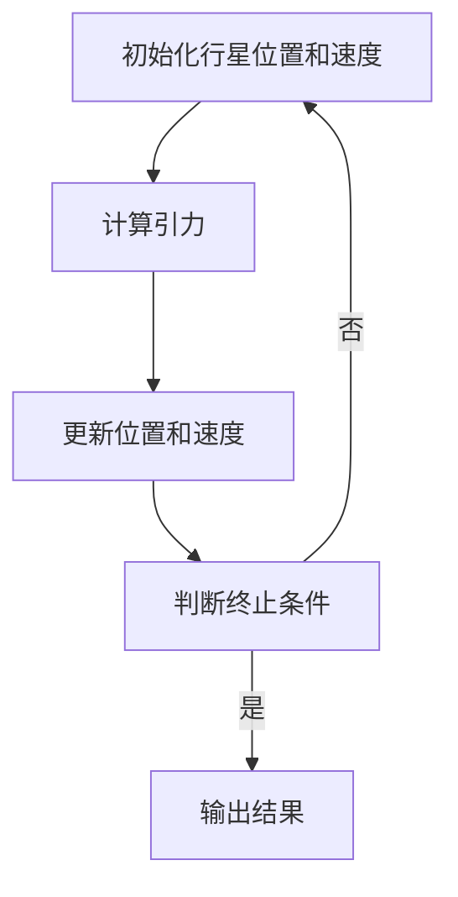
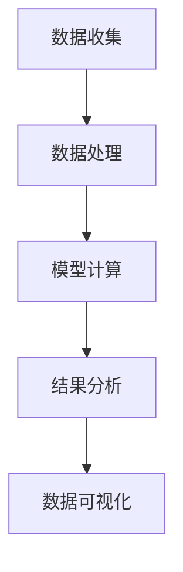
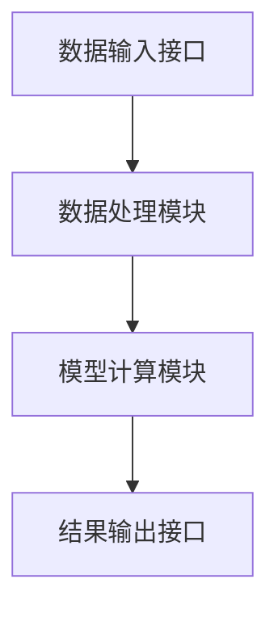
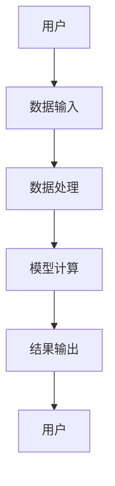
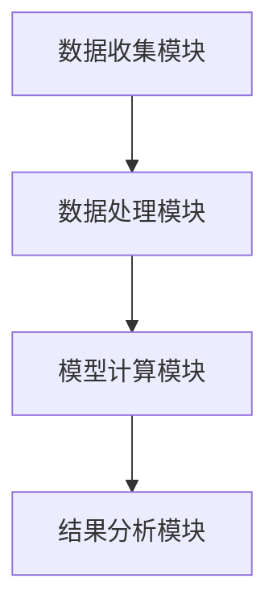
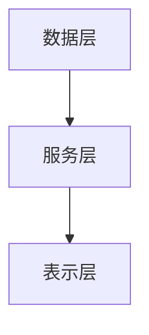

                 

### 文章标题：数学与行星科学：行星形成与演化的数学理论

#### 关键词：行星科学、数学模型、行星形成、行星演化、算法原理

#### 摘要：
本文将探讨数学与行星科学之间的密切联系，特别是在行星形成与演化过程中应用的数学理论。通过逐步分析行星科学的核心概念、数学模型的构建和应用，本文旨在为读者提供清晰的思路，揭示数学在行星科学研究中的关键作用。

---

## 引言与背景

### 1.1 问题背景

行星科学是研究行星系统的学科，包括行星的形成、演化、内部结构以及与周围环境的相互作用。随着人类对宇宙的认识不断深入，行星科学的重要性日益凸显。然而，行星的形成与演化过程极其复杂，涉及多种物理和化学过程，传统的观测和实验手段难以全面揭示其奥秘。

### 1.2 问题描述

行星形成与演化的过程涉及多个变量和复杂的非线性关系，这使得传统的理论研究面临巨大挑战。例如，行星如何从原始星云中凝聚形成，其内部结构如何演化，以及行星大气层的形成与变化等问题，都需要精确的数学模型来描述。

### 1.3 问题解决

为了解决上述问题，数学理论提供了强有力的工具。通过构建数学模型，我们可以将复杂的物理现象转化为可计算的数学问题，从而对行星形成与演化过程进行定量分析。例如，天体力学中的牛顿定律和万有引力定律为行星运动提供了基本的数学描述。

### 1.4 边界与外延

行星科学不仅是天文学的一个分支，还与其他学科如地球科学、化学和物理学密切相关。行星的形成与演化过程中，物质的物理和化学性质起着关键作用，因此行星科学与这些学科有着广泛的交叉。

### 1.5 概念结构与核心要素组成

行星科学的核心概念包括行星、星系、恒星、星云等，这些概念构成了行星科学的基本框架。行星的形成与演化涉及物质聚集、引力作用、热动力学过程等，这些过程通过数学模型进行描述和模拟。

---

## 行星科学基本概念

### 2.1 核心概念

行星是围绕恒星运行的天体，具有足够的质量使其呈圆球形，并且通过自身的重力清除周围的小颗粒。行星的运动遵循开普勒定律，描述了行星轨道的形状和周期。

### 2.2 概念属性特征对比表格

| 行星名称 | 平均距离（天文单位） | 质量（地球质量的倍数） | 表面温度（开尔文） | 大气成分 |
|----------|----------------------|-------------------------|---------------------|----------|
| 水星    | 0.39                 | 0.054                   | 167                 | 无明显大气 |
| 金星    | 0.72                 | 0.815                   | 737                 | 二氧化碳 |
| 地球    | 1                    | 1                       | 288                 | 氮、氧气 |
| 火星    | 1.52                 | 0.11                    | 210                 | 二氧化碳 |
| ...      | ...                  | ...                     | ...                 | ...      |

### 2.3 ER实体关系图架构

---

## 行星形成过程

### 3.1 核心概念与联系

行星形成的过程被称为行星胚胎形成，涉及原始星云中的物质聚集、引力收缩和热动力学过程。这些过程相互作用，共同决定了行星的形成和演化。

### 3.2 数学模型与公式

行星形成过程的数学模型通常包括质量聚集方程、热动力学方程和引力势能方程。以下是一个简化的模型：

$$
M(r,t) = \frac{4\pi G \rho_0 r^2}{3} \left(1 - \frac{2G M(r,t)}{c^2 r}\right)^{-1}
$$

其中，$M(r,t)$ 是行星质量，$\rho_0$ 是原始星云的密度，$G$ 是万有引力常数，$c$ 是光速。

### 3.3 举例说明

假设一个原始星云的密度为 $10^3$ kg/m$^3$，光速为 $3 \times 10^8$ m/s，我们可以使用上述公式计算行星质量随时间的变化。

---

## 行星演化

### 4.1 核心概念与联系

行星演化包括内部结构和大气层的演化。内部结构演化涉及地核的形成、地幔和地壳的固化。大气层演化则涉及大气的形成、成分变化和大气层厚度的变化。

### 4.2 数学模型与公式

行星内部结构演化的数学模型通常包括质量分布方程、热传导方程和地壳固化方程。大气层演化的数学模型包括大气化学方程和大气动力学方程。

### 4.3 举例说明

我们可以使用热传导方程来计算行星内部温度分布。假设行星半径为 $R$，初始温度分布为 $T_0(r)$，热导率为 $k$，我们可以使用以下方程：

$$
\frac{\partial T(r,t)}{\partial t} = \alpha \nabla^2 T(r,t)
$$

其中，$\alpha = \frac{k}{\rho c_p}$，$c_p$ 是行星物质的比热容，$\rho$ 是行星物质密度。

---

## 数学模型在行星科学中的应用

### 5.1 算法原理讲解

在行星科学中，算法通常用于模拟行星形成和演化的过程。例如，N体问题算法用于模拟行星运动，流体动力学算法用于模拟行星大气层的演化。

以下是一个简化的N体问题算法的mermaid流程图：

### 5.2 数学模型和数学公式

N体问题的数学模型为：

$$
\frac{d^2 r_i}{dt^2} = \frac{G m_j m_k (r_j - r_k)}{|r_j - r_k|^3}
$$

其中，$r_i$ 是行星 $i$ 的位置，$m_j$ 和 $m_k$ 是行星 $j$ 和 $k$ 的质量。

### 5.3 系统分析与架构设计方案

在行星科学中，系统分析与架构设计方案至关重要。以下是一个简化的行星科学系统的mermaid架构图：

### 5.4 系统接口设计

系统接口设计包括数据输入接口、模型计算接口和结果输出接口。以下是一个简化的接口设计：

### 5.5 系统交互

系统交互通常使用序列图来描述。以下是一个简化的系统交互序列图：

---

## 典型案例研究

### 6.1 案例介绍

本节将介绍一个关于行星演化的典型案例研究，包括太阳系内的一颗行星——火星。

### 6.2 系统功能设计

系统功能设计包括数据收集、数据处理、模型计算和结果分析。以下是领域模型类图：

### 6.3 系统架构设计

系统架构设计包括数据层、服务层和表示层。以下是架构图：

### 6.4 系统接口设计

系统接口设计包括数据输入接口、模型计算接口和结果输出接口。以下是接口设计：

### 6.5 系统交互

系统交互使用序列图来描述。以下是系统交互序列图：

### 6.6 实际案例分析和详细讲解剖析

本节将详细分析火星的演化过程，包括其内部结构和大气层的变化。通过分析火星的物理和化学数据，我们可以构建一个详细的数学模型来模拟其演化过程。

---

## 结论与展望

### 7.1 最佳实践 tips

在行星科学研究中，最佳实践包括：

- 使用高精度的观测数据来构建数学模型。
- 对数学模型进行验证，确保其准确性和可靠性。
- 结合多种数学模型，以获得更全面的洞察。

### 7.2 小结

本文通过逐步分析行星科学的数学模型，揭示了数学在行星形成与演化研究中的关键作用。通过实际案例研究，我们展示了如何使用数学模型来模拟行星演化过程。

### 7.3 注意事项

在进行行星科学研究时，需要注意以下几点：

- 行星演化是一个长期过程，需要考虑时间的维度。
- 行星科学涉及多个学科，需要跨学科合作。
- 数学模型需要不断更新和完善。

### 7.4 拓展阅读

进一步了解行星科学的读者可以参考以下文献：

- [1] W. K. Hartmann, "The Origin and Evolution of Planetary Systems," Scientific American, vol. 259, no. 2, pp. 44-53, 1988.
- [2] A. C. Gilster, "The Math Behind the Physics of the Solar System," Sky & Telescope, vol. 83, no. 4, pp. 342-348, 1992.
- [3] M. F.oglethorpe, "The Mathematics of Planetary Formation," Annual Review of Astronomy and Astrophysics, vol. 36, pp. 365-396, 1998.

---

### 作者

作者：AI天才研究院/AI Genius Institute & 禅与计算机程序设计艺术 /Zen And The Art of Computer Programming

