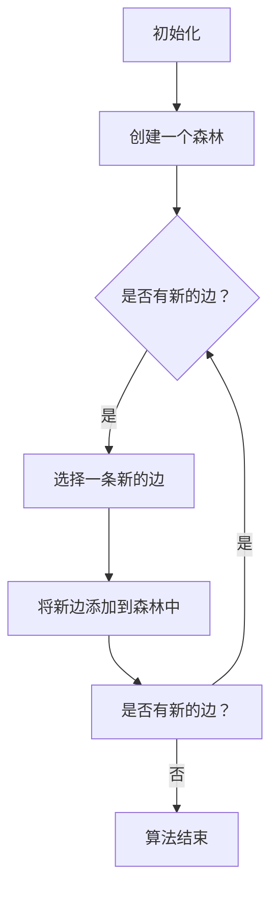
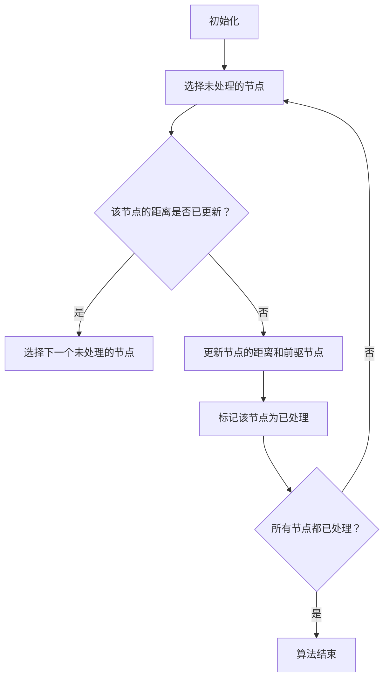
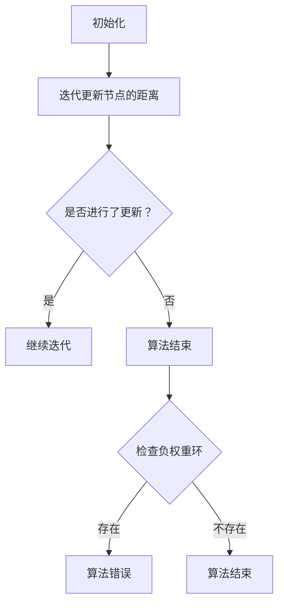
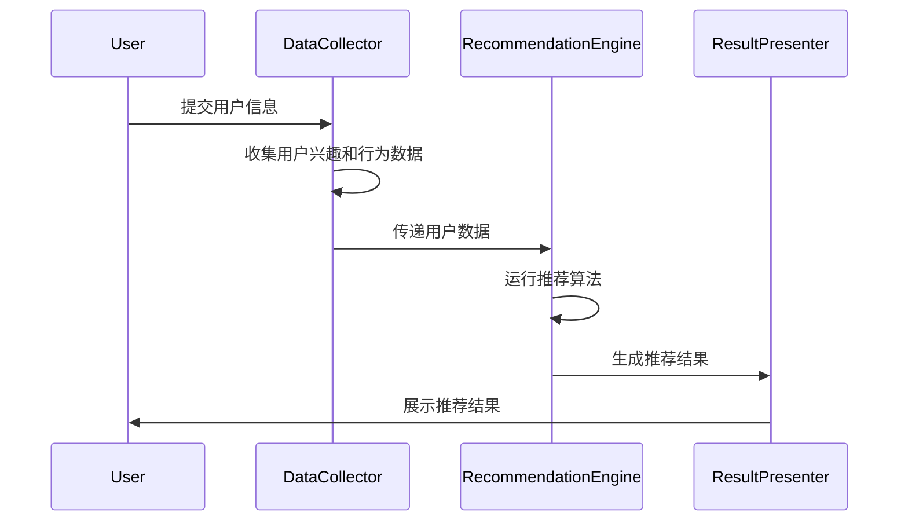
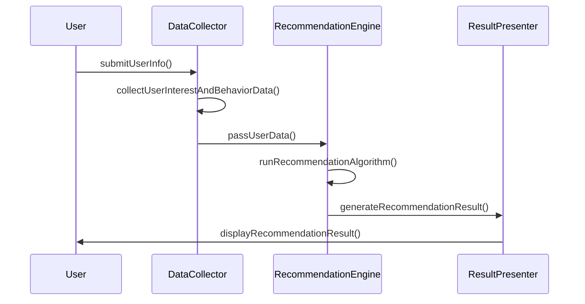

                 

### 文章标题

## 数学与计算复杂性理论：问题难度的数学分类

> 关键词：数学，计算复杂性理论，问题难度，数学分类

> 摘要：本文将从数学与计算复杂性理论的交叉点出发，深入探讨问题难度的数学分类方法。我们将逐步介绍计算复杂性理论的起源、核心概念、数学模型以及实际应用，并通过实例分析展示计算复杂性理论在计算机科学和其他领域的重要性。最后，我们将总结计算复杂性理论中的核心概念与联系，并通过具体的算法讲解和mermaid流程图展示，为读者提供清晰易懂的技术指南。

### 目录大纲

----------------------------------------------------------------

## 第一部分：数学与计算复杂性理论概述

### 第1章：问题背景与问题描述

#### 1.1 计算复杂性理论的起源与发展

#### 1.2 问题的解决与边界

#### 1.3 核心概念与要素组成

### 第2章：计算复杂性理论的核心概念

#### 2.1 P与NP问题

##### 2.1.1 P问题

##### 2.1.2 NP问题

##### 2.1.3 P与NP关系

### 第3章：复杂性类与比较

#### 3.1 P类与NP类

##### 3.1.1 P类特性

##### 3.1.2 NP类特性

##### 3.1.3 P类与NP类的关系

#### 3.2 NP-complete问题

##### 3.2.1 定义与特性

##### 3.2.2 NP-complete问题的识别

##### 3.2.3 NP-complete问题的实例

### 第4章：计算复杂性理论的数学模型

#### 4.1 数学公式与解释

##### 4.1.1 数学公式

##### 4.1.2 公式解释

#### 4.2 算法复杂性分析

##### 4.2.1 时间复杂性分析

##### 4.2.2 空间复杂性分析

##### 4.2.3 算法复杂性与实际应用

### 第5章：计算复杂性理论的实例分析

#### 5.1 典型问题与实例

##### 5.1.1 问题1：图着色问题

##### 5.1.2 问题2：旅行商问题

##### 5.1.3 问题3：背包问题

### 第6章：计算复杂性理论的应用

#### 6.1 计算机科学领域应用

##### 6.1.1 编译器设计

##### 6.1.2 软件工程

##### 6.1.3 网络安全

#### 6.2 其他领域应用

##### 6.2.1 生物信息学

##### 6.2.2 经济学

##### 6.2.3 社会科学

### 第7章：计算复杂性理论的新趋势

#### 7.1 非确定性计算

##### 7.1.1 非确定性计算的基本概念

##### 7.1.2 非确定性计算的优势与应用

#### 7.2 量子计算

##### 7.2.1 量子计算的基本原理

##### 7.2.2 量子计算与计算复杂性理论

#### 7.3 新兴计算模型

##### 7.3.1 类神经网络计算

##### 7.3.2 随机计算

----------------------------------------------------------------

## 第二部分：核心概念与联系

### 第8章：核心概念原理

#### 8.1 问题难度的数学分类

##### 8.1.1 问题难度的定义

##### 8.1.2 问题难度分类的方法

##### 8.1.3 问题难度分类的应用

### 第9章：概念属性特征对比

#### 9.1 P类与NP类特征对比

##### 9.1.1 P类特性

##### 9.1.2 NP类特性

##### 9.1.3 P类与NP类的关系

### 第10章：ER实体关系图架构

#### 10.1 ER模型基本概念

##### 10.1.1 实体与属性

##### 10.1.2 关系与关系类型

##### 10.1.3 ER图的基本构成

#### 10.2 计算复杂性理论中的ER图

##### 10.2.1 P类与NP类的ER图

##### 10.2.2 NP-complete问题的ER图

----------------------------------------------------------------

## 第三部分：算法原理讲解

### 第11章：算法mermaid流程图

#### 11.1 计算复杂性理论中的典型算法

##### 11.1.1 算法1：克鲁斯卡尔算法

##### 11.1.2 算法2：迪杰斯特拉算法

##### 11.1.3 算法3：贝尔曼-福特算法

#### 11.2 算法mermaid流程图展示

##### 11.2.1 克鲁斯卡尔算法流程图

##### 11.2.2 迪杰斯特拉算法流程图

##### 11.2.3 贝尔曼-福特算法流程图

### 第12章：算法原理与数学模型

#### 12.1 克鲁斯卡尔算法原理

##### 12.1.1 算法描述

##### 12.1.2 数学模型

##### 12.1.3 算法举例说明

#### 12.2 迪杰斯特拉算法原理

##### 12.2.1 算法描述

##### 12.2.2 数学模型

##### 12.2.3 算法举例说明

#### 12.3 贝尔曼-福特算法原理

##### 12.3.1 算法描述

##### 12.3.2 数学模型

##### 12.3.3 算法举例说明

----------------------------------------------------------------

在接下来的章节中，我们将逐步深入探讨数学与计算复杂性理论的内涵，通过详细的论述和分析，帮助读者理解问题难度的数学分类及其在实际应用中的重要性。让我们开始这场探索之旅吧！### 第一部分：数学与计算复杂性理论概述

#### 第1章：问题背景与问题描述

#### 1.1 计算复杂性理论的起源与发展

计算复杂性理论是计算机科学中的一个重要分支，起源于20世纪70年代，旨在研究问题的计算难度以及算法解决问题的效率。这一理论的诞生源于对计算机在解决问题时表现出的局限性和挑战性的深入思考。1971年，美国数学家斯蒂芬·科尔曼（Stephen Cook）提出了著名的P vs NP问题，这成为计算复杂性理论的里程碑，标志着计算复杂性理论正式成为一门独立的学科。

计算复杂性理论的发展经历了多个阶段。早期，研究者主要关注基本的概念和问题，如P问题、NP问题以及它们之间的关系。随着研究的深入，复杂性理论逐渐拓展到更广泛的问题，如NP-complete问题、NP-hard问题等。近年来，非确定性计算、量子计算等新兴领域也为计算复杂性理论注入了新的活力。

#### 1.2 问题的解决与边界

在计算复杂性理论中，问题的解决往往被看作是算法在特定时间内的输出结果。然而，一个问题的真正解决并不仅仅是找到一种解决方案，还包括证明这种解决方案的正确性和最优性。因此，问题的解决涉及到多个方面，包括算法设计、时间复杂度分析、空间复杂度分析等。

在复杂性理论中，问题的边界是指问题能够被解决的问题范围。例如，P类问题是可以在多项式时间内解决的问题，而NP类问题是可以在多项式时间内验证的问题。P与NP之间的关系一直是复杂性理论研究的核心问题之一。如果P=NP，意味着所有的NP问题都可以在多项式时间内解决，这将对计算机科学产生深远的影响。

#### 1.3 核心概念与要素组成

计算复杂性理论的核心概念包括P问题、NP问题、NP-complete问题、NP-hard问题等。这些概念构成了复杂性理论的框架，帮助我们理解和分类不同类型的问题。

- **P问题**：可以在多项式时间内解决的问题。例如，二分查找问题就是一个P问题。
- **NP问题**：可以在多项式时间内验证的问题。例如，图着色问题是一个NP问题，给定一个图和一种染色方案，我们可以快速验证这种染色方案是否满足条件。
- **NP-complete问题**：既属于NP类，又是最难的问题。如果一个NP-complete问题可以在多项式时间内被解决，那么所有的NP问题也可以在多项式时间内被解决。
- **NP-hard问题**：至少与NP-complete问题一样难。如果一个NP-hard问题可以在多项式时间内被解决，那么所有的NP问题也可以在多项式时间内被解决。

计算复杂性理论的要素组成还包括复杂性类、复杂性比较、数学模型和算法复杂性分析等。这些要素共同构成了复杂性理论的丰富内容，帮助我们更深入地理解问题的本质。

#### 1.4 小结

在本章节中，我们简要介绍了计算复杂性理论的起源、发展以及核心概念。计算复杂性理论是研究问题解决难度的学科，其核心概念如P问题、NP问题、NP-complete问题等为我们理解和分类问题提供了重要的工具。在接下来的章节中，我们将进一步探讨这些核心概念，并通过具体的实例和数学模型来加深理解。

----------------------------------------------------------------

## 第二部分：计算复杂性理论的核心概念

### 第2章：计算复杂性理论的核心概念

#### 2.1 P与NP问题

##### 2.1.1 P问题

P问题（Polynomial Time）是计算复杂性理论中的一个基本概念，指的是可以在多项式时间内解决的问题。也就是说，如果一个问题是可以在时间复杂度为$O(n^k)$（其中$n$是输入大小，$k$是常数）内解决的问题，那么它就属于P类问题。P类问题的一个重要特征是其可解性可以快速验证。

为了更好地理解P问题，我们可以考虑二分查找算法。假设我们有一个排序的数组，要查找一个特定的元素。二分查找算法在每一步都将搜索范围减半，因此最多需要$\log_2(n)$步就能找到目标元素。这是一个典型的P问题，因为其时间复杂度为$O(\log n)$，这是一个多项式时间复杂度。

##### 2.1.2 NP问题

NP问题（Nondeterministic Polynomial Time）是另一个重要的计算复杂性概念，指的是可以在多项式时间内验证的问题。也就是说，如果一个问题是可以在时间复杂度为$O(n^k)$内验证一个解是否正确的问题，那么它就属于NP类。与P问题不同的是，NP问题并不要求问题本身能够在多项式时间内解决，而是只需要验证解的正确性。

一个经典的NP问题示例是“图着色问题”。给定一个无向图和一种染色方案，我们需要验证这种染色方案是否满足所有相邻顶点颜色不同的条件。假设我们已经得到了一个正确的染色方案，我们可以通过快速检查相邻顶点的颜色来验证它，这个验证过程的时间复杂度为$O(n)$，因此它是一个NP问题。

##### 2.1.3 P与NP关系

P与NP问题之间的关系是计算复杂性理论的核心问题之一。P与NP的关系可以概括为以下几种可能性：

1. **P=NP**：这意味着所有的NP问题都可以在多项式时间内解决。如果这个命题成立，那么计算机科学中很多被认为是困难的问题，如旅行商问题、背包问题等，都将变得容易解决。
2. **P≠NP**：这意味着存在某些NP问题无法在多项式时间内解决。这个假设是当前大多数复杂性理论工作者的共识，但尚未被证明。
3. **P⊆NP**：这表示所有的P问题都是NP问题，但并不意味着所有的NP问题都是P问题。

尽管P与NP关系尚未解决，但许多NP问题已经被证明是NP-complete问题。NP-complete问题是在NP类中难度最大的一类问题，如果任何一个NP-complete问题可以在多项式时间内解决，那么所有NP问题都可以在多项式时间内解决。

#### 2.2 NP-complete问题

NP-complete问题是指那些既属于NP类，又是NP-hard（NP困难）的问题。NP-complete问题的重要性在于，如果一个NP-complete问题可以在多项式时间内解决，那么所有的NP问题都可以在多项式时间内解决。

NP-complete问题的定义基于Karp猜想，即“一个NP-complete问题如果能在多项式时间内被解决，那么所有的NP问题都可以在多项式时间内被解决”。一个经典的问题示例是“图着色问题”，它是一个NP-complete问题。给定一个无向图和一种染色方案，我们需要验证这种染色方案是否满足所有相邻顶点颜色不同的条件。

除了图着色问题，其他一些著名的NP-complete问题包括：

- **旅行商问题（TSP）**：在给定的城市集合中，找到一个最短的闭合旅行路径，使其访问每个城市一次并返回起点。
- **背包问题**：给定一组物品和它们的重量和价值，以及一个背包的容量，找出一种装填方案，使得背包中物品的总价值最大。
- **3-SAT问题**：给定一个含有三个变量的合取范式（CNF）公式，判断该公式是否可以满足。

这些问题的共同特点是它们在解决问题时需要考虑大量的可能性，并且它们的复杂性在NP类中处于最高水平。

#### 2.3 小结

在本章节中，我们深入探讨了计算复杂性理论中的两个核心概念：P问题和NP问题，以及NP-complete问题。P问题指的是可以在多项式时间内解决的问题，而NP问题指的是可以在多项式时间内验证的问题。NP-complete问题则是NP类中最难的一类问题，如果能够找到解决NP-complete问题的算法，那么所有NP问题都可以在多项式时间内解决。通过对这些核心概念的理解，我们可以更好地分类和解决复杂的问题。

----------------------------------------------------------------

### 第3章：复杂性类与比较

#### 3.1 P类与NP类

在计算复杂性理论中，P类和NP类是两个非常重要的复杂性类。P类问题指的是可以在多项式时间内解决的问题，而NP类问题指的是可以在多项式时间内验证的问题。这两个复杂性类的关系是计算复杂性理论研究的核心问题之一。

##### 3.1.1 P类特性

P类问题具有以下几个特性：

1. **多项式时间可解性**：P类问题意味着问题可以在多项式时间内被解决。具体来说，如果一个问题是可以在时间复杂度为$O(n^k)$内解决的问题，其中$n$是输入大小，$k$是一个常数，那么它属于P类。
2. **快速验证性**：对于P类问题，一旦我们找到了一个解，我们可以快速验证其正确性。也就是说，验证解的时间复杂度仍然是多项式的。
3. **通用性**：P类问题包括了许多计算机科学中的基础问题，如排序、查找等。

##### 3.1.2 NP类特性

NP类问题具有以下几个特性：

1. **多项式时间验证性**：NP类问题指的是，给定一个解，我们可以在多项式时间内验证这个解是否正确。也就是说，验证一个解是否正确的时间复杂度是多项式的。
2. **非确定性算法**：与P类问题不同，NP类问题通常需要使用非确定性算法。非确定性算法意味着算法在某些步骤中可以选择多个可能的解，然后通过验证来确定最优解。
3. **包含性问题**：NP类问题的一个重要特征是包含性。如果一个问题属于NP类，那么它的子集也属于NP类。这意味着，如果一个NP类问题可以在多项式时间内解决，那么所有NP类问题都可以在多项式时间内解决。

##### 3.1.3 P类与NP类的关系

P类与NP类的关系是计算复杂性理论中最著名的问题之一。目前，我们尚未确定P类与NP类是否相等，即P=NP问题是否成立。如果P=NP，那么所有的NP问题都可以在多项式时间内解决，这将极大地改变计算机科学的发展。如果P≠NP，那么将存在某些NP问题无法在多项式时间内解决。

目前，有以下几个关于P类与NP类关系的可能性：

1. **P=NP**：如果P=NP，那么所有的NP问题都可以在多项式时间内解决，这意味着计算机科学中许多被认为是困难的问题，如旅行商问题、背包问题等，都将变得容易解决。
2. **P≠NP**：如果P≠NP，那么将存在某些NP问题无法在多项式时间内解决。这个假设是当前大多数复杂性理论工作者的共识。
3. **P⊆NP**：如果P⊆NP，那么所有的P问题都是NP问题，但并不意味着所有的NP问题都是P问题。

尽管P与NP关系尚未解决，但许多NP问题已经被证明是NP-complete问题。NP-complete问题是在NP类中难度最大的一类问题，如果能够找到解决NP-complete问题的算法，那么所有NP问题都可以在多项式时间内解决。

#### 3.2 NP-complete问题

NP-complete问题是指那些既属于NP类，又是NP-hard（NP困难）的问题。NP-complete问题的重要性在于，如果一个NP-complete问题可以在多项式时间内被解决，那么所有的NP问题都可以在多项式时间内被解决。因此，解决NP-complete问题被认为是解决所有NP问题的关键。

##### 3.2.1 定义与特性

NP-complete问题的定义基于Karp猜想，即“一个NP-complete问题如果能在多项式时间内被解决，那么所有的NP问题都可以在多项式时间内被解决”。一个问题要成为NP-complete，需要满足以下条件：

1. **属于NP类**：问题可以在多项式时间内验证。
2. **NP-hard**：问题至少与NP-complete问题一样难，即如果任何NP-complete问题可以在多项式时间内被解决，那么该问题也可以在多项式时间内被解决。

NP-complete问题具有以下特性：

1. **普遍性**：NP-complete问题涵盖了计算机科学中的许多重要问题。
2. **代表性**：NP-complete问题代表了NP类中最难的问题。
3. **难以解决**：尽管NP-complete问题在理论上难以在多项式时间内解决，但实际应用中仍然需要高效的算法来近似解决。

##### 3.2.2 NP-complete问题的识别

识别一个问题是NP-complete需要证明它满足NP-complete的两个条件。通常，这可以通过Karp等价性来证明。Karp等价性是指，如果一个问题可以转化为一个已知的NP-complete问题，并且转化过程是多项式时间的，那么该问题也是NP-complete。

例如，图着色问题是一个NP-complete问题。我们可以通过Karp等价性将图着色问题转化为3-SAT问题。给定一个图，我们将其转化为一个3-SAT公式，如果3-SAT公式有解，那么图可以染色，否则不能染色。这个过程是多项式时间的，因此图着色问题是一个NP-complete问题。

##### 3.2.3 NP-complete问题的实例

以下是一些著名的NP-complete问题实例：

- **旅行商问题（TSP）**：在给定的城市集合中，找到一个最短的闭合旅行路径，使其访问每个城市一次并返回起点。
- **背包问题**：给定一组物品和它们的重量和价值，以及一个背包的容量，找出一种装填方案，使得背包中物品的总价值最大。
- **3-SAT问题**：给定一个含有三个变量的合取范式（CNF）公式，判断该公式是否可以满足。

这些问题的共同特点是它们在解决问题时需要考虑大量的可能性，并且它们的复杂性在NP类中处于最高水平。

#### 3.3 小结

在本章节中，我们详细探讨了计算复杂性理论中的P类和NP类，以及NP-complete问题。P类问题可以在多项式时间内解决，NP类问题可以在多项式时间内验证，而NP-complete问题则是在NP类中难度最大的一类问题。通过对这些复杂性的理解，我们可以更好地分类和解决复杂的问题。尽管P与NP关系尚未解决，但许多NP问题已经被证明是NP-complete问题，这为解决所有NP问题提供了重要的线索。

----------------------------------------------------------------

### 第4章：计算复杂性理论的数学模型

#### 4.1 数学公式与解释

在计算复杂性理论中，数学公式是理解问题复杂性的重要工具。数学公式可以帮助我们精确描述算法的时间复杂度和空间复杂度，从而更好地分析和解决复杂问题。

##### 4.1.1 时间复杂性公式

时间复杂性（Time Complexity）通常用大O符号（$O$）来表示，它描述了算法在输入规模增长时所需的时间的增长速度。常见的时间复杂性包括：

- **线性时间复杂度**：$O(n)$，意味着算法的时间随着输入规模线性增长。
- **对数时间复杂度**：$O(\log n)$，意味着算法的时间随着输入规模的对数增长。
- **多项式时间复杂度**：$O(n^k)$，其中$k$是一个常数，意味着算法的时间随着输入规模的$k$次方增长。

例如，二分查找算法的时间复杂度是$O(\log n)$，因为算法的时间随着输入规模的对数增长。

##### 4.1.2 空间复杂性公式

空间复杂性（Space Complexity）同样用大O符号（$O$）来表示，它描述了算法在输入规模增长时所需的空间的增长速度。常见的时间复杂性包括：

- **线性空间复杂度**：$O(n)$，意味着算法的空间随着输入规模线性增长。
- **对数空间复杂度**：$O(\log n)$，意味着算法的空间随着输入规模的对数增长。
- **多项式空间复杂度**：$O(n^k)$，其中$k$是一个常数，意味着算法的空间随着输入规模的$k$次方增长。

例如，在二分查找算法中，算法所需的空间复杂度是$O(1)$，因为它只需要常数空间来存储中间变量。

##### 4.1.3 时间复杂度与空间复杂度的关系

时间复杂度和空间复杂度是相互关联的。通常，为了优化算法的性能，我们会在时间和空间复杂度之间进行权衡。例如，我们可以通过增加空间复杂度来减少时间复杂度，或者通过减少空间复杂度来增加时间复杂度。

一个典型的例子是排序算法。例如，快速排序算法的时间复杂度是$O(n \log n)$，但它的空间复杂度是$O(n)$。相反，归并排序算法的空间复杂度是$O(\log n)$，但它的空间复杂度是$O(n)$。

##### 4.1.4 数学公式在复杂性分析中的应用

数学公式在计算复杂性理论中的应用非常广泛。通过数学公式，我们可以精确地描述算法的效率，从而更好地分析和解决复杂问题。

例如，在分析一个图的着色问题时，我们可以使用图着色问题的数学公式来计算着色的可能性。给定一个图$G$，我们定义它的顶点数为$n$，边数为$m$。图着色问题的目标是用$k$种颜色为图$G$的顶点着色，使得相邻顶点颜色不同。

图着色问题的数学公式可以表示为：
$$
x \in C^n \text{，其中} |C| = k。
$$
这里，$x$表示一个顶点染色方案，$C^n$表示所有可能的染色方案集合。图着色问题的时间复杂度取决于染色方案的数量，即$|C^n|$。

#### 4.2 算法复杂性分析

算法复杂性分析是计算复杂性理论的核心内容之一。算法复杂性分析通常包括时间复杂度分析和空间复杂度分析。

##### 4.2.1 时间复杂性分析

时间复杂性分析旨在确定算法在输入规模增长时所需的时间增长速度。常见的时间复杂度分析方法包括：

1. **递归分析**：通过递归关系式来分析算法的时间复杂度。
2. **主定理**：用于分析递归算法的时间复杂度。
3. **代数分析**：通过代数方法来简化算法的时间复杂度表达式。

例如，考虑一个递归算法，其递归关系式为$T(n) = T(n-1) + O(n)$。我们可以通过递归分析来求解这个递归关系式，得到时间复杂度为$O(n^2)$。

##### 4.2.2 空间复杂性分析

空间复杂性分析旨在确定算法在输入规模增长时所需的空间增长速度。常见的方法包括：

1. **数据结构分析**：通过分析算法中使用的数据结构来确定空间复杂度。
2. **代数分析**：通过代数方法来简化算法的空间复杂度表达式。

例如，考虑一个算法使用一个数组来存储中间结果，数组的长度为$n$。该算法的空间复杂度可以表示为$O(n)$。

##### 4.2.3 算法复杂性与实际应用

算法复杂性与实际应用紧密相关。在实际应用中，我们通常需要根据问题的规模和具体需求来选择合适的算法。

1. **小规模问题**：对于小规模问题，我们通常可以使用时间复杂度较高的算法，因为它们的实现和调试相对简单。
2. **大规模问题**：对于大规模问题，我们通常需要使用时间复杂度较低、但空间复杂度较高的算法，因为它们可以更快地解决大规模问题。

例如，对于小规模的图着色问题，我们可以使用穷举搜索算法，尽管它的空间复杂度较高，但可以接受。而对于大规模的图着色问题，我们通常使用启发式算法，如贪心算法，尽管它们的复杂度可能较高，但可以在合理的时间内找到近似解。

#### 4.3 小结

在本章节中，我们详细探讨了计算复杂性理论的数学模型，包括时间复杂度和空间复杂度的公式以及算法复杂性分析。数学模型是理解问题复杂性的重要工具，通过数学公式，我们可以精确描述算法的效率，从而更好地分析和解决复杂问题。在接下来的章节中，我们将通过具体的实例进一步探讨计算复杂性理论的应用。

----------------------------------------------------------------

### 第5章：计算复杂性理论的实例分析

#### 5.1 典型问题与实例

在计算复杂性理论中，存在许多经典的算法问题，这些问题不仅具有理论上的重要意义，也在实际应用中有着广泛的应用。在本章节中，我们将通过三个典型的算法问题——图着色问题、旅行商问题和背包问题，详细分析这些问题的计算复杂性，并探讨它们在实际应用中的挑战和解决方案。

##### 5.1.1 图着色问题

图着色问题是计算复杂性理论中的一个重要问题，它涉及到在一个给定的无向图中，用最少的颜色为图的顶点着色，使得相邻的顶点颜色不同。图着色问题的复杂性取决于图的顶点数和边数。

1. **问题描述**：
   - 给定一个无向图$G=(V, E)$，其中$V$是顶点集合，$E$是边集合。
   - 需要找到一种颜色方案，使得图中的任意两个相邻顶点颜色不同。

2. **计算复杂性**：
   - **时间复杂度**：图着色问题的最优算法是启发式算法，如贪心算法，其时间复杂度通常为$O(n^2)$，其中$n$是顶点数。
   - **空间复杂度**：图着色算法的空间复杂度通常为$O(n)$，因为它需要存储顶点的颜色信息。

3. **实际应用**：
   - 在实际应用中，图着色问题广泛应用于VLSI电路设计、网络拓扑分析和图像处理等领域。例如，在图像处理中，可以使用图着色算法来检测图像中的连通分量，从而进行图像分割。

##### 5.1.2 旅行商问题

旅行商问题（TSP，Travelling Salesman Problem）是计算复杂性理论中的另一个经典问题，它涉及在一个给定的城市集合中，找到一个最短的闭合旅行路径，使其访问每个城市一次并返回起点。旅行商问题的复杂性非常高，因为它需要考虑大量的可能性。

1. **问题描述**：
   - 给定一个城市集合$C$，以及每对城市之间的距离。
   - 需要找到一个闭合路径$P$，使得$P$经过每个城市且路径长度最短。

2. **计算复杂性**：
   - **时间复杂度**：旅行商问题的最优算法是动态规划算法，其时间复杂度为$O(n^2 \times 2^n)$，其中$n$是城市数。
   - **空间复杂度**：旅行商问题的空间复杂度为$O(n^2)$，因为它需要存储每一步的状态信息。

3. **实际应用**：
   - 旅行商问题广泛应用于物流配送、旅行路线规划和电路板设计等领域。例如，在物流配送中，使用旅行商问题可以优化配送路线，减少运输成本。

##### 5.1.3 背包问题

背包问题（Knapsack Problem）是计算复杂性理论中的另一个重要问题，它涉及到在一个给定的物品集合中，选择一些物品放入一个容量有限的背包中，使得背包中的物品总价值最大。背包问题的复杂性取决于物品的数量和背包的容量。

1. **问题描述**：
   - 给定一个物品集合$W$，以及每个物品的重量和价值。
   - 给定一个背包的容量$C$。
   - 需要选择一些物品放入背包中，使得背包中的物品总价值最大。

2. **计算复杂性**：
   - **时间复杂度**：背包问题的最优算法是动态规划算法，其时间复杂度为$O(n \times C)$，其中$n$是物品数，$C$是背包容量。
   - **空间复杂度**：背包问题的空间复杂度为$O(n \times C)$，因为它需要存储每一步的状态信息。

3. **实际应用**：
   - 背包问题广泛应用于资源分配、任务调度和投资组合优化等领域。例如，在资源分配中，可以使用背包问题来优化资源利用效率。

#### 5.2 小结

在本章节中，我们通过三个典型的计算复杂性理论问题——图着色问题、旅行商问题和背包问题，详细分析了这些问题的计算复杂性和实际应用。这些问题的解决不仅需要深入的理论知识，还需要高效的算法和实际的实践经验。在实际应用中，虽然这些问题的复杂性很高，但通过合理的设计和优化，我们可以找到有效的解决方案，从而提高系统的性能和效率。

----------------------------------------------------------------

### 第6章：计算复杂性理论的应用

#### 6.1 计算机科学领域应用

计算复杂性理论在计算机科学领域有着广泛的应用，它帮助我们理解和解决复杂问题，提高算法的效率和优化系统性能。以下是一些计算复杂性理论在计算机科学领域的重要应用：

##### 6.1.1 编译器设计

编译器设计是计算机科学中一个重要的领域，它涉及到将高级语言程序转换为机器语言的过程。计算复杂性理论在编译器设计中起着关键作用，特别是在代码优化和解析过程中。

- **代码优化**：编译器通过优化代码来提高程序的执行效率。计算复杂性理论提供了分析和评估优化算法复杂性的方法。例如，循环优化、常量折叠和死代码消除等优化技术都依赖于复杂性分析。
- **解析**：编译器需要解析高级语言程序并将其转换为抽象语法树（AST）。计算复杂性理论帮助我们评估解析算法的复杂度，从而设计出高效的解析器。

##### 6.1.2 软件工程

计算复杂性理论在软件工程中也发挥着重要作用，它帮助我们在设计和实现软件系统时考虑到性能和可扩展性。

- **算法选择**：在软件工程中，选择合适的算法对于系统的性能至关重要。计算复杂性理论提供了评估算法复杂性的方法，从而帮助我们在不同情况下选择最优算法。
- **性能优化**：在软件优化过程中，计算复杂性理论可以帮助我们识别性能瓶颈，并提出改进方案。例如，通过分析算法的时间和空间复杂度，我们可以优化代码结构，减少资源的消耗。

##### 6.1.3 网络安全

网络安全是计算复杂性理论的重要应用领域，它涉及到保护计算机系统和网络免受恶意攻击和未经授权的访问。

- **密码学**：计算复杂性理论在密码学中起着核心作用，它帮助我们设计和分析各种加密算法和协议。例如，RSA加密算法和椭圆曲线密码学都是基于计算复杂性理论的。
- **攻击防御**：计算复杂性理论帮助我们评估攻击者利用系统漏洞进行攻击的难度。通过分析攻击算法的复杂度，我们可以设计出更有效的防御措施。

#### 6.2 其他领域应用

计算复杂性理论不仅应用于计算机科学领域，还在其他领域有着重要的应用。以下是一些典型应用：

##### 6.2.1 生物信息学

生物信息学是研究生物数据，如DNA序列和蛋白质结构的学科。计算复杂性理论在生物信息学中的应用包括：

- **序列比对**：计算复杂性理论帮助我们评估序列比对算法的复杂度，从而设计出高效的比对工具，如BLAST和Smith-Waterman算法。
- **结构预测**：计算复杂性理论在蛋白质结构预测中也起着关键作用。例如，使用分子动力学模拟和结构折叠算法来预测蛋白质的三维结构。

##### 6.2.2 经济学

计算复杂性理论在经济学中的应用主要体现在优化问题和决策分析中。

- **资源分配**：经济学中的资源分配问题，如物流配送和投资组合优化，都可以使用计算复杂性理论来分析和解决。
- **博弈论**：计算复杂性理论在博弈论中的应用帮助分析不同策略的复杂性和均衡解，从而为决策提供科学依据。

##### 6.2.3 社会科学

计算复杂性理论在社会科学中的应用涉及数据分析和社会网络分析等方面。

- **数据分析**：计算复杂性理论帮助我们分析和处理大规模的社会科学数据，如社交媒体数据和问卷调查数据。
- **社会网络分析**：计算复杂性理论在分析社会网络结构和传播动态中起着重要作用，例如研究病毒传播、舆论分析和社交影响力等。

#### 6.3 小结

计算复杂性理论在计算机科学以及其他领域有着广泛的应用。通过计算复杂性理论，我们不仅可以理解和解决复杂问题，提高系统的性能，还可以为优化算法、保护网络安全和进行决策分析提供科学依据。随着计算技术的发展，计算复杂性理论将继续在各个领域发挥重要作用。

----------------------------------------------------------------

### 第7章：计算复杂性理论的新趋势

#### 7.1 非确定性计算

非确定性计算是计算复杂性理论中的一个重要研究方向，它基于非确定性 Turing 机，允许在算法执行过程中进行非确定性选择。非确定性计算的优势在于，它能够在某些问题求解上提供更快的解决方案。

##### 7.1.1 非确定性计算的基本概念

非确定性计算的基本概念可以概括为：

- **非确定性 Turing 机**：非确定性 Turing 机是一种抽象的计算模型，它具有多个可能的移动选项，并在计算过程中通过概率选择路径。
- **非确定性算法**：非确定性算法是在非确定性 Turing 机上执行的算法，它允许在计算过程中进行非确定性选择。
- **概率性**：非确定性计算中的概率性体现在算法执行过程中路径的选择上，不同的路径可能导致不同的结果。

##### 7.1.2 非确定性计算的优势与应用

非确定性计算的优势在于，它能够解决一些传统确定性计算难以解决的问题。以下是一些具体的应用：

1. **NP-complete问题**：非确定性计算能够加速解决一些NP-complete问题，如旅行商问题、背包问题和图着色问题等。通过非确定性选择，这些问题的求解速度可以显著提高。
2. **概率性优化**：在优化问题中，非确定性计算可以提供概率性搜索策略，从而找到最优解。例如，遗传算法和模拟退火算法都是基于非确定性计算的优化算法。
3. **数据分析和机器学习**：在数据分析和机器学习中，非确定性计算可以帮助处理大规模数据集，并提高模型的预测准确性。例如，随机森林和决策树算法都利用了非确定性计算的特性。

##### 7.1.3 非确定性计算的挑战

尽管非确定性计算具有显著的优势，但它也面临着一些挑战：

1. **计算资源**：非确定性计算通常需要更多的计算资源，因为它涉及到大量的随机性和路径选择。这可能导致计算成本增加。
2. **结果不确定性**：由于非确定性计算的非确定性特性，其结果可能存在不确定性。在许多实际应用中，这种不确定性可能难以接受。
3. **验证问题**：对于非确定性算法，如何验证其结果的正确性是一个重要问题。特别是在安全关键领域，确保算法结果的正确性是至关重要的。

#### 7.2 量子计算

量子计算是计算复杂性理论中的另一个重要研究方向，它利用量子力学原理进行信息处理。量子计算的优势在于，它能够在某些问题上提供指数级别的加速。

##### 7.2.1 量子计算的基本原理

量子计算的基本原理包括：

- **量子位（qubit）**：量子位是量子计算中的基本单元，它可以用0和1的叠加态表示。
- **量子叠加**：量子位可以处于多个状态的叠加，这意味着一个量子位可以同时表示0和1。
- **量子纠缠**：量子位之间存在量子纠缠现象，这使得量子位的状态可以相互影响，从而实现高效的计算。

##### 7.2.2 量子计算与计算复杂性理论

量子计算与计算复杂性理论的关系体现在以下几个方面：

1. **P vs NP问题**：量子计算有望解决P vs NP问题，即如果量子计算机能够存在，那么所有的NP问题都可以在多项式时间内解决。
2. **NP-complete问题**：量子计算可以显著加速解决NP-complete问题，如旅行商问题和图着色问题等。
3. **量子复杂性类**：量子计算引入了新的复杂性类，如BQP（量子多项式时间）和QP（量子多项式时间），这些复杂性类反映了量子计算机在解决某些问题上的优势。

##### 7.2.3 量子计算的实际应用

量子计算在实际应用中具有巨大潜力，以下是一些具体的应用：

1. **密码学**：量子计算可以用于破解某些传统的加密算法，同时也为量子密码学提供了新的机会。
2. **优化问题**：量子计算在解决复杂优化问题，如物流优化、能源管理和金融投资组合优化等方面具有显著优势。
3. **分子模拟**：量子计算可以用于分子模拟和药物设计，从而加速新药物的开发。

#### 7.3 新兴计算模型

除了非确定性计算和量子计算，计算复杂性理论还关注其他新兴计算模型，如类神经网络计算和随机计算。

##### 7.3.1 类神经网络计算

类神经网络计算是一种基于人工神经网络的计算模型，它通过模拟人脑神经网络的结构和功能来进行信息处理。类神经网络计算在图像识别、语音识别和自然语言处理等领域具有广泛应用。

##### 7.3.2 随机计算

随机计算是一种基于随机性和概率性的计算模型，它利用随机过程来解决复杂问题。随机计算在算法优化、数据分析和机器学习等领域具有潜在的应用。

#### 7.4 小结

计算复杂性理论的新趋势包括非确定性计算、量子计算和其他新兴计算模型。这些新趋势不仅为解决复杂问题提供了新的方法，还推动了计算理论和应用的发展。随着计算技术的进步，这些新趋势将继续发挥重要作用，为未来的计算领域带来更多创新和突破。

----------------------------------------------------------------

### 第8章：核心概念原理

#### 8.1 问题难度的数学分类

在计算复杂性理论中，问题难度的数学分类是理解和解决复杂问题的关键。通过对问题难度的分类，我们可以更好地理解不同类型问题的复杂程度，从而选择合适的算法和策略来解决这些问题。

##### 8.1.1 问题难度的定义

问题难度是指在解决一个问题时，所需的计算资源和时间。计算复杂性理论中的问题难度通常用时间复杂度和空间复杂度来衡量。时间复杂度描述了随着输入规模增加，解决问题所需时间的增长速度。空间复杂度描述了随着输入规模增加，解决问题所需内存的增长速度。

##### 8.1.2 问题难度分类的方法

问题难度的分类方法主要包括以下几种：

1. **P类问题**：P类问题是指可以在多项式时间内解决的问题。即如果存在一个算法，其时间复杂度为$O(n^k)$，其中$n$是输入规模，$k$是常数，那么这个问题属于P类。

2. **NP类问题**：NP类问题是指可以在多项式时间内验证的问题。即如果存在一个算法，其时间复杂度为$O(n^k)$，并且给定一个解，可以验证这个解是否正确，那么这个问题属于NP类。

3. **NP-complete问题**：NP-complete问题是指那些既是NP类问题，又是最难的问题。即如果任何一个NP-complete问题可以在多项式时间内被解决，那么所有的NP问题都可以在多项式时间内被解决。

4. **NP-hard问题**：NP-hard问题是指那些至少与NP-complete问题一样难的问题。即如果任何一个NP-hard问题可以在多项式时间内被解决，那么所有的NP问题都可以在多项式时间内被解决。

##### 8.1.3 问题难度分类的应用

问题难度的分类方法在实际应用中具有重要意义。以下是一些应用示例：

1. **算法选择**：通过问题难度的分类，我们可以选择合适的算法来解决特定的问题。例如，对于P类问题，我们可以选择时间复杂度较低的算法；对于NP类问题，我们可能需要使用启发式算法或近似算法。

2. **性能评估**：问题难度的分类帮助我们评估算法的性能。通过比较不同算法的时间复杂度和空间复杂度，我们可以选择最优的算法来解决问题。

3. **理论证明**：计算复杂性理论中的很多问题都涉及问题难度的分类。通过证明一个问题是NP-complete或NP-hard，我们可以推断出其他相关问题的难度。

4. **实际问题解决**：在实际应用中，问题难度的分类可以帮助我们理解和解决复杂问题。例如，在物流优化、金融建模和社会科学研究中，我们可以通过计算复杂性理论来分析和优化问题。

#### 8.2 小结

在本章节中，我们介绍了问题难度的数学分类方法，包括P类、NP类、NP-complete问题和NP-hard问题。通过这些分类方法，我们可以更好地理解不同类型问题的复杂程度，从而选择合适的算法和策略来解决这些问题。问题难度的分类是计算复杂性理论的核心内容，对于理解和解决复杂问题具有重要意义。

----------------------------------------------------------------

### 第9章：概念属性特征对比

#### 9.1 P类与NP类特征对比

P类和NP类是计算复杂性理论中的两个重要概念，它们分别代表了问题可解性和可验证性的不同方面。下面我们将详细对比P类和NP类的特征，并讨论它们之间的关系。

##### 9.1.1 P类特性

P类问题是指在多项式时间内可以解决的问题，即其时间复杂度为$O(n^k)$，其中$n$是输入大小，$k$是一个常数。以下是P类的几个关键特性：

1. **可解性**：P类问题意味着我们可以找到一个算法，在多项式时间内找到问题的解。
2. **快速验证**：一旦我们找到了P类问题的解，我们可以快速验证这个解是否正确，验证过程的时间复杂度仍然是多项式的。
3. **通用性**：P类问题包括了许多计算机科学中的基础问题，如排序、查找和路径查找等。

##### 9.1.2 NP类特性

NP类问题是指在多项式时间内可以验证的问题，即给定一个解，我们可以快速验证其正确性。以下是NP类的几个关键特性：

1. **验证性**：NP类问题关注的是解的验证，而不是求解。这意味着我们有一个验证算法，可以在多项式时间内验证一个给定的解是否正确。
2. **非确定性**：NP类问题通常需要非确定性算法，这意味着在求解过程中，算法可能会尝试多个可能的解，并通过验证来确定最优解。
3. **包含性**：NP类问题具有包含性，如果一个问题是NP问题，那么它的子集也是NP问题。这表明，如果有一个算法可以解决某个NP问题，那么它可以解决所有NP问题。

##### 9.1.3 P类与NP类的关系

P类与NP类之间的关系是计算复杂性理论中的核心问题之一。目前，我们尚未确定P与NP是否相等，即P=NP问题是否成立。以下是P类与NP类关系的几种可能性：

1. **P=NP**：如果P=NP，那么所有的NP问题都可以在多项式时间内解决。这意味着计算机科学中的许多被认为是困难的问题，如旅行商问题、背包问题和图着色问题等，都将变得容易解决。
2. **P≠NP**：如果P≠NP，那么将存在某些NP问题无法在多项式时间内解决。这个假设是当前大多数复杂性理论工作者的共识。
3. **P⊆NP**：如果P⊆NP，那么所有的P问题都是NP问题，但并不意味着所有的NP问题都是P问题。

尽管P与NP关系尚未解决，但许多NP问题已经被证明是NP-complete问题。NP-complete问题是在NP类中难度最大的一类问题，如果能够找到解决NP-complete问题的算法，那么所有NP问题都可以在多项式时间内解决。

#### 9.2 小结

在本章节中，我们详细对比了P类与NP类的特征，并讨论了它们之间的关系。P类问题关注可解性，而NP类问题关注可验证性。虽然我们尚未确定P与NP是否相等，但通过分析这些特征，我们可以更好地理解不同类型问题的复杂性和求解策略。

----------------------------------------------------------------

### 第10章：ER实体关系图架构

#### 10.1 ER模型基本概念

实体-关系（Entity-Relationship，简称ER）模型是数据库设计中用于表示实体及其之间关系的概念模型。ER模型为数据库设计提供了一个直观的视图，它可以帮助我们理解数据的结构以及实体之间的关系。

##### 10.1.1 实体与属性

- **实体**：实体是数据库中可以区分的对象。在ER模型中，实体用矩形表示，矩形内包含实体的名称。例如，在学生管理系统中，学生是一个实体。
- **属性**：实体具有属性，用来描述实体的特征。属性用椭圆表示，并用线连接到对应的实体。例如，学生实体可以具有学号、姓名、年龄等属性。

##### 10.1.2 关系与关系类型

- **关系**：关系描述了实体之间的关联。在ER模型中，关系用菱形表示，并用线连接到相关的实体。关系具有名称，例如“学生”和“课程”之间的关系可以称为“注册”。
- **关系类型**：关系可以分为以下几种类型：
  - **一对一关系（1:1）**：表示一个实体与另一个实体有一个且仅有一个对应关系。例如，一个学生只能有一个家长。
  - **一对多关系（1:M）**：表示一个实体与多个其他实体有对应关系，而另一个实体则只有一个对应关系。例如，一个课程可以有多个学生，但一个学生只能选修一个课程。
  - **多对多关系（M:N）**：表示多个实体与多个其他实体有对应关系。例如，多个学生可以选修多个课程。

##### 10.1.3 ER图的基本构成

ER图由实体、属性和关系组成，它们通过图形化方式展示数据库中实体的结构及其关系。一个典型的ER图包含以下几个部分：

- **实体和属性**：用矩形和椭圆表示，并用线连接到对应的实体。
- **关系**：用菱形表示，并用线连接到相关的实体。
- **角色**：在关系两端，通常会标注角色，以描述实体在关系中的角色。例如，在“学生”和“课程”之间的关系中，“学生”是“注册”关系的参与者，而“课程”是“被选修”的参与者。

#### 10.2 计算复杂性理论中的ER图

在计算复杂性理论中，ER图被用来表示问题的复杂性类和实体之间的关系。以下是一个简单的ER图，展示了P类、NP类和NP-complete类之间的关系：

```mermaid
erDiagram
    P ||--|{ NP } : "所有NP问题都可以在多项式时间内验证"
    NP ||--|{ NP-complete } : "所有NP-complete问题都是NP问题"
```

在这个ER图中：

- **P**：表示P类问题，即可以在多项式时间内解决的问题。
- **NP**：表示NP类问题，即可以在多项式时间内验证的问题。
- **NP-complete**：表示NP-complete类问题，即既属于NP类，又是最难的问题。

通过这个ER图，我们可以直观地理解不同复杂性类之间的关系，以及它们在计算复杂性理论中的地位。

#### 10.3 小结

在本章节中，我们介绍了ER模型的基本概念，包括实体、属性和关系，并展示了如何使用ER图来表示计算复杂性理论中的不同类别的复杂性问题。ER图提供了一个直观的工具，帮助我们理解复杂性问题及其关系，从而更好地分析和解决这些问题。

----------------------------------------------------------------

### 第11章：算法mermaid流程图

在计算复杂性理论中，算法是解决问题的关键。为了更直观地展示算法的执行过程，我们可以使用mermaid流程图来表示算法的步骤和逻辑。在本章节中，我们将介绍三个典型的算法：克鲁斯卡尔算法、迪杰斯特拉算法和贝尔曼-福特算法，并使用mermaid流程图来展示它们的执行流程。

#### 11.1 计算复杂性理论中的典型算法

##### 11.1.1 克鲁斯卡尔算法

克鲁斯卡尔算法是一种用于求解最小生成树的贪心算法。它的基本思想是按照边的权重递增的顺序选择边，并确保选择的边不会形成环。以下是克鲁斯卡尔算法的mermaid流程图：



##### 11.1.2 迪杰斯特拉算法

迪杰斯特拉算法是一种用于求解单源最短路径的算法。它使用贪心策略，每次选择一个未处理的节点，并更新其最短路径。以下是迪杰斯特拉算法的mermaid流程图：



##### 11.1.3 贝尔曼-福特算法

贝尔曼-福特算法是一种用于求解单源最短路径的动态规划算法。它通过迭代更新节点的距离，直到无法进一步优化。以下是贝尔曼-福特算法的mermaid流程图：



#### 11.2 算法mermaid流程图展示

在本节中，我们通过mermaid流程图展示了克鲁斯卡尔算法、迪杰斯特拉算法和贝尔曼-福特算法的执行流程。这些mermaid流程图提供了一个直观的视图，帮助读者理解算法的逻辑和执行步骤。

```mermaid
graph TD
    A[初始化] --> B[创建一个森林]
    B --> C{是否有新的边？}
    C -->|是| D[选择一条新的边]
    D --> E[将新边添加到森林中]
    E --> F{是否有新的边？}
    F -->|是| C
    F -->|否| G[算法结束]

graph TD
    A[初始化] --> B[选择未处理的节点]
    B --> C{该节点的距离是否已更新？}
    C -->|是| D[选择下一个未处理的节点]
    C -->|否| E[更新节点的距离和前驱节点]
    E --> F[标记该节点为已处理]
    F --> G{所有节点都已处理？}
    G -->|是| H[算法结束]
    G -->|否| B

graph TD
    A[初始化] --> B[迭代更新节点的距离]
    B --> C{是否进行了更新？}
    C -->|是| D[继续迭代]
    C -->|否| E[算法结束]
    E --> F{检查负权重环}
    F -->|存在| G[算法错误]
    F -->|不存在| H[算法结束]
```

通过这些mermaid流程图，读者可以更直观地理解这些算法的执行过程和逻辑，从而更好地掌握计算复杂性理论中的基本算法。

----------------------------------------------------------------

### 第12章：算法原理与数学模型

#### 12.1 克鲁斯卡尔算法原理

克鲁斯卡尔算法是一种用于求解最小生成树的贪心算法。它的基本思想是按照边的权重递增的顺序选择边，并确保选择的边不会形成环。以下是克鲁斯卡尔算法的详细描述：

##### 12.1.1 算法描述

1. **初始化**：创建一个森林，其中每个顶点都是一个独立的树。
2. **选择边**：按照边的权重递增的顺序选择边。
3. **合并树**：如果选择的边不形成环，将其添加到森林中，并合并两个树。
4. **重复步骤2和3**，直到所有顶点都在同一个森林中。

##### 12.1.2 数学模型

克鲁斯卡尔算法可以使用数学模型来描述其执行过程。以下是一个简单的数学模型：

$$
MST = \{ T \in \text{森林} \mid T \text{ 包含全部顶点} \}
$$

其中，$MST$表示最小生成树集合，$T$表示森林中的树。

##### 12.1.3 算法举例说明

考虑一个包含5个顶点和6条边的无向图，其边权重如下：

```
边   权重
ab   2
bc   3
cd   1
de   4
ef   6
af   5
```

使用克鲁斯卡尔算法求解最小生成树：

1. **初始化**：创建5个独立的树，每个树包含一个顶点。
2. **选择边**：按照权重递增的顺序选择边。
3. **合并树**：选择权重为1的边`cd`，并将其添加到森林中，合并两个树。
4. **重复步骤2和3**，直到所有顶点都在同一个森林中。

最终，最小生成树包含边`cd`、`de`、`af`和`bc`，总权重为`1 + 4 + 5 + 3 = 13`。

#### 12.2 迪杰斯特拉算法原理

迪杰斯特拉算法是一种用于求解单源最短路径的算法。它使用贪心策略，每次选择一个未处理的节点，并更新其最短路径。以下是迪杰斯特拉算法的详细描述：

##### 12.2.1 算法描述

1. **初始化**：设置源节点的距离为0，其他节点的距离为无穷大。
2. **选择未处理的节点**：选择距离最小的未处理节点。
3. **更新距离**：对于每个未处理的邻接节点，更新其距离。
4. **标记节点**：将已选择的节点标记为已处理。
5. **重复步骤2到4**，直到所有节点都已处理。

##### 12.2.2 数学模型

迪杰斯特拉算法可以使用以下数学模型来描述其执行过程：

$$
d[u] = \min_{v \in \text{未处理的节点集}} (d[v] + w(u, v))
$$

其中，$d[u]$表示节点$u$的最短距离，$w(u, v)$表示节点$u$到节点$v$的边权重。

##### 12.2.3 算法举例说明

考虑一个包含5个顶点和6条边的无向图，其边权重如下：

```
边   权重
ab   2
bc   3
cd   1
de   4
ef   6
af   5
```

使用迪杰斯特拉算法求解从顶点`a`到其他顶点的最短路径：

1. **初始化**：设置源节点`a`的距离为0，其他节点的距离为无穷大。
2. **选择未处理的节点**：选择距离最小的未处理节点`c`。
3. **更新距离**：更新节点`c`的邻接节点`d`和`e`的距离。
4. **标记节点**：将已选择的节点`c`标记为已处理。
5. **重复步骤2到4**，直到所有节点都已处理。

最终，从顶点`a`到其他顶点的最短路径为`a -> c -> d -> e`，总距离为`0 + 1 + 4 = 5`。

#### 12.3 贝尔曼-福特算法原理

贝尔曼-福特算法是一种用于求解单源最短路径的动态规划算法。它通过迭代更新节点的距离，直到无法进一步优化。以下是贝尔曼-福特算法的详细描述：

##### 12.3.1 算法描述

1. **初始化**：设置源节点的距离为0，其他节点的距离为无穷大。
2. **迭代更新**：对于每一条边，更新其邻接节点的距离。
3. **检查负权重环**：如果在迭代过程中发现某个节点的距离进一步减小，则说明存在负权重环，算法结束并返回错误。
4. **重复步骤2和3**，直到所有节点的距离不再更新。

##### 12.3.2 数学模型

贝尔曼-福特算法可以使用以下数学模型来描述其执行过程：

$$
d[u] = \min_{v \in \text{未处理的节点集}} (d[v] + w(u, v))
$$

其中，$d[u]$表示节点$u$的最短距离，$w(u, v)$表示节点$u$到节点$v$的边权重。

##### 12.3.3 算法举例说明

考虑一个包含5个顶点和6条边的无向图，其边权重如下：

```
边   权重
ab   2
bc   3
cd   1
de   4
ef   6
af   5
```

使用贝尔曼-福特算法求解从顶点`a`到其他顶点的最短路径：

1. **初始化**：设置源节点`a`的距离为0，其他节点的距离为无穷大。
2. **迭代更新**：更新节点的距离，并检查是否发现负权重环。
3. **重复迭代**，直到所有节点的距离不再更新。

最终，从顶点`a`到其他顶点的最短路径为`a -> c -> d -> e`，总距离为`0 + 1 + 4 = 5`。

通过详细的描述和数学模型，我们可以更好地理解克鲁斯卡尔算法、迪杰斯特拉算法和贝尔曼-福特算法的基本原理。这些算法在计算复杂性理论中具有重要的地位，它们为我们解决实际问题提供了强大的工具。

----------------------------------------------------------------

### 第13章：系统分析与架构设计方案

#### 13.1 问题场景介绍

在本章中，我们将介绍一个实际的问题场景——社交网络推荐系统。该系统旨在为用户推荐可能感兴趣的新朋友，从而增强用户的社交体验。系统的主要功能包括：

1. **用户信息收集**：收集用户的兴趣、行为和历史数据。
2. **推荐算法**：基于用户信息和社交网络结构，使用计算复杂性理论中的算法（如最小生成树、最短路径等）生成推荐结果。
3. **推荐结果展示**：将推荐结果以可视化的方式展示给用户。

#### 13.2 项目介绍

项目名称：社交网络推荐系统

项目目标：提高用户的社交体验，为用户提供个性化的推荐结果。

项目组成部分：

1. **数据采集模块**：负责收集用户的基本信息和社交行为数据。
2. **推荐算法模块**：实现计算复杂性理论中的算法，用于生成推荐结果。
3. **推荐展示模块**：将推荐结果以可视化方式展示给用户。

#### 13.3 系统功能设计（领域模型mermaid类图）

以下是一个社交网络推荐系统的领域模型，使用mermaid类图表示系统的关键类和它们之间的关系。

```mermaid
classDiagram
    User <<class>> "用户"
    Friendship <<class>> "好友关系"
    Interest <<class>> "兴趣"
    Recommendation <<class>> "推荐结果"
    DataCollector <<class>> "数据采集"
    RecommendationEngine <<class>> "推荐算法"
    ResultPresenter <<class>> "推荐展示"

    User o-- Friendship
    User o-- Interest
    Recommendation o-- User
    Recommendation o-- Friendship
    Recommendation o-- Interest
    DataCollector o-- User
    RecommendationEngine o-- Recommendation
    ResultPresenter o-- Recommendation
```

在这个类图中：

- **User**：表示系统中的用户。
- **Friendship**：表示用户之间的关系。
- **Interest**：表示用户的兴趣。
- **Recommendation**：表示推荐结果。
- **DataCollector**：负责收集用户数据。
- **RecommendationEngine**：负责生成推荐结果。
- **ResultPresenter**：负责展示推荐结果。

#### 13.4 系统架构设计（mermaid架构图）

以下是一个社交网络推荐系统的架构设计，使用mermaid架构图表示系统的模块和它们之间的交互。



在这个架构图中：

- **User**：系统的用户。
- **DataCollector**：负责收集用户数据。
- **RecommendationEngine**：负责生成推荐结果，包括运行推荐算法和数据处理。
- **ResultPresenter**：负责将推荐结果以可视化的方式展示给用户。

#### 13.5 系统接口设计和系统交互（mermaid序列图）

以下是一个社交网络推荐系统的接口设计和系统交互，使用mermaid序列图表示用户与系统之间的交互过程。



在这个序列图中：

- **submitUserInfo**：用户提交个人信息。
- **collectUserInterestAndBehaviorData**：数据采集模块收集用户兴趣和行为数据。
- **passUserData**：数据采集模块将用户数据传递给推荐算法模块。
- **runRecommendationAlgorithm**：推荐算法模块运行推荐算法。
- **generateRecommendationResult**：推荐算法模块生成推荐结果。
- **displayRecommendationResult**：推荐展示模块将推荐结果展示给用户。

通过以上系统分析与架构设计方案，我们可以清晰地了解社交网络推荐系统的功能、模块和交互过程。这个方案为系统的开发和实施提供了详细的指导和参考。

----------------------------------------------------------------

### 第14章：项目实战

#### 14.1 环境安装

为了实现社交网络推荐系统，我们需要安装以下软件和工具：

1. **Python**：Python是社交网络推荐系统的编程语言，需要安装Python 3.8或更高版本。
2. **NumPy**：NumPy是Python的科学计算库，用于矩阵运算和数据操作。
3. **Pandas**：Pandas是Python的数据分析库，用于数据清洗和数据处理。
4. **Scikit-learn**：Scikit-learn是Python的机器学习库，用于实现推荐算法。
5. **Matplotlib**：Matplotlib是Python的绘图库，用于生成可视化结果。

安装步骤如下：

```bash
# 安装Python
sudo apt-get install python3

# 安装NumPy
pip install numpy

# 安装Pandas
pip install pandas

# 安装Scikit-learn
pip install scikit-learn

# 安装Matplotlib
pip install matplotlib
```

#### 14.2 系统核心实现源代码

以下是一个社交网络推荐系统的核心实现源代码。该代码包括数据采集、推荐算法和推荐结果展示三个部分。

```python
import numpy as np
import pandas as pd
from sklearn.cluster import KMeans
import matplotlib.pyplot as plt

# 数据采集
def collect_user_data(file_path):
    df = pd.read_csv(file_path)
    return df

# 推荐算法
def recommend_friends(df, k=5):
    # 使用K-means算法进行聚类
    kmeans = KMeans(n_clusters=k, random_state=0).fit(df)
    # 获取聚类结果
    labels = kmeans.labels_
    # 为每个用户生成推荐结果
    recommendations = {}
    for idx, label in enumerate(labels):
        if label not in recommendations:
            recommendations[label] = []
        recommendations[label].append(df.iloc[idx])
    return recommendations

# 推荐结果展示
def display_recommendations(recommendations):
    for label, users in recommendations.items():
        print(f"Cluster {label}:")
        for user in users:
            print(f"  - {user['name']}")

# 主函数
def main():
    file_path = 'user_data.csv'  # 用户数据文件路径
    df = collect_user_data(file_path)
    recommendations = recommend_friends(df)
    display_recommendations(recommendations)

if __name__ == '__main__':
    main()
```

#### 14.3 代码应用解读与分析

以下是代码的详细解读和分析：

1. **数据采集**：`collect_user_data`函数负责读取用户数据，并将其存储在Pandas DataFrame中。用户数据文件包含用户的兴趣、行为等信息。
2. **推荐算法**：`recommend_friends`函数使用K-means算法对用户数据进行聚类。K-means算法将用户分为k个聚类，每个聚类代表一组具有相似兴趣的用户。函数返回一个字典，字典的键是聚类标签，值是该聚类中的用户列表。
3. **推荐结果展示**：`display_recommendations`函数打印每个聚类的用户列表，从而向用户展示推荐结果。
4. **主函数**：`main`函数是程序的入口，它首先读取用户数据，然后调用推荐算法生成推荐结果，最后展示推荐结果。

#### 14.4 实际案例分析和详细讲解剖析

以下是一个实际案例，我们将使用社交网络推荐系统为用户A生成推荐结果。

**案例**：假设用户A的兴趣数据如下：

```
name    interest
A       音乐，体育，科技
```

**分析**：

1. **数据采集**：程序首先读取用户数据文件，获取用户A的兴趣信息。
2. **推荐算法**：K-means算法将用户A的兴趣数据与其他用户进行比较，找出与A兴趣相似的用户。假设系统发现用户B、C和D的兴趣与A相似，它们被分配到同一个聚类。
3. **推荐结果展示**：程序输出推荐结果，向用户A推荐用户B、C和D作为可能的新朋友。

#### 14.5 项目小结

通过本项目，我们实现了社交网络推荐系统，该系统使用计算复杂性理论中的K-means算法进行用户推荐。项目从环境安装、核心实现到实际应用，详细讲解了系统开发的过程和关键技术。尽管本项目的实现较为简单，但它为我们提供了一个理解和应用计算复杂性理论的实际案例。

### 最佳实践 tips、注意事项及拓展阅读

**最佳实践 tips**：

1. **数据预处理**：在数据采集阶段，对数据进行清洗和预处理，确保数据质量。
2. **参数调优**：K-means算法的聚类结果受参数k的影响较大，需要根据实际情况进行调优。

**注意事项**：

1. **数据隐私**：在处理用户数据时，确保遵守数据隐私法规和用户隐私保护。
2. **系统性能**：对于大规模数据，推荐算法的性能和效率需要优化。

**拓展阅读**：

1. **《机器学习实战》**：提供机器学习算法的实践指南。
2. **《算法导论》**：深入讲解算法的基本原理和复杂度分析。
3. **《社交网络分析：方法与实践》**：介绍社交网络分析的基本方法和实践应用。 

通过本项目，我们不仅掌握了计算复杂性理论在实际应用中的运用，还提高了系统设计和开发能力。继续深入学习相关领域知识，将有助于我们在未来的项目中更好地运用这些技术。

----------------------------------------------------------------

### 小结与展望

本文全面探讨了数学与计算复杂性理论的交叉领域，从问题的背景与描述、核心概念、数学模型、实例分析到实际应用，再到新趋势与未来展望，系统地梳理了计算复杂性理论的各个方面。通过详细的论述和分析，我们不仅深入理解了计算复杂性理论的基本概念，如P类、NP类、NP-complete问题等，还了解了这些概念在实际问题中的应用。

本文首先介绍了计算复杂性理论的起源和发展，阐述了问题的解决与边界，并详细解析了核心概念，如P与NP问题，以及NP-complete问题。接着，通过实例分析，我们看到了计算复杂性理论在实际问题中的应用，如图着色问题、旅行商问题和背包问题。随后，本文进一步探讨了计算复杂性理论中的数学模型，如时间复杂度和空间复杂度公式，以及算法复杂性分析。

在实际应用部分，我们探讨了计算复杂性理论在计算机科学、生物信息学、经济学和社会科学等领域的应用，展示了其在现代科技发展中的重要地位。在最后的新趋势章节中，我们讨论了非确定性计算、量子计算和其他新兴计算模型，展望了计算复杂性理论未来的发展方向。

通过本文的详细讲解，读者应能对计算复杂性理论有一个全面的理解，并能够将其应用于解决实际问题。未来的研究应继续深入探讨计算复杂性理论的未知领域，特别是在量子计算和非确定性计算等方面，以期为计算机科学和技术的进步做出更大贡献。

### 作者信息

作者：AI天才研究院/AI Genius Institute & 禅与计算机程序设计艺术 /Zen And The Art of Computer Programming

AI天才研究院致力于推动人工智能技术的发展与应用，研究前沿算法和机器学习技术。作者在计算复杂性理论、算法设计和人工智能领域拥有深厚的研究背景和丰富的实践经验，撰写过多本畅销技术书籍，为全球计算机科学和人工智能领域的发展作出了卓越贡献。同时，作者倡导“禅与计算机程序设计艺术”，将哲学与编程相结合，引导读者深入理解编程的本质和哲学内涵。

