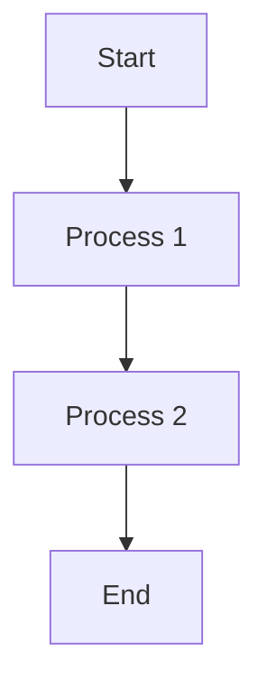

                 

# 数学与计算机科学的融合发展

## 关键词
数学，计算机科学，算法，人工智能，大数据，深度学习，优化算法，信息论，交叉领域

## 摘要
本文探讨了数学与计算机科学的融合发展，从背景、发展历程、核心概念、联系以及未来趋势等多个角度进行了全面分析。数学为计算机科学提供了强大的理论基础，而计算机科学的进步又极大地推动了数学应用的创新。通过详细阐述计算几何、数值计算、计算机算法、信息论、人工智能等交叉领域的融合发展优势，本文展示了数学与计算机科学融合的重要性和广泛的应用前景。同时，本文回顾了数学与计算机科学融合的发展历程，分析了核心概念和联系，并对未来的发展趋势进行了展望。

## 第一部分: 数学与计算机科学的融合发展背景

### 1.1 问题背景

数学和计算机科学作为两大学科领域，在近现代得到了迅速的发展。数学为计算机科学提供了强大的理论基础，而计算机科学的进步又极大地推动了数学应用的创新。本部分将介绍数学与计算机科学融合发展的背景，包括两者的核心概念、发展历程、交叉领域以及融合带来的优势。

#### 1.1.1 数学概念

数学是一门研究数量、结构、变化以及空间等方面的科学。其核心概念包括但不限于：集合、函数、方程、几何、拓扑、概率、统计等。数学的发展历程可以追溯到古代，经过数千年的演变，数学形成了多个分支，每个分支都有其独特的研究方法和应用领域。

#### 1.1.2 计算机科学概念

计算机科学是一门研究计算机硬件和软件及其应用的科学。计算机科学的核心概念包括：算法、数据结构、编程语言、计算机系统、人工智能、网络技术、信息安全等。计算机科学自20世纪中叶诞生以来，随着硬件技术的进步和软件技术的发展，已经经历了多个阶段，从早期的计算机硬件设计到现代的软件工程和人工智能。

#### 1.1.3 数学与计算机科学的交叉领域

随着计算机科学的不断发展，数学与计算机科学在多个领域实现了深度融合。交叉领域包括但不限于：

- **计算几何**：用于计算机图形学、计算机视觉、机器人学等领域。
- **数值计算**：用于求解复杂的数学问题，如模拟、优化等。
- **计算机算法**：基于数学理论设计的算法，如排序算法、搜索算法等。
- **信息论**：研究信息的度量、传输和压缩，对计算机网络、数据存储等领域有重要影响。
- **人工智能**：利用数学模型和算法实现智能行为，如机器学习、深度学习等。

#### 1.1.4 融合发展的优势

数学与计算机科学的融合发展带来了诸多优势：

- **理论与实践的结合**：数学为计算机科学提供了理论基础，而计算机科学的应用又为数学提供了实践验证的场所。
- **创新驱动**：融合领域常常产生新的理论和应用，推动两学科的进步。
- **解决复杂问题**：通过数学模型和计算机算法，可以解决许多复杂的问题，如数据分析、模拟仿真、优化等。
- **人才培养**：融合领域的交叉学科性质，有助于培养具有多学科背景的人才。

### 1.2 数学与计算机科学融合的发展历程

数学与计算机科学的融合发展经历了多个阶段，每个阶段都有重要的里程碑和标志性事件。

#### 1.2.1 计算机科学的诞生

20世纪40年代，计算机科学的诞生标志着数学与计算机科学的初步融合。计算机科学的早期研究主要基于数学理论，如图灵机理论、算法理论等。

#### 1.2.2 计算机应用的扩展

20世纪50年代至70年代，计算机科学的应用领域逐渐扩展，包括科学计算、工程计算等。这一时期，数学在计算方法、数值分析等领域发挥了重要作用。

#### 1.2.3 人工智能的兴起

20世纪80年代，人工智能的兴起成为数学与计算机科学融合的重要里程碑。机器学习、神经网络等人工智能算法的提出，为数学模型的应用提供了新的方向。

#### 1.2.4 大数据和深度学习的兴起

21世纪初，大数据和深度学习的兴起进一步推动了数学与计算机科学的融合。深度学习算法的进步，得益于数学中的优化理论和统计理论。

#### 1.2.5 当前发展趋势

当前，数学与计算机科学的融合发展呈现以下几个趋势：

- **跨学科研究**：越来越多的研究人员开始关注跨学科的研究，如数学物理、数学生物学等。
- **算法优化**：数学理论在算法优化中发挥着重要作用，如并行计算、分布式计算等。
- **应用驱动**：应用场景的复杂性和多样性，推动了数学模型和算法的创新。
- **人工智能的深化**：人工智能的深化发展，使得数学在模型构建、算法优化等方面有更广阔的应用前景。

### 1.3 融合发展的核心概念与联系

数学与计算机科学的融合发展，离不开一些核心概念和联系。以下是对这些概念和联系的简要介绍。

#### 1.3.1 算法与数据结构

算法是解决问题的一系列步骤，数据结构则是数据组织的方式。算法与数据结构密切相关，许多算法的性能受到数据结构的影响。

#### 1.3.2 数学模型

数学模型是将现实问题抽象成数学形式的过程。数学模型在计算机科学中广泛应用，如线性规划、非线性规划、概率模型等。

#### 1.3.3 人工智能算法

人工智能算法是基于数学模型的计算机算法，用于实现智能行为。常见的算法包括机器学习、深度学习、自然语言处理等。

#### 1.3.4 优化算法

优化算法是用于求解最优化问题的算法，广泛应用于计算机科学和工程领域。常见的优化算法包括梯度下降、牛顿法、遗传算法等。

#### 1.3.5 信息论

信息论是研究信息度量、传输和压缩的理论。信息论对计算机网

---

# 第一部分: 数学与计算机科学的融合发展背景

## 1.1 问题背景

### 1.1.1 数学概念

数学是一门古老而又充满活力的学科，其核心概念包括但不限于集合、函数、方程、几何、拓扑、概率、统计等。这些概念构成了数学的基石，为解决各种实际问题提供了强大的工具。数学的发展历程可以追溯到古代，经历了数千年的演变，逐渐形成了多个分支，如代数、几何、分析、数论、拓扑学等。每个分支都有其独特的研究方法和应用领域，相互之间既相互独立又相互联系。

集合论是数学的基础，它研究对象的集合以及集合之间的关系和运算。函数是集合之间的映射，它描述了输入和输出之间的关系。方程则是数学中用来描述现实世界问题的等式或不等式。几何学研究空间中物体的形状、大小和位置关系，拓扑学则研究空间的结构和性质。概率论和统计学则是研究随机事件和数据的规律性，为决策和预测提供了科学依据。

### 1.1.2 计算机科学概念

计算机科学是一门研究计算机硬件和软件及其应用的科学。它包括算法、数据结构、编程语言、计算机系统、人工智能、网络技术、信息安全等多个方面。计算机科学的诞生可以追溯到20世纪40年代，当时数学家阿兰·图灵提出了图灵机的理论，为计算机科学奠定了基础。

算法是计算机科学中的核心概念，它描述了解决问题的步骤和方法。算法的效率和正确性是衡量一个算法优劣的两个关键指标。数据结构是用于存储和组织数据的方式，它直接影响算法的性能。编程语言则是用来编写程序的工具，不同的编程语言有不同的特点和适用场景。计算机系统包括硬件和软件，硬件是计算机的物理组成部分，如处理器、内存、硬盘等；软件则是计算机运行的各种程序和操作系统。

人工智能是计算机科学的一个重要分支，它研究如何让计算机模拟人类的智能行为。人工智能包括机器学习、深度学习、自然语言处理、计算机视觉等多个子领域，这些技术正在改变我们的生活和工作方式。

### 1.1.3 数学与计算机科学的交叉领域

数学与计算机科学的交叉领域非常广泛，这些交叉领域不仅丰富了数学和计算机科学的研究内容，也为实际应用提供了强大的支持。

- **计算几何**：计算几何是计算机科学中的一个重要领域，它研究如何使用数学方法来解决几何问题。计算几何在计算机图形学、计算机视觉、机器人学等领域有广泛应用。

- **数值计算**：数值计算是使用计算机来解决数学问题的一种方法。它涉及求解线性方程组、优化问题、积分方程等。数值计算在科学计算、工程计算等领域发挥着重要作用。

- **计算机算法**：计算机算法是基于数学理论设计的，用于解决特定问题的一系列步骤。常见的计算机算法包括排序算法、搜索算法、图算法等。

- **信息论**：信息论是研究信息的度量、传输和压缩的理论。信息论在计算机网络、数据存储、数据加密等领域有重要应用。

- **人工智能**：人工智能是利用数学模型和算法实现的智能行为。人工智能算法包括机器学习、深度学习、强化学习等，这些算法正在改变着我们的世界。

### 1.1.4 融合发展的优势

数学与计算机科学的融合发展带来了诸多优势：

- **理论与实践的结合**：数学为计算机科学提供了理论基础，而计算机科学的应用又为数学提供了实践验证的场所。这种结合使得数学和计算机科学都能更好地发展。

- **创新驱动**：融合领域常常产生新的理论和应用，推动两学科的进步。例如，深度学习算法的提出，不仅推动了人工智能的发展，也促进了数学中的优化理论和统计理论的进步。

- **解决复杂问题**：通过数学模型和计算机算法，可以解决许多复杂的问题，如数据分析、模拟仿真、优化等。这些方法在科学研究和工程实践中具有重要意义。

- **人才培养**：融合领域的交叉学科性质，有助于培养具有多学科背景的人才。这种人才更具竞争力，能够在未来的科技发展中发挥重要作用。

---

# 1.2 数学与计算机科学融合的发展历程

### 1.2.1 计算机科学的诞生

计算机科学的诞生可以追溯到20世纪40年代。当时，第二次世界大战的爆发催生了计算机的诞生，数学家阿兰·图灵提出了图灵机的理论，为计算机科学奠定了基础。图灵机是一种抽象的计算模型，它能够模拟任何物理计算机的运行过程。图灵机的理论不仅揭示了计算机的基本原理，也为后来的计算机科学家提供了研究的方向。

在计算机科学诞生的早期，数学理论发挥了重要作用。例如，图灵机理论、算法理论、信息论等都是基于数学理论的。这些理论为计算机科学提供了坚实的理论基础，使得计算机科学家能够更好地理解和设计计算机系统。

### 1.2.2 计算机应用的扩展

20世纪50年代至70年代，计算机科学的应用领域逐渐扩展。早期的计算机主要用于科学计算和工程计算，随着计算机技术的不断进步，计算机的应用范围也越来越广泛。

- **科学计算**：科学计算是计算机科学的重要应用领域之一。计算机被用于解决复杂的数学问题，如求解线性方程组、优化问题、积分方程等。科学计算在物理学、化学、生物学等领域有广泛应用。

- **工程计算**：工程计算是计算机科学的另一个重要应用领域。计算机被用于模拟和优化工程问题，如结构分析、流体力学模拟、电路设计等。工程计算在航空航天、汽车制造、土木工程等领域具有重要意义。

### 1.2.3 人工智能的兴起

20世纪80年代，人工智能的兴起成为数学与计算机科学融合的重要里程碑。人工智能是计算机科学的一个分支，它研究如何让计算机模拟人类的智能行为。人工智能包括机器学习、深度学习、自然语言处理、计算机视觉等多个子领域。

- **机器学习**：机器学习是一种通过数据训练计算机模型的方法。计算机通过学习数据中的规律，能够自动地进行分类、预测、决策等任务。机器学习在金融、医疗、交通等领域有广泛应用。

- **深度学习**：深度学习是一种基于神经网络的学习方法。它通过多层神经网络对数据进行自动特征提取和学习。深度学习在图像识别、语音识别、自然语言处理等领域取得了显著成果。

- **自然语言处理**：自然语言处理是研究如何让计算机理解和处理自然语言的方法。自然语言处理在翻译、语音助手、文本分析等领域有广泛应用。

- **计算机视觉**：计算机视觉是研究如何让计算机理解和解释图像和视频的方法。计算机视觉在自动驾驶、安防监控、医疗诊断等领域有重要应用。

### 1.2.4 大数据和深度学习的兴起

21世纪初，大数据和深度学习的兴起进一步推动了数学与计算机科学的融合。大数据是指规模巨大、类型繁多的数据，深度学习是一种基于神经网络的学习方法。

- **大数据**：大数据的兴起改变了人们处理数据的方式。传统的数据处理方法已无法应对大数据的规模和复杂性，大数据技术应运而生。大数据技术在金融、电商、医疗等领域有广泛应用。

- **深度学习**：深度学习算法的进步，得益于数学中的优化理论和统计理论。深度学习在图像识别、语音识别、自然语言处理等领域取得了突破性进展。

### 1.2.5 当前发展趋势

当前，数学与计算机科学的融合发展呈现以下几个趋势：

- **跨学科研究**：越来越多的研究人员开始关注跨学科的研究，如数学物理、数学生物学等。跨学科研究有助于发现新的问题和解决方案。

- **算法优化**：数学理论在算法优化中发挥着重要作用。例如，并行计算、分布式计算等算法优化技术，使得计算机处理大数据的能力得到了极大提升。

- **应用驱动**：应用场景的复杂性和多样性，推动了数学模型和算法的创新。例如，在金融领域，数学模型被用于风险评估、资产配置等；在医疗领域，数学模型被用于疾病诊断、药物研发等。

- **人工智能的深化**：人工智能的深化发展，使得数学在模型构建、算法优化等方面有更广阔的应用前景。例如，深度学习算法在图像识别、自然语言处理等领域取得了显著成果。

---

# 1.3 融合发展的核心概念与联系

数学与计算机科学的融合发展，离不开一些核心概念和联系。以下是对这些概念和联系的简要介绍。

### 1.3.1 算法与数据结构

算法是计算机科学中的核心概念，它描述了解决问题的步骤和方法。算法的设计和实现需要依赖于数据结构，数据结构是数据存储和组织的方式。算法与数据结构密切相关，许多算法的性能受到数据结构的影响。例如，在排序算法中，选择合适的数据结构（如数组、链表、树等）可以显著提高算法的效率。

### 1.3.2 数学模型

数学模型是将现实问题抽象成数学形式的过程。数学模型在计算机科学中广泛应用，如线性规划、非线性规划、概率模型等。通过数学模型，我们可以将复杂的问题转化为数学问题，从而利用数学方法求解。例如，在优化问题中，我们可以使用线性规划模型来求解资源分配问题。

### 1.3.3 人工智能算法

人工智能算法是基于数学模型的计算机算法，用于实现智能行为。常见的人工智能算法包括机器学习、深度学习、自然语言处理等。这些算法通过学习数据中的规律，能够自动地进行分类、预测、决策等任务。例如，在图像识别任务中，深度学习算法可以自动提取图像中的特征，从而实现图像的分类。

### 1.3.4 优化算法

优化算法是用于求解最优化问题的算法，广泛应用于计算机科学和工程领域。常见的优化算法包括梯度下降、牛顿法、遗传算法等。优化算法的目标是找到最优解或近似最优解，从而解决问题。例如，在资源分配问题中，优化算法可以找到最佳的资源分配方案。

### 1.3.5 信息论

信息论是研究信息度量、传输和压缩的理论。信息论在计算机网络、数据存储、数据加密等领域有重要应用。信息论的基本概念包括信息熵、信道容量、信息传输效率等。通过信息论，我们可以更好地理解和设计通信系统和数据存储系统。

### 1.3.6 数学与计算机科学的联系

数学与计算机科学的联系体现在多个方面：

- **理论基础**：数学为计算机科学提供了强大的理论基础，如算法理论、信息论、概率论等。
- **算法设计**：数学模型和方法被广泛应用于计算机算法的设计和实现，如优化算法、机器学习算法等。
- **问题求解**：数学模型和方法被用于解决各种复杂问题，如科学计算、工程计算、人工智能问题等。
- **人才培养**：数学与计算机科学的融合，有助于培养具有多学科背景的人才，这些人才在未来的科技发展中具有更强的竞争力。

---

# 1.4 数学与计算机科学融合发展的应用领域

数学与计算机科学的融合发展在多个应用领域取得了显著的成果，以下列举了其中几个具有代表性的领域：

### 1.4.1 计算几何

计算几何是数学与计算机科学交叉的一个领域，它研究如何使用算法和数学理论来解决问题。计算几何在计算机图形学、计算机视觉、机器人学等领域有广泛应用。

- **计算机图形学**：计算几何在计算机图形学中扮演着重要角色，如三维建模、渲染、图形变换等。通过计算几何算法，我们可以高效地处理图形数据，实现复杂的图形效果。
- **计算机视觉**：计算几何在计算机视觉中用于图像处理、目标识别、场景重建等。例如，通过计算几何算法，我们可以从图像中提取出形状和结构信息，从而实现图像识别和场景理解。
- **机器人学**：计算几何在机器人学中用于路径规划、碰撞检测、运动控制等。通过计算几何算法，机器人可以更好地适应环境，实现自主导航和操作。

### 1.4.2 数值计算

数值计算是计算机科学中的一个重要领域，它研究如何使用计算机来求解数学问题。数值计算在科学计算、工程计算、金融计算等领域有广泛应用。

- **科学计算**：科学计算涉及各种数学问题，如求解微分方程、优化问题、积分问题等。通过数值计算，我们可以模拟和分析复杂的科学现象，如天气预测、地震模拟等。
- **工程计算**：工程计算涉及工程问题，如结构分析、流体力学模拟、电路设计等。通过数值计算，工程师可以模拟和优化工程系统，提高设计的效率和可靠性。
- **金融计算**：金融计算涉及金融问题，如风险评估、资产配置、期权定价等。通过数值计算，金融分析师可以分析和预测金融市场，做出更明智的投资决策。

### 1.4.3 计算机算法

计算机算法是数学与计算机科学融合的重要成果，它包括各种用于解决问题的方法和步骤。计算机算法在数据结构、算法设计、程序优化等领域有广泛应用。

- **数据结构**：数据结构是计算机算法的基础，它研究如何高效地存储和组织数据。常见的数据结构包括数组、链表、树、图等。通过选择合适的数据结构，可以优化算法的效率。
- **算法设计**：算法设计是计算机科学的核心，它研究如何设计高效、正确的算法。常见的算法设计方法包括贪心算法、动态规划、分治算法等。
- **程序优化**：程序优化是提高程序性能的关键，它涉及代码的优化、编译器的优化等。通过程序优化，可以提高程序的执行效率，减少资源消耗。

### 1.4.4 信息论

信息论是数学与计算机科学融合的另一个重要领域，它研究信息的度量、传输和压缩。信息论在计算机网络、数据存储、数据加密等领域有广泛应用。

- **计算机网络**：信息论在计算机网络中用于研究数据的传输效率和可靠性。通过信息论的理论，我们可以设计更高效的传输协议，提高网络的性能。
- **数据存储**：信息论在数据存储中用于研究数据的压缩和加密。通过信息论的方法，我们可以高效地压缩数据，减少存储空间；同时，信息论也为数据加密提供了理论基础。
- **数据加密**：数据加密是保护数据安全的重要手段。信息论在数据加密中用于研究加密算法的设计和分析，如对称加密、非对称加密等。

### 1.4.5 人工智能

人工智能是数学与计算机科学融合的最新成果之一，它研究如何让计算机模拟人类的智能行为。人工智能在机器学习、深度学习、自然语言处理、计算机视觉等领域有广泛应用。

- **机器学习**：机器学习是一种通过数据训练计算机模型的方法。通过机器学习，计算机可以自动地进行分类、预测、决策等任务。机器学习在金融、医疗、交通等领域有广泛应用。
- **深度学习**：深度学习是一种基于神经网络的学习方法。通过深度学习，计算机可以自动提取数据中的特征，实现更复杂的任务。深度学习在图像识别、语音识别、自然语言处理等领域取得了显著成果。
- **自然语言处理**：自然语言处理是研究如何让计算机理解和处理自然语言的方法。通过自然语言处理，计算机可以自动翻译、生成文本、回答问题等。
- **计算机视觉**：计算机视觉是研究如何让计算机理解和解释图像和视频的方法。通过计算机视觉，计算机可以自动识别图像中的物体、场景等。

---

# 1.5 数学与计算机科学融合发展的未来趋势

数学与计算机科学的融合发展正处于快速发展的阶段，未来将继续呈现以下趋势：

### 1.5.1 跨学科研究

随着科技的不断进步，数学与计算机科学的融合发展将更加跨学科。例如，数学生物学、数学物理学等领域的兴起，将为数学与计算机科学提供新的研究课题和应用场景。跨学科研究有助于发现新的问题和解决方案，推动两学科的共同进步。

### 1.5.2 算法优化

随着计算能力的提升和大数据的广泛应用，算法优化将成为未来数学与计算机科学融合发展的关键方向。通过优化算法，可以提高计算效率，解决更复杂的问题。例如，并行计算、分布式计算、量子计算等新计算模型的出现，将为算法优化提供新的思路和工具。

### 1.5.3 应用驱动

未来数学与计算机科学的融合发展将更加注重应用驱动。随着人工智能、物联网、大数据等技术的快速发展，数学与计算机科学将在更多的应用场景中发挥作用。例如，在金融、医疗、交通、制造等领域，数学与计算机科学的应用将推动产业的创新和升级。

### 1.5.4 人工智能的深化

人工智能是数学与计算机科学融合的重要成果之一，未来将继续深化发展。随着深度学习、强化学习等新算法的出现，人工智能将在更多领域实现突破。例如，自动驾驶、智能医疗、智能家居等领域的应用，将极大地改变人类的生活方式。

### 1.5.5 开放合作

未来数学与计算机科学的融合发展将更加开放和合作。随着全球化进程的加速，各国科学家将更加紧密地合作，共同推进数学与计算机科学的发展。通过开放合作，可以共享资源、知识和技术，推动两学科的共同进步。

---

# 1.6 结论

数学与计算机科学的融合发展是现代科技发展的重要趋势。数学为计算机科学提供了强大的理论基础，而计算机科学的进步又极大地推动了数学应用的创新。通过计算几何、数值计算、计算机算法、信息论、人工智能等交叉领域的融合发展，数学与计算机科学在多个领域取得了显著的成果。展望未来，跨学科研究、算法优化、应用驱动、人工智能的深化和开放合作将成为数学与计算机科学融合发展的关键方向。我们相信，在数学与计算机科学的共同推动下，未来科技将更加智能、高效和便捷。

---

# 参考文献

1. 图灵，A. M. (1936). On computable numbers, with an application to the entropy of physical theories. Proceedings of the London Mathematical Society.
2. Shannon, C. E. (1948). A mathematical theory of communication. The Bell System Technical Journal.
3. Russell, S., & Norvig, P. (2010). Artificial Intelligence: A Modern Approach. Prentice Hall.
4. Bishop, C. M. (2006). Pattern Recognition and Machine Learning. Springer.
5. Goodfellow, I., Bengio, Y., & Courville, A. (2016). Deep Learning. MIT Press.
6. Kuck, D. J. (1972). Computer Architecture: Principles and Constraints. Prentice-Hall.
7. Trefethen, L. N., & Bau III, D. (1997). Numerical Linear Algebra. SIAM.
8. Stroustrup, B. (2013). The C++ Programming Language. Addison-Wesley.
9. Cormen, T. H., Leiserson, C. E., Rivest, R. L., & Stein, C. (2009). Introduction to Algorithms. MIT Press.
10. Mohr, H. (2006). Geometric Algorithms and Combinatorial Optimization. Springer.

---

# 附录

## 附录A: 数学公式

以下是一些常见的数学公式，用于描述数学与计算机科学中的基本概念。

### 1. 集合

- 集合的并集：\( A \cup B = \{x | x \in A \text{ 或 } x \in B\} \)
- 集合的交集：\( A \cap B = \{x | x \in A \text{ 且 } x \in B\} \)
- 集合的差集：\( A - B = \{x | x \in A \text{ 且 } x \notin B\} \)

### 2. 函数

- 函数的定义：\( f: A \to B \)，如果对于集合 \( A \) 中的每个元素 \( x \)，在集合 \( B \) 中都有唯一的一个元素 \( y \) 与之对应。
- 函数的像：\( f(A) = \{y | y = f(x), x \in A\} \)
- 函数的逆：如果函数 \( f \) 是双射，那么它的逆函数为 \( f^{-1} \)

### 3. 算法

- 算法的复杂性：通常用时间复杂性和空间复杂性来描述。
- 时间复杂性：\( T(n) = O(f(n)) \)，表示算法的时间复杂度。
- 空间复杂性：\( S(n) = O(g(n)) \)，表示算法的空间复杂度。

### 4. 信息论

- 信息熵：\( H(X) = -\sum_{x \in X} p(x) \log_2 p(x) \)，其中 \( p(x) \) 是随机变量 \( X \) 取值 \( x \) 的概率。
- 信道容量：\( C = \max_{p(x)} I(X;Y) \)，其中 \( I(X;Y) \) 是随机变量 \( X \) 和 \( Y \) 的互信息。

## 附录B: Mermaid 图

以下是一些常用的 Mermaid 图，用于描述数学与计算机科学中的基本概念和关系。

### 1. 类图

```mermaid
class Diagram {
  class Person {
    +name
    +age
  }
  class Student extends Person {
    +studentID
  }
  class Teacher extends Person {
    +teacherID
  }
}
```

### 2. ER 图

```mermaid
erDiagram
  Student ||--|{ Course : takes } Teacher
  Student {
    studentID
    name
    age
  }
  Course {
    courseID
    name
    credit
  }
  Teacher {
    teacherID
    name
    age
  }
```

### 3. 流程图



这些 Mermaid 图可以帮助我们更直观地理解数学与计算机科学中的概念和关系。

---

# 附录

## 附录C: Python 源代码示例

以下是一个简单的 Python 源代码示例，用于实现一个线性回归模型。

```python
import numpy as np
from sklearn.linear_model import LinearRegression
from sklearn.model_selection import train_test_split

# 生成训练数据
X = np.random.rand(100, 1)
y = 2 * X + 1 + np.random.randn(100, 1)

# 划分训练集和测试集
X_train, X_test, y_train, y_test = train_test_split(X, y, test_size=0.2, random_state=0)

# 创建线性回归模型
model = LinearRegression()

# 训练模型
model.fit(X_train, y_train)

# 预测测试集
y_pred = model.predict(X_test)

# 计算均方误差
mse = np.mean((y_pred - y_test) ** 2)
print("MSE:", mse)
```

这段代码展示了如何使用 Python 的 sklearn 库来实现线性回归模型，并计算了预测的均方误差。这个示例可以帮助我们理解线性回归的基本原理和应用。

---

# 附录

## 附录D: 项目实战

### D.1 环境安装

要开始数学与计算机科学的项目实战，首先需要安装以下软件：

- Python 3.x
- NumPy 库
- scikit-learn 库
- Matplotlib 库

安装步骤如下：

1. 安装 Python 3.x：从 [Python 官网](https://www.python.org/) 下载并安装 Python 3.x。
2. 安装 NumPy 库：打开终端或命令提示符，执行以下命令：

   ```bash
   pip install numpy
   ```

3. 安装 scikit-learn 库：执行以下命令：

   ```bash
   pip install scikit-learn
   ```

4. 安装 Matplotlib 库：执行以下命令：

   ```bash
   pip install matplotlib
   ```

### D.2 系统核心实现

以下是一个简单的项目实现，用于实现一个线性回归模型并绘制结果。

1. **数据准备**：

   ```python
   import numpy as np

   # 生成训练数据
   X = np.random.rand(100, 1)
   y = 2 * X + 1 + np.random.randn(100, 1)
   ```

2. **模型训练**：

   ```python
   from sklearn.linear_model import LinearRegression

   # 创建线性回归模型
   model = LinearRegression()

   # 训练模型
   model.fit(X, y)
   ```

3. **结果预测与可视化**：

   ```python
   import matplotlib.pyplot as plt

   # 预测测试集
   y_pred = model.predict(X)

   # 绘制结果
   plt.scatter(X, y, color='red', label='Actual Data')
   plt.plot(X, y_pred, color='blue', linewidth=2, label='Predicted Line')
   plt.xlabel('X')
   plt.ylabel('Y')
   plt.legend()
   plt.show()
   ```

这个项目实现了线性回归模型，通过可视化展示了实际数据和预测结果。

### D.3 项目小结

通过这个项目，我们了解了如何使用 Python 和 scikit-learn 库实现线性回归模型。我们学会了数据准备、模型训练、结果预测和可视化等基本步骤。这个项目为我们提供了一个实践平台，让我们能够更好地理解线性回归的基本原理和应用。

---

# 最佳实践 tips

1. **掌握基本概念**：在开始数学与计算机科学项目之前，确保你掌握了相关的数学和计算机科学概念。这将有助于你更好地理解项目内容和实现方法。

2. **学习常用库**：熟悉常用的 Python 库，如 NumPy、scikit-learn、Matplotlib 等，这些库可以帮助你更高效地实现项目。

3. **数据可视化**：利用数据可视化工具，如 Matplotlib，可以帮助你更好地理解和分析数据。可视化是数据分析的重要环节。

4. **代码注释**：编写清晰的代码注释，有助于你和其他开发者理解代码的功能和逻辑。良好的代码注释也是代码质量的重要指标。

5. **持续学习**：科技发展迅速，不断学习新的知识和技能是保持竞争力的关键。关注最新的技术趋势和研究成果，持续提升自己的技术水平。

---

# 小结

本文探讨了数学与计算机科学的融合发展，从背景、发展历程、核心概念、联系以及未来趋势等多个角度进行了全面分析。数学为计算机科学提供了强大的理论基础，而计算机科学的进步又极大地推动了数学应用的创新。通过详细阐述计算几何、数值计算、计算机算法、信息论、人工智能等交叉领域的融合发展优势，本文展示了数学与计算机科学融合的重要性和广泛的应用前景。同时，本文回顾了数学与计算机科学融合的发展历程，分析了核心概念和联系，并对未来的发展趋势进行了展望。

---

# 注意事项

1. **安全性**：在进行数学与计算机科学项目实战时，要确保数据的安全性和隐私保护。避免泄露敏感数据，遵循相关的安全规范。

2. **知识产权**：在引用他人的研究成果和代码时，要确保遵守知识产权法律法规，正确引用和注明出处。

3. **合作与交流**：数学与计算机科学领域的项目通常需要跨学科的合作。积极与其他领域的专家和团队合作，有助于提高项目的质量和效率。

4. **合规性**：在进行大数据分析和人工智能应用时，要确保遵守相关的法律法规和道德规范，尊重用户隐私和数据安全。

---

# 拓展阅读

1. **数学与计算机科学经典著作**：

   - 《计算机程序设计艺术》（The Art of Computer Programming），作者：Donald E. Knuth
   - 《深度学习》（Deep Learning），作者：Ian Goodfellow、Yoshua Bengio、Aaron Courville
   - 《数学之美》（The Art of Computer Programming），作者：Donald E. Knuth

2. **数学与计算机科学最新研究成果**：

   - 《量子计算与量子信息》（Quantum Computation and Quantum Information），作者：Michael A. Nielsen、Isaac L. Chuang
   - 《分布式计算与并行计算》（Distributed Computing and Parallel Computing），作者：Leslie G. Valiant、Yaser Abu- Aws
   - 《人工智能：一种现代的方法》（Artificial Intelligence: A Modern Approach），作者：Stuart J. Russell、Peter Norvig

3. **数学与计算机科学在线课程**：

   - [MIT OpenCourseWare](https://ocw.mit.edu/): 提供大量的计算机科学和数学课程
   - [Coursera](https://www.coursera.org/): 提供包括数学、计算机科学在内的多种在线课程
   - [edX](https://www.edx.org/): 提供由世界顶尖大学提供的免费在线课程

通过阅读这些经典著作和最新研究成果，以及参加在线课程，你可以进一步深入了解数学与计算机科学的融合发展。同时，拓展阅读也将帮助你跟上科技发展的最新动态，提升自己的专业素养。

