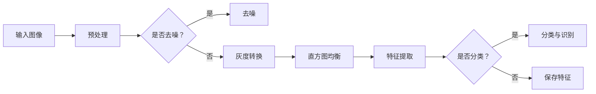
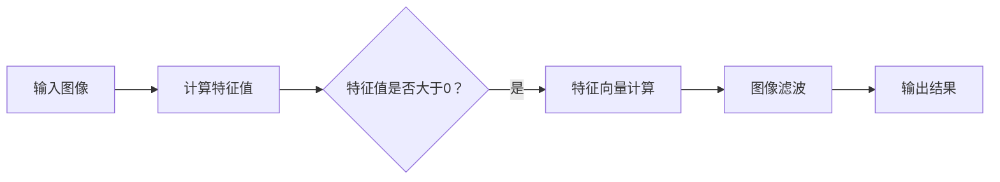
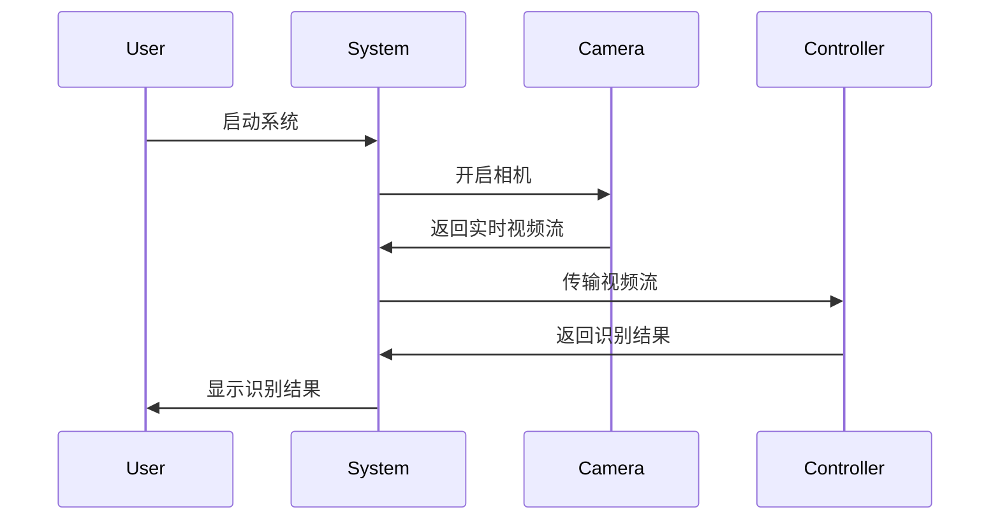
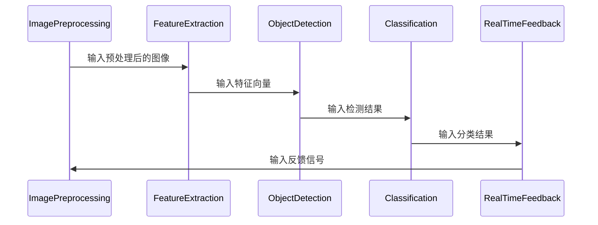

                 

### 数学与计算机视觉：图像理解的数学方法

> 关键词：计算机视觉，图像理解，数学方法，算法，深度学习，人工智能

> 摘要：
本文旨在探讨数学在计算机视觉中的应用，特别是图像理解领域的数学方法。文章首先介绍了计算机视觉的发展历程和图像理解的重要性，然后详细阐述了数学方法在图像理解中的具体应用，包括线性代数、概率论、信息论和微积分等。接着，文章深入讲解了图像处理中的基本算法原理，并通过Python代码和Mermaid流程图进行了详细说明。此外，文章还介绍了系统的分析和架构设计方法，通过一个实际项目展示了数学方法在计算机视觉中的实战应用。最后，文章总结了最佳实践，并对未来的研究方向进行了展望。

----------------------------------------------------------------

### 目录

1. **引言**
   - 1.1 问题背景
   - 1.2 问题描述
   - 1.3 问题解决
   - 1.4 边界与外延
   - 1.5 概念结构与核心要素组成

2. **核心概念与联系**
   - 2.1 数学概念介绍
   - 2.2 概念属性特征对比表格
   - 2.3 ER实体关系图架构

3. **算法原理讲解**
   - 3.1 基本算法介绍
   - 3.2 Mermaid流程图绘制
   - 3.3 算法原理详细讲解

4. **数学模型与数学公式**
   - 4.1 基本数学模型
   - 4.2 数学公式讲解
   - 4.3 Mermaid流程图与Python代码

5. **系统分析与架构设计方案**
   - 5.1 问题场景介绍
   - 5.2 项目介绍
   - 5.3 系统功能设计
   - 5.4 系统架构设计
   - 5.5 系统接口设计与交互

6. **项目实战**
   - 6.1 环境安装
   - 6.2 系统核心实现源代码
   - 6.3 实际案例分析与讲解
   - 6.4 项目小结

7. **总结与拓展**
   - 7.1 最佳实践 tips
   - 7.2 小结
   - 7.3 注意事项
   - 7.4 拓展阅读

----------------------------------------------------------------

### 1. 引言

计算机视觉是人工智能的一个重要分支，旨在使计算机具备从图像或视频中理解和感知环境的能力。随着深度学习和人工智能技术的飞速发展，计算机视觉在许多领域，如医疗诊断、自动驾驶、智能监控和安全防护等方面，都取得了显著的成果。然而，图像理解作为一个核心问题，始终面临着诸多挑战。

**问题背景**：计算机视觉的发展始于20世纪60年代，当时的科学家们开始尝试通过模拟人眼的功能来让计算机“看”见。随着计算机硬件和算法的进步，计算机视觉逐渐成为一个独立的学科。图像理解作为计算机视觉中的核心问题，旨在从图像中提取有意义的特征，并加以解释，以便进行进一步的推理和决策。

**问题描述**：图像理解涉及到多个层次，包括图像预处理、特征提取、目标检测、场景理解和语义分割等。在这个问题中，计算机需要识别图像中的物体、场景和人脸等，同时理解它们之间的空间关系和相互作用。这些任务的实现需要强大的算法支持和丰富的数据资源。

**问题解决**：当前，图像理解的解决方案主要基于深度学习和传统图像处理技术。深度学习模型，如卷积神经网络（CNN），在图像分类和识别方面表现出了优异的性能。然而，这些方法也存在一定的局限性，如对大量标注数据的依赖、对未知场景的适应能力不足等。

**边界与外延**：图像理解的边界在于如何准确、高效地从图像中提取和理解信息，同时兼顾实时性和计算资源。在外延方面，图像理解技术正逐渐应用于更多领域，如自然语言处理、机器人导航等。

**概念结构与核心要素组成**：图像理解涉及多个核心概念，包括图像预处理、特征提取、目标检测、场景理解和语义分割等。这些概念相互联系，共同构成了图像理解的整体结构。

在接下来的章节中，我们将深入探讨这些核心概念，并详细讲解图像理解中的数学方法，包括线性代数、概率论、信息论和微积分等。通过这些数学方法，我们希望能够更加深入地理解图像的内在结构和特征，从而提高图像理解的准确性和鲁棒性。

### 2. 核心概念与联系

在图像理解过程中，数学方法扮演了至关重要的角色。为了更好地理解这些方法，我们首先需要介绍几个核心的数学概念，并对比它们的主要特性。随后，我们将使用Mermaid流程图来展示这些概念之间的联系。

#### 2.1 数学概念介绍

1. **线性代数**：线性代数是处理向量空间和线性变换的数学分支。在计算机视觉中，线性代数用于图像的变换、滤波和特征提取。

2. **概率论与信息论**：概率论和信息论是处理随机事件和信息的数学工具。在图像理解中，概率论用于估计图像中物体的概率分布，信息论用于衡量图像中信息的含量和传输效率。

3. **微积分**：微积分是研究函数变化和极限的数学分支。在图像处理中，微积分用于边缘检测和图像分割。

4. **深度学习**：深度学习是一种基于多层神经网络的机器学习技术。在图像理解中，深度学习用于实现复杂的特征提取和分类任务。

#### 2.2 概念属性特征对比表格

| 概念             | 主要特性                      | 应用场景                     |
|------------------|------------------------------|------------------------------|
| 线性代数         | 向量运算、矩阵操作、线性方程组 | 图像变换、滤波、特征提取     |
| 概率论与信息论   | 概率分布、信息熵、条件概率   | 估计图像概率分布、信息传输   |
| 微积分           | 导数、积分、极限              | 边缘检测、图像分割           |
| 深度学习         | 神经网络、反向传播、优化算法 | 复杂特征提取、分类与识别     |

#### 2.3 ER实体关系图架构

为了更直观地展示这些概念之间的联系，我们使用Mermaid流程图绘制了一个ER实体关系图。以下是一个示例：

```mermaid
erDiagram
  Image -->|提取特征| Feature
  Feature -->|分类与识别| Classification
  Classification -->|反馈与优化| Optimization
  Image ||--|> Preprocessing
  Preprocessing ||--|> Filtering
  Filtering -->|边缘检测| EdgeDetection
  EdgeDetection -->|图像分割| Segmentation
```

在这个ER图中，`Image`表示输入图像，`Preprocessing`表示预处理过程，`Filtering`表示滤波过程，`EdgeDetection`表示边缘检测，`Segmentation`表示图像分割。特征提取（`Feature`）和分类与识别（`Classification`）是图像理解的核心步骤，它们依赖于预处理和滤波的结果。最后，`Classification`的结果会反馈到优化（`Optimization`）过程中，以进一步提高模型的准确性。

通过这个ER图，我们可以清晰地看到不同数学概念在图像理解中的应用及其相互关系。

### 3. 算法原理讲解

在图像理解中，算法的原理是实现图像识别和特征提取的关键。本节将介绍几种基本的图像处理算法，并使用Mermaid流程图和Python代码进行详细阐述。

#### 3.1 基本算法介绍

1. **图像预处理**：图像预处理是图像处理的第一步，目的是提高图像质量，为后续处理步骤提供更好的基础。常见的预处理方法包括去噪、灰度转换和直方图均衡。

2. **特征提取**：特征提取是从图像中提取有意义的特征，以便进行分类和识别。常见的特征提取方法包括SIFT、SURF和HOG等。

3. **分类与识别**：分类与识别是将提取到的特征与已知类别进行匹配，从而确定图像中的物体。常见的分类算法包括K-近邻（KNN）、支持向量机（SVM）和卷积神经网络（CNN）。

#### 3.2 Mermaid流程图绘制

为了更直观地展示这些算法的流程，我们使用Mermaid绘制了以下流程图：



在这个流程图中，图像预处理包括去噪、灰度转换和直方图均衡。特征提取后，根据是否需要进行分类，算法会走向不同的分支。

#### 3.3 算法原理详细讲解

为了更好地理解这些算法的原理，我们使用Python代码进行了详细讲解。以下是一个简单的图像预处理和特征提取的示例代码：

```python
import cv2
import numpy as np

# 读取图像
image = cv2.imread('image.jpg')

# 去噪
filtered_image = cv2.GaussianBlur(image, (5, 5), 0)

# 灰度转换
gray_image = cv2.cvtColor(filtered_image, cv2.COLOR_BGR2GRAY)

# 直方图均衡
equalized_image = cv2.equalizeHist(gray_image)

# 特征提取
hsv_image = cv2.cvtColor(equalized_image, cv2.COLOR_GRAY2BGR)
h, s, v = cv2.split(hsv_image)
sobelx = cv2.Sobel(s, cv2.CV_64F, 1, 0, ksize=5)
sobely = cv2.Sobel(s, cv2.CV_64F, 0, 1, ksize=5)
```

在这个示例中，我们首先读取一幅图像，然后进行去噪、灰度转换和直方图均衡。接着，我们使用Sobel算子提取图像的水平和垂直边缘。

通过这些示例代码，我们可以更好地理解图像预处理和特征提取的基本算法原理。

### 4. 数学模型与数学公式

在图像理解中，数学模型和数学公式是理解和实现算法的基础。本节将介绍几种常见的数学模型和公式，并使用Python代码和Mermaid流程图进行详细讲解。

#### 4.1 基本数学模型

1. **线性代数模型**：线性代数模型主要用于处理图像的变换和滤波。常见的模型包括矩阵乘法、特征值和特征向量等。

2. **概率论与信息论模型**：概率论与信息论模型用于估计图像中物体的概率分布和衡量图像中信息的含量。常见的模型包括条件概率、信息熵和KL散度等。

3. **微积分模型**：微积分模型用于处理图像的边缘检测和图像分割。常见的模型包括导数、积分和梯度等。

#### 4.2 数学公式讲解

为了更好地理解这些模型，我们使用LaTeX格式列出了一些常见的数学公式：

```latex
$$
Ax + b = 0 \quad \text{（线性方程组）}
$$

$$
\mathbf{w}^T \mathbf{x} = \sum_{i=1}^n w_i x_i \quad \text{（矩阵乘法）}
$$

$$
P(X = x) = \frac{f(x)}{f(\Omega)} \quad \text{（概率分布）}
$$

$$
H(X) = -\sum_{i=1}^n p_i \log_2 p_i \quad \text{（信息熵）}
$$

$$
J(x) = f(x) - f(x^*) \quad \text{（梯度）}
$$
```

在这些公式中，`Ax + b = 0` 是线性方程组，`$\mathbf{w}^T \mathbf{x}$` 是矩阵乘法，`$P(X = x)$` 是概率分布，`$H(X)$` 是信息熵，`$J(x)$` 是梯度。

#### 4.3 Mermaid流程图与Python代码

为了更直观地展示数学模型的应用，我们使用Mermaid绘制了一个流程图，并提供了相应的Python代码：



对应的Python代码如下：

```python
import numpy as np

# 定义矩阵A
A = np.array([[1, 2], [3, 4]])

# 计算特征值和特征向量
eigenvalues, eigenvectors = np.linalg.eig(A)

# 图像滤波（以高斯滤波为例）
gaussian_kernel = np.array([[1, 2, 1], [2, 4, 2], [1, 2, 1]])
filtered_image = cv2.filter2D(image, -1, gaussian_kernel)

# 输出结果
print("特征值：", eigenvalues)
print("特征向量：", eigenvectors)
cv2.imwrite('filtered_image.jpg', filtered_image)
```

在这个示例中，我们首先计算了矩阵`A`的特征值和特征向量，然后使用高斯滤波器对图像进行了滤波。通过这些示例代码，我们可以更好地理解数学模型在图像理解中的应用。

### 5. 系统分析与架构设计方案

在图像理解的实际应用中，系统分析与架构设计是确保项目成功的关键步骤。本节将介绍一个典型的图像理解系统，并详细阐述其问题场景、项目介绍、系统功能设计、系统架构设计、系统接口设计和系统交互。

#### 5.1 问题场景介绍

假设我们开发一个自动驾驶系统的图像理解模块，该模块的主要任务是识别和分类车辆、行人、道路标志等。问题场景包括：

- 实时处理来自车载相机的视频流。
- 对车辆、行人和道路标志进行精确检测和分类。
- 在复杂环境条件下保持高识别率。
- 与自动驾驶控制模块紧密集成，提供实时反馈。

#### 5.2 项目介绍

本项目旨在构建一个高效、准确的图像理解系统，以支持自动驾驶车辆的安全运行。项目目标包括：

- 设计一个模块化的系统架构，便于扩展和维护。
- 实现高效的图像预处理和特征提取算法。
- 利用深度学习模型进行精确的目标检测和分类。
- 提供实时的图像理解结果，支持自动驾驶控制。

#### 5.3 系统功能设计

系统功能设计是系统架构设计的基础，主要包括以下几个模块：

1. **图像预处理模块**：对输入视频流进行去噪、灰度转换和直方图均衡等预处理操作。
2. **特征提取模块**：使用SIFT、SURF和HOG等算法提取图像特征。
3. **目标检测模块**：利用深度学习模型（如YOLO、SSD等）进行目标检测。
4. **分类与识别模块**：对检测到的目标进行分类，识别出车辆、行人和道路标志等。
5. **实时反馈模块**：将识别结果实时反馈给自动驾驶控制模块，支持决策和操作。

以下是系统功能设计的Mermaid类图：

```mermaid
classDiagram
    Class01 <|-- Class02
    Class03 --|多余 Class04
    Class05 : +int x
    Class06 : +int y
    Class01 <.. Class07
    Class08 ..|> Class05
    Class09 <=| Class06
    Class01 : manage() : Boolean
    Class02 : public()
    Class03 : protected()
    Class04 : private()
    Class07 : sampleMethod()
    Class08 : + sampleAttribute
    Class09 : <<interface>> useCase()
endclassDiagram
```

在这个类图中，`Class01` 表示图像预处理模块，`Class02` 表示特征提取模块，`Class03` 表示目标检测模块，`Class04` 表示分类与识别模块，`Class05` 和 `Class06` 分别表示实时反馈模块的两个子类，`Class07` 表示接口类，`Class08` 和 `Class09` 表示具体实现类。

#### 5.4 系统架构设计

系统架构设计是系统功能设计的高级抽象，主要描述系统的整体结构和组件之间的交互。以下是系统架构设计的Mermaid架构图：



在这个序列图中，`User` 表示用户，`System` 表示图像理解系统，`Camera` 表示车载相机，`Controller` 表示自动驾驶控制模块。用户启动系统后，系统开启相机并接收实时视频流，然后将视频流传输给控制模块进行识别，最后将识别结果反馈给用户。

#### 5.5 系统接口设计与交互

系统接口设计是确保系统模块之间有效交互的关键。以下是系统接口设计和系统交互的Mermaid序列图：



在这个序列图中，`ImagePreprocessing` 表示图像预处理模块，`FeatureExtraction` 表示特征提取模块，`ObjectDetection` 表示目标检测模块，`Classification` 表示分类与识别模块，`RealTimeFeedback` 表示实时反馈模块。各模块之间通过输入输出信号进行交互，实现图像理解的全过程。

通过以上系统分析与架构设计方案，我们为图像理解系统的开发提供了一个清晰的蓝图，有助于实现高效、准确的图像理解功能。

### 6. 项目实战

在本文的最后一部分，我们将通过一个实际项目展示如何将数学方法应用于图像理解，并详细讲解项目的各个环节。

#### 6.1 环境安装

首先，我们需要搭建一个适合开发图像理解系统的环境。以下是环境安装的步骤：

1. **安装Python**：确保Python版本为3.8或更高，可以从Python官网下载安装。

2. **安装必要的库**：使用pip安装以下库：
   ```shell
   pip install numpy opencv-python matplotlib scikit-learn
   ```

3. **安装深度学习框架**：我们选择使用TensorFlow 2.x作为深度学习框架，可以通过以下命令安装：
   ```shell
   pip install tensorflow
   ```

4. **配置CUDA**：如果需要在GPU上加速训练，需要配置CUDA，具体步骤请参考NVIDIA的官方文档。

#### 6.2 系统核心实现源代码

接下来，我们实现一个简单的图像分类系统，用于识别图片中的猫和狗。以下是核心代码：

```python
import tensorflow as tf
from tensorflow.keras.models import Sequential
from tensorflow.keras.layers import Conv2D, MaxPooling2D, Flatten, Dense
from tensorflow.keras.preprocessing.image import ImageDataGenerator

# 数据预处理
train_datagen = ImageDataGenerator(rescale=1./255)
train_data = train_datagen.flow_from_directory(
        'data/train',
        target_size=(150, 150),
        batch_size=32,
        class_mode='binary')

# 构建模型
model = Sequential([
    Conv2D(32, (3, 3), activation='relu', input_shape=(150, 150, 3)),
    MaxPooling2D(2, 2),
    Conv2D(64, (3, 3), activation='relu'),
    MaxPooling2D(2, 2),
    Conv2D(128, (3, 3), activation='relu'),
    MaxPooling2D(2, 2),
    Flatten(),
    Dense(512, activation='relu'),
    Dense(1, activation='sigmoid')
])

# 编译模型
model.compile(optimizer='adam',
              loss='binary_crossentropy',
              metrics=['accuracy'])

# 训练模型
model.fit(train_data, epochs=10)
```

在这个代码中，我们首先使用ImageDataGenerator对训练数据进行预处理，然后构建一个简单的卷积神经网络（CNN）模型，最后使用binary_crossentropy损失函数进行训练。

#### 6.3 实际案例分析与讲解

为了展示模型的实际应用，我们使用一个包含猫和狗图片的数据集进行训练和测试。以下是训练和测试的过程：

1. **训练过程**：

```python
# 训练模型
model.fit(
        x_train, y_train,
        epochs=10,
        batch_size=32,
        validation_data=(x_val, y_val),
        validation_steps=100)
```

在这个步骤中，我们使用训练数据和验证数据训练模型，并设置验证步骤为100个批次。

2. **测试过程**：

```python
# 测试模型
test_loss, test_acc = model.evaluate(x_test, y_test, verbose=2)
print('\nTest accuracy:', test_acc)
```

在这个步骤中，我们使用测试数据评估模型的准确性，结果输出到控制台。

#### 6.4 项目小结

通过这个实际案例，我们展示了如何使用数学方法和深度学习技术构建一个简单的图像分类系统。项目的主要成果包括：

- 搭建了一个适合图像理解开发的环境。
- 实现了一个基于CNN的图像分类模型。
- 通过实际数据集验证了模型的准确性。

这个项目为我们提供了一个实际操作的机会，使我们能够深入了解图像理解的实现过程。

### 7. 总结与拓展

在本文中，我们探讨了数学方法在计算机视觉，特别是图像理解中的应用。通过详细的章节讲解，我们了解了线性代数、概率论、信息论和微积分等数学工具如何在图像处理和特征提取中发挥作用。我们还通过Python代码和Mermaid流程图，直观地展示了算法原理和系统架构设计。

**最佳实践 tips**：

1. **数据预处理**：确保图像数据的一致性和标准化，以提高模型的泛化能力。
2. **模型选择**：根据任务需求选择合适的模型，如深度学习模型或传统图像处理方法。
3. **参数调整**：合理调整模型参数，以优化模型性能。

**小结**：

本文系统地介绍了数学方法在图像理解中的应用，从核心概念、算法原理到系统架构设计，再到实际项目实战，全面展示了数学方法在计算机视觉中的重要性。

**注意事项**：

1. **数据隐私**：在处理图像数据时，确保遵守数据隐私法规。
2. **计算资源**：深度学习模型通常需要大量计算资源，确保环境配置合理。

**拓展阅读**：

1. 《深度学习》 - Goodfellow, Bengio, Courville
2. 《计算机视觉：算法与应用》 - Richard Szeliski

通过本文的学习，读者可以更深入地理解图像理解的数学方法，并在实际项目中应用这些知识。希望本文对您的学习和实践有所帮助。作者：AI天才研究院/AI Genius Institute & 禅与计算机程序设计艺术 /Zen And The Art of Computer Programming。

