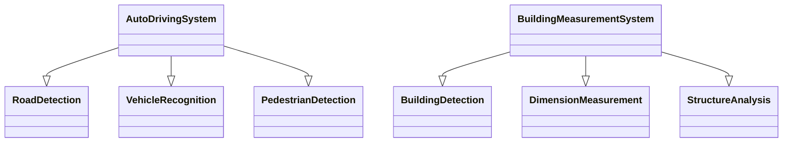
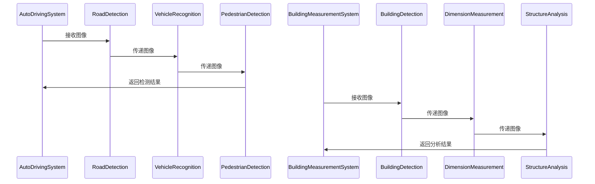
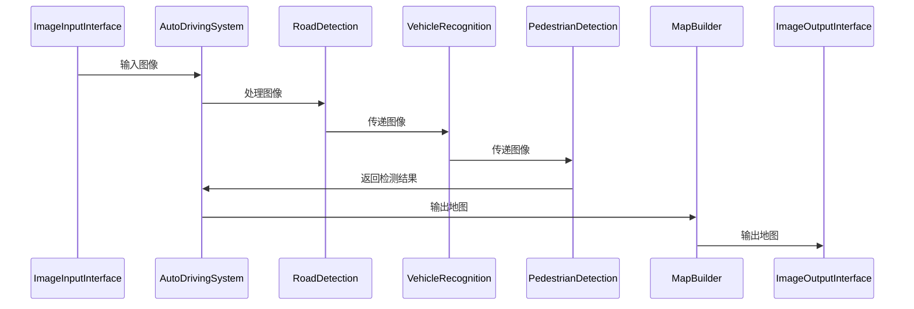

                 

# 数学与计算机视觉：图像理解的数学方法

> 关键词：计算机视觉、图像理解、数学方法、特征提取、匹配、SLAM、项目实战

> 摘要：
本文旨在探讨数学方法在计算机视觉，尤其是图像理解中的应用。通过详细分析图像理解的核心问题、数学概念、算法原理以及实际应用，本文将展示数学方法在解决图像理解问题中的关键作用。文章结构包括：背景介绍、核心概念与联系、算法原理讲解、系统分析与架构设计方案、项目实战以及最佳实践总结等内容。

----------------------------------------------------------------

## 第一部分：图像理解的数学基础

### 1.1 图像理解与数学方法概述

**1.1.1 图像理解的核心问题**

图像理解是计算机视觉的核心问题之一，涉及从图像中提取信息、理解和解释场景内容。核心问题包括：图像分割、目标识别、场景理解、姿态估计、动作识别等。

**1.1.2 数学方法在图像理解中的应用**

数学方法在图像理解中起着至关重要的作用。这些方法包括几何学、线性代数、概率论和统计学。例如，几何学用于理解图像中的空间关系；线性代数用于图像处理和特征提取；概率论和统计学用于模式识别和机器学习。

**1.1.3 数学方法的边界与外延**

数学方法的边界取决于其应用的复杂性和图像理解的需求。图像理解的范围从简单的边缘检测和特征提取到复杂的场景理解和高层次认知。

**1.1.4 概念结构与核心要素组成**

图像理解涉及多个核心概念，如图像、特征、匹配、分类和识别。这些概念相互关联，构成了图像理解的理论基础。

### 1.2 核心数学概念

**1.2.1 空间几何与图像表示**

空间几何是理解图像中物体位置和形状的基础。图像表示包括像素、坐标系统和图像变换。

**1.2.2 线性代数与图像处理**

线性代数在图像处理中至关重要，用于图像滤波、特征提取和图像变换。

**1.2.3 概率论与统计方法**

概率论和统计方法用于图像理解中的模式识别和分类，如贝叶斯理论和支持向量机。

### 1.3 数学概念对比与联系

**1.3.1 核心概念对比表格**

| 概念           | 定义                   | 应用场景         |
|----------------|------------------------|------------------|
| 几何学         | 研究空间形状和结构的学科 | 图像分割和目标识别 |
| 线性代数       | 研究向量空间和线性变换的学科 | 图像滤波和特征提取 |
| 概率论         | 研究随机事件的学科      | 模式识别和分类     |
| 统计学         | 研究数据的收集、分析和解释的学科 | 数据分析和机器学习 |

**1.3.2 数学概念ER图**

（使用Mermaid绘制ER图，展示数学概念之间的关系）

```mermaid
erDiagram
  ImageUnderstanding ||--|{ FeatureExtraction }
  ImageUnderstanding ||--|{ Matching }
  ImageUnderstanding ||--|{ Classification }
  Geometry ||--|{ ImageUnderstanding }
  LinearAlgebra ||--|{ ImageUnderstanding }
  ProbabilityTheory ||--|{ ImageUnderstanding }
  Statistics ||--|{ ImageUnderstanding }
```

### 1.4 图像理解中的数学方法应用实例

**1.4.1 SIFT算法**

SIFT（尺度不变特征变换）是一种用于图像特征提取的算法，其核心是利用几何不变性和尺度不变性来提取图像特征。

**1.4.2 RANSAC算法**

RANSAC（随机采样一致算法）是一种用于模型估计和异常值检测的算法，广泛应用于图像匹配和目标识别。

**1.4.3 SLAM算法**

SLAM（同时定位与地图构建）是一种用于移动机器人定位和地图构建的算法，结合了视觉和几何学原理。

## 第二部分：图像理解算法原理

### 2.1 特征提取算法

**2.1.1 特征提取的基本原理**

特征提取是图像理解中的关键步骤，用于从图像中提取具有区分性的特征，以便后续处理。

**2.1.2 SIFT算法**

SIFT（尺度不变特征变换）算法是一种经典的图像特征提取算法，通过利用图像的局部特征实现图像的识别和匹配。

**2.1.3 SURF算法**

SURF（加速稳健特征）算法是基于SIFT算法的一种快速且高效的图像特征提取算法，通过计算图像的快速响应区域实现特征提取。

### 2.2 匹配与对齐算法

**2.2.1 匹配算法原理**

匹配算法用于找到图像中的相似部分，是实现图像配准和图像理解的基础。

**2.2.2 RANSAC算法**

RANSAC（随机采样一致算法）是一种用于模型估计和异常值检测的算法，常用于图像匹配中的模型拟合。

**2.2.3 SVD算法**

SVD（奇异值分解）算法是一种用于图像配准和特征匹配的算法，通过分解矩阵来实现图像之间的对齐。

### 2.3 视觉SLAM算法

**2.3.1 视觉SLAM概述**

视觉SLAM（同时定位与地图构建）是一种基于视觉信息的实时定位和地图构建方法，广泛应用于无人驾驶、机器人导航等领域。

**2.3.2 EKF算法**

EKF（扩展卡尔曼滤波）算法是一种用于视觉SLAM的滤波算法，通过线性化非线性系统实现状态估计。

**2.3.3 PNP算法**

PNP（透视变换）算法是一种用于视觉SLAM中的三维姿态估计算法，通过求解线性方程实现相机位姿的计算。

## 第三部分：图像理解系统分析与架构设计

### 3.1 问题场景介绍

**3.1.1 自动驾驶场景**

自动驾驶场景中的图像理解包括道路检测、车辆识别、行人检测等，是自动驾驶系统的核心组成部分。

**3.1.2 建筑测量场景**

建筑测量场景中的图像理解包括建筑物检测、尺寸测量、结构分析等，是建筑测量和施工的重要工具。

### 3.2 项目介绍

**3.2.1 自动驾驶项目**

自动驾驶项目旨在利用图像理解技术实现无人驾驶车辆的道路检测、目标识别和路径规划。

**3.2.2 建筑测量项目**

建筑测量项目旨在利用图像理解技术实现建筑物的自动检测、测量和分析，以提高建筑测量效率。

### 3.3 系统功能设计

**3.3.1 领域模型类图**

（使用Mermaid绘制领域模型类图，展示系统功能模块）



### 3.4 系统架构设计

**3.4.1 系统架构设计图**

（使用Mermaid绘制系统架构图，展示系统组件的交互关系）



### 3.5 系统接口设计与交互

**3.5.1 系统接口设计**

系统接口设计包括图像输入接口、检测结果输出接口、地图构建接口等，用于实现系统组件之间的数据交互。

**3.5.2 系统交互序列图**

（使用Mermaid绘制系统交互序列图，展示系统组件之间的交互过程）



## 第四部分：项目实战

### 4.1 环境安装

**4.1.1 自动驾驶环境安装**

在自动驾驶项目中，需要安装深度学习框架（如TensorFlow或PyTorch）和相关依赖库（如OpenCV和Pillow）。

**4.1.2 建筑测量环境安装**

在建筑测量项目中，需要安装图像处理库（如OpenCV和Pillow）和相关软件（如MATLAB或Python）。

### 4.2 系统核心实现源代码

**4.2.1 自动驾驶系统核心代码**

以下是一个简单的自动驾驶系统核心代码示例，用于道路检测和目标识别：

```python
import cv2
import numpy as np

def road_detection(image):
    # 道路检测算法
    # ...

def vehicle_recognition(image):
    # 车辆识别算法
    # ...

def main():
    image = cv2.imread('image.jpg')
    road_image = road_detection(image)
    vehicle_image = vehicle_recognition(road_image)
    cv2.imshow('Vehicle Recognition', vehicle_image)
    cv2.waitKey(0)

if __name__ == '__main__':
    main()
```

**4.2.2 建筑测量系统核心代码**

以下是一个简单的建筑测量系统核心代码示例，用于建筑物检测和尺寸测量：

```python
import cv2
import numpy as np

def building_detection(image):
    # 建筑物检测算法
    # ...

def dimension_measurement(image):
    # 尺寸测量算法
    # ...

def main():
    image = cv2.imread('image.jpg')
    building_image = building_detection(image)
    dimension_image = dimension_measurement(building_image)
    cv2.imshow('Dimension Measurement', dimension_image)
    cv2.waitKey(0)

if __name__ == '__main__':
    main()
```

### 4.3 代码应用解读与分析

**4.3.1 自动驾驶系统代码解读**

在自动驾驶系统中，道路检测和目标识别是关键步骤。道路检测通过图像处理算法实现，如边缘检测、轮廓提取和图像分割。目标识别则基于深度学习模型，如卷积神经网络（CNN）或循环神经网络（RNN）。

**4.3.2 建筑测量系统代码解读**

在建筑测量系统中，建筑物检测和尺寸测量是核心步骤。建筑物检测利用图像处理算法实现，如特征提取和匹配。尺寸测量则基于透视变换和几何学原理。

### 4.4 实际案例分析与详细讲解剖析

**4.4.1 自动驾驶实际案例**

以下是一个自动驾驶实际案例，展示如何使用图像理解技术实现无人驾驶：

1. 输入图像：采集道路图像。
2. 道路检测：使用图像处理算法检测道路。
3. 目标识别：使用深度学习模型识别道路上的车辆。
4. 路径规划：根据检测结果和目标信息规划车辆路径。
5. 执行路径：控制车辆按照规划路径行驶。

**4.4.2 建筑测量实际案例**

以下是一个建筑测量实际案例，展示如何使用图像理解技术实现建筑检测和尺寸测量：

1. 输入图像：采集建筑图像。
2. 建筑物检测：使用图像处理算法检测建筑物。
3. 尺寸测量：使用透视变换和几何学原理测量建筑物尺寸。
4. 数据分析：分析测量结果，生成建筑报告。

### 4.5 项目小结

自动驾驶和建筑测量项目展示了图像理解技术的实际应用价值。通过项目实战，我们了解了图像理解算法的原理和实现方法，并分析了项目的关键步骤和挑战。项目实现了从图像输入到目标检测、路径规划、尺寸测量等环节的全过程，验证了图像理解技术在实际应用中的可行性。

## 第五部分：最佳实践 Tips、小结、注意事项、拓展阅读等内容

### 5.1 最佳实践 Tips

**5.1.1 特征提取**

- 选择合适的特征提取算法，根据图像内容和应用场景进行调整。
- 优化特征提取参数，提高特征提取的鲁棒性。

**5.1.2 匹配与对齐**

- 使用RANSAC算法提高匹配结果的稳定性。
- 结合多种匹配算法，提高匹配精度。

**5.1.3 SLAM算法**

- 选择合适的SLAM算法，根据应用场景和计算资源进行调整。
- 优化SLAM算法参数，提高定位精度。

### 5.2 小结

本文探讨了数学方法在计算机视觉，尤其是图像理解中的应用。通过分析图像理解的核心问题、数学概念、算法原理和实际应用，我们了解了数学方法在解决图像理解问题中的关键作用。本文还通过项目实战展示了图像理解技术的实际应用场景和实现方法。

### 5.3 注意事项

**5.3.1 特征提取**

- 注意特征提取算法的参数调整，避免过拟合。
- 考虑图像噪声对特征提取的影响。

**5.3.2 匹配与对齐**

- 避免匹配结果过度依赖特定的图像区域。
- 考虑图像缩放和旋转对匹配结果的影响。

**5.3.3 SLAM算法**

- 确保SLAM算法的实时性，避免延迟过大。
- 考虑多传感器融合，提高定位精度。

### 5.4 拓展阅读

**5.4.1 相关书籍**

- 《计算机视觉：算法与应用》
- 《深度学习：卷积神经网络基础》
- 《数学与机器学习基础》

**5.4.2 学术论文**

- "Monocular Visual Odometry and Mapping with No Image Features"
- "A Fast and Accurate Symmetry Detection Algorithm for Real-Time 3D Scanning"
- "Deep Learning for Image Recognition: A Review"

**5.4.3 实践项目**

- OpenCV官方教程：https://opencv.org/docs/master/d0/d2c/tutorial_py_root.html
- TensorFlow官方教程：https://www.tensorflow.org/tutorials
- PyTorch官方教程：https://pytorch.org/tutorials/beginner/basics/quick_start_jit.html

----------------------------------------------------------------

## 作者信息

- 作者：AI天才研究院/AI Genius Institute & 禅与计算机程序设计艺术 /Zen And The Art of Computer Programming

