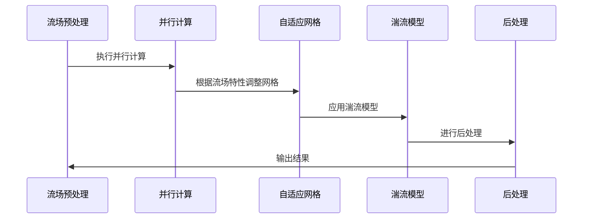

                 

### 数学与计算流体力学：流体运动的数学模拟

> 关键词：计算流体力学，数学模拟，流体运动，数值方法，数值求解，工程应用

> 摘要：本文将深入探讨计算流体力学（Computational Fluid Dynamics，CFD）的基本原理、数学模型及其在流体运动模拟中的应用。通过一步步分析，我们将了解CFD在现代工程与科学领域的重要性，以及如何利用数学和数值方法来模拟复杂的流体现象。

---

## 引言

计算流体力学（CFD）是研究流体运动和流体-结构相互作用的科学，它在航空航天、汽车工程、建筑环境、生物医学等多个领域有着广泛的应用。CFD的核心是利用数值方法来求解流体运动的基本方程，如纳维-斯托克斯方程（Navier-Stokes Equations）。这些方程描述了流体在力的作用下的运动规律，但它们的解析解通常很难获得，因此需要借助计算机进行数值模拟。

本文将从以下几个方面展开讨论：

1. **背景与核心概念**：介绍CFD的起源、发展及其在工程中的重要性。
2. **数学基础**：讲解CFD所需的数学工具，包括微积分、偏微分方程和线性代数。
3. **流体动力学原理**：阐述流体动力学的基本原理，如连续性方程、动量方程和能量方程。
4. **数值方法**：介绍常见的数值方法，如有限差分法、有限体积法和谱方法。
5. **计算技术**：探讨CFD中的先进计算技术，如并行计算、自适应网格和湍流模型。
6. **案例研究**：通过实际案例展示CFD的应用。
7. **结论与未来方向**：总结CFD的现状，并探讨其未来的发展趋势。

### 背景与核心概念

计算流体力学的发展可以追溯到20世纪中叶，当时计算机技术的快速发展为流体运动数值模拟提供了可能。CFD的起源可以追溯到1947年，当时John von Neumann提出了使用计算机进行流体运动数值模拟的思想。随着计算机硬件性能的提升和数值方法的不断发展，CFD逐渐成为一个独立的学科，并在工程和科学领域中得到广泛应用。

在CFD中，核心概念包括：

- **连续性方程**：描述流体质量守恒，通常表示为：
  $$ \frac{\partial \rho}{\partial t} + \nabla \cdot (\rho \mathbf{v}) = 0 $$
  其中，$\rho$ 是流体密度，$\mathbf{v}$ 是流速。

- **动量方程**：描述流体动量守恒，通常表示为：
  $$ \rho \left( \frac{\partial \mathbf{v}}{\partial t} + (\mathbf{v} \cdot \nabla) \mathbf{v} \right) = -\nabla p + \rho \mathbf{f} $$
  其中，$p$ 是压力，$\mathbf{f}$ 是流体所受的体积力。

- **能量方程**：描述流体能量守恒，通常表示为：
  $$ \rho c_p \left( \frac{\partial T}{\partial t} + \mathbf{v} \cdot \nabla T \right) = \nabla \cdot (k \nabla T) + \phi $$
  其中，$c_p$ 是流体比热容，$T$ 是温度，$k$ 是热导率，$\phi$ 是热源项。

这些方程构成了CFD的数学模型，但它们的解析解通常很难获得，因此需要采用数值方法进行求解。

### 数学基础

CFD的数学基础主要包括微积分、偏微分方程和线性代数。以下是这些数学工具的基本概念：

- **微积分**：微积分是研究函数变化的数学分支，包括微分和积分两个基本运算。在CFD中，微积分用于描述流体运动的速度、加速度和变化率。

  - **微分**：描述函数在某一点的局部变化率。例如，速度场中某点的切线斜率。
    $$ \frac{d\mathbf{v}}{dx} $$
  
  - **积分**：将函数在区间上的局部变化率累加起来，得到总的变化量。例如，计算流体的流量。
    $$ \int \rho \mathbf{v} \, dV $$

- **偏微分方程**：描述多变量函数的微分关系。在CFD中，纳维-斯托克斯方程和能量方程都是偏微分方程。

  - **偏导数**：表示函数对某一变量的偏导数。例如，压力对空间坐标的偏导数。
    $$ \frac{\partial p}{\partial x} $$

- **线性代数**：研究向量空间和线性变换的数学分支。在CFD中，线性代数用于求解线性方程组和矩阵运算。

  - **矩阵**：表示线性变换的数组。例如，描述流体运动的速度矩阵。
    $$ \mathbf{A} = \begin{bmatrix} a_{11} & a_{12} \\ a_{21} & a_{22} \end{bmatrix} $$

  - **向量**：表示空间中的点或方向。例如，描述流体的速度向量。
    $$ \mathbf{v} = \begin{bmatrix} v_x \\ v_y \end{bmatrix} $$

下面是一个数学概念的对比表格：

| 数学概念 | 描述 | CFD应用 |
| --- | --- | --- |
| 微分 | 函数局部变化率 | 计算流体速度场 |
| 积分 | 函数区间上累加变化率 | 计算流体流量 |
| 偏导数 | 函数对某一变量的偏导数 | 计算压力梯度 |
| 矩阵 | 线性变换表示 | 方程组求解 |
| 向量 | 空间中的点或方向 | 流体速度表示 |

通过这些数学工具，我们可以建立CFD的数学模型，并通过数值方法求解这些模型，从而模拟流体运动。

### 流体动力学原理

流体动力学是研究流体运动规律的科学，它是CFD的理论基础。流体动力学的基本原理包括连续性方程、动量方程和能量方程。下面我们将详细阐述这些原理。

#### 连续性方程

连续性方程描述了流体质量守恒，它是流体动力学的基本方程之一。该方程可以表示为：
$$ \frac{\partial \rho}{\partial t} + \nabla \cdot (\rho \mathbf{v}) = 0 $$

其中，$\rho$ 表示流体密度，$\mathbf{v}$ 表示流速。

连续性方程的几何意义在于：在任何固定时间内，通过任何固定面的流体质量流量必须守恒。这意味着流体在流动过程中不能产生或消失，只能从一个区域转移到另一个区域。

#### 动量方程

动量方程描述了流体动量守恒，它是描述流体运动的核心方程。该方程可以表示为：
$$ \rho \left( \frac{\partial \mathbf{v}}{\partial t} + (\mathbf{v} \cdot \nabla) \mathbf{v} \right) = -\nabla p + \rho \mathbf{f} $$

其中，$p$ 表示压力，$\mathbf{f}$ 表示流体所受的体积力。

动量方程的物理意义在于：流体在力的作用下会产生加速度，从而改变其速度和动量。压力和体积力的合力决定了流体的加速度。

#### 能量方程

能量方程描述了流体能量守恒，它是描述流体热力学性质的方程。该方程可以表示为：
$$ \rho c_p \left( \frac{\partial T}{\partial t} + \mathbf{v} \cdot \nabla T \right) = \nabla \cdot (k \nabla T) + \phi $$

其中，$c_p$ 表示流体比热容，$T$ 表示温度，$k$ 表示热导率，$\phi$ 表示热源项。

能量方程的物理意义在于：流体在流动过程中会进行能量转换，包括动能、势能和热能。热源项描述了流体内部的能量产生和消耗。

为了更直观地理解这些流体动力学原理，我们可以使用Mermaid ER图来展示它们之间的关系：

```mermaid
erDiagram
  A |||> B : has
  A |||> C : has
  A |||> D : has
  B |||> C : depends
  B |||> D : depends
  C |||> D : depends
  A --|> B: 连续性方程
  A --|> C: 动量方程
  A --|> D: 能量方程
  B --|> C: 压力
  B --|> D: 体积力
  C --|> D: 温度
```

这个ER图显示了连续性方程、动量方程和能量方程之间的关系，以及它们与压力、体积力和温度之间的联系。通过这个图，我们可以更清晰地理解CFD中的基本原理。

### 数值方法

在CFD中，数值方法用于求解流体运动的基本方程。这些方法可以分为有限差分法、有限体积法和谱方法。下面我们将详细探讨这些方法。

#### 有限差分法

有限差分法是一种常见的数值方法，它将连续的微分方程离散化为差分方程。在空间上，有限差分法将流场划分为网格，并在网格点上求解差分方程。

**一维有限差分法**：

对于一维问题，我们可以将连续性方程和动量方程离散化为如下形式：

连续性方程：
$$ \frac{\partial \rho}{\partial t} + \frac{\partial (\rho \mathbf{v})}{\partial x} = 0 $$

离散化后：
$$ \frac{\rho^{n+1}_i - \rho^{n}_i}{\Delta t} + \frac{\rho^{n}_i v^{n}_i - \rho^{n}_{i-1} v^{n}_{i-1}}{\Delta x} = 0 $$

动量方程：
$$ \rho \left( \frac{\partial \mathbf{v}}{\partial t} + \frac{\mathbf{v} \cdot \nabla \mathbf{v}}{\partial x} \right) = -\nabla p + \rho \mathbf{f} $$

离散化后：
$$ \rho \left( \frac{\mathbf{v}^{n+1}_i - \mathbf{v}^{n}_i}{\Delta t} + \frac{\mathbf{v}^{n}_i \cdot (\mathbf{v}^{n}_i - \mathbf{v}^{n}_{i-1})}{\Delta x} \right) = -\nabla p + \rho \mathbf{f} $$

**二维有限差分法**：

在二维问题中，我们通常使用笛卡尔坐标系或极坐标系。以下是一个二维动量方程的离散化示例：

$$ \rho \left( \frac{\partial \mathbf{v}}{\partial t} + \mathbf{v} \cdot \nabla \mathbf{v} \right) = -\nabla p + \rho \mathbf{f} $$

离散化后：
$$ \rho \left( \frac{\mathbf{v}^{n+1}_i - \mathbf{v}^{n}_i}{\Delta t} + \left( \frac{\mathbf{v}^{n}_i v_x^{n}_i - \mathbf{v}^{n}_{i-1} v_x^{n}_{i-1}}{\Delta x} , \frac{\mathbf{v}^{n}_i v_y^{n}_i - \mathbf{v}^{n}_{i-1} v_y^{n}_{i-1}}{\Delta y} \right) \right) = -\nabla p + \rho \mathbf{f} $$

通过这些离散化方程，我们可以使用迭代方法求解流场中的速度和压力分布。

#### 有限体积法

有限体积法（Finite Volume Method，FVM）是将流体划分成许多小的控制体，并在每个控制体上应用守恒定律。FVM的基本思想是将流体的守恒方程转化为每个控制体上的积分形式，然后离散化为差分方程。

**控制体积分形式**：

连续性方程：
$$ \int_{V} \frac{\partial \rho}{\partial t} \, dV + \int_{S} \rho \mathbf{v} \cdot \mathbf{n} \, dS = 0 $$

动量方程：
$$ \int_{V} \rho \left( \frac{\partial \mathbf{v}}{\partial t} + (\mathbf{v} \cdot \nabla) \mathbf{v} \right) \, dV = - \int_{S} p \mathbf{n} \, dS + \int_{S} \rho \mathbf{f} \cdot \mathbf{n} \, dS $$

能量方程：
$$ \int_{V} \rho c_p \left( \frac{\partial T}{\partial t} + \mathbf{v} \cdot \nabla T \right) \, dV = \int_{S} k \nabla T \cdot \mathbf{n} \, dS + \int_{S} \phi \mathbf{n} \, dS $$

**离散化**：

在有限体积法中，我们通常将每个控制体的积分形式离散化为差分方程。例如，对于连续性方程，我们可以得到：

$$ \frac{\rho^{n+1}_i - \rho^{n}_i}{\Delta t} + \sum_{f \in F_i} \left( \rho^{n}_i \mathbf{v}^{n}_i \cdot \mathbf{n}_f - \rho^{n+1}_{f} \mathbf{v}^{n+1}_{f} \cdot \mathbf{n}_f \right) = 0 $$

其中，$F_i$ 是控制体 $V_i$ 的表面。

#### 谱方法

谱方法（Spectral Method）是一种基于傅里叶分析或勒让德多项式的数值方法。它将流场的解表示为一系列正交基函数的线性组合，并在这些基函数上求解方程。

**傅里叶分析方法**：

对于二维问题，我们可以将速度场表示为傅里叶级数：

$$ \mathbf{v}(x, y) = \sum_{m, n} v_{mn} \sin(m\pi x/L_x) \sin(n\pi y/L_y) $$

其中，$L_x$ 和 $L_y$ 分别是流场在 $x$ 和 $y$ 方向上的周期长度。

通过傅里叶分析方法，我们可以将偏微分方程转化为代数方程，从而求解流场中的速度和压力分布。

### 计算技术

在CFD中，计算技术的选择对模拟结果的准确性和计算效率有很大影响。以下是一些常用的计算技术：

#### 并行计算

并行计算（Parallel Computing）是一种利用多个计算节点或处理器同时进行计算的方法。它可以显著提高CFD模拟的效率，特别是在处理大规模问题时。

**并行计算的优势**：

- **计算速度快**：通过同时处理多个任务，可以显著减少计算时间。
- **扩展性强**：可以根据需要增加计算节点，从而处理更大的问题。

**并行计算的应用场景**：

- **复杂流场模拟**：例如，湍流流动和多相流动。
- **大规模参数化研究**：例如，敏感性分析和多参数优化。

#### 自适应网格

自适应网格（Adaptive Mesh Refinement，AMR）是一种动态调整网格精度的方法。它可以根据流场特性自动调整网格的疏密程度，从而提高模拟的准确性和效率。

**自适应网格的优势**：

- **提高精度**：在流场变化剧烈的区域，自动加密网格，提高模拟精度。
- **提高效率**：在流场变化平缓的区域，自动稀疏网格，减少计算量。

**自适应网格的应用场景**：

- **复杂几何结构**：例如，叶轮机械和飞机气动模拟。
- **强非线性问题**：例如，激波和湍流模拟。

#### 湍流模型

湍流模型（Turbulence Model）是用于描述湍流流动的数学模型。在实际工程问题中，湍流流动非常复杂，很难用简单的数学模型精确描述。因此，湍流模型成为CFD中不可或缺的一部分。

**常见湍流模型**：

- **k-ε模型**：这是一种比较简单的湍流模型，适用于中等雷诺数范围。
- **k-ω模型**：这是一种更加精确的湍流模型，适用于高雷诺数范围。
- **LES模型**：这是一种直接数值模拟湍流的模型，适用于极高雷诺数范围。

**湍流模型的应用场景**：

- **航空航天**：例如，飞机气动设计和飞行模拟。
- **汽车工程**：例如，汽车空气动力学和排放控制。

为了更直观地展示这些计算技术，我们可以使用Mermaid序列图来描述CFD的模拟过程：



通过这个序列图，我们可以清晰地看到CFD模拟的整个过程，以及各个计算技术如何协同工作。

### 案例研究

为了更好地理解CFD的实际应用，我们来看几个案例研究。

#### 案例一：飞机气动设计

飞机气动设计是CFD应用的一个重要领域。通过CFD模拟，设计师可以评估不同气动形状对飞行性能的影响，从而优化飞机设计。

**问题描述**：设计一架小型飞机，要求具有较好的飞行性能和稳定性。

**解决方案**：

1. **前处理**：建立飞机的几何模型，并划分网格。
2. **求解**：使用k-ε模型模拟湍流流动，求解纳维-斯托克斯方程。
3. **后处理**：分析流场数据，评估气动性能。

**结果**：通过CFD模拟，设计师可以优化飞机的翼型，从而提高飞行性能和稳定性。

#### 案例二：汽车空气动力学

汽车空气动力学是另一个重要的应用领域。通过CFD模拟，工程师可以评估汽车设计对空气阻力的影响，从而优化汽车形状。

**问题描述**：设计一款低空气阻力汽车，以提高燃油效率。

**解决方案**：

1. **前处理**：建立汽车的几何模型，并划分网格。
2. **求解**：使用LES模型模拟湍流流动，求解纳维-斯托克斯方程。
3. **后处理**：分析流场数据，评估空气阻力。

**结果**：通过CFD模拟，工程师可以优化汽车形状，从而显著降低空气阻力，提高燃油效率。

#### 案例三：热交换器设计

热交换器是工业应用中常用的设备，用于传递热量。通过CFD模拟，工程师可以优化热交换器的设计，提高其热效率。

**问题描述**：设计一款高效的热交换器，要求具有良好的传热性能和流动特性。

**解决方案**：

1. **前处理**：建立热交换器的几何模型，并划分网格。
2. **求解**：使用有限体积法模拟流动和传热，求解纳维-斯托克斯方程和能量方程。
3. **后处理**：分析流场和温度场数据，评估传热性能。

**结果**：通过CFD模拟，工程师可以优化热交换器的结构设计，提高其传热效率。

### 结论与未来方向

通过本文的讨论，我们可以看到CFD在工程和科学领域的重要性。利用数学和数值方法，CFD可以模拟复杂的流体现象，为工程设计和科学研究提供有力支持。

未来的CFD研究将集中在以下几个方面：

1. **高效数值方法**：开发更加高效和准确的数值方法，以应对大规模和复杂流场的模拟需求。
2. **并行计算**：利用并行计算技术，提高CFD模拟的计算效率。
3. **多尺度模拟**：结合微观和宏观模型，进行多尺度模拟，以更好地理解流体的复杂行为。
4. **机器学习**：利用机器学习技术，从大规模数据中提取规律，辅助CFD模拟。

CFD将继续发展，为工程和科学领域带来更多创新和突破。

### 参考文献

1. Ferziger, J. H., & Peric, M. (2002). *Computational Methods for Fluid Dynamics*.
2. Patankar, S. V. (1980). *Numerical Heat Transfer and Fluid Flow*.
3. Versteeg, H. K., & Malalasekera, W. (2007). *An Introduction to Computational Fluid Dynamics: The Finite Volume Method*.
4. Wilcox, D. C. (1998). *Turbulence Modeling for CFD*.
5. JSM Fluid Dynamics Software Group. (n.d.). *OpenFOAM CFD Toolbox*.
6. PHAM, T. (2019). *A Brief Introduction to Computational Fluid Dynamics*.

### 作者信息

作者：AI天才研究院/AI Genius Institute & 禅与计算机程序设计艺术 /Zen And The Art of Computer Programming

