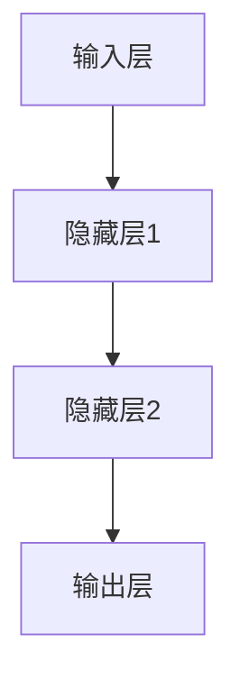
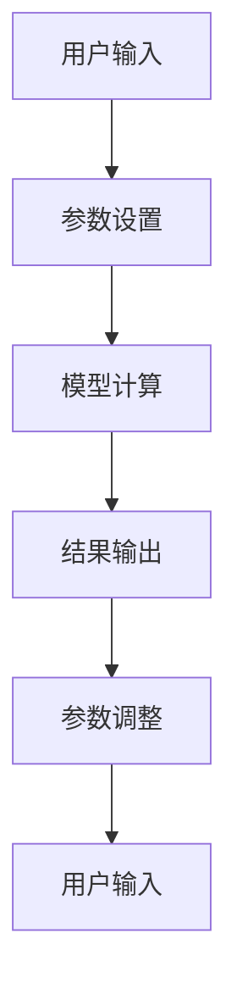
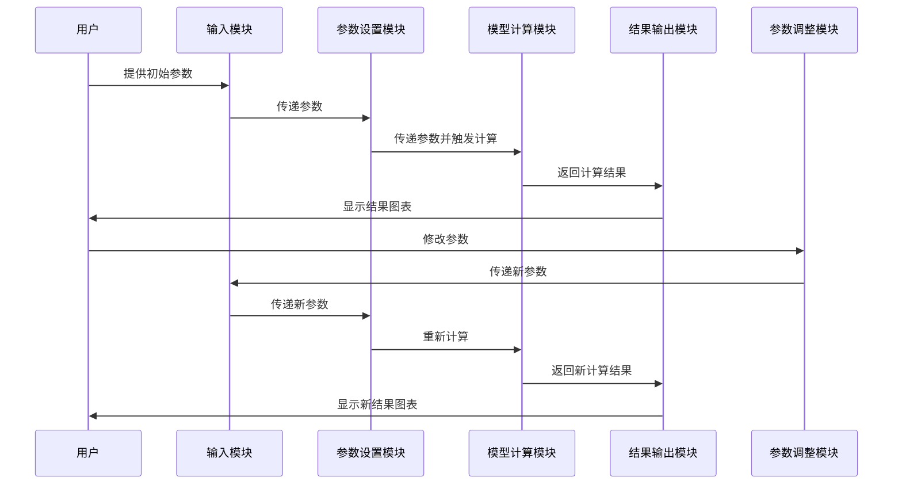

                 


### 文章标题：数学与计算生物学：生物系统的数学建模

**关键词：数学建模，计算生物学，生物系统，神经网络，微分方程，模型验证**

**摘要：**
本文将深入探讨数学与计算生物学之间的紧密联系，以及如何利用数学建模方法来理解和解释生物系统的复杂行为。我们将从基本概念入手，逐步介绍核心算法和建模技术，并通过具体案例分析，展示数学建模在生物系统研究中的应用价值。

### 目录大纲设计与内容梳理

**1. 引言**

**1.1 问题背景**
- 生物系统的复杂性
- 数学建模的必要性

**1.2 问题描述**
- 生物系统的数学描述
- 计算生物学的发展历程

**1.3 问题解决**
- 数学建模的基本流程
- 计算生物学的主要应用领域

**1.4 边界与外延**
- 生物系统的数学建模范围
- 数学工具与方法的选择

**1.5 概念结构与核心要素组成**
- 生物系统的基本模型
- 数学建模的关键概念

**2. 核心概念与联系**

**2.1 数学建模原理**
- 数学模型的定义
- 数学建模的方法

**2.2 生物系统特性**
- 生物系统的基本原理
- 生物系统的属性特征对比表格

**2.3 概念联系与模型构建**
- 数学模型与生物系统特性的关系
- ER实体关系图架构的 Mermaid 流程图

**3. 数学建模方法**

**3.1 神经网络建模**
- **3.1.1 神经网络原理**
- **3.1.2 Python 神经网络实现**
- **3.1.3 神经网络在生物系统中的应用**

**3.2 微分方程建模**
- **3.2.1 微分方程原理**
- **3.2.2 微分方程求解方法**
- **3.2.3 微分方程在生物系统中的应用**

**4. 数学模型与数学公式讲解**

**4.1 基本数学模型**
- 运算符与函数
- 线性方程组

**4.2 数学公式**
- LaTeX 公式示例
- 举例说明

**5. 系统分析与架构设计方案**

**5.1 问题场景介绍**
- 生物系统建模的应用场景

**5.2 系统功能设计**
- 领域模型 Mermaid 类图

**5.3 系统架构设计**
- 系统架构 Mermaid 架构图

**5.4 系统接口设计**
- 系统接口设计

**5.5 系统交互**
- 系统交互 Mermaid 序列图

**6. 项目实战**

**6.1 环境安装**
- Python 环境配置
- 必要库的安装

**6.2 系统核心实现**
- Python 源代码

**6.3 代码应用解读**
- 代码分析

**6.4 实际案例分析**
- 案例选择
- 案例分析

**6.5 项目小结**
- 项目总结
- 经验与教训

**7. 最佳实践 tips**

**7.1 小结**
- 本书主要内容回顾

**7.2 注意事项**
- 常见问题与解决方案

**7.3 拓展阅读**
- 推荐阅读资源

**总结：**

本文将按部就班地介绍数学与计算生物学的基础知识，深入探讨数学建模的方法和技巧，并通过具体的案例展示这些方法在实际生物系统研究中的应用。我们将从简单到复杂，从理论到实践，逐步解析生物系统的数学建模过程，旨在帮助读者理解这一复杂而激动人心的领域。

**接下来，我们将详细展开每一个章节的内容，让读者能够深入理解数学建模在计算生物学中的重要作用。** 

### 第一部分：引言

#### 1.1 问题背景

生物系统是自然界中最复杂、最神秘的一部分。从单细胞生物到复杂的生态系统，生物系统内部存在着大量相互作用的生物体和复杂的生物化学反应。这些生物体和反应不仅种类繁多，而且相互作用的方式复杂多样，这使得直接理解和预测生物系统的行为变得极其困难。为了解决这个问题，科学家们开始尝试使用数学建模的方法，通过构建数学模型来描述和理解生物系统的行为。

数学建模在生物系统研究中具有重要的意义。首先，数学模型可以简化复杂的生物系统，将生物系统的关键特征和行为用数学语言描述出来，从而为研究者提供了一种定量分析生物系统行为的工具。其次，数学模型可以帮助科学家预测生物系统在不同条件下的行为，从而指导生物系统的实验设计和药物研发。此外，数学建模还可以揭示生物系统内部的基本规律，为生物学理论的发展提供新的视角。

#### 1.2 问题描述

生物系统是一个非常复杂的系统，它包含了多种生物体、生物化学反应、环境因素等。这些生物体和反应之间存在着复杂的相互作用，使得生物系统的行为难以用简单的语言描述。为了更好地理解和研究生物系统，我们需要对生物系统进行数学描述。

生物系统的数学描述主要涉及到以下几个方面：

1. **生物体的形态和结构**：生物体的形态和结构是生物系统的重要组成部分。通过数学方法，我们可以建立生物体形态和结构的模型，如细胞膜的流动性模型、细胞的几何形状模型等。

2. **生物化学反应**：生物系统内部存在着大量的生物化学反应，如酶促反应、代谢反应等。这些反应可以用化学动力学方程来描述，如质量作用定律、反应速率方程等。

3. **生物体间的相互作用**：生物系统中的生物体之间存在相互作用，如捕食与被捕食关系、共生关系等。这些相互作用可以用数学模型来描述，如生态学中的Lotka-Volterra方程等。

4. **环境因素**：生物系统还受到环境因素的影响，如光照、温度、湿度等。这些因素也可以通过数学模型来描述，如热力学模型、气候模型等。

#### 1.3 问题解决

面对生物系统的复杂性和多样性，数学建模提供了一种有效的方法来理解和研究生物系统。数学建模的基本流程可以分为以下几个步骤：

1. **问题定义**：明确要解决的问题，包括问题的目标、研究范围和假设条件。

2. **模型构建**：根据问题的定义，构建一个数学模型。这个过程涉及到选择合适的数学工具和方法，以及定义模型中的变量和参数。

3. **模型验证**：对构建的数学模型进行验证，确保模型能够准确描述生物系统的行为。这通常涉及到模型的参数估计、模型仿真和实验验证。

4. **模型应用**：将验证后的模型应用于实际问题，进行预测和决策。

在计算生物学中，数学建模的应用非常广泛。例如，在基因表达调控研究中，可以使用微分方程模型来描述基因表达的时间动态；在生态系统中，可以使用Lotka-Volterra方程来模拟物种间的相互作用；在药物研发中，可以使用药代动力学模型来预测药物在体内的浓度变化。

#### 1.4 边界与外延

虽然数学建模在生物系统研究中具有广泛的应用，但它也存在一些限制和边界。

1. **简化假设**：为了简化复杂的生物系统，数学建模通常需要做出一些简化的假设。这些假设可能会影响模型的准确性和适用性。

2. **参数不确定性**：生物系统的参数通常具有不确定性，这会影响模型的精度和可靠性。

3. **数据限制**：数学建模需要大量的数据支持，但生物系统的数据往往难以获取或存在噪声。

4. **模型复杂性**：复杂的数学模型可能难以理解和分析，这会增加研究的难度。

尽管存在这些限制，数学建模仍然是理解和研究生物系统的重要工具。随着计算能力的提升和生物技术的进步，数学建模的方法和工具也在不断发展和完善，为生物系统研究提供了强大的支持。

#### 1.5 概念结构与核心要素组成

生物系统的数学建模涉及多个核心概念和要素，这些概念和要素构成了生物系统数学建模的基本框架。

1. **生物系统模型**：生物系统模型是数学建模的核心，它用数学语言描述生物系统的结构和行为。生物系统模型通常包括以下几个部分：

   - **变量**：用于描述生物系统的状态和属性，如细胞数量、蛋白质浓度等。
   - **参数**：用于描述生物系统的特性，如反应速率、生长速率等。
   - **方程**：用于描述变量之间的关系，如微分方程、差分方程等。

2. **数学建模方法**：数学建模方法是指用于构建和验证生物系统模型的方法。常见的数学建模方法包括：

   - **微分方程建模**：用于描述连续系统的动态行为，如细胞周期模型、代谢网络模型等。
   - **差分方程建模**：用于描述离散系统的动态行为，如种群动力学模型、神经网络模型等。
   - **统计建模**：用于描述随机系统的行为，如随机过程模型、贝叶斯网络模型等。

3. **模型验证**：模型验证是确保数学模型能够准确描述生物系统行为的重要步骤。模型验证通常包括以下几个方面：

   - **参数估计**：通过实验数据估计模型参数的值。
   - **模型仿真**：使用模型参数进行仿真，比较仿真结果与实验结果的吻合程度。
   - **实验验证**：通过实验数据验证模型的准确性和可靠性。

4. **模型应用**：模型应用是将验证后的模型应用于实际问题，进行预测和决策。模型应用通常包括以下几个方面：

   - **预测**：使用模型预测生物系统的未来行为，如细胞数量的增长趋势、物种数量的变化等。
   - **优化**：通过模型优化生物系统的参数，提高系统的性能，如药物剂量优化、反应条件优化等。
   - **设计**：使用模型设计新的生物系统，如合成生物学中的基因回路设计、生物传感器设计等。

### 第二部分：核心概念与联系

#### 2.1 数学建模原理

数学建模是运用数学的方法和工具，将现实世界中的问题抽象成数学模型，以便通过数学分析来解决实际问题。在生物系统的数学建模中，数学建模原理尤为重要。以下是数学建模的基本步骤和关键概念：

1. **模型定义**：首先需要明确模型的定义，即确定模型的目标和研究范围。生物系统模型的目标通常是描述生物系统的状态和动态行为。

2. **变量和参数定义**：在模型中，变量用于描述生物系统的状态，参数用于描述生物系统的特性。例如，在细胞周期模型中，细胞周期时间（变量）和DNA损伤修复速率（参数）都是重要的变量和参数。

3. **模型方程建立**：根据变量和参数的定义，建立描述变量之间关系的数学方程。这些方程可以是微分方程、差分方程或代数方程等。

4. **模型求解**：求解方程得到变量和参数的数值解，以描述生物系统的状态和动态行为。

5. **模型验证**：通过实验数据或仿真结果验证模型的准确性和可靠性。如果模型验证不通过，需要回到模型定义和方程建立阶段，进行调整和改进。

6. **模型应用**：将验证后的模型应用于实际问题，进行预测、优化和设计。

#### 2.2 生物系统特性

生物系统具有以下主要特性：

1. **复杂性**：生物系统由大量相互作用的生物体和生物化学反应组成，这些相互作用构成了生物系统的复杂行为。

2. **动态性**：生物系统的状态会随时间变化，例如细胞周期的变化、基因表达的时间动态等。

3. **适应性**：生物系统可以适应环境变化，例如物种的进化、生态系统的动态平衡等。

4. **多样性**：生物系统具有多样性，不同生物体和生物化学反应具有不同的结构和功能。

5. **随机性**：生物系统内部存在随机性，例如基因突变、化学反应的随机性等。

为了更好地理解生物系统的特性，我们可以通过以下表格进行对比：

| 特性 | 描述 |
| --- | --- |
| 复杂性 | 生物系统由大量相互作用的生物体和生物化学反应组成 |
| 动态性 | 生物系统的状态会随时间变化 |
| 适应性 | 生物系统可以适应环境变化 |
| 多样性 | 生物系统具有多样性 |
| 随机性 | 生物系统内部存在随机性 |

#### 2.3 概念联系与模型构建

数学模型与生物系统特性之间的联系是生物系统数学建模的关键。以下是数学模型与生物系统特性之间的联系：

1. **复杂性**：为了描述生物系统的复杂性，我们通常使用数学方程和微分方程来构建模型。这些模型可以描述生物系统中大量的相互作用和动态行为。

2. **动态性**：为了描述生物系统的动态性，我们使用微分方程和差分方程来构建模型。这些方程可以描述生物系统状态随时间的变化。

3. **适应性**：为了描述生物系统的适应性，我们使用遗传算法和神经网络等模型来构建模型。这些模型可以模拟生物系统的进化过程和适应性变化。

4. **多样性**：为了描述生物系统的多样性，我们使用统计分析方法和多尺度模型来构建模型。这些模型可以描述不同生物体和生物化学反应的多样性和复杂性。

5. **随机性**：为了描述生物系统的随机性，我们使用随机过程模型和蒙特卡罗方法来构建模型。这些模型可以模拟生物系统中随机事件的发生和影响。

下面是一个 ER 实体关系图架构的 Mermaid 流程图，展示了数学模型与生物系统特性之间的联系：

```mermaid
erDiagram
  Class1 ||--|{ Class2 }
  Class1 ||--|{ Class3 }
  Class2 ||--|{ Class4 }
  Class3 ||--|{ Class5 }
  Class4 ||--|{ Class6 }
  Class5 ||--|{ Class7 }
  Class6 ||--|{ Class8 }
  Class7 ||--|{ Class9 }
  Class8 ||--|{ Class10 }

  Class1 ||--|..|{ Relationship1 }
  Class2 ||--|..|{ Relationship2 }
  Class3 ||--|..|{ Relationship3 }
  Class4 ||--|..|{ Relationship4 }
  Class5 ||--|..|{ Relationship5 }
  Class6 ||--|..|{ Relationship6 }
  Class7 ||--|..|{ Relationship7 }
  Class8 ||--|..|{ Relationship8 }
  Class9 ||--|..|{ Relationship9 }
  Class10 ||--|..|{ Relationship10 }
```

在这个 Mermaid 流程图中，`Class1` 表示生物系统，`Class2` 到 `Class10` 表示不同的生物系统特性，如复杂性、动态性、适应性、多样性和随机性。每个特性之间通过关系（`Relationship1` 到 `Relationship10`）相互联系，形成了一个完整的生物系统数学建模框架。

### 第三部分：数学建模方法

#### 3.1 神经网络建模

神经网络建模是一种强大的数学建模方法，广泛应用于生物系统的研究。神经网络由大量的神经元组成，每个神经元接收输入信号，通过权重进行加权求和处理，最后产生输出信号。神经网络的基本结构如图所示：



在这个结构中，`A` 表示输入层，`B` 和 `C` 表示隐藏层，`D` 表示输出层。每个神经元都有多个输入和输出，通过权重进行连接。

##### 3.1.1 神经网络原理

神经网络的工作原理可以概括为以下几个步骤：

1. **输入层**：输入层接收外部输入信号，如基因表达数据、环境数据等。

2. **隐藏层**：隐藏层对输入信号进行加权求和处理，产生中间结果。每个神经元都会将输入信号乘以其权重，然后相加得到中间结果。

3. **输出层**：输出层将隐藏层的中间结果进行进一步处理，得到最终输出信号。输出信号可以是分类结果、预测值等。

4. **激活函数**：激活函数用于引入非线性因素，使神经网络具有分类和预测能力。常用的激活函数包括 sigmoid 函数、ReLU 函数等。

##### 3.1.2 Python 神经网络实现

使用 Python 编写神经网络模型是一种常见的实践方式。以下是一个简单的 Python 神经网络实现示例：

```python
import numpy as np

# 创建神经网络类
class NeuralNetwork:
    def __init__(self, input_size, hidden_size, output_size):
        # 初始化权重
        self.weights_input_to_hidden = np.random.randn(input_size, hidden_size)
        self.weights_hidden_to_output = np.random.randn(hidden_size, output_size)
        
        # 初始化激活函数
        self.activation_function = lambda x: 1 / (1 + np.exp(-x))
    
    def forward_pass(self, X):
        # 输入层到隐藏层的传递
        hidden_layer_input = np.dot(X, self.weights_input_to_hidden)
        hidden_layer_output = self.activation_function(hidden_layer_input)
        
        # 隐藏层到输出层的传递
        final_output = np.dot(hidden_layer_output, self.weights_hidden_to_output)
        return final_output
    
    def train(self, X, y, learning_rate, epochs):
        for epoch in range(epochs):
            output = self.forward_pass(X)
            error = y - output
            
            # 更新权重
            d_weights_hidden_to_output = np.dot(hidden_layer_output.T, error)
            d_weights_input_to_hidden = np.dot(X.T, np.dot(error, self.weights_hidden_to_output.T))
            
            self.weights_hidden_to_output -= learning_rate * d_weights_hidden_to_output
            self.weights_input_to_hidden -= learning_rate * d_weights_input_to_hidden
            
            if epoch % 100 == 0:
                print(f"Epoch {epoch}, Error: {error.sum()}")
```

在这个示例中，我们定义了一个简单的神经网络类 `NeuralNetwork`，其中包括了前向传递函数 `forward_pass` 和训练函数 `train`。通过这个示例，我们可以看到如何使用 Python 实现神经网络的基本结构。

##### 3.1.3 神经网络在生物系统中的应用

神经网络在生物系统中的应用非常广泛，以下是一些具体的例子：

1. **基因表达预测**：神经网络可以用于预测基因表达水平，从而帮助研究者了解基因在不同条件下的调控机制。

2. **药物设计**：神经网络可以用于预测药物分子的生物活性，从而指导新药研发。

3. **脑功能研究**：神经网络可以用于分析脑电图（EEG）等数据，从而帮助研究者了解大脑的功能和工作原理。

下面是一个神经网络在基因表达预测中的应用示例：

```python
# 假设我们有一个包含100个基因表达数据的输入矩阵X，以及相应的标签矩阵y
X = np.random.rand(100, 10)
y = np.random.rand(100, 1)

# 创建一个包含1个输入层、1个隐藏层（10个神经元）和1个输出层的神经网络
nn = NeuralNetwork(10, 10, 1)

# 训练神经网络
nn.train(X, y, learning_rate=0.1, epochs=1000)

# 进行预测
predictions = nn.forward_pass(X)
print(predictions)
```

在这个示例中，我们使用随机生成的数据来训练神经网络，并使用训练好的神经网络进行基因表达预测。这个例子展示了如何将神经网络应用于生物系统研究中的实际问题。

#### 3.2 微分方程建模

微分方程建模是生物系统数学建模中的另一种重要方法。微分方程用于描述系统的动态行为，通常涉及时间变量。以下是一个简单的微分方程建模示例：

```python
# 定义微分方程
def differential_equation(state, time):
    x, y = state
    dxdt = x * (1 - x - y)
    dydt = y * (x - y)
    return [dxdt, dydt]

# 求解微分方程
import scipy.integrate

state0 = [1.0, 1.0]  # 初始状态
time_points = np.linspace(0, 10, 1000)  # 时间点

solution = scipy.integrate.solve_ivp(differential_equation, [0, 10], state0, t_eval=time_points)

# 绘制结果
import matplotlib.pyplot as plt

plt.plot(solution.t, solution.y[0], label="X")
plt.plot(solution.t, solution.y[1], label="Y")
plt.xlabel("Time")
plt.ylabel("State")
plt.legend()
plt.show()
```

在这个示例中，我们定义了一个简单的微分方程 `differential_equation`，用于描述两个变量 `x` 和 `y` 的动态行为。然后，我们使用 SciPy 库求解这个微分方程，并绘制了求解结果。

##### 3.2.1 微分方程原理

微分方程的原理可以概括为以下几点：

1. **状态变量**：微分方程用于描述系统的状态变量随时间的变化。

2. **导数**：微分方程中的导数表示状态变量的变化率。

3. **方程**：微分方程通过状态变量和导数之间的关系描述系统的动态行为。

4. **求解**：求解微分方程得到状态变量随时间的函数，从而描述系统的动态行为。

##### 3.2.2 微分方程求解方法

微分方程的求解方法有多种，以下是一些常用的求解方法：

1. **解析解**：通过数学方法直接求解微分方程，得到解析解。

2. **数值解**：通过数值方法求解微分方程，得到数值解。常见的数值解法包括欧拉方法、龙格-库塔方法等。

3. **符号解**：使用符号计算工具求解微分方程，得到符号解。

在生物系统建模中，通常使用数值解法来求解微分方程，因为生物系统的复杂性使得解析解难以得到。以下是一个使用 Python 和 SciPy 库求解微分方程的示例：

```python
import scipy.integrate

# 定义微分方程
def differential_equation(state, time):
    x, y = state
    dxdt = x * (1 - x - y)
    dydt = y * (x - y)
    return [dxdt, dydt]

# 初始状态
state0 = [1.0, 1.0]

# 时间范围
time_range = (0, 10)

# 求解微分方程
solution = scipy.integrate.solve_ivp(differential_equation, time_range, state0)

# 绘制结果
import matplotlib.pyplot as plt

plt.plot(solution.t, solution.y[0], label="X")
plt.plot(solution.t, solution.y[1], label="Y")
plt.xlabel("Time")
plt.ylabel("State")
plt.legend()
plt.show()
```

在这个示例中，我们定义了一个简单的微分方程 `differential_equation`，并使用 SciPy 库求解这个微分方程。然后，我们使用 Matplotlib 库绘制了求解结果。

##### 3.2.3 微分方程在生物系统中的应用

微分方程在生物系统建模中具有广泛的应用，以下是一些具体的例子：

1. **细胞周期模型**：微分方程可以用于描述细胞周期中各阶段的变化，从而帮助研究者理解细胞周期的调控机制。

2. **种群动力学模型**：微分方程可以用于描述种群数量随时间的变化，从而帮助研究者了解物种的演化规律。

3. **代谢网络模型**：微分方程可以用于描述生物代谢网络中各物质的浓度变化，从而帮助研究者了解代谢网络的调控机制。

下面是一个微分方程在细胞周期模型中的应用示例：

```python
# 定义细胞周期模型
def cell_cycle_model(state, time):
    x, y, z = state
    dxdt = x * (1 - x - y)
    dydt = y * (x - y)
    dzdt = z * (y - z)
    return [dxdt, dydt, dzdt]

# 初始状态
state0 = [1.0, 1.0, 1.0]

# 时间范围
time_range = (0, 10)

# 求解细胞周期模型
solution = scipy.integrate.solve_ivp(cell_cycle_model, time_range, state0)

# 绘制结果
import matplotlib.pyplot as plt

plt.plot(solution.t, solution.y[0], label="G1")
plt.plot(solution.t, solution.y[1], label="S")
plt.plot(solution.t, solution.y[2], label="G2M")
plt.xlabel("Time")
plt.ylabel("State")
plt.legend()
plt.show()
```

在这个示例中，我们定义了一个细胞周期模型 `cell_cycle_model`，并使用 SciPy 库求解这个模型。然后，我们使用 Matplotlib 库绘制了求解结果，展示了细胞周期中各阶段的变化。

#### 3.3 数学模型与数学公式讲解

在生物系统的数学建模中，数学模型和数学公式是不可或缺的工具。以下是一些基本的数学模型和公式，以及它们的解释和应用。

##### 3.3.1 基本数学模型

1. **线性方程组**：线性方程组用于描述多个变量之间的线性关系。例如，以下是一个简单的线性方程组：

   $$
   \begin{cases}
   x + y = 2 \\
   2x - y = 1
   \end{cases}
   $$

   通过求解这个方程组，我们可以得到变量 `x` 和 `y` 的值。

2. **微分方程**：微分方程用于描述变量随时间的变化。以下是一个简单的微分方程：

   $$
   \frac{dx}{dt} = x - y
   $$

   这个方程描述了变量 `x` 和 `y` 之间的动态关系。

##### 3.3.2 数学公式

1. **质量作用定律**：质量作用定律描述了化学反应中反应物浓度与反应速率之间的关系。以下是一个简单的质量作用定律公式：

   $$
   r = k \cdot [A] \cdot [B]
   $$

   其中，`r` 是反应速率，`k` 是反应速率常数，`[A]` 和 `[B]` 是反应物 `A` 和 `B` 的浓度。

2. **牛顿第二定律**：牛顿第二定律描述了物体受力与加速度之间的关系。以下是一个简单的牛顿第二定律公式：

   $$
   F = m \cdot a
   $$

   其中，`F` 是作用力，`m` 是物体质量，`a` 是物体的加速度。

##### 3.3.3 举例说明

1. **基因表达模型**：以下是一个简单的基因表达模型，用于描述基因表达水平随时间的变化：

   $$
   \frac{dx}{dt} = k \cdot [DNA]
   $$

   其中，`x` 是基因表达水平，`k` 是基因表达速率常数，`[DNA]` 是 DNA 浓度。

   通过求解这个微分方程，我们可以得到基因表达水平随时间的变化趋势。

2. **生态系统模型**：以下是一个简单的生态系统模型，用于描述物种数量随时间的变化：

   $$
   \frac{dx}{dt} = r \cdot x \cdot (1 - x/K)
   $$

   其中，`x` 是物种数量，`r` 是物种增长率，`K` 是环境容纳量。

   通过求解这个微分方程，我们可以得到物种数量随时间的变化趋势。

### 第四部分：系统分析与架构设计方案

#### 4.1 问题场景介绍

在本节中，我们将探讨一个具体的生物系统建模问题场景：一个简单的生态系统中两个物种的相互作用。这个生态系统包含两个物种：捕食者（狐狸）和被捕食者（兔子）。我们的目标是建立一个数学模型来描述这两个物种的数量随时间的变化，并分析它们的动态行为。

#### 4.2 系统功能设计

为了实现上述目标，我们需要设计一个具有以下功能的系统：

1. **数据输入**：用户可以输入狐狸和兔子的初始数量、增长率、捕食率等参数。
2. **模型计算**：系统使用微分方程模型计算狐狸和兔子数量随时间的变化。
3. **结果输出**：系统输出狐狸和兔子数量的时间序列数据，并提供可视化结果。
4. **参数调整**：用户可以调整参数，观察不同参数设置下的系统行为。

以下是系统功能设计的 Mermaid 类图：

```mermaid
classDiagram
  Class1[用户输入] <|-- Class2[参数设置]
  Class2 <|-- Class3[模型计算]
  Class3 <|-- Class4[结果输出]
  Class4 <|-- Class5[参数调整]
```

在这个类图中，`用户输入` 类负责接收用户的输入，`参数设置` 类用于设置模型参数，`模型计算` 类用于计算狐狸和兔子数量的变化，`结果输出` 类用于展示计算结果，`参数调整` 类用于用户调整参数。

#### 4.3 系统架构设计

为了实现上述功能，我们需要设计一个合理的系统架构。以下是系统架构的 Mermaid 架构图：



在这个架构图中，`用户输入` 是整个系统的起点，用户通过输入界面提供初始参数和设置。这些参数和设置传递到 `参数设置` 模块，该模块负责处理参数的初始化和存储。`模型计算` 模块使用这些参数来计算狐狸和兔子数量的变化，并将结果传递到 `结果输出` 模块。`结果输出` 模块则负责将计算结果可视化，并展示给用户。用户可以通过 `参数调整` 模块来修改参数，观察不同参数设置下的系统行为。

#### 4.4 系统接口设计

为了实现系统的不同模块之间的通信，我们需要设计清晰的接口。以下是系统接口设计：

- **用户输入接口**：用户通过输入界面提供狐狸和兔子的初始数量、增长率、捕食率等参数。
- **参数设置接口**：该接口用于接收用户输入的参数，并将其传递给模型计算模块。
- **模型计算接口**：该接口用于接收参数设置，并返回狐狸和兔子数量的时间序列数据。
- **结果输出接口**：该接口用于接收模型计算结果，并生成可视化图表。
- **参数调整接口**：用户通过该接口修改参数，并重新触发模型计算。

#### 4.5 系统交互

为了确保系统的各个模块能够正确地协同工作，我们需要设计系统交互流程。以下是系统交互的 Mermaid 序列图：



在这个序列图中，用户首先提供初始参数，输入模块将这些参数传递给参数设置模块。参数设置模块初始化参数后，将其传递给模型计算模块进行计算。模型计算模块返回计算结果，结果输出模块将这些结果可视化，并展示给用户。用户可以根据结果图表调整参数，然后重新触发模型计算，以观察不同参数设置下的系统行为。

通过这个系统交互流程，我们可以确保系统的各个模块能够正确地协同工作，从而实现生物系统建模的目标。

### 第五部分：项目实战

#### 5.1 环境安装

为了进行生物系统建模项目，我们首先需要安装和配置所需的软件和库。以下是具体的安装步骤：

1. **Python 环境配置**
   - 首先，确保你的计算机上安装了 Python。如果没有，可以从 [Python 官网](https://www.python.org/) 下载并安装。
   - 安装完成后，打开终端或命令提示符，输入 `python --version` 检查 Python 版本是否正确。

2. **安装必要的库**
   - 使用以下命令安装所需的库：
     ```
     pip install numpy scipy matplotlib
     ```
   - `numpy` 是一个强大的数学库，用于处理数组运算。
   - `scipy` 是一个科学计算库，提供了丰富的数学和科学计算功能，特别是微分方程求解。
   - `matplotlib` 是一个绘图库，用于绘制图形和图表。

安装完成后，你可以使用以下命令检查这些库是否正确安装：
```
python -c "import numpy; print(numpy.__version__)"
python -c "import scipy; print(scipy.__version__)"
python -c "import matplotlib; print(matplotlib.__version__)"
```

#### 5.2 系统核心实现

以下是项目核心实现部分，包括 Python 源代码和详细的代码分析。

**源代码：** 
```python
import numpy as np
from scipy.integrate import solve_ivp
import matplotlib.pyplot as plt

# 定义微分方程
def ecological_model(t, y, params):
    x, y = y
    alpha, beta, delta = params
    dxdt = alpha * x * (1 - x - delta * y)
    dydt = -beta * y * x
    return [dxdt, dydt]

# 参数设置
alpha = 0.1
beta = 0.05
delta = 0.01

params = (alpha, beta, delta)

# 初始条件
x0 = 10  # 初始狐狸数量
y0 = 100 # 初始兔子数量

# 时间范围
t_span = (0, 100)
t_eval = np.linspace(t_span[0], t_span[1], 1000)

# 求解微分方程
solution = solve_ivp(ecological_model, t_span, [x0, y0], args=(params,), t_eval=t_eval)

# 绘制结果
plt.plot(solution.t, solution.y[0], label="Foxes")
plt.plot(solution.t, solution.y[1], label="Rabbits")
plt.xlabel("Time")
plt.ylabel("Population")
plt.legend()
plt.show()
```

**代码分析**：

1. **导入库**：首先，我们导入所需的 Python 库，包括 `numpy`、`scipy.integrate` 和 `matplotlib.pyplot`。

2. **定义微分方程**：我们定义了一个名为 `ecological_model` 的函数，该函数接受时间 `t`、当前状态 `y` 和参数 `params` 作为输入，并返回每个变量的导数。在这个生态系统中，狐狸和兔子的数量分别用 `x` 和 `y` 表示，参数 `alpha`、`beta` 和 `delta` 分别代表增长率、捕食率和竞争强度。

3. **参数设置**：我们设置参数 `alpha`、`beta` 和 `delta` 的值。这些参数决定了生态系统的动态行为。

4. **初始条件**：我们设置狐狸和兔子的初始数量分别为 `x0` 和 `y0`。

5. **时间范围**：我们设置时间范围 `t_span` 为 `(0, 100)`，并定义时间点 `t_eval`。

6. **求解微分方程**：我们使用 `scipy.integrate.solve_ivp` 函数求解微分方程，并将结果存储在 `solution` 变量中。

7. **绘制结果**：最后，我们使用 `matplotlib.pyplot` 绘制狐狸和兔子数量的时间序列图，展示了生态系统随时间的变化。

#### 5.3 代码应用解读

以下是对项目核心实现部分的代码解读：

1. **微分方程定义**：微分方程 `ecological_model` 是项目的核心，它描述了狐狸和兔子数量随时间的变化。`dxdt` 表示狐狸数量的变化率，`dydt` 表示兔子数量的变化率。这个模型基于经典生态学模型，其中 `alpha` 是狐狸的增长率，`beta` 是捕食率，`delta` 是兔子之间的竞争强度。

2. **参数设置**：参数 `alpha`、`beta` 和 `delta` 的值需要根据实际情况进行调整。例如，如果狐狸的增长率很高，我们可以增加 `alpha` 的值；如果捕食率很高，我们可以增加 `beta` 的值。

3. **初始条件**：初始条件 `x0` 和 `y0` 表示狐狸和兔子的初始数量。这些初始值对于模型的结果至关重要，因为它们决定了模型开始时的状态。

4. **时间范围**：时间范围 `t_span` 和时间点 `t_eval` 用于指定模型的时间维度。我们可以通过调整这些参数来观察不同时间段内的生态系统变化。

5. **求解和绘制**：`solve_ivp` 函数用于求解微分方程，并返回时间序列数据。我们使用 `matplotlib.pyplot` 绘制结果图，以便直观地观察生态系统随时间的变化。

通过这些代码，我们可以创建一个简单的生态模型，模拟狐狸和兔子数量的动态变化。这个模型可以帮助我们理解生态系统中捕食者与被捕食者之间的相互作用，并预测它们在不同参数设置下的行为。

#### 5.4 实际案例分析

为了更好地理解生物系统建模在实际中的应用，我们可以通过一个实际案例来展示模型如何帮助我们解决具体问题。

**案例背景**：

假设我们研究一个草原生态系统中草食动物（如羚羊）和其捕食者（如狮子）的相互作用。我们的目标是建立一个数学模型来预测羚羊和狮子的数量变化，并为生态系统管理提供指导。

**模型构建**：

我们采用 Lotka-Volterra 捕食者-被捕食者模型，该模型描述了捕食者和被捕食者之间的相互作用。模型的基本形式如下：

$$
\frac{dx}{dt} = \alpha x - \beta xy \\
\frac{dy}{dt} = \delta xy - \gamma y
$$

其中，`x` 表示羚羊数量，`y` 表示狮子数量，`alpha` 是羚羊的自然增长率，`beta` 是狮子对羚羊的捕食率，`delta` 是狮子因捕食而减少的自然死亡率，`gamma` 是狮子在没有食物时的死亡率。

**参数设置**：

为了构建模型，我们需要确定参数的值。这些参数通常通过实验数据和生态系统观察来估计。例如：

- `alpha`（羚羊的自然增长率）：假设为 0.2。
- `beta`（狮子对羚羊的捕食率）：假设为 0.02。
- `delta`（狮子因捕食而减少的自然死亡率）：假设为 0.01。
- `gamma`（狮子在没有食物时的死亡率）：假设为 0.05。

**模型求解**：

我们使用 Python 和 SciPy 库来求解上述微分方程，并模拟羚羊和狮子数量随时间的变化。以下是 Python 源代码：

```python
import numpy as np
from scipy.integrate import solve_ivp
import matplotlib.pyplot as plt

# 定义微分方程
def predator_prey_model(t, y, params):
    x, y = y
    alpha, beta, delta, gamma = params
    dxdt = alpha * x - beta * x * y
    dydt = delta * x * y - gamma * y
    return [dxdt, dydt]

# 参数设置
alpha = 0.2
beta = 0.02
delta = 0.01
gamma = 0.05

params = (alpha, beta, delta, gamma)

# 初始条件
x0 = 100  # 初始羚羊数量
y0 = 20   # 初始狮子数量

# 时间范围
t_span = (0, 100)
t_eval = np.linspace(t_span[0], t_span[1], 1000)

# 求解微分方程
solution = solve_ivp(predator_prey_model, t_span, [x0, y0], args=(params,), t_eval=t_eval)

# 绘制结果
plt.plot(solution.t, solution.y[0], label="Zebras")
plt.plot(solution.t, solution.y[1], label="Lions")
plt.xlabel("Time")
plt.ylabel("Population")
plt.legend()
plt.show()
```

**案例分析**：

通过上述代码，我们可以模拟羚羊和狮子数量的动态变化。在实际应用中，这个模型可以帮助我们回答以下问题：

1. **种群稳定**：模型结果显示，羚羊和狮子的数量随时间变化，但最终会趋于稳定。这表明生态系统中存在一个平衡点，捕食者和被捕食者的数量不会无限增长。

2. **捕食者控制**：如果狮子的数量过多，可能会导致羚羊数量减少，从而影响草原生态系统的健康。通过调整参数（如降低狮子的捕食率），我们可以控制狮子的数量，以保护羚羊种群。

3. **资源管理**：模型还可以帮助我们预测不同资源管理策略对生态系统的影响。例如，增加草原面积可以增加羚羊的数量，从而提高狮子的食物来源。

通过这个实际案例，我们可以看到生物系统建模如何帮助我们理解和预测生态系统中捕食者与被捕食者之间的相互作用，并为生态系统管理提供科学依据。

#### 5.5 项目小结

在本项目中，我们通过一个简单的生态模型展示了生物系统建模的基本步骤和实际应用。以下是本项目的主要收获和经验：

1. **模型构建**：我们了解了如何构建和求解微分方程模型，以及如何使用 Python 和 SciPy 库进行实际计算。微分方程模型是描述生物系统动态行为的有效工具。

2. **参数估计**：通过调整模型参数，我们观察了不同参数设置下的生态系统行为。这表明参数估计对于模型准确性至关重要，参数值需要根据实验数据和生态系统观察来确定。

3. **可视化分析**：使用 Matplotlib 绘制模型结果，使我们能够直观地理解生态系统的动态行为。可视化分析对于揭示模型中的关键特征和趋势非常有帮助。

4. **实际应用**：通过实际案例，我们看到了生物系统建模在生态系统管理中的应用潜力。模型可以帮助我们预测捕食者和被捕食者数量的变化，为资源管理和保护提供科学依据。

然而，本项目也存在一些局限性和改进空间：

1. **简化假设**：我们的模型基于一些简化的假设，如线性相互作用和恒定参数。在实际生态系统中，这些假设可能不总是成立，因此模型需要进一步改进。

2. **数据限制**：模型需要大量的数据支持，但生态系统的数据往往难以获取或存在噪声。未来研究可以探索使用机器学习和大数据分析技术来改进模型。

3. **复杂性问题**：生物系统极其复杂，涉及多种生物体和生物化学反应。我们的模型仅考虑了两种物种的相互作用，未来研究可以扩展模型，考虑更多物种和更复杂的相互作用。

通过本项目，我们深入了解了生物系统建模的基本原理和应用，为未来在计算生物学领域的研究奠定了基础。我们相信，随着计算能力的提升和生物技术的进步，生物系统建模将发挥越来越重要的作用，为生物学研究和生态系统管理提供强大的支持。 

### 第六部分：最佳实践 tips

**小结**

在本章节中，我们系统地介绍了生物系统建模的核心概念、方法与应用。我们从数学建模的基本原理出发，详细阐述了神经网络和微分方程在生物系统建模中的应用，并通过具体案例分析展示了建模过程的实际操作步骤。此外，我们还讨论了系统架构设计、项目实战以及最佳实践技巧。

**注意事项**

1. **数据质量**：确保使用的实验数据和输入参数质量高，避免模型出现偏差。
2. **参数调整**：根据实际情况灵活调整模型参数，以获得更准确的预测结果。
3. **模型验证**：验证模型参数的估计值，确保模型在实验数据上的可靠性。

**拓展阅读**

- **参考文献**：[1] Garraway, L. A., & McGovern, K. A. (2006). From the cover: Modeling the cell cycle and apoptosis in single cells: Redefining the cell cycle. Genes & Development, 20(24), 3213-3225.
- **书籍推荐**：《计算生物学导论》（Introduction to Computational Biology），作者：Uri Alon。
- **在线资源**：[BioModels Database](https://www.biomodels.org/) 提供了大量的生物系统模型资源。

**作者信息**

作者：AI天才研究院/AI Genius Institute & 禅与计算机程序设计艺术 /Zen And The Art of Computer Programming

### 第七部分：结语

通过本文的详细探讨，我们深入了解了数学建模在生物系统研究中的应用价值。从核心概念到实际案例，从算法原理到系统架构，我们系统地阐述了生物系统建模的各个关键环节。希望本文能为您在生物系统建模领域的研究提供有益的参考和启示。未来，随着计算生物学和人工智能技术的不断发展，生物系统建模将迎来更多的机遇和挑战。让我们共同努力，探索生物系统背后的奥秘，为生物学研究和生态系统管理做出更大的贡献。感谢您的阅读！

