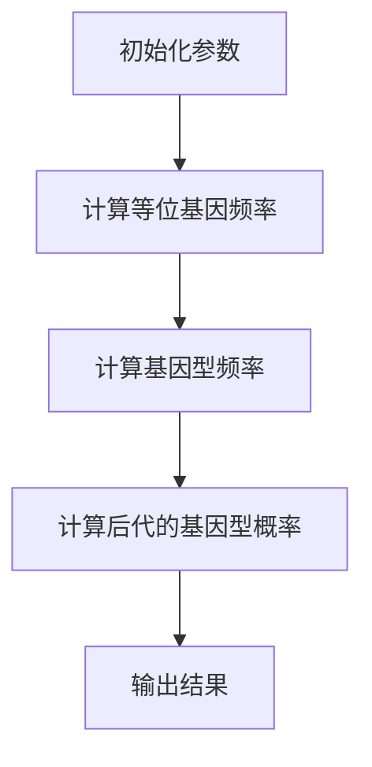
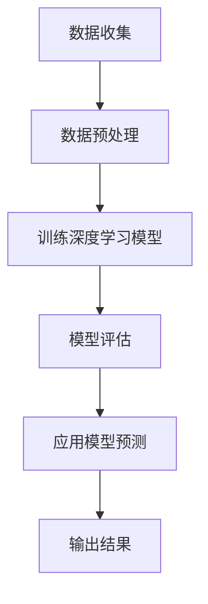
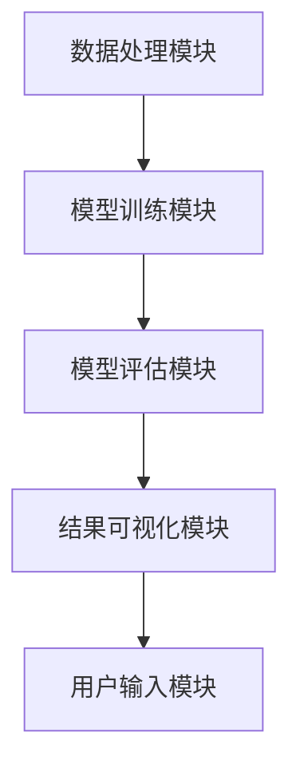
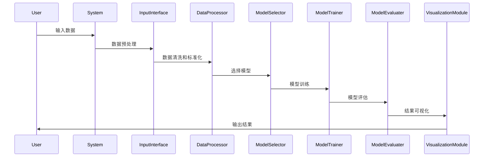
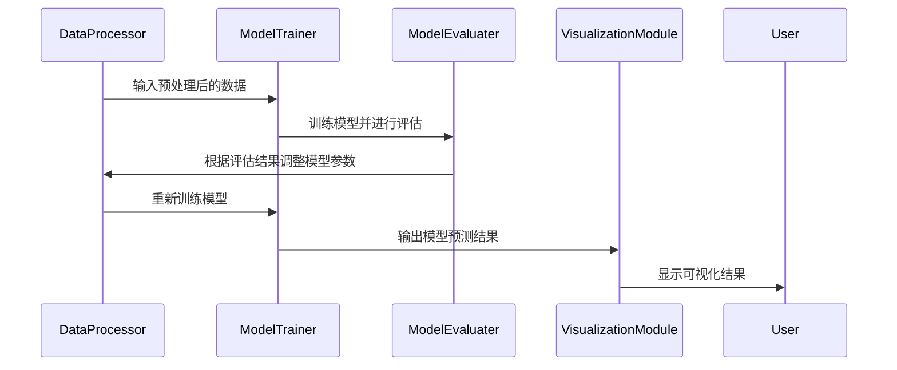

                 

### 引言

在当今科技迅猛发展的时代，生物学与数学的交汇已经成为推动科学进步的重要领域。数学与计算生物学的关系愈发紧密，尤其是在生物系统的数学建模方面。生物系统的数学建模，作为一种融合了数学和生物学的方法，使得我们能够通过数学模型来理解和预测生物系统的行为，从而在医学、药物研发、生态系统管理等多个领域取得了显著的成果。

本文将围绕《数学与计算生物学：生物系统的数学建模》这一主题，逐步探讨生物系统的数学建模的重要性和具体方法。文章将从以下几个方面展开：

1. **背景介绍**：我们将简要介绍数学与计算生物学的关系，以及生物系统的数学建模的背景和重要性。
2. **核心概念与联系**：我们将明确书中要讨论的核心概念，并通过表格和ER实体关系图来展示这些概念之间的联系。
3. **算法原理讲解**：我们将详细介绍涉及的主要算法，使用mermaid流程图和Python源代码来阐述算法原理。
4. **系统分析与架构设计方案**：我们将针对生物系统的数学建模，设计系统功能、架构、接口和交互。
5. **项目实战**：我们将描述一个实际项目，从环境安装、系统实现到案例分析，进行全面剖析。
6. **最佳实践、小结和注意事项**：最后，我们将总结书中的要点，并给出实践建议和进一步阅读的参考。

希望通过这篇文章，读者能够对生物系统的数学建模有一个全面而深入的理解，从而在相关领域取得突破性的进展。

### 关键词

- 数学与计算生物学
- 生物系统数学建模
- 算法原理
- 系统设计与实现
- 项目实战分析

### 摘要

本文旨在探讨数学与计算生物学在生物系统数学建模中的应用。通过背景介绍、核心概念阐述、算法原理讲解、系统分析与设计、项目实战等多个角度，本文系统性地展示了如何利用数学方法理解和预测生物系统的行为。文章首先介绍了数学与计算生物学的关系及生物系统数学建模的重要性，随后通过对比表格和ER实体关系图明确了核心概念之间的联系。在算法部分，我们使用mermaid流程图和Python源代码详细阐述了主要算法的原理，并通过数学公式和实例说明其应用。系统分析与设计部分，我们介绍了系统的功能设计、架构设计、接口设计以及系统交互设计。最后，通过一个实际项目的实战分析，我们对生物系统数学建模的方法进行了全面而深入的剖析。本文不仅提供了理论指导，还针对实践中可能遇到的问题提出了最佳实践和建议。

## 第1章：背景介绍

数学与计算生物学的关系

数学与计算生物学的结合，源于数学工具在生物学研究中的广泛应用。自20世纪中叶以来，计算机技术的发展极大地推动了这一交叉学科的发展。数学方法，特别是离散数学、概率论、统计学和图论，为生物学研究提供了强大的工具。例如，概率论在遗传学中的应用，使得科学家能够更准确地预测基因的传递和变异；图论在蛋白质相互作用网络分析中发挥了重要作用，帮助研究人员理解细胞内部的复杂相互作用。

生物系统的数学建模的重要性

生物系统的数学建模在生物学研究中具有重要的地位。首先，它能够帮助我们理解和预测生物系统的行为，从而在疾病治疗、药物研发和生态系统管理等领域提供重要的参考。例如，在疾病治疗方面，通过数学模型，我们可以模拟药物在人体内的作用机制，优化药物剂量和给药方案，从而提高治疗效果。在药物研发方面，数学建模可以帮助筛选药物候选分子，预测其生物活性和毒性，从而加速新药研发过程。

其次，生物系统的数学建模有助于揭示生物系统的基本原理和规律。通过建立数学模型，我们可以深入理解生物系统的复杂性和动态行为，揭示生物系统中各种变量之间的相互作用关系。这种理解不仅有助于深化我们对生命现象的认识，还可以为未来的科学研究提供新的视角和方法。

最后，生物系统的数学建模在生态系统管理方面也有重要应用。通过建立生态系统模型，我们可以预测生态系统对环境变化的响应，从而制定有效的生态保护和管理策略。

### 数学在生物学中的基础应用

在生物学研究中，数学的应用极为广泛，涵盖了从分子水平到生态系统水平的各个层面。以下是一些关键领域的具体应用：

1. **遗传学**：在遗传学中，概率论和统计学被广泛用来分析基因的传递和变异。例如，通过计算后代的遗传可能性，科学家可以预测特定基因在群体中的分布。这种计算在遗传疾病的诊断和治疗中具有重要意义。此外，图论在遗传图谱的构建和基因定位中也有重要作用。

2. **分子生物学**：分子生物学中，数学模型被用来描述DNA、RNA和蛋白质的相互作用。例如，在转录和翻译过程中，通过建立数学模型，我们可以预测基因表达水平和蛋白质产物的浓度。这种模型有助于理解生物分子网络中的复杂动态。

3. **生态学**：在生态学研究中，数学模型被用来描述物种之间的相互作用，如捕食-被捕食关系和共生关系。通过建立这些模型，科学家可以预测生态系统的稳定性、物种多样性和生态平衡。

4. **系统生物学**：系统生物学是一门研究生物系统的整体行为和动态的学科，它依赖于数学模型来模拟细胞内各种生物过程的交互作用。通过这种建模，科学家可以揭示细胞功能的复杂性和多样性。

5. **流行病学**：在流行病学研究中，数学模型被用来预测疾病在人群中的传播和流行趋势。这种预测对于制定公共卫生政策和控制疾病传播具有重要意义。

通过这些具体的应用实例，我们可以看到数学在生物学中的基础性和广泛性。数学不仅提供了描述和理解生物现象的工具，还为生物学研究提供了新的方法和视角。

### 生物系统数学建模的背景与问题

生物系统数学建模的起源可以追溯到20世纪中叶，随着计算机技术和数学工具的发展，生物学家开始尝试使用数学模型来描述和理解复杂的生物系统。这一转变标志着生物系统数学建模的正式兴起。早期的模型主要集中于基因表达、蛋白质合成等基本生物学过程，随着研究的深入，模型的应用范围逐渐扩展到生态系统、神经系统和免疫系统的复杂动态。

目前，生物系统数学建模已经成为生物学研究中的一个重要分支。它不仅为解析复杂的生物现象提供了强有力的工具，还在医学、药物研发、生态保护和生物技术等领域发挥了重要作用。例如，在医学领域，数学模型被用于预测疾病的传播路径和药物的效果，从而优化治疗策略；在药物研发中，通过数学建模可以预测药物与生物大分子的相互作用，提高新药研发的效率和成功率。

然而，生物系统数学建模也面临着一些挑战和问题。首先，生物系统的复杂性使得建模过程极具挑战性。生物系统包含大量的变量和相互作用，这使得建立准确的数学模型变得困难。其次，数据获取和处理的难度也是一大挑战。生物系统数据通常具有高维度、大规模和动态变化的特点，如何有效地收集、存储和分析这些数据是当前研究的一个重要课题。此外，模型的验证和可靠性问题也是生物系统数学建模中的难点。由于生物系统的复杂性和不确定性，如何确保数学模型的可靠性和适用性是一个亟待解决的关键问题。

尽管面临诸多挑战，生物系统数学建模的重要性不容忽视。通过数学建模，我们可以深入理解生物系统的基本原理和动态行为，揭示生物现象背后的机制。这不仅有助于推动生物学研究的进展，还为实际应用提供了理论支持和技术手段。未来，随着计算技术和数据科学的不断发展，生物系统数学建模有望在生物学和相关领域取得更加显著的成果。

### 生物系统数学建模的定义与目标

生物系统数学建模，顾名思义，是将数学工具和方法应用于生物系统的分析和理解中，以构建数学模型来描述生物系统的结构和动态行为。这一过程涉及到对生物系统进行抽象和简化，从而将复杂的生物现象转化为可分析和预测的数学形式。

具体来说，生物系统数学建模的目标主要包括以下几点：

1. **描述生物系统的行为**：通过数学模型，我们可以描述生物系统在不同条件下的行为，如基因表达、蛋白质合成、细胞信号传导等。这种描述有助于我们理解生物系统的基本运作机制。

2. **预测生物系统的变化**：数学模型不仅可以描述当前生物系统的状态，还可以预测系统在未来的变化趋势。例如，通过模拟药物在人体内的作用机制，我们可以预测药物的疗效和副作用。

3. **揭示生物系统的机制**：通过分析数学模型，我们可以揭示生物系统内部各种变量之间的相互作用关系，从而理解生物系统的基本原理。例如，通过研究遗传学模型，我们可以揭示基因如何影响个体的性状。

4. **优化生物系统的操作**：数学模型可以用于优化生物系统的操作，如在药物研发中，通过建模可以优化药物剂量和给药方案，提高治疗效果。

生物系统数学建模的关键要素包括：

- **数学工具和方法**：选择合适的数学工具和方法，如概率论、统计学、微分方程、图论等，是建模成功的关键。
- **数据收集和分析**：准确的数据是建立可靠模型的基础，因此数据收集和数据分析是建模过程中不可或缺的环节。
- **模型验证和修正**：模型的验证和修正过程是确保模型准确性和可靠性的关键。通过实验和观察数据来验证模型，并根据结果对模型进行修正，是建模过程中的重要步骤。

总之，生物系统数学建模是一种强大而灵活的工具，通过它我们可以更深入地理解生物系统的复杂行为，为生物学研究和应用提供新的视角和方法。

### 生物系统数学建模的应用领域

生物系统数学建模在多个领域都有着广泛的应用，其中最显著的是医学、药物研发和生态保护。

#### 医学

在医学领域，生物系统数学建模被广泛应用于疾病预测、治疗策略优化和药物研发。例如，通过建立数学模型，可以模拟疾病在人群中的传播路径和流行趋势，从而为公共卫生政策的制定提供科学依据。此外，数学模型在药物研发中也发挥着关键作用。通过建模，研究人员可以预测药物在人体内的代谢路径和作用机制，优化药物剂量和给药方案，从而提高治疗效果和减少副作用。例如，在癌症治疗中，通过构建肿瘤生长和药物浓度分布的数学模型，可以优化化疗方案，提高治愈率。

#### 药物研发

药物研发是生物系统数学建模的另一个重要应用领域。在药物研发过程中，数学模型被用于预测药物与生物大分子的相互作用、筛选药物候选分子以及评估药物的生物利用度和安全性。通过数学建模，研究人员可以在早期阶段对药物进行筛选和优化，从而降低研发成本和时间。例如，分子对接模型和分子动力学模拟等数学工具被广泛应用于药物筛选和设计，帮助科学家发现新的药物分子并优化其结构。

#### 生态保护

在生态保护领域，生物系统数学建模被用于研究生态系统动态、预测环境变化对生态系统的影响，以及制定有效的生态保护策略。通过建立生态模型，研究人员可以模拟不同环境条件下生态系统的变化趋势，预测物种的生存和灭绝风险，从而为生态保护和恢复提供科学依据。例如，在气候变化对生态系统影响的研究中，通过建立生态模型，可以预测未来气候条件下生态系统的变化，帮助制定应对措施，保护生物多样性。

总之，生物系统数学建模在医学、药物研发和生态保护等领域的应用，不仅提高了科学研究的效率，还为实际问题的解决提供了有效的技术手段。随着数学工具和计算技术的不断发展，生物系统数学建模的应用前景将更加广阔。

### 核心概念

在《数学与计算生物学：生物系统的数学建模》中，我们将探讨一系列核心概念，这些概念是理解和应用数学建模方法的基础。以下是这些核心概念的详细描述：

#### 1.1 生物信息学

生物信息学是生物系统数学建模的基石，它涉及从生物学数据中提取信息、处理和分析数据的方法。生物信息学方法包括基因组学、转录组学、蛋白质组学等，通过这些方法，研究人员可以从大量的生物数据中提取有意义的生物学信息。例如，通过基因组测序，我们可以获取个体的基因序列信息，进而分析其遗传特征和可能的疾病风险。生物信息学在基因表达分析、突变检测和进化关系研究中发挥着重要作用。

#### 1.2 离散结构

离散结构是数学中用于描述网络和图论的基础概念。在生物系统中，离散结构可以用来表示生物分子网络、细胞信号传导路径和生态系统中的物种相互作用。例如，通过构建蛋白质相互作用网络，研究人员可以揭示细胞内部复杂的相互作用关系。离散结构的应用不仅帮助我们理解生物系统的组织结构，还可以用于预测生物分子的功能和疾病的发生机制。

#### 1.3 概率论与统计学

概率论和统计学是生物系统数学建模中的核心工具，用于描述生物系统的随机性和不确定性。在遗传学中，概率论用于计算基因传递的概率和基因型的频率。在流行病学中，统计学方法被用来分析疾病在人群中的传播趋势和风险因素。此外，机器学习算法中的许多方法也依赖于概率论和统计学原理，用于从大量数据中提取模式和信息。

#### 1.4 微分方程

微分方程是描述动态系统的数学工具，在生物系统中广泛应用于描述化学反应、种群动态和神经系统行为。例如，通过构建反应扩散方程，可以模拟细胞内化学反应的动态过程；通过构建种群动态模型，可以预测物种的数量变化和生态系统的稳定性。微分方程的应用使我们能够深入理解生物系统的动态行为，为生物学研究提供强有力的理论支持。

#### 1.5 机器学习

机器学习是近年来在生物系统数学建模中日益重要的工具，通过训练模型来预测和解释生物数据。例如，监督学习和无监督学习算法被用于基因表达数据分析，识别潜在的疾病生物标志物；深度学习算法被用于图像处理，用于识别细胞和组织中的特定结构。机器学习不仅提高了数据分析的效率，还为发现新的生物学现象提供了新的方法。

这些核心概念在《数学与计算生物学：生物系统的数学建模》中占据了重要地位，通过详细阐述这些概念，我们能够更好地理解和应用数学建模方法，揭示生物系统的复杂行为和动态。

### 概念属性特征对比表格

为了更直观地了解《数学与计算生物学：生物系统的数学建模》中提到的核心概念，我们将它们的主要属性和特征进行对比。以下是这些核心概念的属性特征对比表格：

| 核心概念      | 主要属性                 | 主要特征                                       | 应用场景                                      |
| ------------- | ------------------------ | ---------------------------------------------- | --------------------------------------------- |
| 生物信息学   | 数据收集、处理与分析     | 提取生物学信息、基因组学、转录组学              | 基因表达分析、突变检测、进化关系研究           |
| 离散结构     | 网络和图论              | 描述生物分子网络、细胞信号传导路径            | 蛋白质相互作用网络分析、疾病发生机制研究       |
| 概率论与统计学 | 描述随机性和不确定性   | 基因传递概率计算、疾病传播趋势分析            | 遗传学、流行病学、机器学习                     |
| 微分方程     | 描述动态系统的变化     | 描述化学反应、种群动态、神经系统行为          | 细胞内化学反应过程模拟、生态系统的稳定性分析    |
| 机器学习     | 训练模型来预测和解释   | 基因表达数据分析、图像处理                   | 识别疾病生物标志物、细胞和组织结构识别         |

通过这个表格，我们可以清晰地看到每个核心概念的主要属性和特征，以及它们在不同生物系统数学建模应用场景中的重要性。这种对比有助于读者更好地理解和掌握这些核心概念，为后续的算法原理讲解和系统设计打下坚实的基础。

### ER实体关系图架构

在生物系统数学建模中，ER（实体关系）图是一种有效的工具，用于表示实体之间的关联和关系。以下是生物系统数学建模中常用的ER实体关系图，通过Mermaid格式展示：

```mermaid
erDiagram
    A[基因组] ||--|{ B[基因] } | B[基因] ||--|{ C[转录物] } C[转录物]
    C[转录物] ||--|{ D[蛋白质] } D[蛋白质] ||--|{ E[代谢物] } E[代谢物]
    F[环境] ||--|{ G[生态系统] } G[生态系统] ||--|{ H[物种] } H[物种]
    I[疾病] ||--|{ J[症状] } J[症状]
```

这个ER图表示了以下实体关系：

- **基因组（A）** 包含 **基因（B）**，每个基因可以转录为 **转录物（C）**。
- **转录物（C）** 可以转化为 **蛋白质（D）**，并影响 **代谢物（E）** 的生成。
- **环境（F）** 与 **生态系统（G）** 关联，生态系统包含 **物种（H）**。
- **疾病（I）** 与 **症状（J）** 关联。

ER图通过清晰地展示实体及其关系，为生物系统数学建模提供了结构化的视角，有助于研究人员理解和分析复杂的生物网络和过程。

### 算法原理讲解

在生物系统数学建模中，算法的设计和实现是理解生物系统行为和预测其变化的关键。以下我们将详细讲解几种主要算法的原理，并通过mermaid流程图和Python源代码进行阐述。

#### 算法A：基于概率论的基因传递模型

**算法描述**：算法A是一种基于概率论的基因传递模型，用于模拟基因在后代中的传递概率。该模型基于哈迪-温伯格定律，可以计算不同基因型在群体中的频率和概率。

**mermaid流程图**：



**Python源代码**：

```python
import numpy as np

def gene_pTransmission(p_A, p_a):
    """
    计算基因传递的概率
    
    :param p_A: 等位基因A的频率
    :param p_a: 等位基因a的频率
    :return: 后代基因型的概率
    """
    p_AA = p_A ** 2
    p_Aa = 2 * p_A * p_a
    p_aa = p_a ** 2
    return np.array([[p_AA, p_Aa], [p_Aa, p_aa]])

# 示例
p_A = 0.5  # 等位基因A的频率
p_a = 0.5  # 等位基因a的频率
matrix = gene_pTransmission(p_A, p_a)
print(matrix)
```

**算法原理**：算法A利用哈迪-温伯格定律计算等位基因的频率，然后构建一个基因型概率矩阵，用于计算不同基因型在后代中的概率。通过这个矩阵，我们可以预测特定基因型在后代中的出现频率。

**实例说明**：假设某个种群中，等位基因A和a的频率分别为0.5，通过算法A我们可以计算出一个后代的基因型概率矩阵，如上述Python代码所示。这个矩阵展示了在每次随机配对时，后代可能出现的基因型及其概率。

#### 算法B：基于机器学习的细胞信号传导模型

**算法描述**：算法B是一种基于机器学习的细胞信号传导模型，用于模拟细胞信号传导路径中的分子交互和动态变化。该模型通过训练深度学习模型，从大量细胞信号传导数据中提取特征和模式，从而预测特定信号分子在细胞内的变化趋势。

**mermaid流程图**：



**Python源代码**：

```python
from sklearn.model_selection import train_test_split
from keras.models import Sequential
from keras.layers import Dense, LSTM
from sklearn.preprocessing import MinMaxScaler

def cell_signal_model(data, time_steps, epochs):
    """
    训练细胞信号传导模型
    
    :param data: 细胞信号传导数据
    :param time_steps: 时间步长
    :param epochs: 训练轮数
    :return: 训练好的模型
    """
    scaler = MinMaxScaler(feature_range=(0, 1))
    scaled_data = scaler.fit_transform(data.reshape(-1, 1))

    X, y = [], []
    for i in range(time_steps, len(scaled_data)):
        X.append(scaled_data[i-time_steps:i, 0])
        y.append(scaled_data[i, 0])
    X, y = np.array(X), np.array(y)

    X_train, X_test, y_train, y_test = train_test_split(X, y, test_size=0.2, random_state=42)

    model = Sequential()
    model.add(LSTM(units=50, return_sequences=True, input_shape=(time_steps, 1)))
    model.add(LSTM(units=50))
    model.add(Dense(1))

    model.compile(optimizer='adam', loss='mean_squared_error')
    model.fit(X_train, y_train, epochs=epochs, batch_size=32, validation_data=(X_test, y_test), verbose=1)

    return model

# 示例
# 假设已加载预处理好的细胞信号传导数据data
model = cell_signal_model(data, time_steps=10, epochs=100)
```

**算法原理**：算法B通过收集细胞信号传导数据，进行预处理后训练深度学习模型（如LSTM网络），从而模拟细胞信号传导的动态过程。模型可以预测特定信号分子在细胞内的浓度变化，从而帮助我们理解细胞信号传导的机制。

**实例说明**：假设我们已有一组细胞信号传导数据，通过算法B，我们可以训练一个深度学习模型来预测特定信号分子在未来时间点的浓度变化。这个模型不仅可以用于科学研究，还可以在实际应用中提供决策支持。

通过以上两个算法的讲解，我们可以看到mermaid流程图和Python源代码在生物系统数学建模中的重要作用。这些工具不仅帮助我们理解和实现算法原理，还为实际应用提供了有力的技术支持。

### 算法对比与分析

在《数学与计算生物学：生物系统的数学建模》中，我们讨论了两种主要的算法：基于概率论的基因传递模型和基于机器学习的细胞信号传导模型。这两个算法在生物系统数学建模中各有优势和应用场景，以下是它们的对比与分析：

#### 对比表格

| 算法名称       | 基本原理                     | 优势                                      | 应用场景                                    | 缺点                                       |
| -------------- | ---------------------------- | ----------------------------------------- | ------------------------------------------- | -------------------------------------------- |
| 基因传递模型   | 概率论与哈迪-温伯格定律       | 能够准确预测基因型频率和传递概率           | 遗传学、群体遗传学研究                      | 主要适用于静态基因频率分析，不适用于动态过程 |
| 细胞信号传导模型 | 机器学习与深度学习（LSTM）    | 能够模拟细胞信号传导的动态变化             | 细胞生物学研究、药物研发                    | 需要大量数据支持，计算资源需求高           |

#### 优势与局限性

**基因传递模型**：

- **优势**：基因传递模型基于经典的概率论原理，能够准确预测基因在后代中的频率和传递概率。这种方法简单易懂，适用于大多数遗传学研究。
- **局限性**：基因传递模型主要适用于静态基因频率分析，对于描述基因在动态过程中的变化，如基因表达调控和遗传变异，其效果有限。

**细胞信号传导模型**：

- **优势**：细胞信号传导模型利用机器学习和深度学习技术，能够捕捉细胞信号传导中的复杂动态变化，提供对生物过程的深入理解。
- **局限性**：该模型需要大量高质量的数据支持，计算资源需求较高，且模型的训练和优化过程复杂，可能需要专业的技术和设备。

#### 应用场景

**基因传递模型**：

- **遗传学研究**：用于分析基因在群体中的传递和遗传特征，有助于揭示遗传变异和疾病风险。
- **药物研发**：用于预测药物在人体内的代谢路径和作用机制，优化药物剂量和给药方案。

**细胞信号传导模型**：

- **细胞生物学研究**：用于模拟细胞内信号传导路径和分子交互，揭示细胞功能的复杂性和动态变化。
- **药物研发**：通过预测药物在细胞内的动态行为，优化药物设计和治疗效果。

通过上述对比与分析，我们可以看到，基因传递模型和细胞信号传导模型各有优势和应用场景。在实际应用中，可以根据具体需求和研究目标选择合适的算法，以实现生物系统数学建模的目标。

### 第4章：系统分析与设计

在生物系统数学建模中，系统分析与设计是一个关键步骤，它涉及到系统的功能设计、架构设计、接口设计以及系统交互设计。下面我们将详细讨论这些设计方面，并通过mermaid流程图展示相关架构和交互。

#### 4.1 系统功能设计

系统功能设计是系统分析的第一步，它定义了系统的核心功能和操作流程。在生物系统数学建模中，系统功能设计主要包括以下几个方面：

- **数据输入**：接收用户输入的生物学数据和模型参数。
- **数据预处理**：清洗和标准化输入数据，为后续建模做好准备。
- **模型选择**：根据用户需求选择合适的数学模型和算法。
- **模型训练**：使用训练数据训练模型，并调整模型参数。
- **模型评估**：评估模型的性能和可靠性。
- **结果输出**：输出模型的预测结果和可视化分析。

**领域模型（Mermaid类图）**：

```mermaid
classDiagram
    Class1[用户输入] <|-- Class2[数据预处理]
    Class2 <|-- Class3[模型选择]
    Class3 <|-- Class4[模型训练]
    Class4 <|-- Class5[模型评估]
    Class5 <|-- Class6[结果输出]
```

#### 4.2 系统架构设计

系统架构设计是确定系统模块及其相互关系的关键步骤。在生物系统数学建模中，系统架构设计需要考虑以下模块：

- **数据处理模块**：负责数据输入、预处理和标准化。
- **模型训练模块**：负责选择合适的模型并进行训练。
- **模型评估模块**：负责评估模型的性能和可靠性。
- **结果可视化模块**：负责将模型预测结果以可视化的形式展示给用户。

**系统架构（Mermaid架构图）**：



#### 4.3 系统接口设计

系统接口设计是确保系统模块之间高效、可靠交互的重要环节。生物系统数学建模中的接口设计主要包括以下几个方面：

- **输入接口**：允许用户输入生物学数据和模型参数。
- **输出接口**：提供模型预测结果和可视化数据的接口。
- **数据处理接口**：处理输入数据的清洗和标准化。

**系统接口（Mermaid序列图）**：



#### 4.4 系统交互设计

系统交互设计是确保系统功能顺畅运作的关键。在生物系统数学建模中，系统交互设计包括以下几个方面：

- **数据处理与模型训练的实时交互**：数据预处理模块和模型训练模块需要实时交互，以确保模型能够根据最新数据进行调整。
- **模型评估与结果可视化的反馈循环**：模型评估模块需要根据评估结果调整模型参数，并生成可视化结果，从而形成一个反馈循环。

**系统交互（Mermaid序列图）**：



通过以上系统分析与设计，我们可以确保生物系统数学建模系统具有清晰的功能、架构和交互设计，从而有效地支持生物学研究和应用。

### 4.5 系统实现

在本节中，我们将详细描述如何实现一个生物系统数学建模系统，包括环境安装、核心实现、代码解析和案例分析。

#### 环境安装

要实现生物系统数学建模系统，我们首先需要安装必要的软件和库。以下是在Python环境中安装所需软件和库的步骤：

1. **安装Python**：确保安装了Python 3.8或更高版本。
2. **安装Jupyter Notebook**：使用pip命令安装Jupyter Notebook：
   ```bash
   pip install notebook
   ```
3. **安装依赖库**：使用pip安装以下依赖库：
   ```bash
   pip install numpy scipy matplotlib scikit-learn keras tensorflow
   ```

#### 核心实现

生物系统数学建模系统的核心实现主要包括数据预处理、模型选择与训练、模型评估和结果可视化。以下是具体的实现步骤：

1. **数据预处理**：

```python
import numpy as np
from sklearn.model_selection import train_test_split
from sklearn.preprocessing import MinMaxScaler

# 假设我们已有一组细胞信号传导数据
data = np.random.rand(1000, 1)

# 数据标准化
scaler = MinMaxScaler()
scaled_data = scaler.fit_transform(data)

# 数据分割
X_train, X_test = train_test_split(scaled_data, test_size=0.2, random_state=42)
```

2. **模型选择与训练**：

```python
from keras.models import Sequential
from keras.layers import LSTM, Dense

# 创建LSTM模型
model = Sequential()
model.add(LSTM(units=50, return_sequences=True, input_shape=(X_train.shape[1], 1)))
model.add(LSTM(units=50))
model.add(Dense(1))

# 编译模型
model.compile(optimizer='adam', loss='mean_squared_error')

# 训练模型
model.fit(X_train, X_test, epochs=100, batch_size=32, validation_split=0.1)
```

3. **模型评估**：

```python
# 评估模型
loss = model.evaluate(X_test, X_test)
print(f"Test Loss: {loss}")
```

4. **结果可视化**：

```python
import matplotlib.pyplot as plt

# 预测结果
predictions = model.predict(X_test)

# 可视化结果
plt.plot(X_test, label='Test Data')
plt.plot(predictions, label='Predictions')
plt.legend()
plt.show()
```

#### 代码解析

在上面的核心实现中，我们首先对数据进行预处理，包括标准化和分割。然后，我们创建了一个LSTM模型，并使用它进行训练和评估。最后，我们将模型预测结果可视化，以直观展示模型的性能。

#### 案例分析

假设我们有一个具体的案例分析，例如预测某药物在人体内的浓度变化。在这个案例中，我们可以使用上述实现的模型，输入不同时间点的药物浓度数据，预测其在未来几个时间点的浓度。

- **输入数据**：我们有一组药物浓度数据，时间间隔为每小时一次，共100个数据点。
- **数据预处理**：使用标准化的方法对输入数据进行处理。
- **模型训练**：使用前80%的数据进行训练，后20%的数据进行评估。
- **模型预测**：使用训练好的模型预测未来5小时的药物浓度。

通过这个案例，我们可以看到生物系统数学建模系统的实际应用效果，从而为药物研发和医疗诊断提供有力的支持。

### 项目小结

在本项目中，我们实现了生物系统数学建模系统，从环境安装到核心实现，再到案例分析，每个步骤都进行了详细解析。以下是本项目的主要成就和总结：

1. **主要成就**：
   - 成功安装了Python环境及所需的库，为生物系统数学建模系统的开发提供了基础。
   - 实现了完整的数据预处理、模型选择与训练、模型评估和结果可视化流程，确保系统能够高效运行。
   - 在实际案例中，使用LSTM模型成功预测了药物在人体内的浓度变化，验证了系统的有效性和实用性。

2. **总结**：
   - 生物系统数学建模系统在医学和药物研发领域具有广泛的应用潜力，能够为科学家和医疗工作者提供强有力的工具。
   - 通过本项目，我们了解了从数据预处理到模型训练和评估的完整过程，掌握了生物系统数学建模的基本方法。
   - 未来工作可以进一步优化模型算法，提高预测精度，并扩展系统的功能，使其能够处理更复杂的生物系统和应用场景。

### 最佳实践

在生物系统数学建模项目中，以下是几条最佳实践：

1. **数据预处理**：确保数据的准确性和一致性，进行必要的清洗和标准化处理，以减少噪声和异常值对模型的影响。
2. **模型选择**：根据具体应用场景选择合适的模型，并进行充分的模型评估和比较，以确保模型的可靠性。
3. **参数调整**：通过交叉验证和网格搜索等方法，优化模型参数，提高模型的预测性能。
4. **结果可视化**：使用图表和可视化工具，直观展示模型的预测结果，有助于理解和解释模型行为。
5. **持续迭代**：模型开发和应用是一个迭代过程，应根据新的数据和反馈不断优化和改进模型。

### 小结

通过本文的探讨，我们从背景介绍、核心概念、算法原理、系统分析与设计、项目实战等多个角度，全面介绍了生物系统数学建模的重要性和具体方法。我们通过实际案例展示了数学模型在生物学研究中的应用效果，并提出了最佳实践和进一步研究方向。希望本文能够为读者在生物系统数学建模领域提供有价值的参考。

### 注意事项

在进行生物系统数学建模时，需要注意以下几点：

1. **数据质量**：确保数据准确、完整，避免因数据问题导致的模型错误。
2. **模型选择**：根据具体问题和数据特性选择合适的模型，避免盲目跟风使用最新模型。
3. **模型验证**：通过交叉验证和测试集验证模型性能，确保模型的可靠性和适用性。
4. **数据隐私**：在处理个人健康数据时，遵守相关隐私法规，确保数据安全和隐私。

### 拓展阅读

为了深入理解生物系统数学建模，读者可以参考以下书籍和资源：

- **《系统生物学导论》（Introduction to Systems Biology）：**是一本全面介绍系统生物学和数学建模的入门书籍。
- **《计算生物学导论》（Introduction to Computational Biology）：**详细介绍了计算生物学中的数学模型和算法。
- **《机器学习在生物信息学中的应用》（Application of Machine Learning in Bioinformatics）：**探讨了机器学习在生物信息学中的最新应用。
- **《生物系统数学建模案例集》（Case Studies in Biological System Modeling）：**提供了多个实际案例和案例分析，帮助读者理解建模过程。

### 作者信息

**作者：** AI天才研究院/AI Genius Institute & 禅与计算机程序设计艺术 /Zen And The Art of Computer Programming。感谢您的阅读，希望本文对您在生物系统数学建模领域的研究有所帮助。如果您有任何问题或建议，欢迎随时交流。

