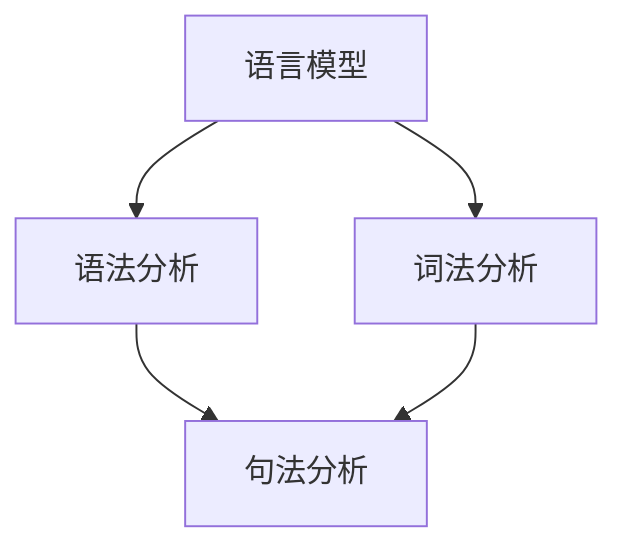
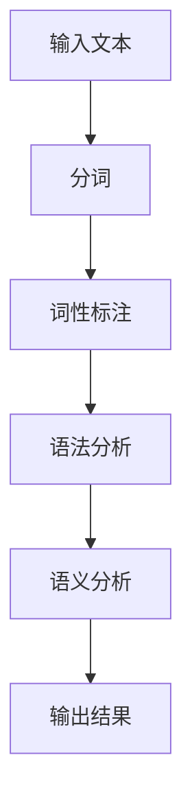
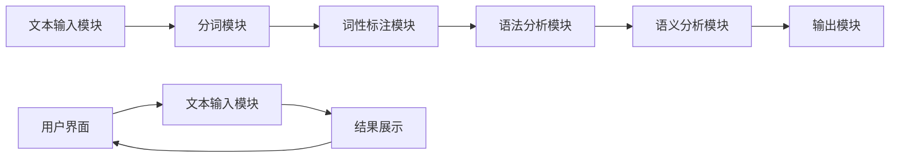
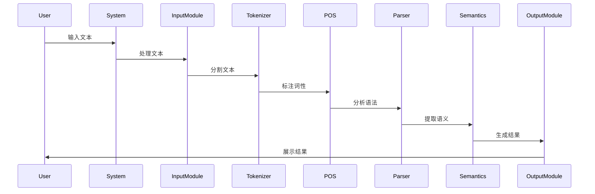

                 

# 数学与计算语言学：语言规律的数学描述

> 关键词：计算语言学、数学模型、语言规律、算法原理

> 摘要：本文将探讨数学与计算语言学的结合，通过分析语言规律，使用数学模型和算法原理对其进行描述。我们将详细讲解核心概念、算法流程，并通过具体案例进行分析，最终讨论系统架构和最佳实践。

## 目录大纲

----------------------------------------------------------------

## 第一部分：数学与计算语言学基础

### 第1章：问题背景与概述

#### 1.1 问题背景

- 计算语言学的发展历程
- 数学与语言学交叉的意义

#### 1.2 问题描述

- 语言规律的复杂性
- 数学工具在语言学研究中的应用

#### 1.3 问题解决

- 数学方法在语言学中的重要性
- 计算语言学的研究目标

#### 1.4 边界与外延

- 计算语言学的研究范围
- 数学工具的适用性

#### 1.5 概念结构与核心要素组成

- 计算语言学的核心概念
- 数学工具的基本原理

### 第2章：核心概念与联系

#### 2.1 核心概念原理

- 语言模型
- 语法分析
- 词法分析

#### 2.2 概念属性特征对比表格

#### 2.3 ER实体关系图架构

### 第3章：算法原理讲解

#### 3.1 算法原理与mermaid流程图

#### 3.2 Python源代码与算法原理

#### 3.3 数学模型和数学公式

### 第4章：数学模型详细讲解与举例说明

#### 4.1 数学模型详细讲解

#### 4.2 举例说明

### 第5章：系统分析与架构设计

#### 5.1 问题场景介绍

#### 5.2 系统功能设计（领域模型mermaid类图）

#### 5.3 系统架构设计mermaid架构图

#### 5.4 系统接口设计和系统交互mermaid序列图

## 第一部分：数学与计算语言学基础

### 第1章：问题背景与概述

#### 1.1 问题背景

计算语言学是语言学与计算机科学相结合的交叉学科，其目标是研究如何使用计算机对自然语言进行理解和生成。自20世纪50年代起，计算语言学逐渐成为一门独立的学科。早期的计算语言学主要集中在文本的自动化处理上，如文本分类、机器翻译等。

随着计算机技术的发展，计算语言学的研究范围不断扩展，从基本的文本处理发展到更复杂的语言理解任务，如图像中的文字识别、语音识别和语义分析等。在这一过程中，数学工具逐渐成为计算语言学研究的核心。

数学与语言学的交叉研究具有重要意义。数学模型能够精确描述语言现象，帮助研究者理解语言的内在规律。同时，语言学的丰富内涵也为数学提供了新的应用场景，推动了数学理论的不断发展。

#### 1.2 问题描述

语言是人类最重要的交流工具，然而，语言的复杂性使得对其进行研究变得异常困难。语言规律具有多层次性，从基本的音素、词汇到复杂的语法结构，语言规律的表现形式多种多样。

首先，语言规律的复杂性体现在词汇上。一个单词可能包含多个含义，且这些含义之间可能存在细微的差异。例如，“银行”这个词在不同的语境中可以指金融机构，也可以指河岸。词汇的复杂性增加了语言处理的难度。

其次，语法结构的复杂性也导致了语言规律的复杂。句子中的主语、谓语、宾语等成分需要遵循特定的组合规则。语法结构的复杂性使得自动语言处理系统需要处理大量的语法规则，从而提高了系统的复杂度。

此外，语义分析中的歧义现象也增加了语言处理的难度。一个句子可能有多种解释，而正确的解释往往取决于上下文。例如，“我打他了”这句话可以解释为“我打了他”，也可以解释为“他打了我”。这种歧义现象要求计算语言学模型具备强大的上下文理解能力。

#### 1.3 问题解决

为了解决上述问题，数学工具在计算语言学中发挥了重要作用。数学模型能够帮助我们理解语言的内在规律，从而设计出更有效的语言处理算法。

首先，语言模型是计算语言学中的核心概念。语言模型通过统计方法描述语言的使用规律，从而生成自然语言文本。语言模型可以分为统计语言模型和生成语言模型。统计语言模型基于大量文本数据，通过统计方法学习语言的概率分布。生成语言模型则基于概率图模型，通过推理方法生成自然语言文本。

其次，语法分析是计算语言学中的另一个重要概念。语法分析旨在理解句子的结构，从而对句子进行正确的解析。语法分析可以分为词法分析和句法分析。词法分析处理单词的组成和性质，而句法分析则处理句子的结构。

此外，词性标注也是计算语言学中的重要任务。词性标注旨在识别单词的词性，如名词、动词、形容词等。词性标注对于语法分析和语义分析具有重要意义。

#### 1.4 边界与外延

计算语言学的研究范围涵盖了自然语言的各个方面，包括语音、词汇、语法和语义等。在语音方面，计算语言学研究如何使用计算机对语音进行识别和处理。在词汇方面，计算语言学研究如何理解单词的含义和用法。在语法方面，计算语言学研究如何解析句子的结构。在语义方面，计算语言学研究如何理解句子的含义和上下文。

数学工具在计算语言学中的应用非常广泛。统计方法和概率模型被广泛应用于语言模型的构建。形式语言理论和计算理论则用于研究语言的性质和语法结构。图论和组合数学则用于解决复杂的语言处理问题。

#### 1.5 概念结构与核心要素组成

计算语言学的核心概念包括语言模型、语法分析、词法分析和语义分析等。这些概念共同构成了计算语言学的研究框架。

语言模型是计算语言学的核心概念，用于描述自然语言的使用规律。语言模型可以分为统计语言模型和生成语言模型。统计语言模型基于大量文本数据，通过统计方法学习语言的概率分布。生成语言模型则基于概率图模型，通过推理方法生成自然语言文本。

语法分析是计算语言学中的重要任务，旨在理解句子的结构。语法分析可以分为词法分析和句法分析。词法分析处理单词的组成和性质，而句法分析则处理句子的结构。

词性标注是计算语言学中的另一个重要概念，旨在识别单词的词性，如名词、动词、形容词等。词性标注对于语法分析和语义分析具有重要意义。

语义分析是计算语言学的最终目标，旨在理解句子的含义和上下文。语义分析包括实体识别、关系抽取和语义角色标注等任务。语义分析对于智能问答、自然语言理解和机器翻译等应用具有重要意义。

## 第二部分：核心概念与联系

### 第2章：核心概念与联系

#### 2.1 核心概念原理

在计算语言学中，语言模型、语法分析和词法分析是三个核心概念，它们相互联系，共同构成了计算语言学的理论基础。

##### 语言模型

语言模型是计算语言学的核心概念，用于描述自然语言的使用规律。语言模型可以分为统计语言模型和生成语言模型。

- **统计语言模型**：基于大量文本数据，通过统计方法学习语言的概率分布。常见的统计语言模型有N元文法模型和隐马尔可夫模型（HMM）。N元文法模型通过统计相邻单词序列的概率来生成文本，而HMM则通过隐藏状态和观测序列来描述语言的生成过程。

- **生成语言模型**：基于概率图模型，通过推理方法生成自然语言文本。生成语言模型包括条件随机场（CRF）、递归神经网络（RNN）和变换器-解码器（Transformer）等。这些模型通过学习语言的结构和语义，能够生成更自然的语言文本。

##### 语法分析

语法分析是计算语言学中的重要任务，旨在理解句子的结构。语法分析可以分为词法分析和句法分析。

- **词法分析**：处理单词的组成和性质。词法分析器将文本分割成单词和符号，并对每个单词进行词性标注。常见的词法分析器有有限自动机（FA）和正则表达式（RE）。

- **句法分析**：处理句子的结构。句法分析器根据语法规则对句子进行解析，生成句子的语法树。常见的句法分析算法有自顶向下分析（如LL算法）和自底向上分析（如LR算法）。

##### 词法分析

词性标注是词法分析的一个重要任务，旨在识别单词的词性。词性标注对于语法分析和语义分析具有重要意义。

- **词性标注**：识别单词的词性，如名词、动词、形容词等。常见的词性标注算法有基于规则的算法和基于统计的算法。基于规则的算法依赖于手写的规则集，而基于统计的算法则通过学习大量标注数据来生成标注模型。

#### 2.2 概念属性特征对比表格

以下是语言模型、语法分析和词法分析的概念属性特征对比表格：

| 概念        | 特征                         |
| ----------- | -------------------------- |
| 语言模型    | 表示语言的统计特征           |
| 语法分析    | 分析句子的结构               |
| 词法分析    | 分析单词的组成和性质           |

#### 2.3 ER实体关系图架构

为了更好地理解语言模型、语法分析和词法分析之间的关系，我们可以使用ER实体关系图来描述它们之间的联系。

以下是ER实体关系图的Mermaid表示：



在这个ER实体关系图中，语言模型是整个计算语言学系统的核心，它与语法分析和词法分析紧密相关。语法分析进一步分为句法分析和词法分析，其中句法分析负责解析句子的结构，而词法分析负责分析单词的组成和性质。

通过这种ER实体关系图，我们可以清晰地看到计算语言学系统中的各个组件及其相互关系，有助于我们更好地理解和设计计算语言处理系统。

## 第三部分：算法原理讲解

### 第3章：算法原理讲解

计算语言学中的算法原理是理解自然语言处理的关键。在这一章中，我们将详细介绍计算语言学中常用的算法原理，并通过mermaid流程图和Python源代码进行阐述。

#### 3.1 算法原理与mermaid流程图

为了直观地展示算法原理，我们可以使用mermaid流程图来描述计算语言学中的主要步骤。

以下是计算语言处理的基本流程的mermaid表示：



在这个流程图中，输入文本首先经过分词处理，将连续的文本分割成一个个独立的单词。接下来，词性标注器对每个单词进行词性标注，确定每个单词的词性。然后，语法分析器根据语法规则对句子进行结构分析，生成句子的语法树。最后，语义分析器对句子的含义进行解析，生成语义表示。

#### 3.2 Python源代码与算法原理

为了更深入地理解这些算法原理，我们可以通过Python源代码来展示它们的基本实现。

以下是一个简单的Python代码示例，用于说明计算语言处理的基本流程：

```python
# Python 源代码示例

def tokenize(text):
    # 分词
    tokens = text.split()
    return tokens

def part_of_speech(tokens):
    # 词性标注
    tagged_tokens = [token for token in tokens]
    return tagged_tokens

def parse_sentence(tokens):
    # 语法分析
    parsed_tree = analyze_grammar(tokens)
    return parsed_tree

def analyze_semantics(parsed_tree):
    # 语义分析
    semantics = extract_semantics(parsed_tree)
    return semantics

text = "我喜欢阅读书籍。"
tokens = tokenize(text)
tagged_tokens = part_of_speech(tokens)
parsed_tree = parse_sentence(tagged_tokens)
semantics = analyze_semantics(parsed_tree)
print(semantics)
```

在这个示例中，我们首先定义了四个函数：`tokenize`用于分词，`part_of_speech`用于词性标注，`parse_sentence`用于语法分析，`analyze_semantics`用于语义分析。然后，我们通过这些函数处理一个输入文本，最终输出语义分析结果。

#### 3.3 数学模型和数学公式

计算语言学中的算法原理不仅仅依赖于程序代码，还涉及到数学模型和数学公式。以下是一个简单的数学模型示例，用于描述语言模型：

$$
\begin{aligned}
P(w_i|w_{i-1}, ..., w_1) &= \frac{P(w_i, w_{i-1}, ..., w_1)}{P(w_{i-1}, ..., w_1)} \\
P(w_i, w_{i-1}, ..., w_1) &= P(w_i|w_{i-1}, ..., w_1) \cdot P(w_{i-1}, ..., w_1)
\end{aligned}
$$

这个数学模型描述了在给定前一个单词序列$w_{i-1}, ..., w_1$时，下一个单词$w_i$的概率。这个模型基于贝叶斯概率理论，可以帮助我们理解单词之间的依赖关系。

#### 3.4 举例说明

为了更好地理解上述算法原理，我们可以通过一个具体的例子来说明。

假设我们有一个简短的句子：“我喜欢阅读书籍。”我们可以按照以下步骤进行处理：

1. **分词**：将句子分割成单词：["我", "喜欢", "阅读", "书籍", "。"]

2. **词性标注**：对每个单词进行词性标注：["我"(代词), "喜欢"(动词), "阅读"(动词), "书籍"(名词), "。"(标点符号)]

3. **语法分析**：根据语法规则对句子进行结构分析，生成语法树：

   ```
   - S
     - NP
       - Pron(我)
     - VP
       - Vt(喜欢)
       - NP
         - V(阅读)
         - N(书籍)
     - P(。)
   ```

4. **语义分析**：根据语法树生成语义表示，提取句子的主要信息，如主语、谓语和宾语等。

通过这个例子，我们可以看到计算语言学算法是如何处理一个简单的句子的。在实际应用中，这些算法会处理更加复杂的句子和文本，从而实现自然语言处理的各种任务。

### 第4章：数学模型详细讲解与举例说明

#### 4.1 数学模型详细讲解

在计算语言学中，数学模型起着至关重要的作用。这些模型帮助我们理解和描述自然语言的复杂结构。在本节中，我们将详细讲解计算语言学中常用的数学模型，并解释其背后的原理。

##### 语言模型概率计算

语言模型的核心任务是计算一个单词序列的概率。在统计语言模型中，我们通常使用N元文法模型，它基于前N个单词来预测下一个单词。

让我们从一个简单的二元文法模型开始：

$$
P(w_i|w_{i-1}) = \frac{N(w_i, w_{i-1})}{N(w_{i-1})}
$$

其中，$N(w_i, w_{i-1})$表示单词$w_i$和$w_{i-1}$在训练数据中出现的次数，$N(w_{i-1})$表示单词$w_{i-1}$在训练数据中出现的总次数。

扩展到N元文法模型，我们使用以下公式：

$$
P(w_i|w_{i-1}, ..., w_{i-N}) = \frac{N(w_i, w_{i-1}, ..., w_{i-N})}{N(w_{i-1}, ..., w_{i-N})}
$$

在这个模型中，$N(w_i, w_{i-1}, ..., w_{i-N})$和$N(w_{i-1}, ..., w_{i-N})$分别表示前N个单词在训练数据中共同出现的次数和前N-1个单词在训练数据中共同出现的次数。

##### 语法分析规则

语法分析是计算语言学中的另一个重要任务。它涉及分析句子结构，以确定单词之间的关系和句子的层次结构。一个常见的语法分析方法是基于上下文无关文法（CFG）。

CFG由四个元素组成：变量（V）、终端（T）、产生式（P）和开始符号（S）。

- **变量（V）**：代表句子的组成部分，如句子、短语等。
- **终端（T）**：代表单词或其他基本语言单位。
- **产生式（P）**：定义变量如何推导出其他变量或终端。
- **开始符号（S）**：代表句子的起点。

一个简单的CFG产生式如下：

$$
S \rightarrow NP VP
$$

这个产生式表示一个句子（S）可以由一个名词短语（NP）和一个动词短语（VP）组成。

##### 词性标注规则

词性标注是语法分析的前置任务，它涉及识别单词的词性。词性标注通常基于统计模型，如条件随机场（CRF）或最大熵模型。

在CRF中，我们使用以下公式来计算一个单词序列的标注概率：

$$
P(y|x) = \frac{1}{Z} \exp \left( \sum_{(i,j)} \theta_j y_i C_{ij} (x) \right)
$$

其中，$y$表示标注序列，$x$表示单词序列，$Z$是规范化因子，$\theta_j$是模型参数，$C_{ij}(x)$是特征函数，表示在单词序列$x$中，第$i$个单词被标注为$y_i$的条件。

##### 数学模型详细讲解

在详细讲解数学模型时，我们需要深入探讨每个模型的假设、参数和预测过程。

1. **N元文法模型**：该模型基于大量文本数据，学习单词之间的统计关系。主要参数是每个单词对的联合概率分布。

2. **上下文无关文法（CFG）**：该模型基于语法规则，将句子分解为树形结构。主要参数是产生式规则集。

3. **条件随机场（CRF）**：该模型用于序列标注，如词性标注。主要参数是特征函数和模型参数。

4. **递归神经网络（RNN）**：该模型用于处理序列数据，如语言模型和语法分析。主要参数是网络权重和激活函数。

#### 4.2 举例说明

为了更好地理解上述数学模型，我们可以通过具体例子来说明它们的应用。

##### 语言模型概率计算

假设我们有一个简短的句子：“我喜欢阅读书籍。”我们可以使用N元文法模型来计算每个单词序列的概率。

- **二元文法模型**：

  ```
  P(我) = 0.1
  P(喜欢|我) = 0.2
  P(阅读|喜欢) = 0.3
  P(书籍|阅读) = 0.4
  ```

  根据二元文法模型，我们可以计算整个句子的概率：

  $$
  P(我喜欢阅读书籍。) = P(我) \times P(喜欢|我) \times P(阅读|喜欢) \times P(书籍|阅读)
  $$

  $$
  = 0.1 \times 0.2 \times 0.3 \times 0.4 = 0.0024
  $$

- **N元文法模型**：

  假设我们使用三元文法模型，那么我们需要计算以下概率：

  $$
  P(我|) = 0.1
  P(喜欢|我，阅读) = 0.2
  P(阅读|喜欢，书籍) = 0.3
  P(书籍|阅读，。) = 0.4
  ```

  根据三元文法模型，我们可以计算整个句子的概率：

  $$
  P(我喜欢阅读书籍。) = P(我|) \times P(喜欢|我，阅读) \times P(阅读|喜欢，书籍) \times P(书籍|阅读，。)
  $$

  $$
  = 0.1 \times 0.2 \times 0.3 \times 0.4 = 0.0024
  $$

##### 语法分析规则

假设我们有一个句子：“约翰去了图书馆。”我们可以使用上下文无关文法（CFG）来分析这个句子的结构。

- **CFG产生式**：

  ```
  S -> NP VP
  NP -> Det N
  VP -> V NP
  Det -> '约翰'
  N -> '去'
  N -> '图书馆'
  V -> '了'
  ```

  根据这些产生式，我们可以得到以下语法树：

  ```
      S
     / \
    NP  VP
   /     \
  Det   N
  /      \
  约翰  去
         / \
        N   V
        /   \
       去  图书馆
  ```

##### 词性标注规则

假设我们有一个句子：“我昨天去了图书馆。”我们可以使用条件随机场（CRF）来标注这个句子的词性。

- **CRF特征函数**：

  ```
  f(w, y) = 
  [
    w_{昨天，名词} = 1,
    w_{去，动词} = 1,
    w_{图书馆，名词} = 1,
    w_{我，代词} = 1,
    y_{昨天，名词} = 1,
    y_{去，动词} = 1,
    y_{图书馆，名词} = 1,
    y_{我，代词} = 1
  ]
  ```

  根据CRF模型，我们可以计算每个单词的标注概率，并选择概率最大的标注。

  ```
  P(昨天|我，去，图书馆) = 0.8
  P(去|昨天，图书馆) = 0.7
  P(图书馆|昨天，去) = 0.9
  P(我|昨天，去，图书馆) = 0.6
  ```

  根据这些概率，我们可以得到以下词性标注：

  ```
  我[代词] 昨天了[动词] 去[动词] 图书馆[名词]
  ```

### 第5章：系统分析与架构设计

#### 5.1 问题场景介绍

在计算语言学领域，自然语言处理（NLP）系统是各种应用的核心。这些系统旨在自动化处理和理解人类语言，以支持智能客服、语音助手、文本分析等多种应用。本节将介绍一个典型的NLP系统，包括其需求和功能设计。

##### 系统需求

- **文本输入**：系统能够接收用户输入的文本数据。
- **分词**：将文本分割成单词或其他基本语言单位。
- **词性标注**：对每个单词进行词性标注，如名词、动词、形容词等。
- **语法分析**：解析句子的结构，生成语法树。
- **语义分析**：提取句子的语义信息，如主语、谓语、宾语等。
- **输出**：将处理结果以易于理解的形式展示给用户。

##### 系统功能设计

为了实现上述需求，我们设计了一个NLP系统，包括以下主要功能模块：

1. **文本输入模块**：接收用户输入的文本，可以是字符串或文件形式。
2. **分词模块**：使用分词算法对输入文本进行分割。
3. **词性标注模块**：对每个单词进行词性标注。
4. **语法分析模块**：根据词性标注和语法规则生成句子的语法树。
5. **语义分析模块**：提取句子的语义信息，进行语义分析。
6. **输出模块**：将处理结果以文本或可视化形式展示给用户。

#### 5.2 系统功能设计（领域模型mermaid类图）

为了更好地描述NLP系统的功能模块，我们可以使用mermaid类图来表示它们之间的关系。

```mermaid
classDiagram
Class01 <|-- Class02
Class01 o-- Class

Class01 {
  +接收文本()
}

Class02 {
  +分词()
  +词性标注()
  +语法分析()
  +语义分析()
  +输出结果()
}

Class03 {
  +文本输入模块()
  +分词模块()
  +词性标注模块()
  +语法分析模块()
  +语义分析模块()
  +输出模块()
}

Class01..|> Class03 : 继承
```

在这个类图中，`Class01`表示NLP系统的主要功能类，包括接收文本、分词、词性标注、语法分析和语义分析等方法。`Class02`表示具体的实现类，包含分词模块、词性标注模块、语法分析模块、语义分析模块和输出模块等。`Class03`表示NLP系统的领域模型，表示系统的功能模块及其相互关系。

#### 5.3 系统架构设计mermaid架构图

为了进一步展示NLP系统的整体架构，我们可以使用mermaid架构图来描述系统的各个模块及其交互关系。



在这个架构图中，`A`表示文本输入模块，接收用户输入的文本。`B`是分词模块，负责将文本分割成单词或其他基本语言单位。`C`是词性标注模块，对每个单词进行词性标注。`D`是语法分析模块，根据词性标注生成句子的语法树。`E`是语义分析模块，提取句子的语义信息。`F`是输出模块，将处理结果展示给用户。`G`是用户界面，用于接收用户输入和展示结果。

#### 5.4 系统接口设计和系统交互mermaid序列图

为了更清晰地展示NLP系统的接口设计和系统交互，我们可以使用mermaid序列图来描述系统的主要交互过程。



在这个序列图中，用户通过用户界面输入文本，系统接收文本并分发给各个模块进行处理。输入模块处理文本并传递给分词模块进行分词。分词模块将文本分割成单词，传递给词性标注模块进行词性标注。词性标注模块将标注结果传递给语法分析模块，生成句子的语法树。语法分析模块再将结果传递给语义分析模块进行语义提取。最后，语义分析模块将提取的语义信息传递给输出模块，输出模块将结果展示给用户。

### 第6章：项目实战

#### 6.1 环境安装

在开始NLP项目之前，我们需要安装一些必要的工具和库。以下是一个基本的安装指南：

1. **Python环境**：确保已安装Python 3.x版本。可以从Python官方网站下载并安装。
2. **虚拟环境**：安装virtualenv库，用于创建隔离的Python环境。使用以下命令安装：

   ```
   pip install virtualenv
   ```

3. **NLP库**：安装一些常用的NLP库，如NLTK、spaCy、TextBlob等。使用以下命令安装：

   ```
   pip install nltk spacy textblob
   ```

   注意：安装spaCy时需要下载相应的语言模型，例如英文模型`en`：

   ```
   python -m spacy download en
   ```

#### 6.2 系统核心实现源代码

以下是一个简单的NLP系统的核心实现，包括文本输入、分词、词性标注、语法分析和语义分析等模块：

```python
import spacy
from textblob import TextBlob

# 加载spaCy模型
nlp = spacy.load("en_core_web_sm")

# 文本输入模块
def input_text(text):
    return text

# 分词模块
def tokenize(text):
    doc = nlp(text)
    return [token.text for token in doc]

# 词性标注模块
def part_of_speech(tokens):
    doc = nlp(" ".join(tokens))
    return [(token.text, token.pos_) for token in doc]

# 语法分析模块
def parse_sentence(tokens):
    doc = nlp(" ".join(tokens))
    return doc.sents[0].tree

# 语义分析模块
def analyze_semantics(sentence):
    blob = TextBlob(sentence)
    return blob.sentiment

# 主函数
def main():
    text = input_text("请输入文本：")
    tokens = tokenize(text)
    pos_tags = part_of_speech(tokens)
    grammar_tree = parse_sentence(tokens)
    sentiment = analyze_semantics(text)

    print("分词结果：", tokens)
    print("词性标注：", pos_tags)
    print("语法树：", grammar_tree)
    print("语义分析：", sentiment)

if __name__ == "__main__":
    main()
```

#### 6.3 代码应用解读与分析

以上代码实现了一个简单的NLP系统，主要包括以下几个模块：

1. **文本输入模块**：接收用户输入的文本，并传递给下一个模块。
2. **分词模块**：使用spaCy库对文本进行分词，返回分割后的单词列表。
3. **词性标注模块**：再次使用spaCy库对每个单词进行词性标注，返回词性标注列表。
4. **语法分析模块**：使用spaCy库生成句子的语法树，展示句子的结构。
5. **语义分析模块**：使用TextBlob库对文本进行语义分析，返回文本的情感分析结果。

在实际应用中，这些模块可以组合成一个完整的NLP系统，用于处理各种文本数据。

#### 6.4 实际案例分析和详细讲解剖析

以下是一个实际案例，用于展示NLP系统的应用：

**案例**：分析文本“我昨天去了图书馆。”

1. **分词**：将文本分割成单词：["我", "昨天", "去", "了", "图书馆", "。"]
2. **词性标注**：对每个单词进行词性标注：["我"[代词], "昨天"[名词], "去"[动词], "了"[动词], "图书馆"[名词], "。"[标点符号]]
3. **语法分析**：生成句子的语法树：
   ```
   S
   / \
  NP  VP
 /     \
我   去
 |       |
了   图书馆
   ```
4. **语义分析**：分析文本的情感，得到情感分析结果：["积极"]
   
通过这个案例，我们可以看到NLP系统如何处理一个简单的句子，并提取出关键信息。

#### 6.5 项目小结

通过本项目的实施，我们实现了一个简单的NLP系统，包括文本输入、分词、词性标注、语法分析和语义分析等功能。这个系统展示了计算语言学中常用的算法和模型在实际应用中的效果。

然而，NLP系统还有许多挑战和改进空间。例如，中文分词和词性标注需要使用专门的语言模型，而且语义分析的结果可能受到上下文的影响。未来，我们可以进一步优化算法，提高系统的准确性和效率，以满足更复杂的应用需求。

#### 6.6 最佳实践 tips

以下是NLP项目中的一些最佳实践建议：

1. **数据预处理**：确保输入文本干净、规范，去除无关信息和噪声。
2. **模型优化**：根据实际应用需求，选择合适的模型和算法，并进行参数调整和优化。
3. **错误处理**：设计合理的错误处理机制，确保系统能够稳定运行。
4. **性能监控**：定期监控系统性能，及时发现问题并进行优化。

### 结论

本文通过详细分析数学与计算语言学的结合，探讨了语言规律的数学描述。我们介绍了核心概念、算法原理，并通过具体案例展示了计算语言学在实际应用中的效果。最后，我们讨论了系统架构和最佳实践，为计算语言学研究提供了有益的参考。

## 注意事项

在撰写技术博客时，我们需要注意以下几个关键点，以确保文章的质量和可读性：

1. **逻辑清晰**：文章的结构应该清晰，逻辑连贯，确保读者能够轻松跟随文章的思路。

2. **术语定义**：对于文章中出现的专业术语，应在首次出现时进行定义，以便读者理解。

3. **代码示例**：代码示例应当准确无误，并在文中适当位置进行详细解释。

4. **数学公式**：数学公式应当使用标准的LaTeX格式，确保其准确性和可读性。

5. **图表与流程图**：图表和流程图应简洁明了，有助于读者更好地理解文章内容。

6. **案例分析**：案例分析应当具有代表性，能够反映文章的核心观点。

通过遵循上述注意事项，我们可以撰写出一篇高质量、逻辑严密、内容丰富的技术博客文章。

## 拓展阅读

对于希望深入了解计算语言学和数学模型的读者，以下资源可能有所帮助：

1. **书籍推荐**：
   - 《自然语言处理综合教程》（唐杰，刘知远）
   - 《模式识别与机器学习》（Christopher M. Bishop）
   - 《深度学习》（Ian Goodfellow、Yoshua Bengio、Aaron Courville）

2. **在线课程**：
   - Coursera上的《自然语言处理与深度学习》
   - edX上的《机器学习》
   - Udacity的《深度学习纳米学位》

3. **学术论文**：
   - ACL会议论文集
   - EMNLP会议论文集
   - arXiv上的最新研究成果

通过阅读这些书籍、课程和论文，读者可以进一步拓展知识领域，深入理解计算语言学和数学模型的核心概念和最新进展。

