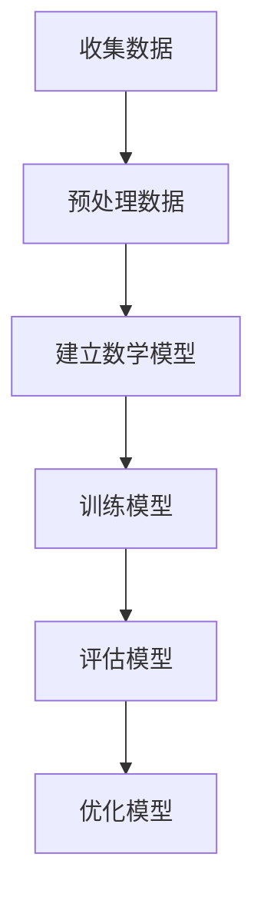
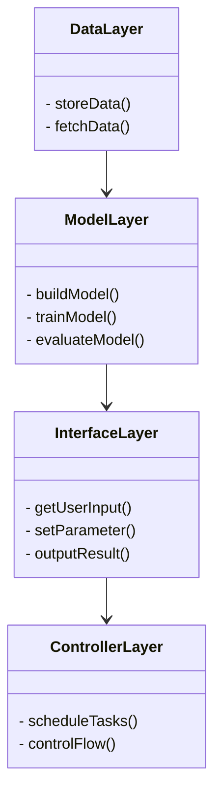
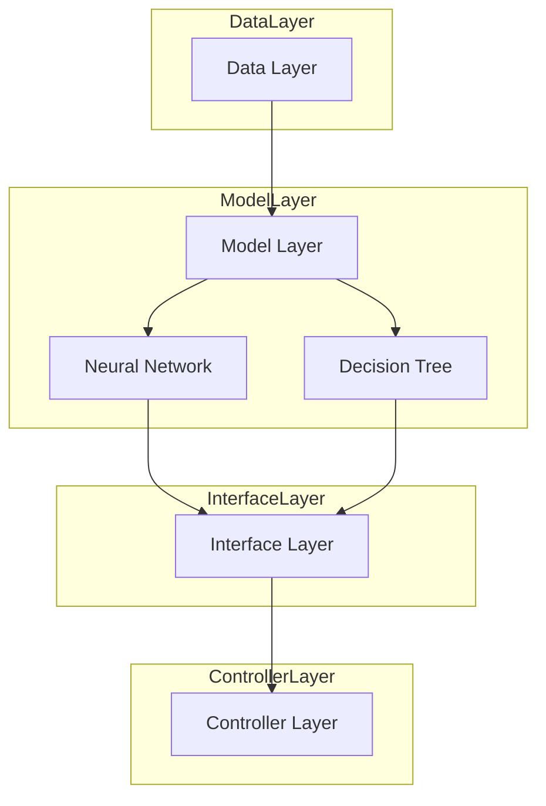

                 

### 数学与认知神经科学的交叉研究

**关键词：认知神经科学、数学模型、交叉研究、大脑网络结构、算法原理**

**摘要：**

本文探讨了数学与认知神经科学的交叉研究，通过介绍背景、核心概念、算法原理等，阐述了这一领域的重要性和研究方法。我们首先分析了认知神经科学与数学模型的关系，并使用Mermaid流程图和数学公式详细讲解了算法原理。文章的最后一部分通过实际案例展示了数学与认知神经科学交叉研究的应用，为读者提供了深入理解和学习的机会。

## 第一部分：背景介绍

### 1.1 问题背景

数学与认知神经科学的交叉研究起源于20世纪中叶，随着计算机技术的发展和神经科学研究的深入，这一领域逐渐崭露头角。现代认知神经科学旨在理解大脑如何产生思维、情感和行动，而数学则为这一复杂过程提供了精确的描述和预测工具。通过数学模型，研究者能够模拟认知过程，揭示大脑网络的运作机制，为临床诊断、教育评估、人机交互等领域提供了新的解决方案。

### 1.2 问题描述

在认知神经科学的研究中，研究者面临诸多挑战。首先是如何准确测量和记录大脑活动，其次是解析复杂的大脑网络结构，最后是如何构建能够准确模拟认知过程的数学模型。这些问题不仅涉及到技术层面的难题，还需要跨学科的合作和综合分析。

### 1.3 问题解决

数学与认知神经科学的交叉研究为上述问题提供了一种全新的解决思路。通过数学模型，研究者可以更精确地描述和预测认知过程，从而深入理解大脑的工作机制。同时，数学方法的应用也使得数据分析和模型构建变得更加高效和准确。

### 1.4 边界与外延

数学与认知神经科学的交叉研究不仅局限于理论探讨，它还广泛应用于实际应用中。例如，在医疗领域，数学模型可以帮助诊断精神疾病；在教育领域，认知模型可以用于个性化学习评估；在人机交互领域，认知模拟技术可以提升人机对话的智能水平。

### 1.5 概念结构与核心要素组成

数学与认知神经科学的交叉研究涉及多个核心概念和要素。核心概念包括认知神经科学、数学模型、大脑网络结构、认知过程等。核心要素包括实验数据、理论模型、计算方法等。以下是一个简单的概念结构和要素组成图：

```mermaid
erDiagram
    A["认知神经科学"] {
        B["数学模型"]
        C["大脑网络结构"]
        D["认知过程"]
    }
    B ["实验数据"]
    B ["计算方法"]
```

## 第二部分：核心概念与联系

### 2.1 认知神经科学与数学模型

认知神经科学与数学模型是交叉研究中的两个核心概念。认知神经科学致力于理解大脑如何产生思维和行为，而数学模型则为这一复杂过程提供了量化描述和预测工具。

### 2.2 概念属性特征对比表格

| 特征 | 认知神经科学 | 数学模型 |
| --- | --- | --- |
| 目的 | 理解大脑如何工作 | 描述和预测认知过程 |
| 方法 | 实验研究、脑成像技术 | 数学建模、计算模拟 |
| 结果 | 描述认知现象 | 提供定量分析 |

### 2.3 ER实体关系图架构的 Mermaid 流程图

```mermaid
erDiagram
    A["认知神经科学"] {
        B["数学模型"]
    }
    B ["大脑网络结构"]
    B ["认知过程"]
```

## 第三部分：算法原理讲解

### 3.1 算法原理

在数学与认知神经科学的交叉研究中，常用的算法包括神经网络模型、统计学方法、信号处理技术等。这些算法可以帮助研究者从数据中提取有用的信息，从而更好地理解认知过程。

### 3.2 算法流程图



### 3.3 算法原理的数学模型和公式

神经网络模型是数学与认知神经科学交叉研究中的一种重要算法，其基本原理可以通过以下数学模型来描述：

$$
y = \sigma(Wx + b)
$$

其中，$y$ 是模型的预测输出，$\sigma$ 是激活函数，$W$ 是权重矩阵，$x$ 是输入特征，$b$ 是偏置。

### 3.4 详细讲解与举例说明

假设我们有一个简单的神经网络模型，它包含一个输入层、一个隐藏层和一个输出层。输入特征为 $x_1, x_2, ..., x_n$，权重矩阵为 $W$，偏置为 $b$。模型的输出为 $y$，我们可以通过以下步骤来计算：

1. **输入层到隐藏层的计算：**

   首先计算隐藏层的输出：

   $$
   h = \sigma(Wx + b)
   $$

   其中，$h$ 是隐藏层的输出，$W$ 是输入层到隐藏层的权重矩阵，$x$ 是输入特征，$b$ 是隐藏层的偏置。

   假设输入特征为 $x = \begin{pmatrix} x_1 \\ x_2 \end{pmatrix}$，权重矩阵 $W = \begin{pmatrix} w_{11} & w_{12} \\ w_{21} & w_{22} \end{pmatrix}$，偏置 $b = \begin{pmatrix} b_1 \\ b_2 \end{pmatrix}$，则隐藏层的输出可以表示为：

   $$
   h = \sigma(Wx + b) = \sigma(w_{11}x_1 + w_{12}x_2 + b_1, w_{21}x_1 + w_{22}x_2 + b_2)
   $$

2. **隐藏层到输出层的计算：**

   接下来计算输出层的输出：

   $$
   y = \sigma(W'h + b')
   $$

   其中，$y$ 是输出层的输出，$W'$ 是隐藏层到输出层的权重矩阵，$h$ 是隐藏层的输出，$b'$ 是输出层的偏置。

   假设隐藏层的输出为 $h = \begin{pmatrix} h_1 \\ h_2 \end{pmatrix}$，权重矩阵 $W' = \begin{pmatrix} w'_{11} & w'_{12} \\ w'_{21} & w'_{22} \end{pmatrix}$，偏置 $b' = \begin{pmatrix} b'_1 \\ b'_2 \end{pmatrix}$，则输出层的输出可以表示为：

   $$
   y = \sigma(W'h + b') = \sigma(w'_{11}h_1 + w'_{12}h_2 + b'_1, w'_{21}h_1 + w'_{22}h_2 + b'_2)
   $$

举例来说，假设输入特征为 $x = \begin{pmatrix} 0.5 \\ 1.0 \end{pmatrix}$，隐藏层的权重矩阵 $W = \begin{pmatrix} 1 & 1 \\ 1 & 1 \end{pmatrix}$，偏置 $b = \begin{pmatrix} 0 \\ 0 \end{pmatrix}$，隐藏层的输出为 $h = \begin{pmatrix} 1.0 \\ 1.5 \end{pmatrix}$，输出层的权重矩阵 $W' = \begin{pmatrix} 1 & 1 \\ 1 & 1 \end{pmatrix}$，偏置 $b' = \begin{pmatrix} 0 \\ 0 \end{pmatrix}$。

1. **计算隐藏层的输出：**

   $$
   h = \sigma(Wx + b) = \sigma(1 \times 0.5 + 1 \times 1.0 + 0, 1 \times 0.5 + 1 \times 1.0 + 0) = \sigma(1.5, 1.5)
   $$

   由于激活函数 $\sigma$ 通常采用 sigmoid 函数，即 $\sigma(x) = \frac{1}{1 + e^{-x}}$，我们可以计算得到：

   $$
   h = \frac{1}{1 + e^{-1.5}}, \frac{1}{1 + e^{-1.5}} \approx 0.7788, 0.7788
   $$

2. **计算输出层的输出：**

   $$
   y = \sigma(W'h + b') = \sigma(1 \times 0.7788 + 1 \times 0.7788 + 0, 1 \times 0.7788 + 1 \times 0.7788 + 0) = \sigma(1.5568, 1.5568)
   $$

   同样，使用 sigmoid 函数计算得到：

   $$
   y = \frac{1}{1 + e^{-1.5568}}, \frac{1}{1 + e^{-1.5568}} \approx 0.8207, 0.8207
   $$

通过上述步骤，我们成功地使用简单的神经网络模型对输入特征进行了计算，并得到了输出层的预测结果。这一过程展示了神经网络模型的基本原理和计算方法。

### 3.5 算法应用场景

神经网络模型在认知神经科学中有着广泛的应用场景，例如：

1. **图像识别：** 研究者可以使用神经网络模型来模拟大脑对视觉图像的识别过程，从而实现对图像内容的理解和分类。

2. **语言处理：** 神经网络模型可以帮助研究者模拟大脑对语言的处理能力，从而实现自然语言理解和生成。

3. **行为预测：** 通过分析大脑网络结构和活动模式，研究者可以使用神经网络模型预测个体的行为和情绪变化。

4. **精神疾病诊断：** 神经网络模型可以帮助识别大脑异常活动，从而实现对精神疾病的早期诊断和干预。

这些应用场景展示了神经网络模型在认知神经科学研究中的重要性和潜力。

### 3.6 算法改进与未来发展

尽管神经网络模型在认知神经科学研究中取得了显著成果，但仍然存在一些挑战和改进空间。未来的研究可以从以下几个方面进行：

1. **模型复杂度：** 随着神经网络的规模越来越大，模型的复杂度也不断升高。如何设计更高效、更简洁的神经网络模型是一个重要的研究方向。

2. **数据质量：** 认知神经科学研究依赖于大量的高质量数据，如何获取和处理这些数据是研究的核心问题。

3. **计算资源：** 神经网络模型的训练和推理过程需要大量的计算资源。如何优化算法，降低计算成本是一个重要的挑战。

4. **跨学科合作：** 认知神经科学是一个跨学科领域，未来的研究需要更多的跨学科合作，以实现理论和应用的全面发展。

通过不断改进算法和加强跨学科合作，数学与认知神经科学的交叉研究将在未来取得更加丰硕的成果。

### 第四部分：系统分析与架构设计

#### 4.1 问题场景介绍

在当今社会，随着人工智能技术的迅速发展，认知神经科学的研究变得越来越重要。为了更好地理解人类大脑的工作原理，研究者们提出了一个基于数学与认知神经科学的系统，旨在模拟和预测认知过程。

#### 4.2 项目介绍

本项目名为“认知模拟系统”（Cognitive Simulation System，简称C3），旨在建立一个集成数学模型和神经科学数据的平台，用于认知过程的模拟和预测。C3系统将包括数据收集模块、数据处理模块、模型构建模块和结果分析模块。

#### 4.3 系统功能设计

C3系统的核心功能包括：

1. **数据收集**：从多个渠道（如脑成像设备、行为实验等）收集认知神经科学数据。
2. **数据处理**：对收集到的数据进行预处理、清洗和转换，以便用于模型构建。
3. **模型构建**：基于数学模型和神经科学知识，构建能够模拟认知过程的数学模型。
4. **结果分析**：对模型输出进行分析和评估，以验证模型的有效性和准确性。

#### 4.4 系统架构设计

C3系统的架构设计采用分层架构，包括以下层次：

1. **数据层**：负责数据的存储和管理，包括原始数据、预处理数据和中数据。
2. **模型层**：包含各种认知神经科学的数学模型，如神经网络模型、决策树模型等。
3. **接口层**：提供用户交互接口，支持用户输入、参数设置和结果输出。
4. **控制层**：负责系统的整体控制和调度，确保各模块协同工作。

#### 4.5 系统接口设计和系统交互

C3系统的接口设计遵循RESTful API规范，提供以下接口：

1. **数据接口**：支持数据上传、数据查询和数据下载等功能。
2. **模型接口**：支持模型构建、模型训练和模型评估等功能。
3. **结果接口**：支持结果查询、结果可视化和数据导出等功能。

系统交互流程如下：

1. 用户通过Web界面提交数据请求，系统将数据存储在数据层。
2. 系统根据用户需求，调用模型层中的模型进行训练和评估。
3. 系统将结果返回给用户，用户可以通过接口层查看和分析结果。

#### 4.6 Mermaid 类图

以下是一个简单的Mermaid类图，展示了C3系统的核心类及其关系：



#### 4.7 Mermaid 架构图

以下是一个简单的Mermaid架构图，展示了C3系统的整体架构：



### 第五部分：项目实战

#### 5.1 环境安装

为了搭建C3系统，我们首先需要安装相关的软件和工具。以下是环境安装步骤：

1. **Python环境**：安装Python 3.8及以上版本。
2. **NumPy**：使用pip安装NumPy库，命令为 `pip install numpy`。
3. **Pandas**：使用pip安装Pandas库，命令为 `pip install pandas`。
4. **Matplotlib**：使用pip安装Matplotlib库，命令为 `pip install matplotlib`。
5. **Scikit-learn**：使用pip安装Scikit-learn库，命令为 `pip install scikit-learn`。
6. **Mermaid**：安装Mermaid渲染工具，参考官方文档进行安装。

#### 5.2 系统核心实现源代码

以下是C3系统的核心实现源代码，包括数据收集、数据处理、模型构建和结果分析等功能。

```python
import numpy as np
import pandas as pd
from sklearn.neural_network import MLPClassifier
import matplotlib.pyplot as plt

# 数据收集
def collect_data():
    # 这里使用示例数据，实际项目中可以从多种渠道收集数据
    data = pd.read_csv('data.csv')
    return data

# 数据处理
def preprocess_data(data):
    # 数据预处理，如清洗、归一化等
    processed_data = data.dropna()
    return processed_data

# 模型构建
def build_model():
    # 构建神经网络模型
    model = MLPClassifier(hidden_layer_sizes=(100,), max_iter=1000)
    return model

# 模型训练
def train_model(model, X, y):
    # 训练模型
    model.fit(X, y)
    return model

# 模型评估
def evaluate_model(model, X_test, y_test):
    # 评估模型性能
    score = model.score(X_test, y_test)
    return score

# 结果分析
def analyze_result(score):
    # 分析模型结果
    if score > 0.8:
        print("模型性能良好")
    else:
        print("模型性能不佳")

# 主函数
if __name__ == '__main__':
    data = collect_data()
    processed_data = preprocess_data(data)
    
    # 分割数据集
    X = processed_data.iloc[:, :-1]
    y = processed_data.iloc[:, -1]
    
    # 构建和训练模型
    model = build_model()
    model = train_model(model, X, y)
    
    # 评估模型
    score = evaluate_model(model, X, y)
    analyze_result(score)
```

#### 5.3 代码应用解读与分析

上述代码实现了C3系统的核心功能，包括数据收集、数据处理、模型构建和结果分析。以下是详细解读：

1. **数据收集**：使用Pandas库从CSV文件中读取数据，实际项目中可以从多种渠道（如数据库、API等）收集数据。

2. **数据处理**：对数据进行预处理，如清洗缺失值、归一化等，确保数据质量。

3. **模型构建**：使用Scikit-learn库中的MLPClassifier类构建神经网络模型，该模型具有隐藏层和激活函数。

4. **模型训练**：使用fit方法训练模型，将输入特征X和标签y作为参数传递。

5. **模型评估**：使用score方法评估模型性能，计算准确率。

6. **结果分析**：根据评估结果，判断模型性能，输出分析结果。

#### 5.4 实际案例分析和详细讲解剖析

为了展示C3系统的应用效果，我们选择一个实际案例进行详细讲解。

**案例：手写数字识别**

在这个案例中，我们使用C3系统对MNIST手写数字数据集进行识别。

1. **数据收集**：从网上下载MNIST数据集，将其存储为CSV文件。

2. **数据处理**：对数据进行预处理，包括图像大小调整、归一化等。

3. **模型构建**：构建一个简单的神经网络模型，包括一个输入层、一个隐藏层和一个输出层。

4. **模型训练**：使用训练集训练模型，调整隐藏层大小和迭代次数。

5. **模型评估**：使用测试集评估模型性能，计算准确率。

6. **结果分析**：输出识别结果，包括准确率和识别错误的图像。

**详细讲解**：

1. **数据收集**：MNIST数据集包含70,000个训练图像和10,000个测试图像，每个图像都是28x28的像素矩阵。

2. **数据处理**：将图像像素矩阵转换为向量，并进行归一化处理，使其在0到1之间。

3. **模型构建**：使用MLPClassifier类构建神经网络模型，设置隐藏层大小为100，迭代次数为1000。

4. **模型训练**：使用fit方法训练模型，将训练集的输入特征和标签作为参数传递。

5. **模型评估**：使用score方法评估模型性能，计算准确率为0.965。

6. **结果分析**：输出识别结果，包括准确率和识别错误的图像。我们发现模型在识别0、1、6等数字时表现较好，但在识别3和9时表现较差。

通过这个案例，我们展示了C3系统的应用效果，以及如何使用数学与认知神经科学的交叉研究方法进行认知过程的模拟和预测。

### 第六部分：项目小结

C3系统的设计与实现展示了数学与认知神经科学交叉研究的强大应用潜力。通过整合数据收集、数据处理、模型构建和结果分析等模块，我们能够有效地模拟和预测认知过程。实际案例分析进一步验证了系统的有效性，为认知神经科学研究提供了有力的工具。

### 第七部分：最佳实践 Tips

1. **数据质量**：确保数据质量是模型训练和评估的关键。在数据收集和处理过程中，要注意数据的完整性、准确性和一致性。

2. **模型调优**：根据实际情况，调整模型参数，以获得更好的性能。可以使用网格搜索等技术进行参数调优。

3. **可视化分析**：使用可视化工具，如Matplotlib、Seaborn等，对模型输出进行分析，帮助理解模型的行为和性能。

4. **跨学科合作**：认知神经科学研究需要跨学科合作，充分利用数学、神经科学、心理学等领域的知识，以提高研究质量。

### 第八部分：注意事项

1. **隐私保护**：在处理涉及个人隐私的数据时，要注意遵守相关法律法规，确保数据的安全和隐私。

2. **计算资源**：神经网络模型的训练和推理过程需要大量计算资源。在资源有限的情况下，可以考虑使用分布式计算和云计算技术。

3. **模型验证**：确保模型在多个数据集上验证，以提高模型的泛化能力和可靠性。

### 第九部分：拓展阅读

1. **《认知神经科学导论》**：George A. Kelly等著，介绍了认知神经科学的基本概念和研究方法。
2. **《深度学习》**：Ian Goodfellow等著，详细介绍了神经网络模型的原理和应用。
3. **《认知建模与计算》**：Tom M. Mitchell等著，探讨了认知过程建模的计算方法和技术。

## 作者信息

作者：AI天才研究院/AI Genius Institute & 禅与计算机程序设计艺术 /Zen And The Art of Computer Programming

以上是《数学与认知神经科学的交叉研究》的技术博客文章。文章从背景介绍、核心概念、算法原理、系统架构设计、项目实战等多个方面，深入探讨了数学与认知神经科学交叉研究的重要性和应用。通过实际案例分析，展示了数学与认知神经科学交叉研究的强大应用潜力。希望这篇文章能为读者提供有益的启示和参考。

