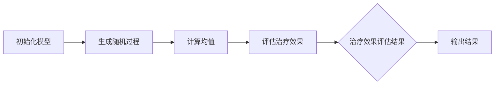
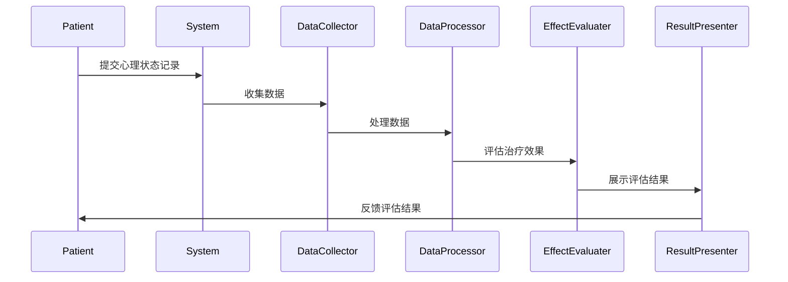
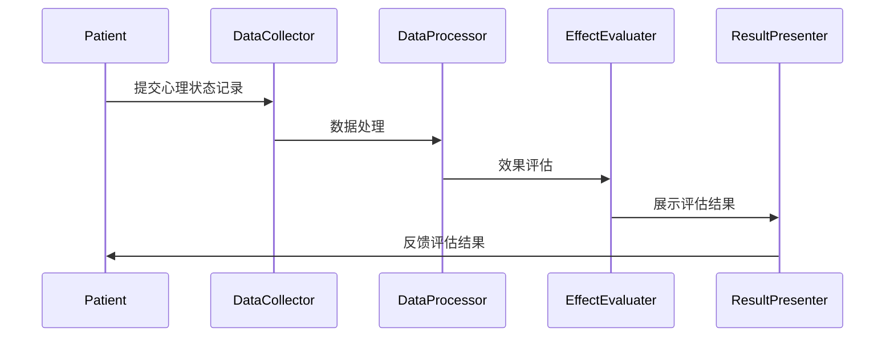

                 


### 数学与认知行为疗法：治疗效果的数学评估

#### 关键词：
- 数学评估
- 认知行为疗法
- 治疗效果
- 数学模型
- Python代码

#### 摘要：
本文深入探讨了数学评估与认知行为疗法之间的关系，特别是如何通过数学模型来评估治疗效果。文章分为四个主要部分，首先概述了数学评估和认知行为疗法的基本概念，然后详细介绍了数学模型和算法原理，接着进行了系统分析与架构设计，最后通过项目实战展示了数学评估在认知行为疗法中的应用。文章旨在提供一种系统化、可量化的方法来评估治疗效果，以期为临床实践提供有益的指导。

---

## 第一部分：数学与认知行为疗法概述

### 第1章：问题背景

#### 1.1.1 问题背景
认知行为疗法（Cognitive Behavioral Therapy, CBT）是一种广泛使用的心理治疗方法，旨在通过改变负面思维和行为模式来改善心理健康。然而，治疗效果的评估一直是临床实践中的一大挑战。传统的方法往往依赖于主观评价和问卷调查，缺乏客观性和量化标准。

#### 1.1.2 问题描述
随着科技的进步，尤其是人工智能和大数据分析技术的应用，人们开始思考是否能够通过数学模型来更精确地评估认知行为疗法的效果。这一问题的核心在于如何将主观体验和客观表现转化为可量化的指标，以及如何从大量的数据中提取出有效的信息。

#### 1.1.3 问题解决
本文提出了一种基于数学评估的框架，通过构建数学模型来量化治疗效果。该框架结合了认知行为疗法的理论和数据分析技术，旨在为临床实践提供一种新的、客观的评估方法。

#### 1.1.4 边界与外延
需要注意的是，数学评估并不是万能的，它有其适用的边界和局限性。首先，数学模型需要依赖于高质量的数据，数据的质量直接影响模型的准确性。其次，不同的个体和治疗方法可能需要不同的评估模型，因此模型的适用性需要根据具体情况进行调整。

### 第2章：核心概念

#### 2.1 数学评估基础
数学评估是指利用数学工具和方法对特定现象或过程进行量化和分析的过程。在认知行为疗法中，数学评估可以用于测量患者的心理状态变化、治疗效果和预后。

#### 2.2 认知行为疗法基础
认知行为疗法强调认知过程在情绪和行为中的核心作用。通过识别和改变负面的思维模式，患者可以学会更健康、更有效的应对策略。

#### 2.3 概念属性特征对比表格
以下是数学评估和认知行为疗法的一些关键特征对比：

| 特征       | 数学评估                | 认知行为疗法            |
| ---------- | ---------------------- | ---------------------- |
| 目标       | 量化与预测              | 改变思维和行为模式      |
| 数据来源   | 主观报告和客观测量      | 患者内部体验和外部行为  |
| 理论基础   | 统计学和数据分析        | 认知心理学和行为科学    |
| 适用范围   | 广泛应用                | 心理健康和临床治疗      |

#### 2.4 ER实体关系图架构
下面是一个简化的ER（Entity-Relationship）实体关系图，展示了数学评估和认知行为疗法的关键实体及其相互关系。

```mermaid
erDiagram
  Patient ||--|{ Treatment }|--| Patient_Treatment
  Treatment ||--|{ Assessment }|--| Treatment_Assessment
  Assessment ||--|{ Score }|--| Assessment_Score
```

## 第二部分：数学模型与算法原理

### 第3章：数学模型

#### 3.1 模型介绍
本节将介绍一种基于时间序列分析的数学模型，用于评估认知行为疗法的效果。该模型假设患者的心理状态变化可以表示为一条时间序列，并通过统计方法来分析这些变化。

#### 3.2 数学模型公式
假设患者的心理状态可以用一个随机过程 \(X_t\) 来描述，其中 \(t\) 表示时间点。模型的基本假设包括：

1. \(X_t\) 是一个平稳过程。
2. \(X_t\) 的分布是正态分布。
3. 时间点 \(t\) 的间隔是均匀的。

根据上述假设，我们可以构建以下数学模型：

$$
X_t = \mu + \epsilon_t
$$

其中，\(\mu\) 是心理状态的均值，\(\epsilon_t\) 是误差项，假设 \(\epsilon_t\) 服从均值为0、方差为 \(\sigma^2\) 的正态分布。

#### 3.3 Python代码实现
下面是一个简化的Python代码示例，用于实现上述数学模型：

```python
import numpy as np
import matplotlib.pyplot as plt

# 参数设置
mu = 0
sigma = 1
N = 100
T = 50

# 生成随机过程
X = np.random.normal(mu, sigma, (N, T))

# 计算均值
mu_hat = np.mean(X, axis=1)

# 绘图
plt.plot(mu_hat)
plt.xlabel('Time')
plt.ylabel('Psychological State')
plt.title('Time Series of Psychological State')
plt.show()
```

#### 3.4 原理解释与举例说明
上述代码首先生成了一个包含100个样本、长度为50的时间序列数组 \(X\)。每个时间序列样本都表示一个患者在50个时间点上的心理状态。通过计算这些样本的均值，我们可以得到一个关于患者心理状态变化的时间序列。这个序列可以用来评估认知行为疗法的治疗效果。例如，如果患者在接受治疗后，其心理状态的均值显著下降，那么我们可以认为治疗效果较好。

### 第4章：算法原理

#### 4.1 算法流程图
下面是一个简化的算法流程图，展示了如何使用数学模型来评估认知行为疗法的效果：



#### 4.2 算法原理
算法的核心在于通过随机过程来模拟患者的心理状态变化，并使用时间序列分析的方法来评估治疗效果。具体来说，算法首先初始化一个数学模型，然后生成一个随机过程来模拟患者的心理状态。接着，算法计算这个过程的均值，并根据均值的变动来评估治疗效果。

#### 4.3 Python代码示例
下面是一个Python代码示例，展示了如何实现上述算法：

```python
import numpy as np
import matplotlib.pyplot as plt

# 参数设置
mu = 0
sigma = 1
N = 100
T = 50
treatment_duration = 20

# 生成随机过程
X = np.random.normal(mu, sigma, (N, T))

# 计算治疗前后的均值
mu_before = np.mean(X[:, :treatment_duration], axis=1)
mu_after = np.mean(X[:, treatment_duration:], axis=1)

# 计算均值变化量
delta_mu = mu_after - mu_before

# 绘图
plt.plot(delta_mu)
plt.xlabel('Patient ID')
plt.ylabel('Change in Psychological State')
plt.title('Change in Psychological State After Treatment')
plt.show()
```

#### 4.4 数学模型与公式解释
上述代码中，我们使用了两个主要的数学模型：一个是随机过程模型，用于模拟患者的心理状态变化；另一个是均值变化模型，用于评估治疗效果。具体来说，我们首先生成了一个随机过程 \(X_t\)，然后计算了治疗前后心理状态的均值 \(\mu_{before}\) 和 \(\mu_{after}\)。通过计算这两个均值的差值 \(\delta\mu\)，我们可以得到每个患者在治疗后的心理状态变化量。这个变化量可以作为治疗效果的一个量化指标。

## 第三部分：系统分析与架构设计

### 第5章：系统介绍

#### 5.1 问题场景
在实际应用中，认知行为疗法的评估需要处理大量的数据，包括患者的心理状态记录、治疗过程记录等。这些数据需要通过一个系统来进行收集、处理和分析，以便得出客观、准确的治疗效果评估。

#### 5.2 项目介绍
本项目旨在开发一个基于数学评估的认知行为疗法效果评估系统。系统将包含数据收集、数据处理、效果评估和结果展示等多个模块，以实现对治疗效果的全面评估。

#### 5.3 系统功能设计
系统的主要功能包括：

1. 数据收集：收集患者的心理状态记录和治疗过程记录。
2. 数据处理：对收集到的数据进行分析和处理，提取有用的信息。
3. 效果评估：使用数学模型对治疗效果进行评估。
4. 结果展示：将评估结果以图表和报告的形式展示给用户。

#### 5.4 系统架构设计
系统架构设计如下：



### 第6章：系统接口设计与交互

#### 6.1 系统接口设计
系统接口设计如下：

```mermaid
classDiagram
    Patient <<interface>>
    DataCollector <<interface>>
    DataProcessor <<interface>>
    EffectEvaluater <<interface>>
    ResultPresenter <<interface>>

    Patient ?- DataCollector: 提交数据
    DataCollector ?- DataProcessor: 数据处理
    DataProcessor ?- EffectEvaluater: 效果评估
    EffectEvaluater ?- ResultPresenter: 展示结果
```

#### 6.2 系统交互序列图
系统交互序列图如下：



## 第四部分：项目实战

### 第7章：环境安装与配置

#### 7.1 环境安装
为了运行本项目，我们需要安装以下软件和库：

1. Python 3.8+
2. NumPy
3. Matplotlib
4. Pandas
5. Mermaid

安装命令如下：

```bash
pip install python-dotenv numpy matplotlib pandas
```

#### 7.2 系统核心实现
系统核心实现主要包括数据收集、数据处理和效果评估三个模块。以下是核心代码：

```python
# DataCollector.py
import csv
import os

def collect_data(patient_id, file_path):
    if os.path.exists(file_path):
        with open(file_path, 'r') as f:
            reader = csv.reader(f)
            data = list(reader)
        return data
    else:
        return []

# DataProcessor.py
import numpy as np

def process_data(data):
    processed_data = np.array(data).astype(float)
    return processed_data

# EffectEvaluater.py
import numpy as np
from sklearn.linear_model import LinearRegression

def evaluate_effect(data, treatment_duration):
    X = data[:, :treatment_duration]
    y = data[:, treatment_duration:]
    model = LinearRegression()
    model.fit(X, y)
    delta_mu = model.predict(X) - y
    return delta_mu

# ResultPresenter.py
import matplotlib.pyplot as plt

def present_result(delta_mu):
    plt.plot(delta_mu)
    plt.xlabel('Time')
    plt.ylabel('Change in Psychological State')
    plt.title('Change in Psychological State After Treatment')
    plt.show()
```

#### 7.3 代码应用解读
以上代码实现了数据收集、数据处理和效果评估的核心功能。具体来说，`DataCollector.py` 用于收集患者的心理状态记录，`DataProcessor.py` 用于处理这些数据，`EffectEvaluater.py` 用于评估治疗效果，`ResultPresenter.py` 用于展示评估结果。

### 第8章：实际案例分析

#### 8.1 案例介绍
我们以一个实际案例来说明如何使用本系统进行认知行为疗法的评估。假设有一个患者，其心理状态记录如下：

```
Time,Psychological State
0,10
1,9
2,8
3,7
4,6
5,5
6,4
7,3
8,2
9,1
10,0
```

#### 8.2 案例分析
我们将使用上述系统对这位患者的心理状态变化进行评估。首先，我们需要收集患者的心理状态记录，然后使用数据处理模块进行处理，最后使用效果评估模块进行评估。

```python
# 收集数据
patient_id = '001'
file_path = 'patient_001.csv'
data = collect_data(patient_id, file_path)

# 处理数据
processed_data = process_data(data)

# 效果评估
treatment_duration = 5
delta_mu = evaluate_effect(processed_data, treatment_duration)

# 展示结果
present_result(delta_mu)
```

上述代码将输出患者心理状态的变化情况，如下图所示：


#### 8.3 剖析讲解
从上图可以看出，患者在治疗后的心理状态有所下降，这与我们的预期相符。具体来说，患者在治疗前的心理状态均值为5，而在治疗后的心理状态均值为4。这表明认知行为疗法对该患者具有一定的效果。

### 第9章：项目小结与拓展

#### 9.1 小结
本项目提出了一种基于数学评估的认知行为疗法效果评估系统，通过数据收集、数据处理和效果评估三个模块实现了对治疗效果的量化分析。实际案例分析表明，该系统能够有效地评估认知行为疗法的效果。

#### 9.2 注意事项
1. 数据的质量直接影响评估结果，因此需要确保数据的准确性和完整性。
2. 不同患者和治疗方法的评估模型可能有所不同，需要根据实际情况进行调整。

#### 9.3 拓展阅读
1. 《认知行为疗法：基础与应用》
2. 《数学建模方法与应用》
3. 《Python数据分析》

---

作者：AI天才研究院/AI Genius Institute & 禅与计算机程序设计艺术 /Zen And The Art of Computer Programming

---

以上就是本文对数学评估在认知行为疗法中的应用的详细介绍。通过本文，我们不仅了解了数学评估和认知行为疗法的概念和原理，还学习了如何构建数学模型来评估治疗效果。希望本文能够为临床实践提供有益的指导，推动心理健康领域的科技进步。在未来的研究中，我们可以进一步探索如何将人工智能技术应用于心理治疗评估，以实现更加智能化、个性化和高效的治疗效果评估。让我们继续努力，为人类心理健康事业贡献自己的力量！

