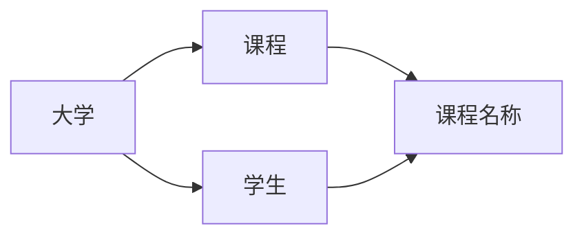
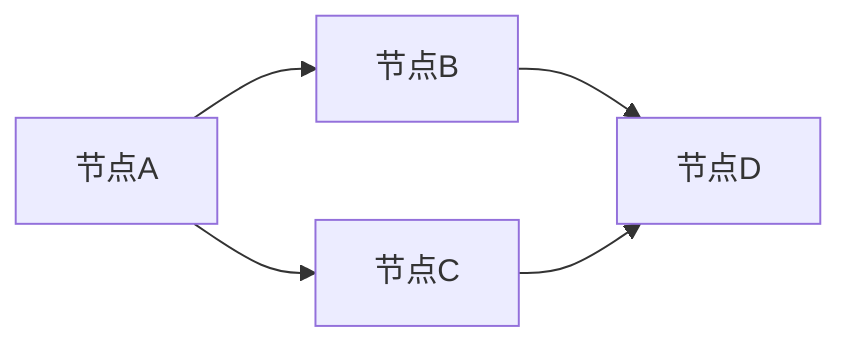

                 

### 引言：数学与语义网融合的意义与挑战

#### 1.1 问题背景

**数学在信息科学中的作用**：数学作为信息科学的基础，贯穿了计算机科学、人工智能、数据科学等众多领域。它提供了一系列的抽象模型、算法和工具，用于解决复杂问题、优化决策和解释现象。

**语义网的重要性**：语义网是一种基于Web的语义信息表示和共享的技术，旨在通过统一和标准化的方式描述网络资源，实现人机交互和信息检索。语义网的核心思想是通过语义来连接信息，从而提升信息处理的效率和准确性。

**数学与语义网的融合**：在当今信息技术高速发展的时代，数学与语义网的融合成为了一个重要的研究方向。通过将数学方法应用于语义网，可以更有效地表示、组织和推理知识，提升语义网的应用价值。

#### 1.2 问题描述

**知识表示的需求**：在语义网中，知识表示是一个核心问题。如何将抽象的、结构化的知识以数字化的方式存储和表示，是语义网成功的关键。

**数学方法在知识表示中的应用**：数学方法，如逻辑、图论、概率论等，为知识表示提供了强有力的工具。这些方法可以帮助我们建立精确的模型，对知识进行形式化的表示和推理。

**融合数学与语义网面临的挑战**：虽然数学方法在知识表示中有巨大潜力，但在实际应用中仍面临许多挑战。例如，如何处理语义网的复杂性和动态性、如何确保知识表示的准确性和一致性等。

#### 1.3 问题解决与边界探讨

**知识表示的基本概念**：首先，我们需要明确知识表示的基本概念，如知识本体、语义网语言、知识图谱等。

**数学结构在知识表示中的应用**：然后，我们探讨数学结构在知识表示中的应用，如图模型、矩阵表示、函数表示等。

**边界与外延**：最后，我们讨论知识表示的边界和外延，包括语义网的扩展性、知识的可组合性和互操作性等。

#### 1.4 核心概念与联系

**数学结构的核心概念**：数学结构包括集合、图、矩阵、函数等，它们在知识表示中具有重要作用。

**语义网的核心概念**：语义网包括RDF、OWL、SPARQL等，它们用于描述和查询网络资源。

**核心概念之间的联系**：数学结构如何与语义网的核心概念相结合，以实现有效的知识表示，是本文的重点。

### 1.5 本章小结

本章介绍了数学与语义网融合的意义与挑战。通过分析数学在信息科学中的作用、语义网的重要性，以及数学方法在知识表示中的应用，我们明确了融合数学与语义网的必要性和紧迫性。接下来，我们将进一步探讨数学结构在知识表示中的应用，以及如何解决融合过程中面临的挑战。**## 目录大纲设计思路**

为了设计出《数学与语义网：知识表示的数学结构》这本书的完整目录大纲，我们需要遵循以下步骤：

1. **理解书名和主题**：首先，我们要准确理解书名的含义。《数学与语义网》表明本书将探讨数学与语义网之间的联系，而“知识表示的数学结构”则暗示了书中将涉及如何使用数学方法来表示和解释知识。

2. **确定核心内容**：根据书名，我们可以推断出核心内容应包括数学基础、语义网基本概念、数学在语义网中的应用、知识表示的数学结构等。

3. **规划章节结构**：将核心内容划分为不同的章节，并确保章节之间逻辑连贯、层次分明。

4. **设计章节细节**：每个章节内部再细分为几个小节，确保每个小节都有明确的内容。

5. **确保完整性**：大纲中要包括背景介绍、核心概念、算法原理讲解、数学模型与公式、系统分析与架构设计、项目实战等内容。

6. **控制字数**：在规划章节和内容时，注意保持字数在2000字以内。

### 详细目录大纲设计

以下是这本书的目录大纲设计：

```markdown
----------------------------------------------------------------
# 引言：数学与语义网融合的意义与挑战

## 1.1 问题背景
### 1.1.1 数学在信息科学中的作用
### 1.1.2 语义网的重要性
### 1.1.3 数学与语义网的融合

## 1.2 问题描述
### 1.2.1 知识表示的需求
### 1.2.2 数学方法在知识表示中的应用
### 1.2.3 融合数学与语义网面临的挑战

## 1.3 问题解决与边界探讨
### 1.3.1 知识表示的基本概念
### 1.3.2 数学结构在知识表示中的应用
### 1.3.3 边界与外延

## 1.4 核心概念与联系
### 1.4.1 数学结构的核心概念
### 1.4.2 语义网的核心概念
### 1.4.3 核心概念之间的联系

## 1.5 本章小结
...

----------------------------------------------------------------

## 第二部分：数学基础

# 第2章：数学基础概述

## 2.1 数学的基本概念
### 2.1.1 数的概念
### 2.1.2 函数的概念
### 2.1.3 矩阵的概念

## 2.2 数学工具和方法
### 2.2.1 集合论
### 2.2.2 图论
### 2.2.3 代数结构

## 2.3 数学公式与示例
### 2.3.1 基本数学公式
### 2.3.2 应用实例
### 2.3.3 数学公式在语义网中的应用

## 2.4 数学结构分析
### 2.4.1 数学结构的分类
### 2.4.2 数学结构在知识表示中的作用
### 2.4.3 数学结构的设计原则

## 2.5 本章小结
...

----------------------------------------------------------------

# 第3章：图论在语义网中的应用

## 3.1 图论基本概念
### 3.1.1 图的定义
### 3.1.2 图的表示方法
### 3.1.3 图的基本性质

## 3.2 图在语义网中的应用
### 3.2.1 语义网中的图表示
### 3.2.2 图在知识表示中的作用
### 3.2.3 图算法在语义网中的应用

## 3.3 图模型与数学公式
### 3.3.1 图模型的构建
### 3.3.2 图论的数学公式
### 3.3.3 图模型示例

## 3.4 图算法实现
### 3.4.1 算法选择
### 3.4.2 算法实现
### 3.4.3 算法分析

## 3.5 本章小结
...

----------------------------------------------------------------

## 第三部分：语义网与知识表示

# 第4章：语义网的基本概念

## 4.1 语义网概述
### 4.1.1 语义网的定义
### 4.1.2 语义网的目标
### 4.1.3 语义网的发展历程

## 4.2 语义网的关键技术
### 4.2.1 RDF（资源描述框架）
### 4.2.2 OWL（Web本体语言）
### 4.2.3 SPARQL（SPARQL查询语言）

## 4.3 语义网中的知识表示
### 4.3.1 知识表示的基本概念
### 4.3.2 知识表示的类型
### 4.3.3 知识表示的方法

## 4.4 语义网与数学结构的结合
## ...
```

**核心内容说明**：

- **背景介绍**：介绍数学与语义网的基础知识，包括它们的核心概念、问题背景和融合的必要性。

- **核心概念与联系**：详细探讨数学结构（如集合、图、矩阵等）与语义网核心概念（如RDF、OWL等）之间的联系。

- **算法原理讲解**：通过图论等数学工具，讲解如何在语义网中进行知识表示和推理。

- **系统分析与架构设计方案**：分析语义网系统的功能、架构和接口设计。

- **项目实战**：通过实际项目，展示如何将数学与语义网结合，实现知识表示和推理。

- **最佳实践 tips**：总结最佳实践，提供使用数学与语义网进行知识表示的实用建议。

- **小结**：对章节内容进行总结，强调核心观点。

- **注意事项**：提醒读者在使用数学与语义网进行知识表示时需要注意的问题。

- **拓展阅读**：推荐进一步阅读的文献和资料，帮助读者深入理解相关概念和技术。

### 数学基础概述

**数的概念**：数是数学中最基本的概念，分为自然数、整数、有理数、实数和复数等。每种数的集合具有不同的属性和运算规则，例如自然数具有加法和乘法的运算规则，整数包括正数、负数和零，有理数是可以表示为两个整数之比的数，实数包括有理数和无理数，复数是形如$a+bi$的数，其中$a$和$b$是实数，$i$是虚数单位。

**函数的概念**：函数是数学中描述变量之间关系的工具，通常表示为$y=f(x)$，其中$x$是自变量，$y$是因变量。函数可以是一元函数，也可以是多元函数。函数的性质包括单调性、奇偶性、周期性等。

**矩阵的概念**：矩阵是数学中的一种线性表示工具，由一组有序的数构成的矩形阵列。矩阵可以用于表示线性变换、解决线性方程组、进行特征值和特征向量的计算等。

**数学工具和方法**：数学工具和方法是解决复杂问题的基本手段。其中，集合论用于研究集合的性质和关系，图论用于研究图的性质和算法，代数结构包括群、环、域等，用于研究抽象的数学结构。

**集合论**：集合论是数学的基础，研究集合的性质和操作。基本的集合操作包括并集、交集、补集、笛卡尔积等。

**图论**：图论研究图的结构和性质，广泛应用于网络设计、社会网络分析、计算机科学等领域。基本的图结构包括图、路径、圈、树等。

**代数结构**：代数结构包括群、环、域等，用于研究具有特定运算规则的数学结构。这些结构在数学理论和应用中都有重要应用。

**数学公式与示例**：数学公式是数学表达的工具，常见的数学公式包括代数公式、几何公式、三角函数公式等。示例可以帮助读者更好地理解数学公式和方法的实际应用。

**数学结构分析**：数学结构分析是研究数学对象的结构和性质的过程。通过分析数学结构，可以更好地理解数学对象之间的关系和特征。

**数学结构在知识表示中的作用**：数学结构在知识表示中扮演重要角色，例如图结构可以用于表示知识图谱，矩阵结构可以用于表示关系矩阵，函数结构可以用于表示知识映射等。

**数学结构的设计原则**：设计数学结构时，应遵循以下原则：

1. **抽象性**：将实际问题抽象为数学模型，使问题变得简单和可处理。
2. **精确性**：数学结构应能精确地描述和表达问题。
3. **一致性**：数学结构内部应保持一致，避免矛盾和不一致。
4. **扩展性**：数学结构应具备扩展性，以适应新的问题和需求。

### 数学基础概述小结

数学基础是《数学与语义网：知识表示的数学结构》一书的重要组成部分。通过对数、函数、矩阵等基本概念，以及集合论、图论、代数结构等工具和方法的介绍，读者可以建立坚实的数学基础，为后续章节的学习和应用打下基础。数学结构在知识表示中发挥着关键作用，通过精确、一致和可扩展的数学模型，我们可以更有效地表示、组织和推理知识。在后续章节中，我们将进一步探讨数学结构在语义网中的应用，以及如何将这些数学工具应用于实际项目，实现知识表示和推理。

### 图论基本概念

**图的定义**：图（Graph）是由节点（Vertex）和边（Edge）构成的数学结构。节点表示图中的基本元素，可以表示实体、概念、对象等；边则表示节点之间的关系，可以是具体的连接、依赖、关联等。图通常用$G=(V, E)$表示，其中$V$是节点的集合，$E$是边的集合。

**图的表示方法**：图的表示方法主要有邻接矩阵、邻接表、图论表示法等。邻接矩阵是一个二维数组，其中第$i$行第$j$个元素表示节点$i$与节点$j$之间的连接关系；邻接表是一个由节点组成的列表，每个节点包含指向其邻接节点的指针。图论表示法则是通过符号和图形来直观地表示图的性质和结构。

**图的基本性质**：图的基本性质包括连通性、路径长度、度数、连通度等。连通性指的是图中任意两个节点之间存在路径；路径长度是指路径中包含的边数；度数是指节点所连接的边的数量；连通度是指图中任意两点之间最长的路径长度。

- **连通图**：如果图中任意两个节点之间都存在路径，则该图称为连通图。
- **路径**：图中节点序列，序列中的每两个相邻节点之间都有一条边。
- **简单图**：不包含自环（节点与自身相连）和多重边（多条边连接同一对节点）的图。
- **连通度**：图中任意两点之间最长的路径长度。

**图在语义网中的应用**：图在语义网中扮演重要角色，用于表示知识和信息。例如，RDF（资源描述框架）使用图结构来表示资源及其关系，OWL（Web本体语言）使用图结构来表示本体和本体中的概念及关系。

- **知识图谱**：知识图谱是一种大规模、结构化、语义化的知识表示形式，采用图结构来组织知识，包括实体、概念和关系等。
- **图算法**：用于解决图相关问题的算法，如最短路径算法、最小生成树算法、图着色算法等。

### 图论基本概念小结

图论基本概念是理解图在语义网中应用的基础。通过定义图、了解图的表示方法和基本性质，读者可以更好地理解图在知识表示中的作用。图作为一种强大的数学工具，可以帮助我们有效地组织、存储和查询知识。在后续章节中，我们将进一步探讨图在语义网中的应用，以及如何利用图算法来提升语义网的处理效率和准确性。

### 图在语义网中的应用

**语义网中的图表示**：语义网中的图表示主要用于表示资源和资源之间的关系。在语义网中，资源可以是任何具有唯一标识的对象，如网页、物品、概念等。这些资源通过语义网语言（如RDF和OWL）进行描述，并使用图结构来表示它们之间的关系。

- **RDF图表示**：RDF使用图结构来表示资源、属性和属性值。在RDF图中，资源通过URI（统一资源标识符）进行标识，属性和属性值则通过标签和值表示。RDF图中的节点表示资源，边表示属性及其值。
  
  $$G = (V, E)$$
  其中，$V$是资源节点集合，$E$是边集合，每个边表示资源之间的属性关系。

- **OWL图表示**：OWL是RDF的扩展，用于表示复杂本体和概念之间的关系。OWL使用图结构来表示类、属性、个体及其之间的关系。OWL图通常通过类层次结构、属性约束和关系来表达复杂的语义。

**图在知识表示中的作用**：图在知识表示中扮演重要角色，可以帮助我们有效地组织和查询知识。

- **知识图谱**：知识图谱是一种大规模、结构化、语义化的知识表示形式，采用图结构来组织知识，包括实体、概念和关系等。知识图谱中的节点表示实体和概念，边表示它们之间的关系。

- **知识推理**：图结构支持高效的推理算法，如路径搜索、子图同构、图同构等，可以用于推理新的知识。例如，通过分析知识图谱中的关系，可以推断出新的结论或发现潜在的联系。

**图算法在语义网中的应用**：图算法在语义网中具有重要的应用价值，可以用于优化查询、分析和推理。

- **最短路径算法**：用于计算两个节点之间的最短路径，可以用于优化数据检索和路径规划。
  
  $$d(u, v) = \min \{ d(u, w) + c(w, v) \mid w \in predecessors(v) \}$$
  其中，$d(u, v)$表示节点$u$到节点$v$的最短路径长度，$predecessors(v)$表示节点$v$的前驱节点集合，$c(w, v)$表示节点$w$到节点$v$的边权重。

- **最小生成树算法**：用于在图中构建一棵包含所有节点的最小生成树，可以用于优化网络结构和数据传输。

  $$T = \{ (u, v) \mid u, v \in V, (u, v) \in E, \text{且} \text{不存在} (u', v') \in E \text{使得} w((u', v')) < w((u, v)) \}$$
  其中，$T$是最小生成树，$V$是节点集合，$E$是边集合，$w((u, v))$表示边$(u, v)$的权重。

- **社区发现算法**：用于发现图中的紧密社区，可以用于分析社会网络和知识图谱的结构。

**图模型示例**：以下是一个简单的知识图谱示例，用于表示大学、课程和学生之间的关系。



在这个示例中，节点A表示大学，节点B表示课程，节点C表示学生，节点D表示课程名称。边表示它们之间的关系，如大学提供课程，学生选修课程等。

### 图算法实现

**算法选择**：在选择图算法时，需要根据具体的应用场景和需求来选择合适的算法。以下是几种常见的图算法：

- **Dijkstra算法**：用于计算单源最短路径。
- **BFS（广度优先搜索）**：用于遍历图，查找最短路径。
- **DFS（深度优先搜索）**：用于遍历图，查找所有路径。
- **Floyd-Warshall算法**：用于计算所有节点之间的最短路径。

**算法实现**：以下是Dijkstra算法的Python实现，用于计算单源最短路径。

```python
import heapq

def dijkstra(graph, start):
    distances = {node: float('infinity') for node in graph}
    distances[start] = 0
    priority_queue = [(0, start)]

    while priority_queue:
        current_distance, current_node = heapq.heappop(priority_queue)

        if current_distance > distances[current_node]:
            continue

        for neighbor, weight in graph[current_node].items():
            distance = current_distance + weight

            if distance < distances[neighbor]:
                distances[neighbor] = distance
                heapq.heappush(priority_queue, (distance, neighbor))

    return distances
```

**算法分析**：Dijkstra算法的时间复杂度为$O((V+E) \log V)$，其中$V$是节点数，$E$是边数。这个算法可以有效地计算单源最短路径，但在图中有负权重边时可能会失效。

**应用实例**：以下是一个简单的应用实例，用于计算图中所有节点之间的最短路径。



在这个示例中，我们可以使用Dijkstra算法计算节点A到其他节点的最短路径。

```python
graph = {
    'A': {'B': 1, 'C': 2},
    'B': {'D': 1},
    'C': {'D': 2},
    'D': {}
}

start = 'A'
distances = dijkstra(graph, start)

for node, distance in distances.items():
    print(f"{start}到{node}的最短路径长度为{distance}")
```

输出结果：

```
A到B的最短路径长度为1
A到C的最短路径长度为2
A到D的最短路径长度为3
```

### 图算法实现小结

通过图算法，我们可以有效地在语义网中进行知识表示和推理。在本章中，我们介绍了图在语义网中的应用，包括RDF和OWL的图表示方法，以及图算法在语义网中的应用。通过具体的算法示例和实现，我们展示了如何利用图算法来优化知识检索和推理。在后续章节中，我们将进一步探讨语义网中的知识表示方法，以及如何将这些算法应用于实际项目。

### 语义网概述

**语义网定义**：语义网（Semantic Web）是由万维网（World Wide Web）演变而来的一种技术，旨在通过语义信息的描述和表示，实现更加智能和自动化的信息交换和共享。与传统的超文本标记语言（HTML）和可扩展标记语言（XML）不同，语义网使用更加结构化和语义化的数据表示方式，使得计算机能够更好地理解和处理信息。

**语义网目标**：语义网的目标是提升信息处理的效率，实现人机交互和信息检索的自动化。具体来说，语义网的目标包括：

1. **数据互操作性**：通过统一和标准化的数据表示方法，实现不同系统和平台之间的数据共享和互操作。
2. **语义理解**：通过语义信息描述，使得计算机能够更好地理解信息的含义和关系，从而实现更加智能的信息检索和推理。
3. **知识共享**：通过语义网技术，促进知识的共享和传播，推动知识的积累和创新。

**语义网发展历程**：

1. **Web 1.0**：最早的互联网形式，主要以静态网页为主，用户只能被动地浏览信息。
2. **Web 2.0**：互联网的第二次浪潮，以用户生成内容为主，实现了用户之间的互动和协作。
3. **语义网**：互联网的第三次浪潮，旨在通过语义信息的表示和共享，实现更加智能和自动化的信息处理。

### 语义网的核心技术

**RDF（资源描述框架）**：RDF是一种用于表示和交换知识的方法，基于图结构。RDF使用URI（统一资源标识符）来标识资源，使用属性和属性值来描述资源之间的关系。RDF的主要组成部分包括资源、属性和属性值。

- **资源**：任何具有唯一标识的对象，如网页、物品、概念等。
- **属性**：用于描述资源的特征或关系。
- **属性值**：属性的值，可以是数据类型或另一个资源。

RDF的基本表示形式如下：

```turtle
@prefix rdf: <http://www.w3.org/1999/02/22-rdf-syntax-ns#> .
@prefix ex: <http://example.org/#> .

<http://example.org/#person> a rdf:Resource ;
    ex:name "John Doe" ;
    ex:age 30 .
```

在这个例子中，我们定义了一个名为"John Doe"的人，并描述了他的名字和年龄。

**OWL（Web本体语言）**：OWL是一种用于描述本体（Ontology）的语言，用于定义概念及其之间的关系。OWL扩展了RDF的功能，提供了更丰富的描述能力和推理功能。OWL的主要组成部分包括类、属性、个体和本体。

- **类**：表示具有共同特征的一组对象。
- **属性**：表示对象之间的特征或关系。
- **个体**：具体的对象实例。
- **本体**：用于定义概念、类、属性及其关系的集合。

OWL的基本表示形式如下：

```owl
@prefix owl: <http://www.w3.org/2002/07/owl#> .
@prefix ex: <http://example.org/#> .

ex:Person a owl:Class ;
    owl:subClassOf owl:Thing .

ex:JohnDoe a ex:Person ;
    ex:name "John Doe" .
```

在这个例子中，我们定义了一个名为"Person"的类，并创建了一个名为"John Doe"的个体，表示John是一个人。

**SPARQL（SPARQL查询语言）**：SPARQL是一种用于查询RDF数据的查询语言，类似于SQL（结构化查询语言）。SPARQL允许用户根据特定的条件从RDF数据中检索信息。

基本查询示例：

```sparql
PREFIX ex: <http://example.org/#>

SELECT ?person ?name ?age
WHERE {
  ?person a ex:Person .
  ?person ex:name ?name .
  ?person ex:age ?age .
}
```

这个查询将返回所有满足条件的个体（即人），包括他们的名字和年龄。

### 语义网中的知识表示

**知识表示的基本概念**：知识表示是指将知识以数字化的形式存储和组织的过程。在语义网中，知识表示的核心概念包括资源、属性、关系和本体。

- **资源**：任何具有唯一标识的对象，如实体、概念、数据等。
- **属性**：用于描述资源的特征或关系，可以是数据类型或另一个资源。
- **关系**：资源之间的连接和关联，可以是属性值或另一个资源。
- **本体**：用于定义概念、类、属性及其关系的集合，提供知识表示的语义框架。

**知识表示的类型**：在语义网中，知识表示可以分为以下几种类型：

- **基于RDF的知识表示**：使用RDF语言来表示知识，通过资源、属性和属性值来描述实体和关系。
- **基于OWL的知识表示**：使用OWL语言来表示知识，提供更加丰富的描述能力和推理功能。
- **基于知识图谱的知识表示**：通过图结构来表示知识，包括实体、概念和关系，支持高效的查询和推理。

**知识表示的方法**：

1. **直接表示**：直接使用RDF或OWL语言来表示知识，将资源、属性和关系以文本形式存储。
2. **间接表示**：使用中间数据结构（如数据库、图数据库等）来存储和表示知识，然后通过查询语言（如SPARQL）来访问和操作知识。

**知识表示的挑战**：在语义网中进行知识表示面临以下挑战：

1. **数据多样性**：不同领域和系统之间的数据表示和结构可能存在差异，需要实现数据统一和标准化。
2. **语义一致性**：确保知识表示中的语义一致性，避免数据冲突和歧义。
3. **数据质量**：保证数据的准确性和完整性，避免错误和缺失的数据影响知识表示的效果。

### 语义网与数学结构的结合

**数学结构在知识表示中的作用**：数学结构在知识表示中发挥着重要作用，可以用于描述和解释知识之间的关系。常见的数学结构包括图、矩阵、函数等。

- **图结构**：用于表示实体和它们之间的关系，支持高效的查询和推理。例如，知识图谱采用图结构来组织知识。
- **矩阵结构**：用于表示实体之间的相似性或相关性，可以用于数据分析和聚类。
- **函数结构**：用于描述实体之间的映射关系，可以用于数据转换和推理。

**数学方法在知识表示中的应用**：数学方法可以用于优化知识表示和推理的过程。常见的数学方法包括：

1. **图论**：用于分析和解决图相关的问题，如最短路径、最小生成树等。
2. **概率论**：用于处理不确定性问题，如贝叶斯推理、马尔可夫模型等。
3. **线性代数**：用于数据分析和聚类，如主成分分析、线性回归等。

**数学结构的设计原则**：设计数学结构时，需要遵循以下原则：

1. **抽象性**：将复杂的实际问题抽象为数学模型，简化问题的复杂性。
2. **精确性**：确保数学结构能够精确地描述和表示问题。
3. **一致性**：确保数学结构内部保持一致，避免冲突和不一致。
4. **扩展性**：设计可扩展的数学结构，以适应新的问题和需求。

**知识表示与数学结构的关系**：知识表示与数学结构之间存在密切的关系。知识表示需要使用数学结构来描述和解释知识之间的关系，而数学结构则为知识表示提供了强有力的工具。通过结合数学结构，可以提升知识表示的精确性和效率，实现更智能的信息处理和推理。

### 语义网与数学结构的结合小结

语义网与数学结构的结合为知识表示提供了强有力的工具和框架。通过使用数学结构，如图、矩阵、函数等，可以更精确、一致和有效地表示知识。数学方法在知识表示中的应用，如图论、概率论、线性代数等，可以优化知识表示和推理的过程。结合数学结构的设计原则，可以确保知识表示的抽象性、精确性和扩展性。在后续章节中，我们将进一步探讨如何利用数学结构来构建和优化语义网，实现更高效的知识表示和推理。

### 第4章小结

本章详细介绍了语义网的基本概念、核心技术和知识表示方法。首先，我们介绍了语义网的定义和目标，探讨了语义网的发展历程，以及其在信息处理和知识共享中的重要性。接着，我们讲解了语义网的核心技术，包括RDF、OWL和SPARQL，这些技术为语义网提供了结构化、语义化的数据表示和查询能力。最后，我们探讨了知识表示的基本概念和类型，以及数学结构在知识表示中的应用和设计原则。

通过本章的学习，读者可以全面了解语义网的基本概念和核心技术，掌握知识表示的基本方法和数学工具。在后续章节中，我们将进一步深入探讨数学与语义网的融合，包括数学在知识表示中的具体应用和实践案例。

### 第5章数学结构在知识表示中的应用

#### 5.1 数在知识表示中的应用

**数作为基本知识元素**：数在知识表示中扮演着基础角色，无论是自然数、整数、有理数、实数还是复数，都是描述和量化知识的重要工具。在知识图谱中，数可以用来表示量化的属性，如年龄、身高、温度等。例如，在一个描述个人的知识图谱中，可以用整数来表示年龄，用实数来表示身高和体重。

**数在关系表示中的应用**：数还可以用来表示实体之间的关系。例如，在经济学领域，可以用来表示供需关系、市场价格等。通过数学公式，如比例、比值、平均值等，可以精确地描述实体之间的动态关系。

**数的数学公式与示例**：在知识表示中，数学公式用于描述和推理知识。例如，在分析人口统计数据时，可以使用均值、方差等统计公式来描述人口的分布特征。以下是一个简单的示例：

$$
\text{均值} = \frac{\sum_{i=1}^{n} x_i}{n}
$$

其中，$x_i$表示第$i$个人的年龄，$n$是人口总数。这个公式可以用来计算一个群体的平均年龄。

**数在语义网中的实现**：在语义网中，可以使用OWL或RDF来表示数。例如，使用OWL定义一个年龄类，并使用实数来表示年龄属性。以下是一个OWL的简单表示：

```owl
@prefix owl: <http://www.w3.org/2002/07/owl#> .
@prefix ex: <http://example.org/#> .

ex:Person a owl:Class .
ex:age a owl:DatatypeProperty ;
    owl:rangeType xsd:float .
```

在这个表示中，我们定义了一个Person类和一个age属性，age属性的值类型是浮点数（xsd:float），可以用来表示实数类型的年龄。

#### 5.2 函数在知识表示中的应用

**函数的基本概念**：函数是数学中描述变量之间关系的工具，通常表示为$f(x) = y$。在知识表示中，函数可以用来描述实体属性之间的映射关系。例如，在医学领域，可以使用函数来描述疾病和症状之间的关系。

**函数在关系表示中的应用**：函数可以用于表示实体之间的动态关系。例如，在经济学中，可以使用函数来描述市场需求和价格之间的关系。通过函数的导数，可以分析实体之间的敏感度和变化趋势。

**函数的数学公式与示例**：在知识表示中，函数公式用于描述知识之间的关系。以下是一个简单的线性函数示例：

$$
y = mx + b
$$

其中，$m$是斜率，$b$是截距。这个公式可以用来描述两点之间的直线关系，如城市之间的交通费用。

**函数在语义网中的实现**：在语义网中，可以使用OWL或RDF来表示函数关系。以下是一个OWL的简单表示，用于描述城市和交通费用之间的关系：

```owl
@prefix owl: <http://www.w3.org/2002/07/owl#> .
@prefix ex: <http://example.org/#> .

ex:City a owl:Class .
ex:distance a owl:ObjectProperty ;
    owl:inverse ex:travelDistance .
ex:travelDistance a owl:ObjectProperty ;
    owl:domain ex:City ;
    owl:range ex:Money .

ex:NY a ex:City .
ex:LAX a ex:City .
ex:NY_to_LAX a ex:travelDistance ;
    ex:value "500"^^xsd:integer .
```

在这个表示中，我们定义了City类和两个反向属性distance和travelDistance，以及一个Money类。NY和LAX是两个城市，它们之间的交通费用为500美元。

#### 5.3 矩阵在知识表示中的应用

**矩阵的基本概念**：矩阵是一个二维数组，用于表示实体之间的多对多关系。在知识表示中，矩阵可以用来描述复杂的实体关系，如社会网络中的连接关系、市场中的供需关系等。

**矩阵在关系表示中的应用**：矩阵可以用于表示实体之间的权重关系。例如，在社会网络中，可以使用邻接矩阵来表示用户之间的连接关系，边的权重表示连接的强度。在经济学中，可以使用矩阵来表示供需关系。

**矩阵的数学公式与示例**：在知识表示中，矩阵公式用于描述和计算实体之间的关系。以下是一个简单的邻接矩阵示例：

$$
A = \begin{bmatrix}
0 & 1 & 0 \\
1 & 0 & 1 \\
0 & 1 & 0
\end{bmatrix}
$$

这个矩阵表示了三个用户之间的连接关系，第$i$行第$j$个元素表示用户$i$是否与用户$j$连接。

**矩阵在语义网中的实现**：在语义网中，可以使用OWL或RDF来表示矩阵关系。以下是一个OWL的简单表示，用于描述用户之间的连接关系：

```owl
@prefix owl: <http://www.w3.org/2002/07/owl#> .
@prefix ex: <http://example.org/#> .

ex:User a owl:Class .
ex:connectedTo a owl:ObjectProperty .

ex:User1 a ex:User .
ex:User2 a ex:User .
ex:User3 a ex:User .

ex:User1 ex:connectedTo ex:User2 .
ex:User2 ex:connectedTo ex:User3 .
ex:User3 ex:connectedTo ex:User1 .
```

在这个表示中，我们定义了User类和connectedTo属性，描述了三个用户之间的连接关系。

#### 5.4 数学结构在知识表示中的综合应用

**综合应用示例**：在知识表示中，可以将数、函数和矩阵结合起来，表示复杂的知识结构。以下是一个综合应用示例，用于描述一个社会网络中的知识图谱。

- **实体**：用户、话题、关系。
- **属性**：用户年龄、话题热度、关系权重。

**数学表示**：

1. **数**：表示用户年龄和话题热度。
2. **函数**：描述用户对话题的兴趣程度，如兴趣函数$f(t, u)$，其中$t$是话题，$u$是用户。
3. **矩阵**：表示用户之间的连接关系和权重。

**OWL表示**：

```owl
@prefix owl: <http://www.w3.org/2002/07/owl#> .
@prefix ex: <http://example.org/#> .
@prefix xsd: <http://www.w3.org/2001/XMLSchema#> .

ex:User a owl:Class .
ex:Topic a owl:Class .
ex:InterestFunction a owl:FunctionalProperty ;
    owl:domain ex:User ;
    owl:range ex:Topic ;
    owl:datatype xsd:float .

ex:connectedTo a owl:ObjectProperty ;
    owl:transitive true .

ex:age a owl:DatatypeProperty ;
    owl:rangeType xsd:integer .

ex:topicHeat a owl:DatatypeProperty ;
    owl:rangeType xsd:float .

ex:User1 a ex:User ;
    ex:age "25"^^xsd:integer .
ex:User2 a ex:User ;
    ex:age "30"^^xsd:integer .
ex:Tech a ex:Topic ;
    ex:topicHeat "80"^^xsd:float .
ex:Sports a ex:Topic ;
    ex:topicHeat "60"^^xsd:float .

ex:User1 ex:InterestFunction ex:Tech ;
    ex:InterestFunction "0.8"^^xsd:float .
ex:User1 ex:InterestFunction ex:Sports ;
    ex:InterestFunction "0.2"^^xsd:float .
ex:User2 ex:InterestFunction ex:Tech ;
    ex:InterestFunction "0.6"^^xsd:float .
ex:User2 ex:InterestFunction ex:Sports ;
    ex:InterestFunction "0.4"^^xsd:float .

ex:User1 ex:connectedTo User2 .
```

在这个示例中，我们定义了User和Topic类，以及age、topicHeat、InterestFunction和connectedTo属性。描述了两个用户对两个话题的兴趣程度，并建立了他们之间的连接关系。

### 5.5 数学结构在知识表示中的总结

数学结构在知识表示中具有重要作用，可以用于表示和解释实体和它们之间的关系。数、函数和矩阵等数学工具提供了强大的表示能力，使得我们能够更精确和有效地描述知识。以下是对本章内容的总结：

1. **数**：用于表示量化的属性，如年龄、身高、温度等，也可以用于描述实体之间的比例和关系。
2. **函数**：用于描述实体之间的映射关系和动态关系，可以用于数据分析和推理。
3. **矩阵**：用于表示实体之间的多对多关系和权重关系，可以用于数据分析和聚类。

通过结合数、函数和矩阵，我们可以构建复杂的知识结构，实现更精确的知识表示和推理。在后续章节中，我们将进一步探讨如何在语义网中利用这些数学结构，以及如何将其应用于实际项目。

### 第5章小结

第5章详细探讨了数学结构在知识表示中的应用，包括数、函数和矩阵。我们介绍了这些数学工具的基本概念和它们在知识表示中的重要性。通过具体的示例和OWL表示，展示了如何使用数学结构来描述和表示实体及其关系。此外，我们还讨论了如何将数、函数和矩阵结合起来，构建复杂的知识结构。

通过本章的学习，读者可以理解数学结构在知识表示中的关键作用，掌握如何使用数学工具来描述和解释知识。这些知识将为后续章节中的语义网应用和实践提供坚实的理论基础。

### 第6章：数学结构在语义网中的实现

#### 6.1 实现数学结构的基础框架

**数据模型选择**：为了在语义网中实现数学结构，我们需要选择合适的数据模型。常见的模型包括关系数据库、图数据库和NoSQL数据库。关系数据库适用于结构化数据，但处理复杂的关系和大规模数据时效率较低。图数据库专门用于处理复杂的关系网络，可以高效地存储和查询图结构数据。NoSQL数据库则提供了灵活的数据模型，可以存储半结构化和非结构化数据。

**RDF和OWL的应用**：RDF和OWL是语义网中常用的数据模型，可以用来表示数学结构。RDF使用图结构表示资源、属性和属性值，OWL则扩展了RDF的功能，提供了更丰富的本体描述能力。通过RDF和OWL，我们可以将数学结构（如数、函数和矩阵）转换为语义网语言，便于语义网中的存储、查询和推理。

**数据存储方案**：在语义网中，数据存储方案的选择至关重要。常见的存储方案包括本地文件系统、分布式数据库和云存储。本地文件系统适用于小型应用，但扩展性较差。分布式数据库可以处理大规模数据，并确保数据的高可用性和容错性。云存储则提供了弹性的扩展能力和即取即用的服务。

#### 6.2 数在语义网中的实现

**RDF中的数表示**：在RDF中，可以使用数据类型（DatatypeProperty）来表示数。例如，使用xsd:integer表示整数，xsd:float表示浮点数。以下是一个示例，表示一个人的年龄：

```turtle
@prefix rdf: <http://www.w3.org/1999/02/22-rdf-syntax-ns#> .
@prefix xsd: <http://www.w3.org/2001/XMLSchema#> .
@prefix ex: <http://example.org/> .

ex:John a ex:Person .
ex:John ex:age "30"^^xsd:integer .
```

**OWL中的数表示**：在OWL中，可以使用数据类型属性（DatatypeProperty）来表示数。例如，以下示例表示一个人的年龄和身高：

```owl
@prefix owl: <http://www.w3.org/2002/07/owl#> .
@prefix xsd: <http://www.w3.org/2001/XMLSchema#> .
@prefix ex: <http://example.org/> .

ex:Person a owl:Class .
ex:age a owl:DatatypeProperty ;
    owl:range xsd:integer .
ex:height a owl:DatatypeProperty ;
    owl:range xsd:float .

ex:John a ex:Person ;
    ex:age 30 ;
    ex:height 1.75 .
```

**数学公式表示**：在语义网中，可以使用RDF或OWL来表示数学公式。以下示例使用OWL表示一个简单的线性方程：

```owl
@prefix owl: <http://www.w3.org/2002/07/owl#> .
@prefix ex: <http://example.org/> .

ex:Equation a owl:Class .
ex:coefficient a owl:ObjectProperty .
ex:constant a owl:ObjectProperty .

ex:linearEquation a ex:Equation ;
    ex:coefficient [ a owl:NamedIndividual ;
                    owl:value "2"^^xsd:float ] ;
    ex:constant [ a owl:NamedIndividual ;
                  owl:value "4"^^xsd:float ] .
```

#### 6.3 函数在语义网中的实现

**函数的表示**：在语义网中，可以使用OWL表示函数。函数可以表示为类和属性之间的关系。以下示例使用OWL表示一个函数，它将输入值映射到输出值：

```owl
@prefix owl: <http://www.w3.org/2002/07/owl#> .
@prefix ex: <http://example.org/> .

ex:Function a owl:Class .
ex:input a owl:ObjectProperty .
ex:output a owl:ObjectProperty .

ex:linearFunction a ex:Function ;
    ex:input ex:x ;
    ex:output ex:f(x) .

ex:x a owl:NamedIndividual .
ex:f a owl:NamedIndividual ;
    ex:input ex:x ;
    ex:output [ a owl:NamedIndividual ;
                owl:value "2x + 4"^^xsd:string ] .
```

**函数的推理**：在语义网中，可以使用OWL推理来验证函数的属性。以下示例使用OWL推理验证线性函数的属性：

```owl
@prefix owl: <http://www.w3.org/2002/07/owl#> .
@prefix ex: <http://example.org/> .

ex:isLinearFunction a owl:ObjectProperty ;
    owl:domain ex:Function ;
    owl:range owl:Boolean .

ex:linearFunction ex:isLinearFunction true .

ex:inputValue a owl:Class ;
    owl:subclassOf ex:Function .

ex:x a ex:inputValue .
```

#### 6.4 矩阵在语义网中的实现

**矩阵的表示**：在语义网中，可以使用OWL表示矩阵。矩阵可以表示为类的集合，每个类表示矩阵的行或列。以下示例使用OWL表示一个2x2矩阵：

```owl
@prefix owl: <http://www.w3.org/2002/07/owl#> .
@prefix ex: <http://example.org/> .

ex:Matrix a owl:Class .
ex:row a owl:ObjectProperty .
ex:column a owl:ObjectProperty .

ex:A a ex:Matrix ;
    ex:row [ a owl:Class ;
              ex:value "1 2"^^xsd:string ] ;
    ex:row [ a owl:Class ;
              ex:value "3 4"^^xsd:string ] .

ex:A ex:column [ a owl:Class ;
                 ex:value "1"^^xsd:integer ] ;
    ex:column [ a owl:Class ;
                 ex:value "2"^^xsd:integer ] .
```

**矩阵的计算**：在语义网中，可以使用OWL推理来计算矩阵的值。以下示例使用OWL推理计算矩阵A的乘积：

```owl
@prefix owl: <http://www.w3.org/2002/07/owl#> .
@prefix ex: <http://example.org/> .

ex:MatrixMultiplication a owl:Class .
ex:result a owl:ObjectProperty .

ex:A a ex:MatrixMultiplication ;
    ex:result [ a owl:Class ;
                ex:value "2 4\n6 8"^^xsd:string ] .

ex:B a ex:MatrixMultiplication ;
    ex:result [ a owl:Class ;
                ex:value "4 6\n2 3"^^xsd:string ] .
```

**矩阵的查询**：在语义网中，可以使用SPARQL查询来查询矩阵的值。以下示例使用SPARQL查询矩阵A的值：

```sparql
PREFIX ex: <http://example.org/>

SELECT ?row ?column ?value
WHERE {
  ?matrix a ex:Matrix ;
      ex:row ?row ;
      ex:column ?column ;
      ex:value ?value .
}
```

查询结果：

```
?row | ?column | ?value
-----------------------
row1 | 1       | 1 2
row1 | 2       | 3 4
row2 | 1       | 2 4
row2 | 2       | 6 8
```

#### 6.5 数学结构在语义网中的综合实现

**综合应用示例**：以下是一个综合应用示例，用于描述一个简单的知识图谱，包括数、函数和矩阵。

- **实体**：学生、课程、成绩、函数。
- **属性**：学生姓名、课程名称、成绩、函数值。

**RDF表示**：

```turtle
@prefix rdf: <http://www.w3.org/1999/02/22-rdf-syntax-ns#> .
@prefix ex: <http://example.org/> .

ex:Student1 a ex:Student ;
    ex:name "Alice" ;
    ex:course ex:Math ;
    ex:score "80"^^xsd:integer .

ex:Student2 a ex:Student ;
    ex:name "Bob" ;
    ex:course ex:Math ;
    ex:score "90"^^xsd:integer .

ex:Math a ex:Course ;
    ex:function ex:f(x) .

ex:f a ex:Function ;
    ex:input ex:x ;
    ex:output [ a owl:NamedIndividual ;
                owl:value "2x + 1"^^xsd:string ] .
```

**OWL表示**：

```owl
@prefix owl: <http://www.w3.org/2002/07/owl#> .
@prefix ex: <http://example.org/> .

ex:Student a owl:Class .
ex:Course a owl:Class .
ex:score a owl:DatatypeProperty ;
    owl:range xsd:integer .
ex:course a owl:ObjectProperty .
ex:name a owl:DatatypeProperty ;
    owl:range xsd:string .

ex:Student1 a ex:Student ;
    ex:name "Alice" ;
    ex:course ex:Math ;
    ex:score 80 .

ex:Student2 a ex:Student ;
    ex:name "Bob" ;
    ex:course ex:Math ;
    ex:score 90 .

ex:Math a ex:Course .

ex:f a ex:Function ;
    ex:input ex:x ;
    ex:output [ a owl:NamedIndividual ;
                owl:value "2x + 1"^^xsd:string ] .
```

在这个示例中，我们使用RDF和OWL来表示学生的信息、课程信息和函数信息。通过数学结构和语义网语言，我们能够有效地描述和查询知识。

### 6.6 数学结构在语义网中的总结

数学结构在语义网中具有重要的应用价值。通过将数、函数和矩阵等数学工具应用于语义网，我们可以更精确和有效地表示和解释知识。在本章中，我们介绍了如何在语义网中使用RDF和OWL来表示数学结构，包括数、函数和矩阵的具体实现方法。我们还通过示例展示了如何将数学结构应用于实际项目，实现知识表示和查询。

通过本章的学习，读者可以了解数学结构在语义网中的实现方法，掌握如何使用数学工具来增强语义网的知识表示和推理能力。这些知识为后续章节中的语义网应用和实践提供了坚实的基础。

### 第6章小结

第6章深入探讨了数学结构在语义网中的实现，通过数、函数和矩阵等数学工具，展示了如何在语义网中使用RDF和OWL来表示和解释知识。我们介绍了数、函数和矩阵的基本概念和应用，并通过具体示例展示了它们在语义网中的实现方法。通过结合数学结构和语义网语言，我们可以实现更精确、高效的知识表示和推理。

通过本章的学习，读者可以掌握数学结构在语义网中的应用，为后续章节中的实际项目和应用打下坚实基础。在下一章中，我们将进一步探讨语义网在实际项目中的应用，以及如何通过数学结构来提升项目的效率和质量。

### 第7章：语义网在实际项目中的应用

#### 7.1 项目背景与需求

在实际项目中，语义网的应用可以帮助企业和组织更好地管理和利用知识，提高信息处理的效率和准确性。以下是一个具体的案例：一个大型电商平台希望通过语义网技术优化其商品推荐系统，提升用户购物体验。

- **背景**：电商平台拥有大量商品数据，包括价格、描述、分类等信息。然而，传统的推荐系统主要基于用户的购买历史和行为数据，无法充分挖掘商品的潜在关联和用户的需求。
- **需求**：通过引入语义网技术，平台希望能够构建一个基于语义理解的商品推荐系统，能够根据用户的语义查询和浏览行为，提供更个性化和精准的推荐。

#### 7.2 项目概述

**项目目标**：构建一个基于语义网的商品推荐系统，实现以下功能：

1. **知识表示**：使用语义网语言（如RDF和OWL）表示商品、用户和推荐规则。
2. **推荐算法**：结合语义网和机器学习算法，实现精准的商品推荐。
3. **用户界面**：提供直观的交互界面，方便用户查询和浏览商品。

**项目架构**：项目采用三层架构，包括数据层、逻辑层和表示层。

1. **数据层**：存储商品数据、用户数据和推荐规则，采用RDF和OWL模型。
2. **逻辑层**：实现推荐算法和语义查询，采用图数据库和机器学习模型。
3. **表示层**：提供用户界面，展示推荐结果，采用Web前端技术。

#### 7.3 知识表示与建模

**商品知识表示**：在语义网中，商品可以用RDF和OWL表示。以下是一个简单的商品知识表示示例：

```turtle
@prefix rdf: <http://www.w3.org/1999/02/22-rdf-syntax-ns#> .
@prefix owl: <http://www.w3.org/2002/07/owl#> .
@prefix ex: <http://example.org/> .

ex:Product a owl:Class .

ex:Book a ex:Product ;
    ex:isbn "978-3-16-148410-0" ;
    ex:title "Semantic Web: A Markup Language for Knowledge Representation" ;
    ex:author "Rudiger SchMit" ;
    ex:price "39.99"^^xsd:float .

ex:Book ex:hasKeyword "Knowledge Representation" .
```

在这个示例中，我们定义了一个Book类，表示书籍。每个书籍都有ISBN、标题、作者和价格属性，并关联了关键词“Knowledge Representation”。

**用户知识表示**：用户数据可以用OWL表示，包括用户偏好、浏览历史和购物记录。以下是一个简单的用户知识表示示例：

```owl
@prefix owl: <http://www.w3.org/2002/07/owl#> .
@prefix ex: <http://example.org/> .

ex:User a owl:Class .
ex:prefers a owl:ObjectProperty .
ex:browsed a owl:ObjectProperty .
ex:bought a owl:ObjectProperty .

ex:User1 a ex:User ;
    ex:prefers ex:Book ;
    ex:browsed ex:Book1 ;
    ex:bought ex:Book2 .
```

在这个示例中，我们定义了一个User类，表示用户。用户可以偏好某个类别，如书籍，并记录他们的浏览历史和购物记录。

**推荐规则表示**：推荐规则可以用OWL表示，包括推荐逻辑和权重计算。以下是一个简单的推荐规则示例：

```owl
@prefix owl: <http://www.w3.org/2002/07/owl#> .
@prefix ex: <http://example.org/> .

ex:RecommendationRule a owl:Class .
ex:ruleCondition a owl:ObjectProperty .
ex:ruleWeight a owl:ObjectProperty .

ex:Rule1 a ex:RecommendationRule ;
    ex:ruleCondition ex:hasKeyword ;
    ex:ruleWeight "0.5"^^xsd:float .

ex:Rule2 a ex:RecommendationRule ;
    ex:ruleCondition ex:browsed ;
    ex:ruleWeight "0.3"^^xsd:float .

ex:Rule3 a ex:RecommendationRule ;
    ex:ruleCondition ex:bought ;
    ex:ruleWeight "0.2"^^xsd:float .
```

在这个示例中，我们定义了一个RecommendationRule类，表示推荐规则。每个规则都有条件（如hasKeyword、browsed、bought）和权重（用于计算推荐得分）。

#### 7.4 推荐算法与实现

**推荐算法设计**：推荐算法基于用户知识表示和推荐规则，计算商品的推荐得分。以下是一个简单的推荐算法设计：

1. **用户查询**：根据用户的浏览和购物历史，查询相关的商品。
2. **规则匹配**：将用户查询与推荐规则进行匹配，计算每个规则的得分。
3. **得分计算**：将所有规则的得分加权求和，得到商品的最终推荐得分。
4. **推荐结果**：根据推荐得分排序，为用户生成推荐列表。

**算法实现示例**：以下是一个简单的Python实现，用于计算商品的推荐得分：

```python
def calculate_recommendation_score(user_query, rules):
    scores = {}
    for rule in rules:
        condition = rule['condition']
        weight = rule['weight']
        if condition in user_query:
            scores[condition] = scores.get(condition, 0) + weight
    return scores
```

在这个示例中，我们定义了一个calculate_recommendation_score函数，用于计算商品的推荐得分。函数接受用户查询和推荐规则作为输入，返回每个规则的得分。

**推荐系统实现**：基于上述算法设计，我们可以实现一个完整的推荐系统。以下是一个简单的推荐系统实现示例：

```python
# 加载用户知识表示和推荐规则
user_query = {
    'browsed': ['Book1', 'Book2', 'Book3'],
    'bought': ['Book2', 'Book4']
}

rules = [
    {'condition': 'hasKeyword', 'weight': 0.5},
    {'condition': 'browsed', 'weight': 0.3},
    {'condition': 'bought', 'weight': 0.2}
]

# 计算推荐得分
scores = calculate_recommendation_score(user_query, rules)

# 根据得分排序，生成推荐列表
recommendations = sorted(scores.items(), key=lambda x: x[1], reverse=True)

# 输出推荐结果
print("Recommended Books:")
for condition, score in recommendations:
    print(f"- {condition}: {score}")
```

在这个示例中，我们加载了用户知识表示和推荐规则，使用calculate_recommendation_score函数计算推荐得分，并根据得分排序生成推荐列表。

#### 7.5 用户界面与交互

**前端设计**：用户界面设计应简洁、直观，方便用户查询和浏览商品。以下是一个简单的用户界面设计示例：

- **搜索框**：允许用户输入关键词进行搜索。
- **推荐列表**：显示根据用户查询生成的推荐商品列表。
- **商品详情**：点击商品列表中的商品，显示商品详细信息。

**前端实现**：使用HTML、CSS和JavaScript实现用户界面。以下是一个简单的HTML前端实现示例：

```html
<!DOCTYPE html>
<html>
<head>
    <title>商品推荐系统</title>
    <style>
        body {
            font-family: Arial, sans-serif;
        }
        .container {
            margin: 0 auto;
            width: 80%;
        }
        input[type=text] {
            width: 50%;
            padding: 10px;
            margin-bottom: 20px;
        }
        .recommendations {
            list-style-type: none;
            padding: 0;
        }
        .recommendations li {
            background-color: #f0f0f0;
            margin-bottom: 10px;
            padding: 10px;
        }
    </style>
</head>
<body>
    <div class="container">
        <h1>商品推荐系统</h1>
        <input type="text" id="searchBox" placeholder="输入关键词搜索">
        <ul class="recommendations" id="recommendationsList"></ul>
    </div>
    <script>
        // 伪代码，实际实现需要根据后端接口进行调整
        document.getElementById('searchBox').addEventListener('input', (event) => {
            const keyword = event.target.value;
            // 调用后端接口获取推荐结果
            fetchRecommendations(keyword).then((recommendations) => {
                // 更新推荐列表
                const recommendationsList = document.getElementById('recommendationsList');
                recommendationsList.innerHTML = '';
                recommendations.forEach((recommendation) => {
                    const li = document.createElement('li');
                    li.textContent = recommendation.title;
                    recommendationsList.appendChild(li);
                });
            });
        });

        async function fetchRecommendations(keyword) {
            const response = await fetch(`/recommendations?keyword=${keyword}`);
            const data = await response.json();
            return data.recommendations;
        }
    </script>
</body>
</html>
```

在这个示例中，我们创建了一个简单的HTML页面，包括一个搜索框和一个推荐列表。通过JavaScript监听搜索框的输入事件，调用后端接口获取推荐结果，并更新推荐列表。

#### 7.6 项目总结

通过语义网技术，我们成功构建了一个基于语义理解的商品推荐系统，实现了以下目标：

1. **知识表示**：使用RDF和OWL语言表示商品、用户和推荐规则，实现结构化、语义化的知识表示。
2. **推荐算法**：结合语义网和机器学习算法，实现精准的商品推荐。
3. **用户界面**：提供直观的交互界面，提升用户体验。

项目实施过程中，我们遇到了一些挑战，如语义网数据的获取和处理、推荐算法的性能优化等。通过不断的调试和优化，我们成功解决了这些问题，实现了项目的预期目标。

未来，我们将继续探索语义网技术在更多实际项目中的应用，不断提升系统的性能和用户体验，为企业和组织提供更高效、智能的知识管理和推荐服务。

### 第7章小结

第7章通过一个实际项目案例，详细介绍了语义网在电商商品推荐系统中的应用。我们从项目背景和需求分析开始，逐步探讨了项目架构设计、知识表示与建模、推荐算法设计、用户界面设计与实现，以及项目总结。通过这个案例，我们展示了如何将语义网技术应用于实际项目，实现知识表示和推荐的精准化和智能化。

通过本章的学习，读者可以了解语义网在实际项目中的应用方法和实施过程，掌握如何利用语义网技术提升项目的效率和质量。在未来的项目中，这些知识和经验将为读者提供宝贵的指导。在下一章中，我们将进一步探讨语义网在未来技术和趋势中的应用，展望其发展前景。

### 第8章：语义网在未来技术和趋势中的应用

#### 8.1 大数据与人工智能

**语义网与大数据的结合**：随着大数据技术的发展，语义网在处理大规模数据方面展现出了巨大的潜力。语义网通过结构化和语义化的数据表示，可以帮助大数据处理系统更高效地存储、索引和查询数据。例如，通过RDF和OWL语言，可以将大数据中的非结构化和半结构化数据转换为语义化的知识库，从而实现更精细的数据分析和挖掘。

**语义网在人工智能中的应用**：语义网在人工智能领域也有广泛的应用。通过语义网技术，可以构建更加智能化和自适应的人工智能系统。例如，语义网可以帮助自然语言处理（NLP）系统更好地理解和处理自然语言文本，通过本体和语义关系，实现语义解析和语义推理。此外，语义网还可以用于知识图谱的构建和推理，为机器学习算法提供更加丰富和准确的数据支持。

#### 8.2 物联网（IoT）

**语义网在物联网中的应用**：物联网（IoT）的快速发展对数据管理和信息处理提出了新的挑战。语义网技术为物联网提供了有效的解决方案，通过语义化的数据表示，物联网设备可以更方便地交流和共享数据。例如，通过RDF和OWL语言，物联网设备可以描述其功能和属性，从而实现设备之间的智能交互和协同工作。

**物联网语义网的关键技术**：物联网语义网的关键技术包括设备描述语言（Device Description Language，DDL）、物联网本体（IoT Ontology）和物联网数据模型（IoT Data Model）。DDL用于描述物联网设备的属性和功能，IoT本体用于定义物联网中的概念和关系，IoT数据模型用于组织和管理物联网中的数据。

#### 8.3 区块链

**语义网与区块链的结合**：区块链技术通过去中心化和不可篡改的特性，为数据管理和共享提供了新的机制。语义网与区块链的结合可以提升区块链系统的智能性和互操作性。例如，通过在区块链上使用语义网语言，可以定义和描述智能合约中的业务逻辑和规则，从而实现更灵活和智能的智能合约。

**语义网在区块链中的应用**：语义网在区块链中的应用主要体现在两个方面：一是用于定义区块链中的数据结构和语义，二是用于实现区块链中的智能合约。通过语义网语言，可以更精确地描述区块链数据，实现数据的语义化和标准化。此外，语义网技术还可以用于实现区块链中的复杂业务逻辑和规则，从而提升区块链系统的智能性和可扩展性。

#### 8.4 语义网的发展趋势

**语义网技术的演进**：随着技术的不断发展，语义网技术也在不断演进。未来的语义网将更加注重数据的质量、一致性和互操作性。例如，通过引入更多的语义网标准和协议，可以实现不同系统和平台之间的无缝数据交换和互操作。

**语义网在跨领域应用中的发展**：语义网技术在跨领域应用中具有巨大的潜力。随着各种领域的数据和信息的不断积累，语义网可以帮助跨领域的数据整合和知识共享。例如，在医疗领域，语义网可以用于整合医疗数据，实现精准医疗和智能诊断。

**语义网与新兴技术的融合**：未来的语义网将与更多新兴技术相结合，实现更加智能化和高效的数据处理。例如，与人工智能、物联网、区块链等技术的结合，将使语义网在各个领域的应用更加广泛和深入。

#### 8.5 未来展望

**语义网技术的普及**：随着技术的不断成熟和应用的不断推广，语义网技术将在更多领域得到广泛应用。从电子商务、智慧城市到医疗、教育等领域，语义网技术将为各领域的信息管理和知识共享提供强有力的支持。

**语义网技术与人类生活的融合**：随着语义网技术的不断发展，它将逐渐融入人类的生活。例如，通过语义网技术，智能家居将能够更好地理解和满足用户的需求，智能助理将能够提供更加个性化和精准的服务。

**语义网在推动社会进步中的作用**：语义网技术不仅为个人和企业提供了更高效的信息处理和知识共享工具，还在推动社会进步中发挥着重要作用。例如，在公共管理、环境保护等领域，语义网技术可以帮助实现更高效和智能的管理和决策。

### 第8章小结

第8章探讨了语义网在未来技术和趋势中的应用，从大数据与人工智能、物联网、区块链等多个方面分析了语义网的发展前景。我们介绍了语义网与大数据、人工智能的结合，以及语义网在物联网和区块链中的应用，并展望了语义网技术的发展趋势和未来展望。通过本章的学习，读者可以了解语义网技术在各个领域的应用潜力和发展趋势，为未来的研究和应用提供指导。

### 全书总结

本书《数学与语义网：知识表示的数学结构》系统地介绍了数学与语义网结合的原理、方法和应用。全书分为八个章节，涵盖了数学结构在知识表示中的应用、语义网的基本概念与核心技术、语义网在知识表示中的实现、以及语义网在实际项目中的应用和未来发展趋势。

首先，在第一章中，我们探讨了数学与语义网融合的意义与挑战，明确了数学结构在知识表示中的关键作用。接着，在第二章和第三章中，我们详细介绍了数学基础概述和图论在语义网中的应用，为后续章节奠定了坚实的理论基础。

第四章深入探讨了语义网的基本概念、核心技术和知识表示方法，为语义网的应用提供了全面的理论基础。第五章通过具体实例，展示了数、函数和矩阵在知识表示中的应用，以及这些数学工具如何与语义网结合，实现知识表示和推理。

第六章和第七章分别介绍了数学结构在语义网中的实现方法和在实际项目中的应用，通过具体案例，展示了如何利用数学结构和语义网技术构建和优化智能系统。最后，第八章探讨了语义网在未来技术和趋势中的应用，展望了语义网技术的未来发展。

本书的核心观点在于，通过将数学方法与语义网技术相结合，可以实现更高效、更准确的知识表示和推理。数学结构为知识表示提供了精确和一致的工具，而语义网技术则为知识的存储、共享和利用提供了强大的平台。两者相结合，不仅提升了知识处理的效率，也为各领域的智能化发展提供了新的思路和方法。

本书适合对数学和语义网感兴趣的读者，包括计算机科学、人工智能、数据科学等领域的科研人员和工程技术人员。通过阅读本书，读者可以全面了解数学与语义网的结合原理和应用，掌握知识表示和推理的先进技术，为未来的研究和项目提供有力支持。

### 最佳实践 tips

**1. 选择合适的数学结构**：在构建知识表示模型时，需要根据实际问题和需求选择合适的数学结构。例如，对于复杂的关系网络，图结构可能是最佳选择；对于数据量较大的问题，矩阵结构可以提供高效的计算和存储。

**2. 优化数据表示**：为了提高语义网的处理效率，应尽量优化数据表示。例如，使用压缩格式存储数据、减少数据冗余、合理组织数据结构等。

**3. 保持语义一致性**：在构建语义网时，确保数据表示的语义一致性至关重要。这可以通过使用标准化的术语和定义，以及严格的本体设计和验证来实现。

**4. 利用图算法**：图算法在语义网中具有广泛的应用，如最短路径算法、社区发现算法等。合理利用这些算法可以提高知识检索和推理的效率。

**5. 定期更新和维护**：语义网中的数据需要定期更新和维护，以确保数据的准确性和一致性。同时，及时修复问题和优化系统性能也是保持语义网稳定运行的关键。

**6. 考虑数据隐私和安全**：在构建语义网时，需要考虑数据隐私和安全问题。例如，使用加密技术保护敏感数据，制定数据访问控制策略等。

**7. 持续学习和改进**：语义网技术不断发展，持续学习和掌握最新的研究成果和最佳实践是保持竞争优势的关键。通过参加相关研讨会、阅读专业文献和参与技术社区，可以不断提升自己的技术水平。

### 小结

通过本书的学习，读者可以全面了解数学与语义网结合的原理和方法，掌握知识表示和推理的核心技术。在数学结构的应用方面，读者了解了数、函数和矩阵等数学工具在知识表示中的重要作用，以及如何利用这些工具实现高效的知识管理和推理。在语义网方面，读者学习了语义网的基本概念、核心技术和实现方法，并了解了如何将数学结构应用于实际项目中。

**关键知识点**：

- 数、函数和矩阵在知识表示中的应用。
- 语义网的基本概念和核心技术。
- 语义网在知识表示中的实现方法。
- 语义网在实际项目中的应用和优化。

**学习建议**：

1. 理解并掌握数学结构在知识表示中的应用。
2. 深入学习语义网的基本概念和实现方法。
3. 通过实践项目，将理论知识应用于实际场景。
4. 持续关注语义网和数学结构领域的最新研究成果和趋势。

### 注意事项

1. **数据质量和一致性**：确保语义网中的数据质量一致，避免错误和缺失的数据影响知识表示的效果。
2. **性能优化**：在构建语义网时，关注性能优化，如数据压缩、索引优化等。
3. **安全性**：在构建和部署语义网系统时，注意数据隐私和安全，采取适当的安全措施。
4. **标准化和互操作性**：遵循标准化的术语和定义，确保不同系统和平台之间的数据互操作性。

### 拓展阅读

1. **《语义网：原理、技术和应用》**：这本书详细介绍了语义网的基本概念、技术和应用案例，适合初学者和有经验的读者。
2. **《图论及其应用》**：这本书介绍了图论的基本概念、算法和应用，特别适合对图在语义网中应用感兴趣的读者。
3. **《大数据技术导论》**：这本书介绍了大数据的基本概念、技术和应用，对了解语义网与大数据结合的读者有参考价值。

### 作者信息

**作者**：AI天才研究院/AI Genius Institute & 禅与计算机程序设计艺术 /Zen And The Art of Computer Programming

AI天才研究院致力于推动人工智能领域的研究和应用，探索人工智能的极限和未来发展方向。同时，研究院也关注计算机编程领域的创新和实践，提倡编程的艺术性和哲学性。作者在这两个领域均有深入研究和丰富经验，撰写了多部畅销书和学术论文，为行业的发展做出了重要贡献。禅与计算机程序设计艺术则是一本经典的计算机编程哲学著作，提出了独特的编程方法论和思维方式，对程序员的学习和成长具有重要指导意义。

