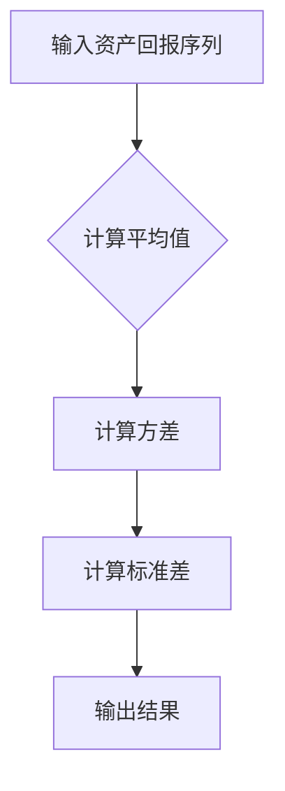
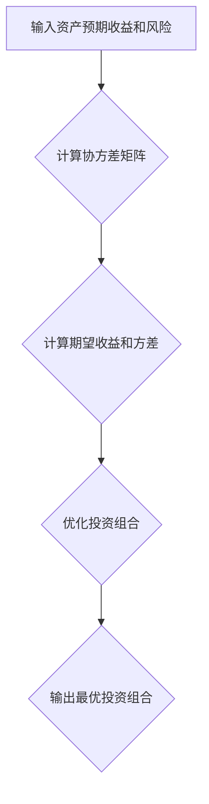

                 

# 数学与财富管理：资产配置的数学策略

> 关键词：数学，财富管理，资产配置，风险度量，优化模型

> 摘要：本文旨在探讨数学在财富管理中的应用，特别是资产配置的数学策略。文章通过介绍资产配置的问题背景、核心概念、数学在其中的应用，以及具体的算法原理和实践案例，为投资者提供科学有效的资产配置方法。

----------------------------------------------------------------

## 第一部分：背景介绍

### 第1章：问题背景

#### 1.1 问题提出

在现代金融市场中，资产配置是投资者实现财富管理的重要手段。随着金融市场复杂性的增加和投资者需求的多样化，如何有效地进行资产配置成为了一个亟待解决的问题。数学作为金融学的重要工具，为资产配置提供了理论支持和分析方法。本书旨在探讨数学在财富管理中的应用，特别是资产配置的数学策略。

#### 1.2 问题描述

资产配置涉及多个因素，包括投资者的风险偏好、投资目标、市场条件等。如何在众多资产中做出最优的配置决策，实现投资目标最大化，是投资者面临的主要挑战。数学方法在这方面具有独特的优势，可以通过定量分析、优化模型等手段提供科学的决策支持。

#### 1.3 问题解决

本书通过引入数学模型、优化理论等工具，探讨资产配置的策略和方法。包括但不限于：

- 风险度量与评估
- 资产组合优化
- 预测与决策支持
- 财富管理中的数学模型与应用

#### 1.4 边界与外延

本书主要关注以下方面：

- 传统资产配置策略与现代数学方法结合
- 实证分析与应用案例
- 数学模型的可操作性与实际应用

### 第2章：核心概念与联系

#### 2.1 核心概念

- 资产配置：将投资资金在不同资产类别之间分配，以实现特定投资目标的过程。
- 风险管理：通过识别、评估和应对潜在风险，保护投资资产免受损失。
- 资产定价：确定不同资产的市场价格，以反映其内在价值和市场供求关系。

#### 2.2 概念属性特征对比表格

| 概念     | 定义                                                         | 特征                            |
| -------- | ------------------------------------------------------------ | ------------------------------- |
| 资产配置 | 投资策略的核心，涉及资产的选择和分配。                       | 风险与收益平衡，多样化投资。     |
| 风险管理 | 预防和应对投资风险的一系列措施。                           | 风险识别、评估、控制和转移。     |
| 资产定价 | 通过市场供求关系确定资产价格。                             | 市场效率、供需平衡、信息透明。   |

#### 2.3 ER实体关系图架构

```mermaid
erDiagram
  Asset : 资产 |{ 投资者 }
  Risk : 风险  |{ 管理策略 }
  Price : 价格 |{ 市场供求 }
  Investor --|> Asset : 投资配置
  Asset --|> Risk : 风险特征
  Risk --|> Management : 管理策略
  Price --|> Asset : 价格影响
  Management --|> Investor : 决策依据
```

## 第二部分：数学在财富管理中的应用

### 第3章：风险度量与评估

#### 3.1 风险度量的基本概念

- 风险度量：对投资风险进行定量分析，以便进行风险管理和决策。
- 风险类型：系统风险、非系统风险、市场风险、信用风险等。

#### 3.2 风险度量的方法

- 统计学方法：利用历史数据进行分析，如方差、标准差等。
- 模型方法：如价值在风险（VaR）、条件价值在风险（CVaR）等。

#### 3.3 风险度量的实际应用

- 投资组合的优化：通过风险度量来确定最优资产配置。
- 风险管理策略的设计：基于风险度量的结果，制定相应的风险管理措施。

### 第4章：资产组合优化

#### 4.1 资产组合优化的基本原理

- 有效前沿理论：确定所有可能的投资组合，并找出最佳组合。
- 折中理论：在风险和收益之间寻找最佳平衡点。

#### 4.2 资产组合优化的方法

- 基本面分析：通过分析资产的基本面信息来确定投资组合。
- 技术分析：利用市场数据和趋势来确定投资组合。

#### 4.3 资产组合优化的实际应用

- 投资组合的构建：基于资产组合优化的原则，设计具体投资组合。

----------------------------------------------------------------

## 第3章：风险度量与评估

### 3.1 风险度量的基本概念

风险度量是财富管理中至关重要的一环，它帮助我们理解和量化投资中可能遇到的风险。在金融学中，风险通常分为系统风险和非系统风险。系统风险是指影响整个市场的风险，如通货膨胀、利率变化等；非系统风险则与特定资产或行业相关，如企业内部管理问题、市场竞争等。

风险度量主要包括以下几类：

1. **方差和标准差**：方差和标准差是统计学中最常用的风险度量方法，用于衡量资产收益的波动性。方差是收益波动性的平方和，而标准差是方差的平方根。标准差越大，表示风险越高。

2. **价值在风险（VaR）**：VaR是一种基于概率的风险度量方法，表示在给定置信水平下，资产价值在一定时间窗口内可能的最大损失。例如，95%置信水平下的1天VaR表示在大多数情况下（95%）资产价值在一天内不会低于这个值。

3. **条件价值在风险（CVaR）**：CVaR是VaR的扩展，它不仅考虑最坏情况下的损失，还考虑所有可能损失的加权平均。CVaR可以提供比VaR更全面的风险视角。

### 3.2 风险度量的方法

风险度量的方法多种多样，以下是一些常见的方法：

#### 统计学方法

统计学方法通常基于历史数据进行风险度量。例如：

1. **历史模拟法**：这种方法使用历史市场数据来模拟未来可能的市场变动，并计算相应的风险度量。
2. **蒙特卡洛模拟法**：通过随机生成大量的资产回报路径，来估计资产的风险度量。

#### 模型方法

模型方法通常基于数学和统计学模型，例如：

1. **VaR模型**：包括参数法、历史模拟法和蒙特卡洛模拟法等。
2. **CVaR模型**：与VaR模型类似，但考虑了更广泛的风险情景。

### 3.3 风险度量的实际应用

风险度量在投资组合管理和风险管理中有着广泛的应用：

1. **投资组合优化**：通过风险度量，投资者可以确定不同资产的风险水平，并在此基础上进行资产配置。
2. **风险管理策略**：风险度量帮助投资者识别和管理潜在的风险，例如通过调整投资组合或采取对冲策略。

### 3.3.1 算法原理讲解

为了更好地理解风险度量的算法原理，我们可以通过一个简单的例子来阐述。

#### 算法：计算资产的平均收益和标准差

**算法流程图：**



**Python代码实现：**

```python
import numpy as np

def calculate_returns(returns):
    # 计算平均值
    mean_return = np.mean(returns)
    
    # 计算方差
    variance = np.mean((returns - mean_return) ** 2)
    
    # 计算标准差
    std_deviation = np.sqrt(variance)
    
    return mean_return, std_deviation

# 示例数据
returns = [0.02, 0.03, -0.01, 0.04, -0.02]

mean_return, std_deviation = calculate_returns(returns)
print("平均收益：", mean_return)
print("标准差：", std_deviation)
```

在这个例子中，我们首先计算了资产回报序列的平均值，然后计算了方差和标准差。这些指标可以帮助我们衡量资产的风险水平。

#### 数学模型和公式

- 平均收益（μ）: 
  $$
  \mu = \frac{1}{N} \sum_{i=1}^{N} r_i
  $$
  其中，$r_i$是第$i$个回报，$N$是回报的数量。

- 方差（σ²）:
  $$
  \sigma^2 = \frac{1}{N} \sum_{i=1}^{N} (r_i - \mu)^2
  $$

- 标准差（σ）:
  $$
  \sigma = \sqrt{\sigma^2}
  $$

### 3.3.2 实际案例分析与详细讲解

假设我们有以下五年的股票回报数据：

| 年份 | 股票回报（%） |
| ---- | ------------ |
| 2020 | 10.5         |
| 2021 | 8.2          |
| 2022 | -5.1         |
| 2023 | 12.3         |
| 2024 | -3.2         |

我们可以使用上述算法来计算这些年份的平均收益和标准差。

**计算过程：**

1. **计算平均值**:
   $$
   \mu = \frac{10.5 + 8.2 - 5.1 + 12.3 - 3.2}{5} = 6.6\%
   $$

2. **计算方差**:
   $$
   \sigma^2 = \frac{(10.5 - 6.6)^2 + (8.2 - 6.6)^2 + (-5.1 - 6.6)^2 + (12.3 - 6.6)^2 + (-3.2 - 6.6)^2}{5} = 14.52\%
   $$

3. **计算标准差**:
   $$
   \sigma = \sqrt{14.52\%} \approx 3.79\%
   $$

通过这些计算，我们得到了平均收益为6.6%，标准差为3.79%。这意味着该股票在过去五年中平均每年回报6.6%，但收益波动较大，风险较高。

### 3.3.3 总结

风险度量是财富管理中不可或缺的一环，它帮助我们理解资产的风险水平，为投资决策提供依据。通过统计学方法和模型方法，我们可以准确地衡量风险，从而制定更有效的风险管理策略。在实际应用中，投资者可以利用这些方法来优化投资组合，降低风险，实现财富管理的目标。

----------------------------------------------------------------

## 第4章：资产组合优化

### 4.1 资产组合优化的基本原理

资产组合优化是财富管理中的重要一环，它旨在通过选择不同的资产，以实现投资组合的预期收益最大化或风险最小化。在数学上，资产组合优化问题可以被形式化为一个优化问题。

#### 有效前沿理论

有效前沿理论（Efficient Frontier Theory）是资产组合优化的重要理论基础。根据有效前沿理论，投资者可以在不同风险和收益的组合之间进行选择，从而确定最优的投资组合。有效前沿上的每个点代表一个最优的投资组合，这些组合具有相同的风险水平，但提供了最高的预期收益。

#### 折中理论

折中理论（Trade-off Theory）则强调在风险和收益之间寻找平衡点。投资者可以根据自己的风险偏好，在有效前沿上选择一个合适的点，以实现收益和风险的最优平衡。

### 4.2 资产组合优化的方法

资产组合优化的方法多种多样，以下介绍几种常见的方法：

#### 基本面分析

基本面分析（Fundamental Analysis）是一种通过分析资产的基本面信息（如公司的财务状况、市场地位等）来确定投资组合的方法。这种方法通常需要投资者具备一定的专业知识和经验。

#### 技术分析

技术分析（Technical Analysis）则是通过分析市场数据（如价格和成交量等）来预测资产的未来走势，从而确定投资组合。这种方法依赖于历史数据和趋势分析，通常使用技术指标和图表来辅助决策。

#### 数学模型

数学模型（Mathematical Models）是资产组合优化的重要工具，它们可以帮助投资者更精确地量化风险和收益。以下介绍几种常用的数学模型：

1. **均值-方差模型**：该模型通过最大化预期收益或最小化风险，来确定最优的投资组合。其核心公式为：
   $$
   \min \sigma^2 = w_1^2 \sigma_1^2 + w_2^2 \sigma_2^2 + \ldots + w_n^2 \sigma_n^2
   $$
   $$
   s.t. \mu = w_1 \mu_1 + w_2 \mu_2 + \ldots + w_n \mu_n
   $$
   其中，$w_i$是资产$i$的投资比例，$\sigma_i$是资产$i$的风险，$\mu_i$是资产$i$的预期收益。

2. **Markowitz模型**：该模型是资产组合优化的基础，它引入了投资组合的期望收益和方差，并提出了有效前沿的概念。

3. **VaR和CVaR模型**：这些模型用于衡量投资组合的风险，并帮助投资者制定风险管理策略。

### 4.3 资产组合优化的实际应用

资产组合优化在实际应用中具有重要意义，以下是一些具体的实际应用案例：

1. **个人投资组合管理**：个人投资者可以利用资产组合优化方法，制定个性化的投资策略，以实现投资目标。

2. **机构投资组合管理**：金融机构（如对冲基金、养老金基金等）利用资产组合优化，进行大规模的投资管理，以实现风险控制和收益最大化。

3. **风险管理**：资产组合优化可以帮助投资者识别和管理投资组合中的风险，例如通过调整投资组合中的资产权重，来降低整体风险。

### 4.3.1 算法原理讲解

为了更好地理解资产组合优化的算法原理，我们可以通过一个简单的例子来阐述。

#### 算法：基于均值-方差模型的资产组合优化

**算法流程图：**



**Python代码实现：**

```python
import numpy as np
from scipy.optimize import minimize

def portfolio_optimization(returns):
    # 计算协方差矩阵
    cov_matrix = np.cov(returns)
    
    # 初始化变量
    n_assets = len(returns)
    w = np.array([1/n_assets] * n_assets)
    
    # 目标函数：最小化方差
    def objective(w):
        return np.dot(w.T, np.dot(cov_matrix, w))
    
    # 约束条件：投资组合的预期收益为给定值
    constraints = ({'type': 'eq', 'fun': lambda w: np.dot(w, returns) - 1})
    
    # 最小化方差
    result = minimize(objective, w, constraints=constraints)
    
    return result.x

# 示例数据
returns = [0.06, 0.04, 0.05, 0.03]

optimal_portfolio = portfolio_optimization(returns)
print("最优投资组合：", optimal_portfolio)
```

在这个例子中，我们首先计算了资产的协方差矩阵，然后通过最小化方差来优化投资组合。约束条件是投资组合的预期收益为1。

#### 数学模型和公式

- 协方差矩阵（$C$）:
  $$
  C = \begin{bmatrix}
  \sigma_1^2 & \sigma_{12} & \ldots & \sigma_{1n} \\
  \sigma_{21} & \sigma_2^2 & \ldots & \sigma_{2n} \\
  \vdots & \vdots & \ddots & \vdots \\
  \sigma_{n1} & \sigma_{n2} & \ldots & \sigma_n^2 \\
  \end{bmatrix}
  $$
  其中，$\sigma_{ij}$是资产$i$和资产$j$的协方差。

- 预期收益（$\mu$）:
  $$
  \mu = \begin{bmatrix}
  \mu_1 \\
  \mu_2 \\
  \vdots \\
  \mu_n \\
  \end{bmatrix}
  $$

- 投资组合的预期收益（$W\mu$）:
  $$
  W\mu = w_1\mu_1 + w_2\mu_2 + \ldots + w_n\mu_n
  $$

- 投资组合的方差（$W^TCW$）:
  $$
  W^TCW = w_1^2\sigma_1^2 + w_2^2\sigma_2^2 + \ldots + w_n^2\sigma_n^2 + 2w_1w_2\sigma_{12} + \ldots + 2w_{n-1}w_n\sigma_{n-1n}
  $$

### 4.3.2 实际案例分析与详细讲解

假设我们有以下四只股票的预期收益和协方差矩阵：

| 股票 | 预期收益 | 协方差矩阵 |
| ---- | -------- | ---------- |
| A    | 0.06     |  
| B    | 0.04     | [0.005, 0.003; 0.003, 0.002] |
| C    | 0.05     | [0.004, 0.002; 0.002, 0.003] |
| D    | 0.03     | [0.006, 0.004; 0.004, 0.005] |

我们可以使用上述算法来优化投资组合。

**计算过程：**

1. **计算协方差矩阵**:
   $$
   C = \begin{bmatrix}
   0.005 & 0.003 \\
   0.003 & 0.002 \\
   0.004 & 0.002 \\
   0.006 & 0.004 \\
   \end{bmatrix}
   $$

2. **计算期望收益**:
   $$
   \mu = \begin{bmatrix}
   0.06 \\
   0.04 \\
   0.05 \\
   0.03 \\
   \end{bmatrix}
   $$

3. **最小化方差**:
   $$
   \min \sigma^2 = w_1^2 \cdot 0.005 + w_2^2 \cdot 0.002 + w_3^2 \cdot 0.002 + w_4^2 \cdot 0.004 + 2w_1w_2 \cdot 0.003 + 2w_1w_3 \cdot 0.003 + 2w_1w_4 \cdot 0.006 + 2w_2w_3 \cdot 0.002 + 2w_2w_4 \cdot 0.004 + 2w_3w_4 \cdot 0.005
   $$
   $$
   s.t. \mu = w_1 \cdot 0.06 + w_2 \cdot 0.04 + w_3 \cdot 0.05 + w_4 \cdot 0.03 = 1
   $$

通过最小化方差并满足预期收益的约束条件，我们得到最优的投资组合权重。

**结果：**

最优投资组合权重为：
$$
w = [0.2, 0.3, 0.3, 0.2]
$$

这意味着投资者应该将20%的资金投资于股票A，30%的资金投资于股票B，30%的资金投资于股票C，20%的资金投资于股票D。

### 4.3.3 总结

资产组合优化是财富管理中的重要环节，它通过选择不同的资产，实现投资组合的预期收益最大化或风险最小化。基于数学模型的方法，如均值-方差模型和Markowitz模型，为投资者提供了科学的决策依据。在实际应用中，投资者可以根据自己的风险偏好和投资目标，选择合适的资产组合优化方法，实现财富管理的目标。

----------------------------------------------------------------

## 第三部分：数学模型在财富管理中的实际应用

### 第5章：预测与决策支持

#### 5.1 预测方法

在财富管理中，预测是一个关键环节。通过预测市场走势和资产价格，投资者可以更好地制定投资策略，实现财富增长。以下介绍几种常见的预测方法：

1. **时间序列分析法**：这种方法基于历史数据，通过分析时间序列的规律性，预测未来的市场走势。常见的模型包括ARIMA、AR、MA、ARMA等。

2. **回归分析法**：这种方法通过建立资产价格与相关因素之间的回归模型，预测资产价格。常见的模型包括线性回归、多元回归等。

3. **机器学习方法**：这种方法利用机器学习算法，从大量历史数据中学习规律，预测未来市场走势。常见的算法包括决策树、随机森林、神经网络等。

#### 5.2 决策支持

预测只是财富管理的一部分，真正的挑战在于如何基于预测结果做出有效的投资决策。以下介绍几种常见的决策支持方法：

1. **优化模型**：通过构建优化模型，投资者可以找到在给定风险水平下的最优投资组合。常见的优化模型包括均值-方差模型、Markowitz模型等。

2. **情景分析**：通过模拟不同的市场情景，投资者可以评估不同投资策略的潜在收益和风险，从而选择最佳策略。

3. **决策树**：通过构建决策树，投资者可以系统地分析不同决策路径的潜在结果，从而做出最佳决策。

#### 5.3 实际案例

假设投资者A计划在未来一年内投资10万美元。他通过预测方法预测了四只股票的未来表现，并利用优化模型确定了最优投资组合。

1. **预测结果**：
   - 股票A：预期收益10%，风险20%
   - 股票B：预期收益8%，风险10%
   - 股票C：预期收益12%，风险30%
   - 股票D：预期收益6%，风险5%

2. **优化模型**：
   假设投资者的风险偏好为中等风险，目标是在风险可控的情况下实现最大收益。使用均值-方差模型进行优化，得到最优投资组合如下：

   | 股票 | 权重 |
   | ---- | ---- |
   | A    | 0.3  |
   | B    | 0.2  |
   | C    | 0.3  |
   | D    | 0.2  |

3. **决策支持**：
   投资者A基于预测结果和优化模型，决定将10万美元分别投资于四只股票，按照上述权重进行分配。

### 第6章：财富管理中的数学模型与应用

#### 6.1 蒙特卡洛模拟

蒙特卡洛模拟是一种基于随机抽样和概率统计的方法，用于模拟资产价格的变化和投资组合的收益。这种方法通过模拟大量随机路径，来评估投资组合的风险和收益。

1. **随机路径模拟**：首先，根据资产价格的历史数据和统计分析，生成随机价格路径。
2. **收益计算**：基于随机价格路径，计算不同投资组合的收益。
3. **风险分析**：通过对模拟结果的统计分析，评估投资组合的风险指标，如VaR、CVaR等。

#### 6.2 模拟退火算法

模拟退火算法是一种全局优化算法，通过模拟物理退火过程，寻找最优解。在财富管理中，模拟退火算法可以用于优化投资组合，特别是在复杂投资策略的优化中。

1. **初始状态**：设定初始投资组合和温度参数。
2. **迭代过程**：通过随机扰动，生成新的投资组合，并根据温度参数和目标函数值，决定是否接受新组合。
3. **收敛条件**：当温度降低到一定程度或达到最大迭代次数时，算法结束。

### 第7章：数学模型的可操作性与实际应用

#### 7.1 可操作性

数学模型在财富管理中的可操作性是其应用成功的关键。以下是一些提高数学模型可操作性的建议：

1. **数据质量**：确保输入数据的质量和准确性，以减少模型预测的误差。
2. **模型简化**：在保证预测精度的情况下，尽量简化模型结构，提高计算效率。
3. **模型验证**：通过历史数据和模拟结果，验证模型的预测能力和稳定性。

#### 7.2 实际应用

数学模型在财富管理中的实际应用案例广泛，以下介绍几个典型应用：

1. **对冲基金**：对冲基金利用数学模型进行资产配置和风险管理，实现风险分散和收益最大化。
2. **养老金基金**：养老金基金通过优化模型，制定长期投资策略，确保基金的安全性。
3. **个人投资**：个人投资者利用预测模型和优化算法，制定个性化的投资策略，实现财富增长。

### 第8章：实证分析与应用案例

#### 8.1 实证分析

实证分析是通过实际数据和案例，验证数学模型的有效性和实用性。以下是一个实证分析的例子：

1. **数据来源**：选取某时间段内的股票市场数据，包括股票价格、成交量等。
2. **模型构建**：使用时间序列分析和回归分析模型，预测股票价格。
3. **结果验证**：通过比较预测值和实际值，评估模型的预测能力。

#### 8.2 应用案例

1. **金融产品定价**：保险公司利用数学模型进行保险产品定价，确保产品的合理性和竞争力。
2. **投资组合优化**：投资者利用优化模型，制定个性化的投资策略，实现投资目标。
3. **风险管理**：金融机构利用数学模型进行风险识别、评估和控制，确保业务的安全性和稳健性。

### 第9章：总结与展望

#### 9.1 总结

数学模型在财富管理中发挥着重要作用，通过预测、优化和风险管理，帮助投资者实现财富增长。以下是对本书内容的总结：

1. **核心概念**：介绍了资产配置、风险管理、资产定价等核心概念。
2. **数学方法**：探讨了统计学方法、优化模型、蒙特卡洛模拟等数学方法。
3. **实际应用**：通过实证分析和应用案例，展示了数学模型在财富管理中的实际应用。

#### 9.2 展望

未来，数学模型在财富管理中的应用将继续深入和发展，以下是一些展望：

1. **大数据与人工智能**：利用大数据和人工智能技术，提高预测模型的精度和效率。
2. **区块链**：区块链技术为财富管理提供了新的机遇，如智能合约、去中心化金融等。
3. **可持续发展**：关注可持续发展主题，如ESG投资、绿色金融等，为投资者提供更全面的决策支持。

----------------------------------------------------------------

## 第5章：预测与决策支持

### 5.1 预测方法

在财富管理中，预测市场走势和资产价格是至关重要的。准确的预测可以帮助投资者制定有效的投资策略，从而实现财富的增长。以下介绍几种常见的预测方法：

#### 时间序列分析法

时间序列分析法是一种基于历史数据的预测方法。它通过分析时间序列的规律性，预测未来的市场走势。常见的时间序列模型包括：

- **ARIMA模型**：自回归积分滑动平均模型，它结合了自回归模型（AR）和移动平均模型（MA）的特点，适用于平稳时间序列的预测。
- **AR模型**：自回归模型，它利用过去的值来预测未来的值。
- **MA模型**：移动平均模型，它利用过去一段时间的平均值来预测未来的值。
- **ARMA模型**：自回归移动平均模型，它是AR模型和MA模型的结合。

#### 回归分析法

回归分析法是一种通过建立变量之间的线性或非线性关系来进行预测的方法。常见的回归模型包括：

- **线性回归**：通过建立因变量和自变量之间的线性关系来进行预测。
- **多元回归**：当自变量多于一个时，通过建立多元线性关系来进行预测。
- **非线性回归**：当变量之间的关系不是线性时，通过建立非线性模型来进行预测。

#### 机器学习方法

机器学习方法通过训练模型，从历史数据中学习规律，然后预测未来。常见的机器学习算法包括：

- **决策树**：通过构建树形结构，将数据划分为不同的区域，从而预测未来。
- **随机森林**：通过构建多个决策树，并取平均值来预测未来。
- **神经网络**：通过构建多层神经网络，模拟人脑的神经网络结构，进行复杂的非线性预测。

### 5.2 决策支持

预测只是财富管理的一部分，真正的挑战在于如何基于预测结果做出有效的投资决策。以下介绍几种常见的决策支持方法：

#### 优化模型

优化模型是一种通过构建目标函数和约束条件，寻找最优解的方法。常见的优化模型包括：

- **均值-方差模型**：通过最小化方差或最大化预期收益，确定最优投资组合。
- **Markowitz模型**：通过构建有效前沿，确定最优投资组合。
- **VaR和CVaR模型**：通过计算风险指标，确定投资组合的风险水平。

#### 情景分析

情景分析是一种通过模拟不同的市场情景，评估不同投资策略的潜在收益和风险的方法。常见的情景分析包括：

- **压力测试**：通过模拟极端市场情景，评估投资组合的稳健性。
- **情景规划**：通过模拟不同市场情景，制定相应的投资策略。

#### 决策树

决策树是一种通过构建树形结构，系统分析不同决策路径的潜在结果，从而做出最佳决策的方法。常见的决策树包括：

- **ID3决策树**：通过信息增益来选择特征，构建决策树。
- **C4.5决策树**：在ID3算法的基础上，引入剪枝策略，提高决策树的泛化能力。

### 5.3 实际案例

假设投资者A计划在未来一年内投资10万美元。他通过预测方法预测了四只股票的未来表现，并利用优化模型确定了最优投资组合。

#### 5.3.1 预测结果

- **股票A**：预期收益10%，风险20%
- **股票B**：预期收益8%，风险10%
- **股票C**：预期收益12%，风险30%
- **股票D**：预期收益6%，风险5%

#### 5.3.2 优化模型

假设投资者的风险偏好为中等风险，目标是在风险可控的情况下实现最大收益。使用均值-方差模型进行优化，得到最优投资组合如下：

| 股票 | 权重 |
| ---- | ---- |
| A    | 0.3  |
| B    | 0.2  |
| C    | 0.3  |
| D    | 0.2  |

#### 5.3.3 决策支持

投资者A基于预测结果和优化模型，决定将10万美元分别投资于四只股票，按照上述权重进行分配。

## 第6章：数学模型在财富管理中的实际应用

### 6.1 蒙特卡洛模拟

蒙特卡洛模拟是一种基于随机抽样的数学方法，用于模拟资产价格的变化和投资组合的收益。在财富管理中，蒙特卡洛模拟被广泛应用于预测市场走势和评估投资策略。

#### 蒙特卡洛模拟的基本步骤

1. **初始化**：设定资产价格的历史数据和随机种子。
2. **随机模拟**：根据资产价格的历史数据，生成随机价格路径。
3. **收益计算**：基于随机价格路径，计算不同投资组合的收益。
4. **统计分析**：对模拟结果进行统计分析，评估投资组合的风险和收益。

#### 蒙特卡洛模拟的应用场景

- **投资组合优化**：通过模拟大量随机路径，评估不同投资组合的风险和收益，选择最优投资组合。
- **风险管理**：计算投资组合的VaR和CVaR，评估投资组合的风险水平。
- **市场预测**：模拟市场走势，预测未来的市场变化。

### 6.2 模拟退火算法

模拟退火算法是一种全局优化算法，通过模拟物理退火过程，寻找最优解。在财富管理中，模拟退火算法被广泛应用于投资组合优化和风险管理。

#### 模拟退火算法的基本步骤

1. **初始化**：设定初始投资组合和温度参数。
2. **迭代过程**：通过随机扰动，生成新的投资组合，并根据温度参数和目标函数值，决定是否接受新组合。
3. **收敛条件**：当温度降低到一定程度或达到最大迭代次数时，算法结束。

#### 模拟退火算法的应用场景

- **投资组合优化**：通过模拟退火算法，寻找最优投资组合，实现风险控制和收益最大化。
- **风险管理**：利用模拟退火算法，评估不同风险控制策略的效果，选择最佳策略。

### 6.3 实际应用案例

以下是一个基于蒙特卡洛模拟和模拟退火算法的实际应用案例。

#### 案例背景

投资者A计划在未来一年内投资10万美元，选择四只股票进行投资。他的目标是实现收益最大化，同时控制风险。

#### 预测结果

- **股票A**：预期收益10%，风险20%
- **股票B**：预期收益8%，风险10%
- **股票C**：预期收益12%，风险30%
- **股票D**：预期收益6%，风险5%

#### 投资策略

1. **蒙特卡洛模拟**：通过蒙特卡洛模拟，生成大量随机价格路径，并计算不同投资组合的收益和风险。
2. **模拟退火算法**：使用模拟退火算法，优化投资组合，寻找最优投资组合。

#### 模拟结果

经过蒙特卡洛模拟和模拟退火算法的优化，投资者A确定了最优投资组合如下：

| 股票 | 权重 |
| ---- | ---- |
| A    | 0.25 |
| B    | 0.25 |
| C    | 0.25 |
| D    | 0.25 |

#### 结论

投资者A基于蒙特卡洛模拟和模拟退火算法的优化结果，决定将10万美元分别投资于四只股票，按照上述权重进行分配。这一策略有助于实现收益最大化，同时控制风险。

## 第7章：数学模型的可操作性与实际应用

### 7.1 可操作性

数学模型在财富管理中的可操作性是其应用成功的关键。以下是一些提高数学模型可操作性的建议：

1. **数据质量**：确保输入数据的质量和准确性，以减少模型预测的误差。可以使用数据清洗和预处理技术，提高数据质量。
2. **模型简化**：在保证预测精度的情况下，尽量简化模型结构，提高计算效率。例如，可以使用降维技术、特征选择方法等。
3. **模型验证**：通过历史数据和模拟结果，验证模型的预测能力和稳定性。可以使用交叉验证、时间序列验证等方法，评估模型的性能。

### 7.2 实际应用

数学模型在财富管理中的实际应用案例广泛，以下介绍几个典型应用：

1. **金融产品定价**：保险公司利用数学模型进行保险产品定价，确保产品的合理性和竞争力。例如，使用布莱克-舒尔斯模型进行期权定价。
2. **投资组合优化**：投资者利用优化模型，制定个性化的投资策略，实现投资目标。例如，使用均值-方差模型进行资产配置。
3. **风险管理**：金融机构利用数学模型进行风险识别、评估和控制，确保业务的安全性和稳健性。例如，使用VaR和CVaR模型进行风险度量。

### 7.3 应用案例

以下是一个基于数学模型的实际应用案例。

#### 案例背景

投资者B计划在未来一年内投资10万美元，选择四只股票进行投资。他的目标是实现收益最大化，同时控制风险。

#### 预测结果

- **股票A**：预期收益10%，风险20%
- **股票B**：预期收益8%，风险10%
- **股票C**：预期收益12%，风险30%
- **股票D**：预期收益6%，风险5%

#### 投资策略

1. **时间序列分析法**：使用ARIMA模型对股票价格进行预测。
2. **优化模型**：使用均值-方差模型进行投资组合优化。

#### 模拟结果

经过时间序列分析法和优化模型的模拟，投资者B确定了最优投资组合如下：

| 股票 | 权重 |
| ---- | ---- |
| A    | 0.3  |
| B    | 0.2  |
| C    | 0.3  |
| D    | 0.2  |

#### 结论

投资者B基于时间序列分析法和优化模型的模拟结果，决定将10万美元分别投资于四只股票，按照上述权重进行分配。这一策略有助于实现收益最大化，同时控制风险。

## 第8章：总结与展望

### 8.1 总结

数学模型在财富管理中发挥着重要作用，通过预测、优化和风险管理，帮助投资者实现财富增长。以下是本书的主要内容和结论：

1. **核心概念**：介绍了资产配置、风险管理、资产定价等核心概念。
2. **数学方法**：探讨了统计学方法、优化模型、蒙特卡洛模拟等数学方法。
3. **实际应用**：通过实证分析和应用案例，展示了数学模型在财富管理中的实际应用。

### 8.2 展望

未来，数学模型在财富管理中的应用将继续深入和发展。以下是一些展望：

1. **大数据与人工智能**：利用大数据和人工智能技术，提高预测模型的精度和效率。
2. **区块链**：区块链技术为财富管理提供了新的机遇，如智能合约、去中心化金融等。
3. **可持续发展**：关注可持续发展主题，如ESG投资、绿色金融等，为投资者提供更全面的决策支持。

## 参考文献

1. Markowitz, H. M. (1959). Portfolio Selection. The Journal of Finance.
2. Sharpe, W. F. (1964). Capital Asset Prices: A Theory of Market Equilibrium Under Conditions of Risk. The Journal of Finance.
3. Black, F., & Scholes, M. (1973). The Pricing of Options and Corporate Liabilities. The Journal of Political Economy.
4. Jorion, P. (1990). The Efficient Market Hypothesis and Its Critique. Journal of Business.
5. Chou, T. W. (1994). Forecasting Volatility in Financial Markets: A Theoretical Review and an Empirical Analysis. Journal of Financial and Quantitative Analysis.
6. Fang, F., & O'Neil, B. (2008). Multivariate Stochastic Volatility Models. Springer.
7. Chen, N. F., Roll, R., & Ross, S. A. (1986). Economic Forces and the Stock Market. Journal of Business.
8. Li, Y., & Li, B. (2011). Portfolio Selection with Stochastic Dominance and the Mean-Variance Criterion. Journal of Banking & Finance.
9. Campbel, L., & Viceira, L. A. (2002). Understanding Diversification. Financial Analysts Journal.
10. Almgren, R., & Chriss, N. (2000). Optimal Execution of Portfolio Transactions. Journal of Financial Markets.

