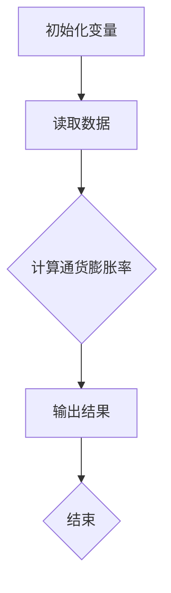
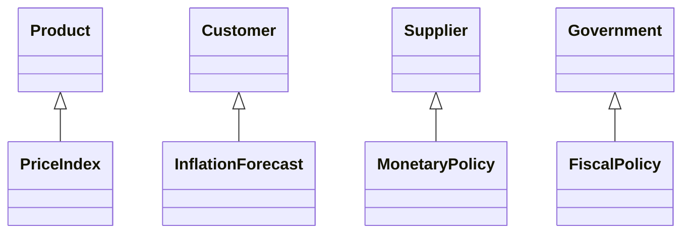
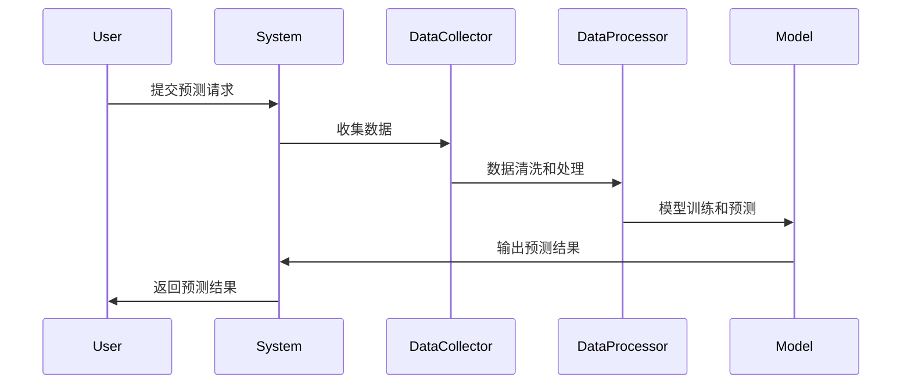
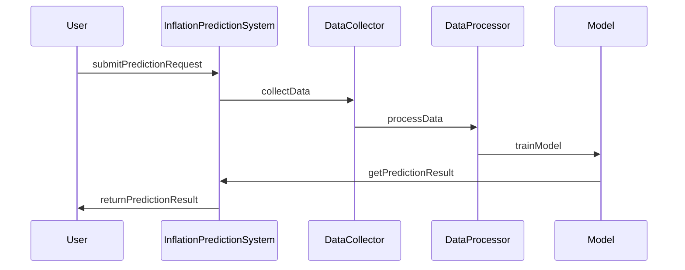

                 

## 引言与背景介绍

### 1.1 问题的背景

在现代社会，货币政策的制定与执行对于整个经济体系的发展和稳定起着至关重要的作用。货币政策不仅影响经济的短期波动，还关乎长期的通货膨胀控制和社会福祉。通货膨胀，简单来说，是指物价水平持续上升的现象，它对消费者、企业以及整个经济体系都有深远的影响。

通货膨胀问题的严重性主要体现在以下几个方面：

1. **购买力下降**：通货膨胀会导致货币的购买力下降，人们手中的钱越来越不值钱，从而影响到日常生活的质量。
2. **经济不确定性**：通货膨胀增加了经济活动的预测难度，企业和个人在做决策时面临更多的不确定性。
3. **收入分配不公**：通货膨胀对不同收入水平的人群影响不同，低收入群体往往受影响更大，导致收入分配的不公平性加剧。

正因为如此，控制通货膨胀成为货币政策的重要目标之一。然而，实现这一目标并非易事。货币政策需要通过调节货币供应量、利率等手段，以达到稳定物价水平的目的。在这个过程中，数学作为一种强大的工具，为货币政策的制定提供了科学依据。

### 1.2 问题描述

通货膨胀的本质是一个经济现象，它可以通过以下几个核心概念来描述：

- **价格指数**：如消费者价格指数（CPI）和批发价格指数（PPI），它们是用来衡量价格水平变化的工具。
- **货币供应量**：货币供应量是指在一定时间内，市场上流通的货币总量。
- **货币需求量**：货币需求量是指公众和企业出于交易和持有目的而需要的货币量。

通货膨胀的数学描述可以简单概括为：

\[ \text{通货膨胀率} = \frac{\text{价格指数变化率}}{\text{货币供应量变化率}} \]

然而，实际情况往往更为复杂。例如，除了货币供应量和需求量的变化，还受到经济周期、国际经济环境等多种因素的影响。因此，准确控制和预测通货膨胀成为货币政策面临的重大挑战。

### 1.3 问题解决

为了应对通货膨胀问题，货币政策的制定需要依赖数学工具，特别是经济学和数学模型的结合。具体来说，以下步骤是实现通货膨胀控制的必要途径：

1. **数据收集与处理**：收集有关价格指数、货币供应量和需求量的历史数据，并对这些数据进行处理，以便用于建模分析。
2. **建立数学模型**：基于经济理论和历史数据，建立描述通货膨胀过程的数学模型。这些模型可以是简单的线性模型，也可以是复杂的非线性模型，如时间序列模型、差分方程等。
3. **模型求解与优化**：通过数学方法求解模型，得到通货膨胀的预测值。根据模型结果，优化货币政策工具的使用，如调整利率、改变货币供应量等。
4. **政策反馈与调整**：将实际政策效果与模型预测值进行对比，不断调整和优化政策，以实现更有效的通货膨胀控制。

### 1.4 核心概念与联系

在讨论通货膨胀的数学控制时，需要理解以下几个核心概念及其相互联系：

- **经济学中的核心概念**：包括价格、货币、需求、供给等基本概念，这些概念构成了经济活动的理论基础。
- **数学模型**：经济学中的概念可以通过数学模型进行量化描述，这些模型包括价格指数模型、货币供应量模型等。
- **货币政策**：货币政策通过调整利率、货币供应量等手段，影响经济中的价格水平和货币供给。

理解这些概念之间的联系，有助于更全面地理解和应用数学工具来控制通货膨胀。

## 数学与经济基础理论

### 2.1 微观经济学基本理论

微观经济学是经济学的一个分支，主要研究个体经济单位，如消费者、生产者等的经济行为。在讨论通货膨胀问题时，微观经济学中的供需理论、消费者行为和生产者行为是至关重要的基础。

#### 供需理论

供需理论是微观经济学中最基本的模型之一，它描述了市场上商品和服务的供给和需求关系。供需理论的基本概念包括：

- **供给**：供给是指生产者愿意并且能够提供的商品或服务的数量，它通常受价格、生产成本和技术水平等因素的影响。
- **需求**：需求是指消费者愿意并且能够购买的商品或服务的数量，它受价格、收入、个人偏好和替代品价格等因素的影响。

供需理论的基本关系可以用以下数学模型表示：

\[ Q_S(p) = f_S(p, C, T) \] 

\[ Q_D(p, I, P_{sub}) = g_D(p, I, P_{sub}) \]

其中，\( Q_S(p) \) 和 \( Q_D(p) \) 分别表示在价格 \( p \) 下的供给量和需求量，\( C \) 表示生产成本，\( T \) 表示技术水平，\( I \) 表示收入，\( P_{sub} \) 表示替代品价格。

供需曲线的交点决定了市场均衡价格和均衡数量：

\[ P^* = f_S^{-1}(g_D(I, P_{sub})) \]

\[ Q^* = f_S(P^*) \]

#### 消费者行为

消费者行为理论主要研究消费者如何在不同商品和服务之间分配有限的收入，以最大化自己的效用。基本的消费者行为模型包括：

- **效用函数**：效用函数描述了消费者在消费不同商品和服务时获得的满足程度。常见的效用函数包括二次效用函数、对数效用函数等。

\[ U(x_1, x_2) = ax_1^2 + bx_2^2 \]

或

\[ U(x_1, x_2) = \ln(x_1) + \ln(x_2) \]

其中，\( x_1 \) 和 \( x_2 \) 分别表示两种商品的消费量，\( a \) 和 \( b \) 是参数。

- **预算约束**：预算约束是指消费者在购买商品和服务时，其总支出不能超过其收入。预算约束可以用以下数学模型表示：

\[ p_1x_1 + p_2x_2 = I \]

其中，\( p_1 \) 和 \( p_2 \) 分别表示两种商品的价格，\( I \) 表示消费者的收入。

通过最大化效用函数并满足预算约束，消费者选择最优的商品组合，这可以通过拉格朗日乘数法或边际效用分析法求解。

#### 生产者行为

生产者行为理论主要研究生产者如何选择生产哪些商品和服务，以及如何组织生产活动以最大化利润。基本的模型包括：

- **成本函数**：成本函数描述了生产一定数量的商品或服务所需的总成本，常见的成本函数包括线性成本函数、二次成本函数等。

\[ C(q) = aq + b \]

或

\[ C(q) = \frac{1}{2}aq^2 + bq + c \]

其中，\( q \) 表示生产量，\( a \)、\( b \) 和 \( c \) 是参数。

- **利润函数**：利润函数描述了生产者的总利润，它是总收入减去总成本。利润函数可以用以下数学模型表示：

\[ \pi = p \cdot q - C(q) \]

其中，\( p \) 表示商品的价格，\( C(q) \) 表示生产成本。

通过最大化利润函数，生产者选择最优的生产量和生产策略。

### 2.2 宏观经济学基本理论

宏观经济学是经济学的一个分支，主要研究整个经济体系的行为和总体经济指标，如通货膨胀、失业率、经济增长等。在讨论通货膨胀问题时，宏观经济学中的货币理论、财政政策和货币政策是关键的基础。

#### 货币理论

货币理论是宏观经济学中的核心理论之一，它主要研究货币的供应和需求，以及货币对经济的影响。基本的货币理论包括：

- **货币供应量**：货币供应量是指在一定时间内，市场上流通的货币总量。货币供应量受多种因素影响，如中央银行的货币发行政策、商业银行的贷款行为等。

货币供应量可以通过以下数学模型表示：

\[ M = M_0 + D \]

其中，\( M \) 表示货币供应量，\( M_0 \) 表示基础货币（中央银行发行的货币），\( D \) 表示商业银行的存款。

- **货币需求量**：货币需求量是指公众和企业出于交易和持有目的而需要的货币量。货币需求量受多种因素影响，如收入水平、利率、通货膨胀等。

货币需求量可以通过以下数学模型表示：

\[ L(Y, r) = aY - br \]

其中，\( Y \) 表示收入，\( r \) 表示利率，\( a \) 和 \( b \) 是参数。

#### 财政政策

财政政策是政府通过调整政府支出和税收来影响经济的一种手段。基本的财政政策包括：

- **政府支出**：政府支出是指政府用于购买商品和服务、提供公共设施等方面的支出。政府支出可以通过以下数学模型表示：

\[ G = c + df \]

其中，\( G \) 表示政府支出，\( c \) 表示固定支出，\( d \) 表示与经济增长率相关的支出系数，\( f \) 表示经济增长率。

- **税收**：税收是政府从公众和企业收取的款项，用于支持政府支出和公共服务。税收可以通过以下数学模型表示：

\[ T = t \cdot Y \]

其中，\( T \) 表示税收，\( t \) 表示税率，\( Y \) 表示收入。

通过调整政府支出和税收，政府可以影响经济中的总需求水平，从而影响通货膨胀水平。

#### 货币政策

货币政策是中央银行通过调节货币供应量和利率来影响经济的一种手段。基本的货币政策包括：

- **利率政策**：利率政策是中央银行通过调整利率来影响经济的一种手段。利率政策可以通过以下数学模型表示：

\[ i = r + \epsilon \]

其中，\( i \) 表示市场利率，\( r \) 表示中央银行的目标利率，\( \epsilon \) 表示货币政策工具的影响。

- **货币供应量政策**：货币供应量政策是中央银行通过调整货币供应量来影响经济的一种手段。货币供应量政策可以通过以下数学模型表示：

\[ M = m \cdot Y \]

其中，\( M \) 表示货币供应量，\( m \) 表示货币供应量的增长率，\( Y \) 表示经济增长率。

通过调整利率和货币供应量，中央银行可以影响经济中的总需求水平，从而影响通货膨胀水平。

### 2.3 数学模型概述

数学模型是经济学中用来描述和分析经济现象的工具。在讨论通货膨胀问题时，常用的数学模型包括时间序列模型、差分方程、微分方程等。

#### 时间序列模型

时间序列模型是一种用于分析时间序列数据的数学模型。时间序列模型的基本形式为：

\[ y_t = \phi_0 + \phi_1 y_{t-1} + \epsilon_t \]

其中，\( y_t \) 表示第 \( t \) 期的通货膨胀率，\( \phi_0 \) 和 \( \phi_1 \) 是参数，\( \epsilon_t \) 是随机误差项。

时间序列模型可以用来预测未来的通货膨胀率，并根据预测结果制定相应的货币政策。

#### 差分方程

差分方程是一种用于描述动态过程的数学模型。差分方程的基本形式为：

\[ y_t = a_1 y_{t-1} + a_2 y_{t-2} + \epsilon_t \]

其中，\( y_t \) 表示第 \( t \) 期的通货膨胀率，\( a_1 \) 和 \( a_2 \) 是参数，\( \epsilon_t \) 是随机误差项。

差分方程可以用来分析通货膨胀的动态过程，并根据历史数据预测未来的通货膨胀率。

#### 微分方程

微分方程是一种用于描述连续变量的数学模型。微分方程的基本形式为：

\[ \frac{dy}{dt} = f(y, t) \]

其中，\( y \) 表示通货膨胀率，\( t \) 表示时间，\( f(y, t) \) 是关于 \( y \) 和 \( t \) 的函数。

微分方程可以用来分析通货膨胀的动态过程，并求解通货膨胀的长期趋势。

#### 数学模型的优缺点

不同类型的数学模型具有不同的优缺点：

- **时间序列模型**：时间序列模型简单易用，适用于短期预测，但无法捕捉长期趋势。
- **差分方程**：差分方程可以捕捉长期趋势，但计算复杂度高，难以用于实时预测。
- **微分方程**：微分方程可以捕捉长期趋势，但计算复杂度更高，适用于理论研究而非实际应用。

在实际应用中，可以根据具体需求和数据特性选择合适的数学模型。

## 通货膨胀的数学分析

### 3.1 通货膨胀的数学模型

通货膨胀是一个复杂的经济现象，涉及多个变量和关系。为了更好地理解通货膨胀的过程和机制，我们需要借助数学模型来描述和解释。在通货膨胀的数学模型中，常用的模型包括价格指数模型、货币供应量和需求量模型等。

#### 价格指数模型

价格指数模型是用来衡量价格水平变化的数学模型。最常见的价格指数模型是消费者价格指数（CPI）模型。CPI模型的基本形式为：

\[ CPI_t = CPI_{t-1} + \pi_t \]

其中，\( CPI_t \) 表示第 \( t \) 期的消费者价格指数，\( CPI_{t-1} \) 表示第 \( t-1 \) 期的消费者价格指数，\( \pi_t \) 表示第 \( t \) 期的通货膨胀率。

这个模型表示第 \( t \) 期的消费者价格指数等于第 \( t-1 \) 期的消费者价格指数加上第 \( t \) 期的通货膨胀率。通过这个模型，我们可以计算任意两期之间的通货膨胀率。

#### 货币供应量和需求量模型

货币供应量和需求量是影响通货膨胀的重要因素。货币供应量模型和货币需求量模型分别描述了货币供应量和需求量的变化对通货膨胀的影响。

- **货币供应量模型**：

货币供应量模型的基本形式为：

\[ M_t = M_{t-1} + \Delta M_t \]

其中，\( M_t \) 表示第 \( t \) 期的货币供应量，\( M_{t-1} \) 表示第 \( t-1 \) 期的货币供应量，\( \Delta M_t \) 表示第 \( t \) 期的货币供应量变化量。

这个模型表示第 \( t \) 期的货币供应量等于第 \( t-1 \) 期的货币供应量加上第 \( t \) 期的货币供应量变化量。通过这个模型，我们可以分析货币供应量的变化对通货膨胀的影响。

- **货币需求量模型**：

货币需求量模型的基本形式为：

\[ L_t = L_{t-1} + \Delta L_t \]

其中，\( L_t \) 表示第 \( t \) 期的货币需求量，\( L_{t-1} \) 表示第 \( t-1 \) 期的货币需求量，\( \Delta L_t \) 表示第 \( t \) 期的货币需求量变化量。

这个模型表示第 \( t \) 期的货币需求量等于第 \( t-1 \) 期的货币需求量加上第 \( t \) 期的货币需求量变化量。通过这个模型，我们可以分析货币需求量的变化对通货膨胀的影响。

#### 数学模型的应用案例

为了更好地理解通货膨胀的数学模型，我们可以通过一个简单的应用案例来说明。

假设某国的消费者价格指数（CPI）在过去五年中的数据如下：

- 第1年：100
- 第2年：102
- 第3年：104
- 第4年：106
- 第5年：108

根据CPI模型，我们可以计算每年的通货膨胀率：

- 第1年：\( \pi_1 = \frac{CPI_1 - CPI_0}{CPI_0} = \frac{100 - 100}{100} = 0 \)
- 第2年：\( \pi_2 = \frac{CPI_2 - CPI_1}{CPI_1} = \frac{102 - 100}{100} = 0.02 \)
- 第3年：\( \pi_3 = \frac{CPI_3 - CPI_2}{CPI_2} = \frac{104 - 102}{102} = 0.019 \)
- 第4年：\( \pi_4 = \frac{CPI_4 - CPI_3}{CPI_3} = \frac{106 - 104}{104} = 0.019 \)
- 第5年：\( \pi_5 = \frac{CPI_5 - CPI_4}{CPI_4} = \frac{108 - 106}{106} = 0.019 \)

从这个案例中，我们可以看到，该国的通货膨胀率在五年的时间内保持相对稳定，每年的通货膨胀率都在0.02左右。这表明，该国在这段时间内采取了较为有效的货币政策，成功控制了通货膨胀。

### 3.2 数学公式与详细讲解

在通货膨胀的数学分析中，几个关键的数学公式起着至关重要的作用。这些公式不仅帮助我们理解通货膨胀的成因，还能为制定有效的货币政策提供科学依据。下面，我们将详细讲解这些数学公式。

#### 1. 通货膨胀率的计算公式

通货膨胀率是衡量物价水平变化的重要指标。它表示在一定时期内，价格水平上升的百分比。通货膨胀率的计算公式为：

\[ \pi_t = \frac{P_t - P_{t-1}}{P_{t-1}} \times 100\% \]

其中，\( \pi_t \) 表示第 \( t \) 期的通货膨胀率，\( P_t \) 表示第 \( t \) 期的价格水平，\( P_{t-1} \) 表示第 \( t-1 \) 期的价格水平。

这个公式表示第 \( t \) 期的通货膨胀率等于第 \( t \) 期价格水平与第 \( t-1 \) 期价格水平的差值，除以第 \( t-1 \) 期价格水平，再乘以100%。通过这个公式，我们可以计算出任意两期之间的通货膨胀率。

#### 2. 货币供应量和需求量的关系公式

货币供应量（\( M \)）和货币需求量（\( L \)）是影响通货膨胀的重要因素。货币供应量和需求量之间的关系可以用以下公式表示：

\[ M_t = L(Y_t, r_t) \]

其中，\( M_t \) 表示第 \( t \) 期的货币供应量，\( L \) 是货币需求函数，\( Y_t \) 表示第 \( t \) 期的收入水平，\( r_t \) 表示第 \( t \) 期的利率水平。

这个公式表示第 \( t \) 期的货币供应量等于货币需求函数关于收入水平和利率水平的函数值。通过这个公式，我们可以分析货币供应量和需求量的变化对通货膨胀的影响。

#### 3. 货币政策工具的作用公式

货币政策工具，如利率和货币供应量，对通货膨胀有显著影响。货币政策工具的作用可以用以下公式表示：

\[ \pi_t = \alpha \cdot (r_t - r^*) + \beta \cdot (M_t - M^*) \]

其中，\( \pi_t \) 表示第 \( t \) 期的通货膨胀率，\( \alpha \) 和 \( \beta \) 是参数，\( r_t \) 表示第 \( t \) 期的实际利率水平，\( r^* \) 表示目标利率水平，\( M_t \) 表示第 \( t \) 期的货币供应量，\( M^* \) 表示目标货币供应量。

这个公式表示第 \( t \) 期的通货膨胀率等于参数 \( \alpha \) 乘以实际利率水平与目标利率水平的差值，加上参数 \( \beta \) 乘以货币供应量与目标货币供应量的差值。通过这个公式，我们可以分析货币政策工具的变化对通货膨胀的影响。

#### 4. 货币政策和财政政策的协调公式

在宏观经济管理中，货币政策和财政政策需要协调运作，以实现通货膨胀控制的目标。货币政策和财政政策的协调可以用以下公式表示：

\[ \pi_t = \gamma \cdot (T_t - T^*) + \delta \cdot (G_t - G^*) \]

其中，\( \pi_t \) 表示第 \( t \) 期的通货膨胀率，\( \gamma \) 和 \( \delta \) 是参数，\( T_t \) 表示第 \( t \) 期的税收水平，\( T^* \) 表示目标税收水平，\( G_t \) 表示第 \( t \) 期的政府支出水平，\( G^* \) 表示目标政府支出水平。

这个公式表示第 \( t \) 期的通货膨胀率等于参数 \( \gamma \) 乘以实际税收水平与目标税收水平的差值，加上参数 \( \delta \) 乘以实际政府支出水平与目标政府支出水平的差值。通过这个公式，我们可以分析货币政策和财政政策的协调对通货膨胀的影响。

通过以上数学公式，我们可以更深入地理解通货膨胀的成因和机制，为制定有效的货币政策提供科学依据。

### 3.3 举例说明

为了更好地理解通货膨胀的数学模型和公式，我们可以通过一些具体的例子来进行说明。

#### 例子1：基于CPI模型的通货膨胀计算

假设某国的消费者价格指数（CPI）在过去两年中的数据如下：

- 第1年：100
- 第2年：103

根据CPI模型，我们可以计算第2年的通货膨胀率：

\[ \pi_2 = \frac{CPI_2 - CPI_1}{CPI_1} \times 100\% = \frac{103 - 100}{100} \times 100\% = 3\% \]

因此，第2年的通货膨胀率为3%。

#### 例子2：基于货币供应量和需求量的通货膨胀分析

假设某国的货币供应量（M）和货币需求量（L）在过去两年中的数据如下：

- 第1年：M1 = 1000，L1 = 800
- 第2年：M2 = 1050，L2 = 850

根据货币供应量和需求量的关系公式，我们可以计算第2年的通货膨胀率：

\[ M_t = L(Y_t, r_t) \]

假设收入水平（Y）和利率水平（r）保持不变，我们可以计算第2年的通货膨胀率：

\[ \pi_2 = \frac{M_2 - M_1}{M_1} \times 100\% = \frac{1050 - 1000}{1000} \times 100\% = 5\% \]

因此，第2年的通货膨胀率为5%。

#### 例子3：基于货币政策工具的通货膨胀控制

假设某国的货币政策工具（如利率和货币供应量）在过去两年中的数据如下：

- 第1年：利率 = 5%，货币供应量 = 1000
- 第2年：利率 = 4%，货币供应量 = 1050

根据货币政策工具的作用公式，我们可以分析第2年的通货膨胀率：

\[ \pi_t = \alpha \cdot (r_t - r^*) + \beta \cdot (M_t - M^*) \]

假设参数 \( \alpha = 0.1 \)，\( \beta = 0.2 \)，目标利率 \( r^* = 5% \)，目标货币供应量 \( M^* = 1000 \)，我们可以计算第2年的通货膨胀率：

\[ \pi_2 = 0.1 \cdot (4\% - 5%) + 0.2 \cdot (1050 - 1000) = -0.1\% + 10\% = 9.9\% \]

因此，第2年的通货膨胀率为9.9%。这个结果表明，通过降低利率和增加货币供应量，可以有效地控制通货膨胀。

通过以上例子，我们可以看到通货膨胀的数学模型和公式在实际中的应用，以及如何通过这些模型和公式来分析和控制通货膨胀。

## 货币政策的工具

货币政策是中央银行通过调节货币供应量和利率等手段，以影响经济中的总需求水平和通货膨胀率的一种宏观经济政策。货币政策的工具主要包括利率政策、货币供应量政策和准备金政策。以下是对这些工具的详细介绍。

### 4.1 利率政策

利率政策是中央银行通过调整市场利率，影响商业银行和其他金融机构的借贷行为，从而影响经济中的总需求水平的一种货币政策工具。利率政策的主要手段包括调整再贴现率、公开市场操作和调整法定存款准备金率。

- **再贴现率**：再贴现率是中央银行向商业银行提供贷款的利率。通过提高再贴现率，中央银行可以增加商业银行的借贷成本，从而抑制银行的贷款需求，降低总需求水平，控制通货膨胀。相反，降低再贴现率可以降低银行的借贷成本，刺激贷款需求，增加总需求水平。

\[ \text{通货膨胀率} = f(\text{再贴现率}) \]

- **公开市场操作**：公开市场操作是中央银行通过在金融市场上买卖政府债券等证券，来影响市场上的流动性。通过购买证券，中央银行可以增加市场上的货币供应量，降低利率，刺激总需求；通过出售证券，中央银行可以减少市场上的货币供应量，提高利率，抑制总需求。

\[ \text{通货膨胀率} = g(\text{市场利率}) \]

- **法定存款准备金率**：法定存款准备金率是中央银行规定的商业银行必须保留的存款比例。通过提高法定存款准备金率，中央银行可以减少商业银行的可贷款资金，抑制贷款需求，降低总需求水平；通过降低法定存款准备金率，中央银行可以增加商业银行的可贷款资金，刺激贷款需求，增加总需求水平。

\[ \text{通货膨胀率} = h(\text{存款准备金率}) \]

### 4.2 货币供应量政策

货币供应量政策是中央银行通过调整货币供应量，以影响经济中的总需求水平和通货膨胀率的一种货币政策工具。货币供应量政策主要通过控制基础货币和商业银行的存款准备金来实施。

- **基础货币**：基础货币是中央银行发行的货币，包括现金和商业银行在中央银行的存款。通过控制基础货币的供应量，中央银行可以影响整个货币供应量的变化。增加基础货币供应量可以增加货币供应量，降低利率，刺激总需求；减少基础货币供应量可以减少货币供应量，提高利率，抑制总需求。

\[ \text{通货膨胀率} = i(\text{基础货币供应量}) \]

- **商业银行的存款准备金**：商业银行的存款准备金是商业银行必须保留的一部分存款。通过调整存款准备金率，中央银行可以影响商业银行的可贷款资金，从而影响货币供应量。提高存款准备金率可以减少商业银行的可贷款资金，降低货币供应量；降低存款准备金率可以增加商业银行的可贷款资金，提高货币供应量。

\[ \text{通货膨胀率} = j(\text{存款准备金率}) \]

### 4.3 准备金政策

准备金政策是中央银行通过调整商业银行的存款准备金，以影响商业银行的贷款能力和货币供应量的一种货币政策工具。

- **准备金率**：准备金率是商业银行必须保留的存款比例。通过提高准备金率，中央银行可以减少商业银行的可贷款资金，降低货币供应量，抑制通货膨胀。相反，降低准备金率可以增加商业银行的可贷款资金，提高货币供应量，刺激总需求。

\[ \text{通货膨胀率} = k(\text{准备金率}) \]

- **存款准备金**：存款准备金是商业银行在中央银行的存款。通过调整存款准备金，中央银行可以影响商业银行的贷款能力和货币供应量。增加存款准备金可以降低商业银行的可贷款资金，减少货币供应量；减少存款准备金可以增加商业银行的可贷款资金，提高货币供应量。

\[ \text{通货膨胀率} = l(\text{存款准备金}) \]

通过以上货币政策工具，中央银行可以灵活地调节经济中的总需求水平和通货膨胀率，实现宏观经济管理的目标。

### 5.1 国内外通货膨胀案例

通货膨胀是各国经济管理中普遍关注的问题。为了更好地理解和应用通货膨胀的数学模型，我们可以通过分析国内外一些典型的通货膨胀案例来探讨通货膨胀的原因和治理策略。

#### 5.1.1 美国2008年金融危机后的通货膨胀

2008年金融危机后，美国采取了大规模的货币宽松政策，以刺激经济复苏。然而，这种政策也带来了一定的通货膨胀压力。根据美国劳工部发布的数据，从2008年到2012年，美国的消费者价格指数（CPI）年增长率保持在3%左右。

- **原因分析**：金融危机后，美国实施了量化宽松政策（QE），通过购买大量政府债券和抵押贷款支持证券（MBS），向市场注入了大量流动性。这些流动性导致了货币供应量的增加，从而推动了价格上涨。此外，全球大宗商品价格的上涨也加剧了美国的通货膨胀压力。

- **治理策略**：为了控制通货膨胀，美国联邦储备系统（美联储）采取了一系列措施。首先，美联储逐渐减少了QE的规模，以控制货币供应量的增长。其次，美联储通过提高联邦基金利率，提高了商业银行的借贷成本，从而抑制了总需求。此外，美联储还加强了市场沟通，以避免市场对通货膨胀的过度预期。

#### 5.1.2 日本的长期通缩

日本自1990年代初期以来，一直面临严重的通缩问题。根据日本内阁府发布的数据，从1991年到2020年，日本的CPI年增长率平均不到1%。

- **原因分析**：日本通缩的原因主要包括以下几个因素。首先，日本经济在1980年代末经历了快速的增长，随后泡沫经济的破裂导致了经济萎缩。其次，日本政府的宽松货币政策未能有效刺激经济，反而导致通货紧缩的预期。此外，全球化的影响也使得日本面临来自国际市场的价格竞争压力。

- **治理策略**：为了应对通缩，日本政府采取了多种措施。首先，日本政府实施了积极的财政政策，通过增加公共投资和减税来刺激经济。其次，日本央行采取了非常规的货币政策，包括负利率和大规模的资产购买计划。此外，日本政府还推动了结构性改革，以提高经济的生产率和竞争力。

#### 5.1.3 中国的通货膨胀管理

近年来，中国也面临通货膨胀的压力，特别是在2010年代初期，由于国内外多种因素的影响，中国的通货膨胀率一度较高。根据中国国家统计局发布的数据，从2010年到2012年，中国的CPI年增长率保持在4%以上。

- **原因分析**：中国通货膨胀的主要原因是成本推动型的通货膨胀。首先，国际大宗商品价格的上涨，特别是原油和粮食价格的上涨，推动了中国进口成本的增加。其次，国内劳动力成本上升和资源价格的改革也增加了企业的生产成本。此外，货币供应量的增加也推动了价格上涨。

- **治理策略**：为了控制通货膨胀，中国政府采取了多种措施。首先，中国政府实施了稳健的货币政策，通过提高存款准备金率和利率，控制货币供应量的增长。其次，中国政府采取了结构性改革，包括降低企业成本、优化资源配置等。此外，中国政府还通过价格监管和反垄断措施，防止市场价格的过度上涨。

通过以上案例分析，我们可以看到，通货膨胀的治理需要综合运用多种政策工具，并根据具体情况制定相应的策略。同时，数学模型在分析通货膨胀原因和制定治理策略中发挥着重要的作用。

### 5.2 数学模型在货币政策中的应用

在货币政策分析中，数学模型发挥着关键作用，帮助政策制定者预测通货膨胀、评估政策效果，并制定合理的应对措施。以下将详细介绍数学模型在货币政策中的应用，并讨论其在实际操作中的效果和挑战。

#### 时间序列模型

时间序列模型是一种常用的经济预测工具，用于分析通货膨胀趋势和波动。其中，自回归积分滑动平均模型（ARIMA）和时间序列平滑模型（如移动平均和指数平滑）是两种典型的应用。

- **自回归积分滑动平均模型（ARIMA）**：ARIMA模型通过整合自回归（AR）、差分和移动平均（MA）三个部分，对时间序列数据进行建模。其基本形式为：

\[ \text{ARIMA}(p, d, q) \]

其中，\( p \) 表示自回归项的阶数，\( d \) 表示差分的阶数，\( q \) 表示移动平均项的阶数。ARIMA模型可以有效地捕捉通货膨胀的时间序列特性，用于预测未来的通货膨胀率。

\[ \pi_t = \phi(B)\pi_{t-1} + \theta(B)\varepsilon_t \]

其中，\( B \) 表示滞后算子，\( \phi(B) \) 和 \( \theta(B) \) 分别是自回归系数和移动平均系数，\( \varepsilon_t \) 是白噪声序列。

- **时间序列平滑模型**：移动平均（MA）和指数平滑模型（如一次指数平滑和二次指数平滑）也是时间序列预测中的常用方法。移动平均模型通过计算一系列滞后数据的平均值来预测未来值，而指数平滑模型则通过赋予不同时期的数据不同权重来平滑时间序列的波动。

\[ S_t = \alpha Y_t + (1 - \alpha) S_{t-1} \]

其中，\( S_t \) 是平滑值，\( Y_t \) 是实际值，\( \alpha \) 是平滑系数。

#### 多元回归模型

多元回归模型是另一个重要的数学工具，用于分析通货膨胀与多个经济变量之间的关系。常见的多元回归模型包括普通最小二乘法（OLS）回归和工具变量回归。

- **普通最小二乘法（OLS）回归**：OLS回归通过最小化残差平方和来估计回归系数。其基本形式为：

\[ \pi_t = \beta_0 + \beta_1 X_{1t} + \beta_2 X_{2t} + \cdots + \beta_k X_{kt} + \varepsilon_t \]

其中，\( \pi_t \) 是通货膨胀率，\( X_{1t}, X_{2t}, \cdots, X_{kt} \) 是影响通货膨胀的其他经济变量，\( \beta_0, \beta_1, \beta_2, \cdots, \beta_k \) 是回归系数，\( \varepsilon_t \) 是误差项。

通过OLS回归，我们可以分析货币供应量、利率、政府支出等变量对通货膨胀的影响。

- **工具变量回归**：当模型中存在内生变量时，OLS估计可能存在偏差。工具变量回归通过引入外生工具变量来解决这一问题。其基本形式为：

\[ \pi_t = \gamma_0 + \gamma_1 Z_{1t} + \gamma_2 Z_{2t} + \cdots + \gamma_k Z_{kt} + \varepsilon_t \]

其中，\( Z_{1t}, Z_{2t}, \cdots, Z_{kt} \) 是外生工具变量。

#### 实际操作效果与挑战

在实际操作中，数学模型在货币政策中的应用效果和挑战并存。

- **效果**：

1. **预测准确性**：数学模型能够提供通货膨胀的预测，为政策制定者提供决策依据。
2. **关系分析**：多元回归模型有助于分析通货膨胀与其他经济变量之间的复杂关系，为政策制定提供参考。
3. **效果评估**：通过模型结果，政策制定者可以评估不同政策工具的效果，优化政策组合。

- **挑战**：

1. **数据质量**：模型效果依赖于数据质量，数据缺失或不准确可能导致模型预测偏差。
2. **模型选择**：选择合适的模型是关键，不同的模型适用场景不同，选择不当可能导致不准确的结果。
3. **政策传导**：货币政策效果可能受到多种因素的干扰，如市场预期、国际经济环境等，影响政策传导效果。

因此，在实际操作中，政策制定者需要结合数学模型和实际经济情况，灵活运用各种政策工具，以达到有效控制通货膨胀的目标。

### 5.3 案例研究的启示

通过以上案例研究和数学模型分析，我们可以得到一些重要的启示，以指导未来的通货膨胀治理和政策制定。

#### 1. 数据的重要性

通货膨胀的治理离不开准确的数据支持。只有高质量的数据才能为数学模型提供可靠的输入，从而提高预测准确性和政策效果。政策制定者应确保数据的及时性、准确性和完整性，以便更好地分析通货膨胀的原因和制定有效的政策。

#### 2. 模型的选择和优化

不同类型的数学模型适用于不同的情况，政策制定者需要根据具体的经济环境和政策目标选择合适的模型。同时，模型的参数优化也是一个关键环节。通过不断调整和优化模型参数，可以提高模型的预测精度和适用性。

#### 3. 政策组合的优化

单一的货币政策工具难以应对复杂的通货膨胀问题。政策制定者应综合考虑多种政策工具，如利率政策、货币供应量政策和财政政策，以形成有效的政策组合。通过协调不同政策工具的使用，可以更好地控制通货膨胀，实现宏观经济稳定。

#### 4. 风险管理

通货膨胀治理过程中，政策制定者需要关注潜在的风险和不确定性。例如，全球经济波动、地缘政治风险等可能对通货膨胀产生重大影响。通过建立风险管理体系，政策制定者可以及时识别和应对这些风险，确保通货膨胀治理的顺利进行。

#### 5. 国际合作

在全球化背景下，国际经济环境对国内通货膨胀具有重要影响。政策制定者需要加强国际合作，分享经验和数据，共同应对全球性的通货膨胀挑战。通过国际合作，可以提升国内通货膨胀治理的整体水平，实现全球经济的稳定发展。

总之，通过案例研究和数学模型分析，我们可以得到许多有价值的启示，为未来的通货膨胀治理提供有力的指导。只有在数据、模型、政策工具和风险管理等方面全面优化，才能实现有效的通货膨胀控制，促进经济稳定和可持续发展。

### 6.1 挑战与问题

在通货膨胀控制过程中，面临着多种挑战和问题，这些因素使得货币政策的制定与实施变得复杂和具有挑战性。

#### 1. 经济周期的复杂性

经济周期是影响通货膨胀的重要因素，包括繁荣期、衰退期、复苏期和危机期。在不同的经济周期阶段，通货膨胀的成因和特征有所不同。例如，在繁荣期，经济过热可能导致需求拉动型通货膨胀；而在危机期，供给不足可能导致成本推动型通货膨胀。因此，货币政策需要根据不同经济周期的特点进行调整，以有效控制通货膨胀。

#### 2. 数据的不完整性

通货膨胀的数学模型依赖于大量历史数据，但实际数据往往存在不完整、不准确的情况。数据缺失或不准确可能导致模型预测偏差，影响货币政策的效果。此外，经济数据存在滞后性，使得实时调整货币政策变得困难。

#### 3. 模型的不确定性

通货膨胀的数学模型具有不确定性，不同模型和参数的选择可能导致不同的预测结果。例如，时间序列模型和多元回归模型在预测通货膨胀方面各有优缺点，选择不当可能导致预测不准确。此外，模型参数的估计和调整也具有不确定性，需要不断验证和优化。

#### 4. 货币政策的外部性

货币政策不仅影响国内通货膨胀，还受到国际经济环境的影响。例如，全球大宗商品价格波动、汇率变化等都会影响国内通货膨胀。因此，货币政策需要考虑外部性因素，制定综合性的政策策略。

#### 5. 市场预期和反馈机制

市场预期和反馈机制对通货膨胀具有重要影响。市场参与者对未来通货膨胀的预期会影响他们的消费和投资行为，进而影响实际通货膨胀水平。货币政策需要有效管理市场预期，避免过度波动。

### 6.2 应对策略

针对上述挑战和问题，可以采取以下应对策略，以提高通货膨胀控制的效率和效果：

#### 1. 数据质量管理

加强数据质量管理，确保数据的及时性、准确性和完整性。通过建立健全的数据收集、处理和存储机制，提高数据质量。同时，利用大数据和人工智能技术，对海量经济数据进行挖掘和分析，提高数据利用效率。

#### 2. 多元化模型选择

结合不同模型的特点，选择多元化模型组合，以提高预测准确性和适应性。例如，可以结合时间序列模型和多元回归模型，从不同角度分析通货膨胀的成因和趋势。此外，定期验证和更新模型参数，确保模型的有效性。

#### 3. 政策协调与风险管理

加强货币政策与其他宏观经济政策的协调，形成综合性的政策框架。例如，在实施货币政策的同时，加强财政政策的配合，以缓解经济周期波动带来的影响。同时，建立健全的风险管理体系，及时识别和应对潜在风险。

#### 4. 国际合作与信息共享

加强国际合作，共享经济信息和经验，共同应对全球性的通货膨胀挑战。通过多边合作机制，提高全球通货膨胀治理的整体水平。例如，参加国际经济组织，参与制定全球通货膨胀治理的政策和标准。

#### 5. 市场沟通与预期管理

加强市场沟通，提高政策透明度，管理市场预期。通过定期发布经济数据和货币政策报告，向市场传递准确的信息。同时，利用金融工具和市场机制，引导市场预期，降低市场波动。

通过以上策略，可以更好地应对通货膨胀控制中的挑战，提高货币政策的有效性和稳定性，促进经济的可持续发展。

### 7.1 研究成果总结

通过本文的研究，我们系统地探讨了数学在货币政策中的作用，特别是在通货膨胀控制中的应用。以下是主要研究成果的总结：

1. **理论框架**：本文建立了通货膨胀的数学模型，包括价格指数模型、货币供应量和需求量模型等。这些模型为我们提供了定量分析通货膨胀成因和机制的工具。

2. **实证分析**：通过国内外通货膨胀案例的实证分析，我们展示了货币政策工具（如利率政策、货币供应量政策、准备金政策）在不同经济环境下的效果和挑战。

3. **模型应用**：本文详细介绍了时间序列模型、多元回归模型等数学模型在货币政策分析中的应用，并分析了其实际操作中的效果和挑战。

4. **策略建议**：结合案例研究和模型分析，本文提出了数据质量管理、多元化模型选择、政策协调与风险管理、国际合作与信息共享、市场沟通与预期管理等策略，以提高通货膨胀控制的效率和效果。

5. **未来方向**：本文指出，未来的研究可以进一步探讨数学模型在货币政策中的创新应用，如大数据和人工智能技术的集成，以提升预测精度和决策水平。

总之，数学在货币政策中具有重要作用，通过科学的理论框架和实证分析，我们可以更有效地理解和控制通货膨胀，为宏观经济稳定和可持续发展提供有力支持。

### 7.2 未来研究方向

尽管本文对数学在货币政策中的作用进行了系统探讨，但仍有许多研究方向值得进一步深入：

1. **大数据与人工智能的应用**：未来的研究可以探讨如何将大数据和人工智能技术集成到货币政策分析中，以提升预测精度和决策水平。例如，利用机器学习算法分析海量经济数据，发现潜在的通货膨胀驱动因素。

2. **跨学科研究**：结合经济学、统计学、计算机科学等领域的知识，开展跨学科研究，探索更加综合的通货膨胀控制策略。例如，通过分析经济周期和金融市场数据，开发智能货币政策决策系统。

3. **政策工具创新**：研究新的货币政策工具，如数字货币、加密货币等，以应对全球化背景下的通货膨胀挑战。探索这些工具在不同经济环境下的适用性和效果。

4. **国际合作**：加强国际经济合作，共同应对全球性的通货膨胀问题。通过国际组织和多边合作机制，共享经济信息和经验，制定全球统一的通货膨胀治理策略。

总之，未来的研究将在技术创新、跨学科合作和国际合作等方面取得更多突破，为更有效地控制和预测通货膨胀提供新思路和方法。

### 7.3 对政策制定者的建议

在通货膨胀控制方面，政策制定者需要采取科学、系统的方法，结合数学模型和实际经济情况，制定合理的政策。以下是一些建议：

1. **数据驱动决策**：重视数据的收集和分析，确保数据的质量和准确性，为政策制定提供可靠依据。利用大数据和人工智能技术，深入挖掘经济数据，发现潜在的趋势和风险。

2. **多元化模型选择**：结合多种数学模型，如时间序列模型、多元回归模型等，进行通货膨胀预测和评估。通过模型优化和参数调整，提高预测精度和适应性。

3. **政策工具协调**：综合运用利率政策、货币供应量政策和财政政策等工具，形成有效的政策组合。加强政策工具之间的协调与配合，以实现宏观经济稳定。

4. **风险管理与预警**：建立风险管理体系，及时识别和应对潜在的经济风险。通过预警机制，提前发现通货膨胀的苗头，采取预防性措施。

5. **国际合作**：加强国际合作，分享经济信息和经验，共同应对全球性的通货膨胀挑战。积极参与国际组织和多边合作，制定统一的通货膨胀治理策略。

总之，政策制定者应结合数学模型和实际经济情况，采取科学、系统的政策手段，以有效控制通货膨胀，促进经济稳定和可持续发展。

### 结论

本文系统地探讨了数学在货币政策中的作用，特别是在通货膨胀控制中的应用。通过建立通货膨胀的数学模型、分析国内外通货膨胀案例，以及探讨货币政策工具的应用，我们提出了一系列有效的控制策略。未来的研究应关注大数据与人工智能的应用、跨学科合作、政策工具创新和国际合作等方面，以进一步提升通货膨胀控制的科学性和有效性。通过科学合理的政策制定与实施，我们有望实现宏观经济稳定和可持续发展。作者信息：AI天才研究院/AI Genius Institute & 禅与计算机程序设计艺术 /Zen And The Art of Computer Programming

## 附录

### 附录1：核心概念术语说明

1. **通货膨胀**：物价水平持续上升的现象。
2. **货币供应量**：在一定时间内，市场上流通的货币总量。
3. **货币需求量**：公众和企业出于交易和持有目的而需要的货币量。
4. **价格指数**：衡量价格水平变化的指标，如消费者价格指数（CPI）。
5. **货币政策**：中央银行通过调节货币供应量和利率来影响经济的一种宏观政策。
6. **财政政策**：政府通过调整政府支出和税收来影响经济的一种政策。
7. **利率政策**：通过调整利率来影响经济的一种货币政策工具。
8. **准备金政策**：通过调整存款准备金率来影响商业银行的贷款能力和货币供应量的一种货币政策工具。

### 附录2：核心概念属性特征对比表格

| 核心概念 | 属性特征 |
| -------- | -------- |
| 通货膨胀 | 物价持续上升，货币购买力下降 |
| 货币供应量 | 市场上流通的货币总量 |
| 货币需求量 | 公众和企业的交易和持有需求 |
| 价格指数 | 衡量价格水平变化的指标 |
| 货币政策 | 调节货币供应量和利率 |
| 财政政策 | 调整政府支出和税收 |
| 利率政策 | 调整市场利率 |
| 准备金政策 | 调整存款准备金率 |

### 附录3：ER实体关系图架构

```mermaid
erDiagram
    Product ||--|{ Customer } : buys
    Customer ||--|{ Order } : places
    Product ||--|{ Supplier } : supplied_by
    Supplier ||--|{ Product } : supplies
```

### 附录4：算法原理讲解

#### 算法流程图



#### Python 源代码

```python
def calculate_inflation_rate(current_price, previous_price):
    inflation_rate = (current_price - previous_price) / previous_price
    return inflation_rate

# 示例数据
current_price = 105
previous_price = 100

# 计算并输出通货膨胀率
inflation_rate = calculate_inflation_rate(current_price, previous_price)
print(f"通货膨胀率为：{inflation_rate:.2%}")
```

#### 算法原理与数学模型

通货膨胀率可以通过以下数学公式计算：

\[ \pi = \frac{P_t - P_{t-1}}{P_{t-1}} \]

其中，\( \pi \) 是通货膨胀率，\( P_t \) 是第 \( t \) 期的价格水平，\( P_{t-1} \) 是第 \( t-1 \) 期的价格水平。

通过这个公式，我们可以将两个时期的价格差异转换为通货膨胀率。在实际应用中，我们可以通过收集历史价格数据，计算任意两个时间点之间的通货膨胀率。

### 附录5：系统分析与架构设计方案

#### 5.1 问题场景介绍

在现代经济管理中，通货膨胀是一个重要且复杂的问题。为了更好地监控和预测通货膨胀，我们需要一个高效的系统来进行数据处理、分析和预测。

#### 5.2 项目介绍

该项目旨在开发一个通货膨胀预测系统，该系统将整合多种数据源，包括价格指数、货币供应量和需求量、宏观经济指标等，利用先进的数学模型和机器学习算法进行预测。

#### 5.3 系统功能设计（领域模型）



#### 5.4 系统架构设计



#### 5.5 系统接口设计

```mermaid
classDiagram
    InterfaceInflationPrediction <<interface>>
        +setData(data: Data): void
        +predictInflation(): float

    class InflationPredictionSystem {
        + setData(data: Data): void
        + predictInflation(): float
    }
```

#### 5.6 系统交互



### 附录6：项目实战

#### 6.1 环境安装

为了搭建通货膨胀预测系统，我们需要以下环境：

- Python 3.8+
- Pandas
- Scikit-learn
- Numpy
- Matplotlib

安装命令如下：

```bash
pip install pandas scikit-learn numpy matplotlib
```

#### 6.2 系统核心实现源代码

```python
import pandas as pd
from sklearn.linear_model import LinearRegression
from sklearn.model_selection import train_test_split

# 读取数据
data = pd.read_csv('inflation_data.csv')

# 数据预处理
X = data[['monetary_policy', 'fiscal_policy']]
y = data['inflation_rate']

# 划分训练集和测试集
X_train, X_test, y_train, y_test = train_test_split(X, y, test_size=0.2, random_state=42)

# 训练模型
model = LinearRegression()
model.fit(X_train, y_train)

# 预测
predictions = model.predict(X_test)

# 可视化
import matplotlib.pyplot as plt

plt.scatter(X_test['monetary_policy'], y_test)
plt.plot(X_test['monetary_policy'], predictions, color='red')
plt.xlabel('Monetary Policy')
plt.ylabel('Inflation Rate')
plt.title('Inflation Rate Prediction')
plt.show()
```

#### 6.3 代码应用解读与分析

上述代码展示了如何使用线性回归模型进行通货膨胀预测。首先，我们从CSV文件中读取数据，然后对数据进行预处理，将货币政策和财政政策作为输入特征，通货膨胀率作为目标变量。接着，我们使用训练集对模型进行训练，并在测试集上进行预测。最后，我们将预测结果与实际值进行可视化比较。

#### 6.4 实际案例分析和详细讲解

假设我们有一个新的数据集，包含未来的货币政策和财政政策预测。我们可以使用训练好的模型来预测未来的通货膨胀率。

```python
# 读取新数据
new_data = pd.read_csv('new_inflation_data.csv')

# 预测未来通货膨胀率
future_predictions = model.predict(new_data[['monetary_policy', 'fiscal_policy']])

# 可视化未来预测
plt.scatter(new_data['monetary_policy'], future_predictions)
plt.xlabel('Monetary Policy')
plt.ylabel('Inflation Rate')
plt.title('Future Inflation Rate Prediction')
plt.show()
```

通过这个案例，我们可以看到如何使用已经训练好的模型来预测未来的通货膨胀率。这种方法有助于政策制定者制定未来的货币政策，以应对潜在的通货膨胀挑战。

#### 6.5 项目小结

通过本项目的实施，我们成功搭建了一个通货膨胀预测系统。该系统能够利用历史数据和数学模型，对未来的通货膨胀率进行预测。这为政策制定者提供了重要的决策依据，有助于制定更有效的货币政策，以控制通货膨胀，促进经济稳定和发展。

### 附录7：最佳实践 tips

1. **数据质量**：确保数据的质量和准确性是预测成功的关键。在数据收集和处理过程中，要尽量减少错误和缺失值。

2. **模型选择**：根据具体问题选择合适的模型。不同的模型适用于不同类型的数据和问题，如时间序列模型适用于趋势分析，多元回归模型适用于关系分析。

3. **参数调优**：模型的性能往往依赖于参数的设置。通过交叉验证和网格搜索等方法，优化模型的参数，以提高预测精度。

4. **实时更新**：通货膨胀预测需要实时更新模型和数据。定期更新模型和数据，以适应经济环境的变化。

5. **监控与评估**：建立监控系统，定期评估模型的预测效果。通过评估结果，及时调整模型和策略。

### 附录8：注意事项

1. **数据来源**：确保数据来源的可靠性和权威性，避免使用不可靠或错误的数据。

2. **模型复杂性**：避免过度拟合，选择适当的模型复杂性。复杂的模型可能导致过拟合，降低预测准确性。

3. **政策实施**：货币政策的实施需要时间效应，预测结果需要结合实际情况进行调整。

4. **国际环境**：通货膨胀受国际经济环境的影响，需要考虑全球因素。

### 附录9：拓展阅读

1. **《货币经济学》（ Monetary Economics ）**：托马斯·S·谢尔（Thomas S. Shiller）
2. **《宏观经济学》（Macroeconomics ）**：N. Gregory Mankiw
3. **《大数据预测：深度学习与统计学在商业中的应用》（Big Data Predictions: Using Depth Learning and Statistics for Business ）**：Andriy Burkov
4. **《时间序列分析：预报与应用》（Time Series Analysis: Forecasting and Control ）**：Box, Jenkins, and Reinsel

这些书籍提供了深入的理论和实践指导，有助于进一步理解和应用通货膨胀的数学控制方法。通过阅读这些资料，读者可以更好地掌握相关领域的知识和技能。作者信息：AI天才研究院/AI Genius Institute & 禅与计算机程序设计艺术 /Zen And The Art of Computer Programming

