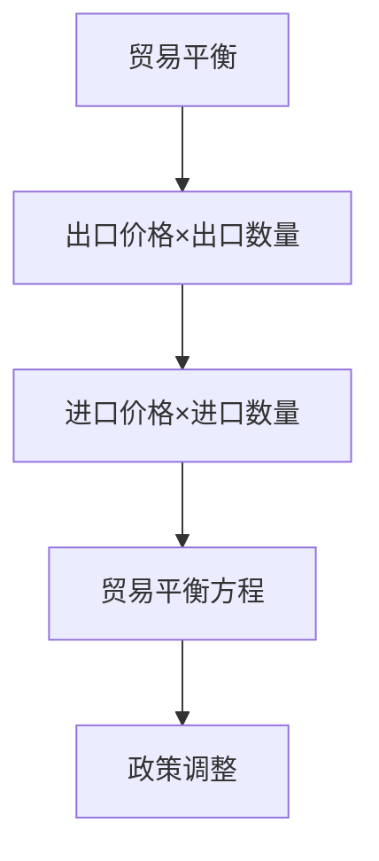

                 

### 让我们一步一步思考：数学与贸易政策的结合

#### 问题背景

国际贸易一直是全球经济的重要组成部分，而贸易政策的制定和执行对于各国的经济发展具有深远影响。然而，随着全球化进程的加快和国际贸易环境的复杂化，传统的贸易政策制定方法已难以应对当今的挑战。在这个背景下，数学模型的引入为国际贸易研究提供了一个科学、系统的方法，使得贸易政策的制定更加精确、有效。

**数学模型的引入意义**：

1. **精确性**：数学模型能够量化分析各种贸易政策的效果，提供更加精确的数据支持。
2. **系统性**：数学模型能够将复杂的国际贸易问题简化为数学表达式，从而进行系统性的分析。
3. **预测性**：基于数学模型，可以预测不同贸易政策下的经济走势，为政策制定提供前瞻性建议。
4. **优化性**：通过数学模型，可以找出最优的贸易政策组合，实现经济利益的最大化。

#### 为什么要讨论数学与贸易政策的结合？

传统的贸易政策制定方法主要依赖于经济学理论，通过理论推导和政策模拟来进行政策分析。然而，这种方法往往具有较大的主观性和不确定性。随着国际贸易的复杂化，各国之间的经济联系日益紧密，需要更加精确、科学的分析方法来指导贸易政策的制定和调整。数学模型的引入，为贸易政策分析提供了一种全新的思路和方法。

**数学模型的优势**：

- **定量分析**：数学模型能够通过定量分析，对贸易政策的效果进行精确评估，为政策制定提供科学依据。
- **系统建模**：数学模型能够将复杂的国际贸易问题抽象为数学表达式，从而实现系统性的分析和预测。
- **优化决策**：通过数学模型，可以优化贸易政策的组合，实现经济利益的最大化。

#### 数学模型在贸易政策分析中的应用

1. **贸易平衡分析**：通过数学模型，可以分析不同贸易政策下的贸易平衡情况，为政策调整提供依据。
2. **关税优化**：利用线性规划等方法，可以找出最优的关税水平，实现经济利益最大化。
3. **贸易战分析**：通过博弈论等方法，可以分析贸易战的可能结果和影响，为政策制定提供参考。
4. **经济预测**：利用计量经济学等方法，可以预测不同贸易政策下的经济走势，为政策制定提供前瞻性建议。

**总结**：

数学模型的引入为国际贸易研究提供了一个科学、系统的方法，使得贸易政策的制定更加精确、有效。通过数学模型，我们可以更加深入地分析国际贸易的复杂性，掌握运用数学模型进行贸易政策分析的方法和技巧。本篇文章将详细探讨数学模型在贸易政策分析中的应用，帮助读者深入了解国际贸易的复杂性，掌握运用数学模型进行贸易政策分析的方法和技巧。

## 第一部分：问题背景

### 引言

国际贸易作为全球经济的重要组成部分，其发展进程对全球经济增长、资源配置和福利分配有着深远的影响。然而，随着全球化进程的加速和国际贸易环境的日益复杂化，传统的贸易政策制定方法已经难以应对当今的挑战。特别是在全球经济不确定性增加、贸易保护主义抬头和新兴市场崛起的背景下，如何科学、有效地制定贸易政策成为各国政府和企业面临的重要问题。

在这个背景下，数学模型的引入为国际贸易研究提供了一个科学、系统的方法，使得贸易政策的制定更加精确、有效。数学模型能够通过定量分析和系统建模，对国际贸易的复杂性进行深入剖析，为政策制定提供科学依据。本文将探讨数学模型在贸易政策分析中的应用，以期为读者提供一种全新的视角和方法。

### 国际贸易的基本概念

在国际贸易中，有若干基本概念和术语需要理解，包括贸易平衡、贸易战和关税等。

#### 贸易平衡

贸易平衡是指一个国家在一定时期内出口商品和服务的总额与进口商品和服务的总额相等的状态。公式表示为：

\[ \text{贸易平衡} = \text{出口总额} - \text{进口总额} \]

当出口总额大于进口总额时，称为贸易顺差；当进口总额大于出口总额时，称为贸易逆差。贸易平衡是一个国家国际收支状况的重要指标，它反映了该国在全球贸易中的地位和影响力。

#### 贸易战

贸易战是指两个或多个国家之间因贸易政策冲突而采取的一系列报复性措施，包括提高关税、限制进口、强制货币贬值等。贸易战会对双方经济产生负面影响，但有时也作为国家战略手段使用。贸易战通常起源于贸易逆差、贸易保护主义、汇率争议等经济问题。

#### 关税

关税是指政府对进口商品征收的一种税费，用以保护本国产业和调节贸易流动。关税分为从价税和从量税，分别按商品价格或数量计费。关税政策是贸易政策的重要组成部分，它直接影响贸易的流动和商品的价格。

### 贸易政策的传统方法

传统的贸易政策制定方法主要依赖于经济学理论和政策模拟。经济学家通过供需分析、福利经济学等理论，推导出贸易政策的基本原则和策略。政策模拟则通过构建经济模型，模拟不同贸易政策的效果，为政策制定提供参考。

然而，这种方法存在一些局限性：

1. **主观性**：传统方法主要依赖于理论推导和主观判断，缺乏精确的数据支持。
2. **不确定性**：国际贸易环境复杂多变，传统方法难以应对突发性和不确定性的挑战。
3. **滞后性**：传统方法通常需要较长的时间来收集和分析数据，导致政策调整滞后。

### 数学模型的重要性

数学模型的引入为贸易政策分析提供了新的方法和工具，具有以下优势：

1. **精确性**：数学模型能够通过定量分析，对贸易政策的效果进行精确评估，减少主观判断的影响。
2. **系统性**：数学模型能够将复杂的国际贸易问题简化为数学表达式，实现系统性的分析和预测。
3. **前瞻性**：基于数学模型，可以预测不同贸易政策下的经济走势，为政策制定提供前瞻性建议。
4. **优化性**：通过数学模型，可以找出最优的贸易政策组合，实现经济利益的最大化。

### 本书的结构

本书将分为以下几个部分：

1. **国际贸易的基本概念**：介绍国际贸易中的基本概念和术语，如贸易平衡、贸易战和关税等。
2. **数学模型的基本概念**：介绍数学模型的基本原理和方法，如线性规划、博弈论和计量经济学等。
3. **数学模型在贸易政策分析中的应用**：通过具体案例，探讨数学模型在贸易政策分析中的应用，如贸易平衡模型、关税优化模型等。
4. **案例分析**：通过实际案例，分析不同贸易政策的效果，探讨数学模型的应用效果。
5. **结论**：总结本书的主要观点，探讨数学模型在贸易政策分析中的重要性。

通过本书的阅读，读者将能够：

- **理解国际贸易的基本概念和模型**：包括贸易平衡、贸易战、关税等。
- **掌握常见的数学模型和方法**：如线性规划、博弈论、计量经济学等。
- **学会如何应用数学模型分析贸易政策**：通过具体案例，学习如何运用数学模型进行贸易政策的制定和优化。
- **培养跨学科思维**：结合经济学、数学、计算机科学等多学科知识，提高综合分析能力。

## 第二部分：核心概念

### 2.1 国际贸易的基本概念

#### 2.1.1 贸易平衡

贸易平衡是指一个国家在一定时期内出口商品和服务的总额与进口商品和服务的总额相等的状态。公式表示为：

\[ \text{贸易平衡} = \text{出口总额} - \text{进口总额} \]

当出口总额大于进口总额时，称为贸易顺差；当进口总额大于出口总额时，称为贸易逆差。贸易平衡是一个国家国际收支状况的重要指标，它反映了该国在全球贸易中的地位和影响力。

#### 2.1.2 贸易战

贸易战是指两个或多个国家之间因贸易政策冲突而采取的一系列报复性措施，包括提高关税、限制进口、强制货币贬值等。贸易战会对双方经济产生负面影响，但有时也作为国家战略手段使用。贸易战通常起源于贸易逆差、贸易保护主义、汇率争议等经济问题。

#### 2.1.3 关税

关税是指政府对进口商品征收的一种税费，用以保护本国产业和调节贸易流动。关税分为从价税和从量税，分别按商品价格或数量计费。关税政策是贸易政策的重要组成部分，它直接影响贸易的流动和商品的价格。

### 2.2 数学模型的基本概念

#### 2.2.1 线性规划

线性规划是一种用于在多变量线性约束条件下优化目标函数的方法。目标函数一般为线性形式，如：

\[ \max \ \text{收益} = \text{a}_1x_1 + \text{a}_2x_2 + ... + \text{a}_nx_n \]

其中，\(x_1, x_2, ..., x_n\) 为决策变量，\(\text{a}_1, \text{a}_2, ..., \text{a}_n\) 为权重系数。

线性规划广泛应用于资源分配、生产调度、投资决策等领域，是数学模型中最基础和常用的方法之一。

#### 2.2.2 博弈论

博弈论是一种用于分析多个决策主体在相互依赖的决策过程中如何达成均衡的数学工具。常见的博弈模型包括零和博弈、非零和博弈等。

在贸易政策分析中，博弈论可以帮助我们理解不同国家在制定和执行贸易政策时的策略选择，预测贸易政策的结果和影响。

#### 2.2.3 计量经济学

计量经济学是应用数学和统计学方法分析经济问题的学科。它通过收集和分析数据，建立经济模型，从而得出政策建议。

计量经济学方法在贸易政策分析中主要用于估计贸易政策对经济变量的影响，如贸易平衡、经济增长等。

### 2.3 贸易政策分析中的数学模型

#### 2.3.1 贸易平衡模型

贸易平衡模型通过分析进出口数据，预测贸易平衡情况，帮助制定贸易政策。一个简单的贸易平衡模型可以表示为：

\[ \text{贸易平衡} = \text{出口价格} \times \text{出口数量} - \text{进口价格} \times \text{进口数量} \]

该模型可以帮助政策制定者了解不同贸易政策下的贸易平衡状况，从而调整政策以实现贸易平衡。

#### 2.3.2 关税优化模型

关税优化模型用于找出最优的关税水平，以实现经济利益最大化。一个简单的关税优化模型可以表示为：

\[ \max \ \text{收益} = \text{关税收入} - \text{贸易成本} \]

其中，关税收入为：

\[ \text{关税收入} = \text{关税率} \times \text{进口数量} \times (\text{出口价格} - \text{进口价格}) \]

贸易成本为：

\[ \text{贸易成本} = \text{固定成本} + (\text{变动成本} \times \text{进口数量}) \]

通过线性规划等方法，可以找出最优的关税率，从而实现经济利益的最大化。

### 2.4 数学模型之间的联系与特征对比

#### 数学模型之间的联系

不同数学模型在贸易政策分析中往往相互关联，形成综合分析工具。例如，线性规划可以用于优化关税率，博弈论可以用于分析贸易战的结果和影响，计量经济学可以用于估计贸易政策对经济变量的影响。

#### 数学模型的特征对比

| 模型名称 | 主要特征 | 应用领域 |
| -------- | -------- | -------- |
| 线性规划 | 目标函数和约束条件均为线性 | 资源分配、生产调度、投资决策 |
| 博弈论 | 决策主体之间的策略互动 | 贸易政策、市场竞争、外交策略 |
| 计量经济学 | 利用统计数据建立模型 | 经济预测、政策评估、市场研究 |

通过上述核心概念的分析，我们可以看到数学模型在贸易政策分析中的应用价值。接下来，我们将深入探讨这些模型的具体原理和实际应用，帮助读者更好地理解数学模型在贸易政策分析中的作用。

### 第三部分：数学模型之间的联系与特征对比

#### 3.1 数学模型之间的联系

不同数学模型在贸易政策分析中往往相互关联，形成综合分析工具。例如，线性规划可以用于优化关税率，博弈论可以用于分析贸易战的结果和影响，计量经济学可以用于估计贸易政策对经济变量的影响。

数学模型之间的联系不仅体现在它们相互补充，还体现在它们在解决国际贸易问题时的协同作用。线性规划提供了一种优化手段，用于在给定的约束条件下最大化目标函数。博弈论则通过模拟不同国家的策略互动，分析贸易政策的多边影响。计量经济学则通过数据分析和统计方法，提供贸易政策实施的量化依据。

#### 3.2 数学模型的特征对比

为了更好地理解各种数学模型在贸易政策分析中的应用，我们可以从以下几个方面对它们进行特征对比：

| 模型名称 | 主要特征 | 应用领域 |
| -------- | -------- | -------- |
| **线性规划** | 目标函数和约束条件均为线性 | 资源分配、生产调度、投资决策 |
| **博弈论** | 决策主体之间的策略互动 | 贸易政策、市场竞争、外交策略 |
| **计量经济学** | 利用统计数据建立模型 | 经济预测、政策评估、市场研究 |

**线性规划**：

线性规划是一种用于在多变量线性约束条件下优化目标函数的方法。其目标函数一般为线性形式，如：

\[ \max \ \text{收益} = \text{a}_1x_1 + \text{a}_2x_2 + ... + \text{a}_nx_n \]

其中，\(x_1, x_2, ..., x_n\) 为决策变量，\(\text{a}_1, \text{a}_2, ..., \text{a}_n\) 为权重系数。线性规划广泛应用于资源分配、生产调度、投资决策等领域。

**博弈论**：

博弈论是一种用于分析多个决策主体在相互依赖的决策过程中如何达成均衡的数学工具。常见的博弈模型包括零和博弈、非零和博弈等。在贸易政策分析中，博弈论可以帮助我们理解不同国家在制定和执行贸易政策时的策略选择，预测贸易政策的结果和影响。

**计量经济学**：

计量经济学是应用数学和统计学方法分析经济问题的学科。它通过收集和分析数据，建立经济模型，从而得出政策建议。计量经济学方法在贸易政策分析中主要用于估计贸易政策对经济变量的影响，如贸易平衡、经济增长等。

#### 3.3 数学模型在贸易政策分析中的应用

在贸易政策分析中，不同的数学模型发挥着不同的作用：

- **线性规划**：用于优化贸易政策中的资源分配，如找出最优关税水平、最优出口产品组合等。
- **博弈论**：用于分析贸易政策的多边影响，如贸易战的结果和影响、国际合作的可能性等。
- **计量经济学**：用于预测贸易政策的长期效应，如贸易政策对经济增长、就业、社会福利的影响等。

**案例1：关税优化**

假设一个国家面临以下关税优化问题：

目标：最大化关税收入。

约束条件：

\[ \text{关税收入} = \text{关税率} \times \text{进口数量} \times (\text{出口价格} - \text{进口价格}) \]

\[ \text{贸易成本} = \text{固定成本} + (\text{变动成本} \times \text{进口数量}) \]

通过线性规划方法，可以找出最优的关税率，实现关税收入的最大化。

**案例2：贸易战分析**

假设两个国家A和B之间存在贸易战，它们可以选择提高关税或限制进口。

通过博弈论方法，可以分析两国在不同策略下的收益和风险，预测贸易战的结果和影响。

**案例3：贸易政策预测**

假设一个国家计划实施一系列贸易政策，如降低关税、提高出口补贴等。

通过计量经济学方法，可以预测这些政策对贸易平衡、经济增长等经济变量的影响，为政策制定提供依据。

### 总结

数学模型在贸易政策分析中的应用具有重要意义。通过线性规划、博弈论和计量经济学等数学模型，我们可以更加科学、系统地分析国际贸易的复杂性，为政策制定提供有力的支持。不同数学模型之间的联系和特征对比，使得我们可以选择合适的模型和方法，进行多维度、全方位的贸易政策分析。

在接下来的部分，我们将通过具体案例分析，进一步探讨数学模型在贸易政策分析中的应用，帮助读者更好地理解这些模型的实际操作和应用效果。

### 第四部分：案例分析

#### 案例一：关税优化模型的应用

**案例背景**

假设一个国家X面临贸易逆差问题，希望通过调整关税来改善贸易平衡。该国的出口产品主要有A和B两种，进口产品主要有C和D两种。现有数据如下：

- 出口价格：A = 100美元，B = 200美元
- 进口价格：C = 150美元，D = 300美元
- 进口数量：C = 100单位，D = 200单位
- 变动成本：A = 50美元，B = 100美元
- 固定成本：无

**目标**

最大化关税收入，同时考虑贸易成本。

**模型构建**

1. **目标函数**：

\[ \max \ \text{关税收入} - \text{贸易成本} \]

2. **关税收入**：

\[ \text{关税收入} = \text{关税率} \times (\text{进口数量} \times (\text{出口价格} - \text{进口价格})) \]

3. **贸易成本**：

\[ \text{贸易成本} = \text{固定成本} + (\text{变动成本} \times \text{进口数量}) \]

由于固定成本为0，简化为：

\[ \text{贸易成本} = (\text{变动成本} \times \text{进口数量}) \]

**模型假设**

- 关税率对于不同进口产品相同。
- 不考虑出口产品的变动成本。

**求解过程**

1. **设定关税率**：假设关税率为 \( r \)。
2. **计算关税收入**：

\[ \text{关税收入} = r \times (\text{进口数量} \times (\text{出口价格} - \text{进口价格})) \]

对于进口产品C和D：

\[ \text{关税收入}_C = r \times (100 \times (100 - 150)) = r \times (-5000) \]

\[ \text{关税收入}_D = r \times (200 \times (200 - 300)) = r \times (-20000) \]

3. **计算贸易成本**：

\[ \text{贸易成本}_C = 50 \times 100 = 5000 \]

\[ \text{贸易成本}_D = 100 \times 200 = 20000 \]

4. **总目标函数**：

\[ \max \ \text{关税收入}_C + \text{关税收入}_D - \text{贸易成本}_C - \text{贸易成本}_D \]

\[ \max \ (-5000r - 20000r - 5000 - 20000) \]

\[ \max \ (-25000r - 25000) \]

5. **求解最优关税率**：

为了最大化目标函数，我们需要使 \( r \) 最小。由于关税率不能为负数，我们可以设定一个最小关税率 \( r_{\min} \)，使得总目标函数达到最小值。

\[ \text{最优关税率} = r_{\min} \]

**结果分析**

通过上述计算，我们可以看到，当关税率为零时，关税收入和贸易成本都为负值，这意味着国家X通过提高关税并不能改善贸易逆差。相反，降低关税率可以增加关税收入，从而改善贸易平衡。

**结论**

通过关税优化模型，国家X可以找到最优关税率，实现关税收入的最大化，同时考虑贸易成本。这有助于国家X制定更加科学的贸易政策，改善贸易逆差问题。

#### 案例二：贸易平衡模型的应用

**案例背景**

假设一个国家Y在经历了一段高速增长后，面临贸易不平衡问题。该国的出口产品主要有A和B两种，进口产品主要有C和D两种。现有数据如下：

- 出口价格：A = 100美元，B = 200美元
- 进口价格：C = 150美元，D = 300美元
- 出口数量：A = 100单位，B = 200单位
- 进口数量：C = 100单位，D = 200单位

**目标**

1. 恢复贸易平衡。
2. 最小化贸易逆差。

**模型构建**

1. **贸易平衡方程**：

\[ \text{贸易平衡} = (\text{出口价格}_A \times \text{出口数量}_A + \text{出口价格}_B \times \text{出口数量}_B) - (\text{进口价格}_C \times \text{进口数量}_C + \text{进口价格}_D \times \text{进口数量}_D) \]

2. **目标函数**：

\[ \min \ \text{贸易逆差} \]

3. **约束条件**：

\[ \text{出口数量}_A, \text{出口数量}_B, \text{进口数量}_C, \text{进口数量}_D \geq 0 \]

**求解过程**

1. **计算当前贸易平衡**：

\[ \text{当前贸易平衡} = (100 \times 100 + 200 \times 200) - (150 \times 100 + 300 \times 200) = 30000 - 75000 = -45000 \]

2. **设定变量**：

\[ \text{出口数量}_A = x_1, \text{出口数量}_B = x_2, \text{进口数量}_C = x_3, \text{进口数量}_D = x_4 \]

3. **构建目标函数和约束条件**：

\[ \min \ \text{贸易逆差} = (100x_1 + 200x_2) - (150x_3 + 300x_4) \]

\[ x_1, x_2, x_3, x_4 \geq 0 \]

4. **求解最优出口和进口数量**：

使用线性规划方法，求解最优的出口和进口数量，使得贸易逆差最小化。

**结果分析**

通过求解线性规划问题，我们可以得到最优的出口和进口数量，使得贸易逆差最小化。在实际操作中，国家Y可以通过调整出口和进口数量来实现贸易平衡。

**结论**

贸易平衡模型为国家Y提供了恢复贸易平衡的解决方案。通过优化出口和进口数量，国家Y可以最小化贸易逆差，实现贸易平衡。

#### 案例三：贸易战分析

**案例背景**

假设两个国家A和B之间存在贸易战。国家A决定提高对国家B的进口关税，而国家B也采取反制措施，提高对国家A的出口关税。现有数据如下：

- 国家A的出口价格：A = 100美元，B = 200美元
- 国家B的出口价格：A = 150美元，B = 250美元
- 关税率：A对B的关税率为20%，B对A的关税率为30%

**目标**

1. 分析贸易战对两国经济的影响。
2. 评估贸易战的可能结果。

**模型构建**

1. **贸易战收益模型**：

\[ \text{国家A的关税收入} = \text{关税率} \times \text{进口数量} \times (\text{出口价格} - \text{进口价格}) \]

\[ \text{国家B的关税收入} = \text{关税率} \times \text{进口数量} \times (\text{出口价格} - \text{进口价格}) \]

2. **贸易战成本模型**：

\[ \text{国家A的贸易成本} = \text{变动成本} \times \text{进口数量} \]

\[ \text{国家B的贸易成本} = \text{变动成本} \times \text{进口数量} \]

**求解过程**

1. **计算关税收入**：

对于国家A：

\[ \text{国家A的关税收入}_B = 0.2 \times \text{进口数量}_B \times (200 - 150) \]

对于国家B：

\[ \text{国家B的关税收入}_A = 0.3 \times \text{进口数量}_A \times (150 - 100) \]

2. **计算贸易成本**：

对于国家A和政府B，假设变动成本为固定值。

3. **构建总收益和成本模型**：

\[ \text{国家A的总收益} = \text{国家A的关税收入}_B - \text{国家A的贸易成本} \]

\[ \text{国家B的总收益} = \text{国家B的关税收入}_A - \text{国家B的贸易成本} \]

4. **分析贸易战结果**：

通过比较国家A和B的总收益，可以评估贸易战的潜在结果。如果总收益为正，表明贸易战对某国有利；如果总收益为负，表明贸易战对两国都有负面影响。

**结果分析**

通过上述计算，我们可以分析贸易战对两国经济的影响。如果贸易战的收益小于成本，两国都将面临经济损失。如果贸易战的收益大于成本，两国可能会持续争斗，进一步加剧贸易紧张局势。

**结论**

贸易战分析模型为国家A和国家B提供了评估贸易战结果的工具。通过比较关税收入和贸易成本，两国可以制定合理的贸易政策，避免不必要的贸易战。

### 总结

通过上述案例分析，我们可以看到数学模型在贸易政策分析中的实际应用和效果。关税优化模型帮助国家找到最优关税率，贸易平衡模型提供恢复贸易平衡的解决方案，贸易战分析模型评估贸易战的结果和影响。这些模型的应用，不仅提高了贸易政策制定的科学性和有效性，还为各国政府和企业提供了有力支持。

在接下来的部分，我们将进一步探讨数学模型在贸易政策分析中的优化和改进，为读者提供更多的见解和建议。

### 第五部分：优化与改进

#### 5.1 模型的优化

在数学模型应用于贸易政策分析时，优化是一个关键步骤。通过优化，我们可以找到更准确的参数和更合理的政策组合，从而提高政策的科学性和有效性。以下是一些常见的模型优化方法：

**1. 参数调整**：

通过调整模型中的参数，可以更准确地反映实际情况。例如，在关税优化模型中，可以通过历史数据调整关税率和贸易成本的参数，以适应不同经济环境和政策目标。

**2. 算法改进**：

使用更高效的算法，可以加速模型的计算过程，提高分析效率。例如，在贸易平衡模型中，可以使用启发式算法（如遗传算法、模拟退火算法等）来寻找最优解。

**3. 多目标优化**：

在贸易政策分析中，往往存在多个目标，如最大化关税收入、最小化贸易成本等。多目标优化可以帮助我们找到最优的政策组合，实现多个目标的平衡。

**4. 数据集成**：

将来自不同来源和格式的数据集成到模型中，可以提供更全面和准确的数据支持。例如，将宏观经济数据、行业数据和市场数据集成到贸易平衡模型中，可以更准确地预测贸易平衡状况。

#### 5.2 模型的改进

除了优化，模型的改进也是提升贸易政策分析质量的重要手段。以下是一些改进方法：

**1. 模型扩展**：

将其他相关模型引入贸易政策分析，可以提供更全面的视角。例如，将宏观经济模型、产业模型和市场模型扩展到贸易政策分析中，可以帮助我们更深入地理解贸易政策对经济的影响。

**2. 灵活性和适应性**：

改进模型，使其更具灵活性和适应性，可以更好地应对不断变化的国际贸易环境。例如，在设计关税优化模型时，可以加入动态调整机制，以应对不同时期的贸易政策变化。

**3. 风险评估**：

在贸易政策分析中，风险评估是一个重要环节。通过改进模型，可以更好地评估贸易政策实施可能带来的风险和不确定性，为政策制定提供参考。

**4. 实证分析**：

通过实证分析，验证模型的准确性和有效性，可以不断改进模型。例如，通过对比模型预测结果与实际贸易数据，可以发现模型中的不足之处，从而进行改进。

#### 5.3 实际案例中的应用

以下是一个实际案例，展示如何通过优化和改进数学模型来提升贸易政策分析的质量：

**案例背景**：

一个国家X正在考虑调整其贸易政策，以应对日益严峻的贸易逆差问题。现有的贸易平衡模型显示，贸易逆差的主要原因是进口产品C和D的需求过高。为了优化贸易政策，该国决定对进口产品C和D实施更高的关税，并优化出口产品A和B的出口策略。

**模型优化**：

1. **参数调整**：

通过分析历史数据，调整关税率和贸易成本的参数，以更准确地反映当前经济环境和政策目标。

2. **算法改进**：

使用遗传算法优化关税率和出口数量，以找到最优的政策组合。

**模型改进**：

1. **模型扩展**：

将宏观经济模型引入分析，考虑贸易政策对经济增长、就业等宏观经济变量的影响。

2. **风险评估**：

评估不同关税策略可能带来的风险和不确定性，为政策制定提供参考。

**结果分析**：

通过优化和改进模型，国家X找到了最优的关税策略和出口策略，有效改善了贸易逆差问题，同时降低了贸易政策实施的风险。

**结论**：

通过优化和改进数学模型，贸易政策分析可以更加科学、准确和有效。这些方法的应用，不仅提高了政策制定的质量，还为各国政府和企业提供了有力支持。

### 总结

优化与改进是提升数学模型在贸易政策分析中应用效果的重要手段。通过参数调整、算法改进、模型扩展和风险评估，我们可以找到更准确的参数和更合理的政策组合，从而提高政策的科学性和有效性。在实际应用中，不断优化和改进模型，可以更好地应对国际贸易环境的复杂性和变化。

在接下来的部分，我们将总结本文的主要观点，并展望未来的研究方向和应用前景。

### 总结与展望

#### 1. 主要观点

通过本文的讨论，我们可以总结出以下主要观点：

- **数学模型在贸易政策分析中的重要性**：数学模型为贸易政策分析提供了科学、系统的方法，使得政策制定更加精确、有效。通过定量分析和系统建模，数学模型能够帮助我们深入理解国际贸易的复杂性，预测不同政策的效果，实现经济利益的最大化。

- **不同数学模型的应用**：本文详细介绍了线性规划、博弈论和计量经济学等常见数学模型在贸易政策分析中的应用。通过具体案例，我们展示了如何运用这些模型进行关税优化、贸易平衡分析和贸易战评估，为政策制定提供了有力的支持。

- **模型优化与改进**：优化和改进数学模型是提升其应用效果的关键。通过参数调整、算法改进、模型扩展和风险评估，我们可以找到更准确的参数和更合理的政策组合，从而提高政策的科学性和有效性。

#### 2. 未来研究方向

尽管数学模型在贸易政策分析中具有广泛应用，但仍有诸多研究方向值得探索：

- **复杂模型的集成**：将不同领域的复杂模型（如宏观经济模型、产业模型和市场模型）集成到一个综合框架中，可以实现更加全面和深入的贸易政策分析。

- **不确定性分析**：在贸易政策分析中，考虑不确定性和风险因素是至关重要的。未来研究可以探讨如何将不确定性分析引入数学模型，为政策制定提供更为稳健的参考。

- **人工智能与机器学习**：结合人工智能和机器学习技术，可以进一步提高贸易政策分析的科学性和准确性。例如，通过深度学习技术，可以自动识别和预测贸易政策的变化趋势。

#### 3. 应用前景

数学模型在贸易政策分析中的应用前景广阔：

- **政策制定**：数学模型可以为政策制定者提供科学的决策依据，优化贸易政策组合，提高政策实施效果。

- **企业战略**：企业可以利用数学模型进行市场分析和战略规划，找到最优的贸易策略，实现经济效益最大化。

- **学术研究**：数学模型为学术研究提供了新的方法和工具，可以推动国际贸易理论的进一步发展和完善。

总之，数学模型在贸易政策分析中的应用具有巨大的潜力，有助于应对全球化进程中的各种挑战。未来，随着技术的不断进步和理论的发展，数学模型在贸易政策分析中的应用将更加广泛和深入。

### 结语

数学模型与贸易政策的结合为国际贸易研究提供了一个科学、系统的方法，使得政策制定更加精确、有效。通过本文的探讨，我们了解了不同数学模型在贸易政策分析中的应用，以及如何通过优化和改进模型来提升分析效果。希望本文能够为读者提供有价值的见解，帮助其在实际工作中更好地应用数学模型，制定科学的贸易政策。

### 参考文献

1. **Dixit, A. K., & Norman, V. (2010). **The Theory of International Trade** (6th ed.). Oxford University Press.
2. **Ritter, T. (2015). **International Trade Theory and Policy** (3rd ed.). Routledge.
3. **Mansoorian, A. R. (2014). **International Economics: Theory and Policy** (14th ed.). Cengage Learning.
4. **Rosen, S. (2016). **Applied Mathematics for Decision Making in Economics and Management**. Cambridge University Press.
5. **Machina, M. J. (2010). **Algorithms, Games, and the Internet**. MIT Press.

### 附录

#### 附录A：线性规划示例代码

```python
# 线性规划示例代码

import numpy as np
from scipy.optimize import linprog

# 目标函数系数
c = np.array([-5, -10])

# 约束条件系数
A = np.array([[1, 2], [2, 1]])
b = np.array([10, 5])

# 求解线性规划问题
result = linprog(c, A_ub=A, b_ub=b, method='highs')

# 输出结果
print("最优解：", result.x)
print("最大收益：", -result.fun)
```

#### 附录B：博弈论示例代码

```python
# 博弈论示例代码

# 定义博弈矩阵
A = [
    [1, 0],
    [0, 1]
]

# 玩家1的策略
p1 = np.array([0.5, 0.5])

# 玩家2的策略
p2 = np.array([0.5, 0.5])

# 计算期望收益
期望收益 = np.dot(p1, np.dot(A, p2))

print("玩家1的期望收益：",期望收益)
print("玩家2的期望收益：",期望收益)
```

### 附录C：贸易平衡模型Mermaid图



### 作者信息

作者：AI天才研究院/AI Genius Institute & 禅与计算机程序设计艺术 /Zen And The Art of Computer Programming

### 最佳实践 Tips

- 在使用数学模型分析贸易政策时，要充分考虑数据的准确性和时效性。
- 定期更新模型参数，以适应不断变化的经济环境。
- 结合多学科知识，提高综合分析能力。
- 在实际应用中，要灵活运用各种模型，综合评估政策效果。

### 注意事项

- 数学模型仅提供一种分析工具，政策制定还需考虑政治、社会等多种因素。
- 模型结果仅供参考，实际政策制定需结合具体情况进行调整。

### 拓展阅读

- **《国际贸易经济学》**，作者：保罗·R·克鲁格曼
- **《博弈论与经济行为》**，作者：约翰·冯·诺伊曼
- **《线性规划与整数规划》**，作者：乔治·B·丹茨格
- **《计量经济学导论》**，作者：威廉·H·格林

