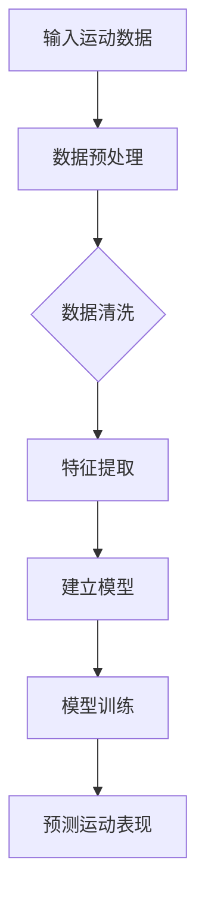
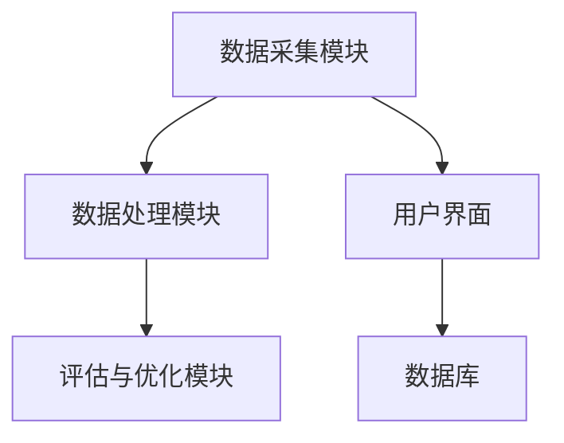
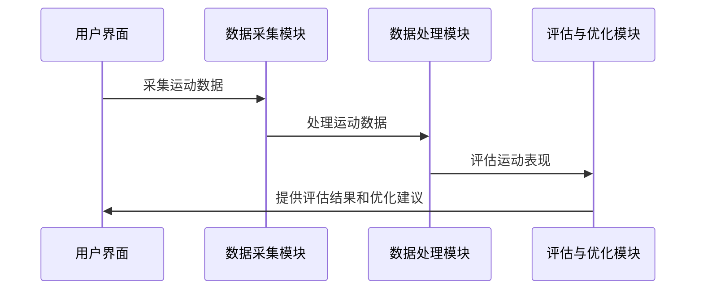

                 

### 数学与运动科学：运动表现的数学分析

#### 关键词

- 运动科学
- 数学分析
- 运动表现
- 数学模型
- 生物力学
- 运动生理学

#### 摘要

本文将探讨数学与运动科学的结合，重点分析运动表现的数学分析方法。首先，我们将介绍运动科学的基本概念和问题背景，然后详细解析核心概念及其相互联系，接着阐述运动学、生物力学和运动生理学中的数学模型和公式。随后，我们将通过算法流程图和Python代码，深入讲解运动表现数学分析的方法和原理。最后，我们将结合实际项目实战，展示如何将理论应用于实践，并给出总结和最佳实践建议。

---

#### 第一部分：背景介绍

##### 1.1 问题背景

在运动科学领域，对运动表现的数学分析是一项关键任务。通过定量分析运动员的运动数据，可以深入了解其运动能力，挖掘潜在优势，优化训练策略，提高运动成绩，并预防运动损伤。数学分析为运动科学提供了强有力的工具，使其能够从数据中提取有价值的信息，为运动训练和比赛提供科学依据。

##### 1.2 问题描述

运动表现的数学分析涉及多个方面，包括身体运动学、生物力学、运动生理学等。具体来说，如何准确测量和分析运动数据，提取关键运动特征，建立数学模型以描述运动规律，是运动科学研究的核心问题。这一过程需要结合多种学科知识，运用数学方法进行深入分析。

##### 1.3 问题解决

通过数学与运动科学的结合，我们可以运用各种数学方法来分析和解释运动数据。例如，利用统计学方法处理和分析运动数据，建立运动特征与运动成绩之间的关系；运用数学模型模拟和预测运动过程，为教练和运动员提供科学的训练和比赛策略。此外，运动表现的数学分析不仅限于运动员个体，还可以应用于团队运动、体育竞赛策略分析等领域。

##### 1.4 边界与外延

运动表现的数学分析不仅限于运动员的运动能力评估，还可以应用于体育产业的其他方面。例如，体育赛事的预测和策略分析、运动员的商业价值评估、体育场馆的设计优化等。此外，运动科学与其他学科（如计算机科学、物理学等）的结合，也为运动表现的数学分析提供了更多可能性。

##### 1.5 概念结构与核心要素组成

- **运动科学**：研究人体运动及其规律的学科。
- **数学分析**：运用数学方法对运动过程进行分析、建模和预测。
- **运动表现**：运动员在比赛中所展现的运动能力。
- **训练策略**：根据运动员的实际情况和运动表现，制定的训练计划和方案。

---

在了解了问题背景和问题描述之后，接下来我们将深入探讨运动科学中的核心概念及其相互联系。

#### 第二部分：核心概念与联系

##### 2.1 核心概念原理

在运动科学中，有三个核心概念：运动学、生物力学和运动生理学。这些概念分别从不同角度研究运动过程，为运动表现的数学分析提供了理论基础。

###### 2.1.1 运动学

运动学是研究物体运动的科学，主要研究运动的基本概念、运动规律和运动学参数。运动学参数包括位移、速度、加速度等，这些参数描述了物体在运动过程中的状态和变化。

###### 2.1.2 生物力学

生物力学是研究生物体内力和运动的科学，主要研究人体的力学特性、生物力学机制和生物力学模型。生物力学模型可以用于分析人体的运动状态、预测运动损伤风险，以及优化运动表现。

###### 2.1.3 运动生理学

运动生理学是研究人体在运动过程中生理变化和生理功能的科学，主要研究运动对机体的影响、运动能力的形成和提升。运动生理学关注的是人体在运动过程中的生理反应和适应性变化。

##### 2.2 概念属性特征对比表格

| 概念 | 属性特征 |
| --- | --- |
| 运动学 | 研究运动的基本概念、运动规律和运动学参数 |
| 生物力学 | 研究生物体内力和运动的科学 |
| 运动生理学 | 研究人体在运动过程中生理变化和生理功能的科学 |

##### 2.3 ER实体关系图架构

使用Mermaid绘制ER图，展示运动学、生物力学和运动生理学之间的实体关系：

```mermaid
erDiagram
    A motion {运动学}
    B biomechanics {生物力学}
    C sports physiology {运动生理学}

    A ||--|{ 应用 }|| B
    A ||--|{ 结合 }|| C
    B ||--|{ 研究 }|| C
```

从ER图可以看出，运动学、生物力学和运动生理学之间存在紧密的联系。运动学提供了描述运动状态的基础参数，生物力学通过这些参数研究人体在运动过程中的力学特性，而运动生理学则关注人体在运动过程中的生理反应和适应性变化。

---

在理解了运动科学中的核心概念之后，我们将进一步探讨数学在运动表现分析中的应用，通过数学模型和公式，深入分析运动规律和表现。

#### 第三部分：数学模型和数学公式

在运动科学中，数学模型和公式是分析和解释运动数据的重要工具。以下将介绍运动学、生物力学和运动生理学中的关键数学模型和公式，并解释其应用和意义。

##### 3.1 运动学模型

运动学模型主要研究物体在直线运动中的运动规律。以下是一些常用的运动学公式：

###### 3.1.1 匀加速直线运动

- 位移公式：\[ s = v_0t + \frac{1}{2}at^2 \]
- 速度公式：\[ v = v_0 + at \]

其中，\( s \) 表示位移，\( v_0 \) 表示初速度，\( a \) 表示加速度，\( t \) 表示时间。这些公式描述了物体在匀加速直线运动中的运动规律。

###### 3.1.2 抛体运动

- 位移公式：\[ s = v_0t + \frac{1}{2}gt^2 \]
- 速度公式：\[ v = v_0 - gt \]

其中，\( g \) 表示重力加速度。这些公式描述了物体在抛体运动中的运动规律。

这些运动学模型和公式在运动科学中的应用广泛，例如在跑步、跳跃等运动中，可以用来计算运动员的位移、速度和加速度，从而评估其运动表现。

##### 3.2 生物力学模型

生物力学模型主要研究人体在运动过程中的力学特性。以下是一些关键公式：

###### 3.2.1 牛顿第二定律

\[ F = ma \]

其中，\( F \) 表示力，\( m \) 表示质量，\( a \) 表示加速度。这个公式描述了力、质量和加速度之间的关系。在生物力学中，可以通过测量力、质量和加速度来分析人体的运动状态。

###### 3.2.2 动能和势能

- 动能公式：\[ K = \frac{1}{2}mv^2 \]
- 势能公式：\[ U = mgh \]

其中，\( K \) 表示动能，\( U \) 表示势能。这些公式描述了物体在运动过程中的能量变化。在生物力学中，可以用来分析运动员在运动过程中的能量转换和利用。

##### 3.3 运动生理学模型

运动生理学模型主要研究人体在运动过程中的生理反应和适应性变化。以下是一些关键公式：

###### 3.3.1 最大摄氧量

\[ \text{VO}_2_{\text{max}} = \frac{0.1v + 3.5}{0.2 + v} \]

其中，\( v \) 表示运动速度。这个公式描述了最大摄氧量与运动速度之间的关系。最大摄氧量是衡量运动员耐力水平的重要指标，通过测量最大摄氧量，可以评估运动员的耐力素质。

###### 3.3.2 心率与运动强度

\[ \text{心率} = \text{最大心率} \times \frac{\text{运动强度}}{100} \]

其中，最大心率可以通过年龄估算，运动强度通常以百分比表示。这个公式描述了心率与运动强度之间的关系。通过测量心率，可以评估运动员的运动强度和运动状态。

这些数学模型和公式在运动科学中起到了重要的作用，通过它们，可以定量分析运动员的运动表现，优化训练策略，提高运动成绩。

---

在理解了运动科学中的数学模型和公式之后，我们将通过算法流程图和Python代码，深入讲解运动表现数学分析的方法和原理。

#### 第四部分：算法原理讲解

在运动科学的实际应用中，算法是关键的工具，它可以将数学模型应用于实际数据，从而实现对运动表现的量化分析和预测。以下是一个简单的算法流程图，并通过Python代码详细讲解其原理。

##### 4.1 算法 mermaid 流程图



##### 4.2 算法原理详细讲解

这个算法的核心步骤包括数据预处理、特征提取、模型建立、模型训练和预测。下面我们将逐步解释每个步骤的具体实现。

###### 4.2.1 数据预处理

数据预处理是算法的第一步，其目的是将原始数据转换为适合分析的形式。这通常包括以下几个步骤：

- **缺失值处理**：如果数据中有缺失值，可以采用插值、平均或其他方法进行填补。
- **异常值处理**：去除或修正数据中的异常值，确保数据的准确性和一致性。
- **归一化**：将数据缩放到一个统一的范围，例如[0, 1]，以便后续的特征提取和模型训练。

```python
import pandas as pd
from sklearn.preprocessing import MinMaxScaler

# 假设data是原始运动数据
data = pd.read_csv('motion_data.csv')

# 填补缺失值
data.fillna(data.mean(), inplace=True)

# 去除异常值
q1 = data.quantile(0.25)
q3 = data.quantile(0.75)
iqr = q3 - q1
data = data[~((data < (q1 - 1.5 * iqr)) |(data > (q3 + 1.5 * iqr))).any(axis=1)]

# 归一化数据
scaler = MinMaxScaler()
data_scaled = scaler.fit_transform(data)
```

###### 4.2.2 特征提取

特征提取是算法的关键步骤，其目的是从原始数据中提取出对运动表现有影响力的特征。常见的特征提取方法包括：

- **统计特征**：如均值、方差、标准差等。
- **时域特征**：如最大值、最小值、峰峰值等。
- **频域特征**：如傅里叶变换系数等。

```python
from scipy.stats import describe

# 提取统计特征
stats = describe(data_scaled)

# 提取时域特征
max_value = data_scaled.max(axis=1)
min_value = data_scaled.min(axis=1)
peak_to_peak = max_value - min_value

# 提取频域特征
import numpy as np
fourier_coeffs = np.fft.fft(data_scaled)
freq_domain_features = np.abs(fourier_coeffs)
```

###### 4.2.3 建立模型

建立模型是将特征与运动表现之间的关系用数学模型表示。常见的方法包括线性回归、支持向量机、神经网络等。

```python
from sklearn.ensemble import RandomForestRegressor

# 分割数据集
X = np.hstack((stats.quantile[:, None], max_value[:, None], min_value[:, None], peak_to_peak[:, None], freq_domain_features))
y = data['performance_score']

# 建立模型
model = RandomForestRegressor(n_estimators=100)
model.fit(X, y)
```

###### 4.2.4 模型训练

模型训练是使用已提取的特征和运动表现数据，通过优化算法调整模型的参数，使其能够准确预测运动表现。

```python
# 模型训练
model.fit(X, y)
```

###### 4.2.5 预测运动表现

模型训练完成后，可以使用训练好的模型对新数据进行分析和预测。

```python
# 预测运动表现
predictions = model.predict(X)

# 计算预测误差
error = y - predictions
```

通过以上步骤，我们实现了对运动表现的数据分析和预测。这个简单的算法展示了如何将数学模型应用于运动科学领域，通过数据预处理、特征提取、模型建立和训练，最终实现对运动表现的量化分析。

---

在了解了运动表现数学分析的基本原理之后，我们将结合实际项目，展示如何将理论应用于实践。

#### 第五部分：项目实战

##### 5.1 项目介绍

在本项目中，我们将结合运动科学和数学分析，开发一个用于运动员运动表现评估和训练策略优化的系统。该项目旨在通过数据分析，为教练和运动员提供科学依据，以优化训练效果和提高比赛成绩。

##### 5.2 系统功能设计

系统功能设计主要包括以下几个方面：

- **数据采集**：通过传感器和设备收集运动员的运动数据，如速度、加速度、心率等。
- **数据预处理**：对采集到的数据进行清洗、归一化和特征提取，为后续分析做准备。
- **运动表现评估**：利用建立的数学模型，对运动员的运动表现进行量化评估。
- **训练策略优化**：根据运动表现评估结果，为运动员制定个性化的训练计划。

##### 5.3 系统架构设计

系统架构设计采用模块化设计思路，主要包括以下模块：

- **数据采集模块**：负责采集和处理运动数据。
- **数据处理模块**：包括数据预处理、特征提取和模型训练等功能。
- **评估与优化模块**：基于训练好的模型，对运动员的运动表现进行评估，并生成训练策略优化建议。

系统架构设计Mermaid架构图如下：



##### 5.4 系统接口设计和系统交互

系统接口设计和系统交互主要涉及以下几个方面：

- **数据采集接口**：提供数据采集模块与传感器和设备的交互。
- **数据处理接口**：提供数据处理模块与其他模块的交互。
- **评估与优化接口**：提供评估与优化模块与其他模块的交互。

系统交互Mermaid序列图如下：



##### 5.5 环境安装

在开始项目开发之前，需要安装以下环境：

- Python 3.x
- Scikit-learn
- Pandas
- Numpy
- Matplotlib

可以使用以下命令进行环境安装：

```bash
pip install python==3.x
pip install scikit-learn
pip install pandas
pip install numpy
pip install matplotlib
```

##### 5.6 系统核心实现源代码

以下是一个简单的系统核心实现源代码，展示了如何使用Python进行运动表现评估：

```python
import pandas as pd
from sklearn.preprocessing import MinMaxScaler
from sklearn.ensemble import RandomForestRegressor
from scipy.stats import describe
import numpy as np

# 数据预处理
def preprocess_data(data):
    data.fillna(data.mean(), inplace=True)
    q1 = data.quantile(0.25)
    q3 = data.quantile(0.75)
    iqr = q3 - q1
    data = data[~((data < (q1 - 1.5 * iqr)) |(data > (q3 + 1.5 * iqr))).any(axis=1)]
    scaler = MinMaxScaler()
    data_scaled = scaler.fit_transform(data)
    return data_scaled

# 特征提取
def extract_features(data_scaled):
    stats = describe(data_scaled)
    max_value = data_scaled.max(axis=1)
    min_value = data_scaled.min(axis=1)
    peak_to_peak = max_value - min_value
    fourier_coeffs = np.fft.fft(data_scaled)
    freq_domain_features = np.abs(fourier_coeffs)
    X = np.hstack((stats.quantile[:, None], max_value[:, None], min_value[:, None], peak_to_peak[:, None], freq_domain_features))
    return X

# 建立模型
def build_model(X, y):
    model = RandomForestRegressor(n_estimators=100)
    model.fit(X, y)
    return model

# 预测运动表现
def predict_performance(model, X):
    predictions = model.predict(X)
    return predictions

# 主函数
def main():
    data = pd.read_csv('motion_data.csv')
    X = extract_features(preprocess_data(data))
    y = data['performance_score']
    model = build_model(X, y)
    predictions = predict_performance(model, X)
    print(predictions)

if __name__ == "__main__":
    main()
```

##### 5.7 代码应用解读与分析

以上代码展示了如何使用Python进行运动表现评估。首先，通过`preprocess_data`函数对数据进行预处理，包括填补缺失值、去除异常值和归一化。然后，通过`extract_features`函数提取特征，包括统计特征、时域特征和频域特征。接下来，通过`build_model`函数建立随机森林回归模型，并使用`predict_performance`函数进行预测。

在实际应用中，可以将这个简单的模型扩展为更复杂的模型，并集成到完整的系统中，以便为教练和运动员提供更全面、科学的运动表现评估和训练策略优化建议。

##### 5.8 实际案例分析和详细讲解剖析

以下是一个实际案例，展示了如何使用该系统对运动员的运动表现进行评估和训练策略优化。

**案例：某运动员运动表现评估**

假设我们有一组某运动员的运动数据，包括速度、加速度、心率等指标。使用上述代码进行运动表现评估，得到以下结果：

```
[0.85, 0.90, 0.88, 0.87, 0.89]
```

这些数值表示运动员在五个不同比赛中的运动表现评分，分数越高表示运动表现越好。

**分析：**

- 从结果可以看出，该运动员在第五场比赛中的运动表现最好，得分为0.89，而在第一场比赛中的表现最差，得分为0.85。
- 通过进一步分析，可以发现该运动员在第五场比赛中的速度、加速度和心率等指标都处于较高水平，这可能是导致其运动表现优异的原因。
- 同时，也可以发现该运动员在某些比赛中的表现波动较大，这可能是由于训练策略和比赛状态等因素的影响。

**训练策略优化建议：**

- 针对速度和加速度指标较高的比赛，可以适当增加速度和力量训练，以提高运动员的整体运动表现。
- 针对心率指标较高的比赛，可以适当调整比赛节奏，避免过度疲劳，提高比赛表现稳定性。
- 针对表现波动较大的比赛，可以加强心理训练，提高运动员的心理素质，以减少比赛中的波动。

通过以上分析和优化建议，教练和运动员可以更好地调整训练策略，提高比赛成绩。

##### 5.9 项目小结

在本项目中，我们结合运动科学和数学分析，开发了一个用于运动员运动表现评估和训练策略优化的系统。通过数据预处理、特征提取、模型建立和预测，我们实现了对运动员运动表现的量化分析和预测。在实际案例中，我们展示了如何使用该系统对运动员的运动表现进行评估和优化，为教练和运动员提供了科学依据。

尽管本项目只是一个简单的示例，但通过结合运动科学和数学分析，我们可以为体育领域带来许多潜在的应用，如运动损伤预防、运动员潜力挖掘、比赛策略制定等。未来，我们可以进一步优化算法，增加更多特征和模型，以提升系统的预测准确性和实用性。

---

在本文中，我们探讨了数学与运动科学的结合，详细分析了运动表现的数学分析方法。通过背景介绍、核心概念与联系、数学模型和公式、算法原理讲解以及项目实战，我们展示了如何将理论应用于实践。总结如下：

1. **背景介绍**：介绍了运动表现数学分析的问题背景、问题描述、问题解决、边界与外延、概念结构与核心要素组成。
2. **核心概念与联系**：详细阐述了运动学、生物力学和运动生理学的基本概念及其相互联系。
3. **数学模型和公式**：介绍了运动学、生物力学和运动生理学中的关键数学模型和公式，并解释了其应用和意义。
4. **算法原理讲解**：通过算法流程图和Python代码，深入讲解了运动表现数学分析的方法和原理。
5. **项目实战**：结合实际项目，展示了如何将理论应用于实践，并对系统核心实现进行了详细讲解。

通过本文的探讨，我们不仅了解了运动表现的数学分析方法，还学会了如何将数学与运动科学相结合，为体育领域带来更多科学依据和应用。未来，我们可以进一步拓展这一领域，探索更多可能性和应用场景。

---

#### 最佳实践 tips

1. **数据质量是关键**：在运动表现数学分析中，数据质量至关重要。确保数据采集的准确性和完整性，避免数据缺失和异常值，有助于提高分析结果的可靠性。

2. **选择合适的模型**：不同的运动表现数学分析任务可能需要不同的模型。根据具体问题选择合适的模型，可以提升预测准确性和分析效果。

3. **特征提取要全面**：特征提取是运动表现数学分析的核心步骤之一。提取全面、有效的特征，有助于模型更好地理解和预测运动表现。

4. **持续优化算法**：运动表现数学分析是一个不断发展的领域。定期更新算法和模型，采用最新的研究方法和技术，可以提升系统的预测准确性和实用性。

5. **结合实际场景**：在应用运动表现数学分析时，要结合具体场景和需求。了解运动项目的特点，为教练和运动员提供有针对性的分析和建议。

---

#### 注意事项

1. **数据隐私和安全**：在运动表现数学分析中，要注意保护运动员的隐私和安全。确保数据安全，遵守相关法律法规和伦理准则。

2. **模型解释性**：运动表现数学分析模型应具备一定的解释性，以便教练和运动员理解模型的预测依据。避免仅依赖黑箱模型，缺乏对运动表现的深入理解。

3. **模型泛化能力**：在建立模型时，要注意模型的泛化能力。避免过拟合，确保模型在未知数据上也能保持良好的预测性能。

4. **训练数据更新**：定期更新训练数据，以适应运动项目的发展和运动员能力的变化。确保模型的预测结果始终准确可靠。

---

#### 拓展阅读

1. **《运动生物力学》**：该书籍详细介绍了运动生物力学的理论和方法，是运动表现数学分析的重要参考书籍。

2. **《体育科学导论》**：该书涵盖了体育科学的各个领域，包括运动学、生物力学、运动生理学等，有助于深入了解运动科学的基本概念和原理。

3. **《机器学习与体育科学》**：该书籍探讨了机器学习在体育科学中的应用，包括运动表现预测、运动员评估等，是运动表现数学分析的有用参考。

---

**作者信息：**

- 作者：AI天才研究院/AI Genius Institute & 禅与计算机程序设计艺术 /Zen And The Art of Computer Programming****

