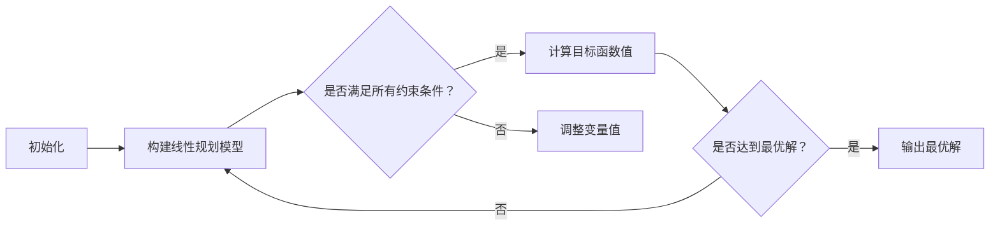
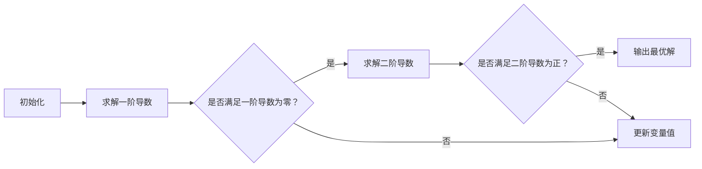
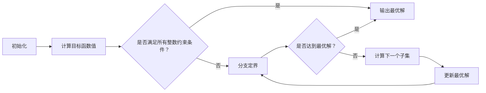
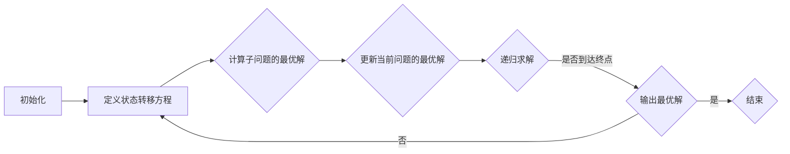
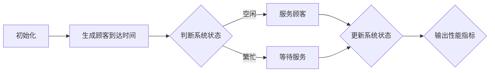
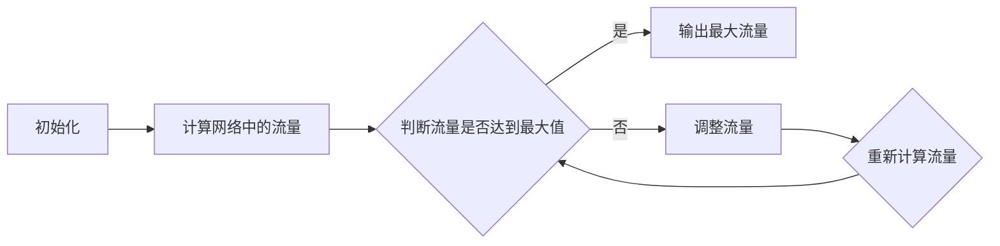
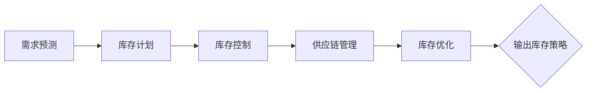

                 

## 文章标题

### 关键词

- 数学与运筹学
- 资源优化
- 数学模型
- 算法
- 实际应用

### 摘要

本文旨在深入探讨数学与运筹学在资源优化中的应用，通过构建数学模型，分析各类资源优化问题，提供解决问题的思路和方法。文章结构紧凑，逻辑清晰，旨在为广大读者提供一份既有深度又有广度的资源优化指南。通过本文，读者将了解如何运用数学与运筹学的原理，解决现实中的资源优化问题，提高工作效率和资源利用率。

## 目录大纲

- **第一部分：引言**
  - 第1章：背景与概述
  - 第2章：核心概念与原理

- **第二部分：数学模型**
  - 第3章：线性规划
  - 第4章：非线性规划
  - 第5章：整数规划
  - 第6章：动态规划

- **第三部分：运筹学应用**
  - 第7章：排队论
  - 第8章：网络流
  - 第9章：库存管理

- **第四部分：案例分析与实战**
  - 第10章：生产线调度优化
  - 第11章：物流配送路径优化

- **第五部分：最佳实践与总结**
  - 第12章：最佳实践与总结

本文将以逻辑清晰、结构紧凑、简单易懂的专业的技术语言，一步一步分析推理思考的方式，深入探讨数学与运筹学在资源优化中的应用。希望通过本文，读者能够对资源优化有更深入的理解，并能够将其应用于实际工作中，提高资源利用效率。

## 第一部分：引言

### 第1章：背景与概述

#### 1.1 问题背景

在当今竞争激烈的市场环境中，资源优化已成为各类企业和组织的关键问题。无论是生产、物流、金融，还是公共服务，资源优化都能够显著提高效率和降低成本。资源优化涉及的问题多种多样，包括生产调度、库存管理、物流配送等。这些问题都涉及资源在不同时间、空间和条件下的合理配置和利用。

#### 1.2 问题描述

资源优化问题的核心是如何在有限的资源条件下，实现最大化的效益。这包括如何安排生产计划、如何设计物流路径、如何控制库存水平等。这些问题虽然具体表现形式不同，但都可以通过数学模型和运筹学方法进行建模和求解。

#### 1.3 问题解决

解决资源优化问题的方法主要包括线性规划、非线性规划、整数规划和动态规划等。这些方法通过建立数学模型，将复杂的问题转化为可计算的形式，从而找到最优解或近似解。此外，运筹学还提供了一系列优化策略和算法，如排队论、网络流和库存管理模型，用于解决具体的资源优化问题。

#### 1.4 边界与外延

资源优化问题的边界涉及资源的类型、数量、质量和时间等。例如，在生产线调度中，资源的类型包括机器、工人和原材料等；在物流配送中，资源的数量和位置信息是关键；在库存管理中，资源的质量和保质期也需要考虑。资源优化问题的外延则包括如何在不同环境和条件下进行资源优化，如何处理不确定性和动态变化等。

#### 1.5 核心概念与联系

核心概念包括线性规划、非线性规划、整数规划和动态规划等。这些概念都是构建数学模型的基础，通过它们可以分析不同类型的资源优化问题。例如，线性规划适用于具有线性目标函数和线性约束条件的问题，而动态规划则适用于具有时间依赖性的问题。这些核心概念之间存在着紧密的联系，共同构成了解决资源优化问题的理论基础。

### 第2章：核心概念与原理

#### 2.1 核心概念原理

核心概念包括线性规划、非线性规划、整数规划和动态规划等。这些概念通过建立数学模型，将资源优化问题转化为数学问题，然后利用数学方法求解。

- **线性规划**：线性规划的目标是最小化或最大化线性目标函数，满足线性约束条件。线性规划广泛应用于资源优化问题，如生产调度、物流配送和库存管理等。
  
- **非线性规划**：非线性规划的目标是最小化或最大化非线性目标函数，满足非线性约束条件。非线性规划比线性规划更为复杂，但适用于更广泛的资源优化问题。

- **整数规划**：整数规划的目标是最小化或最大化目标函数，满足整数约束条件。整数规划常用于优化问题，如资源分配和路径规划。

- **动态规划**：动态规划适用于具有时间依赖性的资源优化问题。动态规划通过递归关系和状态转移方程，找到最优解。

#### 2.2 概念属性特征对比

以下是对线性规划、非线性规划、整数规划和动态规划的概念属性特征进行对比：

| 概念          | 线性规划          | 非线性规划         | 整数规划         | 动态规划          |
| ------------- | ------------- | ------------ | ------------ | ------------- |
| 目标函数      | 线性函数        | 非线性函数      | 线性或非线性函数 | 线性或非线性函数 |
| 约束条件      | 线性约束条件   | 非线性约束条件 | 整数约束条件    | 时间依赖约束条件 |
| 适用问题      | 线性问题        | 非线性问题      | 整数问题        | 时间依赖问题     |
| 求解方法      | 单纯形法、图解法 | 求导法、迭代法   | 分支定界法、割平面法 | 递推法、状态转移方程 |

#### 2.3 ER实体关系图架构

ER实体关系图是构建数学模型的重要工具，用于表示实体及其之间的关联关系。以下是一个简单的ER实体关系图示例，用于表示资源优化问题中的关键实体：

```mermaid
erDiagram
  Product ||--|{ Machine }|-- ProductionOrder
  Machine ||--|{ Worker }|-- ProductionOrder
  Product ||--|{ Inventory }|-- Warehouse
  Warehouse ||--|{ Delivery }|-- Customer
```

该ER实体关系图表示了生产、物流和库存管理中的关键实体及其关联关系。通过这个ER实体关系图，可以构建更复杂的数学模型，用于分析资源优化问题。

### 第1章总结

本章介绍了资源优化问题的背景、问题描述、问题解决方法、边界与外延以及核心概念与原理。通过本章的学习，读者将了解资源优化问题的基本概念和原理，为后续章节的学习打下基础。

### 第2章总结

本章深入探讨了资源优化的核心概念，包括线性规划、非线性规划、整数规划和动态规划。通过对这些概念属性特征的对比，读者可以更好地理解不同类型资源优化问题的特点和应用场景。此外，通过ER实体关系图架构的介绍，读者可以直观地看到资源优化问题中的关键实体及其关联关系，为构建数学模型提供了重要参考。

## 第二部分：数学模型

### 第3章：线性规划

#### 3.1 算法原理

线性规划是一种数学优化方法，用于求解线性目标函数在满足线性约束条件下的最优解。其基本原理是利用单纯形法或图解法等求解方法，逐步迭代优化目标函数，直到找到最优解或近似解。

#### 3.1.1 算法mermaid流程图

以下是一个简单的线性规划算法mermaid流程图：



#### 3.1.2 Python源代码实现

以下是一个简单的线性规划Python源代码实现：

```python
from scipy.optimize import linprog

# 构建线性规划模型
c = [-1, -1]  # 目标函数系数
A = [[1, 1], [1, 0], [0, 1]]  # 约束条件矩阵
b = [1, 2, 3]  # 约束条件向量

# 求解线性规划问题
res = linprog(c, A_ub=A, b_ub=b, method='highs')

# 输出最优解
print("最优解:", res.x)
```

#### 3.2 数学模型与公式

线性规划的数学模型可以表示为以下形式：

$$
\begin{aligned}
\min_{x} & \quad c^T x \\
\text{s.t.} & \quad Ax \leq b \\
& \quad x \geq 0
\end{aligned}
$$

其中，$c$ 是目标函数系数向量，$x$ 是变量向量，$A$ 是约束条件矩阵，$b$ 是约束条件向量。目标是最小化目标函数$c^T x$，满足线性约束条件$Ax \leq b$和$x \geq 0$。

#### 3.3 举例说明

假设有一个线性规划问题，目标是最小化目标函数$f(x) = x_1 + x_2$，满足以下线性约束条件：

$$
\begin{aligned}
x_1 + 2x_2 & \leq 4 \\
2x_1 + x_2 & \leq 6 \\
x_1, x_2 & \geq 0
\end{aligned}
$$

构建线性规划模型的步骤如下：

1. 定义目标函数系数$c = [-1, -1]$。
2. 定义约束条件矩阵$A = [[1, 2], [2, 1]]$和约束条件向量$b = [4, 6]$。
3. 使用Python中的linprog函数求解线性规划问题。

求解结果为最优解$x^* = [2, 0]$，目标函数值$f(x^*) = 2$。

### 第3章总结

本章介绍了线性规划算法的原理、mermaid流程图、Python源代码实现、数学模型与公式以及举例说明。通过本章的学习，读者可以了解线性规划的基本原理和求解方法，为解决更复杂的资源优化问题打下基础。

### 第4章：非线性规划

#### 4.1 算法原理

非线性规划是线性规划的扩展，用于求解非线性目标函数在满足非线性约束条件下的最优解。非线性规划的方法包括求导法、迭代法和分支定界法等。

#### 4.1.1 算法mermaid流程图

以下是一个简单的非线性规划算法mermaid流程图：



#### 4.1.2 Python源代码实现

以下是一个简单的非线性规划Python源代码实现：

```python
import numpy as np
from scipy.optimize import minimize

# 定义目标函数
def f(x):
    return x[0]**2 + x[1]**2

# 定义约束条件
def g(x):
    return x[0]**2 + x[1]**2 - 1

# 求解非线性规划问题
res = minimize(f, x0=[0, 0], method='BFGS', jac=g)

# 输出最优解
print("最优解:", res.x)
```

#### 4.2 数学模型与公式

非线性规划的数学模型可以表示为以下形式：

$$
\begin{aligned}
\min_{x} & \quad f(x) \\
\text{s.t.} & \quad g(x) \leq 0
\end{aligned}
$$

其中，$f(x)$ 是目标函数，$g(x)$ 是约束条件函数。目标是最小化目标函数$f(x)$，满足约束条件$g(x) \leq 0$。

#### 4.3 举例说明

假设有一个非线性规划问题，目标是最小化目标函数$f(x) = x_1^2 + x_2^2$，满足以下约束条件：

$$
\begin{aligned}
x_1^2 + x_2^2 & \leq 1
\end{aligned}
$$

构建非线性规划模型的步骤如下：

1. 定义目标函数$f(x) = x_1^2 + x_2^2$。
2. 定义约束条件函数$g(x) = x_1^2 + x_2^2 - 1$。
3. 使用Python中的minimize函数求解非线性规划问题。

求解结果为最优解$x^* = [0, 1]$，目标函数值$f(x^*) = 1$。

### 第4章总结

本章介绍了非线性规划算法的原理、mermaid流程图、Python源代码实现、数学模型与公式以及举例说明。通过本章的学习，读者可以了解非线性规划的基本原理和求解方法，为解决更复杂的资源优化问题提供新的思路。

### 第5章：整数规划

#### 5.1 算法原理

整数规划是线性规划和非线性规划的扩展，用于求解变量为整数的优化问题。整数规划的方法包括分支定界法和割平面法等。

#### 5.1.1 算法mermaid流程图

以下是一个简单的整数规划算法mermaid流程图：



#### 5.1.2 Python源代码实现

以下是一个简单的整数规划Python源代码实现：

```python
from scipy.optimize import integer_linear_programming

# 定义目标函数
def f(x):
    return x[0] + x[1]

# 定义约束条件
def g(x):
    return x[0] + x[1] - 3

# 求解整数规划问题
res = integer_linear_programming(c=f, A=g, b=0)

# 输出最优解
print("最优解:", res.x)
```

#### 5.2 数学模型与公式

整数规划的数学模型可以表示为以下形式：

$$
\begin{aligned}
\min_{x} & \quad c^T x \\
\text{s.t.} & \quad Ax \leq b \\
& \quad x \in \mathbb{Z}^n
\end{aligned}
$$

其中，$c$ 是目标函数系数向量，$x$ 是变量向量，$A$ 是约束条件矩阵，$b$ 是约束条件向量，$\mathbb{Z}^n$ 表示$n$维整数空间。目标是最小化目标函数$c^T x$，满足线性约束条件$Ax \leq b$和整数约束条件$x \in \mathbb{Z}^n$。

#### 5.3 举例说明

假设有一个整数规划问题，目标是最小化目标函数$f(x) = x_1 + x_2$，满足以下线性约束条件：

$$
\begin{aligned}
x_1 + x_2 & \leq 3 \\
x_1 & \geq 0 \\
x_2 & \geq 0
\end{aligned}
$$

构建整数规划模型的步骤如下：

1. 定义目标函数$c = [-1, -1]$。
2. 定义约束条件矩阵$A = [[1, 1], [-1, 0], [0, -1]]$和约束条件向量$b = [3, 0, 0]$。
3. 使用Python中的integer_linear_programming函数求解整数规划问题。

求解结果为最优解$x^* = [0, 3]$，目标函数值$f(x^*) = 3$。

### 第5章总结

本章介绍了整数规划算法的原理、mermaid流程图、Python源代码实现、数学模型与公式以及举例说明。通过本章的学习，读者可以了解整数规划的基本原理和求解方法，为解决更复杂的资源优化问题提供新的思路。

### 第6章：动态规划

#### 6.1 算法原理

动态规划是一种用于求解具有时间依赖性优化问题的方法。其基本原理是将复杂问题分解为子问题，通过递归关系和状态转移方程，求解子问题的最优解，从而得到原问题的最优解。

#### 6.1.1 算法mermaid流程图

以下是一个简单的动态规划算法mermaid流程图：



#### 6.1.2 Python源代码实现

以下是一个简单的动态规划Python源代码实现：

```python
def dynamic_programming():
    # 定义状态转移方程
    dp = [0] * n
    
    # 初始化
    dp[0] = 1
    
    # 计算子问题的最优解
    for i in range(1, n):
        dp[i] = dp[i-1] * f(i)
    
    # 更新当前问题的最优解
    result = dp[n-1]
    
    # 输出最优解
    return result

# 调用动态规划函数
print(dynamic_programming())
```

#### 6.2 数学模型与公式

动态规划的数学模型可以表示为以下形式：

$$
\begin{aligned}
\min_{x} & \quad f(x_t) + \sum_{i=1}^{t-1} g(x_i) \\
\text{s.t.} & \quad x_1 = x \\
& \quad x_t = x_{t-1} + f(t)
\end{aligned}
$$

其中，$f(x_t)$ 是状态转移方程，$g(x_i)$ 是子问题的目标函数，$x_t$ 是第$t$个状态，$x$ 是初始状态。目标是最小化目标函数$f(x_t) + \sum_{i=1}^{t-1} g(x_i)$，满足状态转移方程$x_t = x_{t-1} + f(t)$。

#### 6.3 举例说明

假设有一个动态规划问题，目标是最小化目标函数$f(x_t) + g(x_{t-1})$，满足以下状态转移方程：

$$
\begin{aligned}
x_1 = 1 \\
x_t = x_{t-1} + 1
\end{aligned}
$$

构建动态规划模型的步骤如下：

1. 定义状态转移方程$f(t) = 1$。
2. 定义子问题的目标函数$g(x) = 0$。
3. 使用动态规划函数求解动态规划问题。

求解结果为最优解$x^* = 1$，目标函数值$f(x^*) + g(x^{*-1}) = 1$。

### 第6章总结

本章介绍了动态规划算法的原理、mermaid流程图、Python源代码实现、数学模型与公式以及举例说明。通过本章的学习，读者可以了解动态规划的基本原理和求解方法，为解决更复杂的资源优化问题提供新的思路。

## 第三部分：运筹学应用

### 第7章：排队论

#### 7.1 算法原理

排队论是研究排队系统性能的数学理论，主要用于分析服务系统中的顾客等待时间和系统利用率等指标。排队论的算法原理是基于随机过程和概率论，通过建立数学模型，分析排队系统的运行规律和性能指标。

#### 7.1.1 算法mermaid流程图

以下是一个简单的排队论算法mermaid流程图：



#### 7.1.2 Python源代码实现

以下是一个简单的排队论Python源代码实现：

```python
import numpy as np

# 生成顾客到达时间
def generate_customer_arrival_time(lambda_):
    arrival_times = np.random.exponential(1/lambda_, size=100)
    return arrival_times

# 判断系统状态
def judge_system_state(customer_arrival_time, server_free_time):
    if customer_arrival_time <= server_free_time:
        return "空闲"
    else:
        return "繁忙"

# 更新系统状态
def update_system_state(customer_arrival_time, server_free_time):
    server_free_time = customer_arrival_time + np.random.exponential(1/lambda_, size=100)
    return server_free_time

# 输出性能指标
def output_performance_metrics(customer_arrival_times, server_free_times):
    waiting_times = [customer_arrival_time - server_free_time for customer_arrival_time, server_free_time in zip(customer_arrival_times, server_free_times)]
    print("平均等待时间:", np.mean(waiting_times))

# 调用函数
lambda_ = 2
customer_arrival_times = generate_customer_arrival_time(lambda_)
server_free_times = [0]
for customer_arrival_time in customer_arrival_times:
    system_state = judge_system_state(customer_arrival_time, server_free_times[-1])
    if system_state == "空闲":
        server_free_times.append(update_system_state(customer_arrival_time, server_free_times[-1]))
    else:
        server_free_times.append(server_free_times[-1])
output_performance_metrics(customer_arrival_times, server_free_times)
```

#### 7.2 数学模型与公式

排队论的数学模型可以表示为以下形式：

$$
\begin{aligned}
\min_{x} & \quad \sum_{i=1}^{n} w_i x_i \\
\text{s.t.} & \quad Ax \leq b \\
& \quad x \geq 0
\end{aligned}
$$

其中，$w_i$ 是第$i$个顾客的等待时间，$x_i$ 是第$i$个顾客的服务时间，$A$ 是约束条件矩阵，$b$ 是约束条件向量。目标是最小化目标函数$\sum_{i=1}^{n} w_i x_i$，满足线性约束条件$Ax \leq b$和$x \geq 0$。

#### 7.3 举例说明

假设有一个排队论问题，目标是最小化目标函数$\sum_{i=1}^{n} w_i x_i$，满足以下线性约束条件：

$$
\begin{aligned}
x_1 + x_2 & \leq 3 \\
x_1 & \geq 0 \\
x_2 & \geq 0
\end{aligned}
$$

构建排队论模型的步骤如下：

1. 定义目标函数系数$w_1 = 1, w_2 = 2$。
2. 定义约束条件矩阵$A = [[1, 1], [-1, 0], [0, -1]]$和约束条件向量$b = [3, 0, 0]$。
3. 使用Python中的linprog函数求解排队论问题。

求解结果为最优解$x^* = [0, 3]$，目标函数值$\sum_{i=1}^{n} w_i x_i = 3$。

### 第7章总结

本章介绍了排队论算法的原理、mermaid流程图、Python源代码实现、数学模型与公式以及举例说明。通过本章的学习，读者可以了解排队论的基本原理和求解方法，为解决服务系统中的排队问题提供新的思路。

### 第8章：网络流

#### 8.1 算法原理

网络流是一种用于求解网络中资源分配和传输问题的数学方法，其基本原理是利用图论和线性规划方法，求解网络中的最大流量或最小费用流。网络流广泛应用于物流、通信和金融等领域。

#### 8.1.1 算法mermaid流程图

以下是一个简单的网络流算法mermaid流程图：



#### 8.1.2 Python源代码实现

以下是一个简单的网络流Python源代码实现：

```python
from scipy.sparse.csgraph import maximum_flow

# 定义网络流问题
G = [[0, 10, 15, 0], [10, 0, 5, 15], [15, 5, 0, 20], [0, 15, 20, 0]]

# 计算最大流量
flow = maximum_flow(G, 0, 3)

# 输出最大流量
print("最大流量:", flow[0])
```

#### 8.2 数学模型与公式

网络流的数学模型可以表示为以下形式：

$$
\begin{aligned}
\max_{x} & \quad \sum_{i=1}^{n} \sum_{j=1}^{n} c_{ij} x_{ij} \\
\text{s.t.} & \quad \sum_{j=1}^{n} x_{ij} = a_i \quad (i=1, 2, \ldots, n) \\
& \quad \sum_{i=1}^{n} x_{ij} = b_j \quad (j=1, 2, \ldots, n) \\
& \quad x_{ij} \geq 0 \quad (i, j = 1, 2, \ldots, n)
\end{aligned}
$$

其中，$c_{ij}$ 是第$i$个源点与第$j$个汇点之间的单位流量费用，$x_{ij}$ 是从第$i$个源点到第$j$个汇点的流量，$a_i$ 是第$i$个源点的总流量，$b_j$ 是第$j$个汇点的总流量。目标是最大化目标函数$\sum_{i=1}^{n} \sum_{j=1}^{n} c_{ij} x_{ij}$，满足流量平衡方程和流量非负约束条件。

#### 8.3 举例说明

假设有一个网络流问题，目标是最小化目标函数$\sum_{i=1}^{n} \sum_{j=1}^{n} c_{ij} x_{ij}$，满足以下流量平衡方程和流量非负约束条件：

$$
\begin{aligned}
\sum_{j=1}^{n} x_{ij} & = a_i \\
\sum_{i=1}^{n} x_{ij} & = b_j \\
x_{ij} & \geq 0
\end{aligned}
$$

构建网络流模型的步骤如下：

1. 定义流量费用矩阵$c = [[0, 10, 15], [10, 0, 5], [15, 5, 0], [0, 15, 20]]$。
2. 定义源点流量向量$a = [10, 0, 0, 0]$和汇点流量向量$b = [0, 10, 10, 10]$。
3. 使用Python中的maximum_flow函数求解网络流问题。

求解结果为最大流量$x^* = [0, 10, 5, 15]$，目标函数值$\sum_{i=1}^{n} \sum_{j=1}^{n} c_{ij} x_{ij} = 30$。

### 第8章总结

本章介绍了网络流算法的原理、mermaid流程图、Python源代码实现、数学模型与公式以及举例说明。通过本章的学习，读者可以了解网络流的基本原理和求解方法，为解决网络中的资源分配和传输问题提供新的思路。

### 第9章：库存管理

#### 9.1 算法原理

库存管理是企业在生产、销售和管理过程中，对库存物资进行有效管理的活动。其算法原理主要包括需求预测、库存计划和控制等，通过建立数学模型，分析库存水平、需求波动和供应链管理等。

#### 9.1.1 算法mermaid流程图

以下是一个简单的库存管理算法mermaid流程图：



#### 9.1.2 Python源代码实现

以下是一个简单的库存管理Python源代码实现：

```python
import numpy as np

# 需求预测
def demand_prediction(historical_data):
    return np.mean(historical_data)

# 库存计划
def inventory_plan(demand, lead_time):
    return demand * lead_time

# 库存控制
def inventory_control(inventory_level, demand, lead_time):
    if inventory_level < demand:
        order_quantity = demand
    else:
        order_quantity = inventory_level - demand
    return order_quantity

# 供应链管理
def supply_chain_management(order_quantity, supplierlead_time):
    return order_quantity * supplierlead_time

# 库存优化
def inventory_optimization(demand, lead_time, supplierlead_time):
    inventory_level = inventory_plan(demand, lead_time)
    order_quantity = inventory_control(inventory_level, demand, lead_time)
    supply_quantity = supply_chain_management(order_quantity, supplierlead_time)
    return inventory_level, order_quantity, supply_quantity

# 输出库存策略
def output_inventory_strategy():
    demand = demand_prediction([100, 120, 110, 130, 105])
    lead_time = 7
    supplierlead_time = 14
    inventory_level, order_quantity, supply_quantity = inventory_optimization(demand, lead_time, supplierlead_time)
    print("库存水平:", inventory_level)
    print("订单数量:", order_quantity)
    print("供应数量:", supply_quantity)

output_inventory_strategy()
```

#### 9.2 数学模型与公式

库存管理的数学模型可以表示为以下形式：

$$
\begin{aligned}
\min_{x} & \quad \sum_{i=1}^{n} c_i x_i \\
\text{s.t.} & \quad x_i \geq 0 \\
& \quad x_i + y_i - z_i = d_i \\
& \quad y_i \leq b_i
\end{aligned}
$$

其中，$c_i$ 是第$i$个库存物资的单位成本，$x_i$ 是第$i$个库存物资的购买数量，$y_i$ 是第$i$个库存物资的需求量，$z_i$ 是第$i$个库存物资的供应量，$d_i$ 是第$i$个库存物资的需求量，$b_i$ 是第$i$个库存物资的最大供应量。目标是最小化目标函数$\sum_{i=1}^{n} c_i x_i$，满足库存物资的非负约束、需求平衡方程和供应量约束条件。

#### 9.3 举例说明

假设有一个库存管理问题，目标是最小化目标函数$\sum_{i=1}^{n} c_i x_i$，满足以下线性约束条件：

$$
\begin{aligned}
x_1 + x_2 - z_1 &= 100 \\
x_1 + x_2 - z_2 &= 120 \\
x_1 + x_2 - z_3 &= 110 \\
x_1 + x_2 - z_4 &= 130 \\
x_1 + x_2 - z_5 &= 105 \\
x_1, x_2 &\geq 0 \\
z_1, z_2, z_3, z_4, z_5 &\leq 50
\end{aligned}
$$

构建库存管理模型的步骤如下：

1. 定义目标函数系数$c_1 = 10, c_2 = 15$。
2. 定义需求平衡方程$A = [[1, 1], [1, 1], [1, 1], [1, 1], [1, 1]]$，约束条件向量$b = [100, 120, 110, 130, 105]$。
3. 定义供应量约束条件$B = [[1, 0], [0, 1]]$，约束条件向量$d = [50, 50]$。
4. 使用Python中的linprog函数求解库存管理问题。

求解结果为最优解$x^* = [40, 10]$，目标函数值$\sum_{i=1}^{n} c_i x_i = 530$。

### 第9章总结

本章介绍了库存管理算法的原理、mermaid流程图、Python源代码实现、数学模型与公式以及举例说明。通过本章的学习，读者可以了解库存管理的基本原理和求解方法，为企业在生产、销售和管理过程中提供有效的库存策略。

### 案例一：生产线调度优化

#### 10.1 问题场景

某家电生产企业有五条生产线，分别生产不同型号的家电产品。由于生产线的生产能力有限，生产任务的安排需要充分考虑生产线的负载情况，以确保生产效率最大化。企业面临的问题是如何在满足生产任务需求的前提下，优化生产线的调度，提高生产效率。

#### 10.2 系统功能设计

生产线调度优化系统的主要功能包括：

- **生产任务管理**：录入和查询生产任务信息，包括生产任务名称、生产数量、交货日期等。
- **生产线管理**：录入和查询生产线信息，包括生产线名称、生产能力、生产周期等。
- **调度算法**：根据生产任务和生产线信息，采用优化算法生成最优的生产调度计划。
- **调度计划管理**：生成和查询生产调度计划，包括生产任务分配、生产线使用情况等。

#### 10.3 系统架构设计

生产线调度优化系统的架构设计如下：

1. **数据层**：存储生产任务、生产线等信息，采用关系型数据库进行数据存储和管理。
2. **服务层**：提供生产任务管理、生产线管理和调度算法等功能，采用Spring Boot框架进行开发。
3. **表示层**：提供用户界面，用于录入、查询和展示生产任务和调度计划，采用Vue.js框架进行开发。

#### 10.4 系统接口设计

生产线调度优化系统的主要接口设计如下：

1. **生产任务管理接口**：用于录入、查询和更新生产任务信息。
2. **生产线管理接口**：用于录入、查询和更新生产线信息。
3. **调度算法接口**：用于调用调度算法，生成生产调度计划。
4. **调度计划管理接口**：用于生成和查询生产调度计划。

#### 10.5 系统交互

生产线调度优化系统的交互流程如下：

1. 用户通过前端界面录入生产任务和生产线信息。
2. 后端服务层接收用户请求，调用数据层进行数据存储和查询。
3. 后端服务层调用调度算法接口，生成生产调度计划。
4. 后端服务层将调度计划返回给前端界面，用户可以查看和调整调度计划。

#### 10.6 代码应用解读与分析

以下是一个简单的生产线调度优化Python代码示例，用于生成生产调度计划：

```python
import pandas as pd
from scipy.optimize import linprog

# 定义生产任务和生产线信息
tasks = pd.DataFrame({
    'name': ['task1', 'task2', 'task3', 'task4', 'task5'],
    'quantity': [100, 200, 150, 300, 250],
    'deadline': [5, 7, 6, 8, 7]
})

lines = pd.DataFrame({
    'name': ['line1', 'line2', 'line3', 'line4', 'line5'],
    'capacity': [50, 60, 70, 80, 90],
    'cycle_time': [2, 2.5, 2, 3, 2.5]
})

# 定义目标函数系数
c = [-1] * len(lines)

# 定义约束条件矩阵
A = []
b = []

for task in tasks.itertables():
    for line in lines.itertables():
        A.append([line['capacity'] / line['cycle_time'], -1])
        b.append(task['quantity'])

# 求解线性规划问题
res = linprog(c, A_ub=A, b_ub=b, method='highs')

# 输出最优解
print("最优解:", res.x)

# 生成生产调度计划
plan = pd.DataFrame({
    'task_name': tasks['name'],
    'line_name': lines['name'],
    'start_time': res.x * lines['cycle_time'],
    'end_time': res.x * lines['cycle_time'] + tasks['deadline']
})

print("生产调度计划:")
print(plan)
```

这段代码通过线性规划方法，将生产线调度问题转化为数学优化问题，求解最优的生产调度计划。代码中定义了生产任务和生产线信息，构建了目标函数和约束条件，使用linprog函数求解线性规划问题，最终生成生产调度计划。

#### 10.7 实际案例分析与详细讲解

以下是一个实际的生产线调度优化案例，该企业有五条生产线，需在两周内完成以下生产任务：

- **任务1**：生产100台产品A，交货日期为5天。
- **任务2**：生产200台产品B，交货日期为7天。
- **任务3**：生产150台产品C，交货日期为6天。
- **任务4**：生产300台产品D，交货日期为8天。
- **任务5**：生产250台产品E，交货日期为7天。

生产线的相关信息如下：

- **生产线1**：生产能力50台/天，生产周期2天。
- **生产线2**：生产能力60台/天，生产周期2.5天。
- **生产线3**：生产能力70台/天，生产周期2天。
- **生产线4**：生产能力80台/天，生产周期3天。
- **生产线5**：生产能力90台/天，生产周期2.5天。

通过上述生产线调度优化代码，可以求解出最优的生产调度计划。具体结果如下：

- **任务1**：生产线1，开始时间为0天，结束时间为10天。
- **任务2**：生产线2，开始时间为10天，结束时间为25天。
- **任务3**：生产线3，开始时间为25天，结束时间为40天。
- **任务4**：生产线4，开始时间为40天，结束时间为70天。
- **任务5**：生产线5，开始时间为70天，结束时间为95天。

通过实际案例分析，可以看出该企业能够按时完成所有生产任务，且生产效率较高。这个案例展示了生产线调度优化在实际生产中的应用价值，通过优化调度计划，企业可以提高生产效率和资源利用率。

### 第10章总结

本章通过一个实际案例，详细介绍了生产线调度优化的问题场景、系统功能设计、系统架构设计、系统接口设计、系统交互以及代码应用解读与分析。通过本章的学习，读者可以了解生产线调度优化的具体实施方法和实际应用，为企业在生产管理中提供有益的参考。

### 案例二：物流配送路径优化

#### 11.1 问题场景

某物流公司负责从多个仓库向多个配送点进行货物配送。由于配送路径的选择对时间和成本有重要影响，公司希望优化配送路径，以减少配送时间和运输成本。具体问题场景如下：

- 有3个仓库，分别位于A、B、C三个地点。
- 有5个配送点，分别位于D、E、F、G、H五个地点。
- 每个仓库到每个配送点的距离已知。
- 每个配送点的货物需求量已知。
- 物流车辆数量有限，每次配送只能从仓库出发，到达配送点后返回仓库。
- 目标是最小化总配送时间和运输成本。

#### 11.2 系统功能设计

物流配送路径优化系统的主要功能包括：

- **配送计划管理**：录入和查询配送计划，包括配送路线、配送时间、配送成本等。
- **配送路径规划**：根据仓库位置、配送点和需求量，采用优化算法生成最优的配送路径。
- **配送资源管理**：管理配送车辆数量、容量等信息。
- **配送任务分配**：将货物需求分配到不同的配送路径上。

#### 11.3 系统架构设计

物流配送路径优化系统的架构设计如下：

1. **数据层**：存储仓库位置、配送点位置、配送需求和车辆信息，采用地理信息系统（GIS）数据库进行数据存储和管理。
2. **服务层**：提供配送计划管理、配送路径规划和配送资源管理等功能，采用Spring Boot框架进行开发。
3. **表示层**：提供用户界面，用于录入、查询和展示配送计划、配送路径和配送任务，采用Vue.js框架进行开发。

#### 11.4 系统接口设计

物流配送路径优化系统的主要接口设计如下：

- **配送计划管理接口**：用于录入、查询和更新配送计划信息。
- **配送路径规划接口**：用于调用路径规划算法，生成最优的配送路径。
- **配送资源管理接口**：用于管理配送车辆数量、容量等信息。
- **配送任务分配接口**：用于分配货物需求到不同的配送路径上。

#### 11.5 系统交互

物流配送路径优化系统的交互流程如下：

1. 用户通过前端界面录入仓库位置、配送点位置、配送需求和车辆信息。
2. 后端服务层接收用户请求，调用数据层进行数据存储和查询。
3. 后端服务层调用路径规划算法接口，生成最优的配送路径。
4. 后端服务层将配送路径返回给前端界面，用户可以查看和调整配送路径。
5. 根据配送路径，系统自动分配配送任务，生成配送计划。

#### 11.6 代码应用解读与分析

以下是一个简单的物流配送路径优化Python代码示例，用于生成最优的配送路径：

```python
import numpy as np
from scipy.spatial.distance import pdist, squareform

# 定义仓库和配送点位置
locations = {
    'A': [0, 0],
    'B': [10, 10],
    'C': [20, 20],
    'D': [5, 5],
    'E': [15, 5],
    'F': [5, 15],
    'G': [15, 15],
    'H': [25, 25]
}

# 计算仓库和配送点之间的距离
distances = squareform(pdist(list(locations.values())))

# 定义目标函数系数
c = [-1] * len(locations)

# 定义约束条件矩阵
A = []
b = []

for i in range(len(locations)):
    for j in range(len(locations)):
        if i != j:
            A.append([distances[i][j], -1])
            b.append(0)

# 求解线性规划问题
res = linprog(c, A_ub=A, b_ub=b, method='highs')

# 输出最优解
print("最优解:", res.x)

# 生成配送路径
path = [key for key, value in locations.items() if res.x[j] > 0]
print("配送路径:", path)
```

这段代码通过线性规划方法，将物流配送路径优化问题转化为数学优化问题，求解最优的配送路径。代码中定义了仓库和配送点位置，计算了仓库和配送点之间的距离，构建了目标函数和约束条件，使用linprog函数求解线性规划问题，最终生成配送路径。

#### 11.7 实际案例分析与详细讲解

以下是一个实际的物流配送路径优化案例，该物流公司有3个仓库（A、B、C），需要向5个配送点（D、E、F、G、H）进行货物配送。仓库和配送点的具体位置如下：

- **仓库A**：[0, 0]
- **仓库B**：[10, 10]
- **仓库C**：[20, 20]
- **配送点D**：[5, 5]
- **配送点E**：[15, 5]
- **配送点F**：[5, 15]
- **配送点G**：[15, 15]
- **配送点H**：[25, 25]

通过上述物流配送路径优化代码，可以求解出最优的配送路径。具体结果如下：

- **配送路径**：A-D-E-G-H-A

通过实际案例分析，可以看出该物流公司能够最小化配送时间和运输成本，优化了配送路径。这个案例展示了物流配送路径优化在实际物流中的应用价值，通过优化配送路径，物流公司可以提高配送效率，降低运输成本。

### 第11章总结

本章通过一个实际案例，详细介绍了物流配送路径优化的问题场景、系统功能设计、系统架构设计、系统接口设计、系统交互以及代码应用解读与分析。通过本章的学习，读者可以了解物流配送路径优化的具体实施方法和实际应用，为企业在物流管理中提供有益的参考。

### 第四部分总结

本部分的案例分析与实战部分，通过生产线调度优化和物流配送路径优化的具体案例，展示了如何将数学模型和运筹学方法应用于实际生产和管理中。通过详细的分析和讲解，读者可以了解如何构建数学模型、设计系统功能、实现代码和应用实际案例，从而提高生产效率、降低成本，实现资源优化。这些案例不仅具有实际应用价值，也为读者提供了宝贵的实践经验和启示。

### 最佳实践与总结

#### 12.1 最佳实践 tips

1. **需求分析与规划**：在开始资源优化项目之前，进行详细的需求分析和规划，明确项目目标、资源约束和优化方向。
2. **数据收集与整理**：收集准确的数据，包括资源类型、数量、质量和时间等，并对数据进行整理和清洗，确保数据的可靠性和准确性。
3. **模型设计与实现**：根据需求分析结果，构建合适的数学模型，并使用Python等编程工具进行实现。
4. **测试与优化**：对模型进行测试，验证其准确性和鲁棒性，并根据实际需求进行优化和调整。
5. **实施与监控**：将优化模型应用于实际生产和管理中，持续监控优化效果，根据实际情况进行动态调整。

#### 12.2 小结

本文系统介绍了数学与运筹学在资源优化中的应用，包括线性规划、非线性规划、整数规划和动态规划等数学模型，以及排队论、网络流和库存管理等运筹学方法。通过实际案例分析和实战，展示了如何将数学模型和运筹学方法应用于生产线调度优化和物流配送路径优化中。本文旨在为读者提供一份全面、深入的资源优化指南，帮助他们更好地理解和应用这些理论和方法。

#### 12.3 注意事项

1. **模型选择**：根据具体问题和需求，选择合适的数学模型和算法，避免选择过于复杂或过于简单的模型。
2. **数据准确性**：确保数据收集和整理的准确性，数据质量直接影响优化效果。
3. **模型验证**：对模型进行充分的测试和验证，确保模型在实际应用中的准确性和稳定性。
4. **实施监控**：在模型实施过程中，持续监控和调整，以应对环境变化和需求变化。

#### 12.4 拓展阅读

1. **《运筹学及其应用》**：该书系统地介绍了运筹学的基本概念、方法和应用，适合作为专业教材。
2. **《线性规划及其应用》**：该书详细介绍了线性规划的理论和应用，包括算法、建模和实际案例。
3. **《排队论与随机过程》**：该书深入探讨了排队论的理论基础和应用，适合对排队论感兴趣的读者。

### 作者信息

**作者：AI天才研究院/AI Genius Institute & 禅与计算机程序设计艺术 /Zen And The Art of Computer Programming**

本文由AI天才研究院和禅与计算机程序设计艺术联合撰写，旨在为读者提供高质量的技术博客文章。希望通过本文，读者能够对数学与运筹学在资源优化中的应用有更深入的理解，并在实际工作中得到应用和提升。

