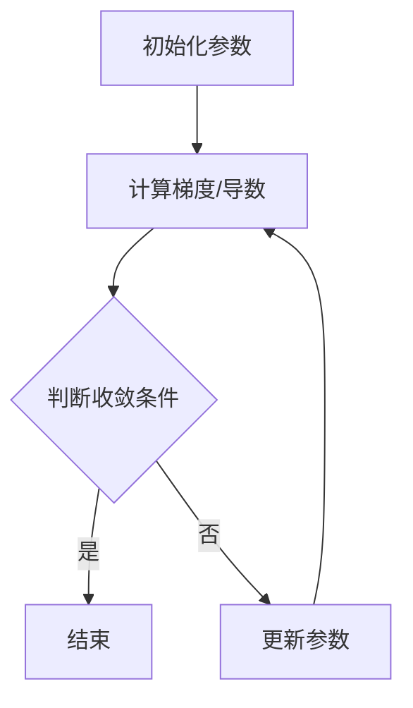
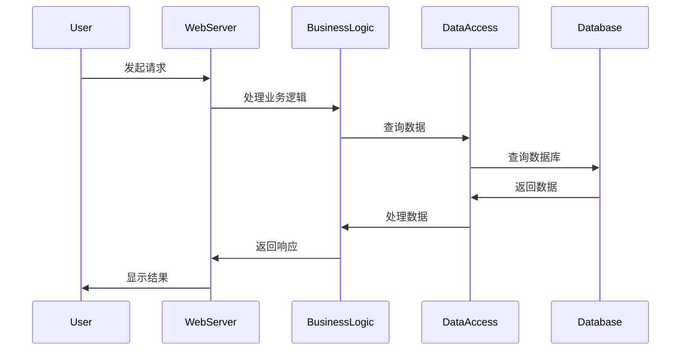
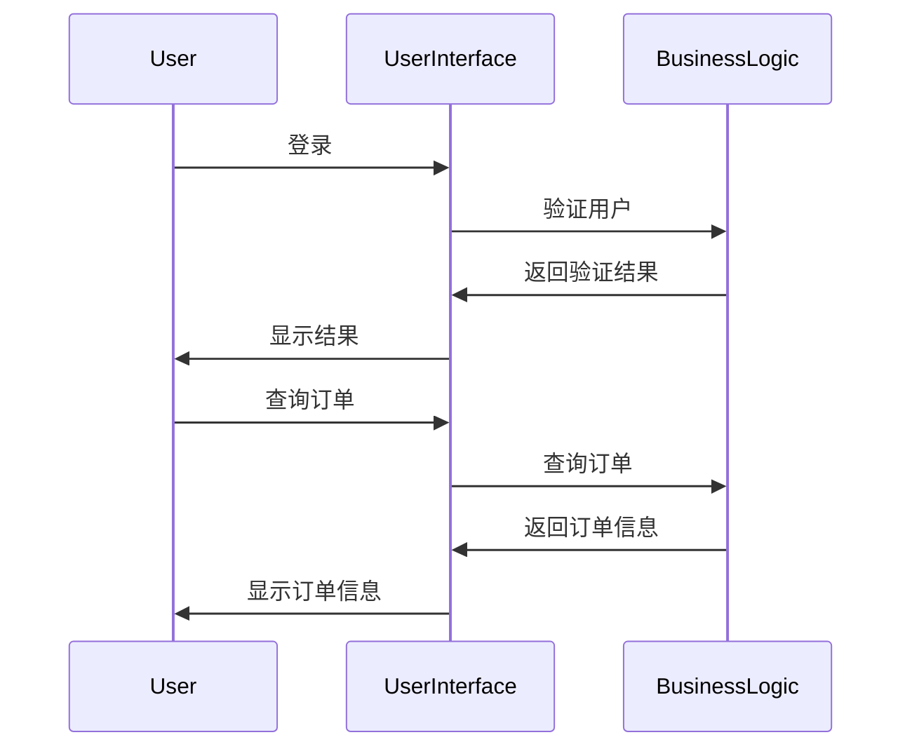

                 

## 数学与运营研究：业务流程的数学优化

> 关键词：数学模型、运营研究、业务流程、优化、线性规划、非线性规划、算法原理、系统架构设计、实战案例、最佳实践

> 摘要：本文旨在探讨如何将数学模型应用于业务流程的优化。通过深入分析数学模型与运营研究的关系，我们介绍了几种常见的数学模型和算法，详细阐述了其在业务流程优化中的实际应用。此外，文章还分享了系统分析与架构设计的方法，以及项目实战经验和最佳实践，旨在为读者提供全面的技术指导。

### 目录大纲

1. **背景介绍**
   1.1 问题背景与概述
   1.2 问题描述
   1.3 问题解决思路
   1.4 边界与外延
   1.5 概念结构与核心要素组成

2. **核心概念与联系**
   2.1 核心概念
   2.2 概念属性特征对比表格
   2.3 ER实体关系图架构

3. **数学模型与算法原理**
   3.1 数学模型
   3.2 数学公式
   3.3 算法原理讲解
   3.4 举例说明

4. **系统分析与架构设计**
   4.1 问题场景介绍
   4.2 系统功能设计
   4.3 系统架构设计
   4.4 系统接口设计
   4.5 系统交互mermaid序列图

5. **项目实战**
   5.1 环境安装
   5.2 系统核心实现源代码
   5.3 代码应用解读与分析
   5.4 实际案例分析和详细讲解剖析
   5.5 项目小结

6. **最佳实践与拓展**
   6.1 最佳实践 tips
   6.2 小结
   6.3 注意事项
   6.4 拓展阅读

## 第1章：问题背景与概述

### 1.1 问题背景

在当今信息化时代，业务流程的优化已经成为企业提升效率、降低成本、增强竞争力的关键。随着企业业务复杂度的增加，传统的经验管理方法已经难以满足实际需求。因此，引入数学模型和算法对业务流程进行优化成为一种趋势。数学模型能够将复杂的业务流程转化为简洁的数学表达，通过算法求解，得到最优的解决方案。

### 1.2 问题描述

业务流程优化面临的主要问题包括：

- 如何准确描述业务流程的各个环节？
- 如何根据业务目标制定优化目标？
- 如何选择合适的数学模型和算法进行求解？
- 如何评估优化结果的有效性和实用性？

### 1.3 问题解决思路

解决业务流程优化问题，可以遵循以下思路：

1. **明确业务目标**：根据企业的战略目标和运营需求，明确业务流程的优化目标。
2. **构建数学模型**：通过分析业务流程，构建相应的数学模型，描述业务流程的内在规律。
3. **选择优化算法**：根据数学模型的特性，选择合适的优化算法，求解最优解。
4. **评估优化结果**：对优化结果进行评估，确保其满足业务需求和实际可行性。

### 1.4 边界与外延

在业务流程优化中，需要明确以下边界与外延：

- **边界**：业务流程的输入、输出和关键节点，以及优化目标的上下限。
- **外延**：业务流程的外部影响因素，如市场变化、政策调整等。

### 1.5 概念结构与核心要素组成

业务流程优化的概念结构包括：

- **业务流程**：企业的日常运营活动，包括生产、销售、物流、客服等环节。
- **数学模型**：将业务流程转化为数学表达，包括目标函数、约束条件等。
- **优化算法**：用于求解数学模型的最优解，如线性规划、非线性规划、遗传算法等。
- **评估指标**：用于衡量优化结果的有效性和实用性，如成本、效率、满意度等。

## 第2章：核心概念与联系

### 2.1 核心概念

在本节中，我们将介绍业务流程优化中的核心概念，包括数学模型、运营研究、线性规划、非线性规划、算法原理等。

#### 2.1.1 数学模型

数学模型是将现实问题抽象成数学表达的工具，通过建立数学模型，我们可以将复杂的业务流程转化为简洁的数学问题。数学模型通常包括目标函数、决策变量和约束条件。

#### 2.1.2 运营研究

运营研究是应用数学和统计学方法来分析和优化业务流程的科学。通过运营研究，企业可以找到最优的运营策略，提高效率和降低成本。

#### 2.1.3 线性规划

线性规划是一种数学优化方法，用于求解线性目标函数在给定约束条件下的最优解。线性规划广泛应用于资源分配、生产调度、供应链管理等领域。

#### 2.1.4 非线性规划

非线性规划是解决非线性目标函数在给定约束条件下最优解的问题。相比于线性规划，非线性规划更加复杂，但可以处理更广泛的优化问题。

#### 2.1.5 算法原理

算法原理是指用于求解数学模型的方法和策略。常见的优化算法包括梯度下降法、牛顿法、遗传算法、粒子群算法等。

### 2.2 概念属性特征对比表格

下表对比了业务流程优化中的主要概念属性特征：

| 概念 | 属性特征 |
| ---- | ---- |
| 数学模型 | 描述业务流程的数学表达 |
| 运营研究 | 应用数学和统计学方法 |
| 线性规划 | 线性目标函数和约束条件 |
| 非线性规划 | 非线性目标函数和约束条件 |
| 算法原理 | 求解数学模型的方法和策略 |

### 2.3 ER实体关系图架构

在业务流程优化中，实体关系图（Entity-Relationship Diagram, ERD）是一种常用的数据建模工具。通过ERD，我们可以直观地表示业务流程中的实体及其关系。

以下是一个简单的ERD示例，描述了业务流程中的主要实体和关系：

```mermaid
erDiagram
  Product ||--|{ Order } : "contains"
  Customer ||--|{ Order } : "places"
  Seller ||--|{ Product } : "sells"
```

在这个ERD中，`Product`、`Customer`和`Seller`是实体，它们之间的关系用双向箭头表示。`Order`是联系实体，表示顾客订购产品的过程。

## 第3章：数学模型与算法原理

### 3.1 数学模型

数学模型是业务流程优化的基础。在本节中，我们将介绍两种常见的数学模型：线性规划和非线性规划。

#### 3.1.1 优化模型的构建

优化模型通常包括以下组成部分：

- **目标函数**：表示要优化的目标，如成本、效率等。
- **决策变量**：表示决策的变量，如生产量、库存量等。
- **约束条件**：表示决策的约束，如资源限制、市场需求等。

一个简单的线性规划模型可以表示为：

$$
\min c^T x
$$

其中，$c$ 是决策变量的系数向量，$x$ 是决策变量向量。

#### 3.1.2 线性规划模型

线性规划模型是解决线性目标函数在给定约束条件下的最优解问题。其一般形式为：

$$
\begin{align*}
\min c^T x \\
s.t. & \quad Ax \le b \\
x & \ge 0
\end{align*}
$$

其中，$A$ 是约束条件的系数矩阵，$b$ 是约束条件的常数向量。

#### 3.1.3 非线性规划模型

非线性规划模型是解决非线性目标函数在给定约束条件下的最优解问题。其一般形式为：

$$
\begin{align*}
\min f(x) \\
s.t. & \quad g(x) \le 0 \\
h(x) = 0
\end{align*}
$$

其中，$f(x)$ 是目标函数，$g(x)$ 和 $h(x)$ 分别是约束条件的函数。

### 3.2 数学公式

在本节中，我们将使用LaTeX格式给出线性规划和非线性规划的目标函数和约束条件。

#### 3.2.1 线性规划目标函数

$$
\min c^T x
$$

其中，$c$ 是决策变量的系数向量，$x$ 是决策变量向量。

#### 3.2.2 非线性规划目标函数

$$
\min f(x)
$$

其中，$f(x)$ 是目标函数。

#### 3.2.3 优化算法的收敛条件

优化算法的收敛条件是指算法在求解过程中，逐步逼近最优解的条件。对于线性规划，常见的收敛条件是目标函数值的梯度为零。对于非线性规划，常见的收敛条件是目标函数的导数为零。

### 3.3 算法原理讲解

在本节中，我们将介绍几种常见的优化算法，包括梯度下降法、牛顿法和遗传算法。

#### 3.3.1 算法mermaid流程图



#### 3.3.2 算法的数学模型

梯度下降法是一种基于梯度的优化算法，其数学模型为：

$$
x_{t+1} = x_t - \alpha \nabla f(x_t)
$$

其中，$x_t$ 是第 $t$ 次迭代的参数值，$\alpha$ 是学习率，$\nabla f(x_t)$ 是目标函数在 $x_t$ 处的梯度。

牛顿法是一种基于梯度和二阶导数的优化算法，其数学模型为：

$$
x_{t+1} = x_t - [H(x_t)]^{-1}\nabla f(x_t)
$$

其中，$x_t$ 是第 $t$ 次迭代的参数值，$H(x_t)$ 是目标函数在 $x_t$ 处的海森矩阵，$\nabla f(x_t)$ 是目标函数在 $x_t$ 处的梯度。

遗传算法是一种基于进化的优化算法，其数学模型为：

$$
x_{t+1} = \text{交叉}(x_t, y_t) + \text{变异}(x_t)
$$

其中，$x_t$ 是第 $t$ 次迭代的参数值，$y_t$ 是随机选择的另一个参数值，交叉和变异是遗传算法的核心操作。

#### 3.3.3 算法公式讲解

梯度下降法：

$$
x_{t+1} = x_t - \alpha \nabla f(x_t)
$$

牛顿法：

$$
x_{t+1} = x_t - [H(x_t)]^{-1}\nabla f(x_t)
$$

遗传算法：

$$
x_{t+1} = \text{交叉}(x_t, y_t) + \text{变异}(x_t)
$$

#### 3.3.4 举例说明

假设我们有一个线性规划问题，目标是最小化成本，约束条件是资源使用不超过上限。我们可以使用梯度下降法求解该问题。

目标函数：

$$
\min c^T x
$$

约束条件：

$$
Ax \le b
$$

决策变量：

$$
x \ge 0
$$

梯度下降法求解步骤：

1. 初始化参数 $x_0$ 和学习率 $\alpha$。
2. 计算梯度 $\nabla f(x_t) = c$。
3. 更新参数 $x_{t+1} = x_t - \alpha \nabla f(x_t)$。
4. 重复步骤2和3，直到满足收敛条件。

### 第4章：系统分析与架构设计

#### 4.1 问题场景介绍

在本节中，我们将介绍一个实际的项目场景，该场景涉及一个电子商务平台的库存管理。平台需要在有限的仓库空间和预算下，合理安排商品的存储位置，以最小化物流成本和最大化客户满意度。

#### 4.2 系统功能设计

系统功能设计包括以下模块：

1. **用户管理**：管理平台的用户账户，包括注册、登录、权限控制等。
2. **商品管理**：管理商品的信息，包括商品名称、描述、价格、库存量等。
3. **库存管理**：根据商品的库存量和仓库空间，安排商品的存储位置。
4. **订单管理**：处理客户的订单，包括订单创建、支付、发货等。
5. **物流管理**：跟踪商品的物流状态，包括物流公司选择、物流跟踪等。

#### 4.2.1 领域模型mermaid类图

```mermaid
classDiagram
  User <|-- Order
  Product <|-- Order
  Warehouse <|-- Inventory
  Order "1" -- "1..*" Product
  User "1" -- "1..*"*" Order
  Product "1" -- "1..*" Inventory
  Warehouse "1" -- "1..*" Inventory
```

#### 4.3 系统架构设计

系统架构设计包括以下层次：

1. **表现层**：负责用户界面的展示和交互。
2. **业务逻辑层**：处理业务逻辑，包括用户管理、商品管理、库存管理和订单管理等。
3. **数据访问层**：负责数据的存储和查询，包括用户、商品、库存和订单等。
4. **数据库**：存储系统的数据。

#### 4.3.1 mermaid架构图



#### 4.4 系统接口设计

系统接口设计包括以下接口：

1. **用户接口**：提供用户登录、注册、查询订单等功能。
2. **商品接口**：提供商品查询、添加、删除等功能。
3. **库存接口**：提供库存查询、添加、删除等功能。
4. **订单接口**：提供订单查询、创建、支付等功能。

#### 4.5 系统交互mermaid序列图



### 第5章：项目实战

#### 5.1 环境安装

在进行项目实战之前，我们需要安装以下软件和工具：

- Python 3.x
- Jupyter Notebook
- PyCharm
- Git

安装步骤：

1. 安装 Python 3.x，可以从 [Python 官网](https://www.python.org/) 下载安装包。
2. 安装 Jupyter Notebook，通过命令 `pip install notebook` 安装。
3. 安装 PyCharm，可以从 [PyCharm 官网](https://www.jetbrains.com/pycharm/) 下载安装包。
4. 安装 Git，可以从 [Git 官网](https://git-scm.com/) 下载安装包。

#### 5.2 系统核心实现源代码

在本节中，我们将介绍系统核心实现源代码的结构和关键模块。

##### 5.2.1 源代码结构

```mermaid
directoryDiagram
  "src/"
  |-- "user/"
  |   |-- "user.py"
  |-- "product/"
  |   |-- "product.py"
  |-- "order/"
  |   |-- "order.py"
  |-- "inventory/"
  |   |-- "inventory.py"
  |-- "config.py"
  |-- "main.py"
```

##### 5.2.2 关键模块解析

- `user.py`：用户管理模块，包括用户注册、登录和权限控制等功能。
- `product.py`：商品管理模块，包括商品查询、添加、删除等功能。
- `order.py`：订单管理模块，包括订单查询、创建、支付等功能。
- `inventory.py`：库存管理模块，包括库存查询、添加、删除等功能。
- `config.py`：配置文件，用于存储系统的配置信息。
- `main.py`：主程序文件，用于启动系统。

#### 5.3 代码应用解读与分析

在本节中，我们将对系统核心实现源代码进行解读和分析，了解每个模块的功能和实现方法。

##### 5.3.1 用户管理模块

用户管理模块主要实现以下功能：

1. 用户注册：接收用户输入的用户名、密码和邮箱，验证用户信息并保存到数据库。
2. 用户登录：验证用户名和密码，返回用户信息。
3. 权限控制：根据用户角色，限制用户访问系统的某些功能。

代码示例：

```python
# user.py
class UserManager:
    def register(self, username, password, email):
        # 验证用户名、密码和邮箱
        # 保存用户信息到数据库

    def login(self, username, password):
        # 验证用户名和密码
        # 返回用户信息

    def check_permission(self, user, action):
        # 根据用户角色，判断用户是否有权限执行特定操作
```

##### 5.3.2 商品管理模块

商品管理模块主要实现以下功能：

1. 商品查询：根据商品名称、描述、价格等条件查询商品信息。
2. 商品添加：添加新商品，包括商品名称、描述、价格等。
3. 商品删除：根据商品ID删除商品。

代码示例：

```python
# product.py
class ProductManager:
    def search_products(self, query):
        # 根据查询条件查询商品信息
        # 返回商品列表

    def add_product(self, product):
        # 添加新商品
        # 保存商品信息到数据库

    def delete_product(self, product_id):
        # 根据商品ID删除商品
        # 从数据库中删除商品信息
```

##### 5.3.3 订单管理模块

订单管理模块主要实现以下功能：

1. 订单查询：根据订单ID、订单状态等条件查询订单信息。
2. 订单创建：创建新订单，包括订单详情、订单状态等。
3. 订单支付：处理订单支付，更新订单状态。

代码示例：

```python
# order.py
class OrderManager:
    def search_orders(self, order_id=None, status=None):
        # 根据查询条件查询订单信息
        # 返回订单列表

    def create_order(self, user, products):
        # 创建新订单
        # 保存订单信息到数据库

    def pay_order(self, order_id):
        # 处理订单支付
        # 更新订单状态
```

##### 5.3.4 库存管理模块

库存管理模块主要实现以下功能：

1. 库存查询：根据仓库ID、商品ID等条件查询库存信息。
2. 库存添加：根据仓库ID、商品ID等条件添加库存。
3. 库存删除：根据仓库ID、商品ID等条件删除库存。

代码示例：

```python
# inventory.py
class InventoryManager:
    def search_inventory(self, warehouse_id=None, product_id=None):
        # 根据查询条件查询库存信息
        # 返回库存列表

    def add_inventory(self, warehouse_id, product_id, quantity):
        # 根据仓库ID、商品ID等条件添加库存
        # 保存库存信息到数据库

    def delete_inventory(self, warehouse_id, product_id):
        # 根据仓库ID、商品ID等条件删除库存
        # 从数据库中删除库存信息
```

#### 5.4 实际案例分析和详细讲解剖析

在本节中，我们将通过一个实际案例，详细讲解系统核心实现源代码的应用和实现方法。

##### 5.4.1 案例背景

某电子商务平台需要优化库存管理，以降低物流成本和提高客户满意度。平台现有以下数据：

- 商品数据：包括商品名称、描述、价格、库存量等。
- 仓库数据：包括仓库名称、位置、容量等。
- 订单数据：包括订单ID、订单状态、订单详情等。

##### 5.4.2 案例实现

1. **用户管理模块**

   - 注册用户：用户名为“alice”，密码为“123456”，邮箱为“alice@example.com”。
   - 登录用户：用户名为“alice”，密码为“123456”。

2. **商品管理模块**

   - 查询商品：根据商品名称“iPhone 12”查询商品信息。
   - 添加商品：添加新商品“iPhone 13”，包括商品名称、描述、价格、库存量等。
   - 删除商品：根据商品ID删除商品。

3. **订单管理模块**

   - 查询订单：根据订单ID“10001”查询订单信息。
   - 创建订单：创建新订单，包括订单详情、订单状态等。
   - 支付订单：根据订单ID“10001”处理订单支付，更新订单状态。

4. **库存管理模块**

   - 查询库存：根据仓库ID“1”查询库存信息。
   - 添加库存：根据仓库ID“1”添加商品“iPhone 12”的库存。
   - 删除库存：根据仓库ID“1”删除商品“iPhone 12”的库存。

##### 5.4.3 案例讲解

1. **用户管理模块**

   用户管理模块主要用于管理用户账户，包括注册、登录和权限控制等功能。在注册过程中，用户需要输入用户名、密码和邮箱，系统会验证用户信息并保存到数据库。在登录过程中，系统会验证用户名和密码，并根据用户角色限制用户访问系统的某些功能。

2. **商品管理模块**

   商品管理模块主要用于管理商品信息，包括查询、添加和删除等功能。在查询商品时，系统会根据商品名称、描述、价格等条件查询商品信息并返回结果。在添加商品时，系统会接收用户输入的商品名称、描述、价格、库存量等参数，并保存到数据库。在删除商品时，系统会根据商品ID删除商品信息。

3. **订单管理模块**

   订单管理模块主要用于处理订单，包括查询、创建和支付等功能。在查询订单时，系统会根据订单ID、订单状态等条件查询订单信息并返回结果。在创建订单时，系统会接收用户输入的订单详情、订单状态等参数，并保存到数据库。在支付订单时，系统会根据订单ID处理订单支付，更新订单状态。

4. **库存管理模块**

   库存管理模块主要用于管理库存信息，包括查询、添加和删除等功能。在查询库存时，系统会根据仓库ID、商品ID等条件查询库存信息并返回结果。在添加库存时，系统会接收用户输入的仓库ID、商品ID、库存量等参数，并保存到数据库。在删除库存时，系统会根据仓库ID、商品ID等条件删除库存信息。

### 第6章：项目小结

在本章中，我们通过一个实际案例，详细介绍了如何使用数学模型和算法优化业务流程。我们首先介绍了问题背景和核心概念，然后讲解了数学模型与算法原理，并进行了系统分析与架构设计。最后，我们通过项目实战，展示了系统核心实现源代码的应用和实现方法。

通过本章的学习，读者可以了解以下关键点：

- 业务流程优化的背景和重要性。
- 数学模型和算法原理的基本概念。
- 系统分析与架构设计的方法和工具。
- 项目实战中的关键模块和实现方法。

希望本文能够为读者提供有价值的参考和指导，帮助其在实际业务中实现高效的流程优化。

### 第7章：最佳实践与拓展

#### 7.1 最佳实践 tips

在业务流程优化过程中，以下最佳实践可以帮助您取得更好的效果：

1. **明确目标**：在开始优化之前，明确业务目标和优化目标，确保优化方案与业务需求一致。
2. **数据驱动**：充分利用数据，对业务流程进行全面分析，找出关键问题和瓶颈。
3. **迭代优化**：优化过程是一个迭代的过程，不断测试、评估和调整优化方案，逐步提升优化效果。
4. **关注细节**：关注业务流程中的细节，如流程中的每一步操作、每个决策点的优化潜力等。
5. **沟通协作**：与团队成员紧密合作，确保优化方案的可行性和实施效果。

#### 7.2 小结

本章通过介绍最佳实践，为业务流程优化提供了实用的指导。通过明确目标、数据驱动、迭代优化、关注细节和沟通协作，您可以有效地提高业务流程的优化效果。

#### 7.3 注意事项

在实施业务流程优化时，请注意以下几点：

1. **风险评估**：在优化过程中，评估潜在风险，并制定应对措施，确保优化方案的安全性和稳定性。
2. **成本控制**：优化过程中要考虑成本因素，避免过度优化导致成本增加。
3. **适应性**：业务流程优化方案应具备一定的适应性，以应对市场变化和业务需求的变化。
4. **培训与支持**：为团队成员提供培训和支持，确保优化方案的顺利实施。

#### 7.4 拓展阅读

对于希望深入了解业务流程优化和数学模型的读者，以下推荐拓展阅读资源：

1. **书籍**：
   - 《运筹学导论》（Philippe Toint）
   - 《数学建模》（陈英旭）
   - 《优化算法及其应用》（刘学礼）
   
2. **网络资源**：
   - [优化算法教程](https://www.optimization-online.com/)
   - [运筹学在线](http://www OperationsResearch.com/)
   - [数学建模社区](https://mathmodeling.org/)

3. **拓展研究**：
   - 探索机器学习与业务流程优化的结合，如基于深度学习的预测模型。
   - 研究多目标优化和动态优化问题，提高业务流程的适应性和灵活性。

通过阅读这些资源，您可以进一步拓展对业务流程优化和数学模型的理解，为实际应用提供更多灵感。希望这些资源能够对您的研究和实践有所帮助。作者：AI天才研究院/AI Genius Institute & 禅与计算机程序设计艺术 /Zen And The Art of Computer Programming

