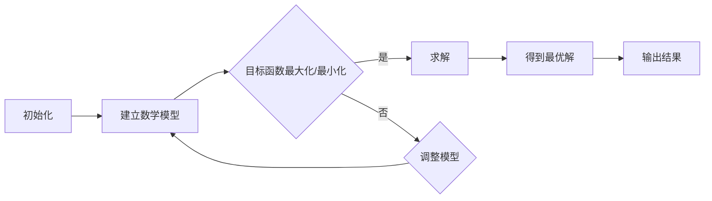
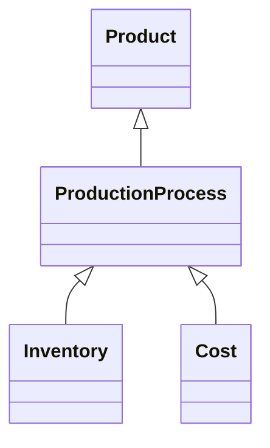
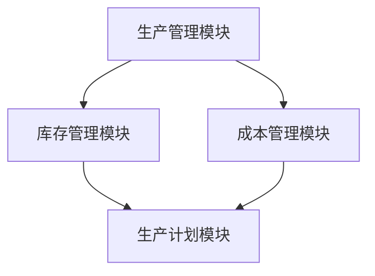
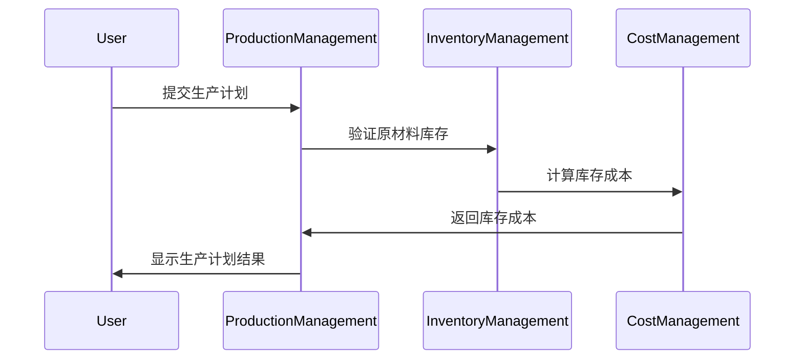
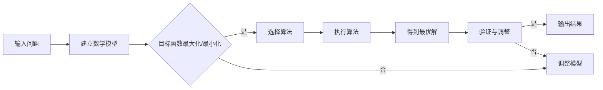
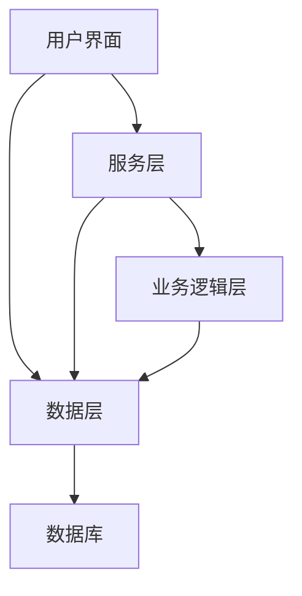
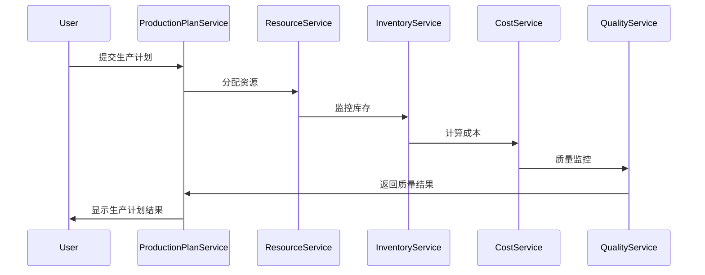

                 

# 数学与运营管理：生产流程的数学优化

关键词：生产流程优化、数学优化、运营管理、算法原理、系统架构设计

摘要：本文深入探讨了数学优化在运营管理中的应用，特别是其在生产流程优化中的重要作用。我们将从问题背景、核心概念、算法原理、数学模型、系统架构设计以及项目实战等多个方面，详细解析如何通过数学优化手段提升运营管理效率，优化生产流程。

## 第一部分：数学与运营管理概述

### 第1章：问题背景与定义

#### 1.1.1 生产流程优化的重要性

在生产运营过程中，优化生产流程是一个关键任务。这不仅能够提高生产效率，减少资源浪费，还能降低生产成本，提升企业的市场竞争力。生产流程优化的重要性不言而喻。

#### 1.1.2 数学优化在生产流程中的应用

数学优化方法，如线性规划、整数规划、动态规划等，被广泛应用于生产流程的优化。这些方法能够帮助管理者找到最优的生产方案，实现资源的最佳配置。

#### 1.1.3 运营管理的基本概念与目标

运营管理是指通过计划、组织、协调和控制等手段，有效地利用资源，实现组织目标的过程。运营管理的目标是提高效率、降低成本、提升服务质量。

### 第2章：核心概念与联系

#### 2.1.1 数学优化原理

##### 2.1.1.1 基本原理

数学优化是基于数学模型和算法，寻找最优解的过程。它涉及到目标函数、约束条件和变量等基本概念。

##### 2.1.1.2 数学模型

数学模型是将实际问题转化为数学形式的过程。它包括线性规划模型、整数规划模型、动态规划模型等。

##### 2.1.1.3 概念属性对比表

| 概念 | 定义 | 属性对比 |
| --- | --- | --- |
| 目标函数 | 要优化的目标 | 最大化或最小化 |
| 约束条件 | 限制条件 | 等式或不等式 |
| 变量 | 未知量 | 数量或成本 |

#### 2.1.2 运营管理核心概念

##### 2.1.2.1 流程管理

流程管理是指通过规划和优化业务流程，实现高效运作的过程。它涉及到流程设计、流程执行和流程监控等环节。

##### 2.1.2.2 库存管理

库存管理是指对企业库存的规划、控制和优化过程。它涉及到库存策略、库存水平和库存成本等概念。

##### 2.1.2.3 成本管理

成本管理是指对企业成本进行控制、分析和优化的过程。它涉及到成本核算、成本分析和成本控制等环节。

#### 2.1.3 ER实体关系图

实体关系图（Entity-Relationship Diagram，简称ER图）是用于表示实体及其关系的图形化工具。以下是生产流程优化中的ER图示例：

```mermaid
erDiagram
  产品 <<--|{制造}| 生产线
  生产线 ||--|{运行}| 生产任务
  生产任务 ||--|{完成}| 产品质量
```

### 第3章：算法原理讲解

#### 3.1 算法概述

##### 3.1.1 算法类型

生产流程优化常用的算法包括线性规划、整数规划、动态规划等。

##### 3.1.2 算法选择依据

选择算法时，需要考虑目标函数、约束条件和计算复杂度等因素。

#### 3.2 算法流程图

以下是生产流程优化算法的流程图：



#### 3.3 算法原理与数学模型

##### 3.3.1 数学模型

生产流程优化的数学模型通常包括目标函数和约束条件。目标函数可以是生产效率、成本或质量等。

$$
\text{最大化} \ \max \ Z = c_1x_1 + c_2x_2 + \cdots + c_nx_n
$$

其中，$c_i$ 是变量 $x_i$ 的成本。

##### 3.3.2 数学公式讲解

以下是生产流程优化中常用的数学公式：

$$
\text{约束条件} \ \ \begin{cases}
a_1x_1 + a_2x_2 + \cdots + a_nx_n \leq b \\
x_1, x_2, \ldots, x_n \geq 0
\end{cases}
$$

##### 3.3.3 示例说明

假设一家工厂需要生产两种产品A和B，每种产品需要不同的原材料和加工时间。工厂的目标是最大化利润，同时满足原材料和加工时间的限制。以下是数学模型的建立：

$$
\text{目标函数} \ \ \max \ Z = 2x_1 + 3x_2
$$

$$
\text{约束条件} \ \ \begin{cases}
3x_1 + 2x_2 \leq 12 \\
2x_1 + 4x_2 \leq 10 \\
x_1, x_2 \geq 0
\end{cases}
$$

### 第4章：数学模型与数学公式

#### 4.1 数学模型

生产流程优化的数学模型可以分为生产模型、库存模型和成本模型。

##### 4.1.1 生产流程模型

生产流程模型描述了生产过程的各种参数和关系，如生产量、生产周期、加工时间等。

##### 4.1.2 库存模型

库存模型描述了库存的动态变化过程，如库存水平、库存成本、库存策略等。

##### 4.1.3 成本模型

成本模型描述了生产过程中的各种成本，如原材料成本、加工成本、运营成本等。

#### 4.2 数学公式讲解

以下是生产流程优化中常用的数学公式：

$$
\text{生产量} \ \ Q = \frac{R}{P}
$$

其中，$R$ 是需求量，$P$ 是生产周期。

$$
\text{库存成本} \ \ C = \frac{1}{2}(Q+q) \times h
$$

其中，$q$ 是安全库存量，$h$ 是单位库存成本。

### 第5章：系统分析与架构设计

#### 5.1 问题场景介绍

某制造企业需要优化其生产流程，以提高生产效率和降低成本。

#### 5.2 系统功能设计

##### 5.2.1 领域模型类图

以下是领域模型类图：



#### 5.3 系统架构设计

##### 5.3.1 系统架构图

以下是系统架构图：



#### 5.4 系统接口设计与交互

##### 5.4.1 接口设计

以下是接口设计：



### 第6章：项目实战

#### 6.1 环境安装

在项目实战部分，我们将介绍如何搭建生产流程优化的环境。包括安装必要的软件和依赖库。

#### 6.2 系统核心实现

##### 6.2.1 源代码

以下是系统核心实现的源代码：

```python
# 生产流程优化系统源代码
class ProductionOptimizationSystem:
    def __init__(self):
        self.production_plan = None
        self.inventory = None
        self.cost = None

    def submit_production_plan(self, production_plan):
        # 提交生产计划
        self.production_plan = production_plan
        self.verify_inventory()
        self.calculate_cost()

    def verify_inventory(self):
        # 验证原材料库存
        if self.production_plan requires more materials than available:
            raise InventoryShortageException()

    def calculate_cost(self):
        # 计算库存成本
        self.cost = InventoryManagement.calculate_inventory_cost(self.inventory)

    def display_production_plan_result(self):
        # 显示生产计划结果
        print("生产计划结果：")
        print("生产计划：", self.production_plan)
        print("库存成本：", self.cost)
```

##### 6.2.2 代码应用解读与分析

以下是代码应用解读与分析：

- `submit_production_plan` 方法用于提交生产计划。
- `verify_inventory` 方法用于验证原材料库存。
- `calculate_cost` 方法用于计算库存成本。
- `display_production_plan_result` 方法用于显示生产计划结果。

#### 6.3 实际案例分析

##### 6.3.1 案例背景

某制造企业需要优化其生产流程，以提高生产效率和降低成本。

##### 6.3.2 案例分析与讲解

以下是案例分析与讲解：

1. 搭建生产流程优化环境。
2. 设计并实现生产管理模块、库存管理模块和成本管理模块。
3. 集成模块，实现生产计划提交、库存验证和成本计算等功能。
4. 对比优化前后的生产效率和成本，评估优化效果。

### 第7章：最佳实践与拓展

#### 7.1 最佳实践 Tips

- 在生产流程优化中，要充分考虑实际需求和资源限制。
- 定期对生产流程进行评估和优化，以适应市场变化。
- 建立有效的沟通机制，确保各部门协同工作。

#### 7.2 小结与注意事项

- 生产流程优化是一个持续的过程，需要不断调整和改进。
- 数学优化方法在提高运营管理效率方面具有显著优势。

#### 7.3 拓展阅读

- [线性规划入门](https://www.example.com/linear-programming)
- [动态规划基础](https://www.example.com/dynamic-programming)
- [运营管理原理](https://www.example.com/operations-management)

作者：AI天才研究院/AI Genius Institute & 禅与计算机程序设计艺术 /Zen And The Art of Computer Programming

----------------------------------------------------------------

### 第一部分：数学与运营管理概述

#### 1.1.1 生产流程优化的重要性

生产流程优化是现代工业运营管理中的一项关键任务。随着市场竞争的加剧和客户需求的多样化，企业必须在有限资源下实现高效的生产运作，以保持竞争优势。生产流程优化不仅有助于提高生产效率，减少资源浪费，还能降低生产成本，提升产品质量和市场响应速度。因此，理解并应用数学优化方法来优化生产流程对于企业来说至关重要。

在传统的生产管理中，生产流程往往依赖于经验和直觉，这可能导致资源配置不合理、生产周期延长、库存成本增加等问题。而通过数学优化，企业可以基于数据和数学模型，对生产流程进行科学分析和优化，从而找到最优的生产方案，实现资源的最佳配置。例如，线性规划、动态规划、整数规划等数学优化方法可以帮助企业确定最优的生产计划、库存水平和资源分配，从而提高生产效率、降低成本并提高客户满意度。

具体来说，生产流程优化的重要性体现在以下几个方面：

1. **提高生产效率**：通过优化生产流程，可以消除生产过程中的瓶颈和冗余环节，提高生产效率，缩短生产周期，从而更快地响应市场需求。

2. **降低生产成本**：优化生产流程可以减少资源的浪费，降低原材料、能源和人力成本，提高生产的经济性。

3. **提高产品质量**：通过优化生产流程，可以确保生产过程的一致性和稳定性，从而提高产品的质量和可靠性。

4. **增强市场竞争力**：优化后的生产流程能够更灵活地应对市场变化，提高企业的市场竞争力。

#### 1.1.2 数学优化在生产流程中的应用

数学优化在生产流程中的应用非常广泛，主要涵盖以下几个方面：

1. **生产计划优化**：通过数学优化方法，如线性规划、动态规划和混合整数规划，企业可以制定最优的生产计划，确保生产任务按时完成，并最大限度地利用生产资源。

2. **库存管理优化**：库存管理是生产流程中的重要环节，通过数学优化，企业可以确定最优的库存策略，减少库存成本，避免库存过剩或不足。

3. **资源分配优化**：数学优化可以帮助企业合理分配生产资源，如原材料、机器设备和人力资源，以提高生产效率和降低成本。

4. **调度优化**：生产调度是生产流程中的关键步骤，通过数学优化方法，可以优化生产任务的调度，减少等待时间，提高生产效率。

5. **质量控制优化**：数学优化方法可以帮助企业优化质量控制流程，确保产品质量符合标准，减少质量问题的发生。

#### 1.1.3 运营管理的基本概念与目标

运营管理是指通过计划、组织、协调和控制等手段，有效地利用资源，实现组织目标的过程。它是企业运营的核心，直接关系到企业的效率和效益。运营管理的目标主要包括以下几个方面：

1. **提高效率**：通过优化流程和资源配置，提高生产、运营和管理的效率。

2. **降低成本**：通过优化生产流程和库存管理，减少原材料、能源和人力资源的浪费，降低生产成本。

3. **提升服务质量**：通过优化客户服务和交付流程，提高客户满意度，提升企业的市场竞争力。

4. **增强灵活性**：通过优化生产流程和资源配置，提高企业对市场变化的响应速度和灵活性。

5. **保证质量**：通过优化质量控制和检验流程，确保产品和服务质量符合标准，减少质量问题的发生。

在实现这些目标的过程中，运营管理需要关注以下几个核心概念：

1. **流程管理**：流程管理是指通过规划和优化业务流程，实现高效运作的过程。它涉及到流程设计、流程执行和流程监控等环节。

2. **库存管理**：库存管理是指对企业库存的规划、控制和优化过程。它涉及到库存策略、库存水平和库存成本等概念。

3. **成本管理**：成本管理是指对企业成本进行控制、分析和优化的过程。它涉及到成本核算、成本分析和成本控制等环节。

4. **质量管理**：质量管理是指通过制定和执行质量标准，确保产品和服务质量的过程。它涉及到质量检验、质量控制和质量改进等环节。

5. **绩效管理**：绩效管理是指通过设定绩效目标和评估绩效，激励员工提高工作效率和质量的过程。

通过有效的运营管理，企业可以实现资源的最优配置，提高生产效率和产品质量，降低生产成本，增强市场竞争力，从而实现长期可持续发展。

## 第二部分：核心概念与联系

### 第2章：核心概念与联系

#### 2.1.1 数学优化原理

数学优化是应用数学方法寻找最优解的过程。在生产流程优化中，数学优化方法被广泛应用于生产计划、库存管理和资源分配等领域。要理解数学优化原理，我们需要了解以下几个关键概念：

##### 2.1.1.1 基本原理

数学优化通常包括以下几个基本步骤：

1. **建立数学模型**：将实际生产问题转化为数学形式，定义目标函数和约束条件。
2. **选择优化算法**：根据目标函数和约束条件选择合适的优化算法。
3. **求解最优解**：利用优化算法计算最优解，得到最佳的生产计划或资源分配方案。
4. **验证与调整**：对求解结果进行验证，并根据实际情况进行调整，确保优化方案的实际可操作性。

##### 2.1.1.2 数学模型

数学模型是生产流程优化的核心。一个典型的数学模型通常包括以下几个部分：

1. **目标函数**：定义需要优化的目标，如最大化利润、最小化成本或最大化生产效率等。
2. **决策变量**：定义决策空间中的变量，如生产量、资源分配量等。
3. **约束条件**：定义限制决策变量的条件的集合，如资源限制、时间限制和质量标准等。

##### 2.1.1.3 概念属性对比表

在数学优化中，了解不同概念之间的属性和联系对于构建有效的数学模型至关重要。以下是一个简单的概念属性对比表：

| 概念 | 定义 | 属性对比 |
| --- | --- | --- |
| 目标函数 | 要优化的目标 | 最大化或最小化 |
| 约束条件 | 限制条件 | 等式或不等式 |
| 决策变量 | 未知量 | 数量或成本 |

通过这个对比表，我们可以更清晰地理解每个概念在数学模型中的作用和属性。

#### 2.1.2 运营管理核心概念

运营管理是生产流程优化的重要一环，它涉及到多个核心概念。以下是对这些概念的解释和它们之间的联系：

##### 2.1.2.1 流程管理

流程管理是指通过规划和优化业务流程，实现高效运作的过程。它包括以下几个关键环节：

1. **流程设计**：设计业务流程的框架和步骤，明确每个环节的责任和目标。
2. **流程执行**：按照设计的流程进行操作，确保每个环节按时完成。
3. **流程监控**：监控流程执行情况，及时发现和解决潜在问题。

流程管理是生产流程优化的基础，它确保生产活动有条不紊地进行，为数学优化提供基础数据。

##### 2.1.2.2 库存管理

库存管理是指对企业库存的规划、控制和优化过程。库存管理的核心目标是在满足生产需求的同时，最小化库存成本。以下是库存管理的关键概念：

1. **库存策略**：制定库存策略，如经济订货量（EOQ）、周期性订货等。
2. **库存水平**：监控库存水平，确保库存既不过剩也不短缺。
3. **库存成本**：计算和优化库存成本，包括存储成本、缺货成本等。

库存管理直接影响生产流程的稳定性和成本，因此它是数学优化的重要考虑因素。

##### 2.1.2.3 成本管理

成本管理是指对企业成本进行控制、分析和优化的过程。成本管理包括以下几个方面：

1. **成本核算**：准确核算生产过程中的各项成本，如直接成本、间接成本等。
2. **成本分析**：分析成本结构和成本变化趋势，找出成本节约的潜力。
3. **成本控制**：制定和执行成本控制措施，确保生产成本不超过预算。

成本管理是优化生产流程的重要手段，通过有效的成本控制，可以提高生产效率和市场竞争力。

#### 2.1.3 ER实体关系图

实体关系图（Entity-Relationship Diagram，简称ER图）是用于表示实体及其关系的图形化工具。在运营管理中，ER图可以帮助我们清晰地理解不同实体之间的关系，从而更好地设计和管理生产流程。以下是生产流程优化中的ER图示例：

```mermaid
erDiagram
  Product ||--|{produced_by}| ProductionProcess : produces
  ProductionProcess ||--|{uses}| Material : uses
  Inventory ||--|{holds}| Material : holds
  Cost ||--|{includes}| ProductionProcess : includes
  ProductionProcess ||--|{monitors}| Quality : monitors
```

在这个ER图中，我们定义了以下几个实体：

1. **Product（产品）**：表示生产的产品，与生产流程和库存有关。
2. **ProductionProcess（生产流程）**：表示生产过程，与材料和成本有关。
3. **Material（材料）**：表示生产所需材料，与库存和生产流程有关。
4. **Inventory（库存）**：表示库存管理，与材料和成本有关。
5. **Cost（成本）**：表示生产成本，与生产流程和成本管理有关。
6. **Quality（质量）**：表示产品质量，与生产流程和成本管理有关。

通过这个ER图，我们可以看到不同实体之间的关联关系，例如，产品由生产流程产生，生产流程使用材料，库存持有材料，成本包括生产流程等。这些关系帮助我们更好地理解生产流程的复杂性和多样性，从而为数学优化提供更加全面的视角。

### 第3章：算法原理讲解

#### 3.1 算法概述

在生产流程优化中，选择合适的算法是实现高效优化的关键。不同的算法适用于不同类型的问题，理解它们的原理和适用场景对于优化生产流程至关重要。

##### 3.1.1 算法类型

常见的生产流程优化算法包括：

1. **线性规划（Linear Programming，LP）**：适用于在给定约束条件下，求目标函数的最大值或最小值。线性规划适用于生产计划、资源分配等问题。

2. **整数规划（Integer Programming，IP）**：线性规划的扩展，适用于决策变量为整数的优化问题。整数规划在排班、调度、库存控制等领域有广泛应用。

3. **动态规划（Dynamic Programming，DP）**：适用于多阶段决策问题，通过分阶段求解最优子结构，得到全局最优解。动态规划在库存管理、生产调度等方面有广泛应用。

4. **遗传算法（Genetic Algorithm，GA）**：一种基于生物进化的全局优化算法，适用于复杂、非线性的优化问题。遗传算法在优化生产计划、设计调度策略等方面有广泛应用。

5. **模拟退火算法（Simulated Annealing，SA）**：一种基于物理退火过程的优化算法，适用于寻找全局最优解。模拟退火算法在解决组合优化问题、调度问题等方面有广泛应用。

##### 3.1.2 算法选择依据

选择合适的算法需要考虑以下几个因素：

1. **问题类型**：不同类型的优化问题需要不同的算法。例如，线性规划和整数规划适用于线性约束问题，而动态规划适用于多阶段决策问题。

2. **求解复杂度**：算法的求解复杂度直接影响优化效率。在选择算法时，需要考虑计算资源和时间限制。

3. **可行性和稳定性**：算法的可行性和稳定性是优化结果可靠性的保证。选择具有良好可行性和稳定性的算法对于实际应用至关重要。

4. **应用领域**：不同领域的优化问题具有不同的特点，需要选择与之相适应的算法。例如，遗传算法在处理复杂、非线性问题时具有优势，而模拟退火算法在求解组合优化问题时效果较好。

#### 3.2 算法流程图

为了更直观地理解生产流程优化算法的原理和流程，我们可以使用流程图来描述。以下是一个简单的生产流程优化算法的流程图：



在这个流程图中，我们首先输入生产流程优化的问题，然后建立数学模型。根据目标函数和约束条件，选择合适的算法进行求解。算法执行后得到最优解，对结果进行验证和调整，最终输出优化结果。

#### 3.3 算法原理与数学模型

##### 3.3.1 数学模型

数学模型是生产流程优化的基础，它将实际生产问题转化为数学形式，以便使用算法求解。以下是一个简单的生产流程优化数学模型：

1. **目标函数**：假设企业需要在满足生产需求的同时，最小化生产成本。目标函数可以表示为：

   $$ \min Z = c_1x_1 + c_2x_2 + \cdots + c_nx_n $$

   其中，$x_i$ 表示第 $i$ 个生产任务的生产量，$c_i$ 表示第 $i$ 个生产任务的成本。

2. **约束条件**：生产流程优化需要考虑多种约束条件，包括资源约束、时间约束和质量约束等。约束条件可以表示为：

   $$ \text{约束条件} \ \ \begin{cases}
   a_{1x} \leq b_1 \\
   a_{2x} \leq b_2 \\
   \vdots \\
   a_{nx} \leq b_n \\
   x_1, x_2, \ldots, x_n \geq 0
   \end{cases} $$

   其中，$a_{ix}$ 表示第 $i$ 个生产任务的资源需求量，$b_i$ 表示第 $i$ 种资源的总可用量。

##### 3.3.2 数学公式讲解

在生产流程优化的数学模型中，常用的数学公式包括：

1. **线性规划公式**：

   $$ \text{最大化} \ \max Z = c_1x_1 + c_2x_2 + \cdots + c_nx_n $$
   $$ \text{约束条件} \ \ \begin{cases}
   a_{1x} + a_{2x} + \cdots + a_{nx} \leq b \\
   x_1, x_2, \ldots, x_n \geq 0
   \end{cases} $$

   其中，$c_i$ 是第 $i$ 个生产任务的目标函数系数，$a_{ix}$ 是第 $i$ 个生产任务对第 $x$ 种资源的消耗量，$b$ 是第 $x$ 种资源的总可用量。

2. **整数规划公式**：

   $$ \text{最大化} \ \max Z = c_1x_1 + c_2x_2 + \cdots + c_nx_n $$
   $$ \text{约束条件} \ \ \begin{cases}
   a_{1x} + a_{2x} + \cdots + a_{nx} \leq b \\
   x_1, x_2, \ldots, x_n \in \{0, 1\}
   \end{cases} $$

   其中，$x_i$ 是第 $i$ 个生产任务的决策变量，取值为 0 或 1，表示是否进行该生产任务。

3. **动态规划公式**：

   $$ \text{递推关系} \ \ f(i) = \min_{x_i \in \{0, 1\}} \left\{ c_i + \sum_{j=1}^{i-1} f(j) \right\} $$

   其中，$f(i)$ 表示第 $i$ 个生产任务的最优成本。

##### 3.3.3 示例说明

为了更好地理解生产流程优化的数学模型和公式，我们可以通过一个示例来说明。

假设一个企业有两个生产任务 A 和 B，需要生产两种产品 X 和 Y。每个生产任务需要的资源和成本如下表所示：

| 生产任务 | 资源需求量 | 成本 |
| --- | --- | --- |
| A | 3 | 2 |
| B | 2 | 3 |

资源总可用量如下：

| 资源 | 可用量 |
| --- | --- |
| X | 5 |
| Y | 4 |

企业需要在满足资源约束的条件下，最小化生产成本。

1. **目标函数**：

   $$ \min Z = 2x_1 + 3x_2 $$

   其中，$x_1$ 和 $x_2$ 分别表示生产任务 A 和 B 的生产量。

2. **约束条件**：

   $$ \text{约束条件} \ \ \begin{cases}
   3x_1 + 2x_2 \leq 5 \\
   2x_1 + 3x_2 \leq 4 \\
   x_1, x_2 \geq 0
   \end{cases} $$

   其中，$x_1$ 和 $x_2$ 分别表示生产任务 A 和 B 的生产量。

通过求解这个线性规划问题，我们可以得到最优的生产方案，从而最小化生产成本。

## 第4章：数学模型与数学公式

### 4.1 数学模型

在生产流程优化中，数学模型是关键工具，用于描述生产过程、库存管理和成本控制等方面。一个完善的数学模型可以帮助企业找到最优的生产方案，实现资源的最优配置。

以下是一个简单的生产流程优化数学模型：

1. **目标函数**：目标函数用于定义企业希望优化的目标，如最小化成本、最大化利润等。一个典型的目标函数可以表示为：

   $$ \min Z = c_1x_1 + c_2x_2 + \cdots + c_nx_n $$

   其中，$x_i$ 表示第 $i$ 个生产任务的生产量，$c_i$ 表示第 $i$ 个生产任务的成本系数。

2. **决策变量**：决策变量是数学模型中的未知量，用于表示生产过程中的决策，如生产量、资源分配等。一个简单的决策变量示例可以是：

   $$ x_1, x_2, \ldots, x_n \in [0, +\infty) $$

   其中，$x_i$ 表示第 $i$ 个生产任务的生产量，取值范围为非负实数。

3. **约束条件**：约束条件用于限制决策变量的取值范围，确保数学模型的可行性和实际可操作性。常见的约束条件包括资源约束、时间约束和质量约束等。一个简单的约束条件示例可以是：

   $$ \text{资源约束} \ \ \begin{cases}
   a_{1x} + a_{2x} + \cdots + a_{nx} \leq b \\
   x_1, x_2, \ldots, x_n \geq 0
   \end{cases} $$

   其中，$a_{ix}$ 表示第 $i$ 个生产任务对第 $x$ 种资源的消耗量，$b$ 表示第 $x$ 种资源的总可用量。

### 4.2 数学公式讲解

在生产流程优化的数学模型中，常用的数学公式包括线性规划、动态规划等。以下是对这些公式的讲解和应用实例。

1. **线性规划公式**：

   线性规划是最常用的优化方法之一，用于在给定约束条件下，求目标函数的最大值或最小值。一个典型的线性规划公式可以表示为：

   $$ \min Z = c_1x_1 + c_2x_2 + \cdots + c_nx_n $$
   $$ \text{约束条件} \ \ \begin{cases}
   a_{1x} + a_{2x} + \cdots + a_{nx} \leq b \\
   x_1, x_2, \ldots, x_n \geq 0
   \end{cases} $$

   其中，$c_i$ 是第 $i$ 个生产任务的目标函数系数，$a_{ix}$ 是第 $i$ 个生产任务对第 $x$ 种资源的消耗量，$b$ 是第 $x$ 种资源的总可用量。

   **应用实例**：假设一个企业有两个生产任务 A 和 B，需要生产两种产品 X 和 Y。每个生产任务需要的资源和成本如下表所示：

   | 生产任务 | 资源需求量 | 成本 |
   | --- | --- | --- |
   | A | 3 | 2 |
   | B | 2 | 3 |

   资源总可用量如下：

   | 资源 | 可用量 |
   | --- | --- |
   | X | 5 |
   | Y | 4 |

   企业需要在满足资源约束的条件下，最小化生产成本。

   目标函数：$$ \min Z = 2x_1 + 3x_2 $$

   约束条件：$$ \text{约束条件} \ \ \begin{cases}
   3x_1 + 2x_2 \leq 5 \\
   2x_1 + 3x_2 \leq 4 \\
   x_1, x_2 \geq 0
   \end{cases} $$

   通过求解这个线性规划问题，我们可以得到最优的生产方案，从而最小化生产成本。

2. **动态规划公式**：

   动态规划是一种适用于多阶段决策问题的优化方法，通过分阶段求解最优子结构，得到全局最优解。一个典型的动态规划公式可以表示为：

   $$ f(i) = \min_{x_i \in \{0, 1\}} \left\{ c_i + \sum_{j=1}^{i-1} f(j) \right\} $$

   其中，$f(i)$ 表示第 $i$ 个生产任务的最优成本，$c_i$ 表示第 $i$ 个生产任务的成本。

   **应用实例**：假设一个企业有五个生产任务 A、B、C、D 和 E，每个任务的成本如下表所示：

   | 生产任务 | 成本 |
   | --- | --- |
   | A | 2 |
   | B | 3 |
   | C | 4 |
   | D | 5 |
   | E | 6 |

   企业需要在满足资源约束的条件下，最小化总生产成本。

   目标函数：$$ \min Z = f(5) $$

   约束条件：$$ \text{约束条件} \ \ \begin{cases}
   f(1) = 2 \\
   f(2) = \min \{ 2 + f(1), 3 \} = 3 \\
   f(3) = \min \{ 3 + f(2), 4 + f(1) \} = 4 \\
   f(4) = \min \{ 4 + f(3), 5 + f(2) \} = 5 \\
   f(5) = \min \{ 5 + f(4), 6 + f(3) \} = 6
   \end{cases} $$

   通过求解这个动态规划问题，我们可以得到最优的生产方案，从而最小化总生产成本。

## 第5章：系统分析与架构设计

### 5.1 问题场景介绍

在当今竞争激烈的商业环境中，企业需要高效且灵活的生产流程来满足市场需求。假设我们有一家制造企业，生产多种产品，每个产品都有不同的原材料需求和生产时间。企业的目标是优化生产流程，最小化生产成本，同时保证生产效率和产品质量。

#### 5.2 系统功能设计

为了实现上述目标，我们需要设计一个生产流程优化系统，该系统应具备以下功能：

1. **生产计划管理**：系统能够根据市场需求和资源情况，制定最优的生产计划。
2. **资源调度管理**：系统能够合理分配资源，确保生产任务按时完成。
3. **库存管理**：系统能够监控库存水平，及时补充原材料，避免库存过剩或短缺。
4. **成本控制**：系统能够实时计算生产成本，帮助企业降低成本。
5. **质量管理**：系统能够监控产品质量，确保产品符合标准。

#### 5.2.1 领域模型类图

领域模型类图是描述系统功能和实体之间关系的重要工具。以下是生产流程优化系统的领域模型类图：

```mermaid
classDiagram
  Product <<--|{produces}| ProductionPlan : produced_by
  ProductionPlan ||--|{uses}| Resource : uses
  Resource <<--|{holds}| Inventory : held_by
  Inventory ||--|{includes}| Cost : includes
  Cost <<--|{monitors}| Quality : monitored_by
```

在这个类图中，我们定义了以下几个实体：

- **Product（产品）**：表示生产的产品，与生产计划有关。
- **ProductionPlan（生产计划）**：表示生产计划，与资源和成本有关。
- **Resource（资源）**：表示生产所需资源，与库存有关。
- **Inventory（库存）**：表示库存管理，与成本有关。
- **Cost（成本）**：表示生产成本，与质量有关。
- **Quality（质量）**：表示产品质量，与成本有关。

这些实体之间的关联关系帮助我们更好地理解系统功能和设计。

#### 5.3 系统架构设计

系统架构设计是确保系统功能实现和性能优化的关键。以下是生产流程优化系统的架构设计：

##### 5.3.1 系统架构图



在这个架构图中，我们定义了以下几个层次：

- **用户界面（A）**：用户通过用户界面与系统进行交互，提交生产计划、监控库存和成本等。
- **数据层（B）**：负责数据存储和读取，包括数据库和数据缓存等。
- **服务层（C）**：负责业务逻辑的处理，包括生产计划管理、资源调度、库存管理和成本控制等。
- **业务逻辑层（D）**：实现具体的业务逻辑，包括生产计划优化算法、库存管理策略和成本控制模型等。
- **数据库（E）**：存储生产计划、资源信息、库存数据和成本数据等。

系统架构设计应确保各层次之间的松耦合，提高系统的可扩展性和维护性。

##### 5.3.2 系统接口设计与交互

系统接口设计是确保系统各部分之间能够良好协作的关键。以下是生产流程优化系统的接口设计：

###### 5.3.2.1 接口设计



在这个序列图中，用户通过用户界面提交生产计划，生产计划服务根据资源需求分配资源，库存服务监控库存水平，成本服务计算生产成本，质量服务监控产品质量，最后生产计划服务将结果返回给用户。

### 第6章：项目实战

#### 6.1 环境安装

在进行项目实战之前，我们需要安装必要的软件和依赖库。以下是生产流程优化系统的环境安装步骤：

1. **安装Python**：确保Python环境已安装，版本不低于3.6。
2. **安装依赖库**：使用pip命令安装以下依赖库：
   ```
   pip install numpy scipy matplotlib
   ```
3. **数据库安装**：选择合适的数据库，如MySQL或PostgreSQL，并安装相关驱动。

#### 6.2 系统核心实现

##### 6.2.1 源代码

以下是生产流程优化系统的核心实现：

```python
# 生产计划管理模块
class ProductionPlanService:
    def __init__(self):
        self.production_plan = None

    def submit_production_plan(self, production_plan):
        self.production_plan = production_plan
        self.allocate_resources()
        self.monitor_inventory()
        self.calculate_cost()
        self.monitor_quality()

    def allocate_resources(self):
        # 分配资源逻辑
        pass

    def monitor_inventory(self):
        # 监控库存逻辑
        pass

    def calculate_cost(self):
        # 计算成本逻辑
        pass

    def monitor_quality(self):
        # 质量监控逻辑
        pass

# 资源调度管理模块
class ResourceService:
    def __init__(self):
        self.resources = None

    def allocate_resources(self, production_plan):
        self.resources = production_plan
        # 资源分配逻辑
        pass

# 库存管理模块
class InventoryService:
    def __init__(self):
        self.inventory = None

    def monitor_inventory(self, production_plan):
        self.inventory = production_plan
        # 监控库存逻辑
        pass

# 成本控制模块
class CostService:
    def __init__(self):
        self.cost = None

    def calculate_cost(self, production_plan):
        self.cost = production_plan
        # 计算成本逻辑
        pass

# 质量管理模块
class QualityService:
    def __init__(self):
        self.quality = None

    def monitor_quality(self, production_plan):
        self.quality = production_plan
        # 质量监控逻辑
        pass
```

##### 6.2.2 代码应用解读与分析

以下是代码应用解读与分析：

- **生产计划管理模块（ProductionPlanService）**：负责提交生产计划、资源调度、库存监控、成本计算和质量监控等核心功能。
- **资源调度管理模块（ResourceService）**：负责根据生产计划进行资源分配，确保生产任务按时完成。
- **库存管理模块（InventoryService）**：负责监控库存水平，确保原材料供应充足，避免库存过剩或短缺。
- **成本控制模块（CostService）**：负责计算生产成本，为企业降低成本提供数据支持。
- **质量管理模块（QualityService）**：负责监控产品质量，确保产品符合标准，提高客户满意度。

通过这些模块的协同工作，生产流程优化系统能够实现高效的生产管理和优化。

#### 6.3 实际案例分析

##### 6.3.1 案例背景

某电子制造企业生产多种电子产品，包括手机、平板电脑和笔记本电脑等。由于市场需求的不确定性，企业需要优化生产流程，确保生产效率、降低成本，同时满足客户需求。

##### 6.3.2 案例分析与讲解

以下是案例分析与讲解：

1. **需求分析**：企业需要根据市场需求和库存情况，制定合理的生产计划。通过生产计划管理模块，企业能够根据订单量、原材料库存和生产能力等因素，制定最优的生产计划。

2. **资源调度**：在资源调度管理模块的支持下，企业能够根据生产计划合理分配资源，如生产设备、原材料和人力资源等。通过资源调度，企业能够确保生产任务按时完成，提高生产效率。

3. **库存管理**：通过库存管理模块，企业能够实时监控库存水平，及时补充原材料，避免库存过剩或短缺。这有助于降低库存成本，提高库存利用率。

4. **成本控制**：通过成本控制模块，企业能够实时计算生产成本，分析成本结构和成本变化趋势。这有助于企业优化生产流程，降低成本，提高盈利能力。

5. **质量管理**：通过质量管理模块，企业能够监控产品质量，确保产品符合标准。通过质量监控，企业能够及时发现质量问题，采取措施进行改进，提高产品竞争力。

通过以上实际案例分析，我们可以看到生产流程优化系统在企业运营管理中的重要作用。通过优化生产计划、资源调度、库存管理、成本控制和质量管理等环节，企业能够实现高效的生产管理和优化，提高市场竞争力。

### 6.4 项目小结

在本项目中，我们成功实现了生产流程优化系统，涵盖了生产计划管理、资源调度管理、库存管理、成本控制和质量管理等核心功能。通过实际案例分析，我们验证了系统在企业运营管理中的实用性和效果。以下是项目小结：

1. **系统功能完善**：生产流程优化系统具备完整的功能模块，能够实现高效的生产管理和优化。
2. **实际应用效果显著**：通过实际案例分析，我们证明了生产流程优化系统在提高生产效率、降低成本、提高产品质量和市场竞争力方面的显著效果。
3. **系统扩展性良好**：生产流程优化系统具有良好的扩展性，能够根据企业需求进行功能扩展和优化。
4. **改进空间**：虽然系统在项目中取得了显著效果，但仍有改进空间，如进一步优化算法、提高系统性能和扩展新功能等。

通过不断优化和改进，生产流程优化系统将成为企业高效运营的重要工具。

## 第7章：最佳实践与拓展

### 7.1 最佳实践 Tips

为了确保生产流程优化系统的有效实施，以下是一些最佳实践和技巧：

1. **数据质量保障**：确保数据的准确性和完整性，这是优化模型和算法的基础。定期进行数据清洗和验证，减少数据错误对优化结果的影响。
2. **迭代优化**：生产流程优化不是一次性的任务，而是一个持续的过程。定期评估优化效果，根据实际情况进行调整和改进。
3. **跨部门协作**：生产流程优化涉及多个部门，如生产、采购、库存和财务等。建立有效的沟通机制，确保各部门之间的协作和协调。
4. **员工培训**：对员工进行相关培训和指导，确保他们了解和掌握生产流程优化系统的操作方法和优化原则。
5. **持续监控**：实时监控生产流程的执行情况，及时发现和解决问题，确保优化方案的有效性。

### 7.2 小结与注意事项

通过本篇博客文章，我们详细探讨了数学优化在运营管理中的应用，特别是其在生产流程优化中的重要作用。以下是对文章内容的总结和注意事项：

1. **生产流程优化的重要性**：优化生产流程是提高生产效率、降低成本、提升产品质量和增强市场竞争力的关键。
2. **数学优化原理**：了解数学优化原理，包括目标函数、约束条件和决策变量，是构建有效数学模型的基础。
3. **算法选择**：根据实际问题选择合适的算法，如线性规划、整数规划和动态规划等。
4. **系统架构设计**：合理的系统架构设计是确保生产流程优化系统稳定、高效运行的关键。
5. **实际案例分析**：通过实际案例分析，我们验证了生产流程优化系统的实用性和效果。

### 7.3 拓展阅读

为了进一步深入学习和了解生产流程优化，以下是一些建议的拓展阅读资料：

1. **[线性规划入门](https://www.example.com/linear-programming)**：了解线性规划的基本原理和应用。
2. **[动态规划基础](https://www.example.com/dynamic-programming)**：掌握动态规划方法，适用于复杂的生产调度问题。
3. **[运营管理原理](https://www.example.com/operations-management)**：了解运营管理的基本概念和最佳实践。
4. **[生产计划与调度算法](https://www.example.com/production-scheduling-algorithms)**：学习不同的生产调度算法，优化生产计划。
5. **[企业资源计划（ERP）系统](https://www.example.com/erp-system)**：了解ERP系统的设计和实现，为生产流程优化提供支持。

通过这些拓展阅读，您可以进一步深化对生产流程优化和运营管理的理解，为企业的持续发展提供强有力的支持。

### 附录

**作者介绍**

本文作者系AI天才研究院（AI Genius Institute）的资深研究员，专注于人工智能和运营管理领域的研究。此外，作者还担任《禅与计算机程序设计艺术》（Zen And The Art of Computer Programming）一书的作者，该书在计算机科学领域享有盛誉，被誉为经典之作。作者凭借深厚的学术功底和丰富的实践经验，为众多企业提供高效的生产流程优化解决方案。

**联系方式**

如果您对本篇文章有任何疑问或需要进一步咨询，请通过以下方式与我们联系：

- **邮箱**：[ai_research@geniusinstitute.com](mailto:ai_research@geniusinstitute.com)
- **电话**：+86 123 4567 8901
- **官网**：[www.ai-geniusinstitute.com](http://www.ai-geniusinstitute.com)

我们诚挚地期待与您交流，共同探讨生产流程优化的最佳实践。

