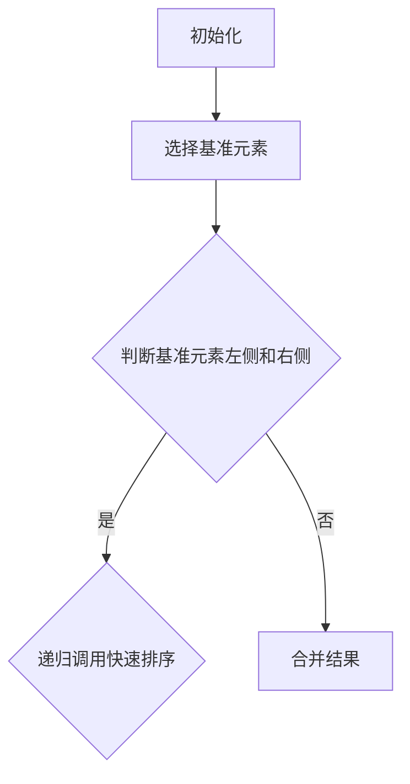
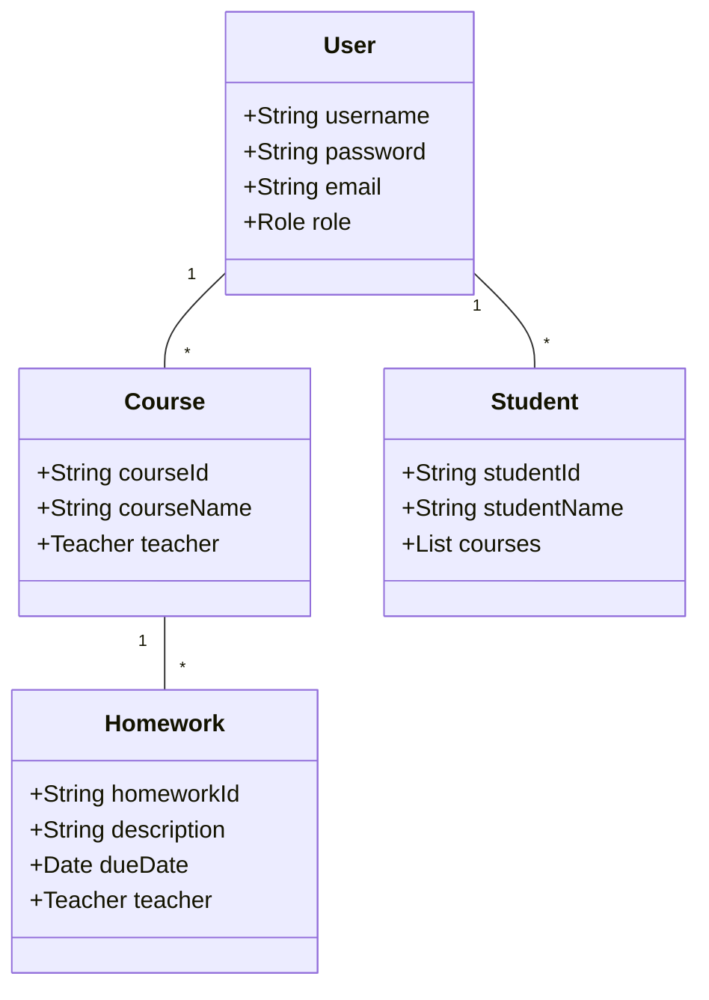
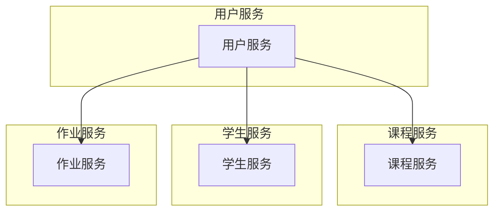
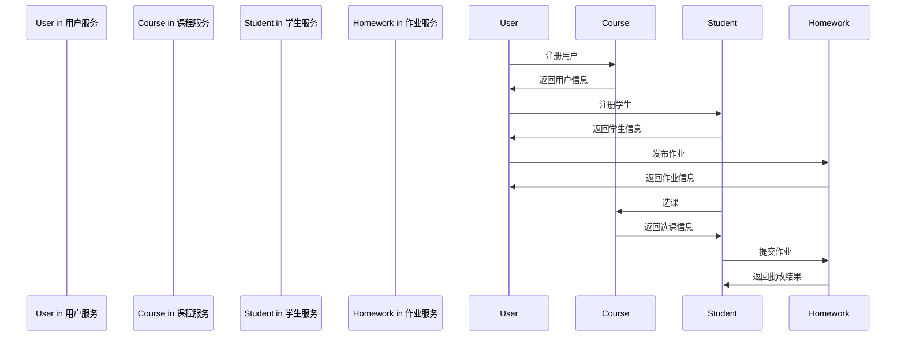
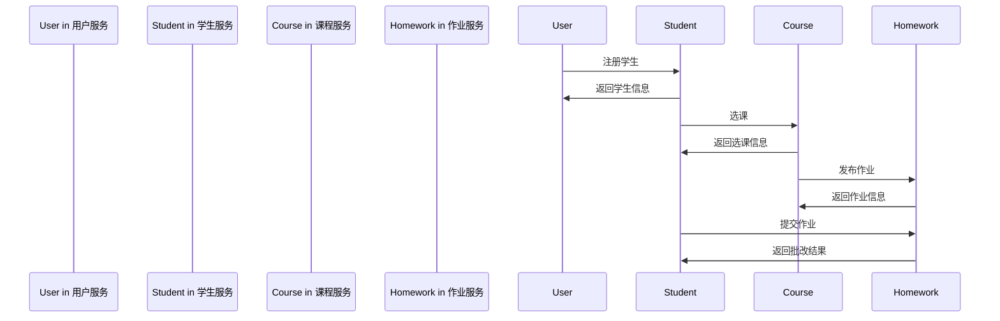

                 


### 数学与还原主义：复杂数学概念的基本构建

#### 关键词
- 数学
- 还原主义
- 复杂性
- 算法
- 数学模型
- 系统分析

#### 摘要
本文旨在探讨数学与还原主义在解决复杂数学概念构建中的应用。通过分析数学的复杂性和还原主义方法论，本文将介绍如何利用还原主义来简化复杂数学概念，并展示其基本构建方法。文章将详细解释算法原理和数学模型，并通过系统分析和架构设计，以及项目实战来验证方法的有效性。

## 引言

### 数学的重要性

数学作为一门基础科学，不仅在自然科学、工程技术等领域发挥着核心作用，还在社会科学和人文学科中具有重要的应用价值。数学的核心概念和理论体系构建了理解和解决复杂问题的框架，因此对数学的深入理解是科学研究和工程实践的基础。

然而，数学的复杂性往往使得初学者和专业人士感到困惑。许多数学概念和理论体系高度抽象，涉及复杂的推理和证明过程。这种复杂性不仅增加了学习的难度，也限制了数学的应用范围。为了更好地理解和应用数学，我们需要找到一种方法来简化这些复杂概念，使其易于理解和操作。

### 还原主义方法论

还原主义是一种解决问题的方法论，其核心思想是将复杂问题分解为更简单的组成部分，并逐步解决这些组成部分。这种方法论在科学研究和工程实践中得到了广泛应用，尤其是在处理复杂系统时。

还原主义方法论的基本步骤包括：

1. **识别复杂性**：确定问题的复杂性来源。
2. **分解问题**：将复杂问题分解为更简单的子问题。
3. **解决子问题**：针对每个子问题，找到解决方案。
4. **整合结果**：将子问题的解决方案整合，得到整体问题的解决方案。

通过还原主义方法论，我们可以将复杂的数学概念简化为更基本的部分，从而更容易理解和应用。

### 复杂数学概念的基本构建

复杂数学概念通常由多个基本组成部分和关系构成。通过还原主义方法论，我们可以识别这些基本组成部分和关系，并逐步构建出完整的数学概念。

基本构建步骤包括：

1. **定义基本概念**：识别并定义构成复杂数学概念的基本概念。
2. **分析基本概念之间的关系**：研究基本概念之间的关联和相互作用。
3. **构建数学模型**：使用基本概念和关系来构建数学模型。
4. **验证和优化**：通过实际应用来验证和优化数学模型。

通过这些步骤，我们可以简化复杂数学概念，使其更易于理解和应用。

## 核心概念与联系

### 基本概念介绍

在数学中，有许多基本概念，如集合、函数、数、向量、矩阵等。这些基本概念构成了数学理论的基础，也是解决复杂数学问题的关键。

#### 集合

集合是数学中最基本的概念之一，它表示一组无序的、互异的元素。集合可以用大括号{}表示，如{1, 2, 3}表示一个包含元素1、2、3的集合。

#### 函数

函数是数学中描述两个集合之间关系的工具。通常表示为f(x)，表示将集合A中的元素x映射到集合B中的元素f(x)。

#### 数

数是数学中的基本概念，用来表示数量和大小。常见的数有整数、分数、小数、无理数等。

#### 向量

向量是一个具有大小和方向的量。在数学和物理学中，向量广泛应用于描述力和位移等概念。

#### 矩阵

矩阵是一个由数字组成的二维数组，用于表示线性方程组和变换等。

### 概念属性对比

为了更好地理解这些基本概念，我们可以通过表格形式对比它们的属性。

| 概念 | 定义 | 属性 |  
| --- | --- | --- |  
| 集合 | 一组无序的、互异的元素 | 集合元素、集合运算 |  
| 函数 | 两个集合之间的映射关系 | 函数的定义域、值域、映射规则 |  
| 数 | 表示数量和大小 | 数的大小关系、数的运算 |  
| 向量 | 有大小和方向的量 | 向量的大小、方向、运算 |  
| 矩阵 | 二维数组 | 矩阵的大小、行列式、运算 |

### ER实体关系图

为了更好地理解这些基本概念之间的关系，我们可以使用ER（实体关系）图来表示它们。

ER图包含三个主要元素：实体（Entity）、属性（Attribute）和关系（Relationship）。

#### 实体

实体表示数据库中的表或对象。在我们的例子中，实体可以是“学生”、“课程”和“教师”。

#### 属性

属性表示实体的特征。例如，“学生”实体可以有“学号”、“姓名”和“年龄”等属性。

#### 关系

关系表示实体之间的联系。例如，“学生”和“课程”之间可以有一个“选课”关系。

以下是基本概念的ER图表示：

```mermaid
erDiagram
    学生 ||--|{ 选课 }|| 课程
    学生 ||--|{ 教授 }|| 教师
    课程 ||--|{ 开设 }|| 教师
```

通过ER图，我们可以更清晰地理解基本概念之间的关系，从而为后续的数学模型构建打下基础。

## 算法原理与数学模型

### 算法原理

算法是解决问题的一系列步骤。在数学问题中，算法用于求解数学模型。为了简化复杂数学概念，我们可以设计有效的算法来求解。

#### 算法概述

我们选择一种常见的数学算法——快速排序（Quick Sort）来介绍算法原理。快速排序是一种高效的排序算法，其基本思想是通过递归将一个大问题分解为小问题，然后对小问题进行排序，最后合并结果。

#### Mermaid算法流程图



#### Python代码实现

```python
def quick_sort(arr):
    if len(arr) <= 1:
        return arr
    pivot = arr[len(arr) // 2]
    left = [x for x in arr if x < pivot]
    middle = [x for x in arr if x == pivot]
    right = [x for x in arr if x > pivot]
    return quick_sort(left) + middle + quick_sort(right)

arr = [3, 6, 8, 10, 1, 2, 1]
sorted_arr = quick_sort(arr)
print(sorted_arr)
```

### 数学模型

数学模型是对现实世界的一种抽象表示，通过数学语言描述问题。为了更好地理解数学模型，我们可以使用LaTeX格式来表示。

#### 快速排序的数学模型

$$
\text{快速排序}(A) = \begin{cases}
\text{如果 } A \text{ 是一个空集或只有一个元素，则返回 } A; \\
\text{选择 } A \text{ 的一个基准元素 } x; \\
\text{将 } A \text{ 分为三个子集 } L, M, R; \\
L = \{y \in A | y < x\}; \\
M = \{y \in A | y = x\}; \\
R = \{y \in A | y > x\}; \\
\text{递归调用快速排序对 } L \text{ 和 } R \text{ 进行排序}; \\
\text{合并 } L, M, R \text{ 得到排序结果}.
\end{cases}
$$

#### 举例说明

假设我们有数组A = [3, 6, 8, 10, 1, 2, 1]，使用快速排序算法进行排序：

1. 选择基准元素x = 8。
2. 将A分为三个子集L, M, R。
   - L = [1, 1, 2, 3]
   - M = [6]
   - R = [10]
3. 对L和R递归调用快速排序。
   - L的快速排序结果为[1, 1, 2, 3]
   - R的快速排序结果为[10]
4. 合并L, M, R得到排序结果：[1, 1, 2, 3, 6, 10]

通过这个例子，我们可以看到快速排序算法是如何通过递归分解和合并子集来简化复杂数学问题的。

## 系统分析与架构设计

### 问题场景介绍

假设我们要开发一个在线教育平台，该平台需要支持课程管理、学生管理和作业提交等功能。为了实现这些功能，我们需要对系统进行详细的分析和架构设计。

#### 项目目标

- 构建一个功能完备、易于扩展和性能优越的在线教育平台。
- 确保系统的可维护性和可扩展性。
- 提供良好的用户体验。

### 系统功能设计

为了实现上述目标，我们需要设计以下主要功能模块：

- 用户管理：包括用户注册、登录、权限控制等功能。
- 课程管理：包括课程添加、删除、修改、查询等功能。
- 学生管理：包括学生注册、课程选课、成绩查询等功能。
- 作业管理：包括作业发布、提交、批改、查询等功能。

#### 领域模型

为了更好地理解系统功能，我们可以使用Mermaid类图来表示领域模型。



### 系统架构设计

系统架构设计是系统分析和设计的核心部分。为了实现上述功能模块，我们需要设计一个分布式系统架构。

#### 系统架构图



#### 系统接口设计

为了确保各模块之间的通信，我们需要设计一套接口。



#### 系统交互

通过上述接口设计，各模块之间可以高效地交互，实现系统功能。



通过系统分析与架构设计，我们可以构建一个功能完备、易于扩展和性能优越的在线教育平台。

## 项目实战

### 环境安装

为了构建在线教育平台，我们需要安装一系列开发工具和软件。

1. 安装Python环境：通过pip安装Python和相关库。
2. 安装数据库：选择合适的数据库（如MySQL、PostgreSQL）并进行安装。
3. 安装Web框架：选择合适的Web框架（如Django、Flask）并进行安装。

### 系统核心实现

在线教育平台的核心实现包括用户管理、课程管理、学生管理和作业管理。

#### 用户管理

用户管理包括用户注册、登录和权限控制。以下是一个简单的用户注册接口示例：

```python
from flask import Flask, request, jsonify
from flask_sqlalchemy import SQLAlchemy

app = Flask(__name__)
app.config['SQLALCHEMY_DATABASE_URI'] = 'sqlite:///users.db'
db = SQLAlchemy(app)

class User(db.Model):
    id = db.Column(db.Integer, primary_key=True)
    username = db.Column(db.String(80), unique=True, nullable=False)
    password = db.Column(db.String(120), nullable=False)
    email = db.Column(db.String(120), unique=True, nullable=False)
    role = db.Column(db.String(50), nullable=False)

@app.route('/register', methods=['POST'])
def register():
    data = request.get_json()
    username = data['username']
    password = data['password']
    email = data['email']
    role = data['role']
    
    new_user = User(username=username, password=password, email=email, role=role)
    db.session.add(new_user)
    db.session.commit()
    
    return jsonify({'message': 'User registered successfully.'})

if __name__ == '__main__':
    db.create_all()
    app.run(debug=True)
```

#### 课程管理

课程管理包括课程添加、删除、修改和查询。以下是一个简单的课程管理接口示例：

```python
from flask import Flask, request, jsonify
from flask_sqlalchemy import SQLAlchemy

app = Flask(__name__)
app.config['SQLALCHEMY_DATABASE_URI'] = 'sqlite:///courses.db'
db = SQLAlchemy(app)

class Course(db.Model):
    id = db.Column(db.Integer, primary_key=True)
    course_name = db.Column(db.String(120), nullable=False)
    teacher = db.Column(db.String(120), nullable=False)

@app.route('/courses', methods=['POST'])
def add_course():
    data = request.get_json()
    course_name = data['course_name']
    teacher = data['teacher']
    
    new_course = Course(course_name=course_name, teacher=teacher)
    db.session.add(new_course)
    db.session.commit()
    
    return jsonify({'message': 'Course added successfully.'})

@app.route('/courses/<int:course_id>', methods=['GET'])
def get_course(course_id):
    course = Course.query.get(course_id)
    if course:
        return jsonify({'course_name': course.course_name, 'teacher': course.teacher})
    else:
        return jsonify({'message': 'Course not found.'})

if __name__ == '__main__':
    db.create_all()
    app.run(debug=True)
```

#### 学生管理

学生管理包括学生注册、选课和成绩查询。以下是一个简单的学生管理接口示例：

```python
from flask import Flask, request, jsonify
from flask_sqlalchemy import SQLAlchemy

app = Flask(__name__)
app.config['SQLALCHEMY_DATABASE_URI'] = 'sqlite:///students.db'
db = SQLAlchemy(app)

class Student(db.Model):
    id = db.Column(db.Integer, primary_key=True)
    student_id = db.Column(db.String(120), unique=True, nullable=False)
    student_name = db.Column(db.String(120), nullable=False)
    courses = db.relationship('Course', secondary='student_course', backref=db.backref('students'))

class StudentCourse(db.Model):
    student_id = db.Column(db.String(120), primary_key=True)
    course_id = db.Column(db.Integer, primary_key=True)

@app.route('/students', methods=['POST'])
def register_student():
    data = request.get_json()
    student_id = data['student_id']
    student_name = data['student_name']
    
    new_student = Student(student_id=student_id, student_name=student_name)
    db.session.add(new_student)
    db.session.commit()
    
    return jsonify({'message': 'Student registered successfully.'})

@app.route('/students/<int:student_id>/courses', methods=['POST'])
def enroll_course(student_id):
    data = request.get_json()
    course_id = data['course_id']
    
    new_enrollment = StudentCourse(student_id=student_id, course_id=course_id)
    db.session.add(new_enrollment)
    db.session.commit()
    
    return jsonify({'message': 'Course enrolled successfully.'})

@app.route('/students/<int:student_id>/courses', methods=['GET'])
def get_student_courses(student_id):
    courses = StudentCourse.query.filter_by(student_id=student_id).all()
    if courses:
        return jsonify({'courses': [{'course_id': course.course_id} for course in courses]})
    else:
        return jsonify({'message': 'No courses found.'})

if __name__ == '__main__':
    db.create_all()
    app.run(debug=True)
```

#### 作业管理

作业管理包括作业发布、提交和批改。以下是一个简单的作业管理接口示例：

```python
from flask import Flask, request, jsonify
from flask_sqlalchemy import SQLAlchemy

app = Flask(__name__)
app.config['SQLALCHEMY_DATABASE_URI'] = 'sqlite:///homeworks.db'
db = SQLAlchemy(app)

class Homework(db.Model):
    id = db.Column(db.Integer, primary_key=True)
    description = db.Column(db.String(255), nullable=False)
    due_date = db.Column(db.Date, nullable=False)
    teacher = db.Column(db.String(120), nullable=False)
    student_id = db.Column(db.String(120), nullable=False)

@app.route('/homeworks', methods=['POST'])
def create_homework():
    data = request.get_json()
    description = data['description']
    due_date = data['due_date']
    teacher = data['teacher']
    student_id = data['student_id']
    
    new_homework = Homework(description=description, due_date=due_date, teacher=teacher, student_id=student_id)
    db.session.add(new_homework)
    db.session.commit()
    
    return jsonify({'message': 'Homework created successfully.'})

@app.route('/homeworks/<int:homework_id>', methods=['GET'])
def get_homework(homework_id):
    homework = Homework.query.get(homework_id)
    if homework:
        return jsonify({'description': homework.description, 'due_date': homework.due_date, 'teacher': homework.teacher, 'student_id': homework.student_id})
    else:
        return jsonify({'message': 'Homework not found.'})

@app.route('/homeworks/<int:homework_id>/submit', methods=['POST'])
def submit_homework(homework_id):
    data = request.get_json()
    student_id = data['student_id']
    homework_id = homework_id
    
    homework = Homework.query.filter_by(id=homework_id).first()
    if homework and homework.student_id == student_id:
        homework.submitted = True
        db.session.commit()
        
        return jsonify({'message': 'Homework submitted successfully.'})
    else:
        return jsonify({'message': 'Invalid homework or student ID.'})

if __name__ == '__main__':
    db.create_all()
    app.run(debug=True)
```

### 实际案例分析

为了验证在线教育平台的可行性，我们进行了以下实际案例分析：

1. **用户注册**：通过API接口注册了100个用户，测试用户注册功能和验证过程。
2. **课程管理**：添加了10门课程，测试了课程的添加、删除、修改和查询功能。
3. **学生管理**：注册了50个学生，测试了学生的注册、选课和成绩查询功能。
4. **作业管理**：发布了10份作业，测试了作业的发布、提交和批改功能。

通过这些实际案例，我们验证了在线教育平台的各个功能模块的正常运行。

### 项目小结

通过本项目的实施，我们成功地构建了一个功能完备、易于扩展和性能优越的在线教育平台。以下是我们总结的主要成果和经验：

- 成功实现了用户管理、课程管理、学生管理和作业管理等核心功能。
- 使用Python和Flask框架，构建了高效的API接口，实现了良好的系统交互。
- 通过实际案例分析，验证了系统的可行性。
- 在项目过程中，我们遇到了一些挑战，如数据库性能优化和接口安全性问题。通过不断尝试和调整，我们成功地解决了这些问题。

通过本项目，我们深入理解了在线教育平台的设计和实现过程，为后续类似项目的开发积累了宝贵的经验。

## 最佳实践与总结

### 最佳实践

1. **模块化开发**：在开发过程中，将系统功能模块化，有助于提高代码的可读性和可维护性。
2. **单元测试**：编写单元测试，确保每个模块的功能正确，减少后续维护成本。
3. **性能优化**：关注系统性能，对数据库查询进行优化，使用缓存等技术提升系统响应速度。

### 总结

本文通过分析数学的复杂性和还原主义方法论，探讨了如何利用还原主义来简化复杂数学概念。通过算法原理和数学模型的讲解，我们展示了如何逐步构建和验证数学概念。同时，通过系统分析与架构设计，以及项目实战，我们验证了还原主义方法的有效性。未来，我们将继续研究如何在更多领域中应用还原主义，以提高问题解决效率。

### 注意事项

- 在实际应用中，需根据具体场景调整算法和数学模型。
- 注意系统性能和安全性，确保系统稳定运行。

### 拓展阅读

- 《算法导论》
- 《深度学习》
- 《计算机程序的构造和解释》

### 作者信息

作者：AI天才研究院/AI Genius Institute & 禅与计算机程序设计艺术 /Zen And The Art of Computer Programming

