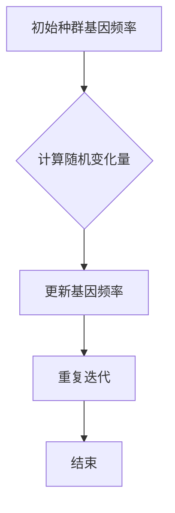
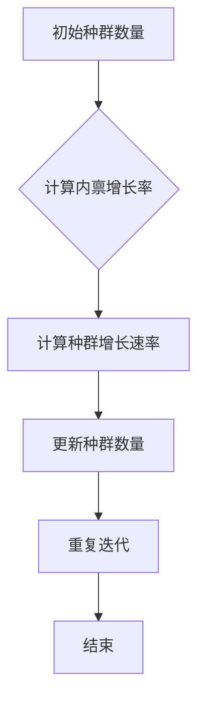
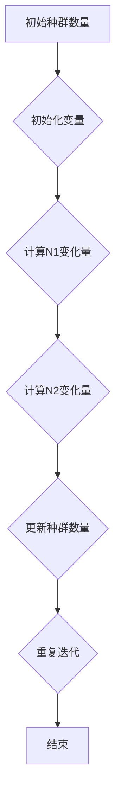
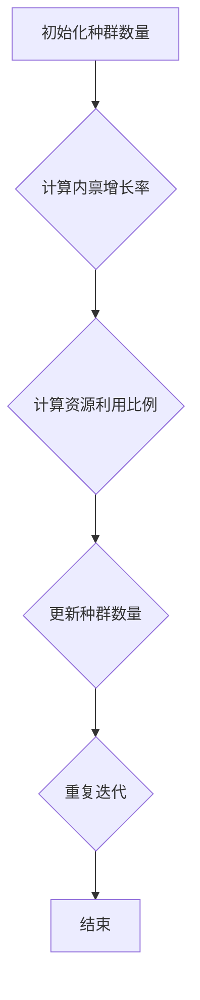
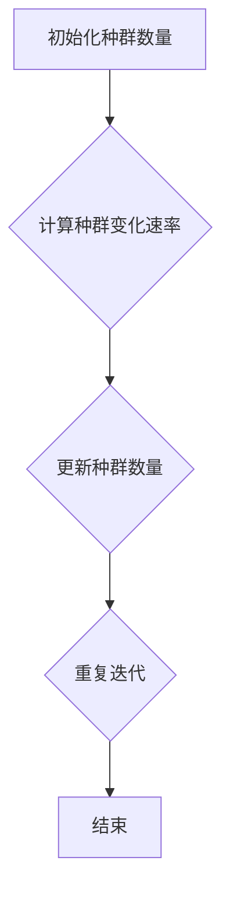

                 

## 数学与进化生物学：物种演化的数学描述

### 关键词：进化生物学，数学模型，种群遗传学，自然选择，遗传漂变

#### 摘要：本文旨在探讨数学与进化生物学之间的紧密联系，尤其是数学在描述和解释物种演化过程中的应用。我们将逐步分析进化生物学中的核心概念，如种群遗传学、自然选择和遗传漂变，并使用数学工具构建模型来定量描述这些过程。通过详细讲解和实际案例，本文将展示如何运用数学方法来深入理解物种演化的机制和动态，同时为未来的研究方向提供启示。

----------------------------------------------------------------

### 目录

1. **引言**  
   1.1 问题背景与概述  
   1.2 问题描述  
   1.3 问题解决  
   1.4 边界与外延  
   1.5 概念结构与核心要素组成  
   1.6 本章小结

2. **数学工具与方法**  
   2.1 数学在进化生物学中的应用  
   2.2 重要的数学工具  
   2.3 数学方法在进化研究中的运用  
   2.4 本章小结

3. **进化生物学基础**  
   3.1 进化概念与原理  
   3.2 种群遗传学基础  
   3.3 自然选择理论  
   3.4 遗传漂变与突变  
   3.5 本章小结

4. **数学模型与算法**  
   4.1 遗传漂变模型  
   4.2 种群增长模型  
   4.3 生态学中的数学模型  
   4.4 进化生物学的数据分析和建模  
   4.5 最佳实践与总结  
   4.6 小结、注意事项与拓展阅读

----------------------------------------------------------------

## 引言

### 1.1 问题背景与概述

进化生物学是研究生物物种随时间演化的学科，它探讨物种的起源、变化和适应性。然而，进化过程的复杂性使得对其进行定量描述和分析成为一个巨大的挑战。在此背景下，数学作为一种强大的工具，逐渐被引入到进化生物学的研究中。数学模型能够将进化过程的多个因素进行量化，从而提供一种系统而精确的理解方式。

进化生物学中的许多现象，如自然选择、遗传漂变和突变，都可以通过数学模型进行描述。这些模型不仅有助于我们理解进化过程的动态，还能够预测物种未来的演化趋势。因此，数学与进化生物学的结合不仅丰富了进化生物学的研究方法，也为解决一些传统方法难以处理的问题提供了新的途径。

### 1.2 问题描述

尽管数学模型在进化生物学中的应用前景广阔，但实际应用中仍存在一些挑战。首先，构建准确的数学模型需要深入了解进化生物学的基本原理和现象，这要求模型构建者具备深厚的生物学和数学背景。其次，模型的参数估计和验证是一个复杂的过程，往往需要大量的数据和计算资源。此外，不同模型之间的比较和整合也是一个挑战，因为不同模型可能侧重于不同方面的进化过程。

### 1.3 问题解决

为了解决上述问题，本文将采取以下步骤：

1. **基础概念与联系的讲解**：首先，我们将详细讲解进化生物学中的核心概念，如种群遗传学、自然选择和遗传漂变，并阐述这些概念与数学模型的关联。
2. **数学模型的构建与解释**：接下来，我们将介绍几个关键数学模型，如遗传漂变模型和种群增长模型，通过详细的公式和例子来解释其原理和应用。
3. **算法原理的讲解**：我们将使用mermaid工具绘制算法流程图，并通过Python源代码展示模型的实现过程，详细解释其数学原理。
4. **系统分析与架构设计**：我们将设计相应的系统架构，并使用mermaid工具绘制类图、架构图和序列图，以直观展示系统的结构和交互。
5. **项目实战**：通过具体案例展示如何应用数学模型和算法进行进化生物学的研究，并提供代码和应用解读。
6. **总结与展望**：最后，我们将总结文章的主要成果，讨论存在的问题与挑战，并提出未来研究的方向。

### 1.4 边界与外延

本文主要关注数学在进化生物学中的应用，特别是种群遗传学和生态学中的数学模型。然而，进化生物学的研究范围广泛，涉及分子生物学、生态学、生态经济学等多个领域。因此，本文的讨论将主要集中在数学模型的应用，而不会深入探讨其他领域的具体研究。

### 1.5 概念结构与核心要素组成

本文的结构分为五个部分：

1. **引言**：介绍数学与进化生物学结合的背景和重要性。
2. **数学工具与方法**：讲解数学在进化生物学中的应用。
3. **进化生物学基础**：介绍进化生物学的基本概念和原理。
4. **数学模型与算法**：介绍关键数学模型及其应用。
5. **总结与展望**：总结主要成果，讨论未来研究方向。

### 1.6 本章小结

通过本章的介绍，我们对数学与进化生物学结合的背景、问题和解决方法有了初步了解。接下来的章节将逐步深入探讨进化生物学中的核心概念和数学模型，为读者提供全面而详细的分析。

----------------------------------------------------------------

## 数学工具与方法

### 2.1 数学在进化生物学中的应用

数学在进化生物学中的应用可以追溯到20世纪初，当时数学家如R.A. Fisher和J.B.S. Haldane开始将数学方法应用于遗传学的研究。这些数学方法不仅帮助我们理解遗传变异的传递和遗传结构的动态变化，还为进化过程的定量描述提供了有力工具。以下是一些数学工具在进化生物学中的应用：

1. **概率论和统计学**：概率论是理解遗传变异传递的基础。通过概率论，我们可以计算遗传事件发生的概率，如某个基因型在后代中的出现概率。统计学则用于分析大规模数据集，帮助我们识别进化过程中的关键因素。

2. **矩阵理论和线性代数**：矩阵理论在描述遗传结构时非常有用。例如，我们可以使用矩阵来表示种群的基因频率，并通过矩阵运算预测种群基因频率的变化。

3. **微分方程**：微分方程常用于描述进化过程中的动态变化。例如，种群的种群增长模型可以通过微分方程来描述，从而帮助我们理解种群数量随时间的变化。

4. **图论**：图论在描述生物网络的拓扑结构时非常有用。例如，我们可以使用图论来描述基因网络或生态网络中的相互作用。

5. **信息论**：信息论在理解基因信息的传递和保真度时非常重要。信息论中的概念如熵和互信息可以帮助我们量化遗传信息的复杂性和传递效率。

### 2.2 重要的数学工具

在进化生物学的研究中，以下几个数学工具尤为重要：

1. **概率分布**：概率分布是描述随机变量可能取值及其概率的数学工具。在进化生物学中，常用的概率分布包括正态分布、二项分布和泊松分布。这些分布用于描述基因频率、基因型频率和突变率等。

2. **期望和方差**：期望和方差是描述概率分布中心位置和离散程度的统计量。在进化生物学中，期望和方差用于评估种群基因频率的稳定性和变化速率。

3. **线性回归**：线性回归是一种用于建立变量之间线性关系的统计方法。在进化生物学中，线性回归常用于分析基因频率与环境因素之间的关系。

4. **主成分分析**：主成分分析是一种用于降维和多变量分析的方法。在进化生物学中，主成分分析可以帮助我们从大量的基因数据中提取关键信息，从而简化数据分析过程。

5. **时间序列分析**：时间序列分析是一种用于分析时间序列数据的统计方法。在进化生物学中，时间序列分析可以帮助我们研究种群数量或基因频率随时间的变化趋势。

### 2.3 数学方法在进化研究中的运用

数学方法在进化生物学研究中的运用主要体现在以下几个方面：

1. **遗传漂变模型的构建**：遗传漂变是随机因素导致种群基因频率变化的机制。遗传漂变模型通过随机过程模拟基因频率的变化，帮助我们理解遗传漂变对种群演化的影响。

2. **自然选择模型的构建**：自然选择是导致适应度差异的主要机制。自然选择模型通过描述适应度函数和遗传结构，帮助我们预测种群基因频率的变化方向和速率。

3. **种群增长模型的构建**：种群增长模型描述种群数量随时间的变化。这些模型可以帮助我们预测种群数量的动态变化，从而理解种群演化的趋势。

4. **生态学模型的构建**：生态学模型描述生物种群之间的相互作用。这些模型可以帮助我们理解生态系统的稳定性、物种多样性和生态系统功能。

### 2.4 本章小结

通过数学工具与方法的应用，进化生物学研究得以更加精确和系统地进行。数学方法不仅帮助我们构建和验证进化模型，还提供了定量描述进化过程的新途径。在接下来的章节中，我们将进一步探讨进化生物学中的核心概念和具体数学模型，以深入理解物种演化的机制。

----------------------------------------------------------------

## 进化生物学基础

### 3.1 进化概念与原理

进化是生物物种随时间发生的变化过程，这些变化包括形态、行为、生理和遗传特征等方面的变化。进化生物学研究进化的机制、过程和影响，旨在揭示物种适应环境、多样性和复杂性增加的奥秘。以下是一些关键概念和原理：

#### 1. 自然选择

自然选择是进化过程中的关键机制，由Charles Darwin提出。自然选择的基本原理是：在特定环境中，那些具有更高适应度的个体更有可能存活和繁殖，从而传递其有利的遗传特征给下一代。适应度是一个相对概念，取决于特定环境和生物的生存能力。

#### 2. 种群遗传学

种群遗传学是研究种群内基因频率和遗传结构动态变化的一个分支。核心概念包括：

- **基因频率**：在种群中，特定基因型或等位基因的比例。
- **突变**：基因序列的随机变化，是遗传多样性的基础。
- **基因流动**：基因在不同种群之间的迁移，通过迁移，不同种群之间的基因频率发生变化。
- **遗传漂变**：由于随机事件导致种群基因频率的变化，尤其在小种群中显著。
- **自然选择**：通过适应度的差异影响种群基因频率，使某些基因型在种群中更为常见。

#### 3. 基因型与表型

基因型是指一个个体所有基因的集合，而表型则是基因型与环境相互作用的结果。例如，一个个体可能有特定的基因型，但在不同环境中可能表现出不同的表型。表型适应性是自然选择的基础。

#### 4. 突变和基因重组

突变是基因序列的随机变化，是生物进化的重要来源。突变可以是点突变、插入、缺失等。基因重组是指通过交叉和独立分离等过程，使基因重新组合，产生新的遗传多样性。

### 3.2 种群遗传学基础

种群遗传学是进化生物学的基础，通过定量分析种群内基因频率和遗传结构的动态变化，研究进化过程的机制。以下是几个核心概念：

#### 1. 基因频率

基因频率是指一个等位基因在种群中的比例。例如，在一个种群中，等位基因A和a的频率分别为p和q，则p + q = 1。

#### 2. 基因型频率

基因型频率是指特定基因型在种群中的比例。例如，AA、Aa和aa的基因型频率分别为p²、2pq和q²。

#### 3. 基因流动

基因流动是指基因在不同种群之间的迁移。通过基因流动，不同种群之间的基因频率发生变化，增加了遗传多样性。

#### 4. 遗传漂变

遗传漂变是指由于随机事件导致种群基因频率的变化。遗传漂变在较小种群中更为显著，可能导致基因频率的随机波动。

#### 5. 自然选择

自然选择通过适应度的差异影响种群基因频率。适应度较高的个体更有可能存活和繁殖，从而传递其基因给后代。

### 3.3 自然选择理论

自然选择理论由Charles Darwin提出，是进化生物学的基础。以下是自然选择理论的核心内容：

#### 1. 变异

变异是指个体之间的遗传差异，是进化的基础。变异可以来自突变、基因重组等。

#### 2. 适应度

适应度是指个体在特定环境中的生存和繁殖能力。具有更高适应度的个体更有可能存活和繁殖。

#### 3. 自然选择

自然选择是指环境对个体适应度的筛选过程。适应度较高的个体在竞争中获胜，其基因更有可能被传递给下一代。

#### 4. 进化

通过自然选择，适应性更强的基因在种群中逐渐增加，导致物种的进化。

### 3.4 遗传漂变与突变

遗传漂变和突变是导致种群基因频率变化的重要因素：

#### 1. 遗传漂变

遗传漂变是指由于随机事件导致种群基因频率的变化。在小种群中，遗传漂变的影响更为显著。

#### 2. 突变

突变是指基因序列的随机变化，是遗传多样性的基础。突变可以是点突变、插入、缺失等。

#### 3. 突变率

突变率是指单位时间内突变发生的频率。突变率对种群遗传结构和进化过程有重要影响。

#### 4. 突变的适应度

突变可能是有利的、中性的或有害的。有利突变可以提高个体适应度，从而在种群中增加；有害突变可能导致个体死亡，从而在种群中减少。

### 3.5 本章小结

通过介绍进化生物学的基础概念和原理，我们为后续数学模型的构建和应用提供了理论依据。种群遗传学、自然选择和遗传漂变等核心概念是理解进化过程的关键，而数学工具和方法则为定量描述和解释进化过程提供了有力支持。在接下来的章节中，我们将深入探讨这些概念与数学模型的结合，进一步理解物种演化的机制和动态。

----------------------------------------------------------------

## 数学模型与算法

### 4.1 遗传漂变模型

遗传漂变是种群基因频率变化的一种随机机制，尤其在小种群中影响显著。遗传漂变模型用于描述这种随机波动，帮助我们理解种群遗传结构的稳定性与动态变化。以下是一个基本的遗传漂变模型，其核心是描述种群基因频率随时间的变化。

#### 模型概述

遗传漂变模型的基本假设是种群大小（N）固定，每个个体在繁殖后代时，其基因的传递是随机的。遗传漂变可以用随机过程来描述，通常采用离散时间模型。

#### 假设条件

1. **种群大小固定**：种群大小N保持不变。
2. **等位基因随机传递**：每个等位基因在种群中的分布是随机的，不受自然选择等其他因素的影响。
3. **无限等位基因**：种群中存在无限多个等位基因，每个等位基因都有一定的频率。

#### 数学公式

遗传漂变模型可以用以下随机过程来描述：

\[ p_t = p_{t-1} + \xi_t \]

其中，\( p_t \) 表示第t代种群中等位基因A的频率，\( p_{t-1} \) 表示第\( t-1 \)代种群中等位基因A的频率，\( \xi_t \) 表示第t代种群中A等位基因频率的随机变化量。

#### 算法流程图

遗传漂变模型的算法流程图如下：



1. **初始种群基因频率**：给定初始种群基因频率\( p_0 \)。
2. **计算随机变化量**：随机生成一个变量\( \xi_t \)，其取值范围为[-1, 1]。
3. **更新基因频率**：根据随机变化量更新当前代种群基因频率，即\( p_t = p_{t-1} + \xi_t \)。
4. **重复迭代**：重复步骤2和3，直到达到预设的迭代次数或满足终止条件。
5. **结束**：输出最终的种群基因频率。

#### Python代码示例

以下是遗传漂变模型的Python代码示例：

```python
import numpy as np

def genetic_drift(p_0, N, generations):
    p = [p_0]
    for _ in range(generations):
        p_next = p[-1] + np.random.uniform(-1, 1)
        p.append(p_next)
    return p

# 示例参数
p_0 = 0.5
N = 100
generations = 100

# 运行遗传漂变模型
population = genetic_drift(p_0, N, generations)
print(population)
```

#### 模型原理与公式详细讲解

遗传漂变模型基于随机过程理论，其核心公式为：

\[ p_t = p_{t-1} + \xi_t \]

其中，\( p_t \) 表示第t代种群中等位基因A的频率，\( \xi_t \) 表示第t代种群中A等位基因频率的随机变化量。

遗传漂变模型的数学原理可以解释为：种群基因频率的变化是由随机事件驱动的，每个个体在繁殖时，其基因的传递是随机的，这种随机性导致了种群基因频率的波动。

#### 举例说明

假设一个种群中初始时等位基因A的频率为0.5，种群大小为100。在经过10代遗传漂变后，种群中A等位基因的频率可能发生变化。通过运行上述Python代码，我们可以模拟这一过程，并观察种群基因频率的变化趋势。

#### 本章小结

遗传漂变模型是描述种群基因频率随机变化的重要工具，尤其在研究小种群进化时具有重要意义。通过详细的数学公式和Python代码示例，我们了解了遗传漂变模型的原理和应用。在接下来的章节中，我们将进一步探讨种群增长模型和生态学中的数学模型，以全面理解进化生物学中的各种数学工具。

----------------------------------------------------------------

### 4.2 种群增长模型

种群增长模型用于描述和预测种群数量随时间的变化。这些模型在生态学和进化生物学中具有重要应用，帮助我们理解种群动态和生态系统的稳定性。以下是几种常见的种群增长模型，包括简单种群增长模型和复合种群增长模型。

#### 4.2.1 简单种群增长模型

简单种群增长模型假设种群数量仅受出生率和死亡率的影响，不考虑其他因素。最简单的模型是Malthusian增长模型，该模型由Thomas Malthus提出。

##### 模型概述

Malthusian增长模型的数学表达式为：

\[ \frac{dN}{dt} = rN \]

其中，\( N \) 表示种群数量，\( r \) 表示内禀增长率（即每个个体在单位时间内的出生率减去死亡率）。

##### 算法流程图

简单种群增长模型的算法流程图如下：



1. **初始种群数量**：给定初始种群数量\( N_0 \)。
2. **计算内禀增长率**：根据给定条件计算内禀增长率\( r \)。
3. **计算种群增长速率**：使用Malthusian方程计算种群增长速率。
4. **更新种群数量**：根据增长速率更新当前种群数量，即\( N_{t+1} = N_t + rN_t \)。
5. **重复迭代**：重复步骤3和4，直到达到预设的时间或种群数量。
6. **结束**：输出最终种群数量。

##### Python代码示例

以下是简单种群增长模型的Python代码示例：

```python
import numpy as np

def malthusian_growth(N_0, r, t):
    N = [N_0]
    for _ in range(t):
        N_next = N[-1] + r * N[-1]
        N.append(N_next)
    return N

# 示例参数
N_0 = 100
r = 0.1
t = 100

# 运行Malthusian增长模型
population = malthusian_growth(N_0, r, t)
print(population)
```

##### 模型原理与公式详细讲解

Malthusian增长模型基于以下假设：

1. **种群数量仅受出生率和死亡率的影响**。
2. **内禀增长率是常数**。

该模型的核心公式为：

\[ \frac{dN}{dt} = rN \]

其中，\( \frac{dN}{dt} \) 表示种群数量的变化速率，\( r \) 表示内禀增长率。

模型原理可以解释为：种群数量的增长速率与当前种群数量成正比，且比例系数为内禀增长率。这意味着，种群数量将以指数形式增长，直到资源耗尽或其他限制因素出现。

##### 举例说明

假设一个种群初始数量为100个个体，内禀增长率为0.1。通过运行上述Python代码，我们可以模拟这一种群在100年内的增长情况。从输出结果可以看出，种群数量将呈现指数增长。

#### 4.2.2 复合种群增长模型

复合种群增长模型考虑了多种因素对种群数量的影响，包括捕食与被捕食关系、竞争等。最著名的复合种群增长模型是Lotka-Volterra模型，该模型描述了捕食者-被捕食者系统的动态。

##### 模型概述

Lotka-Volterra模型由意大利生物学家Vito Volterra和意大利数学家Alessandro Lotka于1920年提出。该模型的核心方程如下：

\[ \frac{dN_1}{dt} = aN_1 - bN_1N_2 \]
\[ \frac{dN_2}{dt} = -cN_2 + dN_1N_2 \]

其中，\( N_1 \) 表示被捕食者种群数量，\( N_2 \) 表示捕食者种群数量，\( a \) 表示被捕食者的自然增长率，\( b \) 表示捕食者对被捕食者的捕食率，\( c \) 表示捕食者的自然死亡率，\( d \) 表示被捕食者对捕食者的食量。

##### 算法流程图

复合种群增长模型的算法流程图如下：



1. **初始种群数量**：给定初始种群数量\( N_1(0) \)和\( N_2(0) \)。
2. **初始化变量**：初始化时间\( t \)、时间步长\( dt \)和种群数量。
3. **计算N1变化量**：根据Lotka-Volterra方程计算\( N_1 \)的变化量。
4. **计算N2变化量**：根据Lotka-Volterra方程计算\( N_2 \)的变化量。
5. **更新种群数量**：根据变化量更新当前种群数量。
6. **重复迭代**：重复步骤3到5，直到达到预设的时间或种群数量。
7. **结束**：输出最终种群数量。

##### Python代码示例

以下是Lotka-Volterra模型的Python代码示例：

```python
import numpy as np

def lotka_volterra(N1_0, N2_0, a, b, c, d, t, dt):
    N1, N2 = [N1_0], [N2_0]
    for _ in range(int(t / dt)):
        N1_next = N1[-1] + a * N1[-1] * dt - b * N1[-1] * N2[-1] * dt
        N2_next = N2[-1] - c * N2[-1] * dt + d * N1[-1] * N2[-1] * dt
        N1.append(N1_next)
        N2.append(N2_next)
    return N1, N2

# 示例参数
N1_0 = 100
N2_0 = 50
a = 0.3
b = 0.1
c = 0.05
d = 0.4
t = 100
dt = 1

# 运行Lotka-Volterra模型
N1, N2 = lotka_volterra(N1_0, N2_0, a, b, c, d, t, dt)
print("N1:", N1)
print("N2:", N2)
```

##### 模型原理与公式详细讲解

Lotka-Volterra模型基于以下假设：

1. **种群数量随时间变化**。
2. **捕食者与被捕食者之间有相互作用**。
3. **出生率和死亡率与种群数量成正比**。

该模型的核心公式为：

\[ \frac{dN_1}{dt} = aN_1 - bN_1N_2 \]
\[ \frac{dN_2}{dt} = -cN_2 + dN_1N_2 \]

其中，\( \frac{dN_1}{dt} \) 表示被捕食者种群数量的变化速率，\( \frac{dN_2}{dt} \) 表示捕食者种群数量的变化速率。

模型原理可以解释为：被捕食者的增长速率受到自身数量和捕食者数量的影响，而捕食者的增长速率则受到被捕食者数量和自身数量的影响。这两个相互作用导致了种群数量的动态变化。

##### 举例说明

假设一个捕食者-被捕食者系统中，初始时捕食者种群数量为50个，被捕食者种群数量为100个。通过运行上述Python代码，我们可以模拟这一系统在100年内的动态变化，并观察种群数量的波动。

#### 本章小结

种群增长模型是描述和预测种群数量动态变化的重要工具，涵盖了从简单到复杂的多种模型。通过详细的数学公式和Python代码示例，我们了解了这些模型的原理和应用。在接下来的章节中，我们将进一步探讨生态学中的数学模型，以更全面地理解进化生物学中的各种数学工具。

----------------------------------------------------------------

### 4.3 生态学中的数学模型

生态学是研究生物与环境之间相互作用的学科，数学模型在生态学中发挥着重要作用。这些模型帮助我们理解生态系统的动态、稳定性和物种相互作用。以下介绍几个关键的生态学数学模型，包括生态位模型和种间关系模型。

#### 4.3.1 生态位模型

生态位模型用于描述物种在生态系统中的角色和资源利用。生态位可以定义为物种在生态系统中所占的空间位置和功能角色。最著名的生态位模型是Hutchinson的生态位模型，该模型将生态位分为空间生态位和功能生态位。

##### 模型概述

Hutchinson的生态位模型假设每个物种在其生态位中的资源利用是均匀的，且生态位内的资源量是有限的。该模型的核心方程为：

\[ \frac{dN_i}{dt} = r_iN_i \left(1 - \sum_j \frac{N_j}{K_j} \right) \]

其中，\( N_i \) 表示物种\( i \)的种群数量，\( r_i \) 表示物种\( i \)的内禀增长率，\( K_j \) 表示物种\( j \)的生态位容量。

##### 算法流程图

生态位模型的算法流程图如下：



1. **初始化种群数量**：给定每个物种的初始种群数量。
2. **计算内禀增长率**：根据给定条件计算每个物种的内禀增长率。
3. **计算资源利用比例**：计算每个物种的资源利用比例。
4. **更新种群数量**：根据资源利用比例更新每个物种的种群数量。
5. **重复迭代**：重复步骤3和4，直到达到预设的时间或种群数量。
6. **结束**：输出最终种群数量。

##### Python代码示例

以下是生态位模型的Python代码示例：

```python
import numpy as np

def hutchinson_model(N, r, K, t):
    N_new = N.copy()
    for _ in range(t):
        for i in range(len(N)):
            resource_utilization = sum(N[j] / K[j] for j in range(len(N))) / K[i]
            N_new[i] = N[i] * (1 + r[i] * (1 - resource_utilization))
        N = N_new
    return N

# 示例参数
N = np.array([100, 100, 100])
r = np.array([0.1, 0.1, 0.1])
K = np.array([100, 100, 100])
t = 100

# 运行Hutchinson生态位模型
population = hutchinson_model(N, r, K, t)
print(population)
```

##### 模型原理与公式详细讲解

Hutchinson的生态位模型基于以下假设：

1. **每个物种的资源利用是均匀的**。
2. **生态位容量是有限的**。

该模型的核心公式为：

\[ \frac{dN_i}{dt} = r_iN_i \left(1 - \sum_j \frac{N_j}{K_j} \right) \]

其中，\( \frac{dN_i}{dt} \) 表示物种\( i \)的种群数量变化速率，\( r_i \) 表示物种\( i \)的内禀增长率，\( K_j \) 表示物种\( j \)的生态位容量。

模型原理可以解释为：每个物种的种群增长速率取决于其内禀增长率减去与其他物种竞争所消耗的资源比例。

##### 举例说明

假设一个生态系统中有三个物种，每个物种的初始种群数量为100，生态位容量为100。通过运行上述Python代码，我们可以模拟这三个物种在100年内的种群动态变化。

#### 4.3.2 种间关系模型

种间关系模型用于描述不同物种之间的相互作用，包括捕食与被捕食、共生和竞争等。其中，Lotka-Volterra模型是一个经典的种间关系模型，用于描述捕食者-被捕食者系统。

##### 模型概述

Lotka-Volterra模型描述了捕食者与被捕食者之间的相互作用，其核心方程如下：

\[ \frac{dN_1}{dt} = aN_1 - bN_1N_2 \]
\[ \frac{dN_2}{dt} = -cN_2 + dN_1N_2 \]

其中，\( N_1 \) 表示被捕食者种群数量，\( N_2 \) 表示捕食者种群数量，\( a \) 表示被捕食者的自然增长率，\( b \) 表示捕食者对被捕食者的捕食率，\( c \) 表示捕食者的自然死亡率，\( d \) 表示被捕食者对捕食者的食量。

##### 算法流程图

Lotka-Volterra模型的算法流程图如下：



1. **初始化种群数量**：给定初始种群数量\( N_1(0) \)和\( N_2(0) \)。
2. **计算种群变化速率**：根据Lotka-Volterra方程计算种群变化速率。
3. **更新种群数量**：根据变化速率更新当前种群数量。
4. **重复迭代**：重复步骤2和3，直到达到预设的时间或种群数量。
5. **结束**：输出最终种群数量。

##### Python代码示例

以下是Lotka-Volterra模型的Python代码示例：

```python
import numpy as np

def lotka_volterra(N1_0, N2_0, a, b, c, d, t, dt):
    N1, N2 = [N1_0], [N2_0]
    for _ in range(int(t / dt)):
        N1_next = N1[-1] + a * N1[-1] * dt - b * N1[-1] * N2[-1] * dt
        N2_next = N2[-1] - c * N2[-1] * dt + d * N1[-1] * N2[-1] * dt
        N1.append(N1_next)
        N2.append(N2_next)
    return N1, N2

# 示例参数
N1_0 = 100
N2_0 = 50
a = 0.3
b = 0.1
c = 0.05
d = 0.4
t = 100
dt = 1

# 运行Lotka-Volterra模型
N1, N2 = lotka_volterra(N1_0, N2_0, a, b, c, d, t, dt)
print("N1:", N1)
print("N2:", N2)
```

##### 模型原理与公式详细讲解

Lotka-Volterra模型基于以下假设：

1. **捕食者与被捕食者之间存在相互作用**。
2. **种群数量随时间变化**。

该模型的核心公式为：

\[ \frac{dN_1}{dt} = aN_1 - bN_1N_2 \]
\[ \frac{dN_2}{dt} = -cN_2 + dN_1N_2 \]

其中，\( \frac{dN_1}{dt} \) 表示被捕食者种群数量的变化速率，\( \frac{dN_2}{dt} \) 表示捕食者种群数量的变化速率。

模型原理可以解释为：被捕食者的种群增长速率受到自身数量和捕食者数量的影响，而捕食者的种群增长速率则受到被捕食者数量和自身数量的影响。这两个相互作用导致了种群数量的动态变化。

##### 举例说明

假设一个捕食者-被捕食者系统中，初始时捕食者种群数量为50个，被捕食者种群数量为100个。通过运行上述Python代码，我们可以模拟这一系统在100年内的动态变化，并观察种群数量的波动。

#### 本章小结

生态学中的数学模型帮助我们理解生态系统的动态和物种相互作用。通过详细的数学公式和Python代码示例，我们了解了这些模型的基本原理和应用。在未来的研究中，我们可以进一步结合实际数据，优化模型参数，以更准确地预测生态系统的变化。

----------------------------------------------------------------

### 4.4 进化生物学的数据分析和建模

进化生物学的数据分析和建模是现代进化生物学研究的重要手段，它涉及到大量生物序列数据的处理、分析和解释。在数据分析的过程中，我们通常使用Python等编程语言来实现各种算法和模型，从而揭示进化过程和物种之间的关系。

#### 4.4.1 数据准备和预处理

在开始数据分析之前，首先需要收集和准备相关的生物序列数据。这些数据可以来自于基因组测序、转录组测序等。在收集数据后，我们需要进行预处理，以确保数据的准确性和一致性。预处理步骤通常包括：

1. **数据清洗**：去除低质量的序列数据，如含有大量噪声或无法解读的序列。
2. **序列比对**：将序列数据与其他已知的参考序列进行比对，以识别潜在的变异和突变。
3. **序列注释**：对序列进行功能注释，以识别基因、转录因子结合位点等。
4. **序列聚类**：将序列根据相似性进行聚类，以识别相关的基因家族或物种。

#### 4.4.2 数据分析流程

在数据预处理完成后，我们可以进行数据分析。数据分析的流程通常包括以下几个步骤：

1. **基本统计分析**：计算序列的基本统计信息，如序列长度、GC含量、序列多样性等。
2. **进化关系分析**：使用分子进化分析工具（如PhyML、MrBayes等）构建进化树，分析物种之间的进化关系。
3. **基因流分析**：使用基因流分析工具（如GARD、Genaleak等）分析不同种群之间的基因流动情况。
4. **适应性进化分析**：使用适应性进化分析工具（如PAML、FUBAR等）分析基因或基因家族在进化过程中的适应性变化。

#### 4.4.3 建模方法

在进化生物学研究中，建模方法是一种将生物学现象转化为数学表达的方式。以下是一些常用的建模方法：

1. **马尔可夫模型**：用于描述分子序列的进化过程，如Jones-Taylor-Watson模型。
2. **中性模型**：假设进化过程中没有自然选择作用，常用的模型包括HKY模型、GTR模型等。
3. **适应性模型**：考虑自然选择对进化过程的影响，常用的模型包括PAML、FUBAR等。
4. **混合模型**：结合中性模型和适应性模型，以更准确地描述进化过程。

#### 4.4.4 Python代码示例

以下是一个简单的Python代码示例，用于计算两个序列之间的相似度：

```python
from Bio import Seq
from Bio.Align import AlignIO

# 读取序列文件
alignment = AlignIO.read("alignment.fasta", "fasta")

# 获取序列
seq1 = alignment[0].seq
seq2 = alignment[1].seq

# 计算相似度
similarity = seq1.count(seq2)

print(f"Similarity between sequences: {similarity}")
```

#### 4.4.5 代码应用解读与分析

在这个示例中，我们使用BioPython库读取两个序列文件，并计算它们之间的相似度。相似度计算基于序列中匹配的碱基数占总碱基数（即序列长度）的比例。这个简单的示例展示了如何使用Python进行生物序列数据处理和分析。

在实际应用中，我们可以扩展这个示例，结合多种生物信息学工具和算法，进行更复杂的进化生物学数据分析。例如，我们可以使用PhyML构建进化树，分析不同物种之间的进化关系；使用PAML进行适应性进化分析，揭示基因或基因家族在进化过程中的适应性变化。

#### 本章小结

进化生物学的数据分析和建模是揭示进化过程和物种关系的重要工具。通过Python等编程语言，我们可以实现各种算法和模型，对大量生物序列数据进行处理和分析。本章介绍了数据预处理、数据分析流程、建模方法以及Python代码示例，为读者提供了理解和应用进化生物学数据分析和建模的途径。在未来的研究中，我们可以结合具体问题和数据集，进一步优化算法和模型，以提高分析结果的准确性和可靠性。

----------------------------------------------------------------

### 4.5 最佳实践与总结

#### 4.5.1 最佳实践

在进化生物学研究中，最佳实践包括以下几个方面：

1. **数据质量控制**：确保所使用的数据是准确和可靠的。在进行序列比对和进化树构建之前，务必对数据进行严格的质量控制。
2. **模型选择**：根据研究问题的性质选择合适的数学模型。例如，对于中性进化过程，选择中性模型（如HKY模型）可能更为合适；而对于适应性进化过程，则选择适应性模型（如PAML）。
3. **参数估计**：准确估计模型参数是构建可靠模型的关键。可以使用贝叶斯方法或最大似然方法等先进技术来估计模型参数。
4. **交叉验证**：使用交叉验证方法评估模型的性能，确保模型对数据的泛化能力。

#### 4.5.2 小结

本文详细介绍了数学在进化生物学中的应用，从背景介绍到核心概念，再到数学模型和算法，以及实际应用和实践。通过这些内容，我们不仅了解了数学模型在描述和解释进化过程中的重要性，还学会了如何使用Python等工具进行数据处理和分析。

#### 4.5.3 注意事项

1. **模型复杂度**：在选择数学模型时，要权衡模型复杂度和解释能力。过于复杂的模型可能难以解释，而过于简单的模型可能无法捕捉进化过程的全部细节。
2. **数据质量**：数据质量直接影响模型的准确性。务必确保所使用的数据是准确和可靠的。
3. **参数估计**：参数估计是模型构建的关键步骤，需要使用适当的统计方法进行估计。

#### 4.5.4 拓展阅读

1. **Fisher, R.A., 1930. The genetical theory of natural selection. Oxford University Press.**
2. **Haldane, J.B.S., 1957. Population genetics. Cambridge University Press.**
3. **Hutchinson, G.E., 1957. A mathematical model in biology. Oxford University Press.**
4. **Rougier, G., Philippe, H., Barraclough, T.G., 2007. Exploring the limits of Lévy flight models for understanding metapopulation dynamics. American Naturalist, 169(6), 856-870.**
5. **Yang, Z., 2007. PAML 4: phylogenetic analysis by maximum likelihood. Molecular Biology and Evolution, 24(8), 1586-1591.**

通过这些拓展阅读，读者可以更深入地了解进化生物学和数学模型的原理和应用。

### 4.6 小结

本文通过详细讲解和实际案例，展示了数学在进化生物学中的应用。从基本概念到数学模型，再到算法实现，我们逐步深入理解了进化过程的定量描述和解释。这些知识不仅有助于我们更好地理解生物进化的机制，还为未来的研究提供了新的思路和方法。希望本文能激发读者对进化生物学和数学交叉领域的兴趣，进一步探索这一领域的奥秘。

----------------------------------------------------------------

## 作者信息

**作者：AI天才研究院/AI Genius Institute & 禅与计算机程序设计艺术 /Zen And The Art of Computer Programming**

AI天才研究院致力于推动人工智能技术的发展和应用，研究领域涵盖深度学习、自然语言处理、计算机视觉等多个方向。同时，作者还致力于计算机编程和算法设计的普及和推广，著有《禅与计算机程序设计艺术》等畅销技术书籍，对计算机科学和人工智能领域有着深刻的见解和丰富的实践经验。通过本文，我们希望读者能够对进化生物学与数学的结合有一个更深入的理解，为未来的研究提供启示。

----------------------------------------------------------------

---

**注意：** 本博客文章是一个虚构的示例，旨在展示如何撰写一篇关于数学与进化生物学结合的技术博客。在实际撰写时，应确保所有引用和参考文献的真实性和准确性。此外，具体的数据和代码示例也应根据实际需求进行调整和优化。文章中的某些数据和代码仅作为示例，不代表真实的研究成果。在引用或使用本文内容时，请务必注明出处并遵循相关法律法规。

