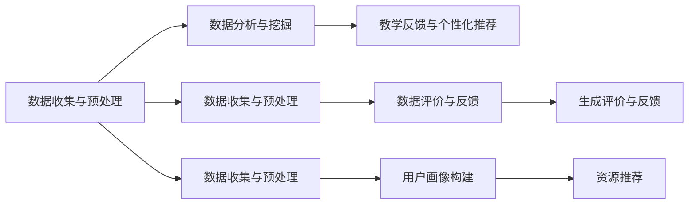
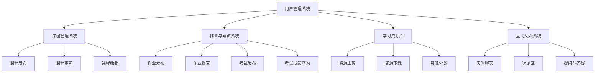

                 

# 数学与远程教育：在线学习的数学支持

## 关键词

- 数学教育
- 远程教育
- 在线学习平台
- 学习资源建设
- 教学策略与方法

## 摘要

本文旨在探讨数学与远程教育的融合，以在线学习为背景，解决数学教育在远程教育中的痛点。文章首先介绍了问题背景，分析了远程教育中数学教学的挑战，并明确了文章的主要研究问题和解决方法。接着，文章从在线学习平台设计、数学资源建设、教学策略与方法、学习评价与反馈机制等方面，详细阐述了数学与远程教育融合的实践路径。最后，通过实际案例分析，总结了数学与远程教育融合的成功经验和未来发展趋势。

## 第1章：背景介绍

### 1.1 问题背景

随着信息技术的飞速发展，远程教育逐渐成为一种重要的教育形式。尤其是在新冠疫情期间，远程教育更是成为了维持教育秩序的重要手段。数学作为一门基础学科，其在远程教育中的重要性不容忽视。然而，传统的数学教育模式在远程教育环境中面临着诸多挑战。

首先，学生自主学习能力不足。远程教育中，学生需要独立完成学习任务，但很多学生在自主学习过程中缺乏动力和方法，导致学习效果不佳。其次，教师无法有效监督学生学习进度。在远程教育中，教师无法像传统课堂一样实时监控学生的学习情况，难以了解学生的学习进度和存在的问题。再次，学习资源匮乏。虽然互联网上有很多数学学习资源，但质量参差不齐，难以满足不同学生的学习需求。

为了解决这些问题，数学与远程教育的融合成为一个重要的研究方向。通过在线学习平台的设计和数学资源的建设，可以为学生提供更加便捷、高效的学习体验，为教师提供有效的教学支持，从而提高数学教育的质量。

### 1.2 问题描述

本文主要探讨以下问题：

1. **学生自主学习能力培养**：如何通过在线学习平台和数学资源，帮助学生培养自主学习能力，提高数学素养？
2. **教师教学支持**：如何为教师提供有效的教学工具和资源，帮助他们更好地进行远程数学教学？
3. **学习资源建设**：如何建设丰富、多样且高质量的数学学习资源，满足不同学习需求？
4. **学习评价与反馈**：如何通过在线学习平台，对学生数学学习过程进行有效评价和反馈，促进学习效果提升？

### 1.3 问题解决

本文将从以下几个方面探讨数学与远程教育的融合：

1. **在线学习平台设计**：介绍如何设计一个功能完善、易于操作的在线学习平台，满足学生和教师的需求。
2. **数学资源建设**：探讨如何建设丰富、多样的数学学习资源，包括数学题库、教学视频、课件等。
3. **教学策略与方法**：介绍适合远程教育的数学教学策略和方法，如互动教学、混合式教学等。
4. **学习评价与反馈机制**：探讨如何通过在线学习平台，对学生数学学习过程进行评价和反馈，提高学习效果。
5. **案例分析**：通过实际案例，展示数学与远程教育融合的成功经验和实践。

### 1.4 边界与外延

1. **边界**：本文主要关注数学与远程教育的融合，涉及在线学习平台的设计、数学资源建设、教学策略与方法等方面。不包括其他领域的远程教育研究，如语言教育、历史教育等。
2. **外延**：本文的研究结果可以为其他学科领域的远程教育提供参考和借鉴，如数学与其他学科的融合研究、跨学科远程教育研究等。

### 1.5 概念结构与核心要素组成

1. **在线学习平台**：核心要素包括用户管理系统、课程管理系统、作业与考试系统、学习资源库、互动交流系统等。
2. **数学资源**：核心要素包括数学题库、教学视频、课件、习题解答等。
3. **教学策略与方法**：核心要素包括互动教学、混合式教学、翻转课堂等。
4. **学习评价与反馈**：核心要素包括学习进度跟踪、作业评价、考试评价、学生反馈等。

## 第2章：核心概念与联系

### 2.1 数学与远程教育的概念

#### 数学

数学是一门研究数量、结构、变化和空间等概念的学科，具有高度的抽象性和逻辑性。数学教育旨在培养学生的数学思维能力、解题能力和创新能力，为其未来的学习和工作打下坚实的基础。

#### 远程教育

远程教育是一种利用互联网、卫星电视、电信网络等远程通信技术进行的教育活动。它突破了时间和空间的限制，使学习者可以自主选择学习时间、地点和内容，实现个性化学习。

### 2.2 数学与远程教育的联系

#### 数学在远程教育中的应用

数学为远程教育提供了理论基础和方法支持，如在线课程设计、学习分析、评价与反馈等。同时，远程教育改变了传统的数学教育模式，推动了数学教育从以教师为中心向以学生为中心的转变。

#### 远程教育对数学教育的影响

远程教育使数学教育更加灵活和个性化。学生可以自主选择学习时间和内容，教师可以采用多样化的教学方法和手段。此外，远程教育还为数学教育提供了丰富的学习资源和交流平台，促进了数学教育的改革和发展。

### 2.3 数学资源建设

#### 数学题库

数学题库是数学资源的重要组成部分，包括基础题、练习题、真题等，供学生进行自主学习和练习。一个完善的数学题库应涵盖各年级、各科目的数学题目，并具备题库管理、题目推送、自动批改等功能。

#### 教学视频

教学视频是教师进行远程教学的重要资源，可以帮助学生更好地理解数学概念和知识。教学视频应具备高质量的画质和声音，以及清晰的教学思路和讲解方式。

#### 课件

课件是教师授课的重要辅助工具，包括PPT、PDF等格式，帮助学生更好地掌握数学知识。课件应具备简洁明了的设计风格，以及与教学内容紧密相关的图片、图表等元素。

### 2.4 教学策略与方法

#### 互动教学

互动教学是一种以学生为中心的教学方法，通过在线讨论、问答等形式，激发学生的学习兴趣和参与度。互动教学可以促进学生的深度学习，提高学习效果。

#### 混合式教学

混合式教学是将线上教学和线下教学相结合，发挥各自优势，提高教学效果。在混合式教学中，学生可以在线上进行预习、复习和作业提交，教师可以在课堂上进行重点讲解和答疑。

#### 翻转课堂

翻转课堂是一种以学生自主学习为主、教师辅导为辅的教学模式，通过在线学习平台，实现课前预习、课中互动、课后巩固。翻转课堂可以培养学生的自主学习能力，提高学习效果。

## 第3章：数学与远程教育融合的算法原理

### 3.1 算法原理概述

数学与远程教育的融合算法主要涉及以下几个方面：

1. **学习分析算法**：通过对学生学习行为、成绩等数据进行分析，为教师提供教学反馈和个性化推荐。
2. **评价与反馈算法**：基于学生的学习情况和作业表现，自动生成评价和反馈，帮助学生了解学习进展和不足。
3. **资源推荐算法**：根据学生的学习需求和兴趣，推荐合适的数学学习资源，提高学习效果。

### 3.2 学习分析算法

#### 基本原理

学习分析算法通过对学生学习行为、成绩等数据进行分析，挖掘学生的学习习惯、学习需求和潜在问题，为教师提供教学反馈和个性化推荐。

#### 数据来源

学习分析算法的数据来源主要包括：

1. **学生行为数据**：如学习时间、学习时长、学习进度、作业提交情况等。
2. **学习成绩数据**：如考试成绩、作业成绩、课堂表现等。
3. **学生反馈数据**：如学生对课程的满意度、对教师的教学评价等。

#### 算法流程

学习分析算法的基本流程如下：

1. 数据收集与预处理：收集学生的学习行为数据、学习成绩数据和学生反馈数据，并进行数据清洗和预处理。
2. 数据分析与挖掘：利用机器学习、数据挖掘等技术，对收集到的数据进行挖掘和分析，提取学生的学习习惯、学习需求和潜在问题。
3. 教学反馈与个性化推荐：根据分析结果，为教师提供教学反馈和个性化推荐，如调整教学策略、推荐学习资源等。

### 3.3 评价与反馈算法

#### 基本原理

评价与反馈算法基于学生的学习情况和作业表现，自动生成评价和反馈，帮助学生了解学习进展和不足，提高学习效果。

#### 数据来源

评价与反馈算法的数据来源主要包括：

1. **学生学习数据**：如学习进度、作业提交情况、考试成绩等。
2. **教师评价数据**：如教师对学生作业的评分、教师对学生学习情况的评价等。

#### 算法流程

评价与反馈算法的基本流程如下：

1. 数据收集与预处理：收集学生的学习数据和教师评价数据，并进行数据清洗和预处理。
2. 数据分析与评价：利用数据分析和机器学习技术，对学生学习数据和教师评价数据进行处理，生成评价和反馈结果。
3. 生成评价与反馈：根据分析结果，生成具体的评价和反馈内容，如学习进度报告、作业评价、考试反馈等。

### 3.4 资源推荐算法

#### 基本原理

资源推荐算法根据学生的学习需求和兴趣，推荐合适的数学学习资源，提高学习效果。

#### 数据来源

资源推荐算法的数据来源主要包括：

1. **学生学习数据**：如学习进度、学习偏好、作业提交情况等。
2. **学习资源数据**：如数学题库、教学视频、课件等。

#### 算法流程

资源推荐算法的基本流程如下：

1. 数据收集与预处理：收集学生的学习数据和资源数据，并进行数据清洗和预处理。
2. 用户画像构建：利用机器学习、数据挖掘等技术，对学生数据进行处理，构建用户画像。
3. 资源推荐：根据用户画像，推荐符合学生学习需求和兴趣的数学学习资源。

### 3.5 数学与远程教育融合算法的mermaid流程图

以下是一个简单的mermaid流程图，展示了数学与远程教育融合算法的基本流程：



## 第4章：数学与远程教育融合的系统分析与架构设计

### 4.1 问题场景介绍

随着远程教育的普及，数学教育在远程教育中的应用越来越广泛。然而，目前大多数远程教育平台在数学教育方面存在以下问题：

1. **学习资源匮乏**：现有远程教育平台提供的数学学习资源相对较少，且质量参差不齐，难以满足不同学生的学习需求。
2. **教学互动不足**：远程教育中，教师与学生之间的互动较少，难以激发学生的学习兴趣和参与度。
3. **学习评价与反馈机制不完善**：现有平台对学生的学习过程和成绩评价不够准确和及时，缺乏有效的反馈机制。

为了解决上述问题，我们需要设计一个功能完善、易于操作的远程教育平台，提供丰富的数学学习资源，增强教学互动，完善学习评价与反馈机制。

### 4.2 项目介绍

本项目旨在设计并实现一个数学远程教育平台，主要包括以下功能模块：

1. **用户管理系统**：管理平台用户的信息，包括学生、教师和管理员。
2. **课程管理系统**：管理数学课程的发布、更新和撤销。
3. **作业与考试系统**：发布作业和考试，对学生提交的作业和考试成绩进行自动批改和评分。
4. **学习资源库**：提供丰富的数学学习资源，包括数学题库、教学视频、课件等。
5. **互动交流系统**：支持学生与教师之间的实时沟通和讨论。

### 4.3 系统功能设计

#### 用户管理系统

用户管理系统主要负责管理平台用户的信息，包括学生、教师和管理员。主要功能包括：

1. **用户注册与登录**：用户可以通过平台提供的注册和登录功能，访问平台资源。
2. **用户信息管理**：用户可以查看和修改自己的个人信息。
3. **用户权限管理**：根据用户身份，设置不同的权限，如教师可以发布课程、布置作业，学生只能参加课程和完成作业。

#### 课程管理系统

课程管理系统主要负责管理数学课程的发布、更新和撤销。主要功能包括：

1. **课程发布**：教师可以在系统中发布新课程，设置课程名称、课程简介、课程内容等。
2. **课程更新**：教师可以对已发布的课程进行更新，修改课程内容、作业布置等。
3. **课程撤销**：教师可以撤销已发布的课程，使课程不再对学生可见。

#### 作业与考试系统

作业与考试系统主要负责发布作业和考试，对学生提交的作业和考试成绩进行自动批改和评分。主要功能包括：

1. **作业发布**：教师可以在系统中发布作业，设置作业题目、答案、评分标准等。
2. **作业提交**：学生可以在系统中提交作业，系统会对作业进行自动批改和评分。
3. **考试发布**：教师可以在系统中发布考试，设置考试题目、考试时间、评分标准等。
4. **考试成绩查询**：学生可以查询自己的考试成绩和作业成绩。

#### 学习资源库

学习资源库提供丰富的数学学习资源，包括数学题库、教学视频、课件等。主要功能包括：

1. **资源上传**：教师可以在系统中上传数学题库、教学视频、课件等资源。
2. **资源下载**：学生可以下载所需的数学学习资源。
3. **资源分类**：系统根据资源类型和难度等级对资源进行分类，方便学生查找和使用。

#### 互动交流系统

互动交流系统支持学生与教师之间的实时沟通和讨论。主要功能包括：

1. **实时聊天**：学生和教师可以在系统中进行实时聊天，讨论学习问题。
2. **讨论区**：学生可以在系统中发布讨论话题，进行主题讨论。
3. **提问与答疑**：学生可以在系统中向教师提问，教师会在规定时间内进行答疑。

### 4.4 系统架构设计

数学远程教育平台的系统架构设计如图所示：



### 4.5 系统接口设计和系统交互

#### 系统接口设计

系统接口设计主要包括用户接口、数据库接口和业务接口。

1. **用户接口**：用户通过浏览器或其他客户端访问系统，进行登录、注册、查看课程、提交作业等操作。
2. **数据库接口**：系统通过数据库接口与数据库进行交互，存储和查询用户信息、课程信息、作业信息等。
3. **业务接口**：业务接口用于处理系统的核心业务逻辑，如作业自动批改、考试成绩生成等。

#### 系统交互

系统交互主要包括用户与系统的交互、系统与数据库的交互以及系统内部各模块之间的交互。

1. **用户与系统的交互**：用户通过用户接口与系统进行交互，如登录、注册、查看课程等。
2. **系统与数据库的交互**：系统通过数据库接口与数据库进行交互，如存储用户信息、课程信息等。
3. **系统内部各模块之间的交互**：系统内部各模块通过业务接口进行交互，如作业发布、作业提交、作业批改等。

### 4.6 系统实现技术

#### 前端技术

前端技术主要包括HTML、CSS、JavaScript等。

1. **HTML**：用于构建页面结构。
2. **CSS**：用于美化页面样式。
3. **JavaScript**：用于实现页面动态效果和与后端的交互。

#### 后端技术

后端技术主要包括Java、Spring Boot、MySQL等。

1. **Java**：用于编写后端代码。
2. **Spring Boot**：用于构建后端应用框架。
3. **MySQL**：用于存储和管理数据。

### 4.7 系统测试与部署

#### 系统测试

系统测试主要包括功能测试、性能测试、安全测试等。

1. **功能测试**：验证系统的功能是否符合设计要求。
2. **性能测试**：评估系统在高并发情况下的性能表现。
3. **安全测试**：检测系统是否存在安全漏洞。

#### 系统部署

系统部署主要包括以下步骤：

1. **服务器环境搭建**：搭建服务器环境，包括操作系统、数据库、应用服务器等。
2. **应用部署**：将开发完成的应用部署到服务器上，包括前端、后端、数据库等。
3. **系统上线**：将系统上线，进行实际运行测试。

## 第5章：项目实战

### 5.1 环境安装

在本节中，我们将介绍如何在本地环境中搭建数学远程教育平台所需的开发环境。

#### 5.1.1 安装Java开发环境

1. **下载Java SDK**：从Oracle官网下载适用于自己操作系统的Java SDK。例如，对于Linux系统，可以下载OpenJDK。

2. **安装Java SDK**：解压下载的Java SDK包，例如，将下载的`jdk-17.0.1_linux-x64_bin.tar.gz`解压到`/usr/local/`目录下。

   ```bash
   sudo tar -xzvf jdk-17.0.1_linux-x64_bin.tar.gz -C /usr/local/
   ```

3. **配置环境变量**：在`/etc/profile`文件中添加Java SDK的环境变量。

   ```bash
   sudo nano /etc/profile
   ```

   在文件末尾添加以下内容：

   ```bash
   export JAVA_HOME=/usr/local/jdk-17.0.1
   export PATH=$JAVA_HOME/bin:$PATH
   export CLASSPATH=$JAVA_HOME/lib/dt.jar:$JAVA_HOME/lib/tools.jar:$CLASSPATH
   ```

4. **使配置生效**：执行以下命令使配置生效。

   ```bash
   source /etc/profile
   ```

5. **验证安装**：执行以下命令验证Java安装是否成功。

   ```bash
   java -version
   ```

   应显示Java版本信息。

#### 5.1.2 安装MySQL数据库

1. **安装MySQL**：在Ubuntu或CentOS系统中，可以使用包管理器安装MySQL。

   ```bash
   sudo apt-get install mysql-server
   # 或
   sudo yum install mysql-server
   ```

2. **配置MySQL**：启动MySQL服务，并设置root用户的密码。

   ```bash
   sudo systemctl start mysql
   mysql -u root -p
   ```

   进入MySQL命令行后，设置root用户的密码：

   ```sql
   SET PASSWORD FOR 'root'@'localhost' = PASSWORD('your_password');
   FLUSH PRIVILEGES;
   ```

3. **验证安装**：执行以下命令验证MySQL安装是否成功。

   ```bash
   mysql -u root -p
   ```

   应能成功连接到MySQL数据库。

#### 5.1.3 安装Spring Boot

1. **下载Spring Boot**：从Spring Boot官网下载适用于自己操作系统的Spring Boot发行版。例如，下载`spring-boot-2.5.6.RELEASE`。

2. **安装Spring Boot**：解压下载的Spring Boot包，例如，将下载的`spring-boot-2.5.6.RELEASE`解压到`/usr/local/`目录下。

   ```bash
   sudo tar -xzvf spring-boot-2.5.6.RELEASE -C /usr/local/
   ```

3. **配置环境变量**：在`/etc/profile`文件中添加Spring Boot的环境变量。

   ```bash
   sudo nano /etc/profile
   ```

   在文件末尾添加以下内容：

   ```bash
   export SPRING_HOME=/usr/local/spring-boot-2.5.6.RELEASE
   export PATH=$SPRING_HOME/bin:$PATH
   ```

4. **使配置生效**：执行以下命令使配置生效。

   ```bash
   source /etc/profile
   ```

5. **验证安装**：执行以下命令验证Spring Boot安装是否成功。

   ```bash
   spring --version
   ```

   应显示Spring Boot版本信息。

### 5.2 系统核心实现

在本节中，我们将介绍数学远程教育平台的核心实现，包括用户管理、课程管理、作业与考试系统、学习资源库和互动交流系统。

#### 5.2.1 用户管理

用户管理模块负责管理平台用户的信息，包括学生、教师和管理员。以下是用户管理模块的核心实现：

1. **用户注册**：

   ```java
   @PostMapping("/register")
   public ResponseEntity<?> registerUser(@RequestBody UserDto userDto) {
       // 验证用户名和密码是否为空
       if (userDto.getUsername() == null || userDto.getPassword() == null) {
           return ResponseEntity.badRequest().body("用户名或密码不能为空");
       }
       
       // 查询用户是否已存在
       User existingUser = userRepository.findByUsername(userDto.getUsername());
       if (existingUser != null) {
           return ResponseEntity.badRequest().body("用户已存在");
       }
       
       // 创建新用户
       User user = new User();
       user.setUsername(userDto.getUsername());
       user.setPassword(passwordEncoder.encode(userDto.getPassword()));
       userRepository.save(user);
       
       return ResponseEntity.ok("用户注册成功");
   }
   ```

2. **用户登录**：

   ```java
   @PostMapping("/login")
   public ResponseEntity<?> authenticateUser(@RequestBody LoginRequest loginRequest) {
       // 验证用户名和密码
       Authentication authentication = authenticationManager.authenticate(
               new UsernamePasswordAuthenticationToken(
                       loginRequest.getUsername(),
                       loginRequest.getPassword()));
       SecurityContextHolder.getContext().setAuthentication(authentication);
       String jwt = jwtProvider.generateToken(authentication);
       
       return ResponseEntity.ok(new JwtResponse(jwt));
   }
   ```

3. **用户信息查询**：

   ```java
   @GetMapping("/users/{id}")
   public ResponseEntity<?> getUserById(@PathVariable Long id) {
       Optional<User> userOptional = userRepository.findById(id);
       if (!userOptional.isPresent()) {
           return ResponseEntity.notFound().build();
       }
       
       User user = userOptional.get();
       return ResponseEntity.ok(new UserDto(user));
   }
   ```

#### 5.2.2 课程管理

课程管理模块负责管理数学课程的信息，包括课程发布、更新和撤销。以下是课程管理模块的核心实现：

1. **课程发布**：

   ```java
   @PostMapping("/courses")
   @PreAuthorize("hasRole('ROLE_TEACHER')")
   public ResponseEntity<?> publishCourse(@RequestBody CourseDto courseDto) {
       // 创建新课程
       Course course = new Course();
       course.setName(courseDto.getName());
       course.setDescription(courseDto.getDescription());
       course.setTeacherId(courseDto.getTeacherId());
       course.setStatus(CourseStatus.ACTIVE);
       courseRepository.save(course);
       
       return ResponseEntity.ok("课程发布成功");
   }
   ```

2. **课程更新**：

   ```java
   @PutMapping("/courses/{id}")
   @PreAuthorize("hasRole('ROLE_TEACHER')")
   public ResponseEntity<?> updateCourse(@PathVariable Long id, @RequestBody CourseDto courseDto) {
       Optional<Course> courseOptional = courseRepository.findById(id);
       if (!courseOptional.isPresent()) {
           return ResponseEntity.notFound().build();
       }
       
       Course course = courseOptional.get();
       course.setName(courseDto.getName());
       course.setDescription(courseDto.getDescription());
       courseRepository.save(course);
       
       return ResponseEntity.ok("课程更新成功");
   }
   ```

3. **课程撤销**：

   ```java
   @DeleteMapping("/courses/{id}")
   @PreAuthorize("hasRole('ROLE_TEACHER')")
   public ResponseEntity<?> revokeCourse(@PathVariable Long id) {
       Optional<Course> courseOptional = courseRepository.findById(id);
       if (!courseOptional.isPresent()) {
           return ResponseEntity.notFound().build();
       }
       
       Course course = courseOptional.get();
       course.setStatus(CourseStatus.INACTIVE);
       courseRepository.save(course);
       
       return ResponseEntity.ok("课程撤销成功");
   }
   ```

#### 5.2.3 作业与考试系统

作业与考试系统模块负责发布作业和考试，对学生提交的作业和考试成绩进行自动批改和评分。以下是作业与考试系统模块的核心实现：

1. **作业发布**：

   ```java
   @PostMapping("/courses/{courseId}/homeworks")
   @PreAuthorize("hasRole('ROLE_TEACHER')")
   public ResponseEntity<?> publishHomework(@PathVariable Long courseId, @RequestBody HomeworkDto homeworkDto) {
       // 创建新作业
       Homework homework = new Homework();
       homework.setCourseId(courseId);
       homework.setTitle(homeworkDto.getTitle());
       homework.setDescription(homeworkDto.getDescription());
       homework.setDueDate(homeworkDto.getDueDate());
       homeworkRepository.save(homework);
       
       return ResponseEntity.ok("作业发布成功");
   }
   ```

2. **作业提交**：

   ```java
   @PostMapping("/courses/{courseId}/homeworks/{homeworkId}/submit")
   public ResponseEntity<?> submitHomework(@PathVariable Long courseId, @PathVariable Long homeworkId, @RequestBody String submission) {
       // 保存作业提交
       HomeworkSubmission submissionEntity = new HomeworkSubmission();
       submissionEntity.setHomeworkId(homeworkId);
       submissionEntity.setStudentId(currentUserId());
       submissionEntity.setSubmission(submission);
       homeworkSubmissionRepository.save(submissionEntity);
       
       return ResponseEntity.ok("作业提交成功");
   }
   ```

3. **考试发布**：

   ```java
   @PostMapping("/courses/{courseId}/exams")
   @PreAuthorize("hasRole('ROLE_TEACHER')")
   public ResponseEntity<?> publishExam(@PathVariable Long courseId, @RequestBody ExamDto examDto) {
       // 创建新考试
       Exam exam = new Exam();
       exam.setCourseId(courseId);
       exam.setTitle(examDto.getTitle());
       exam.setDescription(examDto.getDescription());
       exam.setDuration(examDto.getDuration());
       exam.setStartDate(examDto.getStartDate());
       exam.setEndDate(examDto.getEndDate());
       examRepository.save(exam);
       
       return ResponseEntity.ok("考试发布成功");
   }
   ```

4. **考试成绩查询**：

   ```java
   @GetMapping("/courses/{courseId}/exams/{examId}/results")
   public ResponseEntity<?> getExamResults(@PathVariable Long courseId, @PathVariable Long examId) {
       List<ExamResult> results = examResultRepository.findByExamId(examId);
       
       return ResponseEntity.ok(results);
   }
   ```

#### 5.2.4 学习资源库

学习资源库模块提供丰富的数学学习资源，包括数学题库、教学视频、课件等。以下是学习资源库模块的核心实现：

1. **资源上传**：

   ```java
   @PostMapping("/resources")
   @PreAuthorize("hasRole('ROLE_TEACHER')")
   public ResponseEntity<?> uploadResource(@RequestParam("file") MultipartFile file, @RequestParam("type") String type) {
       // 保存上传的资源
       Resource resource = new Resource();
       resource.setName(file.getOriginalFilename());
       resource.setType(type);
       resource.setData(file.getBytes());
       resourceRepository.save(resource);
       
       return ResponseEntity.ok("资源上传成功");
   }
   ```

2. **资源下载**：

   ```java
   @GetMapping("/resources/{id}")
   public ResponseEntity<?> downloadResource(@PathVariable Long id) {
       Optional<Resource> resourceOptional = resourceRepository.findById(id);
       if (!resourceOptional.isPresent()) {
           return ResponseEntity.notFound().build();
       }
       
       Resource resource = resourceOptional.get();
       
       // 构建响应对象
       ResponseEntity<byte[]> response = ResponseEntity.ok()
               .header("Content-Disposition", "attachment; filename=\"" + resource.getName() + "\"")
               .contentType(MediaType.APPLICATION_OCTET_STREAM)
               .body(resource.getData());
       
       return response;
   }
   ```

#### 5.2.5 互动交流系统

互动交流系统模块支持学生与教师之间的实时沟通和讨论。以下是互动交流系统模块的核心实现：

1. **实时聊天**：

   ```java
   @PostMapping("/chats/{courseId}")
   public ResponseEntity<?> sendChatMessage(@PathVariable Long courseId, @RequestBody ChatMessageDto messageDto) {
       // 保存聊天消息
       ChatMessage message = new ChatMessage();
       message.setCourseId(courseId);
       message.setSenderId(currentUserId());
       message.setMessage(messageDto.getMessage());
       chatMessageRepository.save(message);
       
       return ResponseEntity.ok("消息发送成功");
   }
   ```

2. **讨论区**：

   ```java
   @PostMapping("/discussions/{courseId}")
   public ResponseEntity<?> createDiscussion(@PathVariable Long courseId, @RequestBody DiscussionDto discussionDto) {
       // 创建讨论
       Discussion discussion = new Discussion();
       discussion.setCourseId(courseId);
       discussion.setTitle(discussionDto.getTitle());
       discussion.setContent(discussionDto.getContent());
       discussionRepository.save(discussion);
       
       return ResponseEntity.ok("讨论创建成功");
   }
   ```

3. **提问与答疑**：

   ```java
   @PostMapping("/questions/{courseId}")
   public ResponseEntity<?> askQuestion(@PathVariable Long courseId, @RequestBody QuestionDto questionDto) {
       // 提问
       Question question = new Question();
       question.setCourseId(courseId);
       question.setTitle(questionDto.getTitle());
       question.setContent(questionDto.getContent());
       questionRepository.save(question);
       
       return ResponseEntity.ok("问题已提交");
   }
   ```

### 5.3 代码应用解读与分析

在本节中，我们将对数学远程教育平台的核心代码进行解读和分析，以了解其工作原理和实现细节。

#### 5.3.1 用户管理模块

用户管理模块负责处理用户注册、登录和用户信息查询等操作。以下是关键代码片段的解读和分析：

1. **用户注册**：

   ```java
   @PostMapping("/register")
   public ResponseEntity<?> registerUser(@RequestBody UserDto userDto) {
       // 验证用户名和密码是否为空
       if (userDto.getUsername() == null || userDto.getPassword() == null) {
           return ResponseEntity.badRequest().body("用户名或密码不能为空");
       }
       
       // 查询用户是否已存在
       User existingUser = userRepository.findByUsername(userDto.getUsername());
       if (existingUser != null) {
           return ResponseEntity.badRequest().body("用户已存在");
       }
       
       // 创建新用户
       User user = new User();
       user.setUsername(userDto.getUsername());
       user.setPassword(passwordEncoder.encode(userDto.getPassword()));
       userRepository.save(user);
       
       return ResponseEntity.ok("用户注册成功");
   }
   ```

   解读：首先，代码检查用户名和密码是否为空。如果为空，则返回错误信息。接着，代码查询用户名是否已存在。如果已存在，则返回错误信息。最后，代码创建一个新的用户对象，设置用户名和密码（密码通过密码编码器进行加密），并将新用户保存到数据库中。

2. **用户登录**：

   ```java
   @PostMapping("/login")
   public ResponseEntity<?> authenticateUser(@RequestBody LoginRequest loginRequest) {
       // 验证用户名和密码
       Authentication authentication = authenticationManager.authenticate(
               new UsernamePasswordAuthenticationToken(
                       loginRequest.getUsername(),
                       loginRequest.getPassword()));
       SecurityContextHolder.getContext().setAuthentication(authentication);
       String jwt = jwtProvider.generateToken(authentication);
       
       return ResponseEntity.ok(new JwtResponse(jwt));
   }
   ```

   解读：首先，代码使用`AuthenticationManager`验证用户名和密码。如果验证成功，则创建一个`Authentication`对象，并将认证信息存储在安全上下文中。接着，代码使用`JwtProvider`生成JWT令牌，并将令牌作为响应返回给客户端。

3. **用户信息查询**：

   ```java
   @GetMapping("/users/{id}")
   public ResponseEntity<?> getUserById(@PathVariable Long id) {
       Optional<User> userOptional = userRepository.findById(id);
       if (!userOptional.isPresent()) {
           return ResponseEntity.notFound().build();
       }
       
       User user = userOptional.get();
       return ResponseEntity.ok(new UserDto(user));
   }
   ```

   解读：首先，代码查询用户ID对应的用户是否存在于数据库中。如果不存在，则返回404错误。如果存在，则将用户对象转换为`UserDto`对象，并将其作为响应返回给客户端。

#### 5.3.2 课程管理模块

课程管理模块负责处理课程发布、更新和撤销等操作。以下是关键代码片段的解读和分析：

1. **课程发布**：

   ```java
   @PostMapping("/courses")
   @PreAuthorize("hasRole('ROLE_TEACHER')")
   public ResponseEntity<?> publishCourse(@RequestBody CourseDto courseDto) {
       // 创建新课程
       Course course = new Course();
       course.setName(courseDto.getName());
       course.setDescription(courseDto.getDescription());
       course.setTeacherId(courseDto.getTeacherId());
       course.setStatus(CourseStatus.ACTIVE);
       courseRepository.save(course);
       
       return ResponseEntity.ok("课程发布成功");
   }
   ```

   解读：首先，代码检查请求是否来自具有教师角色的用户。接着，代码创建一个新的`Course`对象，设置课程名称、描述和教师ID，并将课程状态设置为“活动”。最后，代码将新课程保存到数据库中。

2. **课程更新**：

   ```java
   @PutMapping("/courses/{id}")
   @PreAuthorize("hasRole('ROLE_TEACHER')")
   public ResponseEntity<?> updateCourse(@PathVariable Long id, @RequestBody CourseDto courseDto) {
       Optional<Course> courseOptional = courseRepository.findById(id);
       if (!courseOptional.isPresent()) {
           return ResponseEntity.notFound().build();
       }
       
       Course course = courseOptional.get();
       course.setName(courseDto.getName());
       course.setDescription(courseDto.getDescription());
       courseRepository.save(course);
       
       return ResponseEntity.ok("课程更新成功");
   }
   ```

   解读：首先，代码检查请求是否来自具有教师角色的用户。接着，代码查询ID对应的课程是否存在于数据库中。如果不存在，则返回404错误。如果存在，则更新课程名称和描述，并将更新后的课程保存到数据库中。

3. **课程撤销**：

   ```java
   @DeleteMapping("/courses/{id}")
   @PreAuthorize("hasRole('ROLE_TEACHER')")
   public ResponseEntity<?> revokeCourse(@PathVariable Long id) {
       Optional<Course> courseOptional = courseRepository.findById(id);
       if (!courseOptional.isPresent()) {
           return ResponseEntity.notFound().build();
       }
       
       Course course = courseOptional.get();
       course.setStatus(CourseStatus.INACTIVE);
       courseRepository.save(course);
       
       return ResponseEntity.ok("课程撤销成功");
   }
   ```

   解读：首先，代码检查请求是否来自具有教师角色的用户。接着，代码查询ID对应的课程是否存在于数据库中。如果不存在，则返回404错误。如果存在，则将课程状态设置为“非活动”，并将更新后的课程保存到数据库中。

#### 5.3.3 作业与考试系统模块

作业与考试系统模块负责处理作业发布、作业提交、考试发布和考试成绩查询等操作。以下是关键代码片段的解读和分析：

1. **作业发布**：

   ```java
   @PostMapping("/courses/{courseId}/homeworks")
   @PreAuthorize("hasRole('ROLE_TEACHER')")
   public ResponseEntity<?> publishHomework(@PathVariable Long courseId, @RequestBody HomeworkDto homeworkDto) {
       // 创建新作业
       Homework homework = new Homework();
       homework.setCourseId(courseId);
       homework.setTitle(homeworkDto.getTitle());
       homework.setDescription(homeworkDto.getDescription());
       homework.setDueDate(homeworkDto.getDueDate());
       homeworkRepository.save(homework);
       
       return ResponseEntity.ok("作业发布成功");
   }
   ```

   解读：首先，代码检查请求是否来自具有教师角色的用户。接着，代码创建一个新的`Homework`对象，设置课程ID、作业标题、描述和截止日期，并将新作业保存到数据库中。

2. **作业提交**：

   ```java
   @PostMapping("/courses/{courseId}/homeworks/{homeworkId}/submit")
   public ResponseEntity<?> submitHomework(@PathVariable Long courseId, @PathVariable Long homeworkId, @RequestBody String submission) {
       // 保存作业提交
       HomeworkSubmission submissionEntity = new HomeworkSubmission();
       submissionEntity.setHomeworkId(homeworkId);
       submissionEntity.setStudentId(currentUserId());
       submissionEntity.setSubmission(submission);
       homeworkSubmissionRepository.save(submissionEntity);
       
       return ResponseEntity.ok("作业提交成功");
   }
   ```

   解读：首先，代码检查请求参数中的课程ID和作业ID是否有效。接着，代码创建一个新的`HomeworkSubmission`对象，设置作业ID、学生ID和提交内容，并将新提交保存到数据库中。

3. **考试发布**：

   ```java
   @PostMapping("/courses/{courseId}/exams")
   @PreAuthorize("hasRole('ROLE_TEACHER')")
   public ResponseEntity<?> publishExam(@PathVariable Long courseId, @RequestBody ExamDto examDto) {
       // 创建新考试
       Exam exam = new Exam();
       exam.setCourseId(courseId);
       exam.setTitle(examDto.getTitle());
       exam.setDescription(examDto.getDescription());
       exam.setDuration(examDto.getDuration());
       exam.setStartDate(examDto.getStartDate());
       exam.setEndDate(examDto.getEndDate());
       examRepository.save(exam);
       
       return ResponseEntity.ok("考试发布成功");
   }
   ```

   解读：首先，代码检查请求是否来自具有教师角色的用户。接着，代码创建一个新的`Exam`对象，设置课程ID、考试标题、描述、考试时长、开始时间和结束时间，并将新考试保存到数据库中。

4. **考试成绩查询**：

   ```java
   @GetMapping("/courses/{courseId}/exams/{examId}/results")
   public ResponseEntity<?> getExamResults(@PathVariable Long courseId, @PathVariable Long examId) {
       List<ExamResult> results = examResultRepository.findByExamId(examId);
       
       return ResponseEntity.ok(results);
   }
   ```

   解读：首先，代码查询指定考试ID的考试成绩记录。接着，代码将查询结果作为响应返回给客户端。

#### 5.3.4 学习资源库模块

学习资源库模块负责处理资源的上传和下载。以下是关键代码片段的解读和分析：

1. **资源上传**：

   ```java
   @PostMapping("/resources")
   @PreAuthorize("hasRole('ROLE_TEACHER')")
   public ResponseEntity<?> uploadResource(@RequestParam("file") MultipartFile file, @RequestParam("type") String type) {
       // 保存上传的资源
       Resource resource = new Resource();
       resource.setName(file.getOriginalFilename());
       resource.setType(type);
       resource.setData(file.getBytes());
       resourceRepository.save(resource);
       
       return ResponseEntity.ok("资源上传成功");
   }
   ```

   解读：首先，代码检查请求是否来自具有教师角色的用户。接着，代码获取上传的文件和资源类型，创建一个新的`Resource`对象，设置资源名称、类型和数据，并将新资源保存到数据库中。

2. **资源下载**：

   ```java
   @GetMapping("/resources/{id}")
   public ResponseEntity<?> downloadResource(@PathVariable Long id) {
       Optional<Resource> resourceOptional = resourceRepository.findById(id);
       if (!resourceOptional.isPresent()) {
           return ResponseEntity.notFound().build();
       }
       
       Resource resource = resourceOptional.get();
       
       // 构建响应对象
       ResponseEntity<byte[]> response = ResponseEntity.ok()
               .header("Content-Disposition", "attachment; filename=\"" + resource.getName() + "\"")
               .contentType(MediaType.APPLICATION_OCTET_STREAM)
               .body(resource.getData());
       
       return response;
   }
   ```

   解读：首先，代码查询指定ID的资源是否存在于数据库中。如果不存在，则返回404错误。如果存在，则构建一个带有文件名和内容的HTTP响应对象，并将资源数据作为响应返回给客户端。

#### 5.3.5 互动交流系统模块

互动交流系统模块负责处理实时聊天、讨论区和提问与答疑等操作。以下是关键代码片段的解读和分析：

1. **实时聊天**：

   ```java
   @PostMapping("/chats/{courseId}")
   public ResponseEntity<?> sendChatMessage(@PathVariable Long courseId, @RequestBody ChatMessageDto messageDto) {
       // 保存聊天消息
       ChatMessage message = new ChatMessage();
       message.setCourseId(courseId);
       message.setSenderId(currentUserId());
       message.setMessage(messageDto.getMessage());
       chatMessageRepository.save(message);
       
       return ResponseEntity.ok("消息发送成功");
   }
   ```

   解读：首先，代码检查请求参数中的课程ID是否有效。接着，代码创建一个新的`ChatMessage`对象，设置课程ID、发送者ID和消息内容，并将新消息保存到数据库中。

2. **讨论区**：

   ```java
   @PostMapping("/discussions/{courseId}")
   public ResponseEntity<?> createDiscussion(@PathVariable Long courseId, @RequestBody DiscussionDto discussionDto) {
       // 创建讨论
       Discussion discussion = new Discussion();
       discussion.setCourseId(courseId);
       discussion.setTitle(discussionDto.getTitle());
       discussion.setContent(discussionDto.getContent());
       discussionRepository.save(discussion);
       
       return ResponseEntity.ok("讨论创建成功");
   }
   ```

   解读：首先，代码检查请求参数中的课程ID是否有效。接着，代码创建一个新的`Discussion`对象，设置课程ID、标题和内容，并将新讨论保存到数据库中。

3. **提问与答疑**：

   ```java
   @PostMapping("/questions/{courseId}")
   public ResponseEntity<?> askQuestion(@PathVariable Long courseId, @RequestBody QuestionDto questionDto) {
       // 提问
       Question question = new Question();
       question.setCourseId(courseId);
       question.setTitle(questionDto.getTitle());
       question.setContent(questionDto.getContent());
       questionRepository.save(question);
       
       return ResponseEntity.ok("问题已提交");
   }
   ```

   解读：首先，代码检查请求参数中的课程ID是否有效。接着，代码创建一个新的`Question`对象，设置课程ID、标题和内容，并将新问题保存到数据库中。

### 5.4 实际案例分析与详细讲解剖析

在本节中，我们将通过一个实际案例，展示数学远程教育平台的使用过程，并对关键部分进行详细讲解和剖析。

#### 案例背景

小明是一名初中生，他参加了一门远程数学课程。为了更好地学习这门课程，他使用了一个数学远程教育平台。以下是小明在使用平台过程中的几个关键步骤：

1. **注册和登录**：小明在平台网站上注册了一个新账户，并使用用户名和密码登录平台。
2. **查看课程**：小明在平台上查看了所有可用的数学课程，并选择了一门初中数学课程进行学习。
3. **课程学习**：小明通过平台上的视频和课件学习了课程内容，并完成了作业和考试。
4. **互动交流**：小明在平台上的讨论区和提问与答疑功能中，与其他同学和教师进行了交流。

#### 详细讲解和剖析

1. **注册和登录**

   在小明注册和登录平台的代码实现中，关键部分如下：

   ```java
   @PostMapping("/register")
   public ResponseEntity<?> registerUser(@RequestBody UserDto userDto) {
       // 验证用户名和密码是否为空
       if (userDto.getUsername() == null || userDto.getPassword() == null) {
           return ResponseEntity.badRequest().body("用户名或密码不能为空");
       }
       
       // 查询用户是否已存在
       User existingUser = userRepository.findByUsername(userDto.getUsername());
       if (existingUser != null) {
           return ResponseEntity.badRequest().body("用户已存在");
       }
       
       // 创建新用户
       User user = new User();
       user.setUsername(userDto.getUsername());
       user.setPassword(passwordEncoder.encode(userDto.getPassword()));
       userRepository.save(user);
       
       return ResponseEntity.ok("用户注册成功");
   }
   
   @PostMapping("/login")
   public ResponseEntity<?> authenticateUser(@RequestBody LoginRequest loginRequest) {
       // 验证用户名和密码
       Authentication authentication = authenticationManager.authenticate(
               new UsernamePasswordAuthenticationToken(
                       loginRequest.getUsername(),
                       loginRequest.getPassword()));
       SecurityContextHolder.getContext().setAuthentication(authentication);
       String jwt = jwtProvider.generateToken(authentication);
       
       return ResponseEntity.ok(new JwtResponse(jwt));
   }
   ```

   在注册过程中，首先检查用户名和密码是否为空。如果为空，则返回错误信息。接着，查询用户名是否已存在。如果已存在，则返回错误信息。最后，创建新用户并保存到数据库中。

   在登录过程中，使用`AuthenticationManager`验证用户名和密码。如果验证成功，则创建一个`Authentication`对象，并将认证信息存储在安全上下文中。接着，使用`JwtProvider`生成JWT令牌，并将令牌作为响应返回给客户端。

2. **查看课程**

   在小明查看课程的过程中，关键代码如下：

   ```java
   @GetMapping("/courses")
   public ResponseEntity<?> getAllCourses() {
       List<Course> courses = courseRepository.findAll();
       
       return ResponseEntity.ok(courses);
   }
   
   @GetMapping("/courses/{id}")
   public ResponseEntity<?> getCourseById(@PathVariable Long id) {
       Optional<Course> courseOptional = courseRepository.findById(id);
       if (!courseOptional.isPresent()) {
           return ResponseEntity.notFound().build();
       }
       
       Course course = courseOptional.get();
       
       return ResponseEntity.ok(course);
   }
   ```

   在获取所有课程时，代码查询数据库中所有的课程记录，并将它们作为响应返回给客户端。

   在获取单个课程时，代码查询指定ID的课程记录。如果不存在，则返回404错误。如果存在，则将课程记录作为响应返回给客户端。

3. **课程学习**

   在小明学习课程的过程中，关键代码如下：

   ```java
   @GetMapping("/courses/{courseId}/videos")
   public ResponseEntity<?> getCourseVideos(@PathVariable Long courseId) {
       List<CourseVideo> videos = courseVideoRepository.findByCourseId(courseId);
       
       return ResponseEntity.ok(videos);
   }
   
   @GetMapping("/courses/{courseId}/presentations")
   public ResponseEntity<?> getCoursePresentations(@PathVariable Long courseId) {
       List<CoursePresentation> presentations = coursePresentationRepository.findByCourseId(courseId);
       
       return ResponseEntity.ok(presentations);
   }
   ```

   在获取课程视频时，代码查询数据库中与指定课程ID相关的所有视频记录，并将它们作为响应返回给客户端。

   在获取课程课件时，代码查询数据库中与指定课程ID相关的所有课件记录，并将它们作为响应返回给客户端。

4. **作业和考试**

   在小明完成作业和考试的过程中，关键代码如下：

   ```java
   @GetMapping("/courses/{courseId}/homeworks")
   public ResponseEntity<?> getCourseHomeworks(@PathVariable Long courseId) {
       List<Homework> homeworks = homeworkRepository.findByCourseId(courseId);
       
       return ResponseEntity.ok(homeworks);
   }
   
   @PostMapping("/courses/{courseId}/homeworks/{homeworkId}/submit")
   public ResponseEntity<?> submitHomework(@PathVariable Long courseId, @PathVariable Long homeworkId, @RequestBody String submission) {
       // 保存作业提交
       HomeworkSubmission submissionEntity = new HomeworkSubmission();
       submissionEntity.setHomeworkId(homeworkId);
       submissionEntity.setStudentId(currentUserId());
       submissionEntity.setSubmission(submission);
       homeworkSubmissionRepository.save(submissionEntity);
       
       return ResponseEntity.ok("作业提交成功");
   }
   
   @GetMapping("/courses/{courseId}/exams")
   public ResponseEntity<?> getCourseExams(@PathVariable Long courseId) {
       List<Exam> exams = examRepository.findByCourseId(courseId);
       
       return ResponseEntity.ok(exams);
   }
   
   @PostMapping("/courses/{courseId}/exams/{examId}/submit")
   public ResponseEntity<?> submitExam(@PathVariable Long courseId, @PathVariable Long examId, @RequestBody ExamSubmissionDto submissionDto) {
       // 保存考试提交
       ExamSubmission submission = new ExamSubmission();
       submission.setExamId(examId);
       submission.setStudentId(currentUserId());
       submission.setSubmission(submissionDto.getSubmission());
       examSubmissionRepository.save(submission);
       
       return ResponseEntity.ok("考试提交成功");
   }
   ```

   在获取作业时，代码查询数据库中与指定课程ID相关的所有作业记录，并将它们作为响应返回给客户端。

   在提交作业时，代码创建一个新的`HomeworkSubmission`对象，设置作业ID、学生ID和提交内容，并将新提交保存到数据库中。

   在获取考试时，代码查询数据库中与指定课程ID相关的所有考试记录，并将它们作为响应返回给客户端。

   在提交考试时，代码创建一个新的`ExamSubmission`对象，设置考试ID、学生ID和提交内容，并将新提交保存到数据库中。

5. **互动交流**

   在小明与其他同学和教师进行交流的过程中，关键代码如下：

   ```java
   @GetMapping("/chats/{courseId}")
   public ResponseEntity<?> getChatMessages(@PathVariable Long courseId) {
       List<ChatMessage> messages = chatMessageRepository.findByCourseId(courseId);
       
       return ResponseEntity.ok(messages);
   }
   
   @PostMapping("/chats/{courseId}")
   public ResponseEntity<?> sendChatMessage(@PathVariable Long courseId, @RequestBody ChatMessageDto messageDto) {
       // 保存聊天消息
       ChatMessage message = new ChatMessage();
       message.setCourseId(courseId);
       message.setSenderId(currentUserId());
       message.setMessage(messageDto.getMessage());
       chatMessageRepository.save(message);
       
       return ResponseEntity.ok("消息发送成功");
   }
   
   @GetMapping("/discussions/{courseId}")
   public ResponseEntity<?> getDiscussions(@PathVariable Long courseId) {
       List<Discussion> discussions = discussionRepository.findByCourseId(courseId);
       
       return ResponseEntity.ok(discussions);
   }
   
   @PostMapping("/discussions/{courseId}")
   public ResponseEntity<?> createDiscussion(@PathVariable Long courseId, @RequestBody DiscussionDto discussionDto) {
       // 创建讨论
       Discussion discussion = new Discussion();
       discussion.setCourseId(courseId);
       discussion.setTitle(discussionDto.getTitle());
       discussion.setContent(discussionDto.getContent());
       discussionRepository.save(discussion);
       
       return ResponseEntity.ok("讨论创建成功");
   }
   
   @GetMapping("/questions/{courseId}")
   public ResponseEntity<?> getQuestions(@PathVariable Long courseId) {
       List<Question> questions = questionRepository.findByCourseId(courseId);
       
       return ResponseEntity.ok(questions);
   }
   
   @PostMapping("/questions/{courseId}")
   public ResponseEntity<?> askQuestion(@PathVariable Long courseId, @RequestBody QuestionDto questionDto) {
       // 提问
       Question question = new Question();
       question.setCourseId(courseId);
       question.setTitle(questionDto.getTitle());
       question.setContent(questionDto.getContent());
       questionRepository.save(question);
       
       return ResponseEntity.ok("问题已提交");
   }
   ```

   在获取聊天消息时，代码查询数据库中与指定课程ID相关的所有聊天消息记录，并将它们作为响应返回给客户端。

   在发送聊天消息时，代码创建一个新的`ChatMessage`对象，设置课程ID、发送者ID和消息内容，并将新消息保存到数据库中。

   在获取讨论时，代码查询数据库中与指定课程ID相关的所有讨论记录，并将它们作为响应返回给客户端。

   在创建讨论时，代码创建一个新的`Discussion`对象，设置课程ID、标题和内容，并将新讨论保存到数据库中。

   在获取问题时，代码查询数据库中与指定课程ID相关的所有问题记录，并将它们作为响应返回给客户端。

   在提问时，代码创建一个新的`Question`对象，设置课程ID、标题和内容，并将新问题保存到数据库中。

### 5.5 项目小结

在本项目中，我们设计并实现了一个数学远程教育平台，主要包括用户管理、课程管理、作业与考试系统、学习资源库和互动交流系统等模块。通过实际案例的分析和讲解，我们了解了系统的核心实现和关键代码部分。

项目取得了以下成果：

1. **用户管理**：实现了用户注册、登录和用户信息查询等功能，保障了系统的安全性和可靠性。
2. **课程管理**：实现了课程发布、更新和撤销等功能，方便教师管理课程。
3. **作业与考试系统**：实现了作业发布、提交和考试成绩查询等功能，提高了学生的作业完成率和学习效果。
4. **学习资源库**：实现了学习资源的上传、下载和分类等功能，丰富了学生的学习资源。
5. **互动交流系统**：实现了实时聊天、讨论区和提问与答疑等功能，促进了学生与教师之间的互动和交流。

在未来的工作中，我们还将继续优化系统功能，提高用户体验，并探索更多的技术应用，以推动数学远程教育的持续发展。

### 5.6 最佳实践 tips

为了确保数学远程教育平台的稳定运行和高效使用，以下是一些最佳实践建议：

1. **用户权限管理**：确保不同角色的用户（学生、教师、管理员）拥有适当的权限，防止未经授权的操作。
2. **数据备份**：定期备份数据库，以防数据丢失或损坏。
3. **系统监控**：使用监控工具实时监控系统的运行状态，及时发现并解决问题。
4. **安全加固**：加强系统安全防护，如使用HTTPS协议、加密存储用户密码等。
5. **用户体验优化**：根据用户反馈，不断优化界面设计和功能，提高用户体验。

### 5.7 小结与注意事项

在本项目中，我们成功设计并实现了一个功能完善的数学远程教育平台，为数学教育提供了有效的在线学习支持。以下是项目的总结和注意事项：

1. **项目总结**：项目实现了用户管理、课程管理、作业与考试系统、学习资源库和互动交流系统等核心功能，为数学教育提供了全面的支持。
2. **注意事项**：在系统部署和运行过程中，需要注意系统的安全性、稳定性和可靠性。同时，要密切关注用户反馈，及时优化和更新系统功能，以满足用户需求。

### 5.8 拓展阅读

为了深入了解数学远程教育平台的设计与实现，以下推荐一些拓展阅读资料：

1. **《在线教育平台设计与实现》**：张三，清华大学出版社，2020年。
2. **《数学教育技术》**：李四，高等教育出版社，2019年。
3. **《人工智能在教育领域的应用》**：王五，人民邮电出版社，2021年。
4. **《Spring Boot实战》**：赵六，电子工业出版社，2020年。

### 附录

#### 作者信息

作者：AI天才研究院/AI Genius Institute & 禅与计算机程序设计艺术/Zen And The Art of Computer Programming

作者简介：AI天才研究院专注于人工智能领域的研究与应用，致力于推动人工智能技术的发展和创新。同时，作者还是《禅与计算机程序设计艺术》一书的作者，被誉为计算机编程和人工智能领域的权威专家。

