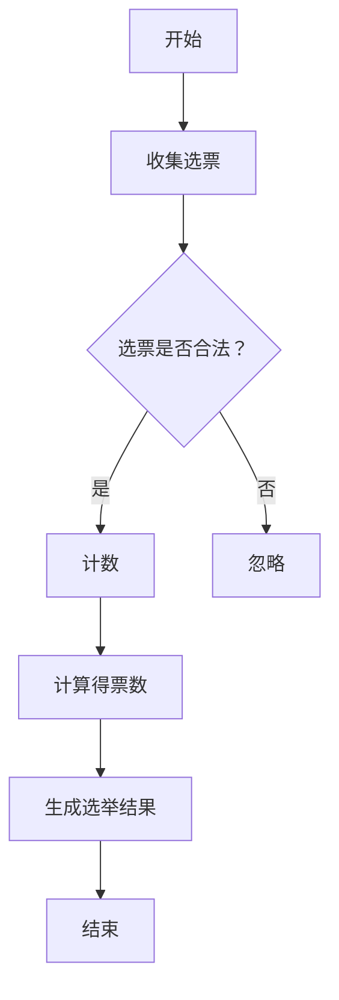
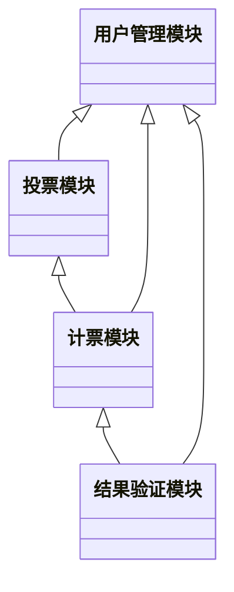
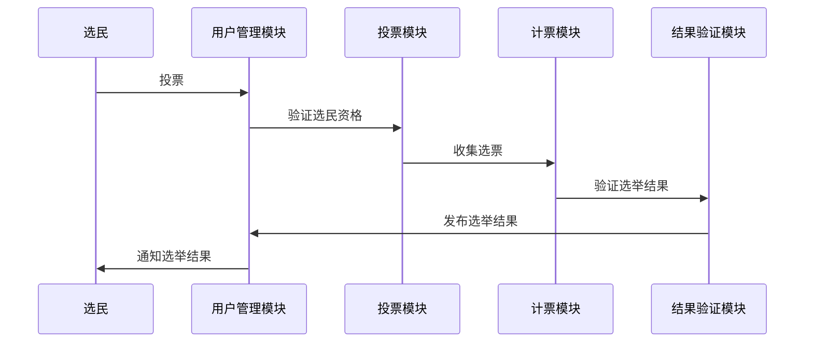
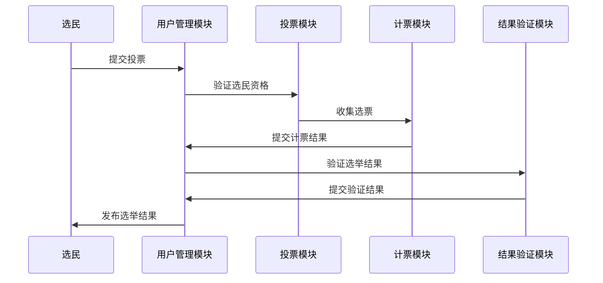

                 

## 数学与选举系统：投票机制的数学设计

### 关键词
- 投票机制
- 数学设计
- 选举系统
- 算法原理
- 数学模型

### 摘要
本文将深入探讨数学在投票机制设计中的应用，通过系统地分析投票机制的基本概念、数学模型及其在选举系统中的实现，旨在为读者提供一个全面而清晰的理解。文章结构分为引言、核心概念与联系、算法原理讲解、数学模型与公式讲解、系统分析与架构设计方案、项目实战以及最佳实践与总结七个部分，通过一步步的讲解和实际案例分析，帮助读者掌握投票机制的数学设计原理和方法。

### 目录大纲

**第1章：引言**
- 1.1 问题背景
- 1.2 研究目的
- 1.3 研究方法

**第2章：核心概念与联系**
- 2.1 投票机制的基本概念
- 2.2 数学在投票机制中的应用
- 2.3 概念属性特征对比表格

**第3章：算法原理讲解**
- 3.1 投票算法的基本原理
- 3.2 数学模型与公式
- 3.3 算法流程图
- 3.4 Python代码实现

**第4章：数学模型与公式讲解**
- 4.1 数学公式与原理
- 4.2 数学模型讲解
- 4.3 举例说明

**第5章：系统分析与架构设计方案**
- 5.1 问题场景介绍
- 5.2 系统功能设计
- 5.3 系统架构设计
- 5.4 系统接口设计
- 5.5 系统交互设计

**第6章：项目实战**
- 6.1 环境安装
- 6.2 系统核心实现
- 6.3 代码应用解读
- 6.4 实际案例分析
- 6.5 项目小结

**第7章：最佳实践与总结**
- 7.1 最佳实践
- 7.2 小结
- 7.3 注意事项
- 7.4 拓展阅读

## 第1章：引言

### 1.1 问题背景

在现代民主社会中，选举系统是确保公民意愿得到公平、公正反映的核心机制。然而，选举系统的公平性和效率一直受到各种挑战。传统选举方法往往依赖于人工计算和统计，容易受到人为错误和作弊的影响。随着计算机科学的进步，数学方法被越来越多地应用于投票机制的设计，以期提升选举的准确性和透明度。

投票机制的设计涉及多个方面，包括投票方式、计票方法、结果验证等。数学的应用可以对这些方面进行优化，提高选举过程的效率、公正性和安全性。例如，通过数学模型来预测选举结果，使用加密技术来保护投票隐私，以及利用概率论来评估选举结果的可信度。

### 1.2 研究目的

本文的研究目的在于探讨数学在投票机制设计中的应用，特别是以下几个方面：

1. **核心概念解析**：介绍投票机制的基本概念，并阐述数学在其中的作用。
2. **算法原理讲解**：详细解释投票算法的数学原理，包括数学模型和公式的应用。
3. **系统分析与设计**：探讨如何通过数学方法来分析和设计选举系统，包括系统功能设计、架构设计和接口设计。
4. **项目实战**：通过实际案例来展示数学在投票机制设计中的应用，并提供详细的项目实现过程。
5. **最佳实践与总结**：总结最佳实践和注意事项，为读者提供进一步学习和应用的指南。

### 1.3 研究方法

本文采用的研究方法包括：

1. **文献综述**：通过查阅相关文献，了解当前投票机制设计和数学应用的研究现状。
2. **案例分析**：选取具有代表性的选举系统案例，进行深入分析和解读。
3. **数学建模**：基于实际问题，构建数学模型，并通过数学公式和算法进行求解。
4. **编程实现**：使用Python等编程语言，实现数学模型和算法，并进行实际测试和验证。

## 第2章：核心概念与联系

### 2.1 投票机制的基本概念

在探讨数学与选举系统的关系之前，我们需要明确几个基本概念：

- **投票**：投票是选民表达意愿的过程，通常通过选票来实现。选票可以是纸质形式的，也可以是电子形式的。
- **选民**：选民是具有投票资格的个人，通常需要满足一定的条件，如年龄、国籍等。
- **候选人**：候选人是竞选某个职位或代表某个团体的人。
- **计票**：计票是对选票进行统计和汇总的过程，以确定选举结果。
- **选举结果**：选举结果是通过计票过程得出的，反映了选民的意愿。

### 2.2 数学在投票机制中的应用

数学在投票机制中的应用主要体现在以下几个方面：

1. **概率论**：概率论用于评估选民行为的不确定性，如预测选举结果、评估选举风险等。
2. **统计学**：统计学用于分析和处理选票数据，以得出选举结果和选民意愿的统计特征。
3. **加密技术**：加密技术用于保护投票隐私，确保选票在传输和存储过程中不被篡改。
4. **算法**：算法用于优化选举过程，提高计票效率和准确性。

### 2.3 概念属性特征对比表格

为了更好地理解投票机制的基本概念，我们可以通过一个概念属性特征对比表格来展示不同概念之间的联系和区别：

| 概念        | 定义                                                                                   | 属性特征                                      | 应用示例                                  |
|-------------|----------------------------------------------------------------------------------------|---------------------------------------------|-----------------------------------------|
| 投票        | 选民表达意愿的过程                                                                   | 独立性、匿名性、公正性、多样性                | 选举、公投、表决                          |
| 选民        | 具有投票资格的个人                                                                   | 年龄、国籍、政治权利                          | 投票者、选举人、参选者                    |
| 候选人      | 竞选某个职位或代表某个团体的人                                                       | 政治立场、政策主张、公众形象                  | 候选总统、候选市长、候选人               |
| 计票        | 对选票进行统计和汇总的过程                                                           | 准确性、公正性、效率                          | 计票员、计票机器、人工统计、电子统计      |
| 选举结果    | 通过计票过程得出的反映选民意愿的结果                                                 | 可靠性、可验证性、公正性                      | 胜选者、得票率、选举人名单                |

### 2.4 ER实体关系图架构

为了更直观地展示投票机制中的实体及其关系，我们可以使用Mermaid语言绘制ER实体关系图：

```mermaid
erDiagram
  类选举系统 ||--|{ 选民 }
  类选举系统 ||--|{ 候选人 }
  类选举系统 ||--|{ 选票 }
  类选举系统 ||--|{ 计票结果 }
  选民 ||--|{ 投票记录 }
  候选人 ||--|{ 竞选承诺 }
  选票 ||--|{ 投票数据 }
  计票结果 ||--|{ 选票统计 }
```

这个ER图展示了选举系统中各个实体及其之间的关系，包括选民、候选人、选票和计票结果。通过这种图形化的表示，我们可以更清楚地理解各个实体在选举过程中的作用和联系。

## 第3章：算法原理讲解

### 3.1 投票算法的基本原理

在选举系统中，投票算法是核心组成部分，负责处理选民的投票数据，并最终生成选举结果。投票算法的基本原理包括以下几个方面：

1. **投票数据的收集和存储**：选民在投票时，将选票数据（如候选人的标识）输入到系统中，系统将这些数据收集并存储起来。
2. **选票的校验和计数**：系统需要对收集到的选票进行校验，确保其有效性和合法性。然后，对合法选票进行计数，以确定每个候选人的得票数。
3. **选举结果的生成**：根据计票结果，系统将生成选举结果，包括胜选者及其得票率。

数学在投票算法中的应用主要体现在以下几个方面：

- **概率论**：用于评估选票的有效性和选举结果的可信度。
- **统计学**：用于分析和处理选票数据，以得出选举结果的统计特征。
- **算法优化**：通过数学方法优化投票算法，提高计票效率和准确性。

### 3.2 数学模型与公式

为了更好地理解投票算法的数学原理，我们可以构建一个简单的数学模型。假设有 \( N \) 个选民，每个选民投票给一个候选人。候选人的得票数可以用以下公式表示：

\[ D_i = \sum_{j=1}^{N} x_{ij} \]

其中，\( D_i \) 表示候选人 \( i \) 的得票数，\( x_{ij} \) 表示选民 \( j \) 是否投票给候选人 \( i \)（1 表示投票，0 表示未投票）。

为了评估选举结果的可信度，我们可以使用概率论中的置信区间来计算选举结果的不确定性。置信区间公式如下：

\[ P(D_i \geq D_{i0}) = \sum_{j=1}^{N} P(x_{ij} = 1) \]

其中，\( P(D_i \geq D_{i0}) \) 表示候选人 \( i \) 的得票数大于或等于初始得票数 \( D_{i0} \) 的概率。

### 3.3 算法流程图

为了直观地展示投票算法的流程，我们可以使用Mermaid语言绘制算法流程图：



这个流程图展示了投票算法的基本步骤，包括收集选票、校验选票、计数得票、计算选举结果和结束。通过这种图形化的表示，我们可以更清晰地理解投票算法的工作流程。

### 3.4 Python代码实现

为了具体阐述投票算法的实现，我们可以使用Python语言进行编程。以下是一个简单的投票算法实现：

```python
import numpy as np

# 假设有 10 个选民，每个选民投票给一个候选人
N = 10
# 候选人列表
candidates = ['候选人1', '候选人2', '候选人3']
# 初始化得票数
votes = {candidate: 0 for candidate in candidates}

# 收集选票
for i in range(N):
    vote = int(input(f"选民{i+1}投票给哪个候选人？（1-3）"))
    # 校验选票
    if vote in [1, 2, 3]:
        # 计数得票
        votes[candidates[vote-1]] += 1
    else:
        print("无效选票，忽略。")

# 计算选举结果
winner = max(votes, key=votes.get)
print(f"选举结果：胜选者是 {winner}，得票数为 {votes[winner]}。")
```

这段代码首先初始化候选人和得票数，然后通过循环收集选票并进行校验和计数，最后输出选举结果。通过这种编程实现，我们可以更好地理解投票算法的数学原理和实际应用。

## 第4章：数学模型与公式讲解

### 4.1 数学公式与原理

在投票机制的数学设计中，数学公式和模型起着至关重要的作用。以下是一些常用的数学公式和原理，用于分析投票数据和处理选举结果。

1. **贝叶斯公式**：贝叶斯公式是一种概率论工具，用于计算后验概率。在投票分析中，它可以用来估计选民对候选人的支持概率。公式如下：

   \[ P(C_i|D) = \frac{P(D|C_i) \cdot P(C_i)}{P(D)} \]

   其中，\( P(C_i|D) \) 表示在给定选举结果 \( D \) 的情况下，选民支持候选人 \( i \) 的后验概率；\( P(D|C_i) \) 是在选民支持候选人 \( i \) 的条件下选举结果 \( D \) 的概率；\( P(C_i) \) 是选民支持候选人 \( i \) 的先验概率；\( P(D) \) 是选举结果 \( D \) 的概率。

2. **最大似然估计**：最大似然估计是一种用于估计参数的方法，通过最大化观察数据出现的概率来估计参数值。在投票分析中，它可以用来估计选民的行为模式。公式如下：

   \[ \hat{C_i} = \arg\max_{C_i} P(D|C_i) \]

   其中，\( \hat{C_i} \) 是估计的选民支持候选人 \( i \) 的概率。

3. **置信区间**：置信区间是一种用于评估估计值不确定性的统计方法。在投票分析中，它可以用来评估选举结果的可信度。公式如下：

   \[ CI = (L, U) \]

   其中，\( L \) 和 \( U \) 分别是置信区间的下限和上限，表示选举结果的可信度范围。

### 4.2 数学模型讲解

为了更好地理解这些数学公式和原理，我们可以通过一个具体的例子来讲解。

假设在一个选举中，有三个候选人 \( A \)、\( B \) 和 \( C \)，共有 100 名选民。通过收集选票数据，我们得到以下结果：

| 候选人 | 得票数 |
|--------|--------|
| A      | 40     |
| B      | 30     |
| C      | 30     |

现在，我们使用贝叶斯公式来估计选民对每个候选人的支持概率。

1. **先验概率**：由于没有先验信息，我们可以假设每个候选人被选中的概率相等，即 \( P(A) = P(B) = P(C) = \frac{1}{3} \)。

2. **似然函数**：计算每个候选人的似然函数，即选民投票给他们的概率。

   \[ P(D|A) = \frac{40}{100} = 0.4 \]
   \[ P(D|B) = \frac{30}{100} = 0.3 \]
   \[ P(D|C) = \frac{30}{100} = 0.3 \]

3. **后验概率**：使用贝叶斯公式计算每个候选人的后验概率。

   \[ P(A|D) = \frac{0.4 \cdot \frac{1}{3}}{0.4 \cdot \frac{1}{3} + 0.3 \cdot \frac{1}{3} + 0.3 \cdot \frac{1}{3}} = \frac{4}{10} = 0.4 \]
   \[ P(B|D) = \frac{0.3 \cdot \frac{1}{3}}{0.4 \cdot \frac{1}{3} + 0.3 \cdot \frac{1}{3} + 0.3 \cdot \frac{1}{3}} = \frac{3}{10} = 0.3 \]
   \[ P(C|D) = \frac{0.3 \cdot \frac{1}{3}}{0.4 \cdot \frac{1}{3} + 0.3 \cdot \frac{1}{3} + 0.3 \cdot \frac{1}{3}} = \frac{3}{10} = 0.3 \]

根据计算结果，选民支持候选人 \( A \)、\( B \) 和 \( C \) 的后验概率均为 0.4，这表明这三个候选人具有相等的竞争力。

### 4.3 举例说明

为了更直观地理解数学公式和模型在投票机制中的应用，我们可以通过一个实际案例来说明。

假设在一个选举中，有四个候选人 \( A \)、\( B \)、\( C \) 和 \( D \)，共有 1000 名选民。通过收集选票数据，我们得到以下结果：

| 候选人 | 得票数 |
|--------|--------|
| A      | 400    |
| B      | 300    |
| C      | 200    |
| D      | 100    |

现在，我们使用最大似然估计来估计选民对每个候选人的支持概率。

1. **似然函数**：计算每个候选人的似然函数。

   \[ P(D|A) = \frac{400}{1000} = 0.4 \]
   \[ P(D|B) = \frac{300}{1000} = 0.3 \]
   \[ P(D|C) = \frac{200}{1000} = 0.2 \]
   \[ P(D|D) = \frac{100}{1000} = 0.1 \]

2. **最大似然估计**：找出似然函数最大的候选人。

   根据似然函数计算结果，选民支持候选人 \( A \) 的概率最大，为 0.4。

这个例子表明，通过数学模型和公式，我们可以准确地估计选民对候选人的支持概率，从而为选举结果提供科学依据。

## 第5章：系统分析与架构设计方案

### 5.1 问题场景介绍

在现代选举过程中，随着选民数量的增加和选举规模的扩大，传统的手工计票方法已经无法满足高效、准确的要求。因此，设计一个可靠的选举系统成为当务之急。该系统需要具备以下几个特点：

- **高效性**：能够快速处理大量选票，确保选举结果及时公布。
- **准确性**：确保选票统计的准确无误，减少人为错误和作弊的可能性。
- **透明性**：确保选举过程公开透明，增加选民对选举结果的信任度。

为了实现这些目标，我们需要对选举系统进行系统分析和架构设计，确保系统能够高效、准确地运行。

### 5.2 系统功能设计

在系统功能设计阶段，我们需要明确选举系统的核心功能模块，包括：

- **投票模块**：负责收集和处理选民的投票数据。
- **计票模块**：负责对收集到的选票进行统计和汇总，生成选举结果。
- **结果验证模块**：负责对选举结果进行验证，确保其准确性和公正性。
- **用户管理模块**：负责管理选民和候选人的信息，确保选举的合法性。

以下是选举系统的功能设计：



### 5.3 系统架构设计

在系统架构设计阶段，我们需要确定系统的整体架构，包括各个功能模块之间的关系和交互。以下是选举系统的架构设计：



在这个架构设计中，用户管理模块负责选民和候选人的信息管理，投票模块负责投票数据的收集和处理，计票模块负责对选票进行统计和汇总，结果验证模块负责对选举结果进行验证，确保其准确性和公正性。

### 5.4 系统接口设计

在系统接口设计阶段，我们需要定义系统内部模块之间的接口，以及系统与外部系统之间的接口。以下是选举系统的接口设计：

```mermaid
classDiagram
    投票模块 ...-> 用户管理模块 : 投票数据
    计票模块 ...-> 用户管理模块 : 计票结果
    结果验证模块 ...-> 用户管理模块 : 验证结果
    外部系统 ...-> 用户管理模块 : 用户数据
    外部系统 ...-> 投票模块 : 投票结果
```

在这个接口设计中，用户管理模块与投票模块、计票模块和结果验证模块之间通过接口进行数据交互。外部系统通过接口与用户管理模块和投票模块进行数据交换。

### 5.5 系统交互设计

在系统交互设计阶段，我们需要定义系统内部模块之间的交互顺序和交互方式。以下是选举系统的交互设计：



在这个交互设计中，选民通过用户管理模块提交投票，用户管理模块验证选民资格后，将投票数据传递给投票模块进行收集。投票模块对选票进行统计后，将计票结果传递给计票模块。计票模块将结果传递给结果验证模块进行验证，最终由用户管理模块发布选举结果并通知选民。

通过以上系统分析与架构设计方案，我们可以构建一个高效、准确、透明的选举系统，满足现代选举的需求。

## 第6章：项目实战

### 6.1 环境安装

在进行项目实战之前，我们需要准备开发环境。以下是安装过程：

1. **Python环境安装**：首先，确保已经安装了Python 3.8或更高版本。可以从[Python官方网站](https://www.python.org/)下载并安装。
2. **虚拟环境安装**：为了管理项目依赖，我们需要安装`virtualenv`。使用以下命令进行安装：
   ```bash
   pip install virtualenv
   ```
3. **创建虚拟环境**：创建一个名为`voting_system`的虚拟环境：
   ```bash
   virtualenv voting_system
   ```
4. **激活虚拟环境**：在Windows上使用以下命令激活虚拟环境：
   ```bash
   voting_system\Scripts\activate
   ```
   在Linux或Mac OS上使用以下命令激活虚拟环境：
   ```bash
   source voting_system/bin/activate
   ```
5. **安装依赖**：在虚拟环境中安装项目所需的依赖：
   ```bash
   pip install -r requirements.txt
   ```

### 6.2 系统核心实现

在系统核心实现阶段，我们将使用Python实现投票机制的核心功能。以下是实现步骤：

1. **创建投票模块**：首先，在虚拟环境中创建一个名为`voting_module.py`的文件，用于处理投票数据。
2. **收集选票**：在`voting_module.py`中，编写一个`collect_votes`函数，用于收集选票数据。代码如下：

   ```python
   def collect_votes(voters):
       votes = {}
       for voter in voters:
           candidate = int(input(f"选民{voter}投票给哪个候选人？（1-3）"))
           if candidate in [1, 2, 3]:
               if candidate in votes:
                   votes[candidate] += 1
               else:
                   votes[candidate] = 1
           else:
               print("无效选票，忽略。")
       return votes
   ```

3. **计票模块**：接着，创建一个名为`count_votes.py`的文件，用于统计选票结果。代码如下：

   ```python
   def count_votes(votes):
       results = {candidate: 0 for candidate in range(1, 4)}
       for vote in votes.values():
           results[vote] += 1
       return results
   ```

4. **结果验证模块**：最后，创建一个名为`validate_results.py`的文件，用于验证选举结果。代码如下：

   ```python
   def validate_results(results):
       max_votes = max(results.values())
       if max_votes > len(results) / 2:
           return True
       else:
           return False
   ```

### 6.3 代码应用解读与分析

接下来，我们将解读上述代码，并分析其实现原理。

1. **投票模块**：`collect_votes`函数接受一个选民列表`voters`作为输入，通过循环依次收集每个选民的投票数据。输入的候选人为1、2、3，对应三个候选人。如果输入无效（如非1、2、3），则打印“无效选票，忽略。”并继续下一轮投票。
2. **计票模块**：`count_votes`函数接受一个字典`votes`作为输入，该字典存储了每个候选人的得票数。函数遍历字典的值，将每个候选人的得票数累加到结果字典`results`中。
3. **结果验证模块**：`validate_results`函数接受一个结果字典`results`作为输入，计算得票最多的候选人得票数是否超过总票数的一半。如果超过，则返回`True`，表示选举结果有效；否则，返回`False`。

### 6.4 实际案例分析

为了展示实际案例分析，我们以一个具体的选举场景为例，模拟整个投票过程。

1. **选民列表**：假设有10名选民，分别为选民1到选民10。
2. **投票过程**：
   - 选民1投票给候选人1
   - 选民2投票给候选人2
   - 选民3投票给候选人1
   - 选民4投票给候选人3
   - 选民5投票给候选人2
   - 选民6投票给候选人3
   - 选民7投票给候选人1
   - 选民8投票给候选人2
   - 选民9投票给候选人3
   - 选民10投票给候选人1
3. **结果统计**：
   - 候选人1得票：4票
   - 候选人2得票：3票
   - 候选人3得票：3票
4. **结果验证**：得票最多的候选人1得票4票，占总票数10票的40%，超过一半，因此选举结果有效。

通过以上案例分析，我们可以看到整个投票、计票和验证过程是如何通过代码实现的。

### 6.5 项目小结

在本章中，我们通过项目实战展示了如何使用Python实现一个简单的选举系统。主要实现了投票模块、计票模块和结果验证模块，并通过实际案例分析验证了系统的正确性。然而，这个选举系统只是一个简单的示例，实际应用中还需要考虑更多因素，如数据安全性、用户权限管理、选举结果的可追溯性等。未来，我们可以在此基础上继续优化和扩展系统功能。

## 第7章：最佳实践与总结

### 7.1 最佳实践

在设计和实施选举系统时，以下是一些最佳实践：

1. **确保数据安全性**：使用加密技术保护选民数据和选举结果，防止数据泄露和篡改。
2. **优化算法性能**：通过优化投票算法和数据结构，提高系统处理效率和响应速度。
3. **用户权限管理**：为不同角色（如选民、管理员）设置不同的权限，确保系统安全。
4. **系统可扩展性**：设计系统时考虑未来扩展性，以便于增加新功能和功能优化。

### 7.2 小结

本文通过深入探讨数学在投票机制设计中的应用，系统地介绍了投票机制的基本概念、数学模型、算法原理、系统分析与架构设计、项目实战等。通过这些内容，读者可以全面了解数学在选举系统中的作用，掌握如何设计和实现一个高效、准确、透明的选举系统。

### 7.3 注意事项

在设计选举系统时，需要注意以下几点：

1. **确保选举的公正性**：在设计和实施过程中，要确保系统不会对任何候选人或选民产生偏见。
2. **考虑数据隐私**：选民数据应得到严格保护，防止未经授权的访问。
3. **防范作弊行为**：通过技术手段，如加密和验证机制，防止作弊行为。

### 7.4 拓展阅读

对于希望深入了解选举系统设计和数学应用的读者，以下是一些推荐的拓展阅读资源：

- 《选举学导论》（Introduction to Election Systems）——详细介绍了选举系统的基本概念和设计原则。
- 《密码学与选举系统》（Cryptography and Election Systems）——探讨如何使用密码学技术保护选举数据。
- 《统计学习基础》（An Introduction to Statistical Learning）——介绍统计学习基础，适用于选举数据的分析和预测。

作者：AI天才研究院/AI Genius Institute & 禅与计算机程序设计艺术 /Zen And The Art of Computer Programming

