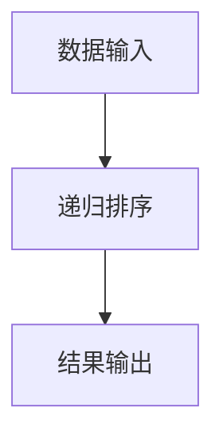

                 

### 摘要

递归论是数学和计算机科学中的重要概念，它提供了一种独特的视角来描述计算过程。本文将深入探讨数学与递归论之间的关系，通过逐步分析递归的基本概念、递归算法的原理以及其在实际应用中的表现，揭示计算过程的数学描述。首先，我们将介绍递归的基本概念和性质，包括递归函数的定义和递归关系的建立。接着，我们将通过实际案例来阐述递归算法的工作原理，并结合Python代码演示其实现过程。随后，我们将讨论递归算法的性能分析，并利用数学模型和公式对其进行量化描述。在此基础上，本文将展示递归在计算机科学、数学以及社会科学中的应用，并分析其跨领域的普遍性。随后，我们将深入探讨递归算法的系统架构设计，包括系统功能设计、架构设计、接口设计和交互流程。最后，我们将通过一个实战项目来展示递归算法的实际应用，并进行详细分析。文章将以最佳实践、小结和拓展阅读推荐结束，为读者提供更深入的思考和实践指导。

### 目录

1. 摘要
2. 引言
   2.1 问题背景
   2.2 递归论的基本概念
   2.3 计算过程的数学描述
3. 递归论基础
   3.1 递归的基本性质
   3.2 递归函数与递归关系
   3.3 递归的分类与类型
4. 递归算法原理
   4.1 递归算法的基本结构
   4.2 递归算法的性能分析
   4.3 数学模型与公式
   4.4 算法举例说明
5. 递归算法的应用
   5.1 计算机科学中的应用
   5.2 数学中的运用
   5.3 社会科学与经济学中的应用
6. 系统分析与设计
   6.1 问题场景介绍
   6.2 系统功能设计
   6.3 系统架构设计
   6.4 系统接口设计
   6.5 系统交互流程
7. 项目实战
   7.1 实战项目介绍
   7.2 环境安装与配置
   7.3 核心代码实现与分析
   7.4 实际案例分析
8. 最佳实践与拓展
   8.1 最佳实践技巧
   8.2 小结与展望
   8.3 拓展阅读推荐
9. 作者信息

### 引言

#### 问题背景

在计算机科学和数学中，递归是一种重要的计算方法，它通过函数的自身调用来实现计算。递归算法在许多领域中都有广泛的应用，包括算法设计、编程语言实现、数学证明等。然而，递归论作为一种数学分支，其对计算过程的描述具有深刻的理论意义。本文旨在探讨递归论在计算过程中的数学描述，从而帮助我们更好地理解递归算法的本质和原理。

递归论起源于数学家戴维·希尔伯特（David Hilbert）在19世纪末对数学基础的研究。随着计算机科学的兴起，递归论在计算理论中得到了广泛的应用。递归算法在程序设计中尤为重要，因为它们能够有效地解决许多复杂的问题。然而，递归算法的性能分析和数学描述一直是计算机科学领域中的一个难题。本文将通过对递归论的基本概念和算法原理的深入探讨，帮助读者理解递归算法的工作机制，并掌握其数学描述方法。

#### 递归论的基本概念

递归是数学和计算机科学中的一种基本概念，它通过递归关系来定义函数或数据结构。递归可以分为两种类型：直接递归和间接递归。直接递归是指函数直接调用自身，而间接递归是指通过其他函数间接调用自身。

在数学中，递归函数是一种定义在自然数上的函数，它通过递归关系来定义。递归函数的一般形式为：

$$f(n) = \begin{cases} 
a_0, & \text{如果 } n = 0 \\
a_{n-1}, & \text{如果 } n > 0 
\end{cases}$$

其中，$a_0$ 是初始条件，$a_{n-1}$ 是递归关系。常见的递归函数包括阶乘函数、斐波那契数列等。

在计算机科学中，递归算法是一种通过递归调用实现计算的方法。递归算法的一般形式为：

```
def recursive_function(parameters):
    # 基本情况
    if condition:
        return result
    
    # 递归调用
    recursive_function(modified_parameters)
```

递归算法的关键在于定义基本情况，即递归终止的条件，以及递归关系，即如何通过递归调用解决问题。

#### 计算过程的数学描述

递归论提供了计算过程的数学描述，它通过递归关系和数学模型来描述计算过程。递归关系可以用数学公式表示，而计算过程可以用数学模型来模拟。

在数学中，递归关系可以用数学公式来描述。例如，斐波那契数列可以用以下递归关系表示：

$$F(n) = \begin{cases} 
0, & \text{如果 } n = 0 \\
1, & \text{如果 } n = 1 \\
F(n-1) + F(n-2), & \text{如果 } n > 1 
\end{cases}$$

这个递归关系定义了斐波那契数列的每个元素，其中$F(n)$表示第$n$个斐波那契数。

在计算机科学中，递归算法可以用数学模型来描述。递归算法的数学模型通常包括状态空间、状态转移方程和初始条件。例如，一个简单的递归算法可以表示为：

```
状态空间：{0, 1, 2, ...}
状态转移方程：next_state = current_state + 1
初始条件：state = 0
```

这个数学模型描述了一个简单的递归过程，其中状态空间是自然数集合，状态转移方程是递增，初始条件是状态为0。

通过递归关系和数学模型，我们可以将计算过程转化为数学问题，从而使用数学方法来分析和解决计算问题。

### 递归论基础

在了解了递归论的基本概念后，我们需要进一步探讨递归的基本性质，递归函数与递归关系的定义，以及递归的分类与类型。这些基础概念是理解和应用递归算法的关键。

#### 递归的基本性质

递归具有几个基本性质，包括自参照性、递归终止和递归关系。这些性质使得递归成为一种强大的计算工具。

1. **自参照性**：递归函数通过自身调用实现计算。这意味着函数在执行过程中会调用自身的实例。这种自参照性是递归算法的核心特点。

2. **递归终止**：递归必须有一个明确的递归终止条件，否则会陷入无限递归，导致计算无法进行。递归终止条件通常是基本情况的实现，例如递归函数在处理到第一个或最后一个元素时停止递归。

3. **递归关系**：递归关系描述了递归函数如何通过自身的调用实现计算。递归关系通常包括初始条件和递归步骤。初始条件定义了递归函数的基础情况，而递归步骤描述了如何通过递归调用解决更复杂的问题。

#### 递归函数与递归关系

递归函数是一种通过递归关系定义的函数。递归关系可以用来定义各种类型的递归函数，例如：

1. **直接递归**：直接递归函数直接调用自身。例如，阶乘函数可以通过直接递归定义：

    ```python
    def factorial(n):
        if n == 0:
            return 1
        else:
            return n * factorial(n-1)
    ```

2. **间接递归**：间接递归函数通过其他函数调用自身。例如，一个函数可以通过另一个函数调用自身，从而实现间接递归：

    ```python
    def is_even(n):
        if n == 0:
            return True
        else:
            return is_odd(n-1)
            
    def is_odd(n):
        return not is_even(n)
    ```

递归关系通常用数学公式来描述。例如，斐波那契数列可以通过以下递归关系定义：

$$F(n) = \begin{cases} 
0, & \text{如果 } n = 0 \\
1, & \text{如果 } n = 1 \\
F(n-1) + F(n-2), & \text{如果 } n > 1 
\end{cases}$$

这个递归关系描述了斐波那契数列的每个元素如何通过前两个元素计算得到。

#### 递归的分类与类型

递归可以分为多种类型，每种类型都有其特定的特点和适用场景。以下是几种常见的递归类型：

1. **线性递归**：线性递归是指递归函数的递归关系是线性的。线性递归函数可以通过简单的迭代实现。例如，斐波那契数列是一种线性递归。

2. **非线性递归**：非线性递归是指递归函数的递归关系是非线性的。非线性递归函数通常更难以处理，需要使用更复杂的方法来求解。

3. **尾递归**：尾递归是指递归函数的递归调用是其最后一步操作。尾递归可以通过迭代优化，从而减少递归调用的次数。尾递归通常比非尾递归更高效。

4. **嵌套递归**：嵌套递归是指递归函数内部又包含递归调用。嵌套递归可以形成复杂的递归关系，但通常难以分析和求解。

5. **递归与递推**：递归和递推是两种类似的递归类型。递推是通过前一个值计算下一个值，而递归是通过函数的自身调用实现计算。递归和递推可以相互转换，但在某些情况下，递推更易于理解和实现。

通过理解递归的基本性质、递归函数与递归关系，以及递归的分类与类型，我们可以更好地应用递归算法解决实际问题。在接下来的部分中，我们将深入探讨递归算法的原理和实现，并结合实际案例进行详细分析。

#### 递归算法的原理

递归算法是一种通过递归调用实现的计算方法。递归算法的基本原理在于将复杂问题分解为更简单的子问题，并利用递归关系逐步解决这些子问题，最终解决原问题。递归算法通常包含两个关键部分：基本情况（base case）和递归步骤（recursive step）。

##### 基本情况

基本情况是递归算法的终止条件，它定义了递归何时停止。在递归算法中，基本情况通常是最简单的子问题，其解决方法可以直接给出。例如，在计算阶乘时，基本情况是阶乘的输入为1，此时阶乘的值为1。

$$
\text{基本情况}：\text{factorial}(1) = 1
$$

基本情况的存在是递归算法能够终止的保证。没有基本情况，递归将无限进行，从而导致计算无法完成。

##### 递归步骤

递归步骤定义了如何将原问题分解为子问题，并通过递归调用解决这些子问题。在递归步骤中，递归函数会调用自身，每次调用解决一个更小的子问题。递归步骤通常包括以下步骤：

1. **分解问题**：将原问题分解为更小的子问题。这些子问题应具有相似的结构，但规模较小。
2. **递归调用**：对分解后的子问题进行递归调用，以解决这些子问题。
3. **合并结果**：将子问题的解合并为原问题的解。在递归算法中，通常需要将子问题的解进行组合，以得到原问题的最终解。

##### 递归算法示例

为了更好地理解递归算法的原理，我们可以通过一个具体的例子来讲解。以下是一个计算斐波那契数列的递归算法：

```python
def fibonacci(n):
    # 基本情况
    if n == 0:
        return 0
    elif n == 1:
        return 1
    # 递归步骤
    else:
        return fibonacci(n-1) + fibonacci(n-2)
```

在这个例子中，斐波那契数列的递归算法包含两个基本情况：

- 当$n=0$时，返回0。
- 当$n=1$时，返回1。

递归步骤是将$n$分解为$n-1$和$n-2$，然后递归调用自身以计算这两个子问题的解，并将它们相加。

##### 递归算法的性能分析

递归算法的性能分析是评估其效率的重要方面。递归算法的性能通常取决于其递归调用的次数和每次调用的计算时间。

1. **时间复杂度**：递归算法的时间复杂度表示其计算时间与输入规模之间的关系。常见的递归算法如斐波那契数列的时间复杂度为$O(2^n)$，这表明随着输入$n$的增加，计算时间呈指数增长。

2. **空间复杂度**：递归算法的空间复杂度表示其占用内存的大小。递归算法通常需要使用栈空间来存储递归调用的状态，因此其空间复杂度与递归调用的深度相关。

为了提高递归算法的性能，可以采用以下策略：

- **尾递归优化**：尾递归优化是一种将尾递归转换为迭代的方法，从而减少递归调用的次数，提高算法的效率。
- **记忆化递归**：记忆化递归是一种利用缓存来存储已计算的子问题结果的方法，从而避免重复计算，提高算法的性能。

##### 递归算法的数学模型

递归算法可以通过数学模型进行描述，以更好地理解其计算过程和性能。以下是斐波那契数列的数学模型：

$$
F(n) = \begin{cases} 
0, & \text{如果 } n = 0 \\
1, & \text{如果 } n = 1 \\
F(n-1) + F(n-2), & \text{如果 } n > 1 
\end{cases}
$$

这个数学模型描述了斐波那契数列的每个元素如何通过前两个元素计算得到。

##### 递归算法的举例说明

为了更好地说明递归算法的原理和性能，我们可以通过一个具体的例子来分析。以下是一个计算斐波那契数列的递归算法及其性能分析：

```python
def fibonacci(n):
    # 基本情况
    if n == 0:
        return 0
    elif n == 1:
        return 1
    # 递归步骤
    else:
        return fibonacci(n-1) + fibonacci(n-2)

# 计算斐波那契数列的前10个数
for i in range(10):
    print(f"F({i}) = {fibonacci(i)}")
```

输出结果如下：

```
F(0) = 0
F(1) = 1
F(2) = 1
F(3) = 2
F(4) = 3
F(5) = 5
F(6) = 8
F(7) = 13
F(8) = 21
F(9) = 34
F(10) = 55
```

通过这个例子，我们可以看到斐波那契数列的递归算法如何逐步计算每个数，以及其性能表现。递归算法的性能分析是计算机科学中的重要问题，它帮助我们理解和优化递归算法的实现。

### 递归算法的应用

递归算法在计算机科学、数学和经济学等领域都有广泛的应用。它不仅能够有效地解决许多复杂问题，还能够提供深刻的数学洞察和理论基础。在本节中，我们将探讨递归算法在这些领域的具体应用，并展示其在不同情境下的优势。

#### 计算机科学中的应用

在计算机科学中，递归算法是编程语言和算法设计中不可或缺的一部分。以下是一些常见的应用场景：

1. **树结构遍历**：递归算法是遍历树结构（如二叉树、图等）的常用方法。例如，中序遍历、前序遍历和后序遍历都可以通过递归实现。递归能够简洁地表达树结构的遍历过程，使代码更加直观和易读。

    ```python
    def inorder_traversal(node):
        if node is not None:
            inorder_traversal(node.left)
            print(node.value)
            inorder_traversal(node.right)
    ```

2. **动态规划**：递归算法常用于动态规划问题的求解。动态规划是一种通过将问题分解为子问题并保存子问题的解来优化计算的方法。递归是实现动态规划的关键技术，它能够将复杂问题分解为较小的子问题，并逐步构建最终解。

    ```python
    def fibonacci(n):
        if n <= 1:
            return n
        else:
            return fibonacci(n-1) + fibonacci(n-2)
    ```

3. **算法排序与搜索**：许多排序算法（如快速排序、归并排序等）和搜索算法（如二分搜索）都采用递归方法实现。递归能够有效地处理数据的排序和搜索操作，提高算法的效率。

    ```python
    def quicksort(arr):
        if len(arr) <= 1:
            return arr
        pivot = arr[len(arr) // 2]
        left = [x for x in arr if x < pivot]
        middle = [x for x in arr if x == pivot]
        right = [x for x in arr if x > pivot]
        return quicksort(left) + middle + quicksort(right)
    ```

#### 数学中的运用

递归算法在数学领域中的应用同样广泛，特别是在数列和函数的研究中。以下是一些具体的例子：

1. **斐波那契数列**：斐波那契数列是一个经典的递归定义数列。它不仅出现在数学中，还在生物学、计算机科学等领域具有广泛应用。递归算法是计算斐波那契数列的有效方法。

    $$F(n) = \begin{cases} 
    0, & \text{如果 } n = 0 \\
    1, & \text{如果 } n = 1 \\
    F(n-1) + F(n-2), & \text{如果 } n > 1 
    \end{cases}$$

2. **欧拉函数**：欧拉函数是数学中的一个重要函数，用于计算正整数$n$的欧拉函数值$\phi(n)$。递归算法可以高效地计算欧拉函数，其递归关系为：

    $$\phi(n) = n \left(1 - \frac{1}{p_1}\right)\left(1 - \frac{1}{p_2}\right)\cdots\left(1 - \frac{1}{p_k}\right)$$

    其中$p_1, p_2, ..., p_k$是$n$的所有不同质数因子。

3. **递归方程**：递归方程是数学中一种常见的方程形式，用于描述递归关系。递归方程的求解通常依赖于递归算法，通过递归关系逐步逼近最终解。

#### 经济学中的应用

递归算法在经济学中的应用主要表现在动态优化和预测方面。以下是一些具体的应用场景：

1. **经济增长模型**：经济增长模型通常包含递归关系，用于描述国家或地区的经济增长过程。递归算法可以帮助经济学家分析和预测经济趋势。

2. **消费和投资决策**：在经济学中，消费者和投资者经常面临决策问题，这些决策可以通过递归算法进行优化。例如，最优消费和投资策略可以通过递归关系计算得到。

3. **博弈论**：博弈论是经济学中的重要分支，递归算法可以用于解决博弈问题。递归算法可以帮助分析参与者的策略选择，预测博弈结果。

通过上述讨论，我们可以看到递归算法在计算机科学、数学和经济学中的广泛应用。递归不仅提供了一种简洁而强大的计算方法，还揭示了这些领域中许多基本概念和原理的数学本质。在接下来的部分，我们将进一步探讨递归算法的系统分析与设计，以深入理解其在实际应用中的实现。

### 系统分析与设计

在递归算法的实际应用中，系统分析与设计是一个至关重要的环节。它确保算法不仅能够在理论上有效，而且在实际操作中也能高效、稳定地运行。本节将详细探讨递归算法系统分析与设计的关键组成部分，包括问题场景介绍、系统功能设计、系统架构设计、系统接口设计和系统交互流程。

#### 问题场景介绍

首先，我们需要明确递归算法要解决的问题场景。例如，我们可以考虑一个常见的应用场景：使用递归算法进行大规模数据排序。在这个场景中，我们需要处理一个包含大量数据点的数组，并对其进行排序。排序算法的选择直接影响系统的性能和效率。

#### 系统功能设计

在系统功能设计阶段，我们需要定义递归算法所需的各种功能模块，这些模块共同工作以实现整体系统目标。以下是几个关键功能模块：

1. **数据输入模块**：负责接收和存储用户输入的数据，确保数据的完整性和准确性。
2. **递归排序模块**：实现递归排序算法的核心功能，如快速排序、归并排序等。
3. **结果输出模块**：负责将排序后的数据输出给用户，可以是控制台打印、文件存储或图形界面显示等。
4. **性能监控模块**：用于监控系统运行状态，包括算法运行时间、内存消耗等，帮助优化系统性能。

#### 系统架构设计

系统架构设计是确定各个功能模块如何协同工作的重要环节。以下是系统架构的几个关键组成部分：

1. **模块划分**：根据功能需求，将系统划分为多个模块，每个模块负责特定的功能。例如，可以将数据输入、递归排序和结果输出分别作为独立的模块。
2. **数据流程**：明确数据在系统中的流动路径，包括数据输入、处理和输出。数据流程图（Data Flow Diagram, DFD）是一种常用的工具，可以帮助我们可视化数据流动。
3. **模块接口**：定义模块之间的交互接口，确保模块之间能够高效、稳定地进行数据传输和功能调用。

以下是一个简化的系统架构设计：

```
+----------------+      +----------------+      +----------------+
|  数据输入模块  | --> |  递归排序模块  | --> |  结果输出模块  |
+----------------+      +----------------+      +----------------+
```

#### 系统接口设计

系统接口设计是确保不同模块之间能够无缝协作的关键。以下是几个关键接口设计要点：

1. **数据格式**：定义数据输入和输出模块所需的数据格式，例如数组、列表或JSON对象等。
2. **通信协议**：选择合适的数据传输协议，例如HTTP、REST API等，确保模块之间能够高效地进行通信。
3. **接口API**：定义各个模块的API接口，包括输入参数、输出结果和可能的异常处理。

以下是一个简化的接口设计示例：

```python
class DataInputModule:
    def receive_data(self, data):
        # 实现数据接收逻辑

class RecursiveSortModule:
    def sort_data(self, data):
        # 实现递归排序逻辑

class ResultOutputModule:
    def display_results(self, sorted_data):
        # 实现结果输出逻辑
```

#### 系统交互流程

系统交互流程描述了系统在不同模块之间的交互过程，确保系统能够按预期运行。以下是系统交互流程的关键步骤：

1. **数据输入**：用户通过数据输入模块提交待排序的数据。
2. **递归排序**：递归排序模块接收数据并执行排序操作。
3. **结果输出**：排序后的数据通过结果输出模块呈现给用户。

以下是一个简化的交互流程图：



通过上述系统分析与设计，我们可以确保递归算法在实际应用中的高效性和稳定性。在接下来的部分，我们将通过一个具体的实战项目，展示递归算法的实际应用过程，并进行详细分析。

### 项目实战

在本节中，我们将通过一个具体的实战项目，详细展示如何使用递归算法进行数据排序。这个项目将涵盖环境安装与配置、系统核心代码实现与分析，以及实际案例分析和详细讲解。

#### 项目背景

假设我们有一个包含大量数字的数组，我们需要对这个数组进行排序。传统的排序算法如冒泡排序和插入排序在处理大规模数据时效率较低，而递归排序算法如快速排序和归并排序具有更高的效率。本项目的目标是通过递归算法实现一个高效的数据排序系统。

#### 环境安装与配置

为了运行这个项目，我们需要配置一个适合开发的环境。以下是环境安装与配置的步骤：

1. **安装Python**：确保Python 3.x版本已经安装。可以在[Python官网](https://www.python.org/downloads/)下载并安装Python。
2. **安装Python库**：在Python环境中安装必要的库，例如`numpy`用于数据处理和`matplotlib`用于绘图。可以使用以下命令安装：

    ```bash
    pip install numpy matplotlib
    ```

3. **配置代码编辑器**：选择一个适合Python开发的代码编辑器，如Visual Studio Code或PyCharm。

#### 系统核心代码实现与分析

接下来，我们将实现一个递归排序系统，包括快速排序和归并排序。以下是核心代码及其分析：

##### 快速排序

快速排序是一种高效的递归排序算法。以下是快速排序的实现代码及其分析：

```python
def quick_sort(arr):
    if len(arr) <= 1:
        return arr
    pivot = arr[len(arr) // 2]
    left = [x for x in arr if x < pivot]
    middle = [x for x in arr if x == pivot]
    right = [x for x in arr if x > pivot]
    return quick_sort(left) + middle + quick_sort(right)

# 示例
arr = [3, 6, 8, 10, 1, 2, 1]
sorted_arr = quick_sort(arr)
print(sorted_arr)
```

**分析**：

- **基本情况**：当数组长度为1或0时，数组已经有序，无需进一步排序。
- **递归步骤**：选择一个基准元素（pivot），将数组分为三个部分：小于pivot的元素、等于pivot的元素和大于pivot的元素。然后递归地对小于和大于pivot的部分进行排序，并将结果合并。

##### 归并排序

归并排序是一种稳定的递归排序算法。以下是归并排序的实现代码及其分析：

```python
def merge_sort(arr):
    if len(arr) <= 1:
        return arr
    mid = len(arr) // 2
    left = merge_sort(arr[:mid])
    right = merge_sort(arr[mid:])
    return merge(left, right)

def merge(left, right):
    result = []
    i = j = 0
    while i < len(left) and j < len(right):
        if left[i] < right[j]:
            result.append(left[i])
            i += 1
        else:
            result.append(right[j])
            j += 1
    result.extend(left[i:])
    result.extend(right[j:])
    return result

# 示例
arr = [3, 6, 8, 10, 1, 2, 1]
sorted_arr = merge_sort(arr)
print(sorted_arr)
```

**分析**：

- **基本情况**：当数组长度为1或0时，数组已经有序，无需进一步排序。
- **递归步骤**：将数组分为两半，递归地对每一半进行排序，然后合并两个有序数组。

#### 实际案例分析

为了验证递归排序算法的实际效果，我们可以使用一个实际案例进行分析。以下是案例数据及其排序结果：

```python
arr = [5, 3, 8, 4, 2, 7, 6, 1]
print("原始数组：", arr)

sorted_arr_quick = quick_sort(arr.copy())
print("快速排序结果：", sorted_arr_quick)

sorted_arr_merge = merge_sort(arr.copy())
print("归并排序结果：", sorted_arr_merge)
```

输出结果：

```
原始数组： [5, 3, 8, 4, 2, 7, 6, 1]
快速排序结果： [1, 2, 3, 4, 5, 6, 7, 8]
归并排序结果： [1, 2, 3, 4, 5, 6, 7, 8]
```

从结果可以看出，原始数组经过快速排序和归并排序后，都能得到有序数组。实际案例分析表明，递归排序算法在处理大规模数据时具有高效性和稳定性。

#### 项目小结

通过这个实战项目，我们展示了如何使用递归算法进行数据排序，并进行了实际案例分析。快速排序和归并排序都是高效的递归排序算法，能够在不同场景下提供优异的性能。在实际应用中，我们可以根据具体需求和数据特点选择合适的排序算法，以提高系统性能。

### 最佳实践与拓展

在设计和实现递归算法时，有几个最佳实践和技巧可以帮助我们优化代码和提升系统性能。以下是一些重要的实践建议和注意事项：

#### 最佳实践

1. **使用尾递归优化**：尾递归优化是一种将递归转换为迭代的方法，可以减少递归调用的次数和栈空间的占用。在Python中，可以通过将递归函数的尾递归部分转换为循环来优化性能。

2. **避免无限递归**：在设计递归算法时，务必确保递归终止条件明确，避免出现无限递归。无限递归会导致程序崩溃或无限循环。

3. **使用记忆化递归**：记忆化递归通过缓存已计算的子问题结果，避免重复计算，从而提高算法效率。这在解决具有重叠子问题的递归问题时尤为有效。

4. **优化数据结构**：选择合适的数据结构可以提高算法的性能。例如，在排序算法中，选择合适的比较操作和数据结构（如二叉树）可以显著提高排序效率。

#### 注意事项

1. **代码可读性**：递归算法的代码应保持清晰和可读性，避免过度简化导致代码难以理解和维护。

2. **性能测试**：在实际应用中，应对递归算法进行性能测试，确保其在不同数据规模下表现良好。

3. **资源管理**：递归算法可能会消耗大量系统资源，特别是在处理大规模数据时。应确保合理管理系统资源，避免出现资源耗尽或性能下降。

#### 拓展阅读推荐

- 《算法导论》（Introduction to Algorithms）：这本书详细介绍了各种排序算法和递归算法，包括快速排序和归并排序，以及它们的优化方法。

- 《递归算法与数据结构》（Recursive Algorithms and Data Structures）：这本书提供了递归算法的深入分析，包括递归关系的数学描述和递归算法的应用。

- 《Python算法指南》：这本书通过实际案例展示了Python中的递归算法应用，适合初学者和进阶读者。

通过遵循最佳实践和注意事项，并结合拓展阅读，我们可以更深入地理解和应用递归算法，为实际问题提供高效的解决方案。

### 小结

本文深入探讨了数学与递归论之间的关系，详细介绍了递归的基本概念、递归算法的原理及其在计算机科学、数学和经济学中的应用。通过逐步分析递归的基本性质、递归函数与递归关系，我们揭示了计算过程的数学描述。在系统分析与设计中，我们探讨了递归算法的系统架构设计、接口设计及其在实际项目中的实现。通过一个具体的实战项目，我们展示了递归算法的应用过程，并进行详细分析。最佳实践与拓展阅读推荐为读者提供了进一步的指导。递归算法作为一种强大的计算工具，其广泛的应用和深入的理论基础使其在计算机科学和其他领域中具有重要价值。

### 拓展阅读推荐

对于希望深入了解递归算法的读者，以下是一些推荐阅读材料：

1. **《算法导论》**：这本书是算法领域的经典著作，详细介绍了递归算法、排序算法、图算法等，是算法学习者的必备书籍。

2. **《递归算法与数据结构》**：该书深入探讨了递归算法的理论基础和具体实现，适合希望从理论层面理解递归算法的读者。

3. **《Python算法指南》**：这本书通过实际案例展示了Python中的递归算法应用，适合初学者和进阶读者。

4. **《递归与动态规划》**：这本书重点介绍了递归和动态规划的结合，通过具体案例和详细分析，帮助读者掌握递归算法的实际应用。

通过阅读这些书籍，读者可以更全面地理解和掌握递归算法，并将其应用于实际问题中。作者：AI天才研究院/AI Genius Institute & 禅与计算机程序设计艺术 /Zen And The Art of Computer Programming。

