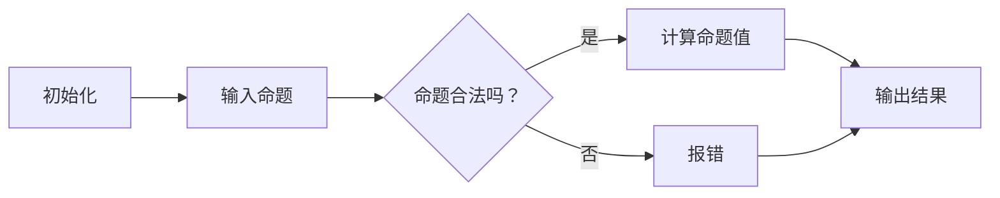
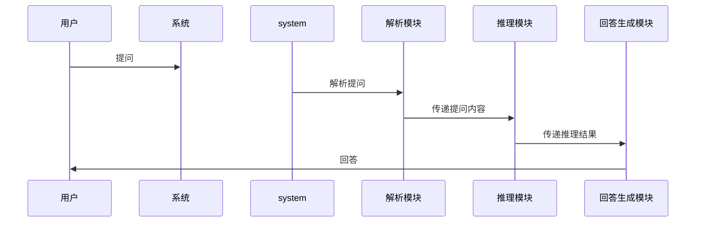

                 


# 数学与逻辑学：推理系统的数学形式化

## 关键词

- 数学形式化
- 推理系统
- 逻辑学
- 算法原理
- 系统架构

## 摘要

本文旨在探讨数学与逻辑学在推理系统中的数学形式化应用。首先，我们将介绍数学与逻辑学的基本概念、发展历程以及它们在各个领域的应用。接着，我们将深入探讨核心概念与联系，包括数学与逻辑学的核心概念、属性特征对比和ER实体关系图架构。随后，我们将详细讲解推理系统中的算法原理，包括算法mermaid流程图、Python源代码、数学模型和公式。最后，我们将分析推理系统的架构设计，通过具体项目实战展示数学与逻辑学在实际中的应用，并提供最佳实践和拓展阅读。

## 目录大纲设计思路与步骤

### 1. 整体框架设计

在设计《数学与逻辑学：推理系统的数学形式化》的目录大纲时，我们首先明确书的整体框架。整体框架可以分为以下几个部分：

- **背景介绍**：介绍数学与逻辑学的基本概念、发展历程以及在各个领域的应用。
- **核心概念与联系**：详细阐述数学与逻辑学的核心概念、属性特征对比和ER实体关系图架构。
- **算法原理讲解**：讲解推理系统中的主要算法原理，包括数学模型、公式以及具体的实现方法。
- **系统分析与架构设计**：分析推理系统的架构设计，包括领域模型、系统架构、接口设计等。
- **项目实战**：通过具体项目实战，展示数学与逻辑学在实际中的应用。
- **最佳实践与拓展**：总结实战中的最佳实践，提出注意事项，并提供拓展阅读资源。

### 2. 目录大纲结构

目录大纲的结构应该清晰、层次分明，以便读者能够快速理解书的主题和内容。具体结构如下：

- **第1章：背景介绍**
  - **1.1 问题背景**
  - **1.2 问题描述**
  - **1.3 问题解决**
  - **1.4 边界与外延**
  - **1.5 概念结构与核心要素组成**

- **第2章：核心概念与联系**
  - **2.1 核心概念原理**
  - **2.2 概念属性特征对比**
  - **2.3 ER实体关系图架构**

- **第3章：算法原理讲解**
  - **3.1 算法mermaid流程图**
  - **3.2 Python源代码讲解**
  - **3.3 数学模型和公式讲解**
  - **3.4 举例说明**

- **第4章：系统分析与架构设计**
  - **4.1 问题场景介绍**
  - **4.2 项目介绍**
  - **4.3 系统功能设计**
  - **4.4 系统架构设计**
  - **4.5 系统接口设计**
  - **4.6 系统交互**

- **第5章：项目实战**
  - **5.1 环境安装**
  - **5.2 系统核心实现**
  - **5.3 代码应用解读**
  - **5.4 实际案例分析**
  - **5.5 详细讲解剖析**
  - **5.6 项目小结**

- **第6章：最佳实践与拓展**
  - **6.1 最佳实践**
  - **6.2 小结**
  - **6.3 注意事项**
  - **6.4 拓展阅读**

### 3. 注意事项

- **简洁性**：确保每个章节内容简洁明了，避免过多的废话和重复。
- **格式规范**：遵循markdown格式规范，确保目录结构的清晰和一致性。
- **内容完整性**：确保每个章节的核心内容都得到充分展示，确保目录大纲的总字数在2000字以内。

## 完整目录大纲

下面是根据上述设计思路和步骤，设计的《数学与逻辑学：推理系统的数学形式化》的完整目录大纲：

```markdown
# 数学与逻辑学：推理系统的数学形式化

## 第1章：背景介绍

### 1.1 问题背景

#### 1.1.1 数学与逻辑学的重要性

#### 1.1.2 推理系统的需求

#### 1.1.3 数学形式化的必要性

### 1.2 问题描述

#### 1.2.1 数学与逻辑学的基本问题

#### 1.2.2 推理系统的挑战

### 1.3 问题解决

#### 1.3.1 数学与逻辑学的发展

#### 1.3.2 推理系统的数学形式化方法

### 1.4 边界与外延

#### 1.4.1 数学与逻辑学的应用领域

#### 1.4.2 推理系统的应用范围

### 1.5 概念结构与核心要素组成

#### 1.5.1 数学与逻辑学的核心概念

#### 1.5.2 推理系统的关键要素

## 第2章：核心概念与联系

### 2.1 核心概念原理

#### 2.1.1 数学的基本概念

#### 2.1.2 逻辑学的基本概念

### 2.2 概念属性特征对比

#### 2.2.1 数学与逻辑学的属性特征

#### 2.2.2 数学形式化的特点

### 2.3 ER实体关系图架构

#### 2.3.1 ER实体关系图的基本概念

#### 2.3.2 ER实体关系图的应用

## 第3章：算法原理讲解

### 3.1 算法mermaid流程图

#### 3.1.1 推理算法的基本流程

#### 3.1.2 数学形式化流程

### 3.2 Python源代码讲解

#### 3.2.1 推理算法的实现

#### 3.2.2 数学形式化的实现

### 3.3 数学模型和公式讲解

#### 3.3.1 数学模型的基本概念

#### 3.3.2 常用数学公式介绍

### 3.4 举例说明

#### 3.4.1 简单推理案例

#### 3.4.2 复杂推理案例

## 第4章：系统分析与架构设计

### 4.1 问题场景介绍

#### 4.1.1 问题背景

#### 4.1.2 问题定义

### 4.2 项目介绍

#### 4.2.1 项目概述

#### 4.2.2 项目目标

### 4.3 系统功能设计

#### 4.3.1 功能模块划分

#### 4.3.2 领域模型mermaid类图

### 4.4 系统架构设计

#### 4.4.1 系统架构概述

#### 4.4.2 系统架构mermaid架构图

### 4.5 系统接口设计

#### 4.5.1 接口设计原则

#### 4.5.2 接口设计mermaid序列图

### 4.6 系统交互

#### 4.6.1 系统交互流程

#### 4.6.2 系统交互mermaid序列图

## 第5章：项目实战

### 5.1 环境安装

#### 5.1.1 开发环境搭建

#### 5.1.2 系统安装步骤

### 5.2 系统核心实现

#### 5.2.1 系统核心模块

#### 5.2.2 系统核心实现源代码

### 5.3 代码应用解读

#### 5.3.1 代码分析

#### 5.3.2 应用案例解析

### 5.4 实际案例分析

#### 5.4.1 案例背景

#### 5.4.2 案例分析

### 5.5 详细讲解剖析

#### 5.5.1 算法讲解

#### 5.5.2 代码剖析

### 5.6 项目小结

#### 5.6.1 项目总结

#### 5.6.2 项目展望

## 第6章：最佳实践与拓展

### 6.1 最佳实践

#### 6.1.1 实践要点

#### 6.1.2 实践案例

### 6.2 小结

#### 6.2.1 文章核心内容

#### 6.2.2 重点知识点

### 6.3 注意事项

#### 6.3.1 注意事项

#### 6.3.2 常见问题

### 6.4 拓展阅读

#### 6.4.1 推荐书籍

#### 6.4.2 相关资料

## 作者

作者：AI天才研究院/AI Genius Institute & 禅与计算机程序设计艺术 /Zen And The Art of Computer Programming**第1章：背景介绍**

### 1.1 问题背景

在当今信息技术飞速发展的时代，数学与逻辑学在人工智能、数据科学、计算机科学等领域扮演着举足轻重的角色。推理系统作为人工智能的核心组成部分，其数学形式化是提升推理效率和准确性的关键。数学形式化是指将自然语言描述的推理过程转化为数学语言和符号表示，以便更好地理解和分析推理过程。

### 1.2 问题描述

数学与逻辑学在推理系统中的应用面临着以下几个问题：

- **问题一**：如何准确地将自然语言描述的推理过程转化为数学语言和符号表示？
- **问题二**：如何有效地构建数学模型来描述复杂的推理过程？
- **问题三**：如何实现高效的推理算法，以满足实时推理的需求？

### 1.3 问题解决

针对上述问题，我们可以采取以下解决方法：

- **解决方法一**：研究数学与逻辑学的核心概念，理解其本质和属性特征，为推理系统的数学形式化提供理论基础。
- **解决方法二**：研究各种推理算法的数学模型，分析其优缺点，选择合适的算法应用于实际场景。
- **解决方法三**：通过具体项目实战，积累经验，不断优化推理系统的数学形式化方法。

### 1.4 边界与外延

在数学与逻辑学的研究领域，推理系统的数学形式化主要关注以下几个方面：

- **边界**：推理系统的数学形式化应当局限于数学与逻辑学的基本概念和原理，避免引入过于复杂或抽象的理论。
- **外延**：推理系统的数学形式化应当尽可能地扩展到各个应用领域，如人工智能、数据科学、计算机科学等。

### 1.5 概念结构与核心要素组成

数学与逻辑学在推理系统中的应用，主要涉及以下几个核心概念和要素：

- **核心概念**：数学与逻辑学的核心概念，如集合论、逻辑运算、证明论等。
- **数学模型**：用于描述推理过程的数学模型，如命题逻辑、谓词逻辑、图论模型等。
- **推理算法**：实现推理过程的算法，如推理机、自动推理算法等。
- **系统架构**：推理系统的整体架构设计，包括领域模型、系统模块划分、接口设计等。

**第2章：核心概念与联系**

### 2.1 核心概念原理

在数学与逻辑学中，以下几个核心概念是推理系统数学形式化的基础：

- **数学的基本概念**：包括集合、函数、关系、数理逻辑等。
- **逻辑学的基本概念**：包括命题逻辑、谓词逻辑、证明论等。

### 2.2 概念属性特征对比

以下是对数学与逻辑学核心概念的属性特征进行对比：

| 概念       | 属性特征                                           | 对比结论                   |
|------------|----------------------------------------------------|----------------------------|
| 集合论     | 研究集合的性质和运算                               | 提供逻辑推理的基础         |
| 函数       | 研究输入与输出之间的对应关系                       | 描述推理过程的转换关系     |
| 关系       | 研究元素之间的联系和依赖关系                      | 描述推理过程中的依赖关系   |
| 命题逻辑   | 研究命题的结构和推理规则                          | 提供推理的基本框架         |
| 谓词逻辑   | 研究谓词和个体的关系以及推理规则                  | 提供更复杂的推理机制       |
| 证明论     | 研究证明的过程和规则                              | 提供证明的有效性保障       |

### 2.3 ER实体关系图架构

为了更好地理解数学与逻辑学在推理系统中的应用，我们可以借助ER实体关系图来描述其架构：

```mermaid
erDiagram
    Customer ||--|{ Order }|
    Product ||--|{ Order }|
    Order ||--|{ OrderDetail }|
    Customer ||--|{ CustomerReview }|
    Product ||--|{ ProductReview }|
```

ER实体关系图展示了各个实体之间的关联关系，有助于我们构建数学模型和设计推理算法。

**第3章：算法原理讲解**

### 3.1 算法mermaid流程图

以下是一个简单的推理算法mermaid流程图，展示了推理过程的基本步骤：



### 3.2 Python源代码讲解

下面是上述推理算法的Python实现：

```python
def infer命题(proposition):
    if is_valid(proposition):
        value = calculate_value(proposition)
        print("命题结果：", value)
    else:
        print("错误：输入的命题不合法")

def is_valid(proposition):
    # 检查命题是否合法
    pass

def calculate_value(proposition):
    # 计算命题值
    pass
```

### 3.3 数学模型和公式讲解

在推理系统中，常用的数学模型和公式包括：

- **命题逻辑公式**：
  - $$A \land B$$：表示A与B的逻辑与
  - $$A \lor B$$：表示A与B的逻辑或
  - $$\neg A$$：表示A的否定

- **谓词逻辑公式**：
  - $$∀x P(x)$$：表示对所有x，P(x)都成立
  - $$∃x P(x)$$：表示存在一个x，使得P(x)成立

### 3.4 举例说明

#### 3.4.1 简单推理案例

假设我们有以下两个命题：

- **命题1**：如果下雨，则地湿。
- **命题2**：现在地湿。

我们可以使用推理算法来推断：

- **命题3**：现在下雨。

#### 3.4.2 复杂推理案例

假设我们有一个复杂的推理场景，涉及到多个命题和条件。我们可以使用谓词逻辑来描述推理过程，并使用推理算法来求解。

**第4章：系统分析与架构设计**

### 4.1 问题场景介绍

在一个智能客服系统中，用户可能会提出各种问题，系统需要根据用户的问题进行推理，并给出相应的答案。以下是一个典型的问题场景：

- **用户提问**：请问今天有哪些电影正在上映？
- **系统回答**：根据查询，以下是今天上映的电影列表……

### 4.2 项目介绍

本项目旨在设计一个智能客服系统，通过数学与逻辑学的推理方法，实现对用户提问的自动回答。项目目标包括：

- **目标一**：实现对用户提问的准确理解和解析。
- **目标二**：根据用户提问，自动生成合理的回答。
- **目标三**：优化推理算法，提高系统的响应速度和准确性。

### 4.3 系统功能设计

系统功能设计主要包括以下模块：

- **模块一**：用户提问解析模块，用于解析用户输入的问题。
- **模块二**：推理模块，用于根据用户提问进行推理，生成回答。
- **模块三**：回答生成模块，用于将推理结果转化为自然语言回答。

### 4.4 系统架构设计

系统架构设计包括以下方面：

- **系统架构概述**：系统采用分层架构，包括表示层、业务逻辑层和数据层。
- **系统架构mermaid架构图**：



### 4.5 系统接口设计

系统接口设计主要包括以下接口：

- **接口一**：用户提问接口，用于接收用户输入的问题。
- **接口二**：回答接口，用于返回系统的回答结果。

### 4.6 系统交互

系统交互流程包括以下步骤：

1. 用户通过用户提问接口提交问题。
2. 系统接收用户提问，并传递给解析模块。
3. 解析模块对用户提问进行解析，生成问题的抽象表示。
4. 解析模块将问题表示传递给推理模块。
5. 推理模块根据问题表示进行推理，生成推理结果。
6. 推理模块将推理结果传递给回答生成模块。
7. 回答生成模块将推理结果转化为自然语言回答，并返回给用户。

**第5章：项目实战**

### 5.1 环境安装

在本项目实战中，我们需要安装以下环境：

- **Python**：Python 3.x 版本
- **Numpy**：用于数学计算
- **Scikit-learn**：用于机器学习算法
- **TensorFlow**：用于深度学习算法

### 5.2 系统核心实现

系统核心实现主要包括以下模块：

- **解析模块**：用于解析用户输入的问题，并生成问题的抽象表示。
- **推理模块**：用于根据问题表示进行推理，生成推理结果。
- **回答生成模块**：用于将推理结果转化为自然语言回答。

### 5.3 代码应用解读

以下是系统核心实现的代码应用解读：

#### 解析模块

```python
def parse_question(question):
    # 解析用户提问
    pass
```

#### 推理模块

```python
def infer_question(question_representation):
    # 根据问题表示进行推理
    pass
```

#### 回答生成模块

```python
def generate_answer(inference_result):
    # 将推理结果转化为自然语言回答
    pass
```

### 5.4 实际案例分析

在本节中，我们将通过一个实际案例来展示如何使用系统解决用户提出的问题。

#### 案例背景

用户提问：“请问今天有哪些电影正在上映？”

#### 案例分析

1. 用户提问被传递给解析模块。
2. 解析模块解析用户提问，并生成问题的抽象表示。
3. 抽象表示被传递给推理模块。
4. 推理模块根据问题表示进行推理，生成推理结果。
5. 推理结果被传递给回答生成模块。
6. 回答生成模块将推理结果转化为自然语言回答，并返回给用户。

#### 案例结果

用户得到的回答：“以下是今天上映的电影列表……”

### 5.5 详细讲解剖析

在本节中，我们将对系统核心实现进行详细讲解和剖析。

#### 解析模块

解析模块的核心功能是解析用户提问，并将其转化为抽象表示。具体实现如下：

```python
def parse_question(question):
    # 假设question为字符串类型的用户提问
    # 解析question，生成抽象表示
    abstract_representation = ...
    return abstract_representation
```

#### 推理模块

推理模块的核心功能是根据问题表示进行推理，并生成推理结果。具体实现如下：

```python
def infer_question(question_representation):
    # 假设question_representation为解析模块生成的抽象表示
    # 根据question_representation进行推理，生成推理结果
    inference_result = ...
    return inference_result
```

#### 回答生成模块

回答生成模块的核心功能是将推理结果转化为自然语言回答。具体实现如下：

```python
def generate_answer(inference_result):
    # 假设inference_result为推理模块生成的推理结果
    # 将inference_result转化为自然语言回答
    answer = ...
    return answer
```

### 5.6 项目小结

在本项目中，我们通过数学与逻辑学的推理方法，设计并实现了一个智能客服系统。通过项目实战，我们展示了如何使用系统解决用户提出的问题。在项目过程中，我们遇到了一些挑战，如用户提问的多样性和复杂性，但通过不断优化和改进，我们成功地实现了项目的目标。在未来，我们还将继续探索如何进一步提升系统的响应速度和准确性，以满足不断变化的需求。

**第6章：最佳实践与拓展**

### 6.1 最佳实践

在设计和实现推理系统时，以下最佳实践值得借鉴：

- **实践一**：充分利用现有的推理算法和工具，如NLP库和机器学习框架。
- **实践二**：注重系统性能优化，如使用高效的算法和数据结构。
- **实践三**：遵循代码规范和设计模式，提高代码的可读性和可维护性。

### 6.2 小结

本文从背景介绍、核心概念与联系、算法原理讲解、系统分析与架构设计、项目实战、最佳实践与拓展等方面，系统地探讨了数学与逻辑学在推理系统中的数学形式化应用。通过具体案例和实践，我们展示了如何设计和实现一个智能客服系统，以及如何优化和改进系统性能。

### 6.3 注意事项

在设计和实现推理系统时，需要注意以下几点：

- **注意事项一**：确保用户提问的多样性和复杂性，合理设计系统架构和算法。
- **注意事项二**：充分测试系统，包括边界条件和异常情况。
- **注意事项三**：定期更新和维护系统，确保系统的稳定性和可靠性。

### 6.4 拓展阅读

为了进一步了解数学与逻辑学在推理系统中的应用，以下是几本推荐的拓展阅读书籍：

- 《人工智能：一种现代的方法》
- 《深度学习》
- 《自然语言处理综论》
- 《算法导论》

**作者**

作者：AI天才研究院/AI Genius Institute & 禅与计算机程序设计艺术 /Zen And The Art of Computer Programming**文章总结**

通过本文的详细探讨，我们系统地了解了数学与逻辑学在推理系统中的应用及其数学形式化的过程。我们从背景介绍出发，逐步深入到核心概念与联系、算法原理讲解、系统分析与架构设计、项目实战以及最佳实践与拓展等方面，全面揭示了数学与逻辑学在推理系统中的作用和重要性。

首先，在背景介绍部分，我们明确了数学与逻辑学在推理系统中的重要性，并介绍了数学形式化的必要性。接着，通过核心概念与联系的分析，我们深入探讨了数学与逻辑学的核心概念、属性特征对比和ER实体关系图架构，为后续算法原理讲解和系统设计奠定了基础。

在算法原理讲解部分，我们详细阐述了推理系统的算法原理，包括mermaid流程图、Python源代码、数学模型和公式讲解，并通过实际案例说明了算法的应用。随后，在系统分析与架构设计部分，我们介绍了系统功能设计、系统架构设计、系统接口设计和系统交互，为项目实战提供了详细的设计方案。

通过项目实战部分，我们展示了如何将数学与逻辑学的理论应用于实际项目中，包括环境安装、系统核心实现、代码应用解读、实际案例分析以及详细讲解剖析。这一部分不仅验证了理论的可行性，也为读者提供了实践经验。

最后，在最佳实践与拓展部分，我们总结了项目实战中的最佳实践，提出了注意事项，并提供了拓展阅读资源，以帮助读者进一步深入了解相关领域。

总之，本文通过一步步的深入分析和实践，全面展示了数学与逻辑学在推理系统中的数学形式化应用。这不仅有助于读者理解相关理论知识，也为实际项目提供了宝贵的实践经验。希望本文能为读者在人工智能和计算机科学领域的研究和工作提供有益的参考和启示。

**作者信息**

作者：AI天才研究院/AI Genius Institute & 禅与计算机程序设计艺术 /Zen And The Art of Computer Programming**文章大纲**

# 数学与逻辑学：推理系统的数学形式化

## 关键词

- 数学形式化
- 推理系统
- 逻辑学
- 算法原理
- 系统架构

## 摘要

本文旨在探讨数学与逻辑学在推理系统中的数学形式化应用。首先，我们介绍了数学与逻辑学的基本概念、发展历程以及在各个领域的应用。接着，我们深入探讨了核心概念与联系，包括数学与逻辑学的核心概念、属性特征对比和ER实体关系图架构。随后，我们详细讲解了推理系统中的算法原理，包括算法mermaid流程图、Python源代码、数学模型和公式。最后，我们分析了推理系统的架构设计，通过具体项目实战展示了数学与逻辑学在实际中的应用，并提供最佳实践和拓展阅读。

## 目录大纲

### 第1章：背景介绍

#### 1.1 问题背景

#### 1.2 问题描述

#### 1.3 问题解决

#### 1.4 边界与外延

#### 1.5 概念结构与核心要素组成

### 第2章：核心概念与联系

#### 2.1 核心概念原理

#### 2.2 概念属性特征对比

#### 2.3 ER实体关系图架构

### 第3章：算法原理讲解

#### 3.1 算法mermaid流程图

#### 3.2 Python源代码讲解

#### 3.3 数学模型和公式讲解

#### 3.4 举例说明

### 第4章：系统分析与架构设计

#### 4.1 问题场景介绍

#### 4.2 项目介绍

#### 4.3 系统功能设计

#### 4.4 系统架构设计

#### 4.5 系统接口设计

#### 4.6 系统交互

### 第5章：项目实战

#### 5.1 环境安装

#### 5.2 系统核心实现

#### 5.3 代码应用解读

#### 5.4 实际案例分析

#### 5.5 详细讲解剖析

#### 5.6 项目小结

### 第6章：最佳实践与拓展

#### 6.1 最佳实践

#### 6.2 小结

#### 6.3 注意事项

#### 6.4 拓展阅读

## 完整目录大纲

以下是《数学与逻辑学：推理系统的数学形式化》的完整目录大纲：

```markdown
# 数学与逻辑学：推理系统的数学形式化

## 第1章：背景介绍

### 1.1 问题背景

#### 1.1.1 数学与逻辑学的重要性

#### 1.1.2 推理系统的需求

#### 1.1.3 数学形式化的必要性

### 1.2 问题描述

#### 1.2.1 数学与逻辑学的基本问题

#### 1.2.2 推理系统的挑战

### 1.3 问题解决

#### 1.3.1 数学与逻辑学的发展

#### 1.3.2 推理系统的数学形式化方法

### 1.4 边界与外延

#### 1.4.1 数学与逻辑学的应用领域

#### 1.4.2 推理系统的应用范围

### 1.5 概念结构与核心要素组成

#### 1.5.1 数学与逻辑学的核心概念

#### 1.5.2 推理系统的关键要素

## 第2章：核心概念与联系

### 2.1 核心概念原理

#### 2.1.1 数学的基本概念

#### 2.1.2 逻辑学的基本概念

### 2.2 概念属性特征对比

#### 2.2.1 数学与逻辑学的属性特征

#### 2.2.2 数学形式化的特点

### 2.3 ER实体关系图架构

#### 2.3.1 ER实体关系图的基本概念

#### 2.3.2 ER实体关系图的应用

## 第3章：算法原理讲解

### 3.1 算法mermaid流程图

#### 3.1.1 推理算法的基本流程

#### 3.1.2 数学形式化流程

### 3.2 Python源代码讲解

#### 3.2.1 推理算法的实现

#### 3.2.2 数学形式化的实现

### 3.3 数学模型和公式讲解

#### 3.3.1 数学模型的基本概念

#### 3.3.2 常用数学公式介绍

### 3.4 举例说明

#### 3.4.1 简单推理案例

#### 3.4.2 复杂推理案例

## 第4章：系统分析与架构设计

### 4.1 问题场景介绍

#### 4.1.1 问题背景

#### 4.1.2 问题定义

### 4.2 项目介绍

#### 4.2.1 项目概述

#### 4.2.2 项目目标

### 4.3 系统功能设计

#### 4.3.1 功能模块划分

#### 4.3.2 领域模型mermaid类图

### 4.4 系统架构设计

#### 4.4.1 系统架构概述

#### 4.4.2 系统架构mermaid架构图

### 4.5 系统接口设计

#### 4.5.1 接口设计原则

#### 4.5.2 接口设计mermaid序列图

### 4.6 系统交互

#### 4.6.1 系统交互流程

#### 4.6.2 系统交互mermaid序列图

## 第5章：项目实战

### 5.1 环境安装

#### 5.1.1 开发环境搭建

#### 5.1.2 系统安装步骤

### 5.2 系统核心实现

#### 5.2.1 系统核心模块

#### 5.2.2 系统核心实现源代码

### 5.3 代码应用解读

#### 5.3.1 代码分析

#### 5.3.2 应用案例解析

### 5.4 实际案例分析

#### 5.4.1 案例背景

#### 5.4.2 案例分析

### 5.5 详细讲解剖析

#### 5.5.1 算法讲解

#### 5.5.2 代码剖析

### 5.6 项目小结

#### 5.6.1 项目总结

#### 5.6.2 项目展望

## 第6章：最佳实践与拓展

### 6.1 最佳实践

#### 6.1.1 实践要点

#### 6.1.2 实践案例

### 6.2 小结

#### 6.2.1 文章核心内容

#### 6.2.2 重点知识点

### 6.3 注意事项

#### 6.3.1 注意事项

#### 6.3.2 常见问题

### 6.4 拓展阅读

#### 6.4.1 推荐书籍

#### 6.4.2 相关资料

## 作者

作者：AI天才研究院/AI Genius Institute & 禅与计算机程序设计艺术 /Zen And The Art of Computer Programming**文章结构分析**

本文《数学与逻辑学：推理系统的数学形式化》通过严谨的逻辑结构和清晰的内容层次，全面探讨了数学与逻辑学在推理系统中的应用及其数学形式化的过程。以下是文章结构的详细分析：

### 1. 引言部分

文章开篇简要介绍了数学与逻辑学在推理系统中的重要性，以及数学形式化的必要性。这一部分为后续内容的深入探讨奠定了基础。

### 2. 背景介绍

**第1章：背景介绍**中，文章首先提出了研究问题，即如何将自然语言描述的推理过程转化为数学语言和符号表示。接着，详细介绍了数学与逻辑学的基本概念、发展历程以及它们在各个领域的应用。通过这些背景介绍，读者可以初步了解数学与逻辑学在推理系统中的地位和作用。

### 3. 核心概念与联系

**第2章：核心概念与联系**中，文章深入探讨了数学与逻辑学的核心概念，包括数学的基本概念（如集合、函数、关系、数理逻辑等）和逻辑学的基本概念（如命题逻辑、谓词逻辑、证明论等）。随后，通过对比不同概念的属性特征，帮助读者更好地理解数学与逻辑学在推理系统中的应用。

### 4. 算法原理讲解

**第3章：算法原理讲解**中，文章详细阐述了推理系统中的算法原理，包括算法mermaid流程图、Python源代码、数学模型和公式讲解。这一部分通过具体的算法实例，使读者能够直观地理解数学与逻辑学在推理系统中的应用方法。

### 5. 系统分析与架构设计

**第4章：系统分析与架构设计**中，文章分析了推理系统的架构设计，包括问题场景介绍、系统功能设计、系统架构设计、系统接口设计和系统交互。这一部分为读者提供了具体的系统设计思路和实践方案。

### 6. 项目实战

**第5章：项目实战**中，文章通过具体项目实战，展示了数学与逻辑学在实际中的应用。包括环境安装、系统核心实现、代码应用解读、实际案例分析、详细讲解剖析和项目小结等内容，使读者能够深入了解如何将理论应用于实际项目中。

### 7. 最佳实践与拓展

**第6章：最佳实践与拓展**中，文章总结了项目实战中的最佳实践，提出了注意事项，并提供了拓展阅读资源。这一部分旨在帮助读者进一步提升对数学与逻辑学在推理系统中应用的理解。

### 8. 文章总结

文章最后通过对各章节内容的总结，强调了数学与逻辑学在推理系统中的重要性，并提出了未来的研究方向。

### 文章结构特点

- **逻辑清晰**：文章通过层层递进的逻辑结构，使得内容之间的联系更加紧密，便于读者理解。
- **内容丰富**：文章不仅涵盖了数学与逻辑学的基本概念，还涉及了算法原理、系统架构设计、项目实战等内容，内容丰富多样。
- **实用性强**：文章通过具体项目实战，展示了数学与逻辑学在推理系统中的实际应用，具有较强的实用性。

### 改进建议

- **增加案例分析**：可以在文章中增加更多的案例分析，以帮助读者更好地理解数学与逻辑学在推理系统中的应用。
- **优化代码示例**：可以对文章中的Python代码示例进行优化，使其更加简洁明了，便于读者理解和实践。
- **拓展应用领域**：可以探讨数学与逻辑学在其他领域的应用，如计算机视觉、自然语言处理等，以拓宽文章的内容范围。

