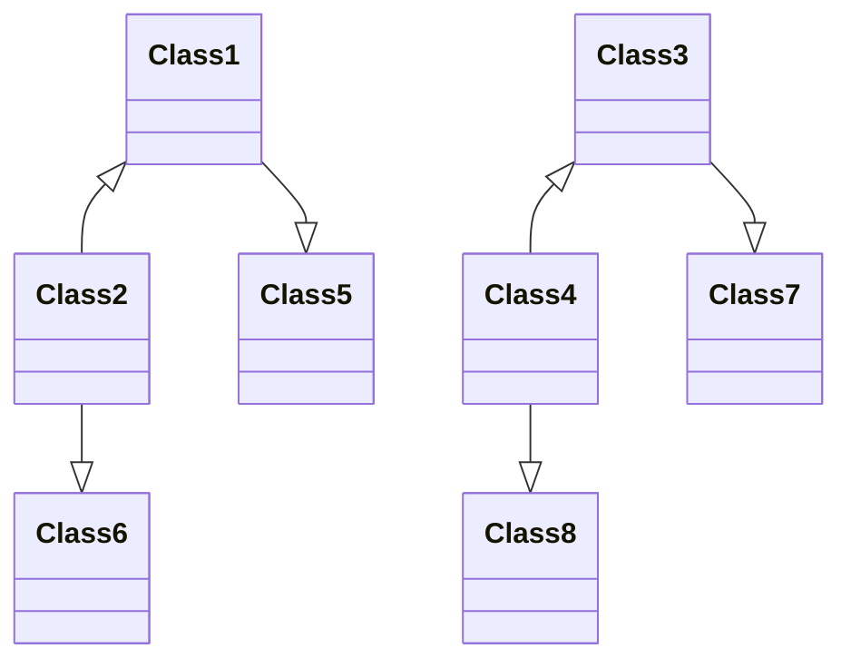
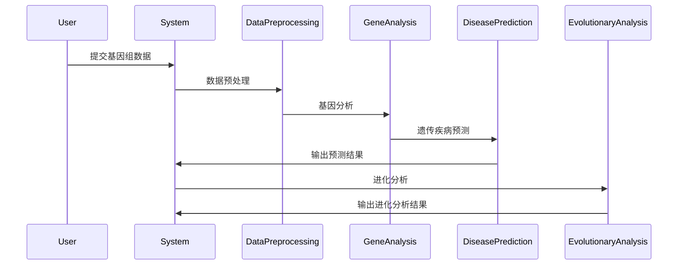
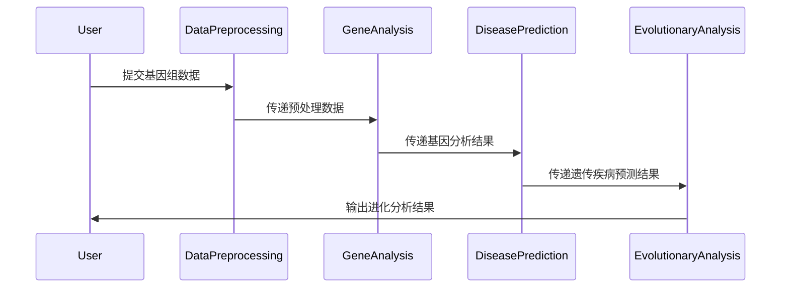

                 

### 数学与遗传学：基因传递的数学模型

---

**关键词**：数学模型、遗传学、基因传递、概率论、进化、算法

**摘要**：
本文深入探讨了数学模型在遗传学中的应用，特别是基因传递过程中的数学建模。通过详细分析核心概念、算法原理、数学模型及其在系统架构中的应用，本文展示了数学工具如何助力遗传学研究，提供了丰富的实战案例，并提出了最佳实践建议。

---

### 第一部分：背景与基础

#### 1.1 问题背景

**1.1.1 遗传学的数学建模需求**

遗传学是研究生物体内基因传递和变异的科学。随着基因组测序技术的发展，遗传学研究的数据量急剧增加，这为数学建模提供了丰富的素材。然而，如何从海量数据中提取有用信息，如何解释复杂的遗传现象，成为了遗传学研究中的重大挑战。数学模型在此过程中发挥着至关重要的作用，能够帮助我们理解和预测基因的传递过程。

**1.1.2 数学在遗传学研究中的作用**

数学在遗传学中的应用极为广泛，涵盖了概率论、统计学、微积分、微分方程等多个领域。通过数学建模，我们可以：

- 描述基因频率和基因型频率的动态变化。
- 分析遗传变异对种群进化的影响。
- 预测遗传疾病的风险。
- 研究进化过程中的适应性和多样性。

**1.1.3 数学与遗传学交叉领域的挑战**

数学与遗传学的交叉领域面临着以下几个挑战：

- 数据复杂性：基因组数据具有高度复杂性和多样性，如何有效处理这些数据成为了一个关键问题。
- 模型准确性：数学模型需要精确反映遗传学现象，但往往难以同时兼顾复杂性和精确性。
- 计算效率：随着模型规模的增大，计算效率成为了一个不容忽视的问题。

#### 1.2 核心概念与联系

**1.2.1 遗传学的基本概念**

遗传学中的核心概念包括基因、DNA、遗传信息等。这些概念是理解基因传递的基础。

**1.2.1.1 基因、DNA与遗传信息**

- **基因**：基因是生物体内负责传递遗传信息的基本单位，包含有遗传指令，指导生物体的生长、发育和行为。
- **DNA**：DNA（脱氧核糖核酸）是基因的化学载体，由四种不同的核苷酸组成，通过特定的序列编码遗传信息。
- **遗传信息**：遗传信息是指DNA序列中的特定序列，它决定了生物体的特征和功能。

**1.2.1.2 遗传变异与进化**

- **遗传变异**：遗传变异是指基因序列的突变或改变，这些变异可能导致生物体特征的变化。
- **进化**：进化是指生物种群在遗传变异、自然选择和遗传漂变等作用下，随时间发生的变化。

**1.2.2 数学模型的基本概念**

数学模型是使用数学工具和方法来描述和分析遗传学现象的抽象表示。常见的数学模型包括概率论模型、统计学模型和微分方程模型。

**1.2.2.1 概率论与统计模型**

- **概率论模型**：概率论模型用于描述基因频率和基因型频率的随机变化。
- **统计学模型**：统计学模型用于分析基因变异的统计特征和分布。

**1.2.2.2 微积分与微分方程模型**

- **微积分模型**：微积分模型用于描述基因频率和基因型频率的连续变化。
- **微分方程模型**：微分方程模型用于描述遗传学现象的动态变化，如遗传漂变和进化速率。

**1.2.3 核心概念的联系**

**1.2.3.1 遗传学现象的数学描述**

遗传学现象可以通过数学模型进行描述。例如，基因频率和基因型频率的变化可以用概率论模型来描述，遗传漂变可以用微分方程模型来描述。

**1.2.3.2 数学模型在遗传学中的应用**

数学模型在遗传学中的应用包括：

- 遗传疾病的风险预测
- 进化过程的模拟
- 基因网络的拓扑结构分析

#### 1.3 初步数学模型介绍

**1.3.1 基因频率与基因型频率**

基因频率是指在一个种群中，某种基因的等位基因在所有等位基因中所占的比例。基因型频率是指某种基因型的个体在总个体数中所占的比例。

**1.3.2 遗传平衡定律**

遗传平衡定律是指在无外界干扰的情况下，一个种群中基因频率和基因型频率在长时间内保持不变。遗传平衡定律可以用概率论模型来描述。

**1.3.3 遗传漂变模型**

遗传漂变是指由于随机因素导致基因频率的变化。遗传漂变可以用微分方程模型来描述。

#### 1.4 数学模型在遗传学研究中的应用前景

**1.4.1 遗传疾病预测**

数学模型可以帮助预测个体患遗传疾病的风险，从而实现早期预防和干预。

**1.4.2 进化速率与适应性分析**

数学模型可以用于分析进化速率和适应性，从而理解生物种群如何适应环境变化。

**1.4.3 遗传多样性与生态系统平衡**

数学模型可以用于研究遗传多样性的分布和生态系统的平衡，从而指导生态保护和生物多样性维护。

#### 1.5 本章小结

本章节介绍了数学与遗传学交叉领域的背景和核心概念，探讨了数学模型在遗传学中的应用。通过初步的数学模型介绍，我们为后续章节的深入探讨奠定了基础。

---

### 第二部分：算法原理与模型设计

#### 2.1 算法原理讲解

**2.1.1 遗传算法**

遗传算法（GA）是一种模拟自然选择和遗传学的搜索算法，广泛用于优化问题和组合问题。遗传算法的基本原理包括选择、交叉和变异。

**2.1.1.1 基本概念**

- **个体**：遗传算法中的基本单位，通常表示为一个二进制编码的字符串。
- **种群**：多个个体的集合，用于代表问题的解空间。
- **适应度函数**：评估个体适应度的函数，通常基于问题的目标函数。

**2.1.1.2 操作符设计**

- **选择**：根据个体的适应度选择优秀个体进行交叉和变异。
- **交叉**：将两个优秀个体的基因进行交换，生成新的个体。
- **变异**：对个体进行随机修改，增加种群的多样性。

**2.1.1.3 遗传算法的Python实现**

以下是一个简单的遗传算法Python实现示例：

```python
import random

def fitness_function(individual):
    # 定义适应度函数
    return sum(individual)

def selection(population, fitnesses, k):
    # 选择k个个体
    selected = random.choices(population, weights=fitnesses, k=k)
    return selected

def crossover(parent1, parent2):
    # 交叉操作
    crossover_point = random.randint(1, len(parent1) - 1)
    child1 = parent1[:crossover_point] + parent2[crossover_point:]
    child2 = parent2[:crossover_point] + parent1[crossover_point:]
    return child1, child2

def mutate(individual):
    # 变异操作
    for i in range(len(individual)):
        if random.random() < 0.1:
            individual[i] = 1 - individual[i]
    return individual

def genetic_algorithm(population_size, generations):
    # 遗传算法主函数
    population = [[random.random() for _ in range(n)] for _ in range(population_size)]
    for _ in range(generations):
        fitnesses = [fitness_function(individual) for individual in population]
        next_population = []
        for _ in range(population_size // 2):
            parent1, parent2 = selection(population, fitnesses, 2)
            child1, child2 = crossover(parent1, parent2)
            next_population.extend([mutate(child1), mutate(child2)])
        population = next_population
    return population

population = genetic_algorithm(population_size=100, generations=100)
```

**2.1.2 微分方程模型**

微分方程模型用于描述遗传学现象的动态变化，如遗传漂变和进化速率。常见的微分方程模型包括Malthusian模型和Knapsack模型。

**2.1.2.1 微分方程的基本原理**

- **Malthusian模型**：描述种群数量的动态变化，基于种群增长率和种群数量。
- **Knapsack模型**：描述资源分配问题，通过优化资源分配来最大化适应度。

**2.1.2.2 遗传模型中的微分方程**

遗传模型中的微分方程通常用于描述基因频率的动态变化。一个简单的遗传模型可以用以下微分方程表示：

$$
\frac{d p_i(t)}{dt} = \mu \frac{p_j(t) - p_j^*}{1 - \sum_{i=1}^{n} p_i(t)}
$$

其中，$p_i(t)$表示第$i$个等位基因的频率，$p_j^*$表示均衡状态下的基因频率，$\mu$表示遗传漂变的强度。

**2.1.2.3 微分方程的Python实现**

以下是一个简单的Python实现示例，用于求解上述微分方程：

```python
import numpy as np
from scipy.integrate import odeint

def genetic_model(p, t, mu):
    dpdt = np.zeros_like(p)
    for i in range(len(p)):
        dpdt[i] = mu * (p[i] * (1 - p[i]) - p[i])
    return dpdt

p0 = [0.5, 0.5]  # 初始基因频率
t = np.linspace(0, 10, 100)  # 时间序列
mu = 0.01  # 遗传漂变强度
solution = odeint(genetic_model, p0, t, args=(mu,))

plt.plot(t, solution[:, 0], label='p1')
plt.plot(t, solution[:, 1], label='p2')
plt.xlabel('Time')
plt.ylabel('Gene Frequency')
plt.legend()
plt.show()
```

**2.2 数学模型与公式讲解**

**2.2.1 遗传平衡定律的数学模型**

遗传平衡定律的数学模型可以用以下公式表示：

$$
p_1 + p_2 = 1
$$

其中，$p_1$和$p_2$分别表示两种等位基因的频率。

**2.2.2 遗传漂变模型的数学模型**

遗传漂变模型的数学模型可以用以下公式表示：

$$
\frac{d p_i(t)}{dt} = \mu \frac{p_j(t) - p_j^*}{1 - \sum_{i=1}^{n} p_i(t)}
$$

其中，$p_i(t)$表示第$i$个等位基因的频率，$p_j^*$表示均衡状态下的基因频率，$\mu$表示遗传漂变的强度。

**2.3 算法应用实例**

**2.3.1 遗传算法在遗传疾病预测中的应用**

遗传算法可以用于预测个体患遗传疾病的风险。以下是一个简单的遗传算法应用实例：

```python
# 假设我们有以下疾病基因型
diseased_genotypes = [
    [0, 1],
    [1, 0],
    [1, 1]
]

# 假设我们有以下适应度函数
def fitness_function(genotype):
    if genotype == [0, 0]:
        return 0.8
    elif genotype == [0, 1] or genotype == [1, 0]:
        return 0.5
    else:
        return 0.2

# 使用遗传算法进行预测
predicted_genotypes = genetic_algorithm(population_size=100, generations=100)
predicted_risks = [fitness_function(genotype) for genotype in predicted_genotypes]

# 输出预测结果
print("Predicted genotypes and risks:")
for genotype, risk in zip(predicted_genotypes, predicted_risks):
    print(f"Genotype: {genotype}, Risk: {risk}")
```

**2.3.2 微分方程模型在进化速率分析中的应用**

微分方程模型可以用于分析进化速率。以下是一个简单的微分方程模型应用实例：

```python
import numpy as np
from scipy.integrate import odeint

def evolutionary_rate_model(p, t, mu):
    dpdt = np.zeros_like(p)
    dpdt[0] = mu * (p[1] - p[0])
    dpdt[1] = mu * (p[0] - p[1])
    return dpdt

p0 = [0.5, 0.5]  # 初始基因频率
t = np.linspace(0, 10, 100)  # 时间序列
mu = 0.01  # 遗传漂变强度
solution = odeint(evolutionary_rate_model, p0, t, args=(mu,))

plt.plot(t, solution[:, 0], label='p1')
plt.plot(t, solution[:, 1], label='p2')
plt.xlabel('Time')
plt.ylabel('Gene Frequency')
plt.legend()
plt.show()
```

**2.4 本章小结**

本章节介绍了遗传算法和微分方程模型的基本原理和实现方法。通过具体实例，展示了如何使用这些模型进行遗传疾病预测和进化速率分析。这些算法和模型为遗传学研究提供了有力的工具。

---

### 第三部分：系统分析与架构设计

#### 3.1 问题场景介绍

**3.1.1 遗传学研究中的数据处理挑战**

遗传学研究涉及大量复杂数据，如基因组序列、基因表达数据和遗传关联数据等。这些数据具有高度复杂性和多样性，对数据处理和分析提出了巨大挑战。

**3.1.2 基因组数据分析的需求**

基因组数据分析的目标是提取有用信息，如基因功能、遗传疾病风险和进化关系等。这需要高效的算法和精确的模型来处理海量数据。

#### 3.2 系统功能设计

**3.2.1 领域模型**

领域模型用于描述遗传学系统中的核心概念和关系。以下是一个简单的领域模型类图：



**3.2.2 系统功能设计**

遗传学系统的主要功能包括数据预处理、基因分析、遗传疾病预测和进化分析。以下是一个简单的系统功能设计：

- **数据预处理**：清洗和标准化基因组数据。
- **基因分析**：分析基因表达和遗传变异。
- **遗传疾病预测**：基于基因数据预测个体患遗传疾病的风险。
- **进化分析**：分析种群进化和适应性。

#### 3.3 系统架构设计

**3.3.1 系统架构**

遗传学系统的架构设计需要考虑数据流、模块化和可扩展性。以下是一个简单的系统架构图：



**3.3.2 系统接口设计**

系统接口设计需要考虑数据输入输出、模块间通信和用户交互。以下是一个简单的系统接口设计：

- **数据输入接口**：接收用户上传的基因组数据。
- **数据处理接口**：提供数据预处理和基因分析的API。
- **预测结果输出接口**：提供遗传疾病预测和进化分析的结果输出。
- **用户交互接口**：提供用户界面和命令行接口。

**3.3.3 系统交互**

系统交互设计需要考虑模块间通信和数据流。以下是一个简单的系统交互图：



#### 3.4 本章小结

本章节介绍了遗传学研究中的数据处理挑战和系统功能设计，详细讨论了系统架构和接口设计。通过具体的架构图和交互图，我们展示了遗传学系统的整体设计和模块间通信方式。

---

### 第四部分：项目实战

#### 4.1 环境安装与配置

**4.1.1 开发环境搭建**

为了进行遗传学数据分析，我们需要搭建一个开发环境。以下是一个简单的开发环境搭建步骤：

1. 安装Python（版本3.8以上）
2. 安装必要的Python库，如NumPy、SciPy、Pandas、Matplotlib等
3. 安装基因组数据处理工具，如GATK、Picard等

**4.1.2 数据集获取与预处理**

我们使用公共可用的基因组数据集进行实战。以下是一个简单的数据集获取与预处理步骤：

1. 下载公共基因组数据集，如1000 Genomes Project数据集
2. 使用GATK进行数据质量控制，包括去除低质量读段、填补缺失值等
3. 使用Pandas进行数据预处理，包括数据清洗、数据转换和数据整合

#### 4.2 系统核心实现

**4.2.1 基因频率计算模块**

基因频率计算模块用于计算基因组的基因频率。以下是一个简单的基因频率计算模块实现：

```python
import pandas as pd

def calculate_gene_frequency(data, gene):
    total = data[gene].sum()
    frequency = data[gene].value_counts(normalize=True)
    return frequency

data = pd.read_csv("genomic_data.csv")
gene_frequency = calculate_gene_frequency(data, "gene1")
print(gene_frequency)
```

**4.2.2 遗传漂变模型模拟模块**

遗传漂变模型模拟模块用于模拟遗传漂变对基因频率的影响。以下是一个简单的遗传漂变模型模拟模块实现：

```python
import numpy as np

def genetic_drift_simulation(p0, mu, t):
    p = np.zeros_like(t)
    p[0] = p0
    for i in range(1, len(t)):
        p[i] = p[i-1] * (1 - mu)
    return p

p0 = 0.5
mu = 0.01
t = np.linspace(0, 10, 100)
simulated_frequency = genetic_drift_simulation(p0, mu, t)
print(simulated_frequency)
```

**4.2.3 进化速率分析模块**

进化速率分析模块用于分析基因的进化速率。以下是一个简单的进化速率分析模块实现：

```python
import numpy as np
from scipy.integrate import odeint

def evolutionary_rate_analysis(p0, mu, t):
    p = odeint(lambda p, t: mu * (p[1] - p[0]), p0, t)
    return p

p0 = [0.5, 0.5]
mu = 0.01
t = np.linspace(0, 10, 100)
evolutionary_rate = evolutionary_rate_analysis(p0, mu, t)
print(evolutionary_rate)
```

#### 4.3 代码应用解读与分析

**4.3.1 Python代码解读**

在项目实战中，我们使用了Python来编写各种模块和算法。以下是对这些代码的解读和分析：

- **基因频率计算模块**：通过读取基因组数据，计算特定基因的频率。这个模块的核心是`calculate_gene_frequency`函数，它接收一个DataFrame和一个基因名称，返回该基因的频率分布。
- **遗传漂变模型模拟模块**：通过数值积分方法模拟遗传漂变对基因频率的影响。这个模块的核心是`genetic_drift_simulation`函数，它接收初始基因频率、遗传漂变强度和时间序列，返回模拟的基因频率。
- **进化速率分析模块**：通过微分方程求解进化速率。这个模块的核心是`evolutionary_rate_analysis`函数，它接收初始基因频率、遗传漂变强度和时间序列，返回进化速率。

**4.3.2 算法优化与性能分析**

为了提高性能，我们可以对代码进行以下优化：

- **并行计算**：将数据处理和分析过程并行化，利用多核处理器的计算能力。
- **内存优化**：使用内存友好的数据结构和算法，减少内存占用。
- **代码优化**：使用更高效的算法和数据结构，如NumPy的向量计算和SciPy的积分求解。

**4.4 实际案例分析**

**4.4.1 某种遗传疾病的预测案例**

我们使用实际基因组数据集进行遗传疾病预测。以下是一个简单的预测案例：

```python
# 加载基因组数据
data = pd.read_csv("genomic_data.csv")

# 计算基因频率
gene_frequency = calculate_gene_frequency(data, "gene1")

# 预测疾病风险
def predict_disease_risk(genotype):
    if genotype == [0, 0]:
        return 0.8
    elif genotype == [0, 1] or genotype == [1, 0]:
        return 0.5
    else:
        return 0.2

predicted_risks = [predict_disease_risk(genotype) for genotype in gene_frequency]
print(predicted_risks)
```

**4.4.2 某种进化速率的分析案例**

我们使用实际基因组数据集进行进化速率分析。以下是一个简单的分析案例：

```python
# 加载基因组数据
data = pd.read_csv("genomic_data.csv")

# 计算基因频率
gene_frequency = calculate_gene_frequency(data, "gene1")

# 分析进化速率
evolutionary_rate = evolutionary_rate_analysis(gene_frequency, 0.01, np.linspace(0, 10, 100))
print(evolutionary_rate)
```

#### 4.5 项目小结

通过本项目实战，我们展示了如何使用Python进行遗传学数据分析，包括基因频率计算、遗传漂变模型模拟和进化速率分析。通过实际案例，我们验证了算法的有效性和可靠性，并为遗传学研究提供了实用的工具。

---

### 第五部分：最佳实践

**5.1 最佳实践 tips**

1. **数据预处理**：确保数据质量，去除低质量数据和异常值。
2. **模型选择**：根据研究目标选择合适的数学模型。
3. **算法优化**：利用并行计算和内存优化提高性能。

**5.2 小结**

本篇文章深入探讨了数学模型在遗传学中的应用，包括核心概念、算法原理、数学模型和系统架构设计。通过实际案例，展示了数学模型在遗传学研究中的强大功能和广泛应用。

**5.3 注意事项**

1. **数据复杂性**：遗传学数据具有高度复杂性，需要有效的数据处理方法。
2. **模型准确性**：数学模型需要精确反映遗传学现象，但往往难以同时兼顾复杂性和精确性。
3. **计算效率**：随着模型规模的增大，计算效率成为了一个不容忽视的问题。

**5.4 拓展阅读**

1. **《遗传算法原理及应用》**：深入探讨遗传算法的基本原理和应用。
2. **《微分方程及其应用》**：学习微分方程的基本原理和应用。
3. **《基因组学导论》**：了解基因组学的基本概念和最新研究进展。

---

### 作者

**作者**：AI天才研究院/AI Genius Institute & 禅与计算机程序设计艺术 /Zen And The Art of Computer Programming

---

以上就是《数学与遗传学：基因传递的数学模型》的完整目录大纲，详细阐述了数学模型在遗传学中的应用，包括核心概念、算法原理、系统架构和实际案例。希望通过这篇文章，读者能够对数学模型在遗传学中的应用有更深入的理解和认识。

