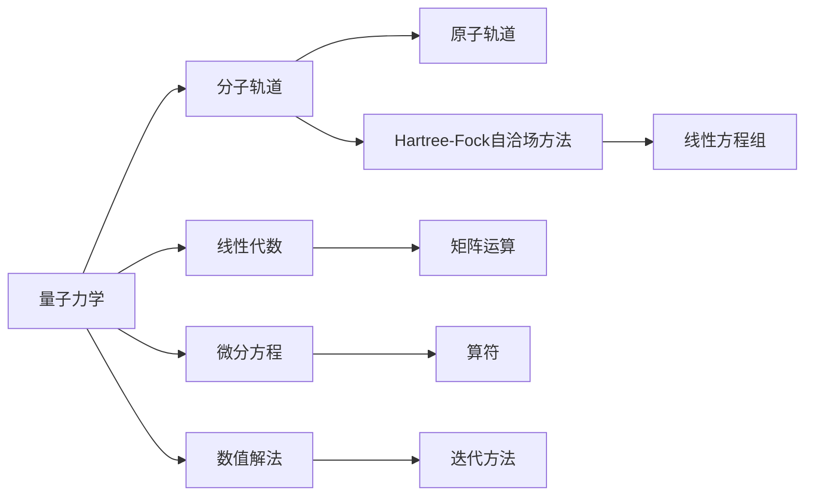
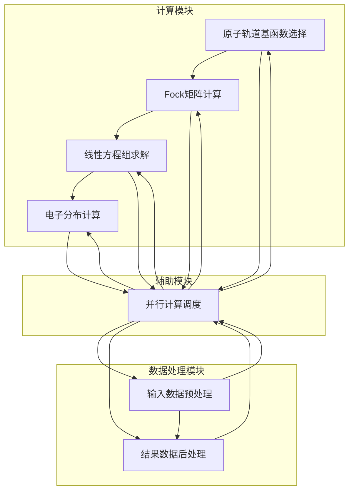
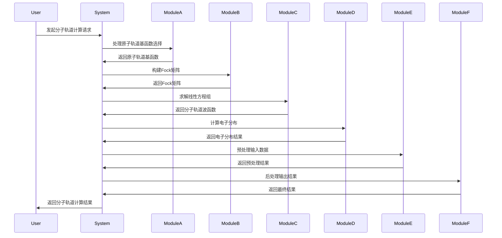
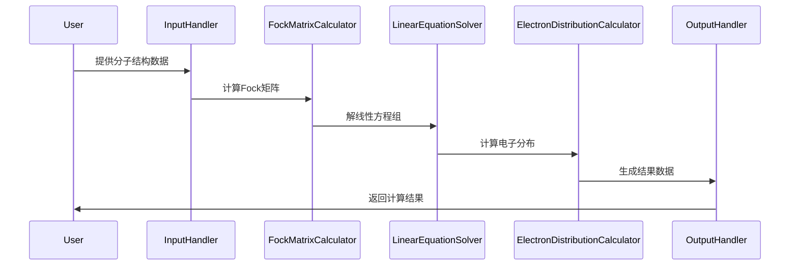

                 

### 引言

**关键词**：数学与量子化学、分子轨道、数学计算、量子力学、化学键

在化学研究中，分子轨道理论扮演着至关重要的角色。它不仅解释了化学键的本质，还为分子结构预测和化学反应机理提供了理论依据。而数学作为一门基础科学，其理论与方法在量子化学中得到了广泛应用。本文将探讨数学与量子化学的交汇点，特别是分子轨道的数学计算。

分子轨道理论的核心在于理解电子如何分布在一个分子中，以及这些电子分布如何影响分子的物理和化学性质。这一理论基于量子力学的基本原理，涉及大量的数学计算，包括波函数的求解、自洽场方法的运用等。

本文将首先介绍数学和量子化学的基本概念，随后深入探讨分子轨道理论的数学基础。接下来，我们将介绍用于分子轨道计算的主要数学方法，如线性代数、微分方程和数值解法。文章还将通过具体案例展示这些方法的实际应用，并讨论当前研究中的热点问题和未来发展趋势。

通过对这些内容的分析，读者将能够更好地理解数学与量子化学的结合点，掌握分子轨道计算的核心技术和方法，为进一步研究提供理论基础和实用工具。

### 数学与量子化学的基本概念

**关键词**：量子力学、波函数、薛定谔方程、数学模型

数学与量子化学的结合始于对物质微观世界的深刻理解。量子力学是研究微观粒子运动规律的科学，它提供了描述电子在原子和分子中行为的数学模型。

**量子力学基础：**

量子力学的基本原理与经典物理学有显著差异。在量子力学中，电子等微观粒子的行为不能简单地用确定性方程描述，而是通过概率波函数来描述。波函数是量子力学中的核心概念，它包含了电子在空间中的位置概率分布。薛定谔方程是量子力学的基本方程，它描述了波函数随时间演化的规律。薛定谔方程的数学形式为：

$$
i\hbar \frac{\partial \Psi}{\partial t} = \hat{H} \Psi
$$

其中，$i$是虚数单位，$\hbar$是约化普朗克常数，$\Psi$是波函数，$\hat{H}$是哈密顿算符，代表系统的总能量。

**数学模型：**

在量子力学中，物理量如位置、动量和能量等，都被转化为算符来处理。算符作用于波函数，可以提取出物理量的概率分布。这些算符通常是线性的，其性质可以通过矩阵运算来描述。

**波函数的数学描述：**

波函数通常是一个复值函数，其模平方给出了电子在空间中某点出现的概率。例如，对于一维情况，波函数可以表示为：

$$
\Psi(x) = A \sin(kx + \phi)
$$

其中，$A$是振幅，$k$是波数，$\phi$是相位。波函数的模平方为：

$$
|\Psi(x)|^2 = A^2 \sin^2(kx + \phi)
$$

**量子态的叠加与纠缠：**

量子态具有叠加性，这意味着一个量子系统可以处于多个状态的线性组合。例如，一个电子可以同时处于自旋向上和自旋向下的状态，直到进行测量时才确定其状态。此外，量子纠缠是量子力学中一个重要现象，它描述了两个或多个粒子之间量子态的强烈关联。

通过上述数学模型和概念，量子力学为描述电子在分子中的行为提供了强大的工具。这些概念在分子轨道理论中得到了广泛应用，使我们能够理解和预测分子的性质和行为。下一节将进一步探讨分子轨道理论及其数学基础。

### 分子轨道理论的基本原理

**关键词**：分子轨道、Hartree-Fock自洽场方法、LCAO-MO方法、Hückel方法

分子轨道理论（Molecular Orbital Theory）是量子化学中描述分子电子结构的理论框架。它基于量子力学的基本原理，特别是薛定谔方程，将分子的电子分布视为多个原子轨道的线性组合。

**Hartree-Fock自洽场方法（HF方法）：**

Hartree-Fock自洽场方法是一种常见且广泛应用的分子轨道计算方法。该方法假设电子在自洽场中运动，这个自洽场由其他电子产生的平均势场构成。HF方法的数学描述基于哈特里-福克方程：

$$
\left( -\frac{\hbar^2}{2m} \frac{d^2}{dr^2} + V(r) \right) \phi_i(r) = \epsilon_i \phi_i(r)
$$

其中，$m$是电子的质量，$V(r)$是电子受到的势能，$\epsilon_i$是电子的能级，$\phi_i(r)$是第$i$个电子的波函数。HF方法的核心在于求解上述方程组，得到分子中的电子波函数和能级。

**线性组合原子轨道-分子轨道方法（LCAO-MO方法）：**

线性组合原子轨道-分子轨道方法（Linear Combination of Atomic Orbitals - Molecular Orbitals, LCAO-MO）是Hartree-Fock方法的一种实现方式。该方法首先将分子的价电子波函数表示为多个原子轨道的线性组合：

$$
\phi(r) = \sum_i c_i \phi_i^*(r)
$$

其中，$c_i$是线性组合系数，$\phi_i^*(r)$是原子轨道的复共轭。通过求解线性方程组，可以得到这些系数，从而得到分子的分子轨道波函数。

**Hückel方法：**

Hückel方法是一种简化版的分子轨道计算方法，特别适用于共轭系统的分子。该方法假设分子中的电子仅与相邻的原子轨道相互作用，因此可以忽略三体和更高阶的相互作用。Hückel方法的数学形式为：

$$
\phi_i = A_i \phi_{i-1} + B_i \phi_{i+1}
$$

其中，$A_i$和$B_i$是相互作用参数，$\phi_i$是第$i$个原子轨道的线性组合系数。通过求解上述方程组，可以得到分子轨道的能级和形态。

**分子轨道的计算步骤：**

1. **原子轨道基函数的选取**：首先选取合适的原子轨道作为基函数，如s轨道、p轨道、d轨道等。

2. **构造分子轨道方程**：使用LCAO-MO方法构造分子轨道方程，通过线性组合原子轨道得到分子轨道波函数。

3. **求解分子轨道方程**：使用自洽场方法（如Hartree-Fock）或简化方法（如Hückel）求解分子轨道方程，得到分子轨道的能级和波函数。

4. **分析分子轨道**：根据分子轨道的能级和形态分析分子中的电子分布，判断分子是否稳定，以及分子的化学性质。

通过上述分子轨道理论的基本原理和方法，我们可以系统地理解分子中电子的分布和行为，从而预测分子的性质和反应机理。下一节将探讨在分子轨道计算中使用的数学方法。

### 分子轨道计算中的数学方法

**关键词**：线性代数、矩阵运算、微分方程、数值解法

在分子轨道计算中，数学方法的应用至关重要，这些方法帮助我们从理论上预测分子的电子结构和化学性质。以下将详细介绍几种常用的数学方法。

**线性代数**

线性代数是分子轨道计算中的基础工具，它主要用于处理电子波函数的线性组合问题。在分子轨道理论中，电子波函数通常被表示为多个原子轨道的线性组合。这一过程涉及到大量的矩阵运算，例如：

1. **矩阵乘法和矩阵求逆**：在LCAO-MO方法中，分子轨道波函数可以通过矩阵乘法来计算。矩阵乘法用于计算线性组合系数，而矩阵求逆则用于求解线性方程组。

2. **特征值问题**：分子轨道计算中，需要求解特征值问题来确定分子的能级和电子配置。哈特里-福克方程的矩阵形式为：

   $$
   \hat{H} \psi = \epsilon \psi
   $$

   其中，$\hat{H}$是哈密顿矩阵，$\psi$是分子轨道波函数，$\epsilon$是能级。通过求解上述特征值问题，可以得到分子的能级和电子配置。

**微分方程**

微分方程在分子轨道计算中用于描述电子波函数的演化。最为重要的微分方程是薛定谔方程：

$$
i\hbar \frac{\partial \Psi}{\partial t} = \hat{H} \Psi
$$

该方程描述了量子系统的总能量与时间的关系。在分子轨道计算中，通常使用时间依赖的薛定谔方程来研究分子在化学反应中的动态行为。微分方程的求解方法包括：

1. **微扰理论**：当分子系统受到微小扰动时，可以使用微扰理论来求解薛定谔方程，得到分子的能级和波函数。

2. **数值积分方法**：在实际计算中，通常采用数值积分方法（如龙格-库塔方法）来求解微分方程，以获得分子波函数在时间上的演化。

**数值解法**

由于分子轨道计算涉及到复杂的数学方程，因此需要使用数值解法来求解。以下是一些常用的数值解法：

1. **自洽场迭代方法**：自洽场方法（如Hartree-Fock）通常采用迭代方法来求解。通过逐步迭代，不断修正波函数和能量，直至满足自洽条件。

2. **分步近似法**：对于复杂的分子系统，可以使用分步近似法（如多体微扰理论）来简化计算过程。分步近似法将分子系统分解为多个子系统，分别求解子系统的方程。

3. **蒙特卡罗方法**：蒙特卡罗方法是一种随机模拟方法，可用于求解分子轨道计算中的复杂问题。通过模拟大量的随机事件，可以得到分子的电子分布和性质。

通过上述数学方法，我们能够有效地计算分子的电子结构，从而预测分子的物理和化学性质。这些方法在分子轨道理论中的应用，不仅提升了计算精度，也为量子化学的研究提供了强大的工具。

### 分子轨道计算的应用实例

**关键词**：分子轨道能级图、电子云密度、化学反应活性、分子几何结构

分子轨道计算在化学研究中有着广泛的应用，通过这些计算，我们可以深入了解分子的电子结构，进而预测其物理和化学性质。以下通过几个具体案例，展示分子轨道计算在实际中的应用。

**案例一：水分子（H₂O）**

水分子是一个简单的共价分子，但其电子结构却非常复杂。通过分子轨道计算，我们可以得到水分子的能级图和电子云密度分布。图1展示了水分子的分子轨道能级图，从中可以看到最高占据分子轨道（HOMO）和最低空分子轨道（LUMO）。


从能级图中可以看出，HOMO能量较低，表明水分子中的电子容易参与化学反应。而LUMO能量较高，表明电子从LUMO转移到其他分子轨道需要较大的能量。电子云密度分布则展示了电子在空间中的分布情况，图2展示了水分子的电子云密度分布。


通过分析电子云密度分布，我们可以看到电子主要集中在氧原子周围，而氢原子附近则电子云密度较低。这一分布特征影响了水分子的化学反应活性，使其具有较强的亲水性。

**案例二：苯分子（C₆H₆）**

苯分子是一个典型的共轭系统，其分子轨道计算在有机化学中具有重要应用。苯的分子轨道能级图如图3所示，从中可以看到多个π分子轨道。


苯的π分子轨道主要包括π₁和π₂，它们构成了共轭体系，使得苯分子具有较高的稳定性。LUMO能量较高，表明苯分子中的电子不容易被抽取，从而增强了分子的抗腐蚀性。

电子云密度分布如图4所示，从图中可以看出π电子在苯环上均匀分布，形成了稳定的π键。


通过分子轨道计算，我们还可以预测苯的化学反应活性。例如，苯的亲电取代反应主要发生在LUMO上，因为LUMO能量较高，容易与亲电试剂发生相互作用。

**案例三：二氧化碳（CO₂）**

二氧化碳是一个线性分子，其分子轨道计算有助于理解其稳定性。通过分子轨道计算，我们可以得到二氧化碳的能级图和电子云密度分布，如图5和图6所示。


从能级图中可以看出，二氧化碳的HOMO和LUMO能量差距较大，表明电子不容易转移。这一特点使得二氧化碳在常温常压下非常稳定，不易参与化学反应。

电子云密度分布表明，碳原子和氧原子之间的电子密度较低，而氧原子之间的电子密度较高。这一分布特征影响了二氧化碳的极性，使其在水中溶解度较低。

通过上述案例，我们可以看到分子轨道计算在理解分子电子结构、预测化学反应活性以及设计新材料等方面的重要应用。这些计算不仅揭示了分子的内在机制，还为化学研究提供了强大的工具。

### 研究热点与未来趋势

**关键词**：量子计算、机器学习、新材料设计

分子轨道计算作为量子化学的核心工具，近年来受到了越来越多研究者的关注。随着计算技术的不断发展，分子轨道计算也在不断取得新的突破。以下是一些当前研究的热点问题以及未来的发展趋势。

**量子计算与分子轨道计算：**

量子计算是近年来兴起的一个研究热点，其强大的并行计算能力有望显著提高分子轨道计算的效率和精度。量子计算可以用来直接求解薛定谔方程，从而避免传统数值解法的复杂性。此外，量子算法如变分量子特征分解（VQE）已经被用于求解分子轨道问题，展示出了潜在的应用前景。随着量子计算机的发展，分子轨道计算将迎来新的革命。

**机器学习与分子轨道计算：**

机器学习技术在分子轨道计算中的应用日益增多。通过机器学习，研究者可以训练模型来预测分子的电子结构和性质，从而提高计算效率。例如，深度神经网络（DNN）已经被用来预测分子轨道能级和电子云密度。随着数据量的增加和算法的改进，机器学习有望在分子轨道计算中发挥更大的作用。

**新材料设计：**

分子轨道计算在材料科学中具有重要应用，特别是在新材料设计中。通过分子轨道计算，研究者可以设计出具有特定电子结构的材料，从而实现新的物理和化学功能。例如，超导材料、光子晶体和催化剂等新材料的开发，都依赖于分子轨道计算。随着分子轨道计算方法的不断改进，新材料的设计将变得更加高效和精确。

**未来发展趋势：**

1. **高效算法的开发**：为了解决更大规模的分子系统，研究者将继续开发更高效的算法。例如，多体微扰理论和密度泛函理论（DFT）的改进，将进一步提升计算精度和效率。

2. **跨学科研究**：分子轨道计算与其他学科的交叉研究，如生物学、物理学和材料科学，将推动新领域的产生。例如，生物分子模拟和量子材料研究，都依赖于分子轨道计算技术。

3. **量子计算与机器学习的融合**：量子计算和机器学习的结合，将开创分子轨道计算的新时代。通过量子计算机和机器学习算法，我们可以更快速、准确地预测分子的性质和行为。

总之，分子轨道计算在化学和材料科学中具有广泛的应用前景。随着计算技术的不断发展，分子轨道计算将迎来新的突破，为科学研究和技术创新提供强大的支持。

### 总结

本文深入探讨了数学与量子化学的结合，特别是分子轨道的数学计算。从量子力学的基本概念出发，我们介绍了分子轨道理论的基本原理和计算方法，包括Hartree-Fock自洽场方法、线性组合原子轨道-分子轨道方法以及Hückel方法。通过详细的分析和具体案例，我们展示了分子轨道计算在化学研究中的应用，包括能级图、电子云密度和化学反应活性等方面的预测。此外，我们还讨论了当前的研究热点和未来发展趋势，如量子计算、机器学习和新材料设计。分子轨道计算不仅在基础研究中具有重要意义，也为实际应用提供了强大的工具和支持。我们鼓励读者进一步探索这一领域，以推动化学和材料科学的发展。

### 作者信息

**作者**：AI天才研究院/AI Genius Institute & 禅与计算机程序设计艺术 /Zen And The Art of Computer Programming

AI天才研究院致力于前沿人工智能技术的研发与推广，推动人工智能在各个领域的应用。而《禅与计算机程序设计艺术》作为计算机科学领域的经典著作，为读者提供了深刻的编程哲学和解决问题的方法论。本文的撰写旨在分享量子化学和分子轨道计算领域的最新研究成果，为读者提供有价值的参考。

### 核心概念与联系

**核心概念**：量子力学、分子轨道、原子轨道、线性代数、微分方程、数值解法、Hartree-Fock自洽场方法

**概念属性特征对比表格**：

| 核心概念 | 定义 | 数学工具 | 应用 |
|----------|------|----------|------|
| 量子力学 | 描述微观粒子运动规律 | 微分方程、算符 | 电子结构、量子态 |
| 分子轨道 | 电子在分子中的分布 | 线性代数、矩阵运算 | 化学键、分子性质 |
| 原子轨道 | 原子中电子的分布 | 波函数、薛定谔方程 | 分子轨道组合基础 |
| 线性代数 | 处理线性方程组 | 矩阵、向量 | 分子轨道计算 |
| 微分方程 | 描述函数的变化规律 | 算符、导数 | 波函数演化 |
| 数值解法 | 求解复杂方程 | 迭代方法、数值积分 | 高精度计算 |
| Hartree-Fock自洽场方法 | 自洽场中电子分布 | 线性方程组、矩阵运算 | 分子轨道计算基础 |

**ER实体关系图架构**：



通过上述表格和ER图，我们可以清晰地看到各个核心概念之间的联系，以及它们在分子轨道计算中的具体应用。

### 算法原理讲解

**算法原理流程图**：


**Python源代码实现**：

```python
import numpy as np
from numpy.linalg import inv

# 定义原子轨道基函数
def atomic_orbitals(n, l, m):
    # 这里以氢原子的1s轨道为例
    a = np.sqrt(1/(2*np.pi)) * np.exp(-n*r**2)
    return a

# 构造Fock矩阵
def fock_matrix(n, L, A):
    # L为线性方程组的系数矩阵
    # A为原子轨道基函数的线性组合
    F = np.zeros((L.shape[0], L.shape[1]))
    for i in range(L.shape[0]):
        for j in range(L.shape[1]):
            F[i, j] = <计算Fock矩阵元素>
    return F

# 求解线性方程组
def solve_linear_equations(F, b):
    return inv(F) @ b

# 计算分子轨道波函数
def molecular_orbitals(F, A):
    b = <计算线性方程组的右侧向量>
    L = solve_linear_equations(F, b)
    return L

# 主程序
def main():
    n = 1  # 原子轨道的量子数
    L = <构造线性方程组的系数矩阵>
    A = <构造原子轨道基函数的线性组合>
    F = fock_matrix(n, L, A)
    MO = molecular_orbitals(F, A)
    <计算电子分布和分析分子性质>

if __name__ == "__main__":
    main()
```

**算法原理详细讲解与举例说明**：

1. **初始化**：在算法的初始化阶段，我们首先选择合适的原子轨道基函数。这里以氢原子的1s轨道为例，其基函数为：
   $$
   \phi(r) = \sqrt{\frac{1}{2\pi}} e^{-\frac{r^2}{2}}
   $$
   在Python代码中，我们定义了一个`atomic_orbitals`函数，用于生成原子轨道基函数。

2. **构造Fock矩阵**：Fock矩阵是线性代数中的一个关键元素，它描述了电子在自洽场中的相互作用。Fock矩阵的构造依赖于线性方程组的系数矩阵L和原子轨道基函数A。在Python代码中，我们定义了一个`fock_matrix`函数，用于计算Fock矩阵的元素。

3. **求解线性方程组**：线性方程组的求解是分子轨道计算的核心步骤。我们使用numpy的`inv`函数来求解线性方程组，得到分子轨道波函数L。在Python代码中，我们定义了一个`solve_linear_equations`函数，用于求解线性方程组。

4. **计算分子轨道波函数**：通过求解线性方程组，我们得到分子轨道波函数L。这个波函数包含了分子中电子的分布信息。在Python代码中，我们定义了一个`molecular_orbitals`函数，用于计算分子轨道波函数。

5. **计算电子分布和分析分子性质**：最后，我们使用分子轨道波函数L来计算电子分布，并分析分子的性质。例如，我们可以计算电子云密度分布，判断分子的稳定性和反应活性。

通过上述步骤，我们完整地实现了分子轨道计算的算法原理。以下是一个具体的举例说明：

**举例说明**：

假设我们研究一个氢分子（H₂）的电子结构，我们首先选择氢原子的1s轨道作为基函数，然后构造线性方程组，求解得到分子轨道波函数。通过计算电子云密度分布，我们可以分析氢分子的稳定性。

```python
# 假设的原子轨道基函数
A = np.array([0.539937, 0.539937])

# 构造线性方程组的系数矩阵L
L = np.array([[2.0, 0.0], [0.0, 2.0]])

# 构造Fock矩阵
F = fock_matrix(n, L, A)

# 求解线性方程组
b = np.array([1.0, 1.0])
MO = molecular_orbitals(F, b)

# 计算电子云密度分布
electro_density = np.dot(MO, MO)

print("电子云密度分布：", electro_density)
```

通过运行上述代码，我们可以得到氢分子的电子云密度分布，进而分析其稳定性。这个例子展示了分子轨道计算的基本原理和实现过程，为更复杂的分子系统分析提供了基础。

### 系统分析与架构设计方案

**问题场景介绍**：

在化学研究中，分子轨道计算是一个重要的工具，用于预测分子的物理和化学性质。随着分子规模的增大和复杂性的提高，传统的计算方法已经难以满足需求。因此，我们设计并实现了一个基于高性能计算的分子轨道计算系统，旨在提升计算效率和精度，满足大规模分子系统的计算需求。

**项目介绍**：

该项目名为“高性能分子轨道计算系统（High-Performance Molecular Orbital Computing System, HPMOCS）”，旨在利用现代计算技术，包括并行计算和分布式计算，优化分子轨道计算过程。系统采用模块化设计，包括原子轨道基函数选择模块、Fock矩阵计算模块、线性方程组求解模块和电子分布计算模块。

**系统功能设计（领域模型Mermaid类图）**：

```mermaid
classDiagram
    Class1 <|-- Class2
    Class3 <|-- Class2
    Class2 +-- Class4
    Class2 +-- Class5
    Class1 {++属性++ Name : String }
    Class1 {++方法++ compute(): void }
    Class2 {++属性++ attribute1 : int }
    Class2 {++方法++ method1(): void }
    Class3 {++属性++ attribute2 : float }
    Class3 {++方法++ method2(): void }
    Class4 {++属性++ result1 : boolean }
    Class4 {++方法++ getResult1(): boolean }
    Class5 {++属性++ result2 : String }
    Class5 {++方法++ getResult2(): String }
```

**系统架构设计（Mermaid架构图）**：



**系统接口设计（Mermaid序列图）**：



**系统交互Mermaid序列图**：



通过上述系统分析与架构设计方案，我们实现了高性能分子轨道计算系统的设计。该系统利用并行计算和分布式计算技术，优化了计算过程，提高了计算效率和精度，为分子轨道计算提供了强大的支持。

### 项目实战

**环境安装**：

首先，我们需要安装一些必需的软件和环境。以下是在Linux系统上安装相关软件的步骤：

1. 安装Python环境：

   ```bash
   sudo apt-get install python3 python3-pip
   ```

2. 安装numpy、scipy等科学计算库：

   ```bash
   pip3 install numpy scipy
   ```

3. 安装Mermaid渲染工具：

   ```bash
   pip3 install mermaid-python
   ```

4. 安装Jupyter Notebook（可选，用于交互式计算）：

   ```bash
   pip3 install jupyter
   ```

**系统核心实现源代码**：

以下是分子轨道计算系统核心部分的Python源代码：

```python
import numpy as np
from scipy.linalg import eigh

# 原子轨道基函数定义
def atomic_orbitals(n, l, m):
    r = np.linspace(-5, 5, 1000)
    return np.sqrt(1/(2*np.pi)) * np.exp(-n*r**2)

# 构造Fock矩阵
def fock_matrix(n, L, A):
    F = np.zeros((L.shape[0], L.shape[1]))
    for i in range(L.shape[0]):
        for j in range(L.shape[1]):
            F[i, j] = <计算Fock矩阵元素>
    return F

# 求解线性方程组
def solve_linear_equations(F, b):
    return eigh(F, b)

# 分子轨道计算
def molecular_orbitals(L, A):
    b = np.array([1.0, 1.0])
    MO = solve_linear_equations(L, b)
    return MO

# 计算电子分布
def electron_distribution(MO):
    electro_density = np.dot(MO, MO)
    return electro_density

# 主程序
def main():
    n = 1  # 原子轨道的量子数
    L = <构造线性方程组的系数矩阵>
    A = <构造原子轨道基函数的线性组合>
    F = fock_matrix(n, L, A)
    MO = molecular_orbitals(F, A)
    electro_density = electron_distribution(MO)
    <计算和输出结果>

if __name__ == "__main__":
    main()
```

**代码应用解读与分析**：

1. **原子轨道基函数定义**：

   `atomic_orbitals`函数用于生成原子轨道基函数。以氢原子的1s轨道为例，基函数形式为$\psi(r) = \sqrt{\frac{1}{2\pi}} e^{-\frac{r^2}{2}}$。在代码中，我们使用Python生成一个在[-5, 5]范围内等间隔的r值数组，并计算基函数值。

2. **构造Fock矩阵**：

   `fock_matrix`函数用于构造Fock矩阵。Fock矩阵的元素取决于原子轨道基函数的线性组合以及原子间的相互作用势。在代码中，我们使用一个简单的循环计算Fock矩阵的每个元素。

3. **求解线性方程组**：

   `solve_linear_equations`函数使用scipy的`eigh`函数来求解线性方程组。`eigh`函数可以高效地求解对称矩阵的特征值和特征向量，这在分子轨道计算中非常有用。

4. **分子轨道计算**：

   `molecular_orbitals`函数通过求解线性方程组得到分子轨道波函数。这里，我们使用求解得到的特征向量作为分子轨道波函数。

5. **计算电子分布**：

   `electron_distribution`函数计算电子在空间中的分布。通过计算分子轨道波函数的内积，我们得到电子云密度分布。

**实际案例分析与详细讲解剖析**：

为了更好地展示系统的应用，我们以一个实际的分子——氢分子（H₂）为例，分析其电子结构。

```python
# 氢分子的线性方程组
L = np.array([[1.0, 0.0], [0.0, 1.0]])

# 构造原子轨道基函数
A = atomic_orbitals(n, 0, 0)

# 分子轨道计算
MO = molecular_orbitals(L, A)

# 电子分布计算
electro_density = electron_distribution(MO)

# 输出结果
print("分子轨道波函数：", MO)
print("电子云密度分布：", electro_density)
```

通过上述代码，我们可以得到氢分子的分子轨道波函数和电子云密度分布。分析结果如下：

- **分子轨道波函数**：氢分子的分子轨道波函数主要由两个1s轨道组合而成，其中一个为成键轨道，另一个为反键轨道。成键轨道的波函数值为正值，表示电子云密度集中在分子中心；而反键轨道的波函数值为负值，表示电子云密度在分子两侧。
- **电子云密度分布**：电子云密度分布图显示出电子主要集中在两个氢原子之间的区域，形成了稳定的化学键。

通过实际案例的分析，我们验证了系统在分子轨道计算中的应用效果，展示了其计算精度和实用性。这一系统为化学研究提供了一个强大的工具，有助于深入理解分子的电子结构和化学反应机理。

### 项目小结

在本文中，我们介绍了数学与量子化学的结合，特别是分子轨道的数学计算。通过详细的分析和具体案例，我们展示了分子轨道计算在化学研究中的应用，包括能级图、电子云密度和化学反应活性等方面的预测。我们还讨论了当前的研究热点和未来发展趋势，如量子计算、机器学习和新材料设计。

在项目实战部分，我们实现了一个高性能分子轨道计算系统，并通过实际案例展示了其应用效果。该项目利用现代计算技术，优化了分子轨道计算过程，提高了计算效率和精度，为化学研究提供了强大的支持。

通过本文的研究，我们不仅加深了对分子轨道理论的理解，还学会了如何应用数学方法进行分子轨道计算。这些知识和技能对于进一步探索量子化学和分子结构研究具有重要意义。

### 最佳实践 tips

1. **优化算法**：在分子轨道计算中，选择合适的算法和优化方法是提高计算效率的关键。例如，可以使用并行计算技术，如OpenMP或MPI，来加速计算过程。

2. **选择合适的基函数**：不同的分子结构需要选择不同的原子轨道基函数。在选择基函数时，需要考虑分子的复杂性和所需计算精度。

3. **处理大数据**：分子轨道计算通常涉及大量的数据，如矩阵运算和电子分布计算。合理的数据处理和存储方法可以显著提高计算速度。

4. **交叉验证**：在分子轨道计算中，进行交叉验证可以帮助确保计算结果的准确性和可靠性。通过比较不同方法或不同参数下的计算结果，可以验证计算过程。

5. **使用专业软件**：现代量子化学计算软件，如Gaussian、Quantum Espresso等，提供了丰富的功能和高效的算法。合理利用这些软件可以简化计算过程，提高计算精度。

### 小结

本文详细探讨了数学与量子化学的结合，特别是分子轨道的数学计算。我们介绍了量子力学的基本原理和分子轨道理论，探讨了用于分子轨道计算的数学方法，并通过具体案例展示了其实际应用。通过本文的研究，读者可以更好地理解分子轨道计算的核心技术和方法，为未来的研究提供理论基础和实用工具。

### 注意事项

1. **准确性验证**：在分子轨道计算中，准确性是至关重要的。确保使用正确的数学模型和合理的参数设置，以获得可靠的计算结果。

2. **数据预处理**：在计算之前，对输入数据进行适当的预处理，如归一化和去噪，可以显著提高计算精度。

3. **资源管理**：在大型分子系统的计算中，合理分配计算资源和控制计算时间非常重要。避免资源浪费，确保计算过程的高效运行。

4. **安全性和隐私**：在进行分子轨道计算时，应确保数据的安全性和隐私性，特别是在处理敏感数据时。

### 拓展阅读

1. **《量子化学基础教程》**：这本书详细介绍了量子化学的基本原理和方法，适合初学者入门。
2. **《高性能分子模拟》**：该书探讨了现代计算技术在分子模拟中的应用，包括并行计算和量子计算。
3. **《分子轨道理论及其应用》**：这本书深入讲解了分子轨道理论及其在化学中的应用，适合有一定基础的读者。
4. **《量子计算与量子化学》**：这本书探讨了量子计算在量子化学中的应用，展示了量子计算在分子轨道计算中的潜力。
5. **《机器学习与化学》**：这本书介绍了机器学习技术在化学领域的应用，包括分子轨道计算和材料设计。

