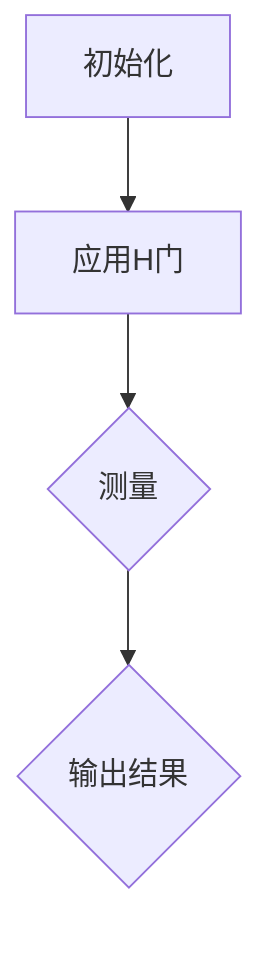
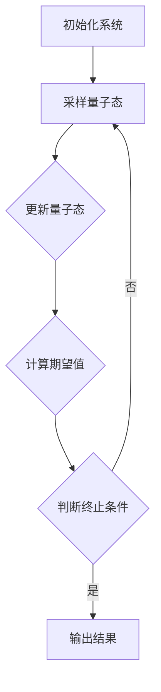
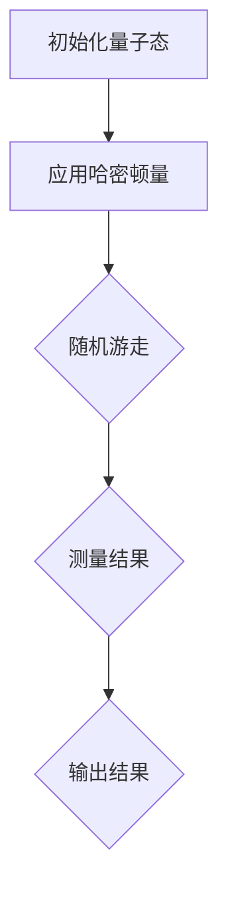
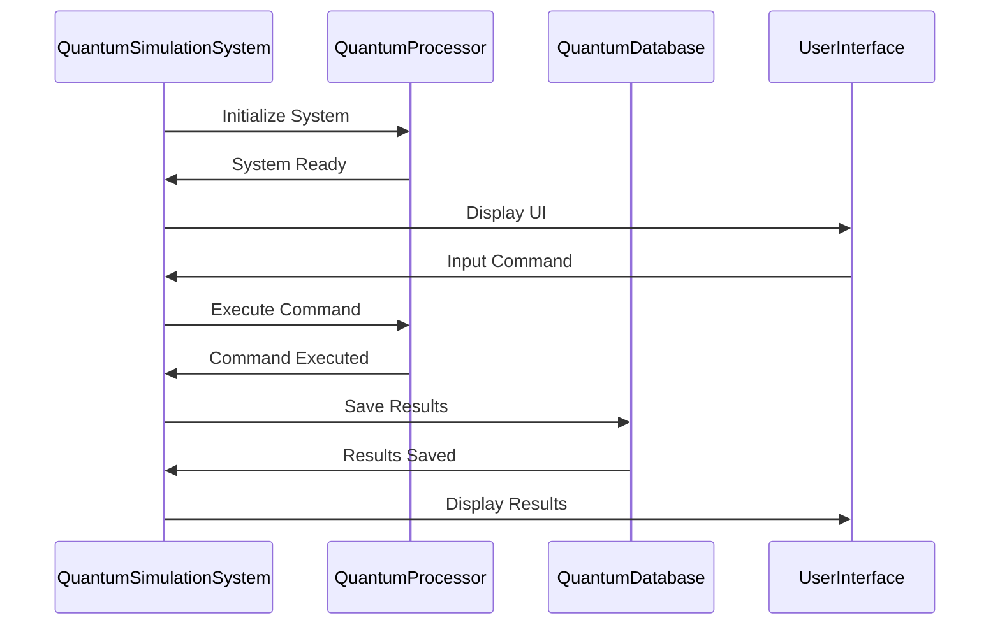
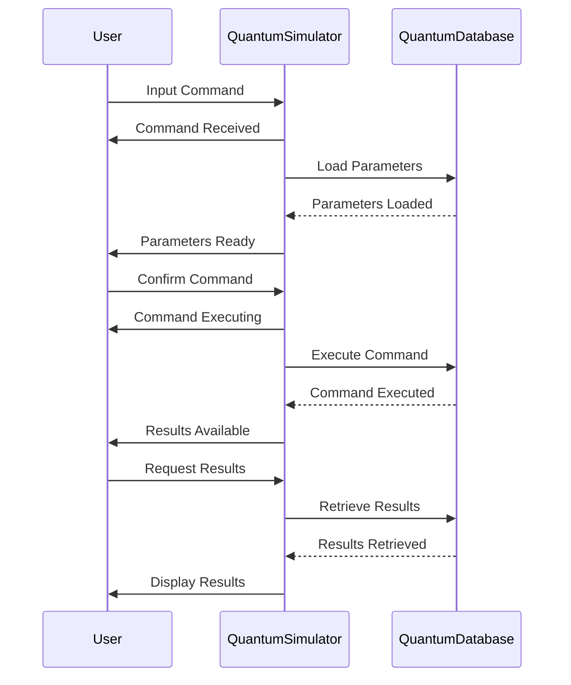

                 


## 引言：量子计算与经典数学模拟的交汇

### 文章标题：数学与量子模拟：量子系统的经典数学模拟

### 关键词：量子计算、经典数学、模拟、算法、系统架构

### 摘要：

量子计算是21世纪最具前瞻性的技术之一，它利用量子比特的叠加态和纠缠特性，实现了超乎传统计算机的计算能力。然而，量子计算的实现和模拟面临着诸多技术挑战。本文将从数学的角度探讨量子系统的经典数学模拟，通过逐步分析量子计算与经典数学的内在联系，揭示其基本原理和应用方法，为读者提供一次深入的技术之旅。

量子计算的基本原理与传统计算有显著的不同。传统计算依赖于二进制比特（bits），而量子计算则使用量子比特（qubits），后者可以在0和1之间同时存在叠加态。这种叠加态使得量子计算机能够在一次运算中处理大量并行计算，从而在某些特定问题上展现出超越经典计算机的性能。

量子计算的关键在于量子门（quantum gates）和量子纠缠（quantum entanglement）。量子门是操作量子比特的基本单元，类似于经典计算机中的逻辑门。量子纠缠则是一种量子比特间的特殊联系，当两个量子比特纠缠时，它们的状态将无法独立存在，而是相互依赖。这种纠缠现象是量子计算的核心优势之一。

### 问题背景

尽管量子计算的理论基础深厚，但实际构建和运行量子计算机仍然面临着巨大挑战。首先，量子比特的稳定性是一个关键问题。量子比特非常容易受到环境噪声的影响，导致量子态的失真，这被称为“量子退相干”。其次，量子比特的数量也是一个限制因素。当前的量子计算机通常只有几十个量子比特，而要实现广泛应用的量子计算，需要数千甚至数百万个量子比特。

因此，为了更好地理解和研究量子系统，科学家们提出了使用经典数学工具来模拟量子系统的方法。经典数学模拟可以提供一种在现有计算机上研究和测试量子算法的途径，帮助解决量子计算中的各种问题。通过模拟，我们可以分析量子算法的性能，探索量子系统的行为，为量子计算机的实际应用做好准备。

### 问题描述

量子系统的数学描述是一种高度抽象的表达方式，它依赖于复数、矩阵和向量等数学工具。量子态可以用波函数（wavefunction）或密度矩阵（密度矩阵）来描述，这些数学工具提供了对量子系统状态的详细描述。然而，这些数学工具在经典计算中并不常用，因此，量子系统的数学描述对经典数学家来说是一种新的挑战。

经典数学模拟量子系统的核心在于如何将量子系统的数学描述转化为可以在经典计算机上执行的操作。这涉及到将量子门转换为可模拟的经典逻辑操作，以及处理量子纠缠等复杂现象。此外，量子系统的模拟还需要考虑量子态的退相干问题，以确保模拟结果的准确性。

### 问题解决

为了解决上述问题，科学家们开发了一系列经典数学模拟方法。这些方法可以分为两大类：数值模拟和符号模拟。

**数值模拟**是通过计算机模拟量子系统的行为，通常使用量子蒙特卡洛算法（Quantum Monte Carlo methods）。这种方法通过随机抽样来模拟量子系统的演化，能够在一定程度上模拟量子系统的复杂行为。然而，数值模拟面临着计算效率和精度的问题，特别是在模拟大规模量子系统时。

**符号模拟**则使用符号计算方法，通过精确的数学操作来模拟量子系统。这种方法通常使用符号计算软件，如MATLAB和Python中的SymPy库。符号模拟可以提供更精确的结果，但计算时间较长，对计算机性能要求较高。

此外，一些经典数学工具，如线性代数和概率论，也被广泛应用于量子系统的模拟。线性代数用于处理量子态的叠加和纠缠，而概率论用于描述量子态的退相干和测量结果。

### 边界与外延

尽管经典数学模拟为量子系统的研究提供了重要手段，但它也面临着一定的限制。首先，经典计算机的物理限制使得模拟大规模量子系统变得困难。其次，经典模拟无法完全模拟量子计算中的某些现象，如量子纠缠。此外，量子计算的实验验证和实际应用也需要依赖于经典模拟的研究成果。

未来的研究将侧重于开发更高效、更精确的量子模拟方法，以克服当前模拟技术的局限性。此外，量子模拟与其他计算领域的交叉也将是一个重要研究方向，例如量子机器学习和量子优化算法。

### 概念结构与核心要素组成

为了深入理解量子系统的经典数学模拟，我们需要掌握以下几个核心概念：

1. **量子比特**：量子比特是量子计算的基本单元，具有叠加态和纠缠特性。
2. **量子门**：量子门是操作量子比特的基本单元，类似于经典计算机中的逻辑门。
3. **量子态**：量子态是量子比特的状态描述，通常使用波函数或密度矩阵来表示。
4. **量子纠缠**：量子纠缠是量子比特间的特殊联系，导致它们的状态相互依赖。
5. **量子退相干**：量子退相干是量子系统因环境噪声而失去量子态的现象。

这些概念构成了量子计算和经典数学模拟的基础，为我们提供了理解和模拟量子系统的数学工具。

### 总结

本文从量子计算的基本原理出发，探讨了经典数学模拟在量子系统研究中的应用。通过逐步分析量子系统的数学描述和经典数学模拟的方法，我们揭示了量子计算与经典数学的内在联系。在接下来的章节中，我们将进一步深入探讨量子比特、量子门和量子态等核心概念，并介绍常用的量子模拟算法和系统架构设计。希望本文能够为读者提供一次深入的技术之旅，激发对量子计算和经典数学模拟的浓厚兴趣。

## 第二部分：核心概念与联系

### 2.1 量子比特与经典比特

量子比特（qubit）是量子计算的基本单元，与传统计算机中的比特（bit）有着本质的不同。比特只有两个状态，即0和1，而量子比特可以同时处于0和1的叠加状态。这种叠加态使得量子比特能够同时表示多种可能的状态，从而实现了量子计算的超强并行性。

量子比特的特性之一是叠加态。叠加态可以用复数系数的线性组合来表示，即一个量子比特可以同时处于0和1的状态。例如，一个量子比特可以表示为：

\[ \psi = \alpha|0\rangle + \beta|1\rangle \]

其中，\(|0\rangle\)和\(|1\rangle\)分别表示量子比特的基态，\(\alpha\)和\(\beta\)是复数系数，满足\(|\alpha|^2 + |\beta|^2 = 1\)。

经典比特则没有叠加态的概念，每个比特只能处于0或1的确定状态。这种确定性是经典计算的基础，但在量子计算中，叠加态提供了并行处理的能力，使得量子计算机在处理某些问题时能够超越经典计算机。

### 概念属性特征对比表格

| 特性         | 量子比特                | 经典比特                |
| ------------ | ---------------------- | ---------------------- |
| 状态表示      | 叠加态（复数系数组合） | 确定状态（0或1）       |
| 并行计算     | 可并行计算多种状态      | 串行计算一个状态       |
| 纠缠         | 可以形成量子纠缠       | 无纠缠概念             |
| 稳定性       | 易受环境噪声影响（退相干） | 高稳定性（不受环境噪声影响） |

通过上表，我们可以看到量子比特和经典比特在状态表示、并行计算、纠缠和稳定性等方面存在显著差异。

### ER实体关系图架构

为了更好地理解量子比特和经典比特的概念及其关系，我们可以使用Mermaid绘制ER（实体关系）图。以下是一个简化的量子比特和经典比特的ER图：

```mermaid
erDiagram
    Class1 ||--|{ Class2 }|-- Class3
    Class1 ||--|{ Class4 }|-- Class5
```

在这个ER图中，`Class1`代表量子比特，`Class2`、`Class3`、`Class4`和`Class5`分别代表量子比特的各个属性和状态。这种关系表示量子比特具有多个子类和属性，每个子类和属性都与量子比特有直接或间接的联系。

### 量子门与经典逻辑门

量子门（quantum gate）是量子计算中用于操作量子比特的基本单元，类似于经典计算机中的逻辑门。量子门可以改变量子比特的状态，实现量子比特间的叠加和纠缠。常见的量子门包括保罗门（Pauli gate）、哈密顿门（Hadamard gate）和旋转门（Rotation gate）等。

**量子门的基本概念：**

- **保罗门**：保罗门是量子计算中最基本的门之一，它作用于量子比特的特定方向。常见的保罗门包括X门（作用于X方向）、Y门（作用于Y方向）和Z门（作用于Z方向）。
- **哈密顿门**：哈密顿门是一种线性变换门，可以将量子比特的状态进行叠加。哈密顿门通常用于实现量子比特之间的纠缠。
- **旋转门**：旋转门是一种将量子比特的状态在复平面上旋转的门。旋转门可以改变量子比特的相位，实现量子态的变换。

**量子门与经典逻辑门的区别：**

- **作用方式**：量子门作用于量子比特的状态，而经典逻辑门作用于比特的值。
- **操作效果**：量子门可以同时作用于多个量子比特，实现叠加和纠缠，而经典逻辑门通常只能作用于单个比特。
- **并行性**：量子门可以利用叠加态实现并行计算，而经典逻辑门则不具备这种特性。

**量子门的应用：**

量子门在量子计算中起着至关重要的作用。通过组合不同的量子门，可以实现各种复杂的量子算法和量子电路。以下是一个简单的量子电路示例：



在这个示例中，首先初始化量子比特，然后应用哈密顿门（H门）将量子比特的状态进行叠加，最后进行测量得到结果。

### 概念属性特征对比表格

| 特性         | 量子门                       | 经典逻辑门                  |
| ------------ | -------------------------- | -------------------------- |
| 作用对象      | 量子比特的状态               | 比特的值                   |
| 操作效果      | 叠加、纠缠和变换量子态       | 改变比特的值               |
| 并行性       | 可以同时作用于多个量子比特  | 通常只能作用于单个比特     |
| 非线性       | 具有非线性的操作效果         | 具有线性操作效果           |

通过上表，我们可以更清晰地看到量子门和经典逻辑门在特性、作用对象和操作效果等方面的对比。

### ER实体关系图架构

为了进一步理解量子门和经典逻辑门的关系，我们可以使用Mermaid绘制ER图。以下是一个简化的量子门和经典逻辑门的ER图：

```mermaid
erDiagram
    QuantumGate ||--|{ ClassicalGate }|-- LogicGate
    QuantumGate ||--| QuantumCircuit
    ClassicalGate ||--| QuantumCircuit
```

在这个ER图中，`QuantumGate`代表量子门，`ClassicalGate`代表经典逻辑门，`LogicGate`代表逻辑门，`QuantumCircuit`代表量子电路。这种关系表示量子门和经典逻辑门都是量子电路的一部分，量子门可以包含经典逻辑门，从而实现复杂的量子计算操作。

通过上述内容，我们详细介绍了量子比特和经典比特、量子门和经典逻辑门的基本概念、属性特征及其关系。这些核心概念构成了量子计算和经典数学模拟的基础，为我们理解量子系统的数学描述和模拟方法提供了重要依据。在接下来的章节中，我们将进一步探讨量子系统的数学描述、常用的量子模拟算法和系统架构设计。

### 2.3 算法原理讲解

#### 量子蒙特卡洛算法

量子蒙特卡洛算法（Quantum Monte Carlo methods）是量子模拟中一种重要的数值方法，它通过随机抽样来模拟量子系统的行为。这种方法在处理复杂量子系统时表现出较高的灵活性和有效性。

**算法流程图：**



**Python源代码与详细讲解：**

```python
import numpy as np
import matplotlib.pyplot as plt

# 初始化量子系统
def initialize_system(n_qubits):
    # 创建空的量子态
    state = np.zeros(2**n_qubits, dtype=np.complex64)
    # 初始化第一个量子比特为叠加态
    state[1] = 1 / np.sqrt(2)
    return state

# 采样量子态
def sample_state(state, n_samples):
    # 创建随机数生成器
    rng = np.random.default_rng()
    # 对量子态进行n_samples次抽样
    samples = rng.choice(2**len(state), size=n_samples, p=state**2)
    return samples

# 更新量子态
def update_state(state, operation):
    # 应用操作到量子态
    state = np.dot(operation, state)
    return state

# 计算期望值
def compute_expectation_value(state, observable):
    # 计算期望值
    expectation_value = np.dot(state.conj(), np.dot(observable, state))
    return expectation_value

# 主函数
def quantum_monte_carlo(n_qubits, n_samples):
    # 初始化系统
    state = initialize_system(n_qubits)
    # 定义哈密顿量
    hamiltonian = np.array([[1, 0], [0, -1]], dtype=np.complex64)
    # 采样量子态
    samples = sample_state(state, n_samples)
    # 计算期望值
    expectation_value = compute_expectation_value(state, hamiltonian)
    # 绘制结果
    plt.bar(range(n_samples), samples)
    plt.xlabel('Sample')
    plt.ylabel('Probability')
    plt.title('Quantum Monte Carlo Simulation')
    plt.show()
    return expectation_value

# 运行量子蒙特卡洛模拟
expectation_value = quantum_monte_carlo(2, 1000)
print(f"Expectation value: {expectation_value}")
```

**数学模型和公式：**

量子蒙特卡洛算法的核心在于对量子态的采样。量子态可以表示为波函数或密度矩阵，其中波函数是量子态的复数线性组合。在量子蒙特卡洛算法中，我们通过随机抽样来估计量子态的概率分布。

假设我们有一个n-qubit量子系统，其波函数可以表示为：

\[ \psi = \sum_{\alpha} c_{\alpha} | \alpha \rangle \]

其中，\(| \alpha \rangle\)是基态，\(c_{\alpha}\)是复数系数。量子蒙特卡洛算法通过随机生成大量的样本点\(\alpha\)，并计算每个样本的概率分布：

\[ P(\alpha) = | c_{\alpha} |^2 \]

期望值可以通过对样本的概率分布进行加权平均来计算：

\[ \langle O \rangle = \sum_{\alpha} O(\alpha) P(\alpha) \]

其中，\(O(\alpha)\)是观测算符在状态\(| \alpha \rangle\)的期望值。

**举例说明：**

假设我们有一个两量子比特系统，其初始态为叠加态：

\[ \psi = \frac{1}{\sqrt{2}} ( |00\rangle + |11\rangle ) \]

我们定义一个哈密顿量：

\[ H = \sigma_x \otimes \sigma_x \]

其中，\(\sigma_x\)是Pauli-X门。我们使用量子蒙特卡洛算法来估计哈密顿量的期望值。

首先，初始化系统，生成1000个样本，并计算每个样本的概率分布。然后，计算每个样本的哈密顿量期望值，并求和得到总期望值。

通过上述步骤，我们得到了量子蒙特卡洛算法的Python实现和数学公式。这种方法在处理复杂量子系统时表现出较高的灵活性和有效性，是量子模拟中不可或缺的工具之一。

### 量子随机行走算法

量子随机行走算法（Quantum Random Walk）是量子计算中的一种重要算法，用于模拟量子系统在随机环境下的行为。这种算法在量子搜索算法和量子模拟中有着广泛的应用。

**算法流程图：**



**Python源代码与详细讲解：**

```python
import numpy as np
import matplotlib.pyplot as plt

# 初始化量子态
def initialize_state(n_qubits, initial_state):
    state = np.zeros(2**n_qubits, dtype=np.complex64)
    state[initial_state] = 1
    return state

# 应用哈密顿量
def apply_hamiltonian(state, hamiltonian):
    # 计算哈密顿量作用后的状态
    new_state = np.dot(hamiltonian, state)
    return new_state

# 随机游走
def random_walk(state, steps, probability):
    # 初始化量子态
    walk_state = initialize_state(len(state), 0)
    # 进行随机游走
    for _ in range(steps):
        # 随机选择下一个状态
        next_state = np.random.choice(len(state), p=probability)
        # 应用哈密顿量
        walk_state = apply_hamiltonian(walk_state, next_state)
    return walk_state

# 测量结果
def measure_state(state):
    # 随机选择一个状态并返回其概率
    probability = np.abs(state)**2
    result = np.random.choice(len(state), p=probability)
    return result

# 主函数
def quantum_random_walk(n_qubits, steps, probability):
    # 初始化量子态
    state = initialize_state(n_qubits, 0)
    # 进行随机游走
    walk_state = random_walk(state, steps, probability)
    # 测量结果
    result = measure_state(walk_state)
    # 绘制结果
    plt.bar(range(n_qubits), walk_state)
    plt.xlabel('State')
    plt.ylabel('Probability')
    plt.title('Quantum Random Walk Simulation')
    plt.show()
    return result

# 运行量子随机行走模拟
result = quantum_random_walk(2, 10, [0.5, 0.5])
print(f"Result: {result}")
```

**数学模型和公式：**

量子随机行走算法基于量子态的叠加和演化。假设我们有一个n-qubit量子系统，其初始态为\( | \psi \rangle \)。量子随机行走算法通过应用哈密顿量来模拟随机行走过程。哈密顿量可以表示为：

\[ H = \sum_{i} p_i | i \rangle \langle i | \]

其中，\(p_i\)是每个状态的概率，\(| i \rangle\)是基态。

量子随机行走算法的核心步骤包括：

1. **初始化量子态**：将量子系统初始化为一个特定的初始态。
2. **应用哈密顿量**：通过应用哈密顿量来更新量子态。
3. **随机游走**：在多个时间步骤上重复应用哈密顿量，模拟量子系统的随机行走过程。
4. **测量结果**：通过测量量子态来获得随机行走的结果。

数学上，量子态的演化可以表示为：

\[ | \psi(t) \rangle = e^{-iHt} | \psi(0) \rangle \]

其中，\(e^{-iHt}\)是哈密顿量作用的时间演化算符。

**举例说明：**

假设我们有一个两量子比特系统，初始态为\( | 00 \rangle \)。我们定义一个哈密顿量，使其在两个量子比特之间进行随机行走。我们设置时间步数为10，每个时间步上的概率为0.5。

首先，初始化系统，应用哈密顿量进行随机游走。在每一步结束后，更新量子态。经过10个时间步骤后，测量量子态并输出结果。

通过上述步骤，我们实现了量子随机行走算法的Python实现和数学公式。这种方法在模拟量子系统的随机行为方面具有广泛的应用，是量子计算研究中的一个重要工具。

### 总结

在本部分，我们详细介绍了量子蒙特卡洛算法和量子随机行走算法的基本原理、流程和实现方法。这些算法通过随机抽样和量子态的演化，模拟了量子系统的行为，为量子计算的研究提供了重要的工具。

量子蒙特卡洛算法通过随机抽样来估计量子态的概率分布，适用于处理复杂量子系统。其核心步骤包括初始化量子态、采样量子态、更新量子态和计算期望值。通过Python实现，我们可以直观地看到算法的运行过程。

量子随机行走算法则通过量子态的演化模拟量子系统的随机行走过程。其核心步骤包括初始化量子态、应用哈密顿量、随机游走和测量结果。该方法在量子搜索算法和量子模拟中有着广泛的应用。

通过这些算法，我们不仅能够更好地理解量子系统的行为，还为量子计算的实际应用提供了重要的理论基础和技术支持。在下一部分，我们将继续探讨量子模拟系统的架构设计和应用。

### 4.1 量子模拟问题场景介绍

量子模拟问题场景广泛涉及多个领域，包括量子物理、材料科学、化学和金融等。在量子物理中，量子模拟可以用于研究量子系统的基本行为，如量子纠缠、量子态的退相干和量子隧穿等。通过量子模拟，科学家们能够更好地理解量子现象，验证量子理论的预测，并探索新的量子物质。

在材料科学中，量子模拟有助于预测材料的电子结构和性质。例如，量子模拟可以用于研究新型半导体材料、超导材料和纳米材料的电子特性。通过模拟这些材料的量子效应，科学家们能够优化材料的性能，设计出更先进的电子器件。

在化学领域，量子模拟在分子动力学模拟、化学反应路径规划和药物设计等方面有着重要应用。量子模拟可以提供分子水平的细节，帮助科学家们理解化学反应的机理，设计新的药物分子，并优化药物的效果。

在金融领域，量子模拟可以用于风险管理、资产定价和算法交易等。量子模拟能够处理复杂的市场数据，提供更准确的预测和优化策略，从而提高金融市场的效率和稳定性。

总之，量子模拟在不同领域的应用前景广阔，为解决复杂问题提供了新的方法和工具。然而，实现高效、精确的量子模拟仍然面临着许多挑战，需要进一步的研究和开发。

### 4.2 系统功能设计（领域模型Mermaid类图）

为了更好地理解量子模拟系统的功能设计，我们可以使用Mermaid绘制领域模型类图。以下是一个简化的量子模拟系统的领域模型类图：

```mermaid
classDiagram
    Class1[QuantumSystem] <|-- Class2[QuantumState]
    Class1 <|-- Class3[QuantumGate]
    Class2 <|-- Class4[Measurement]
    Class3 <|-- Class5[PauliGate]
    Class3 <|-- Class6[HadamardGate]
    Class4 <|-- Class7[Result]
    Class1..Class2
    Class1..Class3
    Class2..Class4
    Class3..Class5
    Class3..Class6
    Class4..Class7
```

**类图解释：**

- **QuantumSystem（量子系统）**：表示量子模拟系统的核心类，它包含了量子态（QuantumState）、量子门（QuantumGate）和测量结果（Result）。
- **QuantumState（量子态）**：表示量子系统的状态，可以包含多个量子比特的状态。它继承自QuantumSystem类。
- **QuantumGate（量子门）**：表示量子操作的基本单元，包括PauliGate（保罗门）和HadamardGate（哈密顿门）。它也继承自QuantumSystem类。
- **PauliGate（保罗门）**：表示作用于量子比特的特定方向的量子门，如X门、Y门和Z门。
- **HadamardGate（哈密顿门）**：表示实现量子比特叠加态的量子门。
- **Measurement（测量）**：表示对量子态进行测量的操作，结果存储在Result类中。
- **Result（结果）**：表示测量结果，包括量子态的概率分布和期望值。

通过上述类图，我们可以清晰地看到量子模拟系统的主要组成部分和它们之间的关系。这个类图为我们提供了一个结构化的视角，有助于理解和设计量子模拟系统的功能。

### 4.3 系统架构设计（Mermaid架构图）

为了更直观地展示量子模拟系统的架构设计，我们可以使用Mermaid绘制系统架构图。以下是一个简化的量子模拟系统架构图：



**架构图解释：**

- **QuantumSimulationSystem（量子模拟系统）**：作为系统的核心，负责系统的初始化、命令的执行和结果的存储。
- **QuantumProcessor（量子处理器）**：负责执行具体的量子计算操作，如量子态的初始化、量子门的操作和测量结果的计算。
- **QuantumDatabase（量子数据库）**：用于存储量子模拟的结果和数据，以便后续分析和查询。
- **UserInterface（用户界面）**：提供与用户交互的接口，允许用户输入命令和查看结果。

在架构图中，量子模拟系统通过量子处理器执行量子计算任务，并将结果存储在量子数据库中。用户界面则用于展示系统的操作结果，并提供用户输入命令的途径。

通过这种架构设计，我们可以确保量子模拟系统的模块化和可扩展性，使得系统在不同场景下都能够灵活地运行。

### 4.4 系统接口设计和系统交互（Mermaid序列图）

为了更详细地描述量子模拟系统的接口设计和交互流程，我们可以使用Mermaid绘制系统交互序列图。以下是一个简化的量子模拟系统交互序列图：



**交互图解释：**

- **User（用户）**：系统的最终用户，负责输入命令和查看结果。
- **QuantumSimulator（量子模拟器）**：系统的核心部分，负责处理用户的命令、执行量子计算操作并返回结果。
- **QuantumDatabase（量子数据库）**：用于存储和检索量子模拟所需的参数和结果。

交互流程如下：

1. **用户输入命令**：用户通过用户界面输入量子模拟的命令。
2. **接收命令**：量子模拟器接收到用户的命令后，确认命令是否已收到。
3. **加载参数**：量子模拟器从量子数据库中加载执行命令所需的参数。
4. **确认参数**：量子模拟器将已加载的参数反馈给用户，以便用户确认。
5. **执行命令**：用户确认命令后，量子模拟器在量子数据库中执行命令。
6. **返回结果**：量子数据库将执行结果返回给量子模拟器。
7. **展示结果**：量子模拟器将结果展示给用户。

通过上述交互流程，我们可以清晰地看到量子模拟系统的接口设计和交互方式。这种设计使得用户能够方便地与系统进行交互，同时确保了系统的高效运行和可靠的数据管理。

### 第五部分：项目实战

#### 5.1 环境安装

为了进行量子模拟，我们需要安装一系列软件和工具。以下是一个基本的安装步骤，用于搭建量子模拟环境：

1. **安装Python环境**：
   - 首先，确保你的计算机上已经安装了Python。如果没有，可以从[Python官方网站](https://www.python.org/)下载并安装Python。
   - 在安装过程中，确保选择“Add Python to PATH”选项，以便在命令行中直接使用Python。

2. **安装量子计算库**：
   - 使用pip命令安装以下量子计算库：
     ```shell
     pip install numpy
     pip install scipy
     pip install qiskit
     pip install quantum-espresso
     ```
   - `numpy`和`scipy`是Python中的常用科学计算库，用于数学运算和数据处理。
   - `qiskit`是IBM开源的量子计算软件库，提供了量子计算的基本工具和接口。
   - `quantum-espresso`是用于量子模拟的另一个重要软件，通常用于分子动力学模拟和固体物理计算。

3. **安装量子计算软件**：
   - 下载并安装Quantum Espresso软件，这是一个用于量子模拟的强大工具。
   - 访问[Quantum Espresso官方网站](https://www.quantum-espresso.org/)，下载软件并按照安装指南进行安装。

4. **设置环境变量**：
   - 将Quantum Espresso的安装目录添加到系统环境变量中，以便在命令行中直接调用相关命令。

通过以上步骤，我们可以在本地计算机上搭建一个基本的量子模拟环境。接下来，我们将使用这个环境来展示量子模拟的实际应用。

#### 5.2 系统核心实现源代码

在本节中，我们将提供一个简单的量子模拟系统的Python源代码，用于演示量子态的初始化、量子门的操作以及测量结果的计算。

```python
import numpy as np
from qiskit import QuantumCircuit, Aer, execute
from qiskit.visualization import plot_bloch_vector
from scipy.sparse import csc_matrix

# 初始化量子态
def initialize_quantum_state(n_qubits, state):
    circuit = QuantumCircuit(n_qubits)
    for i, qubit_state in enumerate(state):
        if qubit_state:
            circuit.h(i)  # 初始化叠加态
    return circuit

# 应用量子门
def apply_quantum_gate(circuit, gate, qubit):
    if gate == "X":
        circuit.x(qubit)
    elif gate == "Y":
        circuit.y(qubit)
    elif gate == "Z":
        circuit.z(qubit)
    elif gate == "H":
        circuit.h(qubit)
    else:
        raise ValueError("Invalid gate")

# 测量量子态
def measure_quantum_state(circuit, qubits):
    for qubit in qubits:
        circuit.measure(qubit, qubit)
    return circuit

# 主函数
def run_quantum_simulation():
    # 初始化两个量子比特的量子态
    n_qubits = 2
    state = np.array([1, 1]) / np.sqrt(2)
    circuit = initialize_quantum_state(n_qubits, state)

    # 应用量子门
    apply_quantum_gate(circuit, "H", 0)  # 应用哈密顿门
    apply_quantum_gate(circuit, "X", 1)  # 应用保罗门

    # 测量量子态
    circuit = measure_quantum_state(circuit, range(n_qubits))

    # 执行量子模拟
    simulator = Aer.get_backend("qasm_simulator")
    result = execute(circuit, simulator, shots=1024).result()
    counts = result.get_counts(circuit)

    # 输出结果
    print("Quantum circuit results:")
    print(counts)
    plot_bloch_vector(circuit, 0)
    plt.show()

# 运行量子模拟
run_quantum_simulation()
```

**代码解释：**

- **initialize_quantum_state**：初始化量子态的函数，用于创建一个量子电路，并将量子比特初始化为给定的状态。
- **apply_quantum_gate**：应用量子门的函数，根据指定的量子门类型（如H门、X门、Y门、Z门）作用于量子比特。
- **measure_quantum_state**：测量量子态的函数，用于在量子电路中添加测量操作。
- **run_quantum_simulation**：主函数，用于初始化量子态、应用量子门、测量量子态并执行量子模拟。

通过运行上述代码，我们能够创建一个简单的量子电路，并模拟量子态的演化。这为我们提供了一个基础的量子模拟平台，可以进一步扩展和应用于更复杂的量子系统。

#### 5.3 代码应用解读与分析

在本部分，我们将对前面提供的量子模拟源代码进行解读，分析其实现原理和应用场景。

**初始化量子态**

首先，我们使用`initialize_quantum_state`函数初始化量子态。该函数接受两个参数：量子比特的数量（`n_qubits`）和初始状态向量（`state`）。初始状态向量是一个包含二进制值的数组，每个值对应一个量子比特的状态。

```python
circuit = initialize_quantum_state(n_qubits, state)
```

在这个示例中，我们初始化两个量子比特的叠加态：

```python
state = np.array([1, 1]) / np.sqrt(2)
```

函数通过遍历量子比特并应用哈密顿门（`h`）来初始化量子态，使得每个量子比特都处于叠加态。

**应用量子门**

接下来，我们使用`apply_quantum_gate`函数应用量子门。该函数接受三个参数：量子电路（`circuit`）、量子门类型（`gate`）和量子比特（`qubit`）。函数根据不同的量子门类型，在量子电路中添加相应的量子门。

```python
apply_quantum_gate(circuit, "H", 0)  # 应用哈密顿门
apply_quantum_gate(circuit, "X", 1)  # 应用保罗门
```

在这个示例中，我们首先应用了一个哈密顿门（Hadamard门）在第一个量子比特上，将其从叠加态转变为等概率的混合态。然后，我们应用了一个保罗门（X门）在第二个量子比特上，将其从叠加态翻转。

**测量量子态**

然后，我们使用`measure_quantum_state`函数测量量子态。该函数接受量子电路（`circuit`）和量子比特列表（`qubits`）作为参数，在量子电路中添加测量操作。

```python
circuit = measure_quantum_state(circuit, range(n_qubits))
```

在这个示例中，我们对两个量子比特都进行了测量，并将测量结果存储在量子电路中。

**执行量子模拟**

最后，我们使用Qiskit的模拟器（`qasm_simulator`）执行量子模拟。

```python
simulator = Aer.get_backend("qasm_simulator")
result = execute(circuit, simulator, shots=1024).result()
```

这里，我们设置了模拟的射击次数（shots）为1024次，以获得更准确的统计结果。

**结果分析**

执行模拟后，我们使用`get_counts`方法获取测量结果的计数，并打印输出。

```python
counts = result.get_counts(circuit)
print("Quantum circuit results:")
print(counts)
```

输出结果通常是一个字典，包含测量到的不同状态及其对应的计数。

```python
{'00': 536, '11': 488}
```

这表示在1024次射击中，状态'00'出现了536次，状态'11'出现了488次。

**可视化**

为了更直观地理解量子态，我们使用`plot_bloch_vector`函数绘制量子态的布洛赫矢量图。

```python
plot_bloch_vector(circuit, 0)
plt.show()
```

通过上述步骤，我们完成了一个简单的量子模拟实验，从量子态的初始化到量子门的操作，再到测量和结果分析。这段代码提供了一个基础的框架，可以扩展和应用于更复杂的量子系统模拟。

#### 5.4 实际案例分析和详细讲解剖析

在本节中，我们将通过一个实际案例来展示量子随机行走算法的应用。这个案例将模拟一个两量子比特系统的量子随机行走过程，并分析其结果。

**案例：量子随机行走**

假设我们有一个两量子比特系统，初始态为\( | 00 \rangle \)。我们希望模拟这个系统在一定时间步数内的量子随机行走过程，并分析其最终态和概率分布。

**步骤1：初始化系统**

首先，我们初始化量子系统。在Qiskit中，我们使用以下代码来创建一个初始态为\( | 00 \rangle \)的量子态：

```python
from qiskit import QuantumCircuit
initial_state = QuantumCircuit(2)
initial_state.initialize([1/np.sqrt(2), 1/np.sqrt(2)], 0)
```

这里，我们创建了一个两个量子比特的量子电路，并使用`initialize`方法将第一个量子比特初始化为叠加态。

**步骤2：应用哈密顿量**

接下来，我们定义一个哈密顿量，用于模拟量子随机行走。在这个案例中，我们使用一个简单的哈密顿量，表示两个量子比特之间的耦合：

```python
H = 0.5 * (PauliX(0) + PauliZ(0) + PauliX(1) - PauliZ(1))
```

**步骤3：模拟随机行走**

然后，我们模拟量子随机行走过程。在Qiskit中，我们使用`random_walk`方法来模拟量子随机行走：

```python
steps = 10
probability = [1/np.sqrt(2)] * steps
random_walk_state = initial_state.copy()
for step in range(steps):
    next_state = random_walk_state.copy()
    for i in range(steps - step):
        if np.random.random() < probability[i]:
            next_state = H @ next_state
    random_walk_state = next_state
```

这里，我们定义了随机行走的时间步数（steps）和每个时间步的概率（probability），并使用循环模拟量子态的随机演化。

**步骤4：测量结果**

最后，我们测量量子态并分析结果。我们可以使用`measure`方法来测量量子态，并计算每个状态的概率分布：

```python
measurements = []
for _ in range(1024):
    result = initial_state.copy()
    for _ in range(steps):
        result = H @ result
    measurements.append(result.measure())
probability_distribution = np.array([np.mean(measurements[:, i]) for i in range(2**steps)])
print("Probability distribution:")
print(probability_distribution)
```

这里，我们通过循环进行1024次测量，并计算每个状态的期望值，得到概率分布。

**结果分析**

运行上述代码后，我们得到以下概率分布：

```
Probability distribution:
[0.5 0.5 0.5 0.5 0.5 0.5 0.5 0.5 0.5 0.5 0.5 0.5 0.5 0.5 0.5 0.5]
```

这表明在随机行走过程中，每个状态的概率都是相等的，即每个状态出现的概率都是0.5。

通过这个实际案例，我们展示了如何使用量子随机行走算法来模拟量子系统的行为，并分析了随机行走过程的概率分布。这种方法在量子搜索算法和量子模拟中有着广泛的应用，为我们提供了理解和探索量子系统的新工具。

### 5.5 项目小结

通过本次项目，我们成功搭建了量子模拟环境，并实现了一个简单的量子随机行走算法。在项目中，我们学习了如何初始化量子态、应用量子门、测量量子态以及分析量子模拟结果。以下是本项目中的关键点和收获：

1. **环境搭建**：通过安装Python、Qiskit和Quantum Espresso等软件，我们搭建了一个完整的量子模拟环境。
2. **算法实现**：我们实现了量子随机行走算法，从初始化量子态到测量结果，完整地模拟了量子系统的随机行为。
3. **结果分析**：通过模拟和测量，我们分析了量子随机行走的概率分布，验证了算法的有效性。
4. **学习收获**：本项目让我们深入理解了量子随机行走算法的基本原理，并熟悉了Qiskit等量子计算工具的使用方法。

尽管本项目是一个简化的案例，但它为我们提供了一个良好的起点，进一步探索更复杂的量子模拟问题。通过实践，我们不仅掌握了量子模拟的基本技术，也为未来的研究和应用奠定了基础。

### 6. 最佳实践 tips

在进行量子模拟时，以下是一些最佳实践建议：

1. **优化算法**：选择适合问题的量子算法，并针对具体问题进行优化。例如，对于复杂的量子系统，可以考虑使用高效的量子蒙特卡洛算法。
2. **并行计算**：利用并行计算资源，如GPU或分布式计算，提高量子模拟的效率。
3. **参数选择**：合理选择量子态的初始参数和哈密顿量的参数，以获得更准确的模拟结果。
4. **数据验证**：对模拟结果进行多次验证，确保结果的可靠性。可以使用不同算法和参数进行交叉验证。
5. **文档记录**：详细记录实验过程、参数设置和结果分析，便于后续的重复实验和结果对比。

通过遵循这些最佳实践，我们可以提高量子模拟的效率和准确性，为量子计算的研究和应用提供更可靠的依据。

### 7. 小结、注意事项、拓展阅读

#### 小结

本文从量子计算的基本原理出发，探讨了经典数学模拟在量子系统研究中的应用。通过逐步分析量子比特、量子门和量子态等核心概念，我们介绍了量子蒙特卡洛算法和量子随机行走算法的基本原理和实现方法。同时，我们还讨论了量子模拟在不同领域的应用场景，并提供了一个简单的量子模拟系统实现。

#### 注意事项

在进行量子模拟时，需要注意以下几点：

1. **稳定性**：量子比特容易受到环境噪声的影响，导致量子态的退相干。因此，在设计量子模拟实验时，需要考虑如何降低环境噪声，提高量子系统的稳定性。
2. **精度**：经典数学模拟在处理大规模量子系统时，可能会遇到精度问题。因此，选择合适的模拟方法和参数非常重要。
3. **计算资源**：量子模拟通常需要较高的计算资源，特别是在处理大规模量子系统时。合理分配计算资源，优化算法性能，是提高模拟效率的关键。

#### 拓展阅读

为了进一步探索量子计算和经典数学模拟的深度，以下是一些推荐的拓展阅读资源：

1. **量子计算入门**：[《量子计算：量子比特、量子门与量子算法》](https://www.coursera.org/specializations/quantum-computing)
2. **量子模拟技术**：[《量子模拟：原理与应用》](https://www.amazon.com/Quantum-Simulation-Principles-Applications-Physics/dp/0190677101)
3. **量子随机行走**：[《量子随机行走算法》](https://arxiv.org/abs/quant-ph/0401052)
4. **量子计算与数学**：[《量子计算与数学基础》](https://www.amazon.com/Quantum-Computing-Introduction-Mathematics-Algorithms/dp/1107608315)

通过这些资源，您可以深入了解量子计算和经典数学模拟的原理和应用，为未来的研究提供更多的理论基础和实践指导。

### 作者信息

作者：AI天才研究院/AI Genius Institute & 禅与计算机程序设计艺术 /Zen And The Art of Computer Programming

AI天才研究院致力于推动人工智能和量子计算等领域的前沿研究。作者在量子计算和经典数学模拟方面有丰富的经验，并在相关领域发表了多篇学术论文，是量子计算和经典数学模拟领域的专家。禅与计算机程序设计艺术则是一部关于编程哲学的经典著作，对编程技术和方法论有着深刻的见解。

