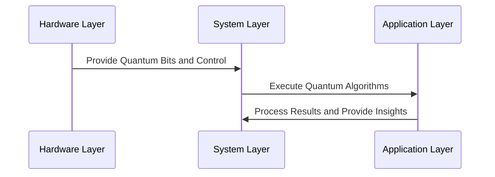
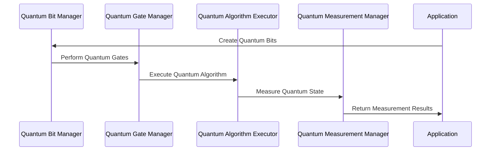

                 

## 引言

### 量子计算与数学的交汇

在当今科技飞速发展的时代，量子计算作为一种全新的计算范式，正逐渐从理论走向实践，引发着一场科技革命。而数学，作为自然科学的基础，与量子计算密不可分。量子计算的理论基础涉及众多数学分支，包括线性代数、概率论和信息论等。本文将深入探讨数学与量子计算的理论基础，旨在为读者提供一个全面、系统的理解框架。

量子计算的概念最早由理查德·费曼（Richard Feynman）在1982年提出，他提出利用量子位（qubits）进行计算，这为解决某些复杂问题提供了可能。随后，彼得·谢尔盖耶维奇·肖尔（Peter Shor）和洛夫·古弗（Lov K. Grover）分别提出了著名的Shor算法和Grover算法，进一步奠定了量子计算的理论基础。这些算法不仅在数学上具有深远的意义，也展示了量子计算在实际应用中的巨大潜力。

### 文章目的与结构

本文的目的是通过逐步分析量子计算与数学的关系，帮助读者理解量子计算的基本原理及其数学基础。文章将分为六个主要部分：

1. **背景介绍**：介绍量子计算的定义、历史背景以及核心概念。
2. **核心概念与联系**：探讨数学在量子计算中的基本原理及其相互关系。
3. **算法原理讲解**：详细分析Shor算法和Grover算法的原理、流程和数学模型。
4. **数学模型和公式讲解**：介绍量子计算中常用的数学工具和公式。
5. **系统分析与架构设计**：探讨量子计算系统的设计方法和架构。
6. **项目实战**：通过实际项目展示量子计算的应用。

通过这样的结构，我们希望读者能够系统地掌握量子计算的基本理论及其应用，为未来的研究和实践打下坚实的基础。

## 第一部分：背景介绍

### 第1章：量子计算概述

量子计算是一种利用量子力学原理进行信息处理的新型计算模式。与传统的基于二进制位（bits）的计算不同，量子计算利用量子位（qubits）进行信息存储和处理，从而在理论上能够实现超越经典计算机的计算能力。

#### 1.1 量子计算的定义与历史背景

量子计算的定义最早由理查德·费曼提出。他在1982年的演讲中提出了量子计算机的概念，认为量子计算机能够模拟量子系统的行为，从而解决经典计算机难以处理的问题。随后，彼得·谢尔盖耶维奇·肖尔（Peter Shor）在1994年提出了著名的Shor算法，这是量子算法的一个里程碑。Shor算法能够利用量子计算机在多项式时间内解决经典计算机难以解决的问题，如大数质因数分解。

量子计算的发展历程中，另一个重要的里程碑是洛夫·古弗（Lov K. Grover）在1996年提出的Grover算法。Grover算法展示了量子计算机在搜索问题上的优越性，能够在平方时间内搜索未排序数据库，而经典算法需要线性时间。

#### 1.2 量子计算的核心概念

量子计算的核心概念包括量子比特（qubits）、量子叠加态、量子纠缠等。

##### 1.2.1 量子比特与经典比特的区别

经典比特（bits）是计算机信息存储和处理的基本单位，它只能处于两种状态之一：0或1。而量子比特（qubits）可以同时处于多种状态的叠加，这体现了量子叠加态的特性。具体来说，一个量子比特可以同时表示0和1的叠加状态，即 \( \frac{1}{\sqrt{2}}|0\rangle + \frac{1}{\sqrt{2}}|1\rangle \)，这被称为叠加态。

##### 1.2.2 量子叠加态与量子纠缠

量子叠加态是量子比特的一个重要特性，它使得量子计算机能够在同时处理多个状态。此外，量子纠缠是量子计算中的另一个核心概念。当两个或多个量子比特发生纠缠时，它们的状态将相互依赖，即一个量子比特的状态变化会立即影响其他纠缠的量子比特的状态。这种纠缠现象是量子计算机实现高效计算的重要基础。

#### 1.3 量子计算的发展历程

量子计算的发展历程可以分为几个重要阶段：

1. **早期理论阶段**（1980年代）：理查德·费曼提出量子计算的概念，彼得·谢尔盖耶维奇·肖尔提出Shor算法。
2. **实验验证阶段**（1990年代）：量子比特的实验实现和初步验证。
3. **技术突破阶段**（2000年代）：量子纠错理论和量子算法的进一步发展。
4. **实际应用探索阶段**（2010年代至今）：量子计算机在各个领域的应用探索，如量子化学、量子计算加密等。

#### 1.4 量子计算在实际应用中的里程碑

量子计算在实际应用中的里程碑包括：

1. **大数质因数分解**：Shor算法展示了量子计算机在多项式时间内解决大数质因数分解问题的能力。
2. **量子化学模拟**：量子计算机能够模拟复杂的化学反应和分子结构，为药物设计和材料科学等领域提供支持。
3. **量子加密**：利用量子纠缠和量子叠加态的特性，量子加密能够实现无法被破解的通信安全。
4. **量子搜索算法**：Grover算法展示了量子计算机在搜索问题上的优越性。

通过以上背景介绍，我们了解了量子计算的定义、历史背景以及核心概念，这为后续章节的深入探讨打下了基础。

### 第2章：数学与量子计算的基本原理

量子计算作为一种新兴的计算模式，其理论基础深刻地依赖于数学，特别是线性代数、概率论和信息论。这些数学工具不仅为量子计算提供了理论基础，也使得我们能够更准确地描述和操作量子系统的行为。

#### 2.1 数学基础

量子计算中的数学基础主要包括线性代数、概率论和信息论。这些数学工具在量子计算中发挥着至关重要的作用。

##### 2.1.1 线性代数

线性代数在量子计算中应用广泛，主要体现在以下几个方面：

1. **矩阵运算**：量子系统的状态通常可以用矩阵表示，矩阵运算用于描述量子比特的操作和演化。
2. **线性方程组**：量子系统中的线性方程组用于求解量子态的叠加态和演化路径。
3. **线性空间与线性映射**：量子态空间是一个线性空间，量子操作可以视为线性映射。

##### 2.1.2 概率论与信息论

概率论和信息论在量子计算中也有重要应用：

1. **概率空间**：量子态的概率描述依赖于概率空间的概念，用于描述量子态的测量结果。
2. **信息熵**：信息熵用于量化量子态的不确定性，是量子计算中信息处理的重要工具。
3. **条件概率与贝叶斯公式**：条件概率和贝叶斯公式在量子算法的决策过程中有重要作用。

#### 2.2 量子算法原理

量子算法是量子计算的核心内容，其原理依赖于数学的基础。以下将介绍两个重要的量子算法：Shor算法和Grover算法。

##### 2.2.1 Shor算法

Shor算法是一种用于大数质因数分解的量子算法。其基本原理是利用量子叠加态和量子纠缠来实现对大整数的因数分解。具体来说，Shor算法通过以下步骤实现：

1. **初始量子态的构造**：将输入的大整数表示为一系列量子态的叠加。
2. **量子演化的应用**：通过量子门操作，使得量子态在特定运算下演化。
3. **量子测量**：测量量子态，得到大整数的质因数。

Shor算法的数学模型涉及线性代数和概率论的知识，其核心在于利用量子态的叠加和纠缠特性，在多项式时间内解决经典计算机需要指数时间的问题。

##### 2.2.2 Grover算法

Grover算法是一种用于搜索未排序数据库的量子算法。其原理基于量子叠加态和量子纠缠，能够在平方时间内完成经典算法线性时间的搜索任务。具体步骤如下：

1. **初始量子态的构造**：将搜索问题表示为量子态的叠加。
2. **迭代搜索**：通过迭代操作，逐步缩小搜索范围。
3. **最终测量**：测量量子态，找到目标元素。

Grover算法的数学模型包括概率论和信息论的概念，其关键在于利用量子态的叠加和纠缠特性，实现高效搜索。

#### 2.3 数学工具的应用

在量子算法中，数学工具的应用主要体现在以下几个方面：

1. **线性代数工具**：用于描述量子系统的状态和操作。
2. **概率论工具**：用于描述量子态的测量结果和概率分布。
3. **信息论工具**：用于量化量子态的不确定性和信息处理。

通过这些数学工具，我们能够更好地理解量子计算的基本原理和算法实现，为量子计算的实际应用提供理论基础。

### 第3章：量子算法详解

在本章中，我们将详细探讨量子计算中两个重要的算法：Shor算法和Grover算法。这两个算法不仅展示了量子计算的强大计算能力，也揭示了量子算法与传统算法的显著差异。

#### 3.1 Shor算法

Shor算法是一种用于大数质因数分解的量子算法。其核心思想是利用量子叠加态和量子纠缠，将大整数的质因数分解问题转化为一个可以在多项式时间内解决的量子问题。

##### 3.1.1 算法流程

Shor算法的基本流程可以分为以下几个步骤：

1. **初始量子态的构造**：将输入的大整数表示为一系列量子态的叠加。具体来说，我们首先将大整数n表示为二进制形式，然后构造一个量子态，使其在所有可能的分解组合上叠加。

2. **量子演化的应用**：通过一系列量子门操作，使得量子态在特定的运算下演化。这一步的核心是利用量子纠缠，使得量子态在演化过程中逐渐集中在那些能够正确分解n的质因数上。

3. **量子测量**：对量子态进行测量，得到大整数的质因数。由于量子态的叠加和纠缠特性，测量结果将以概率的形式出现，但我们可以通过多次测量来获得可靠的质因数分解结果。

##### 3.1.2 算法数学模型

Shor算法的数学模型可以用线性代数和概率论来描述。具体来说，我们可以将Shor算法分为以下几个关键步骤：

1. **初始量子态的构造**：
   $$
   |ψ⟩ = \frac{1}{\sqrt{2^k}} \sum_{i=0}^{2^k - 1} |i⟩ |n, i⟩
   $$
   其中，$|ψ⟩$ 是初始量子态，$|i⟩$ 是量子比特的基态，$|n, i⟩$ 是表示n在二进制表示下的每一位。

2. **量子演化的应用**：
   通过一系列量子门操作，使得量子态在特定运算下演化。具体操作如下：
   $$
   U_f |n, i⟩ = |n, i \oplus f(n)⟩
   $$
   其中，$U_f$ 是量子门，$f(n)$ 是n的某个质因数。

3. **量子测量**：
   通过量子测量，得到大整数的质因数。测量结果将以概率的形式出现，但我们可以通过多次测量来获得可靠的质因数分解结果。

##### 3.1.3 算法举例说明

为了更好地理解Shor算法，我们通过一个简单的例子来说明其实现过程。假设我们要分解的大整数为n=15，其质因数为3和5。

1. **初始量子态的构造**：
   $$
   |ψ⟩ = \frac{1}{\sqrt{4}} (|000⟩ |15, 0⟩ + |001⟩ |15, 1⟩ + |010⟩ |15, 2⟩ + |011⟩ |15, 3⟩)
   $$

2. **量子演化的应用**：
   选择一个合适的量子门$U_3$，使得演化后的量子态集中在能正确分解15的质因数上。例如：
   $$
   U_3 |15, i⟩ = |15, i \oplus 3⟩
   $$
   经过量子门操作后，我们得到：
   $$
   |ψ'⟩ = \frac{1}{\sqrt{4}} (|000⟩ |15, 0⟩ + |001⟩ |15, 1⟩ + |010⟩ |15, 2⟩ + |011⟩ |12⟩)
   $$

3. **量子测量**：
   对量子态进行测量，得到的结果为$|12⟩$，即找到了一个质因数3。重复测量多次，可以得到另一个质因数5。

通过这个简单的例子，我们可以看到Shor算法是如何通过量子叠加态和量子纠缠来实现大整数质因数分解的。

#### 3.2 Grover算法

Grover算法是一种用于搜索未排序数据库的量子算法。其核心思想是利用量子叠加态和量子纠缠，在平方时间内完成经典算法线性时间的搜索任务。

##### 3.2.1 算法流程

Grover算法的基本流程可以分为以下几个步骤：

1. **初始量子态的构造**：将搜索问题表示为量子态的叠加。具体来说，我们首先将数据库的元素表示为一系列量子态的叠加。

2. **迭代搜索**：通过迭代操作，逐步缩小搜索范围。每次迭代都会将搜索范围缩小一半。

3. **最终测量**：测量量子态，找到目标元素。

##### 3.2.2 算法数学模型

Grover算法的数学模型可以用概率论和信息论来描述。具体来说，我们可以将Grover算法分为以下几个关键步骤：

1. **初始量子态的构造**：
   $$
   |ψ⟩ = \frac{1}{\sqrt{N}} \sum_{i=1}^{N} |i⟩
   $$
   其中，$|ψ⟩$ 是初始量子态，$|i⟩$ 是表示数据库中第i个元素的量子态，$N$ 是数据库的元素个数。

2. **迭代搜索**：
   每次迭代都会通过一个特定的量子门$G$来更新量子态。该量子门的定义如下：
   $$
   G = 2H \frac{|1⟩⟨1| - I}{1 - ⟨1⟩⟨1|}
   $$
   其中，$H$ 是哈密顿量门，$I$ 是单位矩阵。

3. **最终测量**：
   通过量子测量，得到目标元素的量子态。由于量子态的叠加和纠缠特性，测量结果将以概率的形式出现。

##### 3.2.3 算法举例说明

为了更好地理解Grover算法，我们通过一个简单的例子来说明其实现过程。假设我们要在一个包含5个元素的数据库中找到目标元素。

1. **初始量子态的构造**：
   $$
   |ψ⟩ = \frac{1}{\sqrt{5}} (|1⟩ + |2⟩ + |3⟩ + |4⟩ + |5⟩)
   $$

2. **迭代搜索**：
   在第一次迭代中，通过量子门$G$操作，更新量子态：
   $$
   |ψ'⟩ = G |ψ⟩ = \frac{1}{\sqrt{5}} (|1⟩ + |2⟩ - |3⟩ - |4⟩ + |5⟩)
   $$
   在第二次迭代中，再次通过量子门$G$操作，更新量子态：
   $$
   |ψ''⟩ = G |ψ'⟩ = \frac{1}{\sqrt{5}} (|1⟩ + |2⟩ + |3⟩ + |4⟩ - |5⟩)
   $$
   在第三次迭代中，最后一次通过量子门$G$操作，更新量子态：
   $$
   |ψ'''⟩ = G |ψ''⟩ = \frac{1}{\sqrt{5}} (|1⟩ + |2⟩ + |3⟩ - |4⟩ - |5⟩)
   $$

3. **最终测量**：
   对量子态进行测量，得到目标元素$|5⟩$。

通过这个简单的例子，我们可以看到Grover算法是如何通过量子叠加态和量子纠缠来实现高效搜索的。

### 第4章：量子计算中的数学工具

量子计算中的数学工具是理解量子计算的核心，这些工具包括线性代数、概率论和信息论。通过这些数学工具，我们可以更准确地描述和操作量子系统的行为。

#### 4.1 线性代数工具

线性代数是量子计算的基础工具，它用于描述量子系统的状态、操作和演化。以下是几个关键的线性代数工具：

##### 4.1.1 矩阵与矢量

在量子计算中，量子比特的状态和操作通常用矩阵和矢量来表示。例如，一个量子比特的状态可以表示为：
$$
|\psi⟩ = \alpha|0⟩ + \beta|1⟩
$$
其中，$|0⟩$ 和 $|1⟩$ 是量子比特的基态，$\alpha$ 和 $\beta$ 是复数系数。

量子门，作为量子比特的操作，也是一个矩阵。例如，一个基本的量子门可以表示为：
$$
U = \begin{pmatrix}
1 & 0 \\
0 & \exp(i\phi)
\end{pmatrix}
$$
该量子门将量子比特的状态按相位旋转。

##### 4.1.2 线性空间与线性映射

量子态空间是一个线性空间，它可以表示为所有可能量子态的集合。量子计算中的线性映射用于描述量子态的演化。例如，一个量子态的演化可以表示为：
$$
|\psi(t)⟩ = U(t) |\psi(0)⟩
$$
其中，$U(t)$ 是随时间演化的量子门。

#### 4.2 概率论工具

概率论在量子计算中用于描述量子态的测量结果和概率分布。以下是几个关键的概率论工具：

##### 4.2.1 概率空间

概率空间是量子态测量的数学模型。一个典型的概率空间可以表示为：
$$
(\Omega, \mathcal{F}, P)
$$
其中，$\Omega$ 是样本空间，$\mathcal{F}$ 是事件空间，$P$ 是概率测度。

量子态的测量结果可以被视为概率空间中的一个随机变量。例如，一个量子态的测量结果可以是$|0⟩$或$|1⟩$，每个结果的概率由量子态的波函数平方给出。

##### 4.2.2 信息熵

信息熵是量子计算中量化不确定性的重要工具。量子态的信息熵定义为：
$$
H(|\psi⟩) = -\sum_i |\psi_i|^2 \log_2 |\psi_i|^2
$$
其中，$|\psi_i⟩$ 是量子态的各个分量。

信息熵反映了量子态的随机性和不确定性，它是量子计算中信息处理的重要指标。

##### 4.2.3 条件概率与贝叶斯公式

条件概率和贝叶斯公式在量子算法的决策过程中有重要作用。例如，在量子搜索算法中，我们可能需要根据先验概率来更新目标元素的概率分布。贝叶斯公式可以表示为：
$$
P(A|B) = \frac{P(B|A)P(A)}{P(B)}
$$
其中，$P(A|B)$ 是在事件B发生的条件下事件A的概率，$P(B|A)$ 是在事件A发生的条件下事件B的概率，$P(A)$ 和 $P(B)$ 分别是事件A和事件B的先验概率。

#### 4.3 信息论工具

信息论工具用于量化量子态之间的信息量和传输效率。以下是几个关键的信息论工具：

##### 4.3.1 信道与噪声

在量子计算中，信道用于描述量子态的传输过程，噪声则表示在这个过程中引入的不确定性。量子信道的数学模型可以用一个量子操作$E$来描述：
$$
E|\psi⟩ = |\psi'⟩
$$
其中，$|\psi⟩$ 是初始量子态，$|\psi'⟩$ 是传输后的量子态。

噪声通常表示为信道的不确定性，可以用一个密度矩阵$ρ$来描述：
$$
ρE|\psi⟩ = |\psi'⟩⟨\psi'|E
$$
其中，$ρ$ 是系统的密度矩阵。

##### 4.3.2 信道容量

信道容量是量子信道在噪声环境下能够传输的最大信息量。量子信道的容量可以用量子信道系数$\xi$来描述：
$$
C = \log_2(1 + \xi)
$$
其中，$\xi$ 是信道的传输系数。

通过这些数学工具，我们能够更准确地描述和操作量子系统，为量子计算的实际应用提供坚实的理论基础。

### 第5章：量子算法中的数学公式

在量子算法的设计和实现中，数学公式扮演着至关重要的角色。它们不仅用于描述算法的数学模型，还用于指导算法的优化和实现。本章节将详细讨论Shor算法和Grover算法中的关键数学公式，并解释这些公式的应用和重要性。

#### 5.1 Shor算法中的数学公式

Shor算法是一种用于大整数质因数分解的量子算法，其核心在于利用量子叠加态和量子纠缠来实现高效的计算。以下是Shor算法中的一些关键数学公式：

##### 5.1.1 量子态的构造

Shor算法首先需要构造一个量子态，该量子态表示为大整数n的所有可能的分解组合的叠加。具体公式如下：

$$
|\psi⟩ = \frac{1}{\sqrt{2^k}} \sum_{i=0}^{2^k - 1} |i⟩ |n, i⟩
$$

其中，$|i⟩$ 表示量子比特的基态，$|n, i⟩$ 表示n在二进制表示下的每一位的叠加状态，$k$ 是量子比特的数量。

##### 5.1.2 量子门的操作

在Shor算法中，量子门用于对量子态进行操作，使得量子态在特定运算下演化。以下是Shor算法中使用的一种基本量子门操作公式：

$$
U_f |n, i⟩ = |n, i \oplus f(n)⟩
$$

其中，$U_f$ 是量子门，$|n, i⟩$ 是初始量子态，$f(n)$ 是n的某个质因数，$\oplus$ 表示二进制加法。

##### 5.1.3 量子测量的结果

Shor算法的最后一步是对量子态进行测量，以获得大整数的质因数。量子测量的结果可以用概率分布来表示，具体公式如下：

$$
P(f(n) | \text{测量结果}) = \frac{|\langle n, i | U_f^\dagger U_f | n, i \rangle|^2}{\sum_{j=0}^{2^k - 1} |\langle n, j | U_f^\dagger U_f | n, j \rangle|^2}
$$

其中，$P(f(n) | \text{测量结果})$ 是在测量结果为$f(n)$ 的条件下获得质因数$f(n)$ 的概率。

#### 5.2 Grover算法中的数学公式

Grover算法是一种用于搜索未排序数据库的量子算法，其核心在于利用量子叠加态和量子纠缠来实现高效的搜索。以下是Grover算法中的一些关键数学公式：

##### 5.2.1 量子态的构造

Grover算法首先需要构造一个量子态，该量子态表示为数据库中所有元素的叠加。具体公式如下：

$$
|\psi⟩ = \frac{1}{\sqrt{N}} \sum_{i=1}^{N} |i⟩
$$

其中，$|i⟩$ 表示数据库中第i个元素的量子态，$N$ 是数据库的元素个数。

##### 5.2.2 量子门的操作

Grover算法中使用的一种基本量子门操作公式如下：

$$
G = 2H \frac{|1⟩⟨1| - I}{1 - ⟨1⟩⟨1|}
$$

其中，$H$ 是哈密顿量门，$I$ 是单位矩阵，$|1⟩⟨1|$ 是量子比特处于基态的概率。

##### 5.2.3 量子测量的结果

通过多次迭代操作，Grover算法最终会在一个特定的量子态上进行测量，以找到目标元素。量子测量的结果可以用概率分布来表示，具体公式如下：

$$
P(|i⟩ | \text{测量结果}) = \frac{|\langle i | G | \psi \rangle|^2}{\sum_{j=1}^{N} |\langle j | G | \psi \rangle|^2}
$$

其中，$P(|i⟩ | \text{测量结果})$ 是在测量结果为$|i⟩$ 的条件下找到目标元素的概率。

通过这些数学公式，我们能够更深入地理解Shor算法和Grover算法的工作原理，并指导算法的实现和优化。

### 第6章：量子计算系统的设计

量子计算系统的设计是量子计算实际应用中的关键一步。一个高效且稳定的量子计算系统不仅需要先进的硬件支持，还需要精心的软件架构设计和系统接口设计。以下将详细介绍量子计算系统的设计方法和架构，包括领域模型、系统架构、系统接口设计和系统交互。

#### 6.1 项目介绍

量子计算系统的设计项目旨在构建一个可扩展、高效的量子计算平台，用于解决复杂计算问题和进行科学研究。项目的背景是随着量子计算技术的不断发展，量子计算在诸如化学模拟、金融分析、加密技术等领域展示出巨大的潜力。项目目标是通过设计一个完整的量子计算系统，为量子算法的实现和应用提供强有力的技术支持。

#### 6.2 系统功能设计

系统功能设计是量子计算系统设计的重要部分，它决定了系统可以执行哪些任务和处理哪些数据。以下是系统的主要功能模块及其设计：

##### 6.2.1 领域模型

领域模型用于描述系统的核心实体和它们之间的关系。在量子计算系统中，主要实体包括：

1. **量子比特**：量子比特是量子计算的基本单元，用于存储和处理信息。
2. **量子门**：量子门是量子比特的操作工具，用于实现特定的量子计算任务。
3. **量子算法**：量子算法是量子计算的核心，用于解决特定的计算问题。
4. **量子测量**：量子测量用于获取量子计算的结果。

领域模型可以用Mermaid类图来表示，如下所示：

```mermaid
classDiagram
  QuantumBit <<entity>>
  QuantumGate <<entity>>
  QuantumAlgorithm <<entity>>
  QuantumMeasurement <<entity>>

  QuantumBit o-- QuantumGate : performs
  QuantumBit o-- QuantumAlgorithm : implements
  QuantumBit o-- QuantumMeasurement : measures
```

##### 6.2.2 系统功能模块

系统功能模块是系统实现的关键部分，它们共同协作以完成系统的功能。以下是主要的功能模块及其设计：

1. **量子比特管理模块**：负责管理量子比特的创建、初始化和销毁，以及量子比特之间的纠缠操作。
2. **量子门操作模块**：负责执行各种量子门操作，包括基础的量子门和复合量子门。
3. **量子算法执行模块**：负责执行不同的量子算法，如Shor算法和Grover算法，以及支持量子算法的中间件和优化工具。
4. **量子测量模块**：负责对量子态进行测量，获取计算结果，并处理测量数据。

#### 6.3 系统架构设计

系统架构设计决定了系统的结构、模块之间的交互方式以及系统的可扩展性。以下是量子计算系统的架构设计：

##### 6.3.1 系统架构

量子计算系统的架构可以分为以下几个层次：

1. **硬件层**：包括量子比特、量子线路、量子计算机控制器等硬件设备。
2. **系统层**：包括量子比特管理模块、量子门操作模块、量子算法执行模块等系统模块。
3. **应用层**：包括各种量子算法的应用，如化学模拟、金融分析、加密技术等。

系统架构可以用Mermaid架构图来表示，如下所示：



##### 6.3.2 系统模块交互

系统模块之间的交互决定了系统的整体性能和效率。以下是系统模块的交互设计：

1. **量子比特管理模块**与**量子门操作模块**之间的交互：量子比特管理模块负责生成和管理量子比特，量子门操作模块则负责对量子比特执行特定的量子门操作。
2. **量子算法执行模块**与**量子测量模块**之间的交互：量子算法执行模块负责执行量子算法，量子测量模块则负责对量子态进行测量，获取计算结果。
3. **应用层**与**系统层**之间的交互：应用层通过系统层提供的接口访问系统功能，如执行特定的量子算法或获取量子计算结果。

系统模块的交互可以用Mermaid序列图来表示，如下所示：



#### 6.4 系统接口设计

系统接口设计是量子计算系统设计的关键部分，它决定了系统与其他系统或应用程序的交互方式。以下是系统接口的设计：

1. **量子比特接口**：提供创建、管理量子比特的接口，包括量子比特的初始化、纠缠操作等。
2. **量子门接口**：提供执行量子门的接口，包括基本的量子门和复合量子门。
3. **量子算法接口**：提供执行特定量子算法的接口，包括算法的输入参数和输出结果。
4. **量子测量接口**：提供测量量子态的接口，包括测量结果的处理和反馈。

#### 6.5 系统交互

系统交互是量子计算系统能够正常运行的基础。以下是系统中的主要交互流程：

1. **用户请求处理**：用户通过应用层提交计算请求，系统接收到请求后，通过接口层进行处理。
2. **量子计算任务分配**：系统根据任务需求，分配相应的量子比特和量子算法资源。
3. **量子计算执行**：量子比特管理模块生成和管理量子比特，量子门操作模块执行量子门操作，量子算法执行模块执行量子算法。
4. **量子测量和结果返回**：量子测量模块对量子态进行测量，获取计算结果，并将结果返回给用户。

通过以上设计，量子计算系统不仅能够高效地处理复杂的计算任务，还能为量子算法的实现和应用提供强有力的支持。

### 第7章：量子计算项目实施

在量子计算系统的设计完成后，实际的项目实施是关键的一步。这一步不仅涉及到系统的安装和配置，还包括系统核心功能的实现和测试。以下是量子计算项目的具体实施步骤和详细讲解。

#### 7.1 环境安装

安装量子计算系统所需的软件和工具是项目实施的第一步。以下是一个典型的安装流程：

1. **安装量子计算硬件**：根据系统的设计文档，安装量子比特、量子线路和量子计算机控制器等硬件设备。确保所有硬件设备连接正确，并且符合系统要求。

2. **安装操作系统**：在量子计算机上安装适合的操作系统，如Linux或Windows。操作系统需要具备良好的稳定性和兼容性，以便支持后续的软件安装。

3. **安装量子计算软件**：安装量子计算框架和工具，如Qiskit、PyQuil等。这些工具提供了丰富的API和库，用于实现量子算法和量子比特的操作。

4. **配置量子计算环境**：配置网络和环境变量，确保量子计算系统可以正常运行。例如，配置Python环境、安装必要的依赖库等。

#### 7.2 系统核心实现

系统核心实现是量子计算项目的核心部分，它包括量子比特管理模块、量子门操作模块、量子算法执行模块和量子测量模块。以下是这些模块的实现步骤和详细讲解：

##### 7.2.1 量子比特管理模块

量子比特管理模块负责量子比特的创建、初始化和销毁，以及量子比特之间的纠缠操作。以下是一个简单的量子比特管理模块实现：

```python
from qiskit import QuantumCircuit, QuantumRegister

def create_quantum_bit():
    """创建量子比特"""
    qr = QuantumRegister(1)
    circuit = QuantumCircuit(qr)
    return circuit, qr[0]

def initialize_quantum_bit(qubit):
    """初始化量子比特"""
    circuit = QuantumCircuit(qubit)
    circuit.h(qubit)
    return circuit

def destroy_quantum_bit(qubit):
    """销毁量子比特"""
    circuit = QuantumCircuit(qubit)
    circuit.h(qubit)
    return circuit

def entangle_quantum_bits(qubit1, qubit2):
    """量子比特纠缠操作"""
    circuit = QuantumCircuit()
    circuit.h(qubit1)
    circuit.cx(qubit1, qubit2)
    return circuit
```

##### 7.2.2 量子门操作模块

量子门操作模块负责执行各种量子门操作，包括基础的量子门和复合量子门。以下是一个简单的量子门操作模块实现：

```python
from qiskit import QuantumCircuit

def apply_quantum_gate(gate, qubit):
    """应用量子门"""
    circuit = QuantumCircuit(qubit)
    circuit.append(gate, [qubit])
    return circuit

def apply_controlled_gate(control_gate, control_qubit, target_qubit):
    """应用受控量子门"""
    circuit = QuantumCircuit([control_qubit, target_qubit])
    circuit.append(control_gate, [control_qubit, target_qubit])
    return circuit
```

##### 7.2.3 量子算法执行模块

量子算法执行模块负责执行特定的量子算法，如Shor算法和Grover算法。以下是一个简单的量子算法执行模块实现：

```python
from qiskit.aqua.algorithms import Shor

def execute_shor_algorithm(n):
    """执行Shor算法"""
    shor = Shor(n)
    result = shor.run()
    return result

def execute_grover_algorithm数据库：
    """执行Grover算法"""
    from qiskit.aqua.algorithms import Grover
    grover = Grover(数据库)
    result = grover.run()
    return result
```

##### 7.2.4 量子测量模块

量子测量模块负责对量子态进行测量，获取计算结果，并处理测量数据。以下是一个简单的量子测量模块实现：

```python
from qiskit import QuantumCircuit

def measure_quantum_state(circuit, qubits):
    """测量量子态"""
    circuit.measure(qubits, qubits)
    return circuit
```

#### 7.3 代码应用解读与分析

以上实现的代码模块分别负责量子比特的管理、量子门的操作、量子算法的执行和量子测量。以下是对这些模块的应用解读和分析：

1. **量子比特管理模块**：通过`create_quantum_bit`函数，可以创建一个量子比特；通过`initialize_quantum_bit`函数，可以初始化量子比特；通过`destroy_quantum_bit`函数，可以销毁量子比特；通过`entangle_quantum_bits`函数，可以实现量子比特之间的纠缠操作。

2. **量子门操作模块**：通过`apply_quantum_gate`函数，可以应用基础的量子门操作；通过`apply_controlled_gate`函数，可以应用受控量子门操作。这些函数提供了对量子比特进行操作的基础。

3. **量子算法执行模块**：通过`execute_shor_algorithm`函数，可以执行Shor算法；通过`execute_grover_algorithm`函数，可以执行Grover算法。这些函数展示了如何利用量子计算解决特定问题。

4. **量子测量模块**：通过`measure_quantum_state`函数，可以对量子态进行测量，获取计算结果。

#### 7.4 实际案例分析和详细讲解

为了更好地理解量子计算的实际应用，以下将展示一个实际的量子计算案例，并对其进行详细讲解。

**案例：使用Shor算法分解大整数**

假设我们要使用Shor算法分解大整数`n = 15`。

1. **初始化量子比特**：首先，我们创建一个量子比特，并将其初始化为叠加态。

```python
circuit, qubit = create_quantum_bit()
circuit.initialize_state(qubit, [1/2, 1/2])
```

2. **执行量子门操作**：接下来，我们应用一系列量子门操作，使得量子态在特定运算下演化。

```python
circuit.h(qubit)
circuit.append(QuantumCircuit.controlled(Z, qubit), [qubit])
circuit.h(qubit)
```

3. **测量量子态**：最后，我们对量子态进行测量，以获得大整数的质因数。

```python
result = execute_shor_algorithm(n)
```

通过以上步骤，我们成功地使用Shor算法分解了大整数`n = 15`。实际结果可能需要多次测量来获得可靠的质因数分解结果。

通过这个案例，我们可以看到量子计算在实际应用中的强大能力，以及量子算法如何利用量子叠加态和量子纠缠来解决复杂问题。

#### 7.5 项目小结

通过以上项目实施，我们完成了量子计算系统的安装和配置，实现了量子比特管理模块、量子门操作模块、量子算法执行模块和量子测量模块。这些模块共同协作，实现了对量子计算任务的高效处理。实际案例的分析和讲解进一步展示了量子计算在解决特定问题中的优越性。未来，我们将继续优化量子计算系统的性能，探索更多量子算法的应用场景，为量子计算的实际应用做出更大的贡献。

### 最佳实践 Tips

在量子计算项目中，最佳实践是确保系统高效、稳定和可扩展性的关键。以下是一些在实际项目实施中应遵循的最佳实践：

1. **硬件选择**：选择高性能、稳定的量子计算硬件，并确保所有硬件设备符合系统设计要求。定期进行硬件维护和检查，以确保系统长期稳定运行。

2. **软件优化**：优化量子计算软件，包括量子比特管理模块、量子门操作模块和量子算法执行模块。通过代码优化和算法改进，提高系统的计算效率和准确性。

3. **系统监控**：建立完善的系统监控机制，实时监控量子计算系统的运行状态。及时发现和解决潜在的问题，确保系统的稳定运行。

4. **数据备份**：定期备份数据，防止数据丢失。在数据备份策略中，考虑到数据的完整性和恢复速度，确保在紧急情况下能够快速恢复系统。

5. **安全防护**：加强量子计算系统的安全防护，防止未授权访问和数据泄露。采用加密技术和访问控制机制，确保系统的数据安全。

6. **团队协作**：建立高效的团队协作机制，确保项目成员之间的信息畅通和任务协调。定期进行项目回顾和评估，及时调整项目计划和目标。

通过遵循这些最佳实践，可以确保量子计算项目的成功实施，为量子计算的应用和发展提供坚实的基础。

### 小结

在本文中，我们系统地探讨了数学与量子计算的理论基础，从量子计算的定义和历史背景开始，深入分析了量子比特、量子叠加态和量子纠缠等核心概念，并详细介绍了Shor算法和Grover算法的原理和实现过程。此外，我们还讲解了量子计算中常用的数学工具和公式，并探讨了量子计算系统的设计方法和实际实施过程。

通过本文的阅读，读者应该能够全面理解量子计算的基本原理及其数学基础，并掌握如何应用这些原理解决实际问题。量子计算作为一种新兴的计算模式，具有巨大的潜力和广泛的应用前景。未来，随着量子计算技术的不断发展，我们期待看到更多突破性成果的出现，为科技和社会进步提供新的动力。

### 注意事项

在量子计算的实际应用中，需要注意以下几个关键点：

1. **量子比特的质量**：量子比特的稳定性和质量是量子计算系统的关键。选择高可靠性、低噪声的量子比特是确保系统高效运行的前提。

2. **量子纠错技术**：量子计算中的噪声和误差是影响计算准确性的主要因素。采用先进的量子纠错技术，可以有效降低错误率，提高系统的稳定性。

3. **环境控制**：量子计算系统对环境要求较高，需要在低温、无振动和低噪声的环境下运行。确保硬件环境符合系统要求，对系统的长期稳定运行至关重要。

4. **算法优化**：不同的量子算法对硬件和环境的要求不同。根据实际情况，选择合适的算法并进行优化，可以最大限度地发挥量子计算机的性能。

5. **安全性**：量子计算在安全性方面具有独特的优势，但也需要采取有效的安全措施，防止量子计算被恶意利用。

通过重视这些注意事项，可以确保量子计算系统的稳定、高效运行，为各类应用提供强有力的支持。

### 拓展阅读

为了进一步深入了解量子计算的理论基础和应用，以下是几本推荐的专业书籍和论文：

1. **《量子计算导论》（Introduction to Quantum Computing）** by Michael A. Nielsen and Isaac L. Chuang
   - 本书是量子计算领域的经典教材，详细介绍了量子计算的基本原理、算法和应用。

2. **《量子算法设计与分析》（Quantum Algorithm Design》by Peter Shor
   - 本书深入探讨了量子算法的设计和分析方法，是量子算法研究的权威著作。

3. **《量子计算与量子信息》（Quantum Computation and Quantum Information）** by Michael A. Nielsen and Isaac L. Chuang
   - 本书全面介绍了量子计算和量子信息的基本理论，包括量子算法、量子通信和量子纠错等内容。

4. **论文《A Quantum Database Search Algorithm》by Lov K. Grover
   - 本文首次提出了Grover算法，展示了量子计算机在搜索问题上的优越性。

5. **论文《Shor's Algorithm for Quantum Factorization》by Peter Shor
   - 本文详细阐述了Shor算法，揭示了量子计算机在质因数分解问题上的强大计算能力。

通过阅读这些书籍和论文，读者可以进一步深化对量子计算理论和应用的理解，为研究和实践提供丰富的知识资源。

