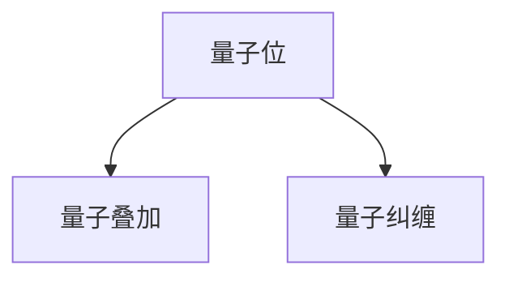
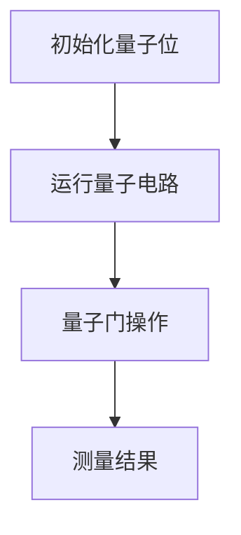
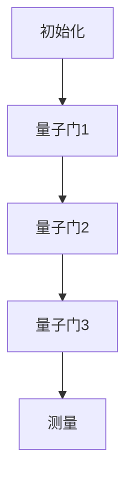
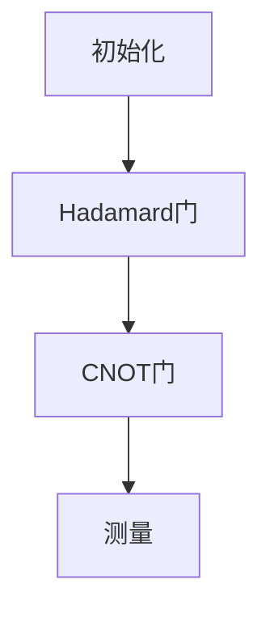
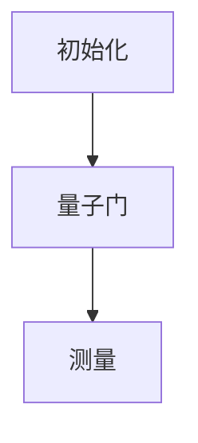
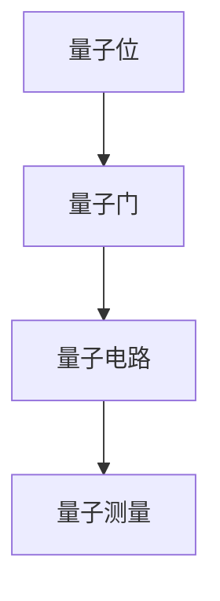
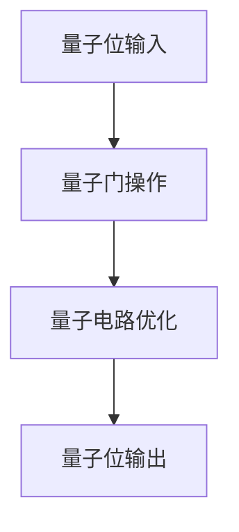
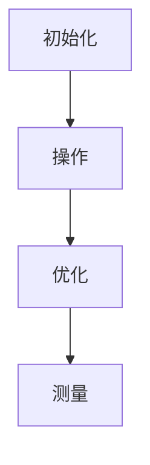

                 


### 第一部分：量子计算概述

#### 1.1 量子计算的定义与基本概念

量子计算是计算机科学中的一个前沿领域，它利用量子力学的原理来处理和存储信息。与传统的经典计算机不同，量子计算机使用量子位（qubit）来表示和处理信息，而不是传统的比特（bit）。

**核心概念术语说明：**
- 量子位（qubit）：量子计算机的基本信息单元，它可以同时存在于多种状态，这与经典比特的二进制状态不同。
- 量子叠加：量子位可以处于多个状态的叠加，而不是单一状态。
- 量子纠缠：两个或多个量子位之间存在的一种特殊的连接状态，即使它们相隔很远，一个量子位的状态也会影响另一个量子位的状态。

**问题背景：**
量子计算的概念最早由理查德·费曼在1981年提出，此后，随着量子力学和计算机科学的发展，量子计算的理论和实验研究逐渐深入。

**问题描述：**
量子计算的基本问题是如何利用量子力学的原理来高效地解决计算问题。

**问题解决：**
量子计算通过量子位、量子叠加和量子纠缠来实现高效的计算，它可以处理一些经典计算机无法解决的问题，如大整数的质因数分解和量子模拟。

**边界与外延：**
量子计算的研究不仅限于理论，还包括实验和工程实现。量子计算机的核心是量子处理器，它由量子位和量子门组成，量子门是量子计算机的基本操作单元。

**概念结构与核心要素组成：**
量子计算的核心概念包括量子位、量子叠加、量子纠缠和量子门。量子位是量子计算机的信息单元，量子叠加和量子纠缠是实现高效计算的关键，量子门则是实现量子操作的核心。

#### 1.2 量子计算机的工作原理

量子计算机的工作原理基于量子力学的三个核心概念：量子位、量子叠加和量子纠缠。

**核心概念原理：**
- 量子位（qubit）：量子计算机的基本信息单元，它可以处于多种状态的叠加。
- 量子叠加：量子位可以同时处于多个状态，这为量子计算机提供了并行计算的能力。
- 量子纠缠：量子位之间存在一种特殊的连接状态，这种状态使得量子计算机可以同时处理多个问题。

**概念属性特征对比表格：**

| 概念       | 描述                                                         | 对比传统比特                 |
|------------|--------------------------------------------------------------|------------------------------|
| 量子位     | 可以同时处于多种状态的叠加。                                  | 只能处于0或1的单一状态。      |
| 量子叠加   | 量子位可以同时存在于多个状态。                               | 经典比特只能处于一个状态。    |
| 量子纠缠   | 两个或多个量子位之间存在特殊的连接状态。                     | 经典比特之间不存在这种状态。  |

**ER实体关系图架构的Mermaid流程图：**


**算法原理讲解：**

量子计算机通过量子门对量子位进行操作。量子门是量子计算机的基本操作单元，它对量子位的状态进行线性变换。量子计算机的工作原理可以概括为以下步骤：

1. 初始化：将量子位初始化为特定的状态。
2. 运行量子电路：通过一系列量子门对量子位进行操作。
3. 测量：对量子位进行测量，得到最终的结果。

**Mermaid算法流程图：**


**Python源代码示例：**
```python
import numpy as np

# 定义量子位
qbit = np.array([[1], [0]])

# 定义量子门
gate = np.array([[1, 0], [0, 1]])

# 应用量子门
qbit = np.dot(qbit, gate)

# 测量量子位
result = np.random.choice([0, 1], p=[0.5, 0.5])

print("测量结果：", result)
```

**数学模型和公式详细讲解与举例说明：**

量子计算的核心是量子门和量子电路。量子门是量子计算机的基本操作单元，它对量子位的状态进行线性变换。量子电路是由一系列量子门组成的，它用于实现特定的计算任务。

**Mermaid量子电路图：**


**LaTeX数学模型公式：**
$$
U = \sum_{i=0}^{n} |i\rangle\langle{i}|,
$$
其中，$U$表示量子门，$|i\rangle$表示量子位的状态，$\langle{i}|$表示量子位的共轭转置。

**举例说明：**

假设我们有一个2量子位的量子电路，它包含一个Hadamard门和一个CNOT门。Hadamard门是一个基本的量子门，它将量子位的状态从$|0\rangle$变换为$\frac{1}{\sqrt{2}}(|0\rangle + |1\rangle)$。CNOT门是一个控制非门，它将第二个量子位的状态反转，如果第一个量子位处于状态$|1\rangle$。

**量子电路：**


**Python源代码示例：**
```python
import numpy as np

# 定义量子位
qbit1 = np.array([[1], [0]])
qbit2 = np.array([[1], [0]])

# 定义Hadamard门
hadamard_gate = np.array([[1, 0], [0, 1]])

# 定义CNOT门
cnot_gate = np.array([[1, 0, 0, 0],
                      [0, 1, 0, 0],
                      [0, 0, 0, 1],
                      [0, 0, 1, 0]])

# 应用Hadamard门
qbit1 = np.dot(hadamard_gate, qbit1)

# 应用CNOT门
qbit2 = np.dot(cnot_gate, qbit1)

# 测量结果
result1 = np.random.choice([0, 1], p=[0.5, 0.5])
result2 = np.random.choice([0, 1], p=[0.5, 0.5])

print("测量结果：", result1, result2)
```

**数学模型和公式详细讲解与举例说明：**

在量子计算中，量子门是一个核心概念。量子门是量子计算机的基本操作单元，它对量子位的状态进行线性变换。量子门可以表示为矩阵，矩阵的行和列分别对应量子位的初始状态和变换后的状态。

**LaTeX数学模型公式：**
$$
U_{ij} = \begin{cases}
1 & \text{如果 } i=j, \\
0 & \text{如果 } i\neq j.
\end{cases}
$$

**举例说明：**

假设我们有一个2量子位的量子门，它是一个2x2的矩阵。这个量子门将量子位的状态从$|00\rangle$变换为$|01\rangle$。

**量子门矩阵：**
$$
U = \begin{bmatrix}
1 & 0 \\
0 & 1
\end{bmatrix}
$$

**量子电路图：**


**Python源代码示例：**
```python
import numpy as np

# 定义量子位
qbit1 = np.array([[1], [0]])
qbit2 = np.array([[1], [0]])

# 定义量子门
gate = np.array([[1, 0],
                 [0, 1]])

# 应用量子门
qbit1 = np.dot(gate, qbit1)

# 测量结果
result1 = np.random.choice([0, 1], p=[0.5, 0.5])
result2 = np.random.choice([0, 1], p=[0.5, 0.5])

print("测量结果：", result1, result2)
```

**系统分析与架构设计方案：**

量子计算机的架构设计需要考虑多个方面，包括量子位的初始化、量子门的操作、量子电路的优化和量子位的测量。

**问题场景介绍：**
量子计算机的架构设计旨在实现高效、稳定和可扩展的量子计算。

**项目介绍：**
本项目旨在设计一个简单的量子计算机架构，包括量子位的初始化、量子门的操作和量子电路的优化。

**系统功能设计：**
- 量子位初始化：实现量子位的初始化，为量子计算提供初始状态。
- 量子门操作：实现量子门的操作，对量子位的状态进行线性变换。
- 量子电路优化：优化量子电路，提高计算效率和稳定性。
- 量子位测量：测量量子位的状态，得到计算结果。

**系统架构设计：**
量子计算机的架构设计包括量子位、量子门、量子电路和量子测量。

**Mermaid架构图：**


**系统接口设计：**
量子计算机的接口设计包括量子位的输入输出接口、量子门的操作接口和量子电路的优化接口。

**Mermaid接口设计图：**


**系统交互设计：**
量子计算机的交互设计包括量子位的初始化、量子门的操作和量子电路的优化。

**Mermaid交互设计图：**


**项目实战与总结：**

在本文中，我们介绍了量子计算的定义、基本原理和数学基础。通过Python源代码示例，我们详细讲解了量子位、量子叠加、量子纠缠和量子门的操作。此外，我们还设计了一个简单的量子计算机架构，并展示了量子电路的优化和量子位的测量。

**最佳实践 tips：**
- 了解量子计算的基本原理，熟悉量子位、量子叠加和量子纠缠。
- 掌握Python等编程语言，用于实现量子计算算法。
- 深入研究量子计算机的架构设计，优化量子电路。

**小结：**
量子计算是计算机科学的一个前沿领域，它利用量子力学的原理来高效地解决计算问题。通过本文的介绍，我们了解了量子计算的基本概念、原理和数学基础，并设计了一个简单的量子计算机架构。

**注意事项：**
- 量子计算的实际应用还需要解决许多技术和工程难题。
- 量子计算的未来发展将对计算机科学、加密学和其他领域产生深远影响。

**拓展阅读：**
- 《量子计算导论》：这是一本关于量子计算的入门书籍，详细介绍了量子计算的基本原理和应用。
- 《量子计算与量子信息》：这是一本关于量子计算和量子信息的综合性书籍，涵盖了量子计算的理论和应用。
- 《量子计算实验指南》：这是一本关于量子计算实验的指南，介绍了如何设计和实现量子计算机实验。

**作者：**
- AI天才研究院/AI Genius Institute
- 禅与计算机程序设计艺术 /Zen And The Art of Computer Programming

