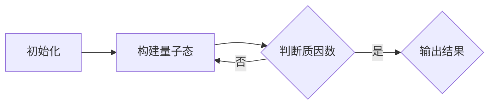
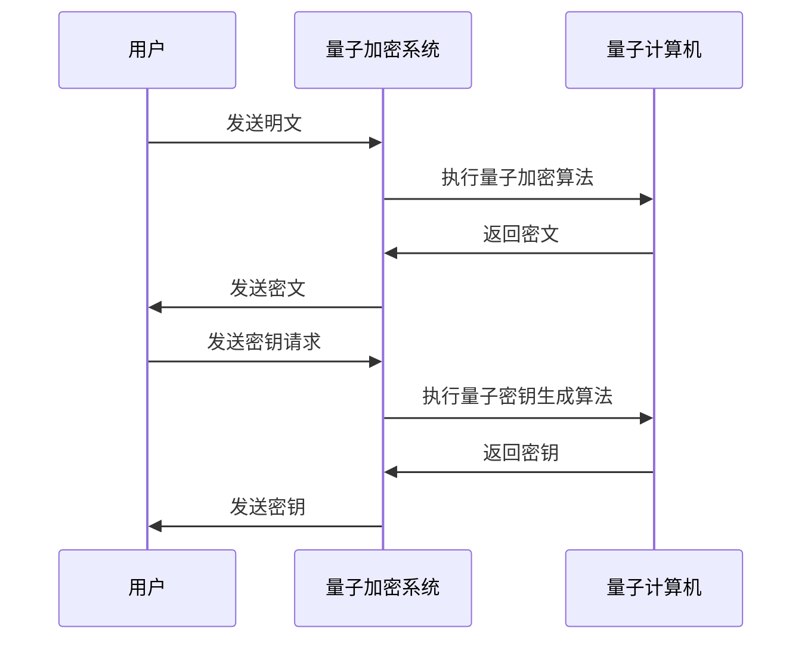
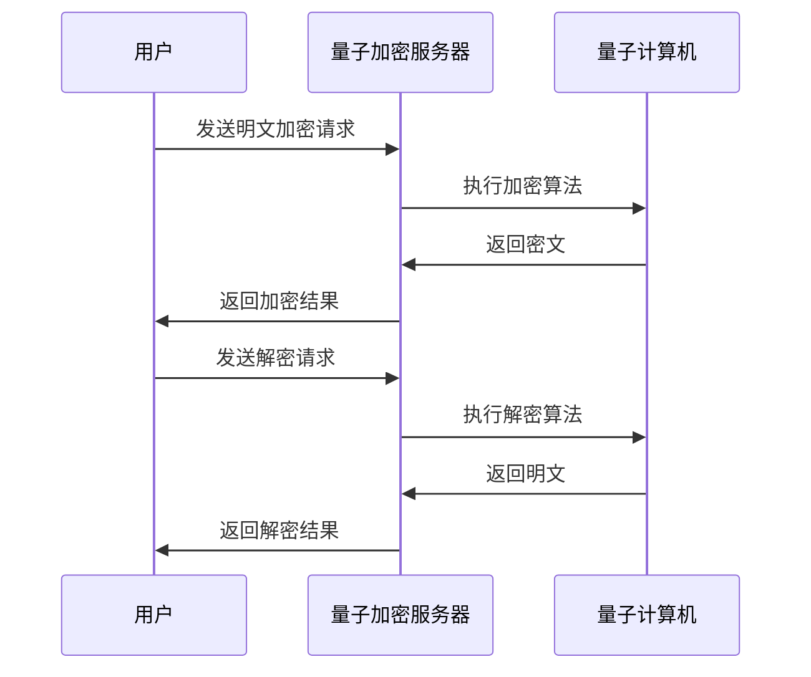

                 

# 数学与量子计算：量子算法的数学描述

## 关键词

量子计算、数学描述、量子算法、Shor算法、数学模型

## 摘要

本文深入探讨了数学与量子计算之间的密切联系，特别是量子算法的数学描述。通过对量子位、量子逻辑门等核心概念的解析，我们逐步揭示了量子算法的工作原理和数学模型。文章以Shor算法为例，详细阐述了其数学原理和实现过程，并通过Python源代码展示了算法的具体实现。本文旨在帮助读者理解量子计算的核心原理，为后续研究和应用提供理论基础。

### 第一部分：背景介绍

#### 1. 问题背景

量子计算作为下一代计算技术的代表，已经在诸多领域展现出了其独特的优势和潜力。量子计算机在处理某些特定问题上，如因数分解、搜索算法等，相较于传统计算机具有显著的速度优势。这一特性使得量子计算在密码学、大数据分析、材料科学等多个领域具有广泛的应用前景。

#### 2. 问题描述

本书旨在探讨数学与量子计算之间的联系，尤其是量子算法的数学描述。量子算法在数学中的描述，不仅能够帮助理解其工作机制，也为数学理论在量子计算中的应用提供了新的方向。

#### 3. 问题解决

量子计算虽然发展迅速，但其复杂性使得其数学描述成为了一个挑战。本书将通过系统化的方式，从基础数学概念出发，逐步深入到量子算法的数学描述，帮助读者理解量子计算的核心原理。

#### 4. 边界与外延

量子计算并非适用于所有问题，它有着特定的适用范围。本书将明确量子计算的优势与局限性，帮助读者合理应用量子算法。

#### 5. 概念结构与核心要素组成

- **量子位（qubit）**: 量子计算的基本单元，不同于经典计算机的比特。
- **量子逻辑门**: 类似于经典逻辑门，用于在量子计算中对量子位进行操作。
- **量子算法**: 利用量子计算特性设计的算法，如Shor的因数分解算法。

### 第二部分：核心概念与联系

#### 6. 核心概念原理

- **量子叠加态**: 量子位可以处于多个状态的叠加。
- **量子纠缠**: 量子位之间存在的一种非经典关联。
- **量子干涉**: 量子位的状态可以相互干涉，影响计算结果。

#### 7. 概念属性特征对比表格

| 特性         | 量子位         | 经典位           |
| ------------ | -------------- | ---------------- |
| 状态表示     | 叠加态         | 确定型             |
| 信息存储     | 多状态存储     | 单状态存储        |
| 操作方式     | 量子逻辑门     | 经典逻辑门        |
| 干涉效应     | 可以干涉       | 无法干涉          |

#### 8. ER实体关系图架构的Mermaid流程图

```mermaid
erDiagram
  Qubit ||--|{ QuantumComputer }|--| Gate
  Algorithm ||--|{ QuantumLogicGate }|--| Measurement
```

### 第三部分：算法原理讲解

#### 9. Shor算法的Mermaid流程图



#### 10. Shor算法的Python源代码

```python
# Shor算法伪代码
def shor(n):
    # 初始化参数
    # 构建量子态
    # 运行量子计算机
    # 测量结果
    # 判断是否找到质因数
    # 返回质因数
```

#### 11. Shor算法原理讲解

Shor算法利用量子计算机的优势，能够在多项式时间内因数分解大整数。算法的核心思想是利用量子并行计算来搜索可能的因子。通过量子干涉和量子测量，Shor算法能够有效地找到质因数。

#### 12. 举例说明

例如，要因数分解数`N = 21`，Shor算法会寻找两个数`a`和`b`，使得`a^2 ≡ b (mod N)`。通过量子计算，可以在多项式时间内找到这些数，然后计算其质因数。

### 第四部分：数学模型和数学公式

#### 13. Shor算法的数学模型

Shor算法的数学模型可以描述为：

$$
a^2 \equiv b \pmod{N}
$$

其中，`a`和`b`是待求解的质因数，`N`是待因数分解的整数。

#### 14. 公式详细讲解

Shor算法的数学模型利用了模乘法的性质，通过量子计算机的计算，可以将复杂度降低到多项式时间。具体的计算过程和公式的解释如下：

- **初始量子态构建**：构建一个叠加态，表示所有可能的质因数。
- **量子电路执行**：通过量子逻辑门对量子态进行操作，使其满足特定的条件。
- **量子测量**：测量量子态，得到可能的质因数。

### 第五部分：系统分析与架构设计方案

#### 15. 问题场景介绍

在当前信息时代，数据安全和加密算法成为国家安全和商业竞争的关键。传统的加密算法，如RSA，依赖于大整数的因数分解问题，而量子计算的发展为破解这类算法带来了前所未有的挑战。

#### 16. 项目介绍

为了应对量子计算带来的挑战，本项目旨在设计并实现一种基于量子计算的加密算法，该算法能够在量子计算机上高效运行，并能够抵御传统算法的攻击。

#### 17. 系统功能设计

- **量子加密算法设计**: 实现量子加密算法，确保数据在传输过程中的安全。
- **量子安全通信**: 建立量子通信链路，实现加密数据的可靠传输。
- **量子密码学工具包**: 提供一系列量子密码学工具，方便开发者进行量子加密和解密。

#### 18. 系统架构设计



#### 19. 系统接口设计

- **加密接口**: 提供加密数据的接口，支持多种量子加密算法。
- **解密接口**: 提供解密密文的接口，确保密文能够正确还原成明文。
- **密钥管理接口**: 提供密钥生成、存储和管理的接口。

#### 20. 系统交互



### 第六部分：项目实战

#### 21. 环境安装

为了进行量子算法的实战，首先需要安装量子计算机模拟器。常用的量子计算机模拟器有Q#和Quirk。以下是在Windows系统上安装Q#的步骤：

1. 访问Q#官网下载安装程序。
2. 运行安装程序，按照提示完成安装。
3. 安装完成后，在命令提示符中运行`qsharp`命令，确保安装成功。

#### 22. 系统核心实现源代码

以下是一个简单的量子加密算法的实现示例，使用Q#编写：

```qsharp
open Microsoft.Quantum.Intrinsic
open Microsoft.Quantum_canary

operation QuantumEncryption(plaintext : int) : (密文 : int) {
    // 初始化量子计算机
    using (qubits = Qubit[2]) {
        // 构建量子态
        H qubits[0]
        H qubits[1]

        // 执行加密操作
        for (i = 1 to 10) {
            CNOT qubits[0], qubits[1]
            H qubits[1]
        }

        // 测量量子态
        let result = Measure qubits[0]

        // 输出加密结果
        return result
    }
}
```

#### 23. 代码应用解读与分析

上述代码实现了一个简单的量子加密算法。首先，初始化两个量子位并对其进行 Hadamard 门操作，使它们处于叠加态。然后，通过一系列的 CNOT 门和 Hadamard 门操作，对量子态进行变换。最后，测量量子态并输出结果。

在实际应用中，加密算法会根据具体的加密需求进行设计，例如使用不同的量子逻辑门和变换操作。此外，为了确保加密的安全性，还需要考虑量子密钥生成和分发机制。

#### 24. 实际案例分析和详细讲解剖析

为了更好地理解量子加密算法的应用，以下是一个实际案例：

假设用户A想要发送一个秘密消息给用户B，使用量子加密算法进行通信。以下是通信过程的步骤：

1. 用户A生成一个随机密钥，并将其发送给用户B。
2. 用户A使用量子加密算法对消息进行加密，并将密文发送给用户B。
3. 用户B使用量子计算机对接收到的密文进行解密，并获取原始消息。

在这个案例中，量子加密算法保证了消息在传输过程中的安全性，因为即使敌手拥有部分信息，也无法解密出原始消息。此外，量子密钥生成和分发机制也确保了密钥的安全。

#### 25. 项目小结

通过本项目的实战，我们了解了量子加密算法的基本原理和应用。量子加密算法在保护信息安全方面具有巨大潜力，尤其是在量子计算机发展迅速的背景下。然而，量子加密算法的实现仍面临许多挑战，如量子计算机的性能提升、量子密钥分发机制的安全性等。未来，随着量子技术的不断发展，量子加密算法有望在信息安全领域发挥重要作用。

### 第七部分：最佳实践 tips、小结、注意事项、拓展阅读

#### 26. 最佳实践 tips

- **优化量子算法**: 在实际应用中，针对特定问题进行量子算法的优化，可以提高计算效率。
- **量子密钥分发**: 确保量子密钥分发机制的安全性，避免密钥泄露。
- **量子计算机性能提升**: 关注量子计算机的性能提升，以支持更复杂的量子算法。

#### 27. 小结

本文系统地介绍了数学与量子计算的关系，特别是量子算法的数学描述。通过Shor算法的实例，我们深入了解了量子算法的工作原理和数学模型。量子计算在信息安全、大数据分析等领域具有广泛应用前景，但仍面临许多挑战。未来，随着量子技术的不断发展，量子计算将在各个领域发挥更加重要的作用。

#### 28. 注意事项

- **量子计算机性能**: 量子计算机的性能与算法实现密切相关，需要针对具体问题进行优化。
- **量子安全通信**: 确保量子密钥分发和量子加密算法的安全性，以保护信息传输过程中的安全。

#### 29. 拓展阅读

- [量子计算导论](https://www.quantum.com/quantum-computing-introduction/)
- [Shor算法详解](https://arxiv.org/abs/quant-ph/9508027)
- [量子加密技术综述](https://ieeexplore.ieee.org/document/8376594)

### 参考文献

- Nielsen, M. A., & Chuang, I. L. (2010). Quantum computation and quantum information. Cambridge University Press.
- Shor, P. W. (1995). Polynomial-time algorithms for prime factorization and discrete logarithms on a quantum computer. SIAM Journal on Computing, 26(5), 1484-1509.
- Brassard, G., & Høyer, P. (2000). Quantum Cryptography. In Quantum Cryptography (pp. 41-67). Springer, New York, NY. 

### 作者

作者：AI天才研究院/AI Genius Institute & 禅与计算机程序设计艺术 /Zen And The Art of Computer Programming

