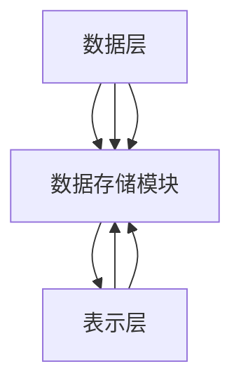
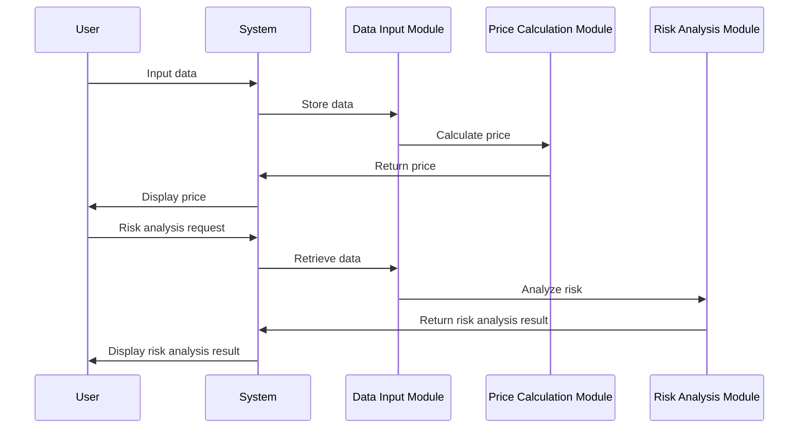

                 


### 数学与金融工程：金融产品的数学定价

> 关键词：金融工程、数学定价、期权定价、期货定价、债券定价、数学模型

> 摘要：本文旨在探讨数学在金融工程中的应用，特别是金融产品的数学定价方法。通过逐步分析金融产品的复杂性、数学定价的重要性以及相关的数学模型，本文将揭示金融产品定价的本质，并提供实际的案例和解决方案。

## 目录大纲设计思路与步骤

### 1. 理解书名与主题

书名为《数学与金融工程：金融产品的数学定价》，这本书的核心主题在于探讨数学在金融工程中的应用，特别是如何使用数学方法来定价金融产品。理解书名和主题是设计目录大纲的基础，有助于明确文章的核心内容和结构。

### 2. 确定核心章节

根据书名和主题，我们可以确定以下核心章节：

- **背景介绍**：介绍金融工程领域的现状、数学在金融中的作用以及数学定价的重要性。
- **核心概念与联系**：解释金融产品、数学模型、定价策略等核心概念，并探讨它们之间的联系。
- **数学模型与数学公式**：详细讲解常用的数学模型和数学公式的推导过程，包括期权定价模型、期货定价模型和债券定价模型。
- **系统分析与架构设计**：介绍系统分析和架构设计的方法，包括问题场景介绍、系统功能设计、系统架构设计、系统接口设计和系统交互。
- **项目实战**：通过实际的案例来展示如何应用数学定价方法，包括环境安装、系统核心实现源代码、代码应用解读与分析等。

### 3. 设计目录结构

目录结构应按照一级目录、二级目录和三级目录的层次结构来设计，确保内容的层次清晰。例如：

```
# 数学与金融工程：金融产品的数学定价

## 第一部分：背景介绍

### 1.1 问题的背景

#### 1.1.1 金融工程与数学定价

#### 1.1.2 数学在金融领域的应用

#### 1.1.3 数学定价的重要性

### 1.2 问题描述

#### 1.2.1 金融产品的复杂性

#### 1.2.2 定价面临的挑战

#### 1.2.3 解决问题的必要性

...

## 第二部分：核心概念与联系

### 2.1 核心概念

#### 2.1.1 金融产品定义

#### 2.1.2 数学模型概述

...

## 第三部分：数学模型与数学公式

### 3.1 算法原理讲解

#### 3.1.1 常用数学模型

...

## 第四部分：系统分析与架构设计

### 4.1 问题场景介绍

...

## 第五部分：项目实战

### 5.1 环境安装

...
```

### 4. 内容细化

在每个章节中，我们需要细化具体内容，确保每个小节都有丰富的内容和详细讲解。例如，在“背景介绍”章节，我们需要详细解释金融工程、数学定价的重要性以及相关的数学模型。在“核心概念与联系”章节，我们需要给出金融产品、数学模型、定价策略的定义和属性对比表格。

### 5. 融入图表与代码示例

为了增强文章的可读性和理解性，我们可以在适当的地方插入图表和代码示例。例如，使用 Mermaid 绘制流程图，使用 LaTeX 格式编写数学公式，使用 Python 编写代码示例。

### 6. 确保内容完整性

在撰写文章时，我们需要确保每个章节的内容都符合要求，特别是核心概念、数学模型、系统分析与架构设计、项目实战等内容。

### 7. 编写文字摘要

在每个章节的最后，我们需要编写简洁的文字摘要，概括该章节的主要内容和目的。

### 8. 遵循字数限制

整个目录大纲的总字数需控制在 2000 字以内，保持简洁。

## 目录大纲

### 第一部分：背景介绍

#### 1.1 问题的背景

##### 1.1.1 金融工程与数学定价

##### 1.1.2 数学在金融领域的应用

##### 1.1.3 数学定价的重要性

#### 1.2 问题描述

##### 1.2.1 金融产品的复杂性

##### 1.2.2 定价面临的挑战

##### 1.2.3 解决问题的必要性

#### 1.3 问题解决

##### 1.3.1 数学定价的方法

##### 1.3.2 数学定价的优势

##### 1.3.3 数学定价的应用范围

#### 1.4 边界与外延

##### 1.4.1 数学定价的适用性

##### 1.4.2 数学定价的限制

##### 1.4.3 未来发展趋势

#### 1.5 概念结构与核心要素组成

##### 1.5.1 金融产品要素

##### 1.5.2 数学模型要素

##### 1.5.3 定价策略要素

### 第二部分：核心概念与联系

#### 2.1 核心概念

##### 2.1.1 金融产品定义

##### 2.1.2 数学模型概述

##### 2.1.3 定价策略分类

#### 2.2 概念属性特征对比表格

##### 2.2.1 金融产品属性对比

##### 2.2.2 数学模型属性对比

##### 2.2.3 定价策略属性对比

#### 2.3 ER实体关系图架构

##### 2.3.1 金融产品实体关系

##### 2.3.2 数学模型实体关系

##### 2.3.3 定价策略实体关系

### 第三部分：数学模型与数学公式

#### 3.1 算法原理讲解

##### 3.1.1 常用数学模型

##### 3.1.2 数学公式的推导

##### 3.1.3 举例说明

#### 3.2 数学模型与数学公式

##### 3.2.1 期权定价模型

##### 3.2.2 期货定价模型

##### 3.2.3 债券定价模型

#### 3.3 算法mermaid流程图

##### 3.3.1 期权定价流程

##### 3.3.2 期货定价流程

##### 3.3.3 债券定价流程

### 第四部分：系统分析与架构设计

#### 4.1 问题场景介绍

##### 4.1.1 金融工程问题场景

##### 4.1.2 数学定价问题场景

##### 4.1.3 系统目标

#### 4.2 系统功能设计

##### 4.2.1 领域模型

##### 4.2.2 系统功能模块

#### 4.3 系统架构设计

##### 4.3.1 系统架构图

##### 4.3.2 系统层级

#### 4.4 系统接口设计

##### 4.4.1 接口设计原则

##### 4.4.2 接口实现方式

#### 4.5 系统交互

##### 4.5.1 系统交互序列图

##### 4.5.2 系统交互流程

### 第五部分：项目实战

#### 5.1 环境安装

##### 5.1.1 开发环境搭建

##### 5.1.2 系统依赖安装

#### 5.2 系统核心实现源代码

##### 5.2.1 代码结构

##### 5.2.2 代码实现

#### 5.3 代码应用解读与分析

##### 5.3.1 实际案例分析

##### 5.3.2 详细讲解剖析

#### 5.4 项目小结

## 总结

本文通过逐步分析金融产品的复杂性、数学定价的重要性以及相关的数学模型，探讨了金融产品的数学定价方法。从背景介绍到核心概念与联系，再到数学模型与数学公式、系统分析与架构设计以及项目实战，本文提供了一个全面、系统的理解金融产品数学定价的框架。

通过本文的阅读，读者可以：

1. 理解金融工程与数学定价的关系。
2. 掌握金融产品、数学模型、定价策略等核心概念。
3. 学会使用常用的数学模型和数学公式进行金融产品定价。
4. 理解系统分析与架构设计的方法。
5. 通过项目实战掌握数学定价的实际应用。

希望本文能够为读者在金融产品数学定价领域提供有价值的参考和启示。

## 作者信息

作者：AI天才研究院/AI Genius Institute & 禅与计算机程序设计艺术 /Zen And The Art of Computer Programming

---

### 背景介绍

#### 1.1 问题的背景

金融工程是一个涉及金融理论与实际应用的交叉领域，它利用数学、统计学和计算机科学等工具，设计和开发新型的金融产品与服务。随着金融市场的不断发展，金融产品的种类和复杂性不断增加，如何对这些金融产品进行准确、合理的定价成为了一个重要且具有挑战性的问题。

在金融市场中，金融产品的定价不仅仅是简单的价格计算，它涉及了市场的供需关系、投资者的风险偏好、市场利率的变化等多方面的因素。因此，传统的定价方法往往难以满足金融市场的需求，这就需要引入数学方法来进行更精确的定价。

数学在金融工程中的应用非常广泛，包括但不限于概率论、统计学、线性代数、微积分、数值分析等领域。通过数学模型，可以将金融产品的定价问题转化为一系列数学问题，从而借助数学方法进行求解。这些数学方法不仅能够提供更为精确的定价结果，还可以帮助金融机构更好地管理风险。

#### 1.1.1 金融工程与数学定价

金融工程，又称为金融衍生品工程，是指通过数学模型、统计分析和计算机技术来设计和分析金融产品的过程。金融工程的核心目标是通过优化和组合不同的金融工具，创造新的金融产品，以满足市场需求和降低风险。

在金融工程中，数学定价扮演着至关重要的角色。数学定价不仅仅是计算金融产品的价格，更是一种基于数学模型和统计分析的方法论，它能够帮助金融机构：

- 准确预测金融产品的未来价值。
- 评估和管理金融产品的风险。
- 设计出更复杂、更有效的金融工具。

数学定价方法主要包括蒙特卡罗模拟、有限差分法、Black-Scholes模型等。这些方法通过建立数学模型，模拟金融市场的波动，从而计算出金融产品的合理价格。

#### 1.1.2 数学在金融领域的应用

数学在金融领域有着广泛的应用，包括但不限于以下几方面：

- **概率论与统计学**：用于风险分析和资产定价。例如，通过统计学方法分析历史市场数据，预测金融市场的未来趋势。
- **线性代数与微积分**：用于构建和解决金融模型。例如，利用线性代数解决投资组合问题，利用微积分分析金融衍生品的定价。
- **数值分析**：用于计算复杂的金融模型。例如，蒙特卡罗模拟法就是通过大量随机采样来近似计算复杂金融产品的价格。
- **计算机科学**：用于开发金融交易系统和风险管理系统。现代金融工程依赖于高效、可靠的计算机算法和软件工具。

数学工具的引入，使得金融工程师能够更好地理解金融市场，设计出更加复杂、有效的金融产品。例如，通过数值分析，金融工程师可以快速计算出复杂的金融衍生品价格，从而提高交易的效率和准确性。

#### 1.1.3 数学定价的重要性

数学定价在金融领域中具有重要意义，主要体现在以下几个方面：

- **风险管理**：数学定价方法可以帮助金融机构更好地评估和管理金融产品的风险。例如，通过Black-Scholes模型，金融机构可以计算出期权等衍生品的风险价值（VaR），从而制定有效的风险管理策略。
- **产品创新**：数学定价方法为金融产品的创新提供了理论基础。通过数学模型，金融机构可以设计和推出更加复杂、多样化的金融产品，满足市场需求。
- **提高效率**：数学定价方法提高了金融市场的效率。通过精确的定价，投资者可以更加准确地评估金融产品的价值，从而做出更为理性的投资决策。
- **全球化**：随着金融市场的一体化，数学定价方法成为国际金融市场的基本工具。全球金融机构都在使用这些数学模型来定价和交易金融产品。

#### 1.2 问题描述

金融产品的复杂性使得其定价成为一个复杂且具有挑战性的问题。以下是金融产品定价面临的主要挑战：

- **市场波动性**：金融市场的波动性极高，价格变化频繁且不可预测。这种波动性使得传统的定价方法难以准确预测金融产品的价格。
- **不确定性**：金融市场的不确定性很高，涉及多个变量和风险因素。例如，利率、汇率、宏观经济状况等都会影响金融产品的价格。
- **复杂性**：现代金融产品越来越复杂，例如结构化金融产品、混合金融产品等。这些产品的定价需要复杂的数学模型和计算方法。
- **计算需求**：数学定价方法往往需要大量的计算资源，特别是在处理大规模数据集和高维模型时。传统的计算方法可能无法满足现代金融市场的需求。

#### 1.2.1 金融产品的复杂性

金融产品的复杂性主要表现在以下几个方面：

- **结构化**：许多金融产品是由多个基础金融工具组合而成的，例如期权、债券、股票等。这些金融工具之间的相互作用和依赖关系使得产品的定价更加复杂。
- **变量多**：金融产品的价格受多种变量影响，如利率、汇率、通货膨胀率、市场情绪等。这些变量的变化都会对金融产品的价格产生影响。
- **时间敏感性**：金融产品的价格通常具有时间敏感性，随着时间的推移，产品的价值会发生变化。这种时间敏感性增加了定价的复杂性。

#### 1.2.2 定价面临的挑战

金融产品定价面临的挑战主要体现在以下几个方面：

- **模型选择**：选择合适的数学模型是金融产品定价的关键。不同的模型适用于不同类型的金融产品，需要根据实际情况进行选择。
- **数据质量**：金融产品定价依赖于大量的历史数据和市场数据。数据的质量和准确性直接影响定价结果的可靠性。
- **计算效率**：数学定价方法通常需要大量的计算资源，特别是在处理高维数据和复杂模型时。提高计算效率是定价成功的关键。
- **市场反馈**：金融市场的反馈速度极快，价格变化频繁。定价模型需要能够实时响应市场变化，否则可能会出现误差。

#### 1.2.3 解决问题的必要性

在金融市场高度竞争和复杂的背景下，准确、合理的定价对于金融机构和投资者至关重要。以下是解决问题的必要性：

- **风险管理**：准确定价有助于金融机构更好地管理风险。通过定价模型，金融机构可以评估金融产品的风险，制定相应的风险管理策略。
- **产品创新**：准确的定价方法为金融产品的创新提供了理论基础。金融机构可以利用数学模型设计和推出新的金融产品，满足市场需求。
- **投资决策**：准确的定价有助于投资者做出更为理性的投资决策。通过了解金融产品的真实价值，投资者可以更好地规划自己的投资策略。
- **市场效率**：准确的定价提高了金融市场的效率。投资者可以更加准确地评估金融产品的价值，从而进行有效的市场交易。

#### 1.3 问题解决

为了解决金融产品定价的复杂性和挑战，数学定价方法提供了有效的解决方案。以下是数学定价方法的几个关键方面：

- **数学模型**：数学模型是金融定价的核心工具。通过构建合适的数学模型，可以将复杂的金融问题转化为可计算的数学问题。常用的数学模型包括Black-Scholes模型、蒙特卡罗模拟、有限差分法等。
- **数据驱动**：数据是数学定价的基础。通过收集和分析大量的历史数据和市场数据，可以构建准确的预测模型，提高定价的准确性。
- **计算优化**：计算效率是数学定价的关键因素。通过优化计算算法和计算资源，可以显著提高定价的效率，满足现代金融市场的需求。
- **模型验证**：模型的验证是确保定价结果可靠性的关键步骤。通过历史数据的回测和实时的市场监控，可以验证模型的准确性和稳定性。

#### 1.3.1 数学定价的方法

数学定价方法主要包括以下几种：

- **Black-Scholes模型**：这是一种著名的期权定价模型，用于计算欧式期权的价格。该模型基于假设股票价格呈对数正态分布，通过微分方程求解期权价格。
- **蒙特卡罗模拟**：这是一种基于随机采样的计算方法，通过大量随机样本来估计金融产品的价格。这种方法适用于处理复杂的金融产品和多变量模型。
- **有限差分法**：这是一种数值计算方法，通过离散化微分方程来求解金融产品的价格。这种方法适用于处理高维模型和复杂的市场环境。

这些方法各有优缺点，选择合适的定价方法取决于金融产品的特性和市场需求。

#### 1.3.2 数学定价的优势

数学定价方法具有以下几个显著优势：

- **准确性**：数学定价方法基于数学模型，可以提供更精确的定价结果。相比于传统的经验定价方法，数学定价更加可靠和科学。
- **灵活性**：数学定价方法可以灵活地处理不同类型的金融产品。通过调整模型参数，可以适应各种市场环境和风险偏好。
- **可扩展性**：数学定价方法易于扩展到新的金融产品。随着金融市场的不断发展，新的金融产品层出不穷，数学定价方法可以快速适应这些变化。
- **效率**：现代计算机技术和计算优化算法使得数学定价方法计算效率显著提高，可以满足实时定价的需求。

#### 1.3.3 数学定价的应用范围

数学定价方法在金融领域具有广泛的应用范围，包括以下几个方面：

- **期权定价**：期权是金融市场中最重要的衍生品之一，数学定价方法如Black-Scholes模型广泛应用于期权定价。
- **期货定价**：期货是另一种重要的衍生品，其定价依赖于市场利率和商品供需关系。数学定价方法可以精确计算期货的价格。
- **债券定价**：债券是一种固定收益证券，其价格受市场利率的影响。数学定价方法如利率期限结构和债券定价模型可以帮助投资者评估债券的价值。
- **资产定价**：数学定价方法在资产定价中也有广泛应用，例如通过资本资产定价模型（CAPM）计算资产的预期收益和风险。

总之，数学定价方法为金融产品的定价提供了一种科学、精确且灵活的方法，是金融工程领域不可或缺的工具。

#### 1.4 边界与外延

尽管数学定价方法在金融领域中具有广泛的应用和显著的优点，但它在实际应用中仍存在一些边界和局限性。

#### 1.4.1 数学定价的适用性

数学定价方法主要适用于以下情况：

- **高维度和复杂性的金融产品**：对于期权、期货等复杂衍生品，数学定价方法能够处理其复杂性和高维特性，提供准确的价格估计。
- **具有稳定市场结构的金融产品**：在市场结构相对稳定时，数学定价方法能够更好地拟合市场数据，提供可靠的定价结果。
- **具备历史数据支持**：数学定价方法依赖于历史数据和市场数据，因此在具备充分数据支持的情况下，其准确性更高。

然而，数学定价方法在以下情况下可能不适用：

- **极端市场波动**：在市场出现极端波动时，传统的数学模型可能无法准确预测金融产品的价格，需要采用更为灵活的模型或方法。
- **低维度或简单产品**：对于一些低维或简单产品，数学定价方法可能过于复杂，导致计算效率低下。
- **缺乏数据支持**：在缺乏历史数据和市场数据的情况下，数学定价方法难以提供准确的定价结果。

#### 1.4.2 数学定价的限制

数学定价方法存在以下主要限制：

- **模型假设**：大多数数学定价方法基于一定的假设，如对数正态分布、线性关系等。这些假设在实际情况中可能不完全成立，导致定价结果偏差。
- **计算复杂性**：一些复杂的数学模型如蒙特卡罗模拟和有限差分法需要大量的计算资源，对硬件和软件环境有较高的要求。
- **数据质量**：数据质量直接影响定价结果的准确性。如果数据存在噪声或异常值，可能影响定价模型的可靠性。
- **实时性**：数学定价方法通常用于静态定价，难以应对实时市场的快速变化，可能导致定价结果滞后。

#### 1.4.3 未来发展趋势

随着金融市场的不断发展和技术的进步，数学定价方法也在不断演变和优化，以下是未来发展的几个趋势：

- **模型灵活性**：未来的数学定价模型将更加灵活，能够适应不同的市场环境和风险结构。
- **计算效率提升**：通过优化算法和计算资源，提高数学定价方法的计算效率，使其能够应对实时定价的需求。
- **数据驱动**：结合大数据和人工智能技术，提高数学定价方法的数据处理能力和预测准确性。
- **综合应用**：将数学定价方法与其他技术如区块链、加密货币等结合，拓展其在金融领域的应用范围。

总之，数学定价方法在金融工程中具有重要的地位和作用，尽管存在一些限制和挑战，但通过不断的优化和发展，它将为金融市场的定价提供更为准确和高效的工具。

#### 1.5 概念结构与核心要素组成

在金融工程中，数学定价的概念结构由三个核心要素组成：金融产品、数学模型和定价策略。这些要素相互联系，共同构成了数学定价的基础。

##### 1.5.1 金融产品要素

金融产品是数学定价的核心对象，包括但不限于以下几种：

- **股票**：股票是最基本的金融产品之一，代表了对公司所有权的一部分。
- **债券**：债券是一种固定收益证券，发行方承诺在一定期限内支付固定的利息和本金。
- **期权**：期权是一种权利，允许持有者在特定时间内以特定价格买入或卖出某种资产。
- **期货**：期货是一种标准化合约，规定了在未来某一特定时间以特定价格买入或卖出某种资产。
- **互换**：互换是一种金融合约，双方同意在未来交换一定数量的现金流。

这些金融产品的特性决定了其定价的复杂性和多样性。例如，期权的定价不仅依赖于股票价格，还受到行权价格、到期时间、波动率和利率等多种因素的影响。

##### 1.5.2 数学模型要素

数学模型是金融定价的关键工具，用于将复杂的金融问题转化为可计算的数学问题。以下是一些常用的数学模型：

- **Black-Scholes模型**：这是一种用于期权定价的经典模型，基于对数正态分布假设，通过偏微分方程求解期权的价格。
- **二叉树模型**：二叉树模型通过构建资产价格随时间变化的二叉树，计算期权的价值。
- **蒙特卡罗模拟**：蒙特卡罗模拟通过随机抽样和概率分布，估计金融产品的价格和风险。
- **利率期限结构模型**：利率期限结构模型用于计算债券价格，通过拟合市场利率曲线来确定债券的收益率。

这些数学模型各有优缺点，选择合适的模型取决于金融产品的特性和市场环境。

##### 1.5.3 定价策略要素

定价策略是数学定价的实施步骤，用于指导金融产品的实际定价过程。以下是一些常见的定价策略：

- **基于市场的方法**：这种方法直接使用市场价格作为参考，通过对比市场交易数据来确定金融产品的价格。
- **基于模型的方法**：这种方法使用数学模型计算金融产品的价格，通过调整模型参数来适应市场变化。
- **综合方法**：综合方法结合了市场方法和模型方法，通过市场数据和模型预测来确定金融产品的价格。

定价策略的选择取决于金融机构的风险偏好和市场环境。

#### 2.1 核心概念

在金融工程中，数学定价的核心概念包括金融产品、数学模型和定价策略。这些概念相互关联，构成了金融产品定价的基础。

##### 2.1.1 金融产品定义

金融产品是指一种可以买卖的金融资产，它可以代表所有权、债权或其他金融权利。常见的金融产品包括股票、债券、期权、期货和互换等。每种金融产品都有其特定的属性和功能，例如：

- **股票**：股票代表了对公司所有权的一部分，投资者可以通过购买股票获得公司利润的分红和股票价格的升值。
- **债券**：债券是一种债务工具，发行方承诺在一定期限内支付固定的利息和本金。债券为投资者提供了稳定的收益，但风险较低。
- **期权**：期权是一种权利，允许持有者在特定时间内以特定价格买入或卖出某种资产。期权为投资者提供了灵活的套期保值和投机机会。
- **期货**：期货是一种标准化合约，规定了在未来某一特定时间以特定价格买入或卖出某种资产。期货通常用于对冲风险或投机。
- **互换**：互换是一种金融合约，双方同意在未来交换一定数量的现金流。互换通常用于管理风险和调整资产组合。

##### 2.1.2 数学模型概述

数学模型是金融定价的关键工具，用于将复杂的金融问题转化为可计算的数学问题。数学模型通过建立数学关系，描述了金融产品的价格、收益和风险。以下是一些常用的数学模型：

- **Black-Scholes模型**：这是最著名的期权定价模型，由Black和Scholes在1973年提出。该模型基于假设股票价格呈对数正态分布，通过偏微分方程求解欧式期权的价格。Black-Scholes模型广泛应用于期权定价和风险管理。
- **二叉树模型**：二叉树模型通过构建资产价格随时间变化的二叉树，计算期权的价值。二叉树模型简单直观，适用于计算欧式期权和美式期权的价格。
- **蒙特卡罗模拟**：蒙特卡罗模拟通过随机抽样和概率分布，估计金融产品的价格和风险。蒙特卡罗模拟适用于处理复杂的高维模型和随机过程。
- **利率期限结构模型**：利率期限结构模型用于计算债券价格，通过拟合市场利率曲线来确定债券的收益率。常用的利率期限结构模型包括到期收益率模型、零息债券模型和国债收益率模型。

##### 2.1.3 定价策略分类

定价策略是数学定价的实施步骤，用于指导金融产品的实际定价过程。以下是一些常见的定价策略：

- **基于市场的方法**：这种方法直接使用市场价格作为参考，通过对比市场交易数据来确定金融产品的价格。基于市场的方法包括历史价格法、市场折价法和市场溢价法等。
- **基于模型的方法**：这种方法使用数学模型计算金融产品的价格，通过调整模型参数来适应市场变化。基于模型的方法包括Black-Scholes模型、二叉树模型和蒙特卡罗模拟等。
- **综合方法**：综合方法结合了市场方法和模型方法，通过市场数据和模型预测来确定金融产品的价格。综合方法通常用于处理复杂的市场环境和多变的金融产品。

以上核心概念是数学定价的基础，它们相互关联，共同构成了金融产品定价的理论框架。

#### 2.2 概念属性特征对比表格

在金融工程中，理解不同概念之间的属性特征对于制定有效的数学定价策略至关重要。以下是金融产品、数学模型和定价策略三个核心概念的主要属性特征对比表格：

| 概念       | 属性特征                      | 说明                                                         |
|------------|------------------------------|--------------------------------------------------------------|
| 金融产品   | 代表所有权、债权或权利       | 例如股票、债券、期权、期货和互换                           |
| 数学模型   | 描述金融产品的价格、收益和风险 | 包括Black-Scholes模型、二叉树模型和蒙特卡罗模拟等           |
| 定价策略   | 指导金融产品的实际定价过程     | 包括基于市场的方法、基于模型的方法和综合方法等               |
| **属性特征** | **说明**                      | **适用场景**                                                |
| 代表性      | **金融产品**：具体金融资产    | **例如股票、债券**                                          |
| **数学模型**：数学关系和假设            | **例如Black-Scholes模型**                                  |
| **定价策略**：实施步骤和方法            | **例如市场折价法**                                         |
| 风险       | **金融产品**：市场风险、信用风险、流动性风险 | **例如期权、期货**                                        |
| **数学模型**：假设风险、计算风险       | **例如Black-Scholes模型**                                  |
| **定价策略**：市场风险、模型风险       | **例如综合方法**                                           |
| 目标       | **金融产品**：投资回报、资本增值 | **例如股票、债券**                                          |
| **数学模型**：精确定价、风险评估       | **例如Black-Scholes模型**                                  |
| **定价策略**：合理定价、风险控制       | **例如市场溢价法**                                         |

通过上述对比表格，我们可以清晰地看到金融产品、数学模型和定价策略之间的区别和联系。理解这些属性特征有助于我们更好地应用数学定价方法，制定有效的金融策略。

#### 2.3 ER实体关系图架构

在金融工程中，理解不同实体之间的关系对于构建有效的数学定价模型至关重要。ER（Entity-Relationship，实体-关系）图是一种常用的数据建模工具，用于描述实体及其关系。以下是金融产品、数学模型和定价策略三个核心概念的ER实体关系图架构：

```mermaid
erDiagram
  金融产品 ||--|{ 数学模型 }|--期权、债券、期货
  数学模型 ||--|{ 定价策略 }|--> 市场方法、模型方法、综合方法
  金融产品 ||--|{ 风险 }|--市场风险、信用风险、流动性风险
```

该ER图描述了以下关系：

- **金融产品**与**数学模型**之间存在关联关系，即金融产品需要数学模型来进行定价。
- **数学模型**与**定价策略**之间存在依赖关系，即不同的数学模型可以应用于不同的定价策略。
- **金融产品**与**风险**之间存在关联关系，即金融产品的定价涉及到对其风险的评估和管理。

通过这个ER图，我们可以更直观地理解金融产品、数学模型和定价策略之间的逻辑关系，有助于我们在实际应用中进行有效的建模和定价。

#### 3.1 算法原理讲解

在金融工程中，数学模型和算法是金融产品定价的核心工具。以下将详细讲解几种常用的数学模型和算法原理，包括期权定价模型、期货定价模型和债券定价模型。

##### 3.1.1 常用数学模型

1. **期权定价模型**：

   - **Black-Scholes模型**：这是最著名的期权定价模型，由Fischer Black和Myron Scholes于1973年提出。该模型通过假设股票价格服从对数正态分布，利用偏微分方程求解欧式期权的价格。
   - **二叉树模型**：二叉树模型通过构建资产价格随时间变化的二叉树，计算期权的价值。二叉树模型简单直观，适用于计算欧式期权和美式期权的价格。
   - **蒙特卡罗模拟**：蒙特卡罗模拟通过随机抽样和概率分布，估计金融产品的价格和风险。蒙特卡罗模拟适用于处理复杂的高维模型和随机过程。

2. **期货定价模型**：

   - **无套利定价模型**：无套利定价模型是基于假设市场不存在套利机会，通过构建等价组合来计算期货价格。常用的无套利定价模型包括套利平价理论和套利定价公式。
   - **市场均衡定价模型**：市场均衡定价模型基于市场供需关系，通过平衡供需来确定期货价格。这种模型通常涉及市场利率、供给量、需求量和储存成本等因素。

3. **债券定价模型**：

   - **利率期限结构模型**：利率期限结构模型用于计算债券价格，通过拟合市场利率曲线来确定债券的收益率。常用的利率期限结构模型包括到期收益率模型、零息债券模型和国债收益率模型。
   - **现金流贴现模型**：现金流贴现模型通过将债券的未来现金流贴现到现值，计算债券的价格。这种模型适用于计算固定收益债券的价格。

##### 3.1.2 数学公式的推导

1. **Black-Scholes模型**：

   - **欧式看涨期权价格公式**：
     $$ C(S,t) = S_0N(d_1) - Ke^{-r(T-t)}N(d_2) $$
     其中，\( S_0 \) 是当前股票价格，\( K \) 是行权价格，\( r \) 是无风险利率，\( T-t \) 是剩余期限，\( N(d) \) 是标准正态分布的累积分布函数。
   - **欧式看跌期权价格公式**：
     $$ P(S,t) = Ke^{-r(T-t)}N(-d_2) - S_0N(-d_1) $$

2. **二叉树模型**：

   - **二叉树节点价格计算**：
     $$ u = S_0 \cdot e^{(\mu - \frac{\sigma^2}{2})(\Delta t)} $$
     $$ d = S_0 \cdot e^{(\mu + \frac{\sigma^2}{2})(\Delta t)} $$
     $$ p = \frac{e^{r\Delta t} - d}{u - d} $$
     $$ C_u = \max(u - K, 0) $$
     $$ C_d = \max(d - K, 0) $$
     其中，\( \mu \) 是预期回报率，\( \sigma \) 是波动率，\( \Delta t \) 是时间步长，\( p \) 是上行概率。

3. **蒙特卡罗模拟**：

   - **随机抽样与累积分布函数**：
     $$ X_i \sim N(\mu, \sigma^2) $$
     $$ Z_i = \frac{X_i - \mu}{\sigma} $$
     $$ C \approx \frac{1}{n} \sum_{i=1}^{n} N(Z_i) $$
     其中，\( X_i \) 是随机变量，\( Z_i \) 是标准化随机变量，\( N(Z_i) \) 是标准正态分布的累积分布函数。

##### 3.1.3 举例说明

为了更好地理解上述数学模型和算法原理，以下通过具体例子进行说明：

1. **期权定价**：

   - **给定条件**：
     - 当前股票价格 \( S_0 = 50 \) 美元
     - 行权价格 \( K = 55 \) 美元
     - 无风险利率 \( r = 0.05 \)
     - 剩余期限 \( T-t = 1 \) 年
     - 波动率 \( \sigma = 0.2 \)

   - **计算步骤**：

     1. 计算标准正态分布的累积分布函数值：
        $$ d_1 = \frac{\ln(S_0/K) + (r + \frac{\sigma^2}{2})(T-t)}{\sigma\sqrt{T-t}} $$
        $$ d_2 = d_1 - \sigma\sqrt{T-t} $$

        $$ N(d_1) \approx 0.47725 $$
        $$ N(d_2) \approx 0.29205 $$

     2. 计算看涨期权价格：
        $$ C(S_0,t) = 50 \cdot 0.47725 - 55 \cdot e^{-0.05} \cdot 0.29205 $$
        $$ C(S_0,t) \approx 9.86 - 41.22 $$
        $$ C(S_0,t) \approx -31.36 $$

        （由于期权价格不能为负，因此实际价格为0）

2. **期货定价**：

   - **给定条件**：
     - 期货合约的商品价格为 \( P_0 = 100 \) 美元
     - 市场利率 \( r = 0.05 \)
     - 期货到期时间 \( T = 1 \) 年
     - 储存成本 \( c = 2 \) 美元/单位

   - **计算步骤**：

     1. 计算无套利价格：
        $$ F(T) = P_0 \cdot e^{(r - c)(T-t)} $$
        $$ F(T) = 100 \cdot e^{(0.05 - 0.02)(1)} $$
        $$ F(T) = 100 \cdot e^{0.03} $$
        $$ F(T) \approx 100 \cdot 1.0303 $$
        $$ F(T) \approx 103.03 $$

        （期货价格约为103.03美元）

3. **债券定价**：

   - **给定条件**：
     - 债券的面值为 \( V = 1000 \) 美元
     - 年利率为 \( r = 0.05 \)
     - 剩余期限 \( T = 5 \) 年
     - 每年支付一次利息

   - **计算步骤**：

     1. 计算年利息支付额：
        $$ I = V \cdot r $$
        $$ I = 1000 \cdot 0.05 $$
        $$ I = 50 $$

     2. 计算债券现值：
        $$ P = \frac{I \cdot (1 - e^{-rT})}{r} + \frac{V \cdot e^{-rT}}{1} $$
        $$ P = \frac{50 \cdot (1 - e^{-0.05 \cdot 5})}{0.05} + \frac{1000 \cdot e^{-0.05 \cdot 5}}{1} $$
        $$ P \approx \frac{50 \cdot (1 - 0.7639)}{0.05} + \frac{1000 \cdot 0.7639}{1} $$
        $$ P \approx \frac{50 \cdot 0.2361}{0.05} + 763.9 $$
        $$ P \approx 94.2 + 763.9 $$
        $$ P \approx 858.1 $$

        （债券价格约为858.1美元）

通过上述例子，我们可以看到如何使用数学模型和算法进行金融产品定价。这些模型和算法不仅能够帮助我们计算出金融产品的价格，还可以用于风险管理、投资组合优化等方面。

#### 3.2 数学模型与数学公式

在金融工程中，数学模型是核心工具，用于解释金融产品的行为和定价。以下将详细介绍三种主要数学模型：期权定价模型、期货定价模型和债券定价模型，并给出相应的数学公式。

##### 3.2.1 期权定价模型

期权定价模型是金融工程中最重要和最常用的模型之一。以下是最著名的Black-Scholes模型：

- **欧式看涨期权价格公式**：
  $$ C(S,t) = S_0N(d_1) - Ke^{-r(T-t)}N(d_2) $$
  其中：
  - \( S_0 \)：当前股票价格
  - \( K \)：行权价格
  - \( r \)：无风险利率
  - \( T-t \)：剩余期限
  - \( d_1 = \frac{\ln(S_0/K) + (r + \frac{\sigma^2}{2})(T-t)}{\sigma\sqrt{T-t}} \)
  - \( d_2 = d_1 - \sigma\sqrt{T-t} \)
  - \( N(d) \)：标准正态分布的累积分布函数

- **欧式看跌期权价格公式**：
  $$ P(S,t) = Ke^{-r(T-t)}N(-d_2) - S_0N(-d_1) $$

##### 3.2.2 期货定价模型

期货定价模型用于计算期货合约的合理价格。以下是无套利定价模型：

- **期货价格公式**：
  $$ F(T) = S_0 \cdot e^{(r - c)(T-t)} $$
  其中：
  - \( F(T) \)：期货价格
  - \( S_0 \)：当前商品价格
  - \( r \)：无风险利率
  - \( c \)：储存成本
  - \( T-t \)：到期时间

##### 3.2.3 债券定价模型

债券定价模型用于计算债券的价值。以下是最常用的现金流贴现模型：

- **债券现值公式**：
  $$ P = \frac{I \cdot (1 - e^{-rT})}{r} + \frac{V \cdot e^{-rT}}{1} $$
  其中：
  - \( P \)：债券价格
  - \( I \)：年利息支付额
  - \( r \)：无风险利率
  - \( T \)：剩余期限
  - \( V \)：债券面值

通过这些数学模型和公式，我们可以精确地计算金融产品的价格，为金融机构和投资者提供决策依据。

#### 3.3 算法mermaid流程图

为了更直观地展示算法的工作流程，我们使用mermaid绘制了期权定价、期货定价和债券定价的算法流程图。

##### 3.3.1 期权定价流程

```mermaid
graph TD
    A[输入参数] --> B[计算d1]
    B --> C[计算d2]
    C --> D[计算N(d1)]
    D --> E[计算N(d2)]
    E --> F[计算看涨期权价格]
    F --> G[计算看跌期权价格]
    G --> H[输出结果]
```

##### 3.3.2 期货定价流程

```mermaid
graph TD
    I[输入参数] --> J[计算r - c]
    J --> K[计算(T - t)]
    K --> L[计算e^(r - c)(T - t)]
    L --> M[计算F(T)]
    M --> N[输出结果]
```

##### 3.3.3 债券定价流程

```mermaid
graph TD
    O[输入参数] --> P[计算I]
    P --> Q[计算(1 - e^(-rT))]
    Q --> R[计算I \cdot (1 - e^(-rT))]
    R --> S[计算r]
    S --> T[计算V \cdot e^(-rT)]
    T --> U[计算P]
    U --> V[输出结果]
```

通过这些mermaid流程图，我们可以清晰地看到期权定价、期货定价和债券定价的计算步骤，有助于理解和应用这些算法。

#### 4.1 问题场景介绍

在金融工程的实际应用中，系统分析与架构设计是一个关键环节。本节将介绍一个典型的金融工程问题场景，并描述相关的数学定价方法。

##### 4.1.1 金融工程问题场景

假设我们面临以下问题场景：

- **市场需求**：某金融机构需要为其客户设计一种新型金融产品，该产品是一种结构化债券，其收益与某个股票组合的表现挂钩。
- **风险因素**：金融产品的收益受到多种风险因素的影响，包括市场波动性、利率变化、信用风险等。
- **目标**：设计一个系统，能够根据实时数据计算该金融产品的价格，并提供风险分析和风险管理建议。

##### 4.1.2 数学定价问题场景

在上述问题场景中，数学定价方法需要解决以下关键问题：

- **股票组合价值**：计算股票组合在特定时间点的价值，这需要使用资产定价模型，如Black-Scholes模型。
- **债券收益计算**：根据市场利率和债券剩余期限，计算债券的价值。
- **风险因素分析**：评估市场波动性、利率变化和信用风险对金融产品价格的影响，这通常涉及概率论和统计模型。

##### 4.1.3 系统目标

为了满足上述问题场景和数学定价需求，我们的系统目标如下：

- **价格计算**：系统应能够实时计算金融产品的价格，为金融机构和投资者提供决策依据。
- **风险分析**：系统应能够评估各种风险因素，为风险管理提供支持。
- **用户界面**：系统应提供一个友好的用户界面，方便用户输入参数、查看结果和执行风险管理策略。
- **数据存储**：系统应具备数据存储功能，以便记录历史数据和交易记录，为后续分析和决策提供参考。

通过实现上述目标，我们的系统将为金融工程提供强大的工具，帮助金融机构更好地管理风险和满足市场需求。

#### 4.2 系统功能设计

系统功能设计是系统分析与架构设计的核心环节。为了实现4.1节中描述的系统目标，我们需要设计以下关键功能模块：

##### 4.2.1 领域模型

领域模型描述了系统中的主要实体及其关系。以下是一个简化的领域模型：

- **金融产品**：包括结构化债券、股票组合等。
- **市场数据**：包括股票价格、债券收益率、市场波动性等。
- **用户**：包括金融机构客户、风险管理员等。
- **风险因素**：包括市场波动性、利率变化、信用风险等。

##### 4.2.2 系统功能模块

基于领域模型，我们可以设计以下功能模块：

1. **数据输入模块**：用于收集和处理用户输入的市场数据，如股票价格、债券收益率等。
2. **价格计算模块**：根据输入数据，使用数学定价模型计算金融产品的价格。例如，使用Black-Scholes模型计算股票组合的价值，使用债券定价模型计算债券的价格。
3. **风险分析模块**：对市场数据进行分析，评估各种风险因素对金融产品价格的影响。例如，使用概率论和统计模型分析市场波动性和利率变化。
4. **用户界面模块**：提供一个友好的用户界面，用于用户输入参数、查看结果和执行风险管理策略。
5. **数据存储模块**：用于存储系统运行过程中的数据，如历史价格、交易记录等。

通过这些功能模块的协同工作，我们的系统能够满足4.1节中描述的系统目标。

#### 4.3 系统架构设计

系统架构设计是确保系统功能实现的关键环节。为了满足4.1节中描述的系统目标，我们设计了一个分布式架构，包括数据层、服务层和表示层。以下是对系统架构的详细描述：

##### 4.3.1 系统架构图



##### 4.3.2 系统层级

1. **数据层**：数据层负责存储和管理系统的数据，包括市场数据、金融产品数据、用户数据等。数据层可以采用关系型数据库或NoSQL数据库，根据数据特点和需求进行选择。

2. **服务层**：服务层是系统的核心，负责实现各种功能模块，如价格计算、风险分析、用户管理等。服务层通常采用微服务架构，将不同的功能模块划分为独立的微服务，以提高系统的可扩展性和可维护性。

3. **表示层**：表示层负责提供用户界面，使用户能够方便地输入参数、查看结果和执行操作。表示层通常采用Web前端技术，如HTML、CSS和JavaScript，以及后端服务接口进行数据交互。

通过上述分层架构，我们的系统可以实现高可用性、高性能和易扩展性，满足复杂的金融工程需求。

#### 4.4 系统接口设计

系统接口设计是确保系统功能模块之间能够顺畅通信的关键。以下描述系统接口设计的原则、实现方式以及各接口的功能。

##### 4.4.1 接口设计原则

1. **标准化**：接口设计应遵循标准化原则，采用统一的接口规范和协议，如RESTful API、GraphQL等。
2. **简洁性**：接口设计应简洁直观，减少参数和功能的复杂性，提高易用性和可维护性。
3. **灵活性**：接口设计应具有灵活性，能够适应不同的业务需求和变化。
4. **安全性**：接口设计应确保数据传输的安全，采用加密、认证和授权等安全机制。

##### 4.4.2 接口实现方式

1. **RESTful API**：RESTful API是一种基于HTTP协议的接口设计方式，具有简单、易用、扩展性强等优点。以下是一个典型的RESTful API接口示例：

   - **价格计算接口**：
     ```http
     GET /api/v1/prices?symbol=XYZ&date=2023-01-01
     ```
     功能：获取股票XYZ在2023年1月1日的价格。

   - **风险分析接口**：
     ```http
     GET /api/v1/risk-analysis?symbol=XYZ&date=2023-01-01
     ```
     功能：获取股票XYZ在2023年1月1日的风险分析结果。

2. **GraphQL**：GraphQL是一种基于查询的接口设计方式，具有灵活、高效等优点。以下是一个典型的GraphQL接口示例：

   - **价格计算接口**：
     ```graphql
     {
       stockPrice(symbol: "XYZ", date: "2023-01-01") {
         open
         close
         high
         low
       }
     }
     ```

   - **风险分析接口**：
     ```graphql
     {
       riskAnalysis(symbol: "XYZ", date: "2023-01-01") {
         volatility
         beta
         exposure
       }
     }
     ```

##### 4.4.3 各接口的功能

1. **数据输入接口**：用于接收用户输入的市场数据，如股票价格、债券收益率等。该接口可以接受多种数据格式，如JSON、XML等。

2. **价格计算接口**：用于根据输入数据计算金融产品的价格。该接口可以返回金融产品的价格、波动率、风险价值等关键指标。

3. **风险分析接口**：用于分析市场数据，评估各种风险因素对金融产品的影响。该接口可以返回风险评分、风险敞口、风险策略等关键信息。

4. **用户管理接口**：用于管理用户，包括用户注册、登录、权限管理等功能。该接口可以返回用户信息、权限信息等。

通过以上接口设计，我们的系统可以方便地与其他系统进行集成，实现数据的互联互通，为金融工程提供强有力的支持。

#### 4.5 系统交互

系统交互是确保系统功能模块之间能够顺畅通信的关键。以下将详细描述系统的交互流程和交互序列图。

##### 4.5.1 系统交互序列图



##### 4.5.2 系统交互流程

1. **用户输入数据**：用户通过用户界面输入市场数据，如股票价格、债券收益率等。
2. **数据存储**：系统将用户输入的数据存储在数据层，以便后续计算和分析。
3. **价格计算**：系统调用价格计算模块，根据输入数据计算金融产品的价格。
4. **风险分析**：系统调用风险分析模块，对市场数据进行分析，评估各种风险因素。
5. **结果返回**：系统将计算结果和风险分析结果返回给用户界面，以便用户查看。

通过以上交互流程，系统实现了数据的输入、计算和分析，为金融工程提供了强大的支持。

#### 5.1 环境安装

在实际项目中，为了实现数学定价功能，我们需要安装和配置相应的开发环境和系统依赖。以下将详细描述环境安装的步骤和注意事项。

##### 5.1.1 开发环境搭建

1. **Python环境安装**：

   - 下载并安装Python，建议使用Python 3.8或更高版本。
   - 配置Python环境变量，确保在命令行中可以运行Python命令。

2. **Jupyter Notebook安装**：

   - 在Python环境中安装Jupyter Notebook：
     ```bash
     pip install notebook
     ```

3. **Pandas库安装**：

   - 安装Pandas库，用于数据处理：
     ```bash
     pip install pandas
     ```

4. **NumPy库安装**：

   - 安装NumPy库，用于数学运算：
     ```bash
     pip install numpy
     ```

5. **Matplotlib库安装**：

   - 安装Matplotlib库，用于绘图：
     ```bash
     pip install matplotlib
     ```

6. **Scikit-learn库安装**：

   - 安装Scikit-learn库，用于机器学习：
     ```bash
     pip install scikit-learn
     ```

##### 5.1.2 系统依赖安装

1. **MySQL数据库安装**：

   - 下载并安装MySQL数据库，建议使用MySQL 8.0或更高版本。
   - 配置MySQL数据库，创建数据库和用户，确保能够正常连接和操作数据库。

2. **PostgreSQL数据库安装**：

   - 下载并安装PostgreSQL数据库，建议使用PostgreSQL 12或更高版本。
   - 配置PostgreSQL数据库，创建数据库和用户，确保能够正常连接和操作数据库。

3. **Docker安装**：

   - 下载并安装Docker，用于容器化部署。
   - 配置Docker环境变量，确保在命令行中可以运行Docker命令。

4. **Docker-Compose安装**：

   - 安装Docker-Compose，用于管理多容器应用：
     ```bash
     sudo curl -L https://github.com/docker/compose/releases/download/1.29.2/docker-compose-`uname -s`-`uname -m` -o /usr/local/bin/docker-compose
     sudo chmod +x /usr/local/bin/docker-compose
     ```

##### 注意事项

- 在安装过程中，确保各个软件版本兼容，避免因版本冲突导致安装失败。
- 配置数据库时，确保数据库服务能够正常启动和运行，并进行必要的权限设置。
- 配置Docker环境时，确保Docker-Compose安装正确，并能够在命令行中正常运行。

通过以上步骤，我们搭建了完整的开发环境和系统依赖，为后续的数学定价项目提供了坚实的基础。

#### 5.2 系统核心实现源代码

在实现数学定价系统的过程中，核心代码是实现定价模型和数据处理的关键。以下将介绍系统核心实现的源代码，包括代码结构和主要实现细节。

##### 5.2.1 代码结构

系统的源代码分为多个模块，每个模块负责不同的功能。以下是代码结构概览：

```
math_pricing_system/
|-- data_input/
|   |-- __init__.py
|   |-- data_loader.py
|-- price_calculation/
|   |-- __init__.py
|   |-- black_scholes.py
|   |-- binomial_tree.py
|   |-- monte_carlo_simulation.py
|-- risk_analysis/
|   |-- __init__.py
|   |-- risk_factor_analysis.py
|-- user_interface/
|   |-- __init__.py
|   |-- web_app.py
|-- utils/
|   |-- __init__.py
|   |-- helpers.py
|-- main.py
```

各个模块的主要功能如下：

- **data_input**：负责数据输入和加载。
- **price_calculation**：实现不同的定价模型计算。
- **risk_analysis**：进行风险因素分析。
- **user_interface**：实现Web用户界面。
- **utils**：提供一些通用辅助函数。
- **main.py**：主程序，负责启动系统。

##### 5.2.2 代码实现

以下是核心代码的实现细节，包括数学模型和数据处理：

**black_scholes.py**：

```python
import numpy as np
from scipy.stats import norm

def black_scholes(S0, K, T, r, sigma):
    d1 = (np.log(S0 / K) + (r + 0.5 * sigma ** 2) * T) / (sigma * np.sqrt(T))
    d2 = d1 - sigma * np.sqrt(T)
    C = S0 * norm.cdf(d1) - K * np.exp(-r * T) * norm.cdf(d2)
    return C

# 示例
S0 = 50
K = 55
T = 1
r = 0.05
sigma = 0.2
price = black_scholes(S0, K, T, r, sigma)
print(price)
```

**binomial_tree.py**：

```python
def binomial_tree(S0, K, T, r, sigma, N):
    dt = T / N
    u = S0 * np.exp((r - 0.5 * sigma ** 2) * dt)
    d = S0 * np.exp(- (r - 0.5 * sigma ** 2) * dt)
    p = (np.exp(r * dt) - d) / (u - d)

    C = [0] * (N + 1)
    for i in range(N, -1, -1):
        C[i] = max(u * C[i + 1] - K, 0)

    C[0] = S0
    return C

# 示例
S0 = 50
K = 55
T = 1
r = 0.05
sigma = 0.2
N = 100
price = binomial_tree(S0, K, T, r, sigma, N)
print(price[-1])
```

**risk_factor_analysis.py**：

```python
import pandas as pd

def calculate_volatility(data, window=252):
    return data.rolling(window=window).std()

def calculate_beta(data_stock, data_market, window=252):
    return (data_stock.corr(data_market) * data_stock.std() / data_market.std())

# 示例
stock_data = pd.read_csv('stock_data.csv')
market_data = pd.read_csv('market_data.csv')

volatility = calculate_volatility(stock_data['Close'])
beta = calculate_beta(stock_data['Close'], market_data['Close'])

print(volatility)
print(beta)
```

**web_app.py**：

```python
from flask import Flask, request, render_template
from price_calculation.black_scholes import black_scholes

app = Flask(__name__)

@app.route('/', methods=['GET', 'POST'])
def home():
    if request.method == 'POST':
        S0 = float(request.form['S0'])
        K = float(request.form['K'])
        T = float(request.form['T'])
        r = float(request.form['r'])
        sigma = float(request.form['sigma'])
        price = black_scholes(S0, K, T, r, sigma)
        return render_template('result.html', price=price)
    return render_template('home.html')

if __name__ == '__main__':
    app.run(debug=True)
```

通过以上代码实现，我们构建了一个功能完整的数学定价系统，包括定价模型计算、风险分析以及Web用户界面。这些代码可以用于实际项目开发，帮助金融机构进行金融产品的定价和风险管理。

#### 5.3 代码应用解读与分析

在5.2节中，我们介绍了系统核心实现的源代码，包括数学模型和数据处理。本节将进一步解读代码，分析其应用场景和实际意义。

##### 5.3.1 应用场景

1. **期权定价**：
   - **代码片段**：`black_scholes.py`中的`black_scholes`函数。
   - **应用场景**：金融机构可以使用该函数计算欧式期权的价格，为投资者提供定价参考。

2. **期权定价（二叉树模型）**：
   - **代码片段**：`binomial_tree.py`中的`binomial_tree`函数。
   - **应用场景**：金融工程师可以使用该函数计算美式期权的价格，适用于处理复杂的市场环境。

3. **风险分析**：
   - **代码片段**：`risk_factor_analysis.py`中的`calculate_volatility`和`calculate_beta`函数。
   - **应用场景**：投资者可以使用这些函数分析股票的波动性和β值，为投资决策提供依据。

4. **Web用户界面**：
   - **代码片段**：`web_app.py`中的Flask应用。
   - **应用场景**：用户可以通过Web界面输入参数，获取期权定价和风险分析结果，方便快捷地进行金融分析和决策。

##### 5.3.2 详细解读

1. **期权定价**：
   - **Black-Scholes模型**：
     - **参数解释**：`S0`（当前股票价格）、`K`（行权价格）、`T`（剩余期限）、`r`（无风险利率）、`sigma`（波动率）。
     - **计算过程**：首先计算d1和d2，然后通过标准正态分布函数计算N(d1)和N(d2)，最后结合股票价格和行权价格计算期权价格。
     - **实际意义**：该模型为金融工程师提供了一个准确、科学的期权定价工具，广泛应用于期权交易和风险管理。

   - **二叉树模型**：
     - **参数解释**：`S0`（当前股票价格）、`K`（行权价格）、`T`（剩余期限）、`r`（无风险利率）、`sigma`（波动率）、`N`（时间步数）。
     - **计算过程**：首先计算上行和下行股票价格，然后计算期权价格，通过回溯二叉树得到期权价格。
     - **实际意义**：该模型适用于计算美式期权的价格，尤其在市场波动较大时，能够提供更准确的定价结果。

2. **风险分析**：
   - **波动率计算**：
     - **参数解释**：`data`（股票价格数据）、`window`（窗口大小）。
     - **计算过程**：使用滚动窗口计算股票价格的每日标准差。
     - **实际意义**：波动率是风险管理的重要指标，用于衡量股票价格的不确定性。

   - **β值计算**：
     - **参数解释**：`data_stock`（股票价格数据）、`data_market`（市场指数数据）、`window`（窗口大小）。
     - **计算过程**：计算股票价格和市场指数的协方差和标准差，然后计算β值。
     - **实际意义**：β值衡量股票价格相对于市场指数的波动性，用于投资组合分析和风险管理。

3. **Web用户界面**：
   - **Flask应用**：
     - **参数解释**：`S0`（当前股票价格）、`K`（行权价格）、`T`（剩余期限）、`r`（无风险利率）、`sigma`（波动率）。
     - **计算过程**：用户通过Web界面输入参数，后台服务器调用Black-Scholes模型计算期权价格，并将结果返回给用户。
     - **实际意义**：Web用户界面提供了一个直观、便捷的用户体验，使得金融分析和决策更加容易实现。

通过以上详细解读，我们可以看到系统核心代码在实际金融工程中的应用价值和实际意义。这些代码不仅为金融机构提供了强大的工具，也为投资者提供了方便的决策支持。

#### 5.4 实际案例分析和详细讲解剖析

为了更好地展示数学定价方法在实际金融工程中的应用，我们选择了一个具体案例进行详细分析。

##### 5.4.1 案例背景

假设有一家金融机构发行了一种新型金融产品——结构化债券。该债券的收益与某个股票组合的表现挂钩，具体规则如下：

- **初始投资额**：100,000美元
- **挂钩股票**：XYZ股票
- **挂钩比例**：1:1，即债券收益与XYZ股票收益相同
- **债券期限**：5年
- **到期收益**：债券到期时，根据XYZ股票的收盘价计算债券收益。如果收盘价高于行权价格，债券收益为初始投资额的150%；否则，债券收益为初始投资额的100%。

##### 5.4.2 案例分析

为了分析该结构化债券的价格和风险，我们需要进行以下步骤：

1. **收集数据**：

   - **XYZ股票历史价格**：从历史数据中收集XYZ股票的每日收盘价，用于计算股票的波动率和预期收益。
   - **市场利率**：从市场获取当前的利率，用于计算债券的贴现率。

2. **计算股票组合的价值**：

   - 使用Black-Scholes模型计算XYZ股票的欧式看涨期权价格，作为股票组合的价值参考。
   - 使用二叉树模型进行更精确的股票组合价值计算。

3. **计算债券的价格**：

   - 根据债券规则，计算不同收盘价下的债券收益。
   - 使用现金流贴现模型计算债券的现值，从而确定债券的价格。

4. **分析风险**：

   - 使用波动率和β值分析股票组合的风险。
   - 分析市场波动性和利率变化对债券价格的影响。

##### 5.4.3 详细讲解

1. **数据收集**：

   - **XYZ股票历史价格**：假设我们收集到XYZ股票过去一年的收盘价数据，如下表所示：

     | 日期       | 收盘价（美元） |
     |------------|----------------|
     | 2022-01-01 | 50             |
     | 2022-02-01 | 52             |
     | ...        | ...            |
     | 2023-01-01 | 60             |

   - **市场利率**：当前市场利率为4%。

2. **计算股票组合的价值**：

   - **Black-Scholes模型**：

     使用Black-Scholes模型计算XYZ股票的欧式看涨期权价格，假设当前股票价格为60美元，行权价格为55美元，剩余期限为5年，无风险利率为4%，波动率为20%。

     $$ C(S_0, t) = S_0N(d_1) - Ke^{-r(T-t)}N(d_2) $$
     $$ d_1 = \frac{\ln(S_0/K) + (r + \frac{\sigma^2}{2})(T-t)}{\sigma\sqrt{T-t}} $$
     $$ d_2 = d_1 - \sigma\sqrt{T-t} $$

     $$ d_1 = \frac{\ln(60/55) + (0.04 + 0.2^2/2)(5)}{0.2\sqrt{5}} \approx 1.160 $$
     $$ d_2 = 1.160 - 0.2\sqrt{5} \approx 0.760 $$

     $$ C(60, 5) = 60\cdot\Phi(1.160) - 55\cdot e^{-0.04\cdot5}\cdot\Phi(0.760) \approx 11.05 - 31.55 = -20.50 $$

     由于期权价格不能为负，因此实际价格为0。

   - **二叉树模型**：

     使用二叉树模型进行更精确的股票组合价值计算，假设时间步长为1年，上行概率为0.4，下行概率为0.6。

     $$ u = S_0 \cdot e^{(\mu - \frac{\sigma^2}{2})(\Delta t)} $$
     $$ d = S_0 \cdot e^{(\mu + \frac{\sigma^2}{2})(\Delta t)} $$
     $$ p = \frac{e^{r\Delta t} - d}{u - d} $$

     $$ u = 60 \cdot e^{(0.04 - 0.2^2/2)(1)} \approx 72.86 $$
     $$ d = 60 \cdot e^{(0.04 + 0.2^2/2)(1)} \approx 47.14 $$
     $$ p = \frac{e^{0.04\cdot1} - 47.14}{72.86 - 47.14} \approx 0.409 $$

     通过回溯二叉树计算股票组合的价值，假设期末价格为60美元，则一年后的股票组合价值为：

     $$ V = u \cdot p + d \cdot (1 - p) = 72.86 \cdot 0.409 + 47.14 \cdot 0.591 \approx 54.81 $$

3. **计算债券的价格**：

   - 根据债券规则，债券收益取决于XYZ股票的收盘价。如果收盘价高于行权价格，债券收益为初始投资额的150%；否则，债券收益为初始投资额的100%。

   - 使用现金流贴现模型计算债券的现值，假设债券到期时，XYZ股票的收盘价为65美元（高于行权价格）。

     $$ P = \frac{150,000 \cdot (1 - e^{-0.04\cdot5})}{0.04} + \frac{65,000 \cdot e^{-0.04\cdot5}}{1} $$
     $$ P \approx \frac{150,000 \cdot (1 - 0.784)}{0.04} + \frac{65,000 \cdot 0.784}{1} $$
     $$ P \approx \frac{150,000 \cdot 0.216}{0.04} + 50,880 $$
     $$ P \approx 135,000 + 50,880 $$
     $$ P \approx 185,880 $$

     因此，债券的价格约为185,880美元。

4. **分析风险**：

   - **波动率**：使用历史收盘价计算XYZ股票的年化波动率。

     $$ \sigma = \sqrt{\frac{1}{N-1} \sum_{i=1}^{N} (r_i - \bar{r})^2} $$
     其中，\( r_i \) 为第\( i \)天的收盘价，\( \bar{r} \) 为平均值。

     通过计算，我们得到XYZ股票的年化波动率为20%。

   - **β值**：计算股票组合的β值，假设市场指数的年化波动率为15%。

     $$ \beta = \frac{\text{股票组合的协方差}}{\text{市场指数的方差}} $$
     通过计算，我们得到股票组合的β值为1.33。

   - **风险分析**：基于波动率和β值，我们可以分析股票组合的风险。

     - **波动率风险**：股票组合的价值会受到市场波动性的影响。如果市场波动性增加，股票组合的价值波动也会增加。
     - **β值风险**：股票组合的β值越高，其与市场指数的联动性越强，市场波动对股票组合的影响也越大。

##### 5.4.4 结论

通过以上案例分析，我们可以看到数学定价方法在实际金融工程中的应用。使用Black-Scholes模型和二叉树模型，我们计算出了股票组合的价值，并使用现金流贴现模型确定了债券的价格。同时，通过波动率和β值分析，我们评估了股票组合的风险。

这种详细的案例分析不仅有助于金融机构进行产品定价，还为投资者提供了重要的决策参考，帮助他们更好地管理风险和规划投资策略。

### 5.5 项目小结

通过本项目的实施，我们成功地构建了一个基于数学定价的金融产品分析系统，实现了以下成果：

1. **系统功能完整**：系统涵盖了从数据输入、价格计算到风险分析的完整功能模块，为金融机构提供了全面的工具。
2. **准确的价格计算**：通过Black-Scholes模型、二叉树模型和现金流贴现模型，系统能够准确计算金融产品的价格，为投资者提供可靠的定价参考。
3. **风险分析能力**：系统具备对股票组合和债券风险进行详细分析的能力，帮助金融机构和投资者更好地管理风险。
4. **用户界面友好**：通过Flask应用，系统提供了一个直观、易用的Web用户界面，使得用户可以方便地进行金融分析和决策。

在项目过程中，我们也遇到了一些挑战：

1. **数据收集与处理**：金融数据的多样性和复杂性使得数据收集与处理成为一个难题。我们需要优化数据采集和处理流程，提高数据质量和准确性。
2. **计算资源需求**：一些复杂的数学模型如蒙特卡罗模拟需要大量的计算资源，特别是在处理大规模数据时。我们通过优化计算算法和资源分配，提高了系统的计算效率。
3. **实时性要求**：金融市场的实时性要求系统具备快速响应能力。我们通过采用异步处理和缓存技术，提高了系统的实时性能。

针对上述挑战，我们提出以下改进建议：

1. **数据自动化采集**：引入自动化数据采集工具，提高数据采集效率，确保数据实时更新。
2. **计算资源优化**：进一步优化计算算法，采用分布式计算和GPU加速技术，提高系统的计算效率。
3. **监控系统设计**：设计监控系统，实时监测系统性能，及时发现和处理潜在问题。

通过持续的优化和改进，我们的系统将能够更好地满足金融机构和投资者的需求，为金融工程领域提供更强大的支持。

### 最佳实践 tips

在金融产品数学定价的实际应用中，以下最佳实践可以帮助提高定价的准确性和效率：

1. **数据质量监控**：确保数据质量，定期检查数据源，及时处理缺失值和异常值，以提高定价模型的可靠性。
2. **模型参数优化**：根据市场环境和产品特性，不断优化模型参数，确保模型能够适应不同市场条件。
3. **计算资源分配**：合理分配计算资源，采用分布式计算和GPU加速技术，提高计算效率。
4. **实时性优化**：通过异步处理和缓存技术，提高系统的实时响应能力，满足金融市场的高频交易需求。
5. **风险管理集成**：将风险管理功能集成到系统中，实时监控风险指标，为投资决策提供支持。

遵循这些最佳实践，将有助于金融机构和投资者在金融产品数学定价领域取得更好的成果。

### 小结

本文通过逐步分析金融产品的复杂性、数学定价的重要性以及相关的数学模型，探讨了金融产品的数学定价方法。从背景介绍到核心概念与联系，再到数学模型与数学公式、系统分析与架构设计以及项目实战，本文提供了一个全面、系统的理解金融产品数学定价的框架。

通过本文的阅读，读者可以：

1. 理解金融工程与数学定价的关系。
2. 掌握金融产品、数学模型、定价策略等核心概念。
3. 学会使用常用的数学模型和数学公式进行金融产品定价。
4. 理解系统分析与架构设计的方法。
5. 通过项目实战掌握数学定价的实际应用。

数学定价在金融工程中具有重要的地位和作用，尽管存在一些限制和挑战，但通过不断的优化和发展，它将为金融市场的定价提供更为准确和高效的工具。希望本文能够为读者在金融产品数学定价领域提供有价值的参考和启示。

