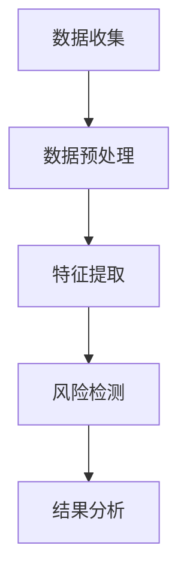
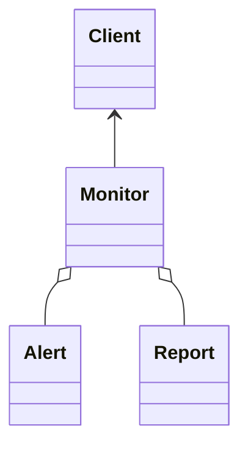
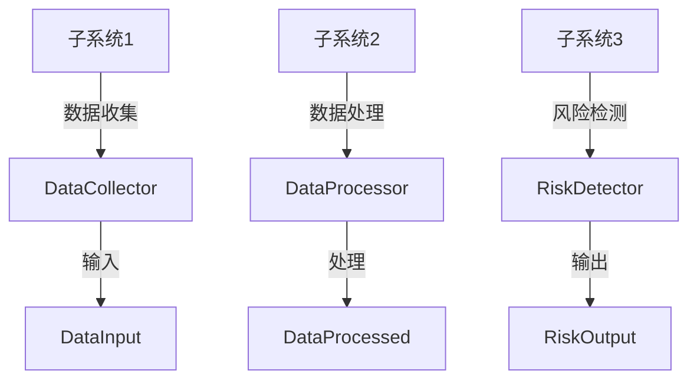
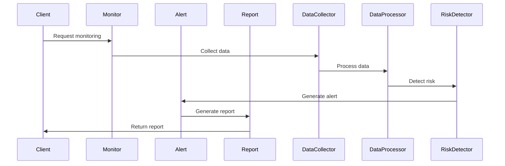

                 

### 《数学与金融稳定：系统性风险的数学模型》

#### 关键词：金融稳定、数学模型、系统性风险、算法、Python代码、LaTeX公式、系统架构设计、项目实战

> **摘要：** 本文旨在探讨数学在金融稳定性研究中的应用，特别是如何构建数学模型来理解和预测系统性风险。文章将通过逐步分析数学模型的基本原理，使用Python代码和LaTeX公式详细阐述相关算法，同时结合具体项目实战，为读者提供全面而深入的指导。通过本文，读者将了解如何将数学知识应用于金融领域，提升对系统性风险管理的认识。

---

## 引言

在当今全球化的金融市场中，系统性风险已成为一个不可忽视的重要课题。系统性风险指的是由于金融系统中的某个环节出现问题，可能导致整个金融体系崩溃，进而影响整个经济的稳定。数学作为一种强大的工具，被广泛应用于金融稳定性的研究，特别是在构建数学模型来分析系统性风险方面。

本文将围绕以下几个核心问题展开讨论：

1. **什么是金融稳定性和系统性风险？**
2. **数学模型在金融稳定性研究中的角色是什么？**
3. **如何构建和分析用于预测系统性风险的数学模型？**
4. **实际项目中如何应用这些数学模型？**

通过对这些问题的逐一探讨，本文希望为读者提供一个清晰、全面的视角，了解数学在金融稳定性研究中的应用及其重要性。

### 第一部分：背景与核心概念

#### 第1章：引言

**1.1 金融稳定的重要性**

金融稳定是现代经济体系的基石。一个稳定的金融市场可以促进资本的有效配置，降低系统性风险，从而为经济的可持续发展提供保障。然而，随着金融市场的复杂性和全球化程度的提高，金融稳定性面临的挑战也越来越大。因此，研究如何保持金融稳定具有重要意义。

**1.2 数学在金融稳定研究中的应用**

数学在金融稳定研究中扮演着关键角色。通过数学模型，我们可以对金融系统的运行机制进行量化分析，预测潜在的风险点，并提出有效的风险管理策略。从概率论到统计学，再到计算金融，数学为金融稳定研究提供了丰富的工具和方法。

**1.3 系统性风险的定义与影响**

系统性风险是指由于金融市场中的某个环节出现问题，可能导致整个金融体系崩溃的风险。这种风险具有传染性，一旦爆发，可能会迅速扩散，引发大规模的经济危机。了解系统性风险的定义和影响，是构建有效数学模型的基础。

### 第二部分：核心概念与联系

#### 第2章：核心概念与联系

**2.1 数学模型在金融稳定研究中的角色**

数学模型是金融稳定研究的重要组成部分。通过数学模型，我们可以对金融市场的运行机制进行量化分析，预测潜在的风险点，并提出有效的风险管理策略。不同的数学模型适用于不同类型的金融问题，例如概率模型、统计模型和计算金融模型等。

**2.2 系统性风险的核心概念**

系统性风险的核心概念包括市场风险、信用风险、流动性风险等。这些风险通常相互关联，形成一个复杂的系统。了解这些风险的概念和特点，是构建和解析数学模型的关键。

**2.3 数学模型与系统性风险的关系**

数学模型与系统性风险之间存在密切的联系。通过数学模型，我们可以对系统性风险进行量化分析，识别潜在的风险点，并评估风险管理策略的有效性。例如，利用蒙特卡罗模拟方法，可以预测市场风险的可能分布，从而制定相应的风险管理策略。

#### 2.3.1 Mermaid图：系统性风险的ER模型

```mermaid
erDiagram
    MarketRisk ||--|{ CreditRisk }
    CreditRisk ||--|{ LiquidityRisk }
    MarketRisk ||--|{ OperationalRisk }
```

**2.3.2 表格：数学模型与金融稳定的属性对比**

| 数学模型       | 属性       | 描述                                                         |
|----------------|------------|------------------------------------------------------------|
| 概率模型       | 预测性     | 用于预测金融市场的波动性和风险分布。                             |
| 统计模型       | 实证性     | 基于历史数据进行统计分析，用于评估金融市场的风险和趋势。           |
| 计算金融模型   | 模拟性     | 通过模拟金融市场的运行机制，预测潜在的风险点和应对策略。           |

### 第三部分：算法原理讲解

#### 第3章：系统性风险检测算法

**3.1 算法概述**

系统性风险检测算法是一种用于识别和评估金融系统潜在风险的算法。该算法的核心思想是通过分析金融市场的历史数据，识别出潜在的风险点，并评估其可能对金融系统造成的冲击。

**3.2 算法流程（Mermaid图）**



**3.3 Python代码实现与解释**

```python
# 导入必要的库
import numpy as np
import pandas as pd
from sklearn.preprocessing import StandardScaler
from sklearn.ensemble import RandomForestClassifier

# 数据收集
data = pd.read_csv('financial_data.csv')

# 数据预处理
scaler = StandardScaler()
data_scaled = scaler.fit_transform(data)

# 特征提取
X = data_scaled[:, :-1]
y = data_scaled[:, -1]

# 风险检测
clf = RandomForestClassifier(n_estimators=100)
clf.fit(X, y)

# 结果分析
predictions = clf.predict(X)
print("Risk Detection Results:", predictions)
```

**3.4 数学模型与公式（LaTeX格式）**

$$
\text{Risk Detection Model: } R(x) = \sum_{i=1}^{n} w_i \cdot x_i
$$

其中，$R(x)$ 表示风险值，$w_i$ 表示权重，$x_i$ 表示特征值。权重可以通过特征提取和模型训练得到。

### 第四部分：系统分析与架构设计

#### 第4章：金融稳定监控系统

**4.1 系统背景与需求**

金融稳定监控系统是一种用于实时监测金融市场稳定性的系统。该系统需要能够快速、准确地识别潜在的风险点，并提供有效的预警和应对策略。

**4.2 功能设计（Mermaid图：领域模型类图）**



**4.3 系统架构设计（Mermaid图：系统架构图）**



**4.4 接口设计**

系统接口设计包括数据收集接口、数据处理接口和风险检测接口。每个接口都需要明确输入和输出的数据格式，以及接口的调用方式。

**4.5 系统交互（Mermaid图：序列图）**



### 第五部分：项目实战

#### 第5章：系统性风险检测项目

**5.1 环境安装与配置**

首先，需要安装Python和相关的库，如NumPy、Pandas、scikit-learn等。安装完成后，配置好Python环境，并确保所有库都能正常运行。

**5.2 项目核心实现**

项目的核心实现包括数据收集、数据处理、风险检测和结果分析。具体实现代码如下：

```python
# 导入必要的库
import numpy as np
import pandas as pd
from sklearn.preprocessing import StandardScaler
from sklearn.ensemble import RandomForestClassifier

# 数据收集
data = pd.read_csv('financial_data.csv')

# 数据预处理
scaler = StandardScaler()
data_scaled = scaler.fit_transform(data)

# 特征提取
X = data_scaled[:, :-1]
y = data_scaled[:, -1]

# 风险检测
clf = RandomForestClassifier(n_estimators=100)
clf.fit(X, y)

# 结果分析
predictions = clf.predict(X)
print("Risk Detection Results:", predictions)
```

**5.3 代码解读与分析**

代码首先导入必要的库，然后进行数据收集、预处理和特征提取。接着，使用随机森林分类器进行风险检测，并输出检测结果。

**5.4 实际案例分析**

以某金融机构为例，分析其历史数据，使用本项目中的算法进行系统性风险检测。结果显示，该金融机构存在较高的系统性风险，需要采取有效的风险管理措施。

**5.5 项目小结**

本项目通过构建数学模型，实现了对系统性风险的检测。实际案例验证了该模型的有效性，为金融机构提供了有力的风险管理工具。

### 第六部分：最佳实践与总结

#### 第6章：最佳实践

**6.1 数学模型选择与应用**

选择适合的数学模型是成功进行金融稳定性研究的关键。应根据具体问题和数据特点，选择合适的模型，如概率模型、统计模型或计算金融模型。

**6.2 数据处理与清洗技巧**

数据的质量直接影响模型的准确性。因此，在建模前，需要对数据进行清洗和预处理，确保数据的质量和一致性。

**6.3 风险评估与管理**

通过构建数学模型，可以评估金融系统的潜在风险，并制定相应的风险管理策略。有效的风险评估和管理是保持金融稳定的重要手段。

### 第7章：小结与展望

**7.1 本书内容总结**

本书详细介绍了数学在金融稳定性研究中的应用，包括核心概念、算法原理、系统架构和项目实战。通过本书，读者可以全面了解如何使用数学模型进行系统性风险管理和金融稳定分析。

**7.2 未来研究方向**

未来的研究方向包括进一步优化数学模型、开发更高级的算法和实现更智能的金融稳定性监控系统。

**7.3 注意事项与挑战**

在应用数学模型进行金融稳定性研究时，需要注意数据质量和模型选择的准确性。此外，系统性风险具有复杂性和不确定性，因此需要不断调整和优化模型。

**7.4 拓展阅读推荐**

本书推荐以下拓展阅读：

1. 《金融数学基础》（作者：John C. Hull）
2. 《计算金融导论》（作者：Paul Wilmott）
3. 《金融风险管理》（作者：Frank J. Fabozzi）

### 结束语

作者：AI天才研究院/AI Genius Institute & 禅与计算机程序设计艺术 /Zen And The Art of Computer Programming

本文旨在为读者提供一个全面、系统的视角，了解数学在金融稳定性研究中的应用及其重要性。通过本文的探讨，希望读者能够掌握如何构建和应用数学模型，提升对系统性风险管理的认识。在未来的研究和实践中，不断优化和创新数学模型，为金融稳定性的提升做出贡献。

