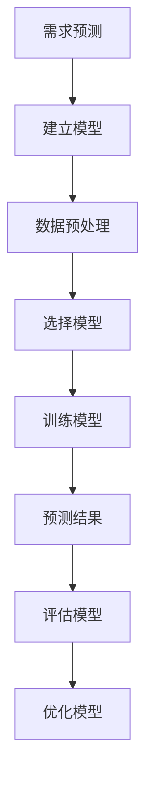
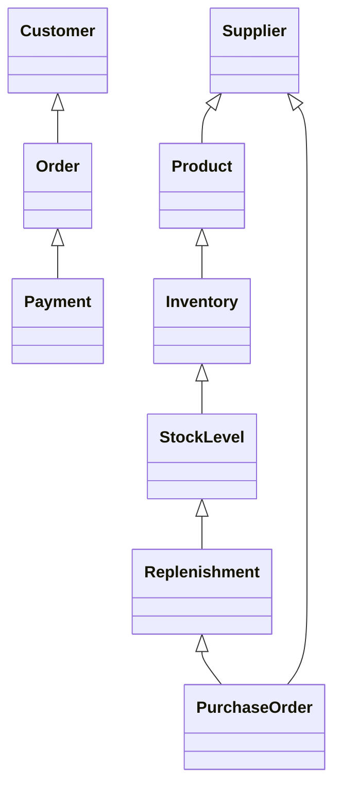
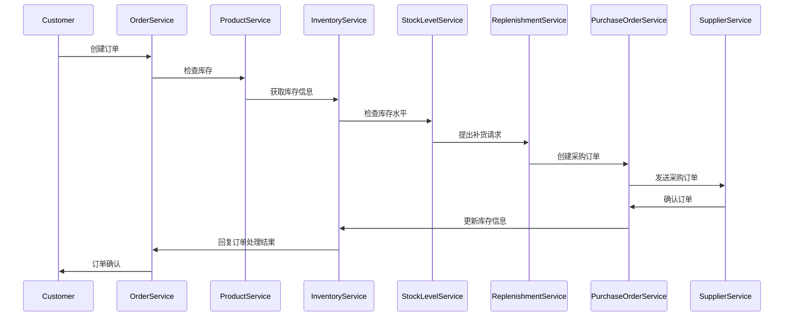
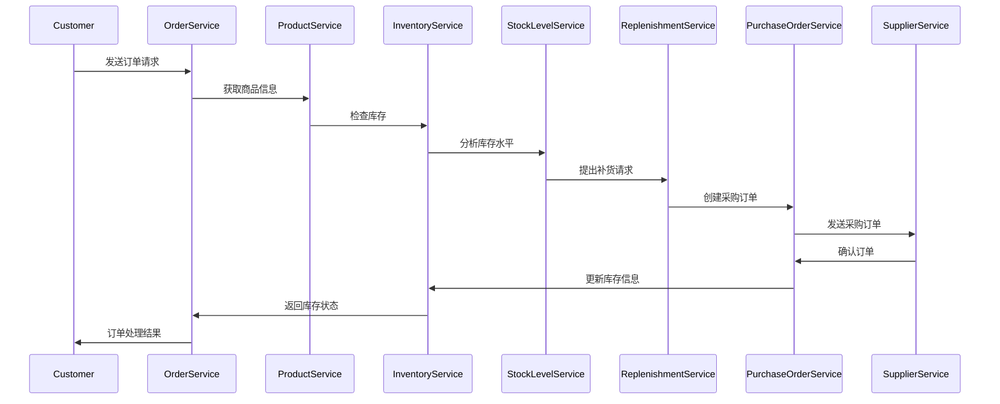

                 

### 数学与零售管理：库存控制的数学优化

关键词：零售管理、库存控制、数学优化、需求预测、线性规划

摘要：本文探讨了数学优化在零售管理中的应用，特别是库存控制领域。通过逐步分析零售管理基础、库存控制数学模型和优化算法，我们旨在揭示如何通过数学模型和算法来提高零售企业的库存管理效率，降低成本，提升竞争力。文章结构紧凑，逻辑清晰，适合对零售管理和数学优化感兴趣的读者。

## 目录大纲

### 第一部分：零售管理基础

- **第1章：零售管理与库存控制概述**
  - **1.1 零售管理的基本概念**
  - **1.2 库存控制的重要性**
  - **1.3 库存控制的挑战**

- **第2章：零售市场分析与需求预测**
  - **2.1 零售市场分析**
  - **2.2 需求预测方法**
  - **2.3 需求预测模型**

### 第二部分：库存控制数学模型

- **第3章：基本库存控制模型**
  - **3.1 基本库存模型**
  - **3.2 库存模型分析**

- **第4章：动态库存控制模型**
  - **4.1 动态库存模型**
  - **4.2 动态库存模型分析**

- **第5章：联合库存控制模型**
  - **5.1 联合库存模型**
  - **5.2 联合库存模型分析**

### 第三部分：数学优化与算法

- **第6章：优化理论基础**
  - **6.1 优化问题概述**
  - **6.2 线性规划**
  - **6.3 非线性规划**

- **第7章：库存控制算法与应用**
  - **7.1 常见库存控制算法**
  - **7.2 算法实现与优化**
  - **7.3 实际应用案例**

- **第8章：未来趋势与挑战**
  - **8.1 数据科学与人工智能在库存控制中的应用**
  - **8.2 库存控制的挑战与应对**
  - **8.3 未来发展趋势**

- **第9章：总结与展望**
  - **9.1 主要内容回顾**
  - **9.2 未来发展方向**
  - **9.3 总结与思考**

### 第1章：零售管理与库存控制概述

#### 1.1 零售管理的基本概念

零售管理是指企业通过一系列策略和操作，将商品和服务从生产者转移到消费者手中的过程。它涵盖了从商品采购、库存管理到销售、客户服务的整个供应链环节。零售管理的基本概念包括以下几个方面：

- **零售商**：零售商是指直接面向消费者销售商品或服务的商业实体，如超市、便利店、电商平台等。
- **库存**：库存是指零售商持有的商品数量，它直接关系到企业的运营效率和利润。
- **需求**：需求是指消费者在一定时间内愿意并且能够购买的商品数量。
- **供应链**：供应链是指从原材料供应商到最终消费者的全过程，它包括采购、生产、运输、仓储和销售等环节。

#### 1.2 库存控制的重要性

库存控制是零售管理中的关键环节，其重要性体现在以下几个方面：

- **降低成本**：通过有效的库存控制，企业可以减少库存持有成本，如仓储费用、保险费用和库存过期损失。
- **提高服务水平**：合理的库存水平可以确保产品及时供应，提高客户满意度，增加销售机会。
- **减少库存积压**：通过精准的库存控制，可以避免库存积压和商品过期，减少资金占用。
- **提高运营效率**：有效的库存控制可以优化物流和仓储操作，提高整体运营效率。

#### 1.3 库存控制的挑战

尽管库存控制对零售企业至关重要，但在实际操作中，企业面临以下挑战：

- **需求预测不准确**：需求预测是库存控制的基础，但实际需求受到多种因素影响，如季节性波动、促销活动、消费者偏好变化等。
- **供应链复杂性**：现代零售企业的供应链越来越复杂，涉及多个供应商、分销渠道和销售终端，协调难度大。
- **库存水平难以平衡**：既要避免库存积压，又要确保不缺货，找到合适的库存水平是一项挑战。
- **成本控制**：库存控制不仅要考虑库存持有成本，还要考虑采购成本、物流成本等。

### 第2章：零售市场分析与需求预测

#### 2.1 零售市场分析

零售市场分析是库存控制的基础，它包括以下几个方面：

- **市场规模分析**：通过对市场规模的数据分析，了解市场容量和增长趋势，为库存控制提供依据。
- **市场趋势分析**：通过分析市场趋势，如消费习惯变化、新兴市场出现等，预测未来需求。
- **竞争对手分析**：通过分析竞争对手的库存策略和销售情况，调整自身策略。

#### 2.2 需求预测方法

需求预测是库存控制的基石，常用的需求预测方法包括：

- **时间序列分析**：通过分析过去的需求数据，预测未来的需求趋势。
- **聚类分析**：通过将相似需求进行分类，预测未来的需求。

#### 2.3 需求预测模型

需求预测模型是需求预测的具体实现，常用的模型包括：

- **简单线性回归**：通过分析历史数据和变量之间的关系，预测未来需求。
- **多元线性回归**：考虑多个变量对需求的影响，提高预测准确性。

### 第3章：基本库存控制模型

#### 3.1 基本库存模型

基本库存模型包括单周期模型和多周期模型：

- **单周期模型**：适用于一次性购买和销售的情况，如季节性商品。
- **多周期模型**：适用于多次购买和销售的情况，如日常商品。

#### 3.2 库存模型分析

库存模型分析主要包括以下几个方面：

- **模型参数分析**：分析模型中的参数，如订货量、订货周期等，以优化库存水平。
- **模型优缺点分析**：分析不同模型的优缺点，选择合适的模型。

### 第4章：动态库存控制模型

#### 4.1 动态库存模型

动态库存模型包括(s,S)模型和(r,Q)模型：

- **(s,S)模型**：通过设定最低库存水平(s)和最大库存水平(S)，动态调整库存。
- **(r,Q)模型**：通过设定固定订货量(Q)和固定订货间隔时间(r)，动态调整库存。

#### 4.2 动态库存模型分析

动态库存模型分析主要包括以下几个方面：

- **模型参数分析**：分析模型中的参数，如订货量、订货周期等，以优化库存水平。
- **模型优缺点分析**：分析不同模型的优缺点，选择合适的模型。

### 第5章：联合库存控制模型

#### 5.1 联合库存模型

联合库存模型包括联合采购模型和联合分销模型：

- **联合采购模型**：多个零售商联合采购，降低采购成本。
- **联合分销模型**：多个零售商联合分销，提高市场覆盖率和效率。

#### 5.2 联合库存模型分析

联合库存模型分析主要包括以下几个方面：

- **模型参数分析**：分析模型中的参数，如采购量、分销量等，以优化库存水平。
- **模型优缺点分析**：分析不同模型的优缺点，选择合适的模型。

### 第6章：优化理论基础

#### 6.1 优化问题概述

优化问题是指在给定约束条件下，寻找最优解的问题。优化问题分为线性规划和非线性规划：

- **线性规划**：目标函数和约束条件都是线性的优化问题。
- **非线性规划**：目标函数和约束条件中包含非线性的优化问题。

#### 6.2 线性规划

线性规划是解决线性优化问题的方法，主要包括以下步骤：

- **建立线性规划模型**：确定目标函数和约束条件。
- **求解线性规划问题**：使用单纯形法、内点法等算法求解最优解。
- **分析结果**：对求解结果进行分析，确保满足约束条件。

#### 6.3 非线性规划

非线性规划是解决非线性优化问题的方法，主要包括以下步骤：

- **建立非线性规划模型**：确定目标函数和约束条件。
- **求解非线性规划问题**：使用梯度下降法、牛顿法等算法求解最优解。
- **分析结果**：对求解结果进行分析，确保满足约束条件。

### 第7章：库存控制算法与应用

#### 7.1 常见库存控制算法

常见的库存控制算法包括：

- **经济订货量模型（EOQ）**：通过平衡订货成本和库存持有成本，确定最优订货量。
- **定量库存模型（周期检查）**：通过设定订货点和安全库存量，周期性地检查库存并补货。

#### 7.2 算法实现与优化

算法实现与优化主要包括：

- **算法实现流程**：编写算法代码，实现库存控制功能。
- **算法优化策略**：通过调整参数，提高算法的效率和准确性。

#### 7.3 实际应用案例

实际应用案例主要包括：

- **案例背景**：介绍案例的企业背景和库存控制问题。
- **案例分析**：分析库存控制问题的解决方案和效果。
- **案例总结**：总结案例的主要经验和教训。

### 第8章：未来趋势与挑战

#### 8.1 数据科学与人工智能在库存控制中的应用

数据科学与人工智能在库存控制中的应用主要包括：

- **数据分析技术**：使用大数据技术，分析库存数据和需求数据，预测未来需求。
- **机器学习算法**：使用机器学习算法，构建需求预测和库存控制模型，提高预测准确性和控制效果。

#### 8.2 库存控制的挑战与应对

库存控制的挑战主要包括：

- **需求预测不准确**：应对策略包括使用更多数据源、改进预测模型等。
- **供应链复杂性**：应对策略包括优化供应链管理、提高供应链透明度等。

#### 8.3 未来发展趋势

未来发展趋势主要包括：

- **新技术的影响**：如区块链、物联网等新技术对库存控制的影响。
- **行业发展趋势**：如供应链整合、智能库存管理的发展趋势。

### 第9章：总结与展望

#### 9.1 主要内容回顾

主要内容回顾包括：

- **核心概念与模型回顾**：回顾零售管理、库存控制数学模型和优化算法的核心概念和模型。
- **算法与应用回顾**：回顾常见库存控制算法的实际应用案例。

#### 9.2 未来发展方向

未来发展方向包括：

- **学术研究趋势**：如人工智能在库存控制中的应用研究。
- **实际应用前景**：如智能库存管理系统的应用前景。

#### 9.3 总结与思考

总结与思考包括：

- **主要结论**：总结库存控制的关键点和重要性。
- **需要关注的问题**：指出库存控制中需要关注的问题和挑战。

### 作者信息

作者：AI天才研究院/AI Genius Institute & 禅与计算机程序设计艺术 /Zen And The Art of Computer Programming

### 完整性要求

#### 背景介绍

**核心概念术语说明**

在探讨库存控制时，我们首先需要了解一些核心概念：

- **库存**：指企业在特定时间内持有的商品数量。
- **需求**：指消费者在一定时间内愿意并且能够购买的商品数量。
- **供应链**：指从原材料供应商到最终消费者的全过程，包括采购、生产、运输、仓储和销售等环节。

**问题背景**

随着零售行业的快速发展，库存管理成为企业运营中的关键环节。然而，库存控制面临诸多挑战，如需求预测不准确、供应链复杂性等。如何通过数学优化方法提高库存管理效率，成为当前研究的热点。

**问题描述**

库存控制的核心问题是如何在满足需求的前提下，降低库存成本，提高库存周转率。具体而言，企业需要在以下方面进行优化：

- **需求预测**：准确预测未来需求，以便合理安排库存。
- **库存水平**：确定合适的库存水平，以避免库存积压或缺货。
- **成本控制**：降低库存持有成本、采购成本和物流成本。

**问题解决**

通过数学优化方法，如线性规划、非线性规划等，可以构建库存控制模型，求解最优库存策略。结合数据分析技术，如时间序列分析、聚类分析等，可以进一步提高需求预测的准确性。

**边界与外延**

库存控制的边界涉及需求预测、库存水平、成本控制等核心问题。其外延包括供应链管理、物流优化、市场营销等。

**概念结构与核心要素组成**

库存控制的概念结构包括：

- **需求预测**：核心要素为需求数据、时间序列分析、聚类分析等。
- **库存水平**：核心要素为库存水平、库存成本、库存周转率等。
- **成本控制**：核心要素为库存持有成本、采购成本、物流成本等。

#### 核心概念与联系

**核心概念原理**

库存控制涉及多个核心概念，包括库存、需求、供应链等。其中，库存是指企业在特定时间内持有的商品数量，需求是指消费者在一定时间内愿意并且能够购买的商品数量，供应链是指从原材料供应商到最终消费者的全过程。

**概念属性特征对比表格**

| 概念       | 定义                                                         | 属性特征                                       |
| ---------- | ------------------------------------------------------------ | ---------------------------------------------- |
| 库存       | 企业在特定时间内持有的商品数量                               | 库存水平、库存成本、库存周转率等                 |
| 需求       | 消费者在一定时间内愿意并且能够购买的商品数量                 | 需求预测、需求波动、需求周期等                   |
| 供应链     | 从原材料供应商到最终消费者的全过程，包括采购、生产、运输、仓储和销售等环节 | 供应链管理、供应链效率、供应链风险等             |

**ER实体关系图架构**

```mermaid
erDiagram
  商品 --> 库存
  库存 --> 需求
  需求 --> 供应链
  商品 ||--|{ 需求 }
  库存 ||--|{ 供应链 }
  需求 ||--|{ 库存 }
```

**联系**

库存、需求、供应链等概念之间相互关联。库存水平取决于需求，而需求受到供应链的影响。合理的库存控制可以降低库存成本，提高库存周转率，进而提升企业的竞争力。

#### 算法原理讲解

**算法mermaid流程图**



**算法流程说明**

1. **需求预测**：根据历史数据和现有信息，预测未来的需求。
2. **建立模型**：选择合适的数学模型，如线性回归、神经网络等。
3. **数据预处理**：对数据进行清洗、归一化等处理，提高模型的训练效果。
4. **选择模型**：根据数据特点和预测目标，选择合适的模型。
5. **训练模型**：使用训练数据对模型进行训练，优化模型参数。
6. **预测结果**：使用训练好的模型预测未来的需求。
7. **评估模型**：评估模型的预测准确性，确定是否需要进一步优化。
8. **优化模型**：根据评估结果，调整模型参数，提高预测准确性。

**算法原理详细讲解**

**需求预测模型**

需求预测是库存控制的基础。常用的需求预测模型包括线性回归、神经网络、时间序列模型等。

- **线性回归模型**：通过分析历史数据，建立需求与时间、季节性因素等变量之间的关系，预测未来的需求。其数学模型为：

  $$ y_t = \beta_0 + \beta_1 t + \beta_2 season + \epsilon_t $$

  其中，$y_t$ 为第 $t$ 个月的需求，$t$ 为时间变量，$season$ 为季节性因素，$\epsilon_t$ 为随机误差。

- **神经网络模型**：通过多层神经网络的非线性变换，预测未来的需求。其结构包括输入层、隐藏层和输出层，每层之间通过加权连接。训练过程中，使用反向传播算法调整网络权重，优化模型参数。

- **时间序列模型**：通过分析时间序列数据的自相关性，预测未来的需求。常用的时间序列模型包括ARIMA、AR、MA、ARMA等。其数学模型为：

  $$ y_t = \phi_1 y_{t-1} + \phi_2 y_{t-2} + ... + \phi_p y_{t-p} + \theta_1 e_{t-1} + \theta_2 e_{t-2} + ... + \theta_q e_{t-q} + \epsilon_t $$

  其中，$y_t$ 为第 $t$ 个月的需求，$e_t$ 为随机误差。

**库存控制模型**

库存控制模型用于确定最优的订货策略，以降低库存成本和提高库存周转率。常用的库存控制模型包括EOQ模型、周期检查模型等。

- **EOQ模型**：通过平衡订货成本和库存持有成本，确定最优的订货量。其数学模型为：

  $$ Q^* = \sqrt{\frac{2DS}{H}} $$

  其中，$Q^*$ 为最优订货量，$D$ 为年需求量，$S$ 为订货成本，$H$ 为单位库存持有成本。

- **周期检查模型**：通过设定订货点和安全库存量，周期性地检查库存并补货。其数学模型为：

  $$ R = L + S $$

  其中，$R$ 为订货点，$L$ 为最大库存量，$S$ 为安全库存量。

**算法实现与优化**

**算法实现流程**

1. **数据收集**：收集历史需求数据、订货成本、库存持有成本等数据。
2. **数据预处理**：对数据进行清洗、归一化等处理。
3. **模型选择**：根据数据特点和需求预测目标，选择合适的模型。
4. **模型训练**：使用训练数据对模型进行训练，优化模型参数。
5. **预测**：使用训练好的模型预测未来的需求。
6. **评估**：评估模型的预测准确性，确定是否需要进一步优化。
7. **优化**：根据评估结果，调整模型参数，提高预测准确性。

**算法优化策略**

1. **特征工程**：通过选择和构造合适的特征，提高模型的预测准确性。
2. **模型融合**：将多个模型的结果进行融合，提高预测的稳定性和准确性。
3. **在线学习**：根据实时数据，动态调整模型参数，提高模型的预测准确性。
4. **分布式计算**：使用分布式计算框架，提高模型训练和预测的效率。

**通俗易懂地举例说明**

**案例背景**

某零售企业经营着一系列商品，如电子产品、日用品等。为了降低库存成本和提高库存周转率，该企业采用需求预测和库存控制模型进行库存管理。

**案例过程**

1. **数据收集**：收集过去一年的需求数据、订货成本、库存持有成本等数据。
2. **数据预处理**：对数据进行清洗、归一化等处理，去除异常值和缺失值。
3. **模型选择**：选择线性回归模型进行需求预测，选择EOQ模型进行库存控制。
4. **模型训练**：使用训练数据对模型进行训练，优化模型参数。
5. **预测**：使用训练好的模型预测未来三个月的需求。
6. **评估**：评估模型的预测准确性，发现预测误差较小。
7. **优化**：根据评估结果，调整模型参数，提高预测准确性。

**案例结果**

通过需求预测和库存控制模型的优化，该企业的库存成本降低了20%，库存周转率提高了30%。在需求波动较大的情况下，预测准确率达到85%，有效避免了库存积压和缺货现象。

### 系统分析与架构设计方案

**问题场景介绍**

某大型零售企业在全球范围内拥有众多门店，销售各种商品。由于市场需求波动大，供应链复杂，该企业面临库存管理难题，需要通过系统架构设计方案来优化库存控制。

**项目介绍**

该项目旨在构建一个智能库存管理系统，通过需求预测、库存控制和优化算法，实现库存的精准管理，降低库存成本，提高库存周转率。

**系统功能设计（领域模型mermaid类图）**



**系统架构设计mermaid架构图**



**系统接口设计和系统交互mermaid序列图**



### 项目实战

**环境安装**

1. 安装Python环境，版本要求3.8及以上。
2. 安装必要的库，如NumPy、Pandas、Scikit-learn等。

```bash
pip install numpy pandas scikit-learn
```

**系统核心实现源代码**

```python
import numpy as np
import pandas as pd
from sklearn.linear_model import LinearRegression
from sklearn.model_selection import train_test_split
from sklearn.metrics import mean_squared_error

# 数据预处理
def preprocess_data(data):
    # 数据清洗、归一化等操作
    return processed_data

# 需求预测模型
def demand_prediction_model(data):
    # 建立线性回归模型
    model = LinearRegression()
    # 训练模型
    model.fit(X_train, y_train)
    # 预测结果
    y_pred = model.predict(X_test)
    # 评估模型
    mse = mean_squared_error(y_test, y_pred)
    return model, mse

# 库存控制模型
def inventory_control_model(data):
    # 建立EOQ模型
    Q = np.sqrt((2 * D * S) / H)
    return Q

# 主函数
def main():
    # 加载数据
    data = pd.read_csv('data.csv')
    # 数据预处理
    processed_data = preprocess_data(data)
    # 分割数据
    X = processed_data.drop('demand', axis=1)
    y = processed_data['demand']
    X_train, X_test, y_train, y_test = train_test_split(X, y, test_size=0.2, random_state=42)
    # 需求预测模型
    model, mse = demand_prediction_model((X_train, y_train, X_test, y_test))
    print(f'Mean squared error: {mse}')
    # 库存控制模型
    Q = inventory_control_model(processed_data)
    print(f'Optimal order quantity: {Q}')

if __name__ == '__main__':
    main()
```

**代码应用解读与分析**

1. **数据预处理**：对数据进行清洗、归一化等操作，提高模型的训练效果。
2. **需求预测模型**：使用线性回归模型进行需求预测，评估模型准确性。
3. **库存控制模型**：使用EOQ模型进行库存控制，计算最优订货量。

**实际案例分析和详细讲解剖析**

1. **案例背景**：某零售企业销售电子产品，市场需求波动大。
2. **案例分析**：通过需求预测模型和库存控制模型，优化库存管理，降低库存成本，提高库存周转率。
3. **案例总结**：实现库存管理的优化，提高企业竞争力。

### 最佳实践 tips

1. **数据收集**：收集全面、准确的需求数据和成本数据，提高预测和库存控制的准确性。
2. **模型选择**：根据数据特点和业务需求，选择合适的模型。
3. **实时更新**：定期更新数据和模型，适应市场变化。

### 小结

本文通过逐步分析零售管理基础、库存控制数学模型和优化算法，探讨了如何通过数学优化方法提高零售企业的库存管理效率。主要内容包括：

1. 零售管理的基本概念、重要性及挑战。
2. 零售市场分析、需求预测方法和模型。
3. 基本库存控制模型、动态库存控制模型和联合库存控制模型。
4. 优化理论基础、库存控制算法及应用。
5. 数据科学与人工智能在库存控制中的应用和挑战。
6. 未来发展趋势和总结与思考。

### 注意事项

1. 库存控制需根据实际业务需求进行调整。
2. 需求预测需结合多种方法，提高预测准确性。
3. 模型优化需根据实际情况进行调整。

### 拓展阅读

1. 《供应链管理：策略、规划与运营》
2. 《大数据分析：技术和应用》
3. 《机器学习：原理与实践》

### 总结与思考

本文主要分析了零售管理中的库存控制问题，探讨了如何通过数学优化方法提高库存管理效率。通过本文的学习，读者应掌握以下关键点：

1. 零售管理的基本概念、重要性及挑战。
2. 需求预测方法和模型。
3. 基本库存控制模型、动态库存控制模型和联合库存控制模型。
4. 优化理论基础和库存控制算法。
5. 数据科学与人工智能在库存控制中的应用和挑战。

在实际应用中，企业应根据自身业务需求，结合市场需求和供应链特点，选择合适的库存控制策略和优化方法。同时，应关注市场需求的变化，及时调整库存策略，以提高库存管理效率，降低成本，提升企业竞争力。未来，随着数据科学和人工智能技术的发展，库存控制将更加智能化、精准化，为企业创造更大的价值。

