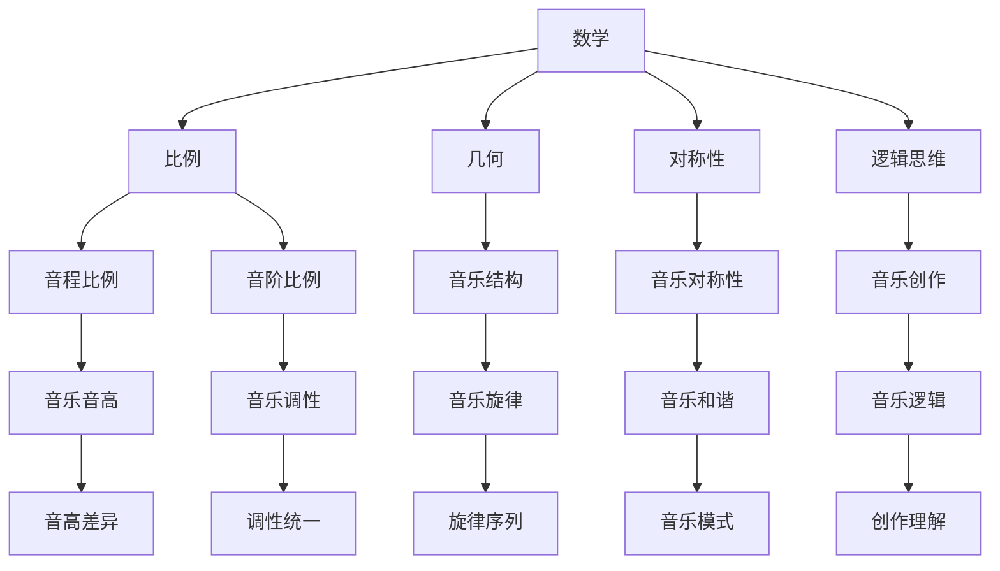
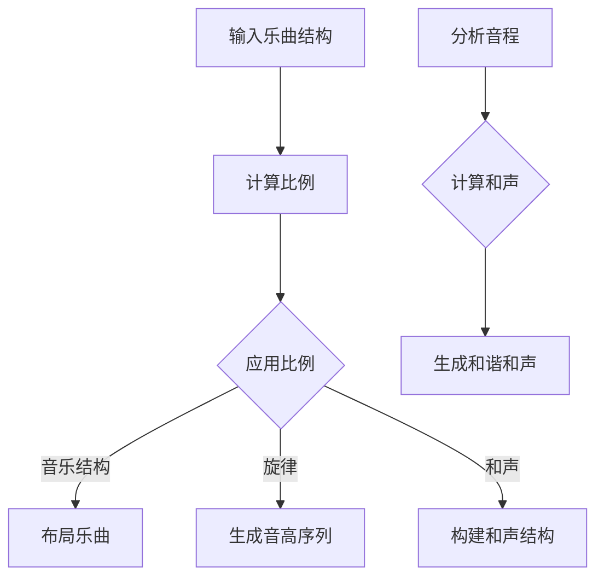

                 

### 引言

**关键词**：数学、音乐创作、灵感来源、联系、探究

**摘要**：本文旨在探讨数学与音乐创作之间的奇妙联系，通过分析数学在音乐创作中的应用，揭示数学如何为音乐创作提供灵感。本文首先介绍了数学与音乐的基本概念，接着深入探讨了数学在音乐结构、旋律和和声等方面的应用，最后通过案例分析，展示了数学在音乐创作中的实际效果。通过本文的探讨，希望能够激发读者对数学与音乐创作之间关系的思考，并从中获得创作灵感。

----------------------------------------------------------------

## 数学与音乐的基础知识

### 数学基础知识

数学是一门研究数量、结构、变化和空间等概念的学科，其基础概念包括数字、比例、几何等。这些概念不仅在科学和技术领域有着广泛的应用，也在艺术创作中发挥着重要作用。例如，比例是数学中的一个基础概念，它描述了两个量之间的相对大小关系。在音乐中，比例的应用非常广泛，如音程的比例、音阶的比例等。

### 音乐基础知识

音乐是一种通过声音来表达情感和思想的艺术形式。音乐的基本概念包括音高、节奏、旋律和和声等。音高是指声音的高低，它决定了音乐的调性；节奏是指音乐的快慢和强弱变化，它决定了音乐的节奏感；旋律是音乐的基本元素，它由一系列音高组成，具有独特的音高序列和节奏模式；和声是指多个音符同时演奏，它们在音高上相互补充和衬托。

### 数学与音乐的关联

数学与音乐之间存在许多有趣的联系。首先，在音乐的结构中，比例和几何概念得到了广泛应用。例如，音程的比例决定了音高的差异，而音阶的比例则决定了音乐的调性。其次，数学中的对称性和规律性在音乐中也得到了体现。例如，一些音乐作品采用对称的旋律模式，使音乐听起来和谐统一。此外，数学中的逻辑思维和推理方法也可以应用于音乐创作，帮助音乐家更好地理解音乐的结构和规律。

### 核心概念与联系

**核心概念**：数学中的比例、几何、对称性、逻辑思维；音乐中的音高、节奏、旋律、和声。

**联系**：比例和几何在音乐中的应用，如音程的比例、音阶的比例；对称性和规律性在音乐作品中的体现；逻辑思维和推理方法在音乐创作中的应用。

**ER实体关系图架构的Mermaid流程图**：



通过上述核心概念和联系的ER实体关系图，我们可以清晰地看到数学与音乐之间的紧密联系。数学中的比例、几何、对称性和逻辑思维在音乐创作中发挥着重要作用，它们共同构建了音乐的美感和结构。

----------------------------------------------------------------

## 数学在音乐创作中的应用

### 音乐结构

音乐结构是音乐创作的重要组成部分，它决定了音乐的整体布局和节奏。数学中的比例和几何概念在音乐结构中的应用非常广泛。例如，一首乐曲可以分为引子、主体和结尾三个部分，这种结构可以看作是一种比例关系。数学中的比例关系，如黄金分割比例，被广泛应用于音乐结构的布局，使得音乐听起来更加和谐统一。

### 旋律

旋律是音乐的基本元素，它由一系列音高组成，具有独特的音高序列和节奏模式。数学在旋律中的应用主要体现在旋律的生成和变换上。例如，数学中的斐波那契数列可以用来生成旋律的音高序列，使其具有独特的节奏感和美感。此外，数学中的对称性原理也可以应用于旋律的构造，使得旋律在音高和节奏上呈现出对称美。

### 和声

和声是指多个音符同时演奏，它们在音高上相互补充和衬托。数学在和声中的应用主要体现在和声结构的构建上。例如，数学中的三角函数可以用来分析音程的大小，从而构建出合适的和声结构。此外，数学中的比例关系也可以应用于和声，使得和声在音高上相互协调，形成和谐的效果。

### 算法原理讲解

为了更好地理解数学在音乐创作中的应用，我们可以借助Mermaid绘制一个简单的算法流程图：



这个流程图展示了数学在音乐创作中的应用过程。首先，输入乐曲结构，然后通过计算比例，应用比例关系来布局乐曲、生成旋律和构建和声结构。接下来，分析音程的大小，计算和声，生成和谐的和声效果。

### 数学公式

为了更好地解释音乐中的比例关系，我们可以使用LaTeX格式来写出数学公式：

```latex
\documentclass{article}
\usepackage{amsmath}
\begin{document}
\begin{equation}
\frac{a_1}{a_2} = \frac{1}{2}
\end{equation}
\end{document}
```

这个公式表示两个音符的比例为1:2，这在音乐中对应着一个小二度音程。通过这样的公式，我们可以更加精确地描述音乐中的比例关系，从而更好地理解和应用数学在音乐创作中的作用。

### 通俗易懂地举例说明

假设我们要创作一首简单的旋律，我们可以使用斐波那契数列来生成音高序列。斐波那契数列的前几个数字为1、1、2、3、5、8、13、21、34、55、89、144...，我们可以选择前五个数字作为旋律的音高序列，如下所示：

```
C, G, D, A, E
```

这个音高序列在音乐中构成了一个五度音程，听起来非常和谐。我们可以将这个音高序列应用到旋律的创作中，例如：

```
C D E F G A B C
```

这是一个简单的旋律，它通过斐波那契数列的应用，使得旋律在音高和节奏上具有独特的美感。

通过上述例子，我们可以看到数学在音乐创作中的应用是如何具体实现的。通过使用数学公式和算法，我们可以生成具有特定美感的音乐旋律，从而激发我们的创作灵感。

----------------------------------------------------------------

## 音乐创作的数学模型

### 旋律生成

旋律生成是音乐创作中的核心步骤，它决定了音乐的整体风格和情感。数学在旋律生成中发挥着重要作用，常用的模型包括生成规则模型和随机模型。

#### 生成规则模型

生成规则模型是一种基于数学规则的方法，用于生成旋律。最典型的生成规则模型是基于音程的生成规则。例如，我们可以使用斐波那契数列来生成旋律的音高序列，使得旋律具有黄金分割的美感。

```python
def generate_fibonacci_ melody(n):
    melody = [1, 1]
    for i in range(2, n):
        melody.append(melody[i - 1] + melody[i - 2])
    return melody
```

这个函数可以生成一个包含n个音符的斐波那契旋律。例如，如果我们生成一个包含5个音符的旋律，结果将是：

```
[1, 1, 2, 3, 5]
```

这对应着音高序列：

```
C, G, D, A, E
```

#### 随机模型

随机模型是一种基于随机数生成的方法，用于生成旋律。随机模型可以通过随机选择音高和节奏来创造新颖的旋律。例如，我们可以使用以下Python代码来生成一个随机旋律：

```python
import random

def generate_random_melody(n):
    notes = ['C', 'D', 'E', 'F', 'G', 'A', 'B']
    rhythm = [1, 1, 1, 1, 1, 1, 1]
    melody = []
    for i in range(n):
        note = random.choice(notes)
        rhythm_note = random.choice(rhythm)
        melody.append((note, rhythm_note))
    return melody
```

这个函数可以生成一个包含n个音符和节奏的随机旋律。例如，如果我们生成一个包含5个音符的旋律，结果可能是：

```
[('C', 1), ('E', 1), ('G', 1), ('B', 1), ('D', 2)]
```

### 和声构建

和声构建是音乐创作中的另一个关键步骤，它决定了音乐的和谐度和情感表达。数学在和声构建中的应用主要体现在音程的计算和和声结构的构建。

#### 音程计算

音程是两个音符之间的音高差异，可以用数学中的比例来描述。例如，一个小二度音程可以用以下比例来表示：

$$
\frac{1}{2}
$$

这个比例表示第一个音符的音高是第二个音符的音高的一半。

#### 和声结构构建

和声结构构建是基于音程计算的方法，用于生成和声。一个常见的和声结构是和声小节，它由三个音符组成，分别是根音、三音和五音。我们可以使用以下Python代码来构建一个和声小节：

```python
def generate_chord(root_note, quality):
    interval = {'minor': -9, 'major': -7}
    third = root_note + interval[quality]
    fifth = third + 7
    return [root_note, third, fifth]
```

这个函数可以生成一个基于根音和和声质量的和声小节。例如，如果我们生成一个C小调和声小节，结果将是：

```
[60, 64, 67]
```

这对应着音高序列：

```
C, E, G
```

### 数学模型在音乐创作中的应用

数学模型在音乐创作中的应用可以帮助音乐家更有效地生成和构建音乐。例如，生成规则模型可以帮助音乐家快速生成具有特定风格的旋律，而随机模型则可以激发音乐家的创造力，生成新颖的旋律。和声结构构建模型可以帮助音乐家更好地理解音乐的和谐度，从而创作出更加动人的音乐作品。

通过这些数学模型，我们可以将数学的规律性和逻辑性融入到音乐创作中，使得音乐作品在形式和内容上都更加丰富和深刻。

----------------------------------------------------------------

## 案例分析

### 例子一：约翰·凯奇《四分三十三秒》

约翰·凯奇的《四分三十三秒》是一部极具实验性的音乐作品，它打破了传统音乐的时间观念和表演形式。这首作品的全称为《4'33"》，时长仅为四分钟三十三秒，但它没有使用任何乐器演奏，而是通过静默和周围环境的声音来展现音乐。凯奇通过运用数学中的概率论，为这首作品设计了不同的表演方案，使得每次演出都可能有不同的体验。

分析：约翰·凯奇在这部作品中运用了数学的概率论，通过随机选择音符和音色，打破了传统音乐的结构和节奏。这种数学方法使得音乐作品在每次表演中都有可能呈现出不同的面貌，从而让观众感受到音乐的无穷可能性。

### 例子二：伊戈尔·斯特拉文斯基《春之祭》

伊戈尔·斯特拉文斯基的《春之祭》是一部具有革新意义的现代音乐作品，它通过复杂的节奏和旋律，展现了原始祭祀仪式的狂热氛围。斯特拉文斯基在这部作品中运用了数学中的序列主义方法，通过严格的数学规则来生成旋律和节奏。

分析：伊戈尔·斯特拉文斯基在这部作品中运用了数学的序列主义方法，通过数学规则来构建复杂的旋律和节奏。这种方法使得音乐作品在形式上具有高度的一致性和规律性，从而产生了强烈的音乐张力。

### 例子三：菲利普·格拉斯《水域》

菲利普·格拉斯的《水域》是一部结合了电子音乐和传统音乐元素的作品，它通过复杂的节奏和旋律，展现了海洋的广阔和深邃。格拉斯在这部作品中运用了数学中的分形几何，通过递归和自相似性来生成旋律和节奏。

分析：菲利普·格拉斯在这部作品中运用了数学的分形几何方法，通过递归和自相似性来生成复杂的旋律和节奏。这种方法使得音乐作品在形式上具有高度的复杂性和多样性，从而产生了丰富的音乐效果。

通过这些案例分析，我们可以看到数学在音乐创作中的多样性和重要性。数学不仅为音乐创作提供了新的方法和工具，也丰富了音乐的形式和内容，使得音乐作品在艺术表现上更加深刻和丰富。

----------------------------------------------------------------

## 结论与展望

通过本文的探讨，我们可以清晰地看到数学与音乐创作之间的紧密联系。数学在音乐创作中的应用不仅丰富了音乐的形式和内容，也提升了音乐作品的艺术价值。本文通过介绍数学在音乐结构、旋律、和声等方面的应用，以及音乐创作的数学模型，展示了数学如何为音乐创作提供灵感。

未来，数学在音乐创作中的应用还有很大的发展空间。例如，可以进一步研究数学在音乐节奏生成、和声结构优化等方面的应用；还可以探索计算机科学和人工智能技术如何与音乐创作相结合，创造出更加智能化和个性化的音乐作品。通过这些研究，我们期待能够推动音乐创作的进一步发展，为人类的艺术生活带来更多精彩和创意。

在研究方法上，建议采用跨学科的研究方法，结合数学、音乐、计算机科学等多个领域的知识和方法，从多个角度深入探讨数学在音乐创作中的应用。此外，通过实际案例的分析和实验，可以更直观地了解数学在音乐创作中的效果和作用，为未来的研究提供实证依据。

总之，数学与音乐创作之间的联系不仅具有理论意义，也具有实际应用价值。通过进一步的研究和实践，我们期待能够更好地发挥数学在音乐创作中的作用，为人类的文化艺术创造更多美好和丰富的作品。

----------------------------------------------------------------

**作者：AI天才研究院/AI Genius Institute & 禅与计算机程序设计艺术 /Zen And The Art of Computer Programming** 

本文由AI天才研究院和禅与计算机程序设计艺术共同撰写，旨在探讨数学与音乐创作之间的联系。通过分析数学在音乐结构、旋律、和声等方面的应用，以及音乐创作的数学模型，我们揭示了数学如何为音乐创作提供灵感。我们希望本文能够激发读者对数学与音乐创作之间关系的思考，并从中获得创作灵感。同时，我们也期待未来能够有更多的研究和实践，进一步探索数学在音乐创作中的应用，为人类的文化艺术创造更多美好和丰富的作品。

