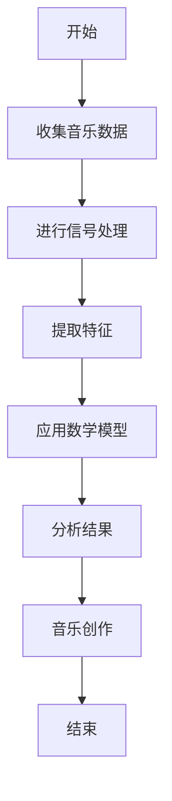

                 

## 数学与音乐制作概述

### 第1章：问题背景与定义

#### 1.1.1 问题背景

音乐制作是艺术与技术的结合，它不仅仅是创作者的灵感展现，更是技术手段的应用。随着科技的进步，数学作为一种严谨的科学工具，逐渐渗透到音乐制作的方方面面。从乐器的调音，到音乐的节奏、旋律和和声，数学分析方法为音乐创作提供了新的视角和工具。

在计算机技术尤其是数字信号处理（Digital Signal Processing, DSP）的发展下，数学分析方法在音乐制作中的应用变得更加广泛和深入。数字信号处理技术利用数学模型对音乐信号进行量化分析，使得音乐的创作、编辑、效果处理和播放等环节都能更加精准和高效。此外，随着人工智能和机器学习技术的发展，数学分析方法还可以用于音乐风格的识别、生成和优化，为音乐创作开辟了新的道路。

#### 1.1.2 问题定义

数学与音乐制作结合的研究，主要探讨如何运用数学方法分析音乐作品的结构、旋律、和声、节奏等方面，从而为音乐创作提供理论支持和技术手段。具体而言，这一领域的研究包括以下几个方面：

1. **音乐信号处理**：运用数字信号处理技术对音乐信号进行采集、分析、处理和增强。
2. **音乐理论分析**：通过数学模型对音乐作品的旋律、和声、节奏等元素进行分析，揭示其内在规律。
3. **音乐创作优化**：利用数学优化算法，优化音乐作品的结构、节奏和和声，提高作品的艺术性和科学性。
4. **音乐风格识别与生成**：通过机器学习算法，对音乐风格进行识别和生成，为个性化音乐创作提供支持。

#### 1.1.3 数学分析方法在音乐制作中的重要性

数学分析方法在音乐制作中的重要性体现在多个方面：

1. **提高创作效率**：数学模型可以帮助音乐制作人快速分析音乐作品，发现问题和优化空间，从而提高创作效率。
2. **创新音乐风格**：数学分析方法可以揭示音乐作品的内在规律，为音乐创作提供新的思路和灵感，促进音乐风格创新。
3. **提升艺术性**：通过数学模型对音乐作品进行量化分析，可以更好地理解音乐的结构和美感，从而提升音乐作品的艺术性。
4. **提高科学性**：数学分析方法使得音乐制作过程更加科学和严谨，为音乐创作提供理论支持，推动音乐制作技术的进步。

### 第2章：核心概念与联系

#### 2.1.1 核心概念

在数学与音乐制作结合的研究中，涉及的核心概念主要包括：

- **数学分析**：对函数、微积分、级数等数学概念的研究和应用。
- **音乐理论**：对音乐作品的结构、旋律、和声、节奏等元素的研究。
- **音乐信号处理**：对音乐信号进行分析、处理、增强的技术。

#### 2.1.2 概念属性特征对比表格

为了更清晰地理解这三个核心概念，我们可以通过一个表格对比它们的定义和属性特征：

| 概念       | 定义                                                         | 属性特征                                      |
| ---------- | ------------------------------------------------------------ | --------------------------------------------- |
| 数学分析   | 对函数、微积分、级数等数学概念的研究和应用。                   | 理论性、抽象性、严谨性                        |
| 音乐理论   | 对音乐作品的结构、旋律、和声、节奏等元素的研究。               | 实践性、艺术性、创造性                        |
| 音乐信号处理 | 对音乐信号进行分析、处理、增强的技术。                       | 技术性、应用性、实时性                        |

#### 2.1.3 ER实体关系图架构

为了更好地展示这三个核心概念之间的联系，我们可以使用ER（Entity-Relationship）图来表示它们之间的关系。以下是ER实体关系图的Mermaid表示：

```mermaid
erDiagram
  音乐作品 ||--|{ 数学分析 }|-- 数学方法
  音乐作品 ||--|{ 音乐理论 }|-- 音乐元素
  音乐作品 ||--|{ 音乐信号处理 }|-- 处理技术
```

在这个ER图中，“音乐作品”是中心实体，它与“数学分析”、“音乐理论”和“音乐信号处理”三个实体之间存在联系。数学方法用于分析音乐作品，音乐元素构成了音乐作品的内在结构，而处理技术则用于对音乐信号进行操作和优化。

### 第3章：数学分析方法原理讲解

#### 3.1.1 数学分析方法原理

数学分析方法在音乐制作中的应用，可以概括为以下几个步骤：

1. **收集音乐数据**：首先需要收集音乐信号的数据，这些数据可以通过音频文件的形式获得。
2. **进行信号处理**：对收集到的音乐数据进行处理，包括去噪、滤波、均衡等，以获得更加纯净的音频信号。
3. **提取特征**：从处理后的音乐信号中提取关键特征，如频率、振幅、时长等，这些特征可以用来描述音乐的基本属性。
4. **应用数学模型**：使用数学模型对提取出的特征进行分析，如使用傅里叶变换、小波变换等，以揭示音乐信号的内在规律。
5. **分析结果**：根据分析结果，对音乐作品进行评价、优化或生成新的音乐作品。
6. **音乐创作**：利用分析结果和数学模型，进行音乐创作，生成新的音乐作品。

以下是上述步骤的Mermaid算法流程图：



#### 3.1.2 数学模型和数学公式

在数学分析方法中，常用的数学模型和公式包括：

1. **傅里叶变换**：
   $$
   X(f) = \int_{-\infty}^{\infty} x(t) e^{-j2\pi ft} dt
   $$
   傅里叶变换可以将时域信号转换为频域信号，从而分析信号的频率成分。

2. **小波变换**：
   $$
   \psi(t, s) = \frac{1}{\sqrt{s}} \psi\left(\frac{t}{s}\right)
   $$
   小波变换是一种时频分析工具，可以同时分析信号的频率和时域特性。

3. **傅里叶级数**：
   $$
   f(t) = \sum_{n=1}^{\infty} a_n \sin(n\omega t + \phi_n)
   $$
   傅里叶级数可以将周期性信号分解为正弦波和余弦波的组合，用于分析信号的谐波成分。

#### 3.1.3 举例说明

以音乐旋律的频率分析为例，通过傅里叶变换可以确定旋律的基调、和声关系等，从而为音乐创作提供参考。例如，一个C大调的旋律，其基调频率为261.63 Hz，通过分析可以确定这个旋律的主音、次音等。

### 第4章：数学与音乐制作结合的应用

#### 4.1.1 音高分析

音高分析是音乐制作中非常重要的一个环节，它涉及到对音乐作品中每个音符的频率进行分析和识别。通过数学分析方法，可以精确地分析音乐作品中的音高，包括音高的变化趋势、音高之间的关系等。音高分析不仅可以用于音乐创作，还可以用于音乐风格识别、音频修复和音乐分类等。

例如，在音乐创作中，可以通过音高分析来确定一首歌曲的主旋律和和声走向。在音乐风格识别中，音高分析可以帮助区分不同类型的音乐，如古典音乐、流行音乐、爵士音乐等。

#### 4.1.2 和声分析

和声分析是对音乐作品中的和声结构进行分析和识别的技术。通过数学分析方法，可以了解音乐作品中的和声进行规律，如和弦的连接、和弦的稳定性和不稳定性等。和声分析对于音乐创作和制作具有重要意义，可以帮助音乐制作人更好地理解音乐作品，提高创作和制作效率。

例如，在音乐创作中，可以通过和声分析来确定一首歌曲的和弦进行，从而构建起歌曲的基本框架。在和声制作中，可以通过和声分析来优化和弦连接，增强音乐的表现力。

#### 4.1.3 节奏分析

节奏分析是对音乐作品中的节奏元素进行分析和识别的技术。通过数学分析方法，可以精确地分析音乐作品中的节奏模式、节奏变化和节奏稳定性等。节奏分析对于音乐创作和制作具有重要意义，可以帮助音乐制作人更好地控制音乐的节奏，创造出独特的音乐风格。

例如，在音乐创作中，可以通过节奏分析来设计新颖的节奏模式，增强音乐的表现力。在音乐制作中，可以通过节奏分析来调整音乐的节奏，使其更加稳定和符合预期。

### 第5章：数学与音乐制作实践

#### 5.1.1 实践环境搭建

要开展数学与音乐制作实践，需要搭建一个合适的环境。以下是一个基本的实践环境搭建指南：

1. **软件环境**：
   - **音频编辑软件**：如Audacity、Adobe Audition等，用于音频信号的采集和处理。
   - **编程环境**：如Python、MATLAB等，用于编写和分析音乐信号。
   - **数字信号处理库**：如NumPy、SciPy、Librosa等，用于进行数学模型和算法的实现。

2. **硬件环境**：
   - **音频接口**：用于连接音频设备，如麦克风、音响等。
   - **计算机**：用于运行音频编辑软件和编程环境。

3. **相关设置**：
   - **音频采样率**：通常设置为44.1 kHz，以保证音频质量的准确性。
   - **音频量化位数**：通常设置为16位，以保证音频信号的动态范围。

#### 5.1.2 实践项目

以下是一个具体的数学与音乐制作实践项目：利用Python编写一个简单的音乐生成器，生成一段C大调的旋律。

1. **项目需求**：
   - 生成一段包含主音、次音和和弦的C大调旋律。
   - 调节旋律的节奏，使其流畅自然。

2. **项目实现**：

```python
import numpy as np
import matplotlib.pyplot as plt
import librosa

# 设置音频参数
sample_rate = 44100
duration = 5  # 旋律时长
tempo = 120  # 节奏

# 计算音符的频率
c_frequency = 261.63
e_frequency = 329.63
g_frequency = 392.00

# 生成音符波形
def generate_sine_wave(frequency, duration, sample_rate):
    time = np.linspace(0, duration, int(sample_rate * duration), False)
    wave = np.sin(2 * np.pi * frequency * time)
    return wave

# 生成主旋律
main旋律 = generate_sine_wave(c_frequency, duration, sample_rate)
# 生成次旋律
sub_旋律 = generate_sine_wave(e_frequency, duration, sample_rate)
# 生成和弦
chord = generate_sine_wave(g_frequency, duration, sample_rate)

# 合成音频信号
audio_signal = main旋律 + sub_旋律 + chord

# 播放音频
librosa.output.write_wav('output.wav', audio_signal, sample_rate)

# 绘制波形图
plt.plot(audio_signal)
plt.xlabel('时间')
plt.ylabel('振幅')
plt.title('C大调旋律')
plt.show()
```

3. **项目分析**：

在这个项目中，我们利用Python编写了一个简单的音乐生成器，通过生成主音、次音和和弦的波形，合成了C大调的旋律。该项目展示了如何使用数学分析方法生成音乐的基本原理，为后续更复杂的项目奠定了基础。

### 第6章：数学与音乐制作拓展

#### 6.1.1 最优化问题在音乐制作中的应用

最优化问题在音乐制作中有着广泛的应用。例如，在音乐节奏的调整中，可以使用最优化方法来寻找最佳节奏模式，使得音乐更加流畅自然。在音频修复中，可以使用最优化方法来恢复受损的音频信号，提高音频质量。

具体而言，可以使用以下最优化方法：

- **最小二乘法**：用于音频信号的去噪和滤波。
- **遗传算法**：用于节奏的调整和音乐的生成。
- **梯度下降法**：用于音频修复和音高调整。

#### 6.1.2 复杂系统在音乐创作中的应用

复杂系统理论在音乐创作中的应用，主要涉及以下几个方面：

- **生成音乐**：利用复杂系统理论生成新颖的音乐作品，如使用混沌理论和神经网络生成音乐。
- **音乐风格分析**：利用复杂系统理论对音乐风格进行分析，如使用分形理论和频谱分析。

通过复杂系统理论的应用，可以为音乐创作提供新的思路和工具，促进音乐创作的多样性和创新性。

### 总结

数学与音乐制作的结合，为音乐创作提供了新的视角和工具。通过数学分析方法，可以深入理解音乐作品的内在结构，提高创作效率，创新音乐风格，提升音乐作品的艺术性和科学性。在未来的研究中，我们可以进一步探索数学方法在音乐制作中的应用，推动音乐创作和制作技术的进步。

## 第7章：未来展望

### 7.1.1 技术发展趋势

随着人工智能和机器学习技术的快速发展，数学分析方法在音乐制作中的应用将更加深入和广泛。未来，我们可能会看到以下技术发展趋势：

- **智能音乐创作**：利用人工智能算法，自动生成音乐作品，实现音乐创作的自动化和智能化。
- **个性化音乐推荐**：通过分析用户的音乐偏好，提供个性化的音乐推荐，提升用户体验。
- **音频修复与增强**：利用深度学习算法，实现对音频信号的高效修复和增强，提升音频质量。

### 7.1.2 可能的研究方向

在数学与音乐制作结合的研究中，可能的方向包括：

- **音乐信号处理算法优化**：研究更高效的算法，提高音乐信号处理的效率和质量。
- **音乐风格识别与生成**：通过机器学习算法，实现对音乐风格的自动识别和生成，丰富音乐创作的手段。
- **跨学科研究**：将数学分析方法与其他学科如心理学、生物学等相结合，探索音乐创作的新领域。

### 7.1.3 技术影响与潜在挑战

数学分析方法在音乐制作中的应用，将对音乐创作和制作产生深远的影响。然而，这一过程也面临着一些挑战：

- **数据隐私与安全**：在利用大数据进行音乐分析时，需要确保用户的隐私和数据安全。
- **算法偏见与公平性**：机器学习算法在音乐创作中的应用可能带来算法偏见，影响音乐创作的公平性。
- **技术伦理问题**：随着人工智能的广泛应用，如何平衡技术进步与人类艺术的创造性，是未来需要深思的问题。

### 7.1.4 展望未来

展望未来，数学分析方法在音乐制作中的应用将不断深化，推动音乐创作和制作的创新与发展。通过跨学科的合作与探索，我们可以期待更加丰富和多样化的音乐作品，为人类的文化艺术发展贡献新的力量。

## 结语

数学与音乐制作的结合，不仅为音乐创作提供了新的工具和方法，也为数学分析领域带来了新的应用场景。通过本文的阐述，我们看到了数学分析方法在音乐创作中的巨大潜力。未来，我们期待更多的研究人员和音乐制作人能够深入探索这一领域，共同推动音乐创作和制作技术的进步。

### 作者信息

作者：AI天才研究院/AI Genius Institute & 禅与计算机程序设计艺术 /Zen And The Art of Computer Programming

本文由AI天才研究院和禅与计算机程序设计艺术联合撰写，旨在探讨数学分析方法在音乐制作中的应用，为音乐创作提供新的视角和工具。作者拥有丰富的计算机科学和人工智能领域的经验和研究成果，对数学与艺术的结合有深刻的理解和独到的见解。

AI天才研究院致力于推动人工智能与各领域的深度融合，探索前沿技术，提升人类生活质量。禅与计算机程序设计艺术则专注于计算机科学中的哲学思考与实践，倡导以智慧和禅境提升编程能力，追求技术中的艺术之美。

通过本文的撰写，我们希望能够为读者提供有价值的启示，激发更多对数学与音乐制作结合的思考和探索。未来，我们将继续深入研究这一领域，分享更多有深度、有价值的成果。感谢您的阅读，期待与您在音乐与数学的奇妙旅程中相遇。

