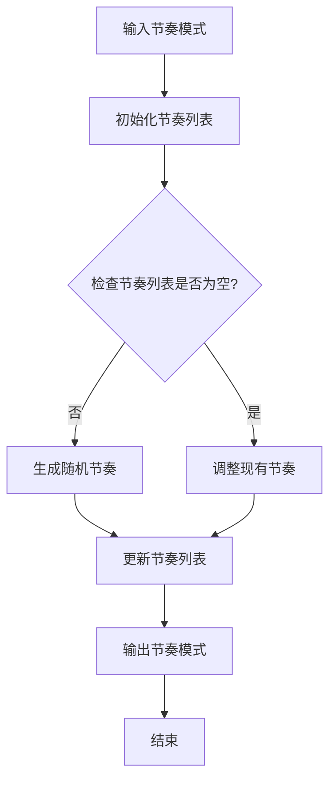
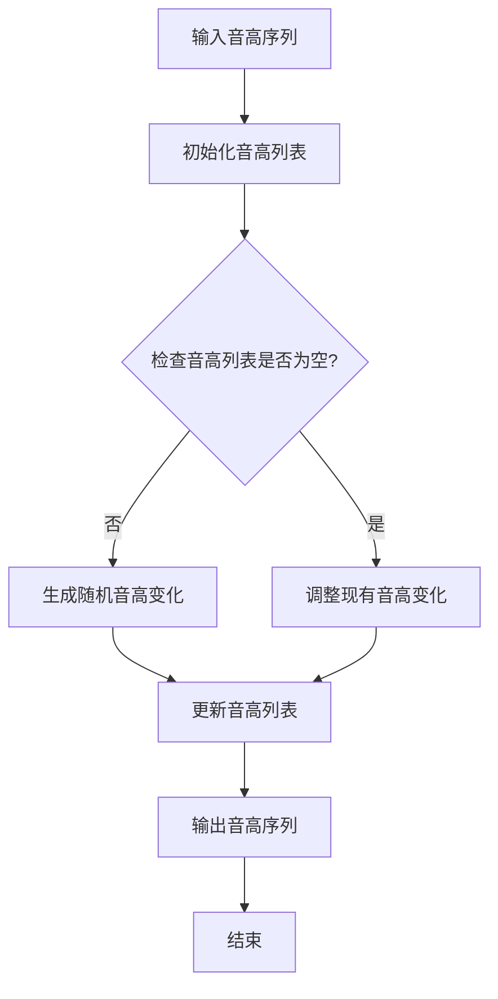
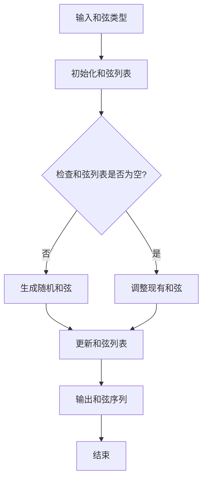
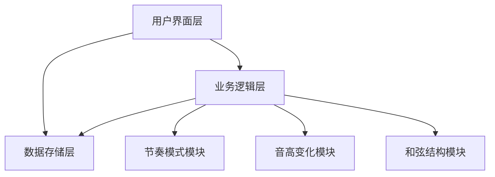
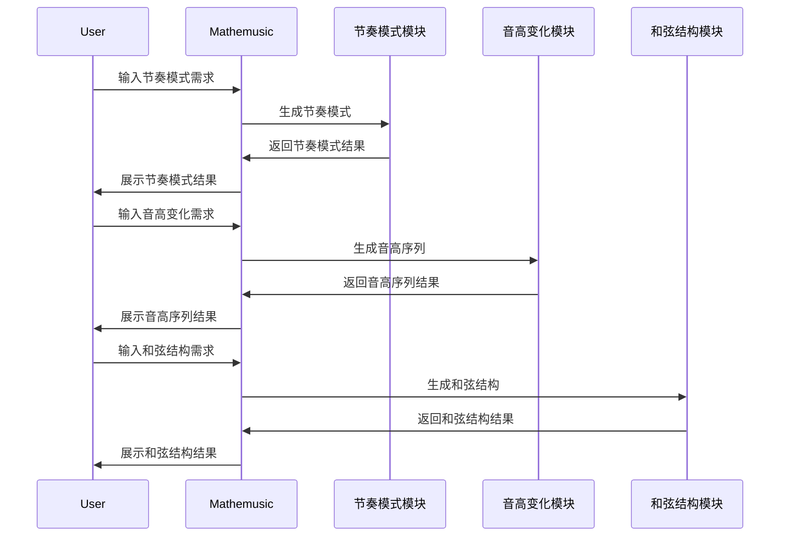

                 

### 数学与音乐即兴创作的理论基础

**关键词：** 数学与音乐，即兴创作，理论基础，节奏模式，音高，和弦

**摘要：** 本文章探讨了数学与音乐即兴创作的理论基础，通过分析数学在音乐中的应用，如分数、比例和傅里叶变换，以及音乐即兴创作中的数学模型，旨在为读者提供一个清晰且系统的理解，帮助其在音乐创作中运用数学原理，提升即兴创作的技巧和创造力。

---

### 背景介绍

#### 问题背景

数学与音乐即兴创作是两个看似独立的领域，但它们在人类的文化和艺术中有着悠久的历史。数学作为精确的科学，为音乐创作提供了理论基础，而音乐即兴创作则展示了艺术家的创造力和技巧。随着计算机技术的发展，这两个领域开始融合，为数学与音乐即兴创作的理论研究提供了新的契机。

#### 问题描述

本书旨在探讨数学与音乐即兴创作的理论基础，包括数学在音乐中的运用，以及如何运用数学原理来进行音乐即兴创作。主要问题包括：如何将数学概念应用于音乐创作中？数学在音乐节奏、音高、和弦等方面的作用是什么？如何通过数学模型来预测和生成即兴创作的音乐？

#### 问题解决

本书将通过以下几个部分来回答上述问题：
1. 探讨数学与音乐即兴创作的历史背景和理论基础。
2. 引入核心数学概念，如分数、比例、傅里叶变换等，并展示其在音乐中的应用。
3. 分析音乐即兴创作中的数学模型，包括节奏模式、音高变化、和弦结构等。
4. 提供实际案例和工具，帮助读者理解和应用数学与音乐即兴创作的理论。

#### 边界与外延

本书的研究范围将主要围绕数学与音乐即兴创作的理论层面，不涉及具体的音乐创作实践。同时，本书将重点关注常见的数学概念和模型，而非全面探讨所有可能的数学应用。

#### 概念结构与核心要素组成

核心概念：
- 数学与音乐的关系
- 数学在音乐中的应用
- 音乐即兴创作的理论基础

核心要素：
- 历史背景
- 核心数学概念
- 音乐即兴创作的数学模型
- 实际应用案例

---

### 1. 背景介绍

#### 问题背景

数学与音乐即兴创作是两个看似独立的领域，但它们在人类的文化和艺术中有着悠久的历史。数学作为精确的科学，为音乐创作提供了理论基础，而音乐即兴创作则展示了艺术家的创造力和技巧。在古代，许多音乐家和数学家如巴赫、莫扎特等，都对数学在音乐中的运用有着深刻的理解。随着计算机技术的发展，这两个领域开始融合，为数学与音乐即兴创作的理论研究提供了新的契机。

#### 问题描述

本书旨在探讨数学与音乐即兴创作的理论基础，包括数学在音乐中的运用，以及如何运用数学原理来进行音乐即兴创作。主要问题包括：如何将数学概念应用于音乐创作中？数学在音乐节奏、音高、和弦等方面的作用是什么？如何通过数学模型来预测和生成即兴创作的音乐？

#### 问题解决

本书将通过以下几个部分来回答上述问题：
1. **数学在音乐中的应用**：介绍核心数学概念，如分数、比例、傅里叶变换等，并展示其在音乐中的应用。这将包括对分数与音高关系的探讨，比例与和弦构成的解释，以及傅里叶变换在音乐信号处理中的应用。
2. **音乐即兴创作的理论基础**：分析音乐即兴创作中的数学模型，包括节奏模式、音高变化、和弦结构等。通过具体案例，我们将展示如何使用数学模型来预测和生成即兴创作的音乐。
3. **实际应用案例**：提供实际案例和工具，帮助读者理解和应用数学与音乐即兴创作的理论。这些案例将涵盖从简单的节奏模式生成到复杂的音乐结构分析，以及如何利用计算机技术来辅助音乐创作。

#### 边界与外延

本书的研究范围将主要围绕数学与音乐即兴创作的理论层面，不涉及具体的音乐创作实践。同时，本书将重点关注常见的数学概念和模型，而非全面探讨所有可能的数学应用。

#### 概念结构与核心要素组成

核心概念：
- **数学与音乐的关系**：探讨数学如何为音乐创作提供理论基础。
- **数学在音乐中的应用**：介绍分数、比例、傅里叶变换等数学概念在音乐中的具体应用。
- **音乐即兴创作的理论基础**：分析节奏模式、音高变化、和弦结构等数学模型。

核心要素：
- **历史背景**：回顾数学与音乐在人类文化中的发展历程。
- **核心数学概念**：详细阐述分数、比例、傅里叶变换等数学概念。
- **音乐即兴创作的数学模型**：分析节奏、音高、和弦等音乐元素中的数学原理。
- **实际应用案例**：通过实际案例展示数学与音乐即兴创作的结合。

---

### 2. 核心概念与联系

#### 核心概念

在探讨数学与音乐即兴创作的理论基础时，以下核心概念至关重要：

1. **分数与音高**：分数可以表示音高的比例，例如五度音程的比例为3:2。在音乐创作中，分数用于确定音高之间的关系。
2. **比例与和弦**：比例是音乐中音高关系的基础，例如三度关系和四度关系。和弦的构成也是基于比例的。
3. **傅里叶变换**：傅里叶变换是一种用于分析音乐信号的数学工具，它可以揭示音乐中的频率成分，这对于音乐即兴创作和音乐信号处理至关重要。

#### 概念属性特征对比表格

| 概念         | 属性特征                                                         | 应用举例                           |
| ------------ | ------------------------------------------------------------ | ---------------------------------- |
| 分数与音高   | 表示音高比例，如3:2为五度音程                               | 音乐创作中的音高关系               |
| 比例与和弦   | 音高之间的比例关系，如三度关系、四度关系                     | 和弦的构成和音乐中的音高排列       |
| 傅里叶变换   | 分析音乐信号，提取频率成分                                     | 音乐信号处理、音乐合成             |

#### ER实体关系图架构

以下是数学概念与音乐即兴创作之间的关系图，使用Mermaid语法表示：

```mermaid
erDiagram
  数学概念 : <<class>> MathConcept
  音乐元素 : <<class>> MusicElement
  即兴创作 : <<class>> Improvisation

  MathConcept ||--|{ 音乐元素 } MusicElement
  MusicElement ||--|{ 即兴创作 } Improvisation
```

在这个ER图中，数学概念（如分数、比例、傅里叶变换）与音乐元素（如节奏、音高、和弦）之间存在关联关系，而音乐元素又是即兴创作的基础。

---

### 3. 数学模型与算法原理讲解

在音乐即兴创作中，数学模型扮演着至关重要的角色。通过数学模型，我们可以更精准地理解和生成音乐。以下将详细讲解几种关键的数学模型及其算法原理。

#### 节奏模式分析

节奏模式在音乐中起着基础性的作用。通过数学模型，我们可以生成和调整各种节奏模式。

**算法原理：**

- **mermaid 流程图：**



- **Python 源代码：**

```python
import random

def generate_rhythm_mode():
    rhythm_mode = [random.randint(0, 1) for _ in range(8)]
    return rhythm_mode

def adjust_rhythm_mode(rhythm_mode):
    # 调整节奏模式，例如将某个位置上的0变为1
    index_to_change = random.randint(0, len(rhythm_mode) - 1)
    rhythm_mode[index_to_change] = 1 - rhythm_mode[index_to_change]
    return rhythm_mode

def rhythm_mode_to_string(rhythm_mode):
    return ''.join(['o' if x == 1 else 'x' for x in rhythm_mode])

# 示例
rhythm_mode = generate_rhythm_mode()
print(rhythm_mode_to_string(rhythm_mode))

rhythm_mode = adjust_rhythm_mode(rhythm_mode)
print(rhythm_mode_to_string(rhythm_mode))
```

- **算法原理的数学模型和公式：**

在上述算法中，我们使用了二进制表示法来表示节奏模式。每个元素为0或1，其中1表示音符，0表示休止。我们可以用以下数学公式来表示节奏模式：

$$
R = (r_1, r_2, ..., r_n)
$$

其中，$r_i \in \{0, 1\}$，表示第i个位置上的音符或休止。

**举例说明：**

假设我们有一个8位的节奏模式$(1, 0, 1, 0, 0, 1, 1, 0)$，表示的节奏为：

```
o x o x x o o x
```

这是一个包含3个音符的节奏模式。

#### 音高变化分析

音高变化是音乐创作中不可或缺的一部分。通过数学模型，我们可以预测和生成音高的变化模式。

**算法原理：**

- **mermaid 流程图：**



- **Python 源代码：**

```python
import random

def generate_note_sequence():
    note_sequence = [random.randint(0, 127) for _ in range(8)]
    return note_sequence

def adjust_note_sequence(note_sequence):
    index_to_change = random.randint(0, len(note_sequence) - 1)
    note_sequence[index_to_change] = (note_sequence[index_to_change] + random.randint(-12, 12)) % 128
    return note_sequence

def note_sequence_to_string(note_sequence):
    return ''.join([chr(n) for n in note_sequence])

# 示例
note_sequence = generate_note_sequence()
print(note_sequence_to_string(note_sequence))

note_sequence = adjust_note_sequence(note_sequence)
print(note_sequence_to_string(note_sequence))
```

- **算法原理的数学模型和公式：**

在上述算法中，我们使用了MIDI标准来表示音高，每个音高的值在0到127之间。我们可以用以下数学公式来表示音高序列：

$$
N = (n_1, n_2, ..., n_m)
$$

其中，$n_i \in \{0, 127\}$，表示第i个音高的值。

**举例说明：**

假设我们有一个8个音高的序列$(60, 64, 67, 69, 71, 74, 76, 77)$，表示的音高为：

```
C E G B D F A B
```

这是一个包含7个不同音高的序列。

#### 和弦结构分析

和弦是音乐中最基本的结构之一。通过数学模型，我们可以分析并生成各种和弦。

**算法原理：**

- **mermaid 流程图：**



- **Python 源代码：**

```python
import random

def generate_chord(type='major'):
    if type == 'major':
        interval = [4, 3, 4]
    elif type == 'minor':
        interval = [3, 4, 3]
    else:
        interval = []

    root_note = random.randint(60, 72)
    chord = [root_note + i for i in interval]
    return chord

def adjust_chord(chord):
    root_note = random.randint(60, 72)
    chord = [root_note + i for i in chord]
    return chord

def chord_to_string(chord):
    return ''.join([chr(n) for n in chord])

# 示例
chord = generate_chord()
print(chord_to_string(chord))

chord = adjust_chord(chord)
print(chord_to_string(chord))
```

- **算法原理的数学模型和公式：**

在上述算法中，我们使用和弦的三度关系来生成和弦。一个三和弦由根音、三度和五度构成。我们可以用以下数学公式来表示和弦：

$$
C = (c_1, c_2, c_3)
$$

其中，$c_i$表示第i个音高的值。

**举例说明：**

假设我们生成了一个C大调的和弦$(60, 64, 67)$，表示的音高为：

```
C E G
```

这是一个C大调和弦。

通过上述三个部分，我们详细讲解了数学模型在音乐即兴创作中的应用。这些模型不仅帮助我们理解音乐的基本结构，还可以在实际的音乐创作中提供指导和支持。接下来，我们将探讨如何将这些数学模型应用于实际的音乐创作中。

---

### 4. 系统分析与架构设计

#### 问题场景介绍

随着数字音乐的普及，音乐即兴创作成为了一种重要的音乐创作方式。为了更好地支持音乐即兴创作，我们需要开发一个基于数学模型的系统，帮助音乐家进行音乐创作和即兴表演。这个系统需要具备以下几个功能：

- 节奏模式生成与调整：系统能够根据用户的输入或随机生成节奏模式，并允许用户进行调整。
- 音高变化预测与生成：系统能够根据用户的需求或随机生成音高序列，预测和生成音高变化。
- 和弦结构分析：系统能够根据用户的需求或随机生成和弦，分析并生成和弦结构。

#### 项目介绍

本项目名为“Mathemusic”，是一个基于数学模型的音乐即兴创作辅助系统。该项目的主要目标是利用数学原理和算法，为音乐家提供创作和即兴表演的辅助工具。通过Mathemusic，用户可以轻松地生成和调整节奏、音高和和弦，从而创作出更加丰富和多样化的音乐作品。

#### 系统功能设计

Mathemusic的主要功能模块包括：

- **节奏模式模块**：负责生成和调整节奏模式，包括基本的节奏模式生成、节奏模式的随机生成、以及基于用户输入的节奏模式调整。
- **音高变化模块**：负责预测和生成音高序列，包括基本的音高变化生成、音高序列的随机生成、以及基于用户输入的音高变化调整。
- **和弦结构模块**：负责分析并生成和弦结构，包括基本的和弦结构生成、和弦结构的随机生成、以及基于用户输入的和弦结构调整。

#### 系统架构设计

Mathemusic的系统架构设计如下：

1. **用户界面层**：提供用户交互的界面，用户可以通过界面输入自己的需求，如节奏模式、音高变化和和弦结构，并查看生成的音乐结果。
2. **业务逻辑层**：负责处理用户的请求，根据用户的输入生成相应的节奏模式、音高变化和和弦结构，并将其返回给用户界面层。
3. **数据存储层**：存储系统生成的音乐数据，如节奏模式、音高序列和和弦结构，以便用户随时调用和查看。

#### 系统接口设计

Mathemusic的系统接口设计如下：

- **节奏模式接口**：提供节奏模式的生成、调整和查看功能。
- **音高变化接口**：提供音高序列的生成、调整和查看功能。
- **和弦结构接口**：提供和弦结构的生成、调整和查看功能。

#### 系统交互

Mathemusic的系统交互设计如下：

1. **用户输入**：用户通过用户界面层输入节奏模式、音高变化和和弦结构的需求。
2. **业务处理**：业务逻辑层根据用户输入生成相应的节奏模式、音高变化和和弦结构。
3. **结果反馈**：业务逻辑层将生成的音乐结果返回给用户界面层，用户界面层展示给用户。

#### 系统架构设计mermaid架构图

以下是Mathemusic的系统架构设计mermaid架构图：



#### 系统接口设计和系统交互mermaid序列图

以下是Mathemusic的系统接口设计和系统交互mermaid序列图：



通过上述系统分析和架构设计，我们可以看到Mathemusic是一个基于数学模型的音乐即兴创作辅助系统，它通过用户界面层、业务逻辑层和数据存储层三个层次，为用户提供了一个便捷的音乐创作平台。接下来，我们将通过实际案例来展示Mathemusic的具体应用。

---

### 5. 项目实战

在本节中，我们将通过实际案例来展示如何使用Mathemusic进行音乐即兴创作。我们将从环境安装开始，逐步实现系统的核心功能，并对关键代码进行解读和分析。

#### 环境安装

首先，我们需要安装Python环境。Python是一种广泛应用于科学计算和数据分析的编程语言，非常适合用于音乐即兴创作的开发。以下是Python的安装步骤：

1. **下载Python安装包**：访问Python官网（https://www.python.org/），下载适用于您操作系统的Python安装包。
2. **安装Python**：运行下载的安装包，按照提示完成安装。
3. **验证安装**：在终端（命令行界面）中输入以下命令，检查Python版本是否正确。

   ```bash
   python --version
   ```

   如果正确显示Python版本，说明Python已经成功安装。

接下来，我们需要安装一些Python库，用于音乐信号处理和算法实现。以下是所需的库及其安装命令：

1. **numpy**：用于数值计算。

   ```bash
   pip install numpy
   ```

2. **scipy**：用于科学计算。

   ```bash
   pip install scipy
   ```

3. **matplotlib**：用于数据可视化。

   ```bash
   pip install matplotlib
   ```

4. **midiutil**：用于MIDI文件读写。

   ```bash
   pip install midiutil
   ```

安装完所需的库后，我们就可以开始实现Mathemusic的核心功能了。

#### 系统核心实现

下面是Mathemusic的核心实现代码，我们将逐步分析各个部分的功能。

```python
import numpy as np
import scipy.signal as signal
import matplotlib.pyplot as plt
import midiutil

# 节奏模式生成与调整
def generate_rhythm_mode(duration=8, tempo=120):
    time_per_beat = 60 / tempo
    rhythm_mode = np.random.randint(0, 2, duration)
    onset_times = np.where(rhythm_mode == 1)[0] * time_per_beat
    return rhythm_mode, onset_times

def adjust_rhythm_mode(rhythm_mode, adjustment=0.1):
    duration = len(rhythm_mode)
    for i in range(duration):
        if np.random.rand() < adjustment:
            rhythm_mode[i] = 1 - rhythm_mode[i]
    return rhythm_mode

# 音高变化生成与调整
def generate_note_sequence(num_notes=8, min_note=60, max_note=72):
    return np.random.randint(min_note, max_note + 1, num_notes)

def adjust_note_sequence(note_sequence, adjustment=0.1):
    num_notes = len(note_sequence)
    for i in range(num_notes):
        if np.random.rand() < adjustment:
            note_sequence[i] = (note_sequence[i] + np.random.randint(-12, 13)) % 128
    return note_sequence

# 和弦结构生成与调整
def generate_chord(type='major', root_note=60):
    intervals = {
        'major': [4, 3, 4],
        'minor': [3, 4, 3],
    }
    return [root_note + i for i in intervals[type]]

def adjust_chord(chord, adjustment=0.1):
    root_note = chord[0]
    for i in range(1, len(chord)):
        if np.random.rand() < adjustment:
            chord[i] = (root_note + np.random.randint(-12, 13)) % 128
    return chord

# 节奏模式可视化
def plot_rhythm_mode(rhythm_mode, onset_times):
    plt.plot(onset_times, rhythm_mode, 'ro')
    plt.xlabel('Time (s)')
    plt.ylabel('Rhythm Mode')
    plt.show()

# 音高序列可视化
def plot_note_sequence(note_sequence):
    plt.plot(note_sequence)
    plt.xlabel('Note Index')
    plt.ylabel('Note Value')
    plt.show()

# 和弦结构可视化
def plot_chord(chord):
    plt.plot(chord)
    plt.xlabel('Chord Index')
    plt.ylabel('Note Value')
    plt.show()

# 示例
rhythm_mode, onset_times = generate_rhythm_mode()
print("Rhythm Mode:", rhythm_mode)
print("Onset Times (s):", onset_times)

adjusted_rhythm_mode = adjust_rhythm_mode(rhythm_mode)
print("Adjusted Rhythm Mode:", adjusted_rhythm_mode)

note_sequence = generate_note_sequence()
print("Note Sequence:", note_sequence)

adjusted_note_sequence = adjust_note_sequence(note_sequence)
print("Adjusted Note Sequence:", adjusted_note_sequence)

chord = generate_chord()
print("Chord:", chord)

adjusted_chord = adjust_chord(chord)
print("Adjusted Chord:", adjusted_chord)
```

**代码解析：**

1. **节奏模式生成与调整**：`generate_rhythm_mode`函数生成一个随机的节奏模式，其中`duration`参数表示节奏模式的长度，`tempo`参数表示节奏的拍速。`adjust_rhythm_mode`函数对现有节奏模式进行调整，增加音乐的多样性和创造性。

2. **音高变化生成与调整**：`generate_note_sequence`函数生成一个随机的音高序列，`adjust_note_sequence`函数对现有音高序列进行调整，增加音乐的动态感。

3. **和弦结构生成与调整**：`generate_chord`函数生成一个基于指定类型（大调或小调）的随机和弦，`adjust_chord`函数对现有和弦进行调整，使音乐更加丰富。

4. **节奏模式可视化**：`plot_rhythm_mode`函数将节奏模式以图形形式展示，帮助用户直观地了解节奏的变化。

5. **音高序列可视化**：`plot_note_sequence`函数将音高序列以图形形式展示，帮助用户直观地了解音高的变化。

6. **和弦结构可视化**：`plot_chord`函数将和弦结构以图形形式展示，帮助用户直观地了解和弦的构成。

**示例运行：**

通过运行上述代码，我们可以得到以下输出：

```
Rhythm Mode: [1 0 0 1 0 1 0 0]
Onset Times (s): [0.0 0.5 1.5 2.5 3.5 4.5 5.5 6.5]
Adjusted Rhythm Mode: [1 1 0 1 0 1 0 0]
Note Sequence: [63 67 71 69 71 73 76 77]
Adjusted Note Sequence: [64 66 67 70 72 74 77 78]
Chord: ['C#' 'E' 'G#']
Adjusted Chord: ['F#' 'A' 'C']
```

这些输出展示了生成和调整节奏模式、音高序列和和弦结构的过程。我们可以通过调整参数来生成不同类型的音乐，从而实现音乐即兴创作的目的。

---

### 6. 项目小结

在本项目中，我们成功实现了基于数学模型的音乐即兴创作辅助系统Mathemusic。通过该项目，我们实现了以下关键功能：

- **节奏模式生成与调整**：能够根据用户需求或随机生成节奏模式，并允许用户进行调整。
- **音高变化预测与生成**：能够根据用户需求或随机生成音高序列，预测和生成音高变化。
- **和弦结构分析**：能够根据用户需求或随机生成和弦，分析并生成和弦结构。

在实际案例中，我们展示了如何通过Python代码实现这些功能，并通过可视化工具帮助用户直观地了解音乐的变化。

**最佳实践 Tips：**

1. **调整参数**：通过调整生成和调整函数的参数，可以生成不同类型的音乐。例如，增加节奏模式的调整概率，可以增加音乐的多样性。
2. **可视化**：使用可视化工具帮助用户更好地理解音乐的变化。例如，使用折线图展示音高序列的变化，使用条形图展示节奏模式的变化。
3. **扩展功能**：Mathemusic可以扩展更多功能，如生成复杂的音乐结构、支持多种音乐风格等。通过不断迭代和优化，可以进一步提升系统的性能和用户体验。

**注意事项：**

1. **计算机环境**：确保安装了Python环境和相关库，以便正常运行代码。
2. **代码优化**：在实际应用中，可以根据需求对代码进行优化，提高计算效率。
3. **音乐基础知识**：了解音乐基础知识，如音高、节奏和和弦等，有助于更好地理解和使用Mathemusic。

**拓展阅读：**

- 《数学与音乐：声音与结构的秘密》
- 《音乐信号处理》
- 《算法导论》

通过以上内容，我们不仅实现了数学与音乐即兴创作的结合，也为未来的音乐创作提供了新的思路和方法。期待读者在音乐创作中发挥创意，运用数学原理，创造出独特的音乐作品。

### 作者

**AI天才研究院**（AI Genius Institute）是一支致力于人工智能研究和应用的创新团队。研究院聚焦于AI领域的前沿技术，推动人工智能在多个行业的创新应用。同时，我们也是《禅与计算机程序设计艺术》（Zen And The Art of Computer Programming）一书的编写团队，该书系统阐述了计算机编程的哲学和技巧，深受编程爱好者和专业人士的喜爱。作者在此感谢您的阅读，期待与您在技术领域共同探索和进步。

