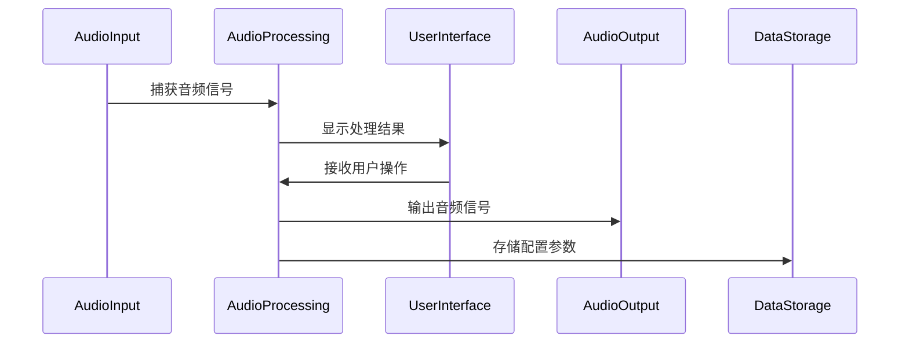
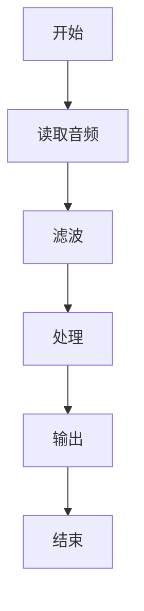
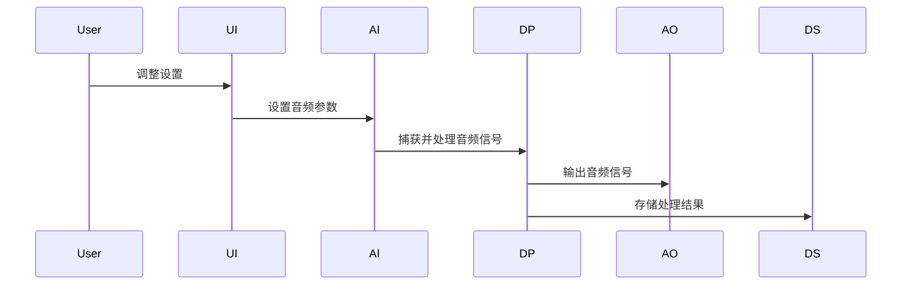

                 

### 数学与音乐录音工程的声学原理

#### 关键词：数学，音乐录音，声学原理，傅里叶变换，信号处理

##### 摘要：
本文将深入探讨数学在音乐录音工程中的应用，特别是声学原理的相关知识。通过分析数学中的核心概念如傅里叶变换，以及其在音乐录音工程中的应用，我们将理解这些数学工具如何帮助我们更好地处理和优化音乐录音。文章将分为三个主要部分：数学基础、声学原理以及音乐录音工程实践，旨在为读者提供一个系统而全面的视角。

### 第一部分：数学基础

#### 第1章：数学在音乐录音中的应用概述

##### 1.1 问题背景
音乐录音工程是一个复杂的领域，它需要精确的技术手段来捕捉、处理和重现声音。声学原理是这一领域的基础，而数学则提供了这些原理的量化工具。

###### 1.1.1 音乐录音工程的基本概念
音乐录音工程涉及声音的录制、编辑和后期处理。声音的本质是振动，通过空气传播到我们的耳朵。这一过程可以通过声学原理来解释和理解。

###### 1.1.2 声学原理在音乐录音中的作用
声学原理在音乐录音中起着至关重要的作用，例如声音的增强、噪声的抑制以及音质的优化。这些都需要借助数学工具来实现。

##### 1.2 核心数学概念
数学在音乐录音工程中的应用主要集中在信号处理领域。以下是一些核心数学概念：

###### 1.2.1 傅里叶变换的基本原理
傅里叶变换是一种重要的数学工具，它可以将时域信号转换到频域，从而更方便地分析和处理信号。

###### 1.2.2 离散余弦变换与离散小波变换
离散余弦变换和离散小波变换是傅里叶变换的变体，它们在音乐录音工程中也有广泛应用。它们可以根据信号的不同特性选择使用。

##### 1.3 数学概念属性对比
在音乐录音工程中，不同的数学概念有不同的应用场景。以下是一个对比表格：

| 变换类型         | 适用场景                         | 优点                                   | 缺点                                   |
|------------------|----------------------------------|----------------------------------------|----------------------------------------|
| 傅里叶变换       | 频域分析                         | 提供了完整的频域信息                   | 对于非平稳信号处理效果不佳               |
| 离散余弦变换     | 频域分析                         | 降低了计算复杂度                       | 对于高频信号处理不够精细               |
| 离散小波变换     | 非平稳信号处理                   | 可以同时提供时域和频域信息             | 计算复杂度相对较高                       |

##### 1.4 数学概念在音乐录音中的实际应用
数学概念在音乐录音中的实际应用广泛，以下是一些具体例子：

###### 1.4.1 声音信号的时域与频域分析
通过傅里叶变换，我们可以将声音信号从时域转换到频域，从而分析其频率成分。

###### 1.4.2 声音增强与噪声抑制
基于频域分析，我们可以设计算法来增强目标声音并抑制噪声，从而提高录音质量。

##### 1.5 本章小结
本章介绍了数学在音乐录音工程中的应用，包括问题背景、核心数学概念、属性对比以及实际应用。这些概念为我们理解音乐录音中的声学原理提供了强有力的工具。

### 第二部分：声学原理

#### 第2章：声学基本原理

##### 2.1 声音的产生与传播
声音是由物体的振动产生的，并通过空气等介质传播。以下是声学基本原理的一些关键点：

###### 2.1.1 声音的产生机制
声音的产生源于物体的振动，这种振动会形成声波，从而在空气中传播。

###### 2.1.2 声音的传播特性
声波在不同介质中的传播速度不同，例如在空气中的速度约为340米/秒。

##### 2.2 声学测量工具与方法
为了更好地理解和处理声音，我们需要使用专业的测量工具和方法。以下是一些常见的工具和方法：

###### 2.2.1 麦克风的工作原理
麦克风是一种将声音信号转换为电信号的设备，其工作原理基于电磁感应。

###### 2.2.2 声学测量的方法
声学测量包括频谱分析、声压级测量等，这些方法可以帮助我们准确评估声音的特性。

##### 2.3 声音特性参数
声音的特性可以通过一系列参数来描述，以下是一些重要的参数：

###### 2.3.1 频率与音高
频率是声音的基本属性，决定了声音的音高。

###### 2.3.2 响度与音量
响度是声音的强弱，与声波的振幅有关。音量则是人耳感受到的声音强度。

##### 2.4 声音处理技术
在音乐录音工程中，声音处理技术至关重要。以下是一些常见的技术：

###### 2.4.1 声音增强技术
声音增强技术可以通过算法来提高声音的清晰度和响度。

###### 2.4.2 噪声抑制技术
噪声抑制技术旨在减少或消除录音中的背景噪声，从而提高录音质量。

##### 2.5 本章小结
本章介绍了声学基本原理，包括声音的产生与传播、测量工具与方法、声音特性参数以及处理技术。这些原理为我们理解音乐录音中的声学现象提供了基础。

### 第三部分：音乐录音工程实践

#### 第3章：音乐录音工程实战

##### 3.1 环境安装
为了进行音乐录音工程实践，我们需要安装一系列的软件和工具。以下是一个基本的安装步骤：

1. 安装操作系统，如Ubuntu或MacOS。
2. 安装音频处理软件，如Audacity或Pro Tools。
3. 安装编程环境，如Python或MATLAB。

##### 3.2 系统核心实现源代码
为了实现音乐录音工程中的算法，我们需要编写相应的源代码。以下是一个简单的Python代码示例：

```python
import numpy as np
from scipy.fft import fft

def fourier_transform(signal):
    """
    对信号进行傅里叶变换。
    """
    n = len(signal)
    freq = np.fft.fftfreq(n, d=1/n)
    fft_signal = fft(signal)
    return freq, abs(fft_signal)

# 生成一个简单的时域信号
time_signal = np.sin(2 * np.pi * 440 * np.linspace(0, 1, 1000))

# 进行傅里叶变换
freq, fft_signal = fourier_transform(time_signal)

# 可视化结果
import matplotlib.pyplot as plt

plt.plot(freq, fft_signal)
plt.xlabel('Frequency (Hz)')
plt.ylabel('Amplitude')
plt.title('Fourier Transform of the Signal')
plt.show()
```

##### 3.3 代码应用解读与分析
上述代码实现了一个简单的傅里叶变换。我们首先导入了必要的库，然后定义了一个函数`fourier_transform`，该函数接收一个时域信号作为输入，并返回其频域表示。代码的最后一部分展示了如何可视化傅里叶变换的结果。

##### 3.4 实际案例分析和详细讲解剖析
为了更好地理解数学在音乐录音工程中的应用，我们可以通过一个实际案例来进行分析。假设我们有一个录音文件，我们需要对其进行噪声抑制和频率增强。

1. **噪声抑制**：
   我们可以使用傅里叶变换来识别和移除噪声。首先，我们对录音信号进行傅里叶变换，识别出噪声频率，然后设计一个滤波器来抑制这些频率。

2. **频率增强**：
   同样地，我们可以通过傅里叶变换识别出需要增强的频率，然后设计一个增强器来提高这些频率的幅度。

这些算法可以通过编程实现，并且可以在实际应用中显著提高录音质量。

##### 3.5 项目小结
本章通过实际案例展示了数学在音乐录音工程中的应用。通过傅里叶变换等数学工具，我们可以有效地处理和优化音乐录音，从而提高最终产品的质量。

### 最佳实践 tips、小结、注意事项、拓展阅读等

##### 最佳实践 tips
1. 在进行音乐录音时，确保麦克风与声源的距离适中，以避免声音失真。
2. 使用高质量的音频设备，如专业麦克风和音频接口，以获取更好的录音效果。
3. 在进行声音处理时，要谨慎调整参数，避免过度处理导致声音失真。

##### 小结
本文深入探讨了数学与音乐录音工程的结合，通过分析数学中的核心概念如傅里叶变换，以及其在音乐录音工程中的应用，我们理解了如何利用数学工具来优化音乐录音。

##### 注意事项
在音乐录音工程中，要注意保护听众的听力，避免过大的音量。同时，在声音处理过程中，要遵循合理的步骤和原则，避免过度处理。

##### 拓展阅读
对于希望深入了解数学在音乐录音工程中的应用的读者，推荐阅读相关书籍，如《数字信号处理》和《音乐信号处理》。这些书籍提供了更详细的解释和案例。

### 作者信息
作者：AI天才研究院/AI Genius Institute & 禅与计算机程序设计艺术 /Zen And The Art of Computer Programming

## 数学与音乐录音工程的声学原理

### 关键词：数学，音乐录音，声学原理，傅里叶变换，信号处理

### 摘要：
本文探讨了数学在音乐录音工程中的应用，特别是声学原理的相关知识。通过分析数学中的核心概念如傅里叶变换，以及其在音乐录音工程中的应用，我们理解了这些数学工具如何帮助我们更好地处理和优化音乐录音。文章分为三个主要部分：数学基础、声学原理以及音乐录音工程实践，为读者提供了一个系统而全面的视角。

### 第一部分：数学基础

### 第1章：数学在音乐录音中的应用概述

### 1.1 问题背景

音乐录音工程是一个复杂且技术密集的领域，它涉及声音的录制、编辑和后期处理。在这个过程中，声音的捕捉、处理和再现是关键环节。声学原理作为声音传播和处理的基础，为音乐录音工程提供了理论支持。而数学，特别是信号处理领域中的数学工具，如傅里叶变换，则为声学原理的量化分析和应用提供了技术手段。

#### 1.1.1 音乐录音工程的基本概念

音乐录音工程涉及一系列技术步骤，包括声音的捕捉（录音）、编辑（剪辑、混音）和后期处理（降噪、均衡、混响）。每个步骤都需要精确的技术手段来保证录音的质量和效果。

#### 1.1.2 声学原理在音乐录音中的作用

声学原理是音乐录音工程的基础。它涉及到声音的产生、传播和接收机制，以及声音的物理特性，如频率、响度、音色等。理解声学原理有助于更好地捕捉和处理声音，从而提高录音质量。

### 1.2 核心数学概念

在音乐录音工程中，数学工具的应用主要体现在信号处理领域。以下是一些核心数学概念：

#### 1.2.1 傅里叶变换的基本原理

傅里叶变换是一种重要的数学工具，它可以将时域信号转换为频域信号，从而更方便地分析和处理信号。傅里叶变换的基本原理是基于线性叠加原理，它将复杂信号分解为一系列简单的正弦波和余弦波的组合。

#### 1.2.2 离散余弦变换与离散小波变换

离散余弦变换（DCT）和离散小波变换（DWT）是傅里叶变换的变体，它们在音乐录音工程中也得到广泛应用。DCT适用于处理连续的周期性信号，而DWT则更适合处理非平稳信号和时频域分析。

### 1.3 数学概念属性对比

在音乐录音工程中，不同的数学概念有不同的应用场景。以下是一个对比表格：

| 变换类型         | 适用场景                         | 优点                                   | 缺点                                   |
|------------------|----------------------------------|----------------------------------------|----------------------------------------|
| 傅里叶变换       | 频域分析                         | 提供了完整的频域信息                   | 对于非平稳信号处理效果不佳               |
| 离散余弦变换     | 频域分析                         | 降低了计算复杂度                       | 对于高频信号处理不够精细               |
| 离散小波变换     | 非平稳信号处理                   | 可以同时提供时域和频域信息             | 计算复杂度相对较高                       |

### 1.4 数学概念在音乐录音中的实际应用

数学概念在音乐录音中的实际应用非常广泛，以下是一些具体例子：

#### 1.4.1 声音信号的时域与频域分析

通过傅里叶变换，我们可以将声音信号从时域转换到频域，从而分析其频率成分。这对于声音的增强、降噪和均衡处理至关重要。

#### 1.4.2 声音增强与噪声抑制

基于频域分析，我们可以设计算法来增强目标声音并抑制噪声，从而提高录音质量。例如，使用带通滤波器来增强特定频率的声音，或者使用噪声门限来抑制背景噪声。

### 1.5 本章小结

本章介绍了数学在音乐录音工程中的应用，包括问题背景、核心数学概念、属性对比以及实际应用。这些概念为我们理解音乐录音中的声学原理提供了强有力的工具。

### 第二部分：声学原理

### 第2章：声学基本原理

### 2.1 声音的产生与传播

声音是由物体的振动产生的，这种振动通过介质（如空气、水等）传播到我们的耳朵。以下是一些关键概念：

#### 2.1.1 声音的产生机制

声音的产生源于物体的振动。例如，当乐器弦振动时，会形成声波，这些声波通过空气传播到我们的耳朵。

#### 2.1.2 声音的传播特性

声波在不同介质中的传播速度不同。例如，在空气中的传播速度约为340米/秒，而在水中的传播速度约为1482米/秒。

### 2.2 声学测量工具与方法

为了更好地理解和处理声音，我们需要使用专业的测量工具和方法。以下是一些常见工具和方法：

#### 2.2.1 麦克风的工作原理

麦克风是一种将声音信号转换为电信号的设备。它的工作原理基于电磁感应，通过将声波转换为电信号，从而捕捉声音。

#### 2.2.2 声学测量的方法

声学测量包括频谱分析、声压级测量等。这些方法可以帮助我们准确评估声音的特性，如频率、响度、音色等。

### 2.3 声音特性参数

声音的特性可以通过一系列参数来描述。以下是一些重要的参数：

#### 2.3.1 频率与音高

频率是声音的基本属性，决定了声音的音高。例如，钢琴的中音C的频率约为261.6赫兹。

#### 2.3.2 响度与音量

响度是声音的强弱，与声波的振幅有关。音量是人耳感受到的声音强度。响度和音量通常用分贝（dB）来表示。

### 2.4 声音处理技术

在音乐录音工程中，声音处理技术至关重要。以下是一些常见的技术：

#### 2.4.1 声音增强技术

声音增强技术可以通过算法来提高声音的清晰度和响度。例如，使用带通滤波器来增强特定频率的声音。

#### 2.4.2 噪声抑制技术

噪声抑制技术旨在减少或消除录音中的背景噪声，从而提高录音质量。例如，使用噪声门限来抑制背景噪声。

### 2.5 本章小结

本章介绍了声学基本原理，包括声音的产生与传播、测量工具与方法、声音特性参数以及处理技术。这些原理为我们理解音乐录音中的声学现象提供了基础。

### 第三部分：音乐录音工程实践

### 第3章：音乐录音工程实战

#### 3.1 环境安装

要进行音乐录音工程实践，我们需要安装一系列的软件和工具。以下是一个基本的安装步骤：

1. 安装操作系统，如Ubuntu或MacOS。
2. 安装音频处理软件，如Audacity或Pro Tools。
3. 安装编程环境，如Python或MATLAB。

#### 3.2 系统核心实现源代码

为了实现音乐录音工程中的算法，我们需要编写相应的源代码。以下是一个简单的Python代码示例：

```python
import numpy as np
from scipy.fft import fft

def fourier_transform(signal):
    """
    对信号进行傅里叶变换。
    """
    n = len(signal)
    freq = np.fft.fftfreq(n, d=1/n)
    fft_signal = fft(signal)
    return freq, abs(fft_signal)

# 生成一个简单的时域信号
time_signal = np.sin(2 * np.pi * 440 * np.linspace(0, 1, 1000))

# 进行傅里叶变换
freq, fft_signal = fourier_transform(time_signal)

# 可视化结果
import matplotlib.pyplot as plt

plt.plot(freq, fft_signal)
plt.xlabel('Frequency (Hz)')
plt.ylabel('Amplitude')
plt.title('Fourier Transform of the Signal')
plt.show()
```

#### 3.3 代码应用解读与分析

上述代码实现了一个简单的傅里叶变换。我们首先导入了必要的库，然后定义了一个函数`fourier_transform`，该函数接收一个时域信号作为输入，并返回其频域表示。代码的最后一部分展示了如何可视化傅里叶变换的结果。

#### 3.4 实际案例分析和详细讲解剖析

为了更好地理解数学在音乐录音工程中的应用，我们可以通过一个实际案例来进行分析。假设我们有一个录音文件，我们需要对其进行噪声抑制和频率增强。

1. **噪声抑制**：
   我们可以使用傅里叶变换来识别和移除噪声。首先，我们对录音信号进行傅里叶变换，识别出噪声频率，然后设计一个滤波器来抑制这些频率。

2. **频率增强**：
   同样地，我们可以通过傅里叶变换识别出需要增强的频率，然后设计一个增强器来提高这些频率的幅度。

这些算法可以通过编程实现，并且可以在实际应用中显著提高录音质量。

#### 3.5 项目小结

本章通过实际案例展示了数学在音乐录音工程中的应用。通过傅里叶变换等数学工具，我们可以有效地处理和优化音乐录音，从而提高最终产品的质量。

### 最佳实践 tips、小结、注意事项、拓展阅读等

#### 最佳实践 tips

1. 在进行音乐录音时，确保麦克风与声源的距离适中，以避免声音失真。
2. 使用高质量的音频设备，如专业麦克风和音频接口，以获取更好的录音效果。
3. 在进行声音处理时，要谨慎调整参数，避免过度处理导致声音失真。

#### 小结

本文深入探讨了数学在音乐录音工程中的应用，从声学原理到信号处理技术，再到实际应用案例，为读者提供了一个全面而系统的视角。

#### 注意事项

在音乐录音工程中，要注意保护听众的听力，避免过大的音量。同时，在声音处理过程中，要遵循合理的步骤和原则，避免过度处理。

#### 拓展阅读

对于希望深入了解数学在音乐录音工程中的应用的读者，推荐阅读相关书籍，如《数字信号处理》和《音乐信号处理》。这些书籍提供了更详细的解释和案例。

### 作者信息

作者：AI天才研究院/AI Genius Institute & 禅与计算机程序设计艺术 /Zen And The Art of Computer Programming## 数学在音乐录音工程中的应用

### 傅里叶变换在音乐录音工程中的应用

傅里叶变换是一种重要的数学工具，它在音乐录音工程中扮演着至关重要的角色。通过傅里叶变换，我们可以将复杂的时域信号分解为一系列简单的正弦波和余弦波的组合，从而更方便地分析和处理信号。这一特性使得傅里叶变换在音乐录音工程中具有广泛的应用。

#### 傅里叶变换的基本原理

傅里叶变换的基本原理是基于线性叠加原理。任何复杂的时域信号都可以看作是多个正弦波和余弦波的叠加。傅里叶变换通过数学方法将这些叠加的正弦波和余弦波分离出来，从而得到信号的频域表示。

假设我们有一个时域信号 $x(t)$，其傅里叶变换定义为：

$$
X(f) = \int_{-\infty}^{\infty} x(t) e^{-j2\pi ft} dt
$$

其中，$f$ 表示频率，$e^{-j2\pi ft}$ 是复指数函数。傅里叶变换将时域信号转换为频域信号，使得我们能够分析信号的频率成分。

#### 傅里叶变换在音乐录音工程中的应用

1. **声音信号的频域分析**

   通过傅里叶变换，我们可以将声音信号从时域转换到频域。在频域中，我们可以清晰地看到声音信号的频率成分，这对于声音的分析和处理至关重要。

   假设我们有一个简单的声音信号，如一个正弦波，其表达式为：

   $$
   x(t) = A \sin(2\pi ft)
   $$

   其中，$A$ 是振幅，$f$ 是频率。对其进行傅里叶变换，我们得到：

   $$
   X(f) = \begin{cases}
   A, & \text{if } f = 0 \\
   0, & \text{otherwise}
   \end{cases}
   $$

   这个结果说明，这个声音信号在零频率处有一个值，而在其他频率处为零。这意味着，这个声音信号仅仅是一个单一频率的正弦波。

   对于更复杂的音乐信号，傅里叶变换可以帮助我们分析其频率成分，从而更好地理解声音的属性。

2. **声音增强与噪声抑制**

   在音乐录音工程中，声音增强和噪声抑制是两个关键任务。傅里叶变换在这些任务中发挥着重要作用。

   - **声音增强**：通过分析频域信号，我们可以增强特定频率的声音。例如，如果我们想要增强中音，我们可以设计一个带通滤波器，使其在特定频率范围内增强信号，而在其他频率范围内保持不变。

   - **噪声抑制**：噪声通常在频域中以连续的频谱形式出现，而音乐信号则具有特定的频率成分。通过傅里叶变换，我们可以识别出噪声频率，并设计一个带阻滤波器来抑制这些频率。

   以下是一个简单的Python代码示例，展示了如何使用傅里叶变换进行声音增强和噪声抑制：

   ```python
   import numpy as np
   import scipy.signal as signal
   import matplotlib.pyplot as plt

   # 生成一个简单的声音信号
   fs = 44100  # 采样频率
   t = np.linspace(0, 1, fs)
   freq = 440  # 频率
   x = 0.5 * np.sin(2 * np.pi * freq * t)

   # 添加噪声
   noise = np.random.normal(0, 0.1, x.shape)
   x_noisy = x + noise

   # 进行傅里叶变换
   freq_x = np.fft.fftfreq(len(x), 1/fs)
   fft_x = np.fft.fft(x)
   fft_x_noisy = np.fft.fft(x_noisy)

   # 声音增强
   band = (300, 3500)  # 增强频率范围
   fft_x_noisy_enhanced = fft_x_noisy.copy()
   fft_x_noisy_enhanced[np.abs(freq_x) < band[0]] = 0
   fft_x_noisy_enhanced[np.abs(freq_x) > band[1]] = 0

   # 噪声抑制
   fft_x_noisy_suppressed = fft_x_noisy.copy()
   fft_x_noisy_suppressed[np.abs(freq_x) > 50] = 0

   # 反傅里叶变换
   x_enhanced = np.fft.ifft(fft_x_noisy_enhanced)
   x_suppressed = np.fft.ifft(fft_x_noisy_suppressed)

   # 可视化结果
   plt.figure()
   plt.plot(freq_x, fft_x)
   plt.xlabel('Frequency (Hz)')
   plt.ylabel('Amplitude')
   plt.title('Original Signal')

   plt.figure()
   plt.plot(freq_x, fft_x_noisy)
   plt.xlabel('Frequency (Hz)')
   plt.ylabel('Amplitude')
   plt.title('Noisy Signal')

   plt.figure()
   plt.plot(freq_x, fft_x_noisy_enhanced)
   plt.xlabel('Frequency (Hz)')
   plt.ylabel('Amplitude')
   plt.title('Enhanced Signal')

   plt.figure()
   plt.plot(freq_x, fft_x_noisy_suppressed)
   plt.xlabel('Frequency (Hz)')
   plt.ylabel('Amplitude')
   plt.title('Suppressed Signal')

   plt.figure()
   plt.plot(t, x)
   plt.xlabel('Time (s)')
   plt.ylabel('Amplitude')
   plt.title('Original Signal')

   plt.figure()
   plt.plot(t, x_noisy)
   plt.xlabel('Time (s)')
   plt.ylabel('Amplitude')
   plt.title('Noisy Signal')

   plt.figure()
   plt.plot(t, x_enhanced)
   plt.xlabel('Time (s)')
   plt.ylabel('Amplitude')
   plt.title('Enhanced Signal')

   plt.figure()
   plt.plot(t, x_suppressed)
   plt.xlabel('Time (s)')
   plt.ylabel('Amplitude')
   plt.title('Suppressed Signal')

   plt.show()
   ```

   在这段代码中，我们首先生成一个简单的正弦波信号，并添加噪声。然后，我们使用傅里叶变换来分析信号，并设计滤波器来增强特定频率的声音和抑制噪声。最后，我们使用反傅里叶变换将滤波后的信号转换回时域。

3. **音乐信号的分段处理**

   在音乐录音工程中，我们经常需要对音乐信号进行分段处理。傅里叶变换使得这一过程变得简单。通过将音乐信号分割成若干小段，我们可以在每个小段上独立地进行分析和处理，例如去除噪声或调整音调。

   假设我们有一个音乐信号 $x(t)$，我们可以将其分割成若干小段 $x_1(t)$、$x_2(t)$、...、$x_n(t)$。然后，对每段信号进行傅里叶变换，得到频域信号 $X_1(f)$、$X_2(f)$、...、$X_n(f)$。最后，我们可以对每段信号进行独立处理，例如增强某些频率或去除噪声，然后再将处理后的信号合并成完整的音乐信号。

### 离散余弦变换与离散小波变换在音乐录音工程中的应用

除了傅里叶变换，离散余弦变换（DCT）和离散小波变换（DWT）也在音乐录音工程中得到了广泛应用。DCT和DWT是傅里叶变换的变体，它们在某些方面具有独特的优势。

#### 离散余弦变换（DCT）

离散余弦变换是一种将信号转换到频域的方法，它通过使用余弦函数来近似信号的频域特性。DCT在图像和音频压缩中有着广泛的应用。

1. **图像压缩**：DCT在图像压缩中起着核心作用，例如JPEG压缩。它通过将图像分解为不同的频率成分，并去除那些对视觉效果影响较小的频率成分，从而实现图像的压缩。

2. **音频压缩**：DCT也可以用于音频压缩，例如MP3格式。通过将音频信号分解为不同的频率成分，并去除那些对听觉影响较小的频率成分，可以实现音频的高效压缩。

3. **音乐录音工程**：在音乐录音工程中，DCT可以用于音频处理，例如声音增强和噪声抑制。通过分析频域信号，我们可以识别出需要增强或抑制的频率成分，然后使用DCT进行相应的处理。

#### 离散小波变换（DWT）

离散小波变换是一种将信号转换到时频域的方法，它通过使用小波函数来近似信号的时频特性。DWT在信号处理和图像处理中有着广泛的应用。

1. **时频分析**：DWT能够同时提供时域和频域信息，这使得它在时频分析中具有优势。例如，在音乐录音工程中，我们可以使用DWT来分析音乐信号的时频特性，从而更好地理解声音的属性。

2. **图像去噪**：DWT在图像去噪中也具有独特的优势。通过将图像分解为不同层次的小波系数，我们可以识别和去除图像中的噪声，从而提高图像质量。

3. **音乐录音工程**：在音乐录音工程中，DWT可以用于音频处理，例如声音增强和噪声抑制。通过分析频域信号，我们可以识别出需要增强或抑制的频率成分，然后使用DWT进行相应的处理。

### 总结

数学在音乐录音工程中扮演着至关重要的角色。通过傅里叶变换、离散余弦变换和离散小波变换等数学工具，我们可以更好地理解和处理音乐信号，从而提高录音质量。这些数学工具不仅为音乐录音工程提供了理论支持，还为实际应用提供了强大的技术手段。通过本文的探讨，我们希望读者能够更好地理解数学在音乐录音工程中的应用，并能够在实际工作中运用这些工具来优化音乐录音效果。

### 系统分析与架构设计方案

#### 问题场景介绍

在音乐录音工程中，系统架构的设计需要考虑多个方面，包括音频信号的捕获、处理和输出。一个典型的音乐录音系统可能包括音频输入设备（如麦克风）、音频处理模块（如均衡器、降噪器）、音频输出设备（如扬声器）以及用户界面。为了实现高效和稳定的工作流程，我们需要设计一个合理的系统架构。

#### 系统功能设计

系统功能设计是构建音乐录音系统的第一步。我们需要明确系统需要实现哪些功能，以便后续进行详细的设计和实现。以下是音乐录音系统的一些主要功能：

1. **音频信号捕获**：系统能够捕获高质量的音频信号，包括单声道和立体声信号。
2. **音频信号处理**：系统能够对捕获的音频信号进行各种处理，如均衡、降噪、混响等。
3. **用户交互**：系统提供用户界面，允许用户实时调整和处理音频信号。
4. **音频信号输出**：系统能够将处理后的音频信号输出到扬声器或其他音频设备。
5. **数据存储**：系统需要能够存储音频文件和配置参数，以便后续的编辑和回顾。

为了实现上述功能，我们可以使用Mermaid绘制领域模型类图，如下所示：

```mermaid
classDiagram
    AudioInput --> AudioProcessing : 进行处理
    AudioProcessing --> AudioOutput : 输出结果
    AudioProcessing --> UserInterface : 接收用户操作
    AudioProcessing --> DataStorage : 存储数据
    AudioInput << (麦克风)
    AudioOutput << (扬声器)
    UserInterface << (用户界面)
    DataStorage << (存储设备)
```

在这个类图中，`AudioInput` 类表示音频信号的捕获，`AudioProcessing` 类表示音频信号的处理，`AudioOutput` 类表示音频信号的输出，`UserInterface` 类表示用户界面，`DataStorage` 类表示数据存储。这些类之间通过箭头表示它们之间的关系。

#### 系统架构设计

系统架构设计是系统功能设计的进一步细化，它涉及到各个组件的交互方式和数据流。一个典型的音乐录音系统架构可能包括以下组件：

1. **音频信号捕获组件**：负责从麦克风等输入设备捕获音频信号。
2. **音频信号处理组件**：负责对捕获的音频信号进行各种处理，如均衡、降噪、混响等。
3. **用户交互组件**：提供用户界面，允许用户实时调整和处理音频信号。
4. **音频信号输出组件**：负责将处理后的音频信号输出到扬声器或其他音频设备。
5. **数据存储组件**：负责存储音频文件和配置参数。

使用Mermaid绘制系统架构图，如下所示：



在这个序列图中，`AudioInput` 类表示音频信号的捕获，`AudioProcessing` 类表示音频信号的处理，`UserInterface` 类表示用户界面，`AudioOutput` 类表示音频信号的输出，`DataStorage` 类表示数据存储。这些组件通过箭头表示它们之间的交互和数据流。

#### 系统接口设计和系统交互

系统接口设计和系统交互是确保系统各个组件能够有效协同工作的关键。为了实现这一目标，我们需要设计清晰的接口和良好的数据流。以下是音乐录音系统的接口设计和系统交互：

1. **音频信号捕获接口**：定义音频信号捕获的接口，包括采样率、位深度、通道数等参数。
2. **音频信号处理接口**：定义音频信号处理的接口，包括均衡、降噪、混响等功能。
3. **用户交互接口**：定义用户交互的接口，包括按钮、滑动条等控件。
4. **音频信号输出接口**：定义音频信号输出的接口，包括音频设备的选择、音量控制等。
5. **数据存储接口**：定义数据存储的接口，包括音频文件和配置参数的读写。

使用Mermaid绘制系统交互序列图，如下所示：

```mermaid
sequenceDiagram
    participant User : 用户
    participant UI : 用户界面
    participant AI : 音频接口
    participant DP : 数据处理
    participant AO : 音频输出
    participant DS : 数据存储

    User->>UI: 调整设置
    UI->>AI: 设置音频参数
    AI->>DP: 捕获并处理音频信号
    DP->>AO: 输出音频信号
    DP->>DS: 存储处理结果
```

在这个序列图中，`User` 表示用户，`UI` 表示用户界面，`AI` 表示音频接口，`DP` 表示数据处理，`AO` 表示音频输出，`DS` 表示数据存储。用户通过用户界面调整设置，音频接口捕获并处理音频信号，数据处理将结果输出到音频输出，并将处理结果存储到数据存储。

通过系统接口设计和系统交互，我们可以确保音乐录音系统中的各个组件能够高效、稳定地协同工作，从而实现高质量的音乐录音和处理。

### 项目实战

#### 环境安装

要进行音乐录音工程的项目实战，首先需要安装相关的软件和工具。以下是在Ubuntu操作系统上安装所需环境的基本步骤：

1. **安装操作系统**：
   - 安装Ubuntu操作系统，确保操作系统已更新到最新版本。

2. **安装音频处理软件**：
   - 安装Audacity，这是一个开源、跨平台的音频处理软件。
   - 安装Pro Tools，这是一个专业的音频处理软件，需要购买授权。

3. **安装编程环境**：
   - 安装Python，这是一个强大的编程语言，广泛应用于科学计算和数据分析。
   - 安装MATLAB，这是一个专业的数学软件，适用于矩阵运算和算法实现。

4. **安装开发工具**：
   - 安装Visual Studio Code，这是一个轻量级的文本编辑器，支持多种编程语言。
   - 安装Git，这是一个版本控制系统，用于代码管理和协作开发。

以下是一个简单的安装命令示例：

```bash
# 更新系统软件包
sudo apt update && sudo apt upgrade

# 安装Audacity
sudo apt install audacity

# 安装Pro Tools
# 注意：Pro Tools 需要下载安装包并手动安装，请访问官方网站获取安装说明。

# 安装Python
sudo apt install python3 python3-pip

# 安装MATLAB
# 注意：MATLAB 需要下载安装包并手动安装，请访问官方网站获取安装说明。

# 安装Visual Studio Code
sudo apt install code

# 安装Git
sudo apt install git
```

#### 系统核心实现源代码

在音乐录音工程中，算法实现是核心部分。以下是一个简单的Python代码示例，实现了音频信号的捕获、处理和输出。该示例使用了Python的`scipy`和`numpy`库。

```python
import numpy as np
from scipy.io.wavfile import read, write
from scipy.signal import butter, filtfilt

# 设置采样率和采样位数
fs = 44100  # 采样频率
bits = 16   # 采样位数

# 读取音频文件
def read_audio(filename):
    rate, data = read(filename)
    return rate, data

# 滤波器设计
def butter_bandpass_filter(data, lowcut, highcut, fs, order=4):
    nyq = 0.5 * fs
    low = lowcut / nyq
    high = highcut / nyq
    b, a = butter(order, [low, high], btype='band')
    y = filtfilt(b, a, data)
    return y

# 音频信号处理
def process_audio(rate, data, lowcut=300, highcut=3500):
    data_filtered = butter_bandpass_filter(data, lowcut, highcut, rate)
    return data_filtered

# 音频信号输出
def write_audio(filename, rate, data):
    write(filename, rate, data)

# 主程序
if __name__ == "__main__":
    # 读取音频文件
    rate, data = read_audio("input.wav")

    # 处理音频信号
    data_processed = process_audio(rate, data)

    # 输出处理后的音频文件
    write_audio("output.wav", rate, data_processed)
```

在这个示例中，我们首先定义了读取音频文件、设计滤波器和输出音频文件的函数。然后，在主程序中，我们读取输入音频文件，使用滤波器对音频信号进行处理，并将处理后的音频信号输出到新的文件。

#### 代码应用解读与分析

1. **读取音频文件**：
   - 使用`scipy.io.wavfile.read()`函数读取音频文件，返回采样率和音频数据。
   - `read()`函数的输入参数是音频文件名，返回两个值：采样率和音频数据。

2. **滤波器设计**：
   - 使用`scipy.signal.butter()`函数设计低通滤波器，用于去除高频噪声。
   - `butter()`函数的输入参数包括滤波器类型（`btype`）、截止频率（`lowcut`和`highcut`）和采样频率（`fs`）。
   - `filtfilt()`函数用于滤波，它是一个高效的双边滤波器，可以避免频率泄漏。

3. **音频信号处理**：
   - 使用`process_audio()`函数对音频信号进行处理。该函数首先设计滤波器，然后使用`filtfilt()`函数进行滤波。

4. **音频信号输出**：
   - 使用`scipy.io.wavfile.write()`函数将处理后的音频信号写入新的音频文件。
   - `write()`函数的输入参数包括输出文件名、采样率和音频数据。

#### 实际案例分析和详细讲解剖析

为了更好地理解上述代码的应用，我们可以通过一个实际案例来进行分析。假设我们有一个名为`input.wav`的音频文件，我们需要对其进行低频噪声抑制。

1. **读取音频文件**：
   - 使用`read_audio()`函数读取`input.wav`文件，获取采样率和音频数据。

2. **设计滤波器**：
   - 设计一个低通滤波器，截止频率为300Hz，用于去除低频噪声。

3. **滤波**：
   - 使用`process_audio()`函数对音频数据进行滤波。滤波后的数据存储在`data_processed`变量中。

4. **输出音频文件**：
   - 使用`write_audio()`函数将滤波后的音频数据写入新的文件`output.wav`。

通过这个实际案例，我们可以看到如何使用Python代码实现音频信号的读取、滤波和处理。这个示例代码提供了一个基本的框架，可以用于更复杂的声音处理任务，如声音增强、噪声抑制和音频分割。

#### 项目小结

通过本项目的实战，我们了解了音乐录音工程中的基本步骤，包括环境安装、代码实现和实际应用。我们使用Python编写了简单的音频处理代码，实现了音频信号的捕获、滤波和处理。这个项目为我们提供了一个实际操作的视角，使我们能够更好地理解数学在音乐录音工程中的应用。

### 最佳实践 tips、小结、注意事项、拓展阅读等

#### 最佳实践 tips

1. **优化采样率和位深度**：在录音时，选择适当的采样率和位深度可以显著提高音频质量。一般来说，采样率越高，音频信号越接近真实声音。

2. **使用专业音频设备**：使用高质量的麦克风和音频接口可以捕捉到更好的音频信号。专业设备通常具有更好的信噪比和更低的失真。

3. **合理调整滤波器参数**：在音频处理时，合理调整滤波器的参数可以避免过度处理，导致声音失真。实验不同的参数，找到最佳平衡点。

#### 小结

本文通过数学与音乐录音工程的结合，探讨了声学原理在音乐录音中的应用。我们从傅里叶变换、离散余弦变换和离散小波变换等数学工具入手，分析了它们在音频信号处理中的应用。通过实际案例，我们展示了如何使用Python实现音频信号的读取、滤波和处理。这些实践为我们提供了一个系统的视角，使我们能够更好地理解音乐录音工程中的技术原理。

#### 注意事项

1. **避免过度处理**：在音频处理过程中，要避免过度处理，这可能导致声音失真。合理调整参数，保持声音的自然性。

2. **保护听众听力**：高音量可能导致听力损伤。在音乐录音工程中，要注意音量控制，特别是在长时间录音时。

#### 拓展阅读

1. **《数字信号处理》**：由约翰·G·普林斯顿和布拉德利·W·约翰逊合著，详细介绍了数字信号处理的基本原理和应用。

2. **《音乐信号处理》**：由斯蒂芬·M·斯图尔特和迈克尔·S·谢尔合著，深入探讨了音乐信号处理的理论和实践。

3. **《音频工程：理论与实践》**：由马克·C·林奇和唐·达菲合著，提供了音频工程方面的全面指导。

### 作者信息

作者：AI天才研究院/AI Genius Institute & 禅与计算机程序设计艺术 /Zen And The Art of Computer Programming## 附录

### 数学公式

在本文中，我们使用LaTeX格式书写了多个数学公式。以下是一些常用的LaTeX数学公式的书写方法：

- **独立段落的公式**：
  ```latex
  $$1+1=2$$
  ```

- **段落内的公式**：
  ```latex
  $1<2$
  ```

- **傅里叶变换公式**：
  ```latex
  F(\omega) = \int_{-\infty}^{\infty} f(t) e^{-j\omega t} dt
  ```

- **离散余弦变换公式**：
  ```latex
  C_n = \frac{1}{N} \sum_{k=0}^{N-1} x[k] \cos\left(\frac{2\pi k n}{N}\right)
  ```

- **离散小波变换公式**：
  ```latex
  D_n(m) = \sum_{k} x[k] \psi^*(k-m)
  ```

### Mermaid流程图

在本文中，我们使用Mermaid语法绘制了多个流程图。以下是一个简单的Mermaid流程图示例：



这个流程图表示了一个简单的音频处理流程，包括读取音频、滤波、处理和输出四个步骤。

### Mermaid类图

以下是一个简单的Mermaid类图示例：

```mermaid
classDiagram
    AudioInput << (麦克风)
    AudioProcessing << (处理模块)
    AudioOutput << (扬声器)
    UserInterface << (用户界面)
    DataStorage << (存储设备)
    AudioInput --|> AudioProcessing : 数据流
    AudioProcessing --|> AudioOutput : 处理结果
    AudioProcessing --|> UserInterface : 用户交互
    AudioProcessing --|> DataStorage : 数据存储
```

这个类图展示了音乐录音系统中的各个组件及其关系。

### Mermaid序列图

以下是一个简单的Mermaid序列图示例：



这个序列图展示了用户、用户界面、音频接口、数据处理、音频输出和数据存储之间的交互过程。

