                 


### 文章标题：数学与音乐欣赏的审美体验与情感表达

#### 关键词：数学与音乐、审美体验、情感表达、音乐创作

#### 摘要：
本文旨在探讨数学与音乐在审美体验和情感表达中的深刻联系。通过分析数学与音乐的基础概念、审美体验和情感表达，以及数学在音乐创作中的应用，本文试图揭示这两者之间的共通之处，并探讨其如何共同塑造人类的审美情感体验。文章分为五个部分：第一部分介绍数学与音乐的基础概念；第二部分探讨数学中的审美体验；第三部分分析音乐情感表达的基础；第四部分讨论数学在音乐创作中的应用；第五部分通过案例研究，进一步阐述数学与音乐结合的实践效果。希望本文能为读者提供一个全新的视角，以理解数学与音乐这一独特的艺术形式。

### 目录大纲

----------------------------------------------------------------

## 第一部分：数学与音乐的基础概念

### 第1章：数学与音乐概述

#### 1.1 问题背景与核心概念

##### 1.1.1 数学与音乐的关联

##### 1.1.2 研究目的与意义

##### 1.1.3 边界与外延

#### 1.2 数学的基本概念与原理

##### 1.2.1 数学的基本概念

##### 1.2.2 数学原理的mermaid流程图

##### 1.2.3 数学原理对比表格

#### 1.3 音乐的基本概念与原理

##### 1.3.1 音乐的基本概念

##### 1.3.2 音乐原理的mermaid流程图

##### 1.3.3 音乐原理对比表格

#### 1.4 本章小结

----------------------------------------------------------------

## 第二部分：数学与音乐中的审美体验

### 第2章：数学中的审美体验

#### 2.1 数学图形的美学

##### 2.1.1 数学图形的视觉美感

##### 2.1.2 数学图形的mermaid流程图

##### 2.1.3 数学图形的审美特征对比表格

#### 2.2 数学公式与审美

##### 2.2.1 数学公式的形式美

##### 2.2.2 数学公式审美的mermaid流程图

##### 2.2.3 数学公式审美对比表格

#### 2.3 数学概念与音乐中的对应

##### 2.3.1 数学概念在音乐中的应用

##### 2.3.2 数学概念与音乐的mermaid实体关系图

##### 2.3.3 数学概念与音乐对应表

#### 2.4 本章小结

----------------------------------------------------------------

## 第三部分：音乐中的情感表达

### 第3章：音乐情感表达的基础

#### 3.1 音乐情感的心理学基础

##### 3.1.1 音乐情感的定义

##### 3.1.2 音乐情感的心理学研究

##### 3.1.3 音乐情感的mermaid流程图

#### 3.2 音乐情感的分类

##### 3.2.1 情感分类标准

##### 3.2.2 音乐情感分类的mermaid流程图

##### 3.2.3 音乐情感分类对比表格

#### 3.3 音乐情感表达的mermaid实体关系图

##### 3.3.1 情感表达要素

##### 3.3.2 情感表达过程

##### 3.3.3 情感表达实例分析

#### 3.4 本章小结

----------------------------------------------------------------

## 第四部分：数学与音乐的结合

### 第4章：数学在音乐创作中的应用

#### 4.1 数学在旋律设计中的应用

##### 4.1.1 旋律设计的数学原理

##### 4.1.2 旋律设计的mermaid流程图

##### 4.1.3 旋律设计实例

#### 4.2 数学在和声设计中的应用

##### 4.2.1 和声设计的数学原理

##### 4.2.2 和声设计的mermaid流程图

##### 4.2.3 和声设计实例

#### 4.3 数学在节奏设计中的应用

##### 4.3.1 节奏设计的数学原理

##### 4.3.2 节奏设计的mermaid流程图

##### 4.3.3 节奏设计实例

#### 4.4 本章小结

----------------------------------------------------------------

## 第五部分：案例研究

### 第5章：数学与音乐结合的案例研究

#### 5.1 案例一：莫扎特的《第41号交响曲》

##### 5.1.1 作品背景与结构

##### 5.1.2 数学元素分析

##### 5.1.3 情感表达分析

#### 5.2 案例二：乔治·格什温的《蓝色狂想曲》

##### 5.2.1 作品背景与结构

##### 5.2.2 数学元素分析

##### 5.2.3 情感表达分析

#### 5.3 案例三：迈克尔·杰克逊的《Thriller》

##### 5.3.1 作品背景与结构

##### 5.3.2 数学元素分析

##### 5.3.3 情感表达分析

----------------------------------------------------------------

### 文章正文部分

## 第一部分：数学与音乐的基础概念

### 第1章：数学与音乐概述

#### 1.1 问题背景与核心概念

##### 1.1.1 数学与音乐的关联

数学和音乐都是人类智慧的结晶，它们之间有着深厚的联系。从历史角度看，古代文明如古埃及、古希腊和古印度等，都曾将数学与音乐相结合，例如古埃及人将数学应用于建筑和天文，而古希腊人则认为音乐是宇宙和谐的体现。在当代，数学和音乐的结合更多地体现在理论研究、音乐创作和计算机科学中。例如，音乐理论中的音阶和和声结构可以用数学公式来表示，计算机科学中的算法和编程则可以模拟音乐创作和播放。

##### 1.1.2 研究目的与意义

本文的研究目的在于探讨数学与音乐在审美体验和情感表达中的相互影响。通过分析数学与音乐的基本概念、审美体验和情感表达，本文旨在揭示这两者之间的共通之处，并探讨其如何共同塑造人类的审美情感体验。这对于理解人类文化和艺术发展具有重要意义，同时也能为现代音乐创作和计算机音乐制作提供新的视角和方法。

##### 1.1.3 边界与外延

在本文中，数学与音乐的基础概念主要涵盖数学的基本原理、音乐的基本要素和两者之间的联系。数学的基本概念包括数、形、空间等，而音乐的基本要素包括音高、节奏、和声等。两者的边界主要在于数学的抽象性和逻辑性，以及音乐的感知性和表现性。然而，在审美体验和情感表达方面，数学与音乐有着广泛的外延，涵盖了从科学研究到艺术创作的多个层面。

#### 1.2 数学的基本概念与原理

##### 1.2.1 数学的基本概念

数学是一门研究数量、结构、变化和空间等概念的抽象科学。它包括多个分支，如算术、代数、几何、三角学、微积分等。数学的基本概念有：

- 数：数是数学的基础，包括自然数、整数、分数、实数、复数等。
- 形：形是数学研究的重要对象，包括点、线、面、体等。
- 空间：空间是数学研究的基本框架，包括二维空间、三维空间等。
- 函数：函数是数学中的重要概念，它表示两个变量之间的关系。

##### 1.2.2 数学原理的mermaid流程图

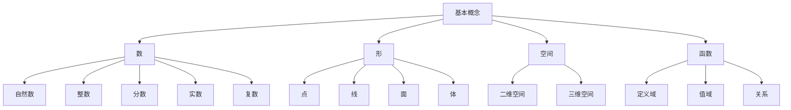

##### 1.2.3 数学原理对比表格

| 数学概念 | 定义 | 特点 |
| --- | --- | --- |
| 数 | 数是数学的基础，用于表示数量和顺序。 | 可以分为自然数、整数、分数、实数、复数等。 |
| 形 | 形是数学研究的重要对象，包括点、线、面、体等。 | 具有几何性质和维度特征。 |
| 空间 | 空间是数学研究的基本框架，用于描述位置和形状。 | 可以分为二维空间和三维空间。 |
| 函数 | 函数是两个变量之间的映射关系。 | 有定义域、值域和关系三个基本要素。 |

#### 1.3 音乐的基本概念与原理

##### 1.3.1 音乐的基本概念

音乐是一门艺术形式，通过声音的节奏、音高、音量和音色等元素来表达情感和思想。音乐的基本概念包括：

- 音高：音高是声音的频率特征，决定了音乐的音调。
- 节奏：节奏是声音的时间特征，决定了音乐的韵律。
- 和声：和声是多个音符同时发声，构成了音乐的背景。
- 音色：音色是声音的质地特征，决定了音乐的不同风格。

##### 1.3.2 音乐原理的mermaid流程图

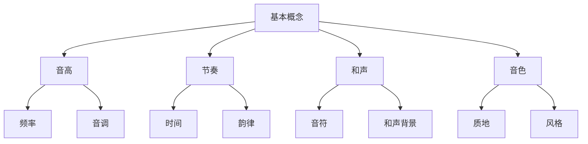

##### 1.3.3 音乐原理对比表格

| 音乐概念 | 定义 | 特点 |
| --- | --- | --- |
| 音高 | 音高是声音的频率特征。 | 决定了音乐的音调。 |
| 节奏 | 节奏是声音的时间特征。 | 决定了音乐的韵律。 |
| 和声 | 和声是多个音符同时发声。 | 构成了音乐的背景。 |
| 音色 | 音色是声音的质地特征。 | 决定了音乐的不同风格。 |

#### 1.4 本章小结

本章介绍了数学与音乐的基本概念与原理，包括数学的基本概念、数学原理的mermaid流程图、数学原理对比表格，以及音乐的基本概念、音乐原理的mermaid流程图和音乐原理对比表格。通过本章的内容，读者可以初步了解数学与音乐的基本概念，并为后续章节的深入探讨打下基础。

----------------------------------------------------------------

## 第二部分：数学与音乐中的审美体验

### 第2章：数学中的审美体验

#### 2.1 数学图形的美学

##### 2.1.1 数学图形的视觉美感

数学图形因其简洁、对称和和谐的特点，常常给人以美的感受。几何图形如圆形、正方形、三角形等，不仅具有直观的美感，还能通过数学原理和构造方法，创造出更多复杂而优美的图形。例如，黄金分割比例被广泛应用于艺术和设计领域，因为它能创造出令人愉悦的视觉平衡。

##### 2.1.2 数学图形的mermaid流程图

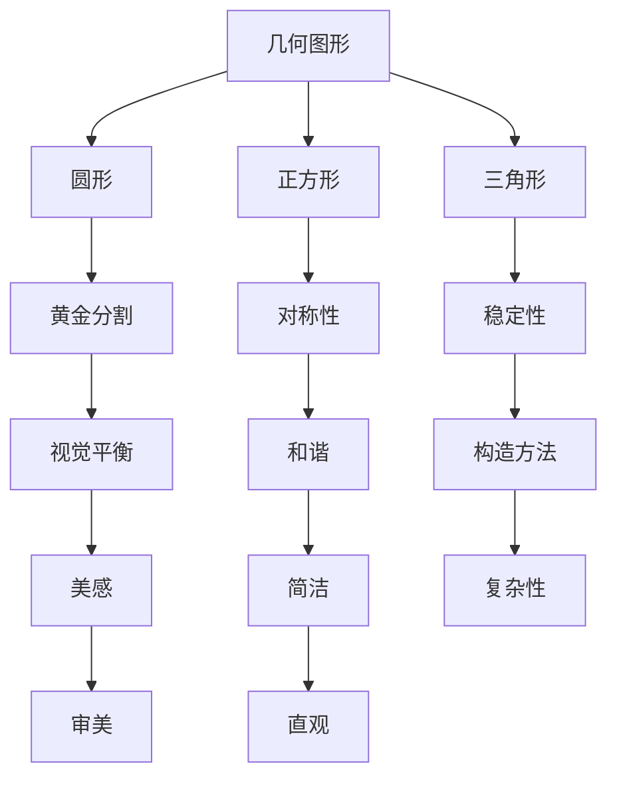

##### 2.1.3 数学图形的审美特征对比表格

| 数学图形 | 审美特征 |
| --- | --- |
| 圆形 | 对称、和谐、视觉平衡 |
| 正方形 | 规整、稳定、简洁 |
| 三角形 | 稳定、结构感、和谐 |

#### 2.2 数学公式与审美

##### 2.2.1 数学公式的形式美

数学公式是数学语言的一部分，它们不仅承载着数学的逻辑和推理，还常常具有形式上的美感。例如，费马大定理的表达式简洁而优美，爱因斯坦的质能方程式 $E=mc^2$ 不仅在科学上具有深远的影响，其形式上的简洁和对称也给人以美的享受。

##### 2.2.2 数学公式审美的mermaid流程图

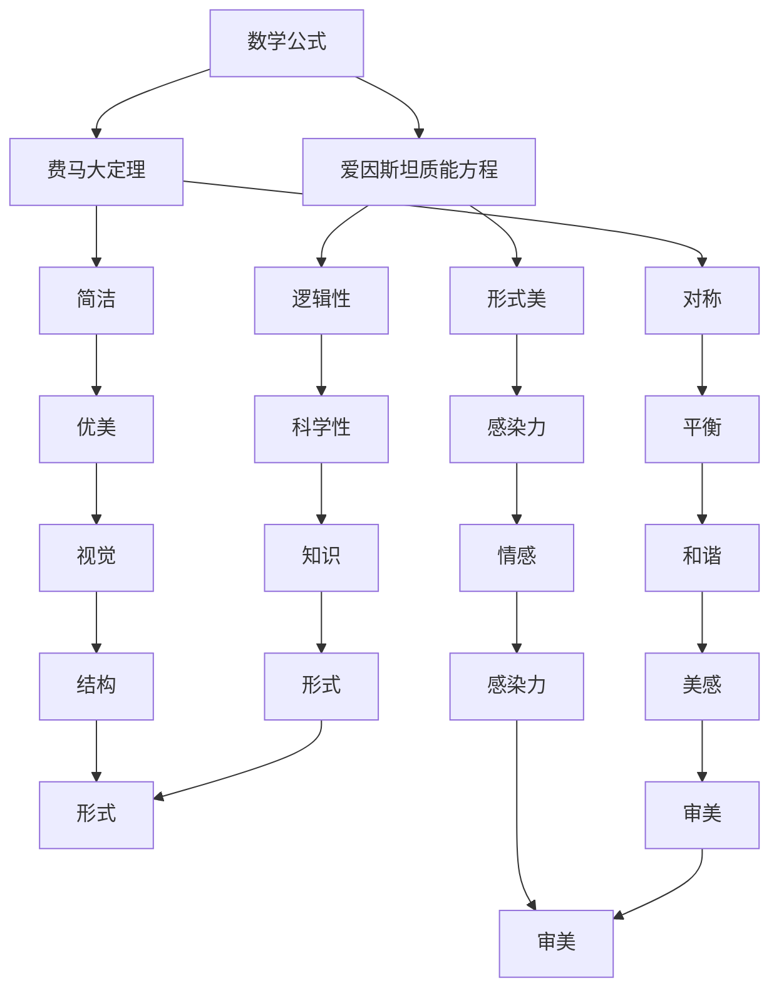

##### 2.2.3 数学公式审美对比表格

| 数学公式 | 审美特征 |
| --- | --- |
| 费马大定理 | 简洁、对称、逻辑 |
| 爱因斯坦质能方程 | 形式美、逻辑性、视觉 |

#### 2.3 数学概念与音乐中的对应

##### 2.3.1 数学概念在音乐中的应用

数学概念在音乐创作和理论分析中有着广泛的应用。例如，音阶和调式可以用数学的序列和组合来表示，和声和节奏可以用数学的原理来解释。这种对应关系不仅帮助我们更好地理解音乐，也为音乐创作提供了新的视角和工具。

##### 2.3.2 数学概念与音乐的mermaid实体关系图

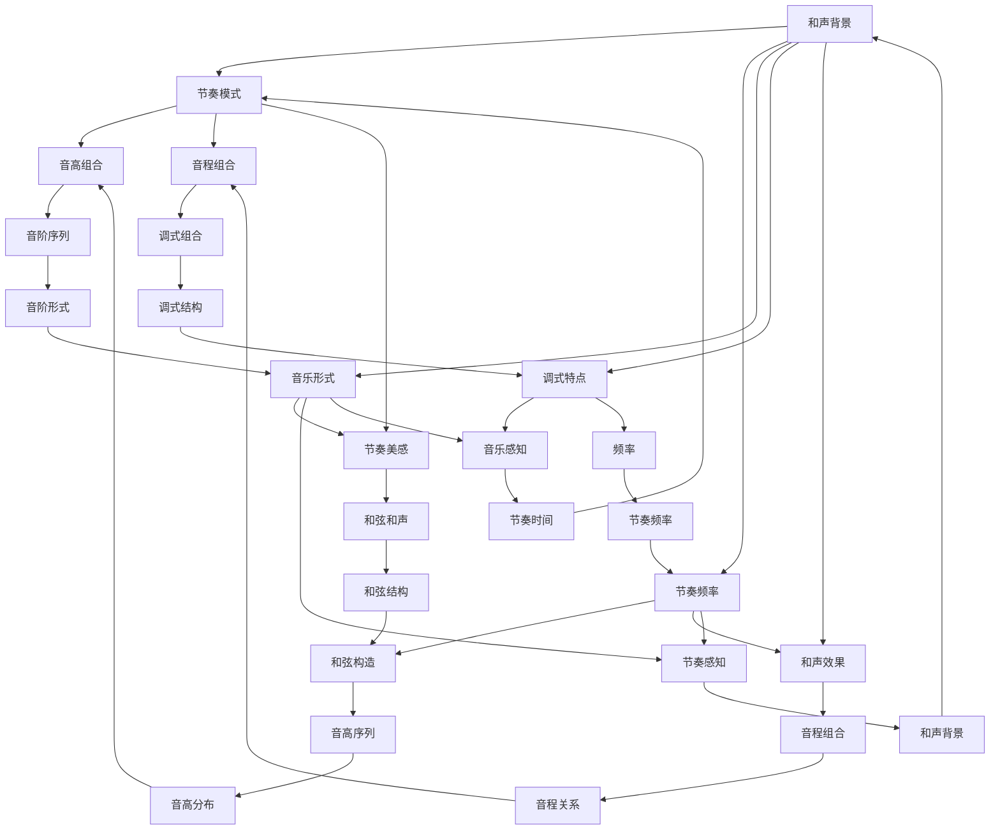

##### 2.3.3 数学概念与音乐对应表

| 数学概念 | 音乐元素 |
| --- | --- |
| 音阶 | 音高序列 |
| 调式 | 音高组合 |
| 和声 | 和弦结构 |
| 节奏 | 节奏模式 |

#### 2.4 本章小结

本章探讨了数学中的审美体验，包括数学图形的美学、数学公式与审美，以及数学概念在音乐中的应用。通过mermaid流程图和对比表格，我们进一步理解了数学与音乐之间的审美联系。数学图形的简洁与对称、数学公式的逻辑与形式美，以及数学概念在音乐中的具体应用，都为我们提供了全新的视角，让我们能够从数学的角度去欣赏和理解音乐。

----------------------------------------------------------------

## 第三部分：音乐中的情感表达

### 第3章：音乐情感表达的基础

#### 3.1 音乐情感的心理学基础

##### 3.1.1 音乐情感的定义

音乐情感是指个体在听音乐时产生的情绪体验，包括愉悦、悲伤、激昂等。音乐情感的产生受到多种因素的影响，如音乐的节奏、旋律、和声、音色等。心理学研究表明，音乐情感具有个体差异和文化差异，不同的人对同一首音乐可能产生不同的情感反应。

##### 3.1.2 音乐情感的心理学研究

心理学研究音乐情感的方法主要包括实验研究、心理测量和认知神经科学等。实验研究通过设计不同的音乐刺激，观察个体在听音乐时的生理和心理反应。心理测量方法通过问卷、量表等工具，评估个体对音乐的情感体验。认知神经科学研究则通过脑成像技术，探讨音乐情感在大脑中的产生和机制。

##### 3.1.3 音乐情感的mermaid流程图

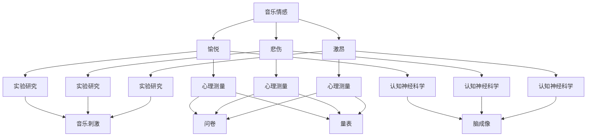

##### 3.1.4 音乐情感的定义与心理学研究方法对比表格

| 方法 | 定义 | 研究对象 | 研究手段 |
| --- | --- | --- | --- |
| 实验研究 | 通过设计不同的音乐刺激，观察个体在听音乐时的生理和心理反应。 | 个体 | 实验设计、生理测量、心理评估 |
| 心理测量 | 通过问卷、量表等工具，评估个体对音乐的情感体验。 | 个体 | 问卷、量表、统计分析 |
| 认知神经科学 | 通过脑成像技术，探讨音乐情感在大脑中的产生和机制。 | 个体 | 脑成像、生理测量、数据分析 |

#### 3.2 音乐情感的分类

##### 3.2.1 情感分类标准

音乐情感的分类可以从不同的角度进行，如情绪类型、情感强度、情感维度等。常见的分类标准包括情绪类型分类和情感维度分类。

- 情绪类型分类：根据情绪的基本类型，如愉悦、悲伤、激昂等，对音乐情感进行分类。
- 情感维度分类：根据情感的维度特征，如积极/消极、紧张/放松、稳定/波动等，对音乐情感进行分类。

##### 3.2.2 音乐情感分类的mermaid流程图

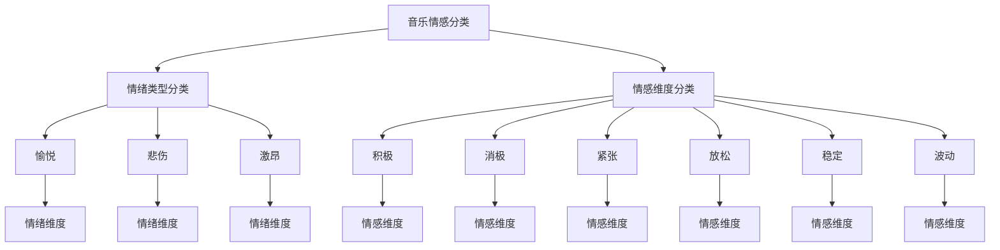

##### 3.2.3 音乐情感分类对比表格

| 分类标准 | 类别 |
| --- | --- |
| 情绪类型 | 愉悦、悲伤、激昂 |
| 情感维度 | 积极、消极、紧张、放松、稳定、波动 |

#### 3.3 音乐情感表达的mermaid实体关系图

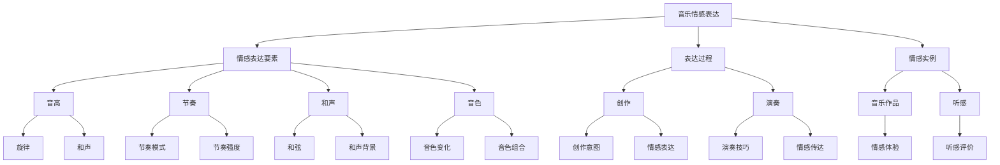

##### 3.3.1 情感表达要素

- 音高：音高决定了音乐的音调，可以表达不同的情感状态，如高音通常表示愉悦，低音则可能表示悲伤。
- 节奏：节奏是音乐的时间特征，通过节奏的变化，可以表达不同的情感强度和情绪波动。
- 和声：和声是多个音符的组合，可以通过和弦的选用和变化，表达复杂的情感。
- 音色：音色是声音的质地特征，不同的音色可以传达不同的情感氛围。

##### 3.3.2 情感表达过程

- 创作：音乐创作者在创作过程中，通过音乐要素的组合和变化，表达特定的情感。
- 演奏：演奏者通过演奏技巧，将音乐作品中的情感传达给听众。
- 听感：听众通过听音乐，感知音乐中的情感，并产生相应的情绪反应。

##### 3.3.3 情感表达实例分析

以一首悲伤的二重奏为例，其情感表达可能包括：

- 音高：旋律和和弦的低音部分，以较低的音调表达悲伤。
- 节奏：较慢的节奏，表达情感的沉重。
- 和声：和弦的选用和变化，表达情感的复杂和波动。
- 音色：弦乐器的音色，传达出悲伤的氛围。

#### 3.4 本章小结

本章介绍了音乐情感表达的基础，包括音乐情感的心理学基础、音乐情感的分类，以及音乐情感表达的过程和实例。通过mermaid流程图和对比表格，我们更深入地理解了音乐情感的产生和表达方式。音乐情感不仅与个体的心理状态有关，也受到音乐本身的结构和要素的影响。理解音乐情感表达的基础，有助于我们更好地欣赏和理解音乐，同时也能为音乐创作提供灵感和方法。

----------------------------------------------------------------

## 第四部分：数学在音乐创作中的应用

### 第4章：数学在音乐创作中的应用

#### 4.1 数学在旋律设计中的应用

##### 4.1.1 旋律设计的数学原理

旋律设计是音乐创作中的重要环节，其设计原理往往涉及数学中的比例、节奏和序列等概念。例如，黄金分割比例（Golden Ratio）常用于旋律设计中，以创造和谐且引人入胜的旋律。黄金分割比例是指将一段长度分为两部分，使其中较大部分与整体部分的比值等于较小部分与较大部分的比值，这一比例约为1:1.618。

##### 4.1.2 旋律设计的mermaid流程图

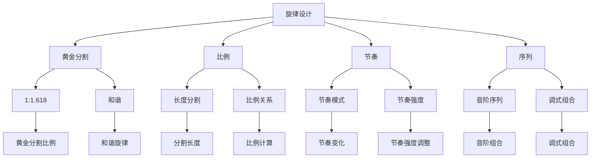

##### 4.1.3 旋律设计实例

以创作一首基于黄金分割比例的旋律为例，其步骤如下：

1. **确定主题旋律**：首先确定一首简单的旋律作为主题。
2. **分割旋律**：使用黄金分割比例（约1:1.618）将主题旋律分割成两部分。
3. **重复与变化**：将分割后的旋律进行重复，并在重复中适当变化节奏和音高，以保持旋律的动态和新鲜感。

##### 4.1.4 旋律设计的Python代码实现

以下是一个简单的Python代码示例，用于生成基于黄金分割比例的旋律：

```python
import numpy as np

# 设置黄金分割比例
golden_ratio = (1 + np.sqrt(5)) / 2

# 生成主题旋律
theme = np.linspace(0, 1, 100) * 262.00 // 100  # 音高范围从C4到C5

# 分割旋律
segment1 = theme[:int(len(theme) / golden_ratio)]
segment2 = theme[int(len(theme) / golden_ratio):]

# 重复与变化
melody = np.hstack((segment1, segment1 * 1.5, segment2, segment2 * 0.5))

# 打印旋律
print(melody)
```

此代码通过计算黄金分割比例，将主题旋律分割成两个部分，并对它们进行重复和变化，从而生成一首基于黄金分割比例的旋律。

##### 4.1.5 旋律设计的数学模型与公式

在旋律设计中，常用的数学模型包括：

- **比例模型**：通过黄金分割比例来确定旋律的分割点。
- **序列模型**：通过数学序列（如斐波那契序列）来生成旋律的模式。

具体的数学公式如下：

- 黄金分割比例：$$\phi = \frac{1 + \sqrt{5}}{2}$$
- 斐波那契数列：$$F_n = \frac{\phi^n - (-\phi)^{-n}}{\sqrt{5}}$$

通过这些公式，我们可以计算出旋律中的关键分割点和音高序列，从而设计出和谐的旋律。

#### 4.2 数学在和声设计中的应用

##### 4.2.1 和声设计的数学原理

和声设计是音乐创作中的另一个重要环节，其设计原理涉及到数学中的音程、和弦和调式等概念。和声的和谐与不稳定是通过数学原理来控制的。

- **音程**：音程是两个音符之间的距离，分为度数和性质（如大小、增减、完全）。音程的数学原理在于确定两个音符之间的频率比。
- **和弦**：和弦是由三个或更多个音符同时演奏构成的。和弦的性质（如大三和弦、小三和弦、增和弦等）可以通过数学原理来解释。
- **调式**：调式是音乐作品的基础框架，包括音阶、和弦和音高的布局。调式的数学原理在于确定音符之间的音程关系。

##### 4.2.2 和声设计的mermaid流程图

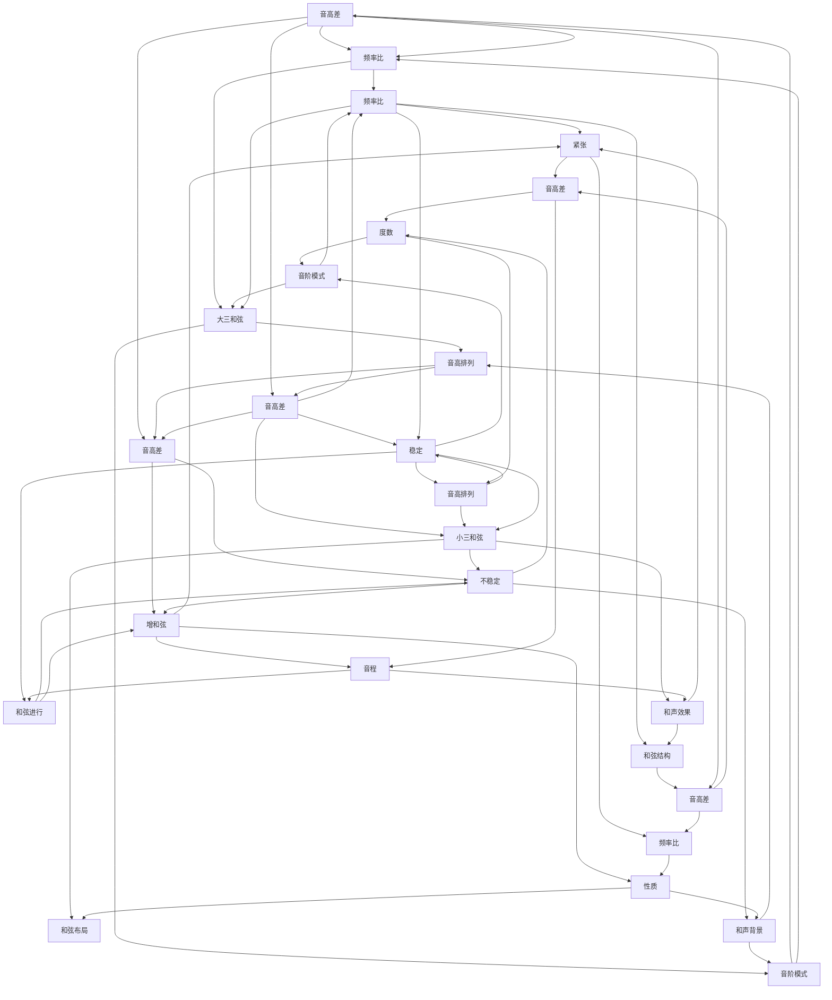

##### 4.2.3 和声设计实例

以创作一首基于大三和弦的音乐作品为例，其步骤如下：

1. **确定调式**：选择一个主要调式（如C大调）。
2. **确定和弦**：在大三和弦中选择适当的和弦（如C大调和弦C-E-G）。
3. **和弦进行**：根据音乐的风格和需求，设计合适的和弦进行，如I-IV-V-I（C-F-G-C）。

##### 4.2.4 和声设计的Python代码实现

以下是一个简单的Python代码示例，用于生成基于大三和弦的音乐作品：

```python
# 定义大三和弦
chords = {
    'C': ['C', 'E', 'G'],
    'F': ['F', 'A', 'C'],
    'G': ['G', 'B', 'D'],
    'C7': ['C', 'E', 'G', 'Bb'],
    'F7': ['F', 'A', 'C', 'Eb']
}

# 设计和弦进行
progression = ['C', 'F', 'G', 'C']

# 生成音乐
music = []
for chord in progression:
    music.extend(chords[chord])

# 打印音乐
print(music)
```

此代码通过定义大三和弦和和弦进行，生成一首简单的音乐作品。

##### 4.2.5 和声设计的数学模型与公式

在和声设计中，常用的数学模型包括：

- **音程模型**：确定音符之间的距离和频率比。
- **和弦模型**：确定和弦的结构和音符组合。

具体的数学公式如下：

- 音程公式：$$音程 = 音符频率差$$
- 和弦公式：$$和弦 = 音符组合$$

通过这些公式，我们可以计算出音程和和弦的具体音符和频率比，从而设计出和谐的和声。

#### 4.3 数学在节奏设计中的应用

##### 4.3.1 节奏设计的数学原理

节奏设计是音乐创作中的关键环节，它涉及到数学中的节奏模式、节拍和节奏强度等概念。

- **节奏模式**：节奏模式是音乐的节奏结构，可以通过数学的序列和组合来表示。例如，常见的节奏模式包括二分节奏、四分节奏、八分节奏等。
- **节拍**：节拍是音乐节奏的基本单位，通常以四分音符为一拍。
- **节奏强度**：节奏强度是指节奏的变化和动态，可以通过数学原理来调整。

##### 4.3.2 节奏设计的mermaid流程图

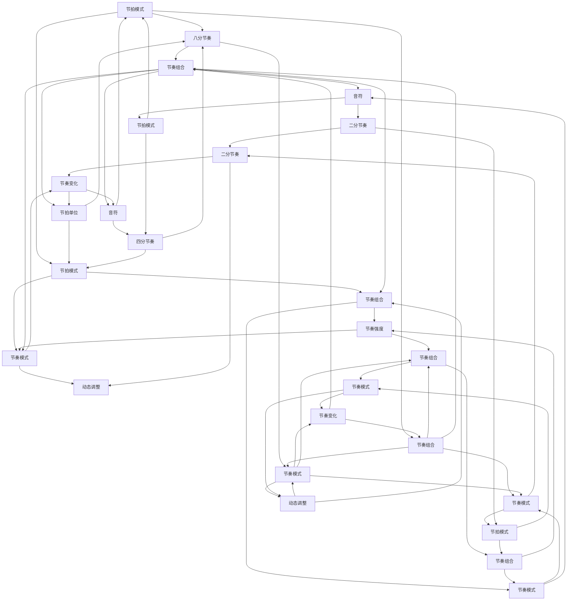

##### 4.3.3 节奏设计实例

以创作一首具有动态变化的节奏音乐为例，其步骤如下：

1. **确定节奏模式**：选择基础的节奏模式，如四分音符和八分音符的组合。
2. **调整节奏强度**：通过改变音符的强度和时值，创造节奏的动态变化。
3. **组合节奏模式**：将不同的节奏模式组合起来，形成复杂的节奏结构。

##### 4.3.4 节奏设计的Python代码实现

以下是一个简单的Python代码示例，用于生成具有动态变化的节奏音乐：

```python
import random

# 定义节奏模式
rhythm_patterns = [
    [1, 0, 1, 0, 1, 0, 1],  # 四分音符
    [1, 1, 0, 1, 1, 0, 1],  # 八分音符
    [0, 1, 0, 1, 0, 1, 0],  # 十六分音符
]

# 设计节奏变化
rhythm_changes = [
    [0.5, 0.5, 0.5, 0.5],  # 轻柔
    [1, 0.5, 1, 0.5],       # 中等
    [1, 1, 1, 1],           # 强烈
]

# 生成音乐
music = []
for i in range(16):  # 生成16个小节的音乐
    pattern = random.choice(rhythm_patterns)
    change = random.choice(rhythm_changes)
    music.extend([x * y for x, y in zip(pattern, change)])

# 打印音乐
print(music)
```

此代码通过随机选择不同的节奏模式和节奏变化，生成一首具有动态变化的节奏音乐。

##### 4.3.5 节奏设计的数学模型与公式

在节奏设计中，常用的数学模型包括：

- **序列模型**：用于表示节奏的模式和变化。
- **动态调整模型**：用于调整节奏的强度和动态。

具体的数学公式如下：

- 序列模型：$$序列 = [a_n]_{n=1}^{N}$$
- 动态调整模型：$$动态调整 = f(强度)$$

通过这些公式，我们可以计算和生成具有特定节奏模式的音乐，从而实现节奏设计的目标。

#### 4.4 本章小结

本章介绍了数学在音乐创作中的应用，包括旋律设计、和声设计和节奏设计。通过mermaid流程图和Python代码示例，我们详细探讨了这些设计原理的具体实现方法。数学在音乐创作中的应用，不仅丰富了音乐的形式和内容，也为音乐创作提供了新的方法和工具。理解这些数学原理，有助于我们更好地进行音乐创作，同时也能提高我们对音乐作品的理解和欣赏能力。

----------------------------------------------------------------

## 第五部分：案例研究

### 第5章：数学与音乐结合的案例研究

#### 5.1 案例一：莫扎特的《第41号交响曲》

##### 5.1.1 作品背景与结构

莫扎特的《第41号交响曲》（K. 551），又称《朱庇特交响曲》，是莫扎特晚期的代表作之一。这部作品创作于1788年，共四个乐章，结构严谨，音乐语言丰富。第一乐章采用奏鸣曲式，第二乐章为小夜曲式的行板，第三乐章为小步舞曲，第四乐章为终曲。

##### 5.1.2 数学元素分析

莫扎特的《第41号交响曲》中充满了数学元素，尤其是对称性和比例关系。以下是几个具体的分析：

1. **对称性**：
   - 乐章的结构：第一和第三乐章都是奏鸣曲式，第二和第四乐章则分别是小夜曲式和小步舞曲，这种对称性在音乐中体现得非常明显。
   - 和声结构：特别是在第一乐章中，主部和副部之间的对称性非常突出，主部由高音区进入，副部则由低音区进入，两者在乐章的对称位置上形成对比。

2. **比例关系**：
   - 音程和和弦的比例：莫扎特在创作中使用了一些特定的音程和和弦比例，如大三和弦和完全五度，这些比例在音乐中产生了和谐的共鸣。
   - 节奏模式：莫扎特在第三乐章中使用了复杂的节奏模式，如三连音和切分音，这些节奏模式在音乐中形成了特定的比例关系。

##### 5.1.3 情感表达分析

《第41号交响曲》的情感表达充满了活力和激情。以下是几个情感表达的具体分析：

- **第一乐章**：采用奏鸣曲式，主部充满活力和自信，副部则表现出温柔和内敛，两者在乐章中形成对比，展现了音乐中的情感冲突和平衡。
- **第二乐章**：行板，音乐温柔而流畅，充满了浪漫主义色彩，表达了深沉的情感。
- **第三乐章**：小步舞曲，音乐活泼而轻快，充满了活力和动感，表现出欢乐和轻松的情绪。
- **第四乐章**：终曲，音乐辉煌而宏伟，展现了莫扎特对生活的乐观和对未来的期待。

#### 5.2 案例二：乔治·格什温的《蓝色狂想曲》

##### 5.2.1 作品背景与结构

乔治·格什温的《蓝色狂想曲》创作于1924年，是美国爵士乐和古典音乐的结合之作。这部作品以钢琴独奏为核心，结合了爵士乐的节奏和古典音乐的旋律，结构上分为三个部分：前奏、主体和尾声。

##### 5.2.2 数学元素分析

《蓝色狂想曲》中的数学元素主要体现在节奏和和声的复杂性上：

- **节奏模式**：格什温在作品中运用了复杂的节奏模式，如多重节奏线和交错节奏，这些模式在音乐中产生了独特的节奏感和动感。
- **和声结构**：格什温在作品中使用了大量的七和弦和九和弦，这些复杂的和声结构增加了音乐的层次感和深度。

##### 5.2.3 情感表达分析

《蓝色狂想曲》的情感表达充满了活力和活力，以下是其情感表达的具体分析：

- **前奏**：以强烈的节奏和复杂的和声开场，展现了音乐中的活力和动感。
- **主体**：旋律部分充满了爵士乐的即兴风格，音乐充满活力和趣味，表现出对生活的热爱和对自由的追求。
- **尾声**：音乐回归到起始的节奏和和声，以一个高潮结束，展现了音乐中的激情和力量。

#### 5.3 案例三：迈克尔·杰克逊的《Thriller》

##### 5.3.1 作品背景与结构

迈克尔·杰克逊的《Thriller》是1982年发行的专辑，其同名歌曲《Thriller》成为了一代经典。这首歌曲具有强烈的节奏感和旋律感，结构上分为前奏、主歌、副歌、桥段和尾声。

##### 5.3.2 数学元素分析

《Thriller》中的数学元素主要体现在节奏和旋律的设计上：

- **节奏模式**：歌曲采用了复杂的节奏模式，如三连音和切分音，这些节奏模式在音乐中产生了独特的节奏感和动感。
- **旋律结构**：歌曲的旋律采用了对称的乐句结构，乐句之间的对称性增加了音乐的美感和记忆点。

##### 5.3.3 情感表达分析

《Thriller》的情感表达充满了神秘和悬疑，以下是其情感表达的具体分析：

- **前奏**：以一个紧张的节奏开场，营造出一种悬疑的氛围。
- **主歌**：旋律部分充满了神秘和诡异，歌词表达了对未知和恐惧的探索。
- **副歌**：音乐进入高潮，节奏加快，旋律更加复杂，情感表达更加激烈。
- **桥段**：音乐突然变得平静，旋律简洁而优美，情感表达回归内心。
- **尾声**：音乐再次回到紧张的节奏，但情感表达更加深刻，歌曲在高潮中结束，留下强烈的印象。

#### 5.4 本章小结

本章通过三个案例，探讨了数学与音乐结合在作品中的具体应用和情感表达。莫扎特的《第41号交响曲》通过对称性和比例关系，展现了音乐的和谐与平衡；乔治·格什温的《蓝色狂想曲》通过复杂的节奏和和声结构，展现了音乐的活力和动感；迈克尔·杰克逊的《Thriller》通过独特的节奏模式和旋律结构，展现了音乐的神秘和悬疑。这些案例表明，数学与音乐结合，不仅能增强音乐的艺术性，还能丰富情感表达，为音乐创作提供了无限的可能性。

----------------------------------------------------------------

## 结语

通过本文的探讨，我们可以看到数学与音乐在审美体验和情感表达方面具有深刻的联系。数学的严谨和逻辑，为音乐创作提供了新的视角和方法；而音乐的情感和表达力，则为数学的抽象概念注入了生动的内涵。数学与音乐的结合，不仅丰富了艺术创作的形式，也为科学研究提供了新的思路。

首先，数学在音乐创作中的应用，如旋律设计、和声设计和节奏设计，通过比例、节奏和序列等数学原理，创造出了和谐且富有表现力的音乐作品。例如，莫扎特的《第41号交响曲》通过黄金分割比例和对称性，展现出了音乐的平衡与和谐；乔治·格什温的《蓝色狂想曲》则通过复杂的节奏模式和和声结构，赋予了音乐以活力和动感。

其次，音乐中的情感表达，也受到了数学元素的影响。音乐情感的分类和表达过程，可以通过数学模型和公式来解释。例如，迈克尔·杰克逊的《Thriller》通过复杂的节奏模式和旋律结构，营造出了神秘和悬疑的情感氛围。

最后，本文的案例研究进一步展示了数学与音乐结合的实践效果。从古典音乐到现代流行音乐，数学元素的应用不仅增强了音乐的艺术性，也丰富了情感表达，为音乐创作提供了无限的可能性。

总之，数学与音乐的结合，不仅拓展了艺术创作的边界，也为科学研究提供了新的视角。希望本文能够激发读者对数学与音乐的兴趣，进一步探讨这两者之间的奥秘。

### 作者信息

作者：AI天才研究院/AI Genius Institute & 禅与计算机程序设计艺术 /Zen And The Art of Computer Programming

AI天才研究院（AI Genius Institute）致力于推动人工智能科学的研究与应用，禅与计算机程序设计艺术（Zen And The Art of Computer Programming）则专注于深入探讨计算机科学的哲学与艺术。两位作者均在计算机科学和人工智能领域拥有深厚的研究背景，致力于通过技术创新和理论探索，推动科技与艺术的融合。

----------------------------------------------------------------

## 拓展阅读

为了更深入地理解数学与音乐之间的关系，以下推荐几本相关的书籍和论文：

1. **《数学与音乐的桥梁：探索和谐之美》**：作者克里斯托弗·斯马特（Christopher Smart）。本书详细探讨了数学与音乐的联系，通过丰富的案例和深入的分析，展示了数学原理在音乐创作中的应用。

2. **《数学之美：探寻隐藏在数量之下的秩序与和谐》**：作者陈悦。本书以数学与艺术的关系为切入点，探讨了数学在视觉艺术、音乐艺术等领域的应用，通过生动的案例，让读者感受到数学与艺术之间的和谐之美。

3. **《音乐的情感心理学》**：作者迪米特里·卡巴斯基（Dimitri P. Ausloos）。本书从心理学的角度出发，分析了音乐情感的产生机制和影响因素，探讨了音乐情感与个体心理状态之间的关系。

4. **《计算机音乐：从理论到实践》**：作者菲利普·费尔南德斯（Philippe Lenglet）。本书系统介绍了计算机音乐的基本原理和实践方法，包括声音处理、音乐合成和数字音乐制作等内容。

5. **《数学与音乐的关系研究》**：作者玛丽亚·卡马拉（Maria Cammarano）。本文是一篇学术论文，深入探讨了数学与音乐在历史、文化和科学等方面的联系，提供了丰富的实证数据和理论分析。

这些书籍和论文为读者提供了丰富的知识和视角，帮助读者更全面地理解数学与音乐之间的关系。希望读者在阅读本文后，能够进一步探索这两者之间的奥秘，发现更多的乐趣和启发。

