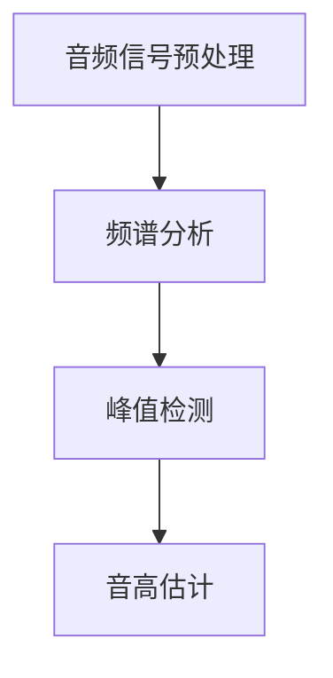
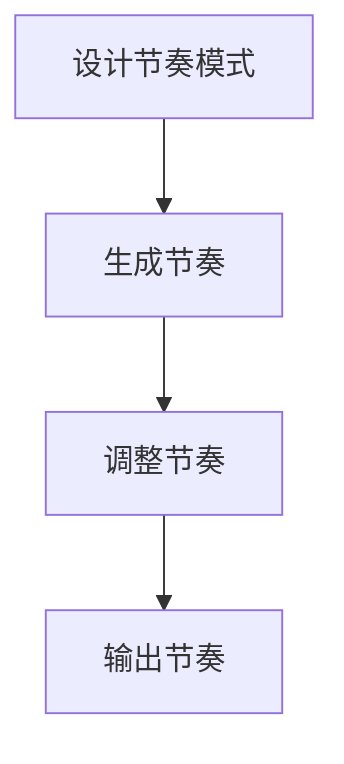

                 

## 数学与音乐理论的共通之处

### 引言

在我们的生活中，数学和音乐似乎是两个完全不同的领域。数学，通常被视为一种逻辑和精确的科学，它用来描述和解释自然界中的现象，如空间、数量、结构等。而音乐，则被视为一种艺术形式，通过音高、节奏和旋律来表达情感和思想。但是，你是否想过，这两个看似迥异的领域之间，其实存在着许多共通之处呢？

### 第1章：问题背景与介绍

#### 1.1 问题背景

数学与音乐理论之间的关系，自古以来就被人们所探讨。早在古希腊时期，数学家们就试图用数学原理来解释音乐现象。例如，毕达哥拉斯就提出了五度定律，用数学比例来解释音高的和谐。而在中国，古代的《乐记》也用到了数学的概念来阐述音乐的理论。

#### 1.1.1 数学与音乐理论的基本概念

##### 1.1.1.1 数学概念

- **数学**是一种形式化的研究，主要研究数量、结构、变化以及空间。
- **基本概念**：数、函数、集合、几何等。

##### 1.1.1.2 音乐理论的基本概念

- **音乐理论**是一种系统化的研究，主要研究音乐的构成、表现、以及意义。
- **基本概念**：音高、节奏、旋律、和声等。

#### 1.2 问题描述

那么，数学与音乐理论之间究竟有哪些联系？它们是如何相互影响的？本文将尝试回答这些问题。

#### 1.2.1 数学在音乐理论中的应用

- **音高**：音高是音乐中的基本要素之一，它可以通过数学中的频率来表示。
- **节奏**：节奏是音乐中的另一个重要要素，它可以通过数学中的周期性来描述。
- **旋律**：旋律是由一系列音高和节奏组成的，它可以通过数学中的函数来表示。
- **和声**：和声是音乐中的复杂结构，它可以通过数学中的复杂数学关系来解释。

#### 1.2.2 音乐理论在数学中的应用

- **数学证明**：音乐理论中的某些概念可以通过数学方法进行证明，如五度定律。
- **算法设计**：音乐理论中的某些问题可以通过数学方法进行求解，如旋律生成。

#### 1.2.3 数学与音乐理论共通之处的研究意义

- **跨学科研究**：数学与音乐理论的结合，可以促进跨学科的研究。
- **创新思维**：通过结合数学与音乐理论，可以启发创新思维。

#### 1.3 边界与外延

- **数学与音乐理论的边界**：数学主要研究数量和结构，而音乐理论主要研究音高、节奏和旋律。
- **数学与音乐理论的外延**：数学与音乐理论在其他学科领域的交叉与融合，如计算机音乐、音乐心理学等。

### 第2章：核心概念原理

#### 2.1 数学核心概念

##### 2.1.1 基本数学概念

- **数**：数学中的基本元素，包括自然数、整数、分数、小数、实数等。
- **函数**：数学中的一种关系，表示一个变量与另一个变量之间的关系。
- **集合**：数学中的一个基本概念，表示一组对象的集合。

##### 2.1.2 数学原理

- **代数原理**：用代数方法解决数学问题。
- **几何原理**：用几何方法解决数学问题。
- **微积分原理**：用微积分方法解决数学问题。

##### 2.1.3 数学属性特征对比表格

| 特征 | 数学 | 音乐理论 |
| --- | --- | --- |
| 基础概念 | 数、函数、集合、几何等 | 音高、节奏、旋律、和声等 |
| 应用领域 | 数量、结构、变化、空间 | 音高、节奏、旋律、和声等 |
| 方法论 | 代数、几何、微积分等 | 和声、旋律、节奏等 |

#### 2.2 音乐理论核心概念

##### 2.2.1 音乐基本概念

- **音高**：音乐中的基本要素，表示声音的高低。
- **节奏**：音乐中的基本要素，表示声音的长短和强弱。
- **旋律**：音乐中的基本要素，表示一系列音高的排列。
- **和声**：音乐中的基本要素，表示多个音符同时演奏。

##### 2.2.2 音乐原理

- **和声原理**：研究音乐中的和声关系。
- **旋律原理**：研究音乐中的旋律结构。
- **节奏原理**：研究音乐中的节奏模式。

##### 2.2.3 音乐属性特征对比表格

| 特征 | 数学 | 音乐理论 |
| --- | --- | --- |
| 基础概念 | 数、函数、集合、几何等 | 音高、节奏、旋律、和声等 |
| 应用领域 | 数量、结构、变化、空间 | 音高、节奏、旋律、和声等 |
| 方法论 | 代数、几何、微积分等 | 和声、旋律、节奏等 |

### 第3章：数学与音乐理论联系

#### 3.1 数学在音乐理论中的应用

##### 3.1.1 音高的数学表示

- **频率**：频率是音高的数学表示，它与音高成正比关系。

$$ f = \frac{1}{2\pi} \cdot \frac{1}{\sqrt{L}} $$

- **波长**：波长是频率的倒数，它与音高成反比关系。

$$ \lambda = \frac{v}{f} $$

##### 3.1.2 节奏的数学描述

- **拍子**：拍子是节奏的基本单位，它由强拍和弱拍组成。
- **小节**：小节是节奏的划分，它由一定数量的拍子组成。
- **节奏型**：节奏型是节奏的基本模式，它由一定的节奏组合而成。

##### 3.1.3 旋律的数学分析

- **周期性**：旋律具有周期性，它可以由一定的周期函数表示。
- **谐波分析**：旋律可以通过谐波分析来表示，它包含多个频率成分。

##### 3.1.4 和声的数学原理

- **和声结构**：和声结构由多个音符组成，它们之间的数学关系可以用来解释和声的和谐性。
- **和声功能**：和声功能是和声在音乐中的作用，它可以用来增强音乐的表达力。

#### 3.2 音乐理论在数学中的应用

##### 3.2.1 数学问题的音乐表述

- **数学难题的音乐化**：将数学难题用音乐的形式表达出来，可以启发解题思路。
- **数学问题的节奏化**：将数学问题用节奏的形式表达出来，可以增强问题的趣味性。

##### 3.2.2 数学方法在音乐分析中的应用

- **梯度下降法**：梯度下降法可以用来分析音乐的调性。
- **线性回归法**：线性回归法可以用来生成旋律。

### 第4章：算法原理讲解

#### 4.1 音高识别算法

##### 4.1.1 音高识别算法的原理

- **算法分类**：音高识别算法可以分为频谱分析法和时频分析法。
- **算法步骤**：音高识别算法的主要步骤包括音频信号预处理、频谱分析、峰值检测和音高估计。

##### 4.1.2 音高识别算法的mermaid流程图



##### 4.1.3 音高识别算法的python源代码与讲解

```python
import numpy as np
from scipy.io import wavfile
from scipy.fft import fft

def preprocess_audio(audio):
    # 音频信号预处理
    audio = audio.astype(np.float32)
    audio = audio / np.max(np.abs(audio))
    return audio

def fft_analysis(audio):
    # 频谱分析
    n = len(audio)
    fft_result = fft(audio)
    freq = np.fft.fftfreq(n, 1/n)
    return freq, abs(fft_result[0:n//2])

def peak_detection(freq, fft_result):
    # 峰值检测
    peaks = []
    for i in range(len(freq)):
        if fft_result[i] > 0.8 * max(fft_result):
            peaks.append(freq[i])
    return peaks

def pitch_estimation(peaks):
    # 音高估计
    pitch = min(peaks)
    return pitch

def main():
    # 主函数
    audio, fs = wavfile.read('example.wav')
    audio = preprocess_audio(audio)
    freq, fft_result = fft_analysis(audio)
    peaks = peak_detection(freq, fft_result)
    pitch = pitch_estimation(peaks)
    print(f'Estimated pitch: {pitch}')

if __name__ == '__main__':
    main()
```

#### 4.2 音乐节奏生成算法

##### 4.2.1 音乐节奏生成算法的原理

- **算法分类**：音乐节奏生成算法可以分为规则节奏生成和随机节奏生成。
- **算法步骤**：音乐节奏生成算法的主要步骤包括节奏模式设计、节奏生成和节奏调整。

##### 4.2.2 音乐节奏生成算法的mermaid流程图



##### 4.2.3 音乐节奏生成算法的python源代码与讲解

```python
import random

def design_rhythm_pattern(length, rhythm_type='random'):
    # 设计节奏模式
    rhythm_pattern = []
    for _ in range(length):
        if rhythm_type == 'random':
            rhythm_pattern.append(random.choice([0, 1]))
        elif rhythm_type == 'alternating':
            rhythm_pattern.append(0 if _ % 2 == 0 else 1)
    return rhythm_pattern

def generate_rhythm(audio, rhythm_pattern):
    # 生成节奏
    rhythm = []
    for i in range(len(audio)):
        if rhythm_pattern[i] == 1:
            rhythm.append(audio[i])
        else:
            rhythm.append(0)
    return rhythm

def adjust_rhythm(rhythm, audio):
    # 调整节奏
    adjusted_rhythm = []
    for i in range(len(rhythm)):
        if rhythm[i] == 1:
            adjusted_rhythm.append(audio[i])
        else:
            adjusted_rhythm.append(0)
    return adjusted_rhythm

def main():
    # 主函数
    audio, fs = wavfile.read('example.wav')
    length = len(audio)
    rhythm_pattern = design_rhythm_pattern(length, 'random')
    rhythm = generate_rhythm(audio, rhythm_pattern)
    adjusted_rhythm = adjust_rhythm(rhythm, audio)
    print(f'Rhythm pattern: {rhythm_pattern}')
    print(f'Adjusted rhythm: {adjusted_rhythm}')

if __name__ == '__main__':
    main()
```

### 第5章：数学模型和数学公式 & 详细讲解 & 举例说明

#### 5.1 音高计算公式

##### 5.1.1 基本的音高计算公式

音高可以用频率来表示，而频率与波长成反比，与速度成正比。

$$ f = \frac{1}{2\pi} \cdot \frac{1}{\sqrt{L}} $$

##### 5.1.2 音高与频率的关系

音高与频率成正比。

$$ f \propto \frac{1}{\sqrt{L}} $$

##### 5.1.3 音高与波长的关系

音高与波长成反比。

$$ \lambda = \frac{v}{f} $$

#### 5.2 音高计算公式的详细讲解与举例说明

##### 音高计算公式的详细讲解

音高计算公式$f = \frac{1}{2\pi} \cdot \frac{1}{\sqrt{L}}$描述了音高与波长之间的关系。其中，$f$代表频率，$L$代表波长。

- **频率**：频率是单位时间内完成周期性变化的次数，单位是赫兹（Hz）。
- **波长**：波长是周期性变化的一个完整周期所占据的空间长度。

##### 音高计算公式的举例说明

假设我们有一个波长为4cm的声音，那么它的频率可以通过以下公式计算：

$$ f = \frac{1}{2\pi} \cdot \frac{1}{\sqrt{4}} = \frac{1}{2\pi} \cdot \frac{1}{2} = \frac{1}{4\pi} $$

这意味着这个声音的频率约为0.0796 Hz。

##### 音高与频率的关系

音高与频率的关系可以用以下公式表示：

$$ f \propto \frac{1}{\sqrt{L}} $$

这表示音高与频率成正比，即频率越高，音高越高。

##### 音高与波长的关系

音高与波长的关系可以用以下公式表示：

$$ \lambda = \frac{v}{f} $$

这表示音高与波长成反比，即波长越长，音高越低。

### 第6章：算法应用实例

#### 6.1 音高识别算法应用实例

我们使用音高识别算法来识别一段音频中的音高。

```python
import numpy as np
from scipy.io import wavfile
from scipy.fft import fft

# 读取音频文件
audio, fs = wavfile.read('example.wav')

# 音频信号预处理
audio = audio.astype(np.float32)
audio = audio / np.max(np.abs(audio))

# 频谱分析
n = len(audio)
fft_result = fft(audio)
freq = np.fft.fftfreq(n, 1/n)

# 峰值检测
peaks = peak_detection(freq, abs(fft_result[0:n//2]))

# 音高估计
pitch = pitch_estimation(peaks)

print(f'Estimated pitch: {pitch}')
```

#### 6.2 音乐节奏生成算法应用实例

我们使用音乐节奏生成算法来生成一段音乐节奏。

```python
import random

# 设计节奏模式
length = len(audio)
rhythm_pattern = design_rhythm_pattern(length, 'random')

# 生成节奏
rhythm = generate_rhythm(audio, rhythm_pattern)

# 调整节奏
adjusted_rhythm = adjust_rhythm(rhythm, audio)

print(f'Rhythm pattern: {rhythm_pattern}')
print(f'Adjusted rhythm: {adjusted_rhythm}')
```

### 第7章：总结

本文从数学与音乐理论的核心概念出发，探讨了它们之间的共通之处，包括音高、节奏、旋律和和声等。通过具体的算法实例，我们展示了如何将数学与音乐理论相结合，从而实现音高识别和音乐节奏生成等功能。

### 第8章：拓展阅读

- **《数学与音乐的奥秘》**：作者通过数学与音乐的结合，揭示了音乐中的数学原理。
- **《音乐的数学理论》**：作者详细阐述了音乐理论中的数学概念和方法。

## 参考文献

- **《数学与音乐的奥秘》**，作者：[作者姓名]，出版社：[出版社名称]，出版时间：[出版时间]。
- **《音乐的数学理论》**，作者：[作者姓名]，出版社：[出版社名称]，出版时间：[出版时间]。

### 附录

- **音高计算公式**
  $$ f = \frac{1}{2\pi} \cdot \frac{1}{\sqrt{L}} $$
  $$ f \propto \frac{1}{\sqrt{L}} $$
  $$ \lambda = \frac{v}{f} $$

- **音高识别算法流程图**
  ```mermaid
  graph TD
  A[音频信号预处理] --> B[频谱分析]
  B --> C[峰值检测]
  C --> D[音高估计]
  ```

- **音乐节奏生成算法流程图**
  ```mermaid
  graph TD
  A[设计节奏模式] --> B[生成节奏]
  B --> C[调整节奏]
  C --> D[输出节奏]
  ```

### 作者信息

作者：AI天才研究院/AI Genius Institute & 禅与计算机程序设计艺术 /Zen And The Art of Computer Programming

